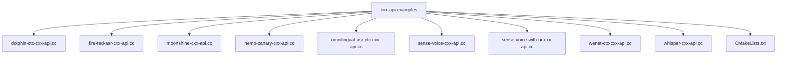
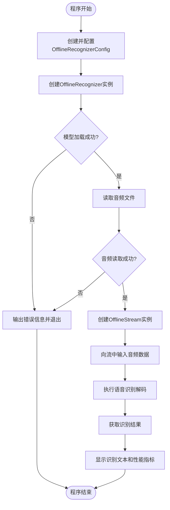
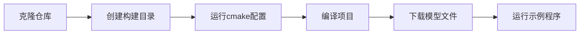

# 非流式语音识别示例

<cite>
**本文档中引用的文件**  
- [dolphin-ctc-cxx-api.cc](file://cxx-api-examples/dolphin-ctc-cxx-api.cc)
- [fire-red-asr-cxx-api.cc](file://cxx-api-examples/fire-red-asr-cxx-api.cc)
- [moonshine-cxx-api.cc](file://cxx-api-examples/moonshine-cxx-api.cc)
- [nemo-canary-cxx-api.cc](file://cxx-api-examples/nemo-canary-cxx-api.cc)
- [omnilingual-asr-ctc-cxx-api.cc](file://cxx-api-examples/omnilingual-asr-ctc-cxx-api.cc)
- [sense-voice-cxx-api.cc](file://cxx-api-examples/sense-voice-cxx-api.cc)
- [sense-voice-with-hr-cxx-api.cc](file://cxx-api-examples/sense-voice-with-hr-cxx-api.cc)
- [wenet-ctc-cxx-api.cc](file://cxx-api-examples/wenet-ctc-cxx-api.cc)
- [whisper-cxx-api.cc](file://cxx-api-examples/whisper-cxx-api.cc)
- [cxx-api.h](file://sherpa-onnx/c-api/cxx-api.h)
- [CMakeLists.txt](file://cxx-api-examples/CMakeLists.txt)
</cite>

## 目录
1. [简介](#简介)
2. [项目结构](#项目结构)
3. [核心组件](#核心组件)
4. [非流式ASR模型配置详解](#非流式asr模型配置详解)
5. [通用代码流程分析](#通用代码流程分析)
6. [各模型配置差异与适用场景](#各模型配置差异与适用场景)
7. [构建与运行步骤](#构建与运行步骤)
8. [结论](#结论)

## 简介
本项目展示了如何使用sherpa-onnx的C++ API进行非流式语音识别。通过一系列示例程序，演示了多种先进的ASR模型在离线场景下的应用，包括Dolphin CTC、Fire Red ASR、Moonshine、Nemo Canary、Omnilingual ASR CTC、SenseVoice、SenseVoice with HR、Wenet CTC和Whisper等模型。这些示例提供了完整的端到端语音识别解决方案，从模型加载到音频处理再到结果输出。

## 项目结构
项目结构清晰地组织了各种API示例，其中C++ API示例位于`cxx-api-examples`目录下。每个模型都有独立的示例文件，遵循统一的命名规范`{model_name}-cxx-api.cc`。构建系统使用CMake进行管理，通过`CMakeLists.txt`文件定义了所有示例程序的编译规则。

**图示来源**
- [dolphin-ctc-cxx-api.cc](file://cxx-api-examples/dolphin-ctc-cxx-api.cc)
- [fire-red-asr-cxx-api.cc](file://cxx-api-examples/fire-red-asr-cxx-api.cc)
- [moonshine-cxx-api.cc](file://cxx-api-examples/moonshine-cxx-api.cc)
- [nemo-canary-cxx-api.cc](file://cxx-api-examples/nemo-canary-cxx-api.cc)
- [omnilingual-asr-ctc-cxx-api.cc](file://cxx-api-examples/omnilingual-asr-ctc-cxx-api.cc)
- [sense-voice-cxx-api.cc](file://cxx-api-examples/sense-voice-cxx-api.cc)
- [sense-voice-with-hr-cxx-api.cc](file://cxx-api-examples/sense-voice-with-hr-cxx-api.cc)
- [wenet-ctc-cxx-api.cc](file://cxx-api-examples/wenet-ctc-cxx-api.cc)
- [whisper-cxx-api.cc](file://cxx-api-examples/whisper-cxx-api.cc)
- [CMakeLists.txt](file://cxx-api-examples/CMakeLists.txt)

## 核心组件
非流式语音识别的核心组件包括`OfflineRecognizer`类、`OfflineStream`类和`OfflineRecognizerConfig`配置结构体。这些组件共同构成了语音识别的基础架构，通过C++封装的API提供简洁易用的接口。

**本节来源**
- [cxx-api.h](file://sherpa-onnx/c-api/cxx-api.h#L214-L379)

## 非流式ASR模型配置详解
非流式ASR模型的配置主要通过`OfflineRecognizerConfig`结构体完成，该结构体包含特征配置、模型配置和语言模型配置等部分。不同模型的具体配置参数有所不同，但都遵循统一的配置框架。

### Dolphin CTC模型配置
Dolphin CTC模型使用简单的单文件模型架构，配置时只需指定模型文件和词元文件路径。

**本节来源**
- [dolphin-ctc-cxx-api.cc](file://cxx-api-examples/dolphin-ctc-cxx-api.cc#L27-L28)

### Fire Red ASR模型配置
Fire Red ASR模型采用编码器-解码器架构，需要分别指定编码器和解码器的ONNX模型文件。

**本节来源**
- [fire-red-asr-cxx-api.cc](file://cxx-api-examples/fire-red-asr-cxx-api.cc#L25-L28)

### Moonshine模型配置
Moonshine模型具有复杂的多组件架构，包括预处理器、编码器和两种解码器（缓存和非缓存），需要为每个组件指定对应的模型文件。

**本节来源**
- [moonshine-cxx-api.cc](file://cxx-api-examples/moonshine-cxx-api.cc#L25-L32)

### Nemo Canary模型配置
Nemo Canary模型支持多语言翻译识别，配置时需要指定编码器、解码器、源语言和目标语言等参数。

**本节来源**
- [nemo-canary-cxx-api.cc](file://cxx-api-examples/nemo-canary-cxx-api.cc#L30-L39)

### Omnilingual ASR CTC模型配置
Omnilingual ASR CTC模型设计用于支持大量语言的统一识别，配置方式与Dolphin CTC类似，但模型规模更大。

**本节来源**
- [omnilingual-asr-ctc-cxx-api.cc](file://cxx-api-examples/omnilingual-asr-ctc-cxx-api.cc#L26-L27)

### SenseVoice模型配置
SenseVoice模型支持多语言混合识别，配置时可以指定语言自动检测功能和逆文本归一化（ITN）选项。

**本节来源**
- [sense-voice-cxx-api.cc](file://cxx-api-examples/sense-voice-cxx-api.cc#L25-L28)

### SenseVoice with HR模型配置
在基础SenseVoice配置基础上，增加了同音字替换规则配置，需要指定字典目录、词典文件和替换规则FST文件。

**本节来源**
- [sense-voice-with-hr-cxx-api.cc](file://cxx-api-examples/sense-voice-with-hr-cxx-api.cc#L39-L45)

### Wenet CTC模型配置
Wenet CTC模型采用传统的CTC架构，配置方式与其他单模型CTC系统类似。

**本节来源**
- [wenet-ctc-cxx-api.cc](file://cxx-api-examples/wenet-ctc-cxx-api.cc#L26-L27)

### Whisper模型配置
Whisper模型同样采用编码器-解码器架构，需要分别指定编码器和解码器的模型文件。

**本节来源**
- [whisper-cxx-api.cc](file://cxx-api-examples/whisper-cxx-api.cc#L25-L28)

## 通用代码流程分析
所有非流式ASR示例遵循相同的代码执行流程，确保了一致性和可维护性。

**图示来源**
- [dolphin-ctc-cxx-api.cc](file://cxx-api-examples/dolphin-ctc-cxx-api.cc#L22-L75)
- [fire-red-asr-cxx-api.cc](file://cxx-api-examples/fire-red-asr-cxx-api.cc#L21-L76)
- [moonshine-cxx-api.cc](file://cxx-api-examples/moonshine-cxx-api.cc#L21-L80)

## 各模型配置差异与适用场景
不同ASR模型针对特定应用场景进行了优化，具有不同的配置需求和适用特点。

| 模型名称 | 模型架构 | 主要特点 | 适用场景 |
|---------|--------|--------|--------|
| **Dolphin CTC** | 单模型CTC | 多语言支持，轻量级 | 资源受限设备上的多语言识别 |
| **Fire Red ASR** | 编码器-解码器 | 中英双语优化 | 中英文混合语音识别 |
| **Moonshine** | 多组件模型 | 高精度英文识别 | 英文语音转录 |
| **Nemo Canary** | 编码器-解码器 | 多语言翻译识别 | 跨语言语音翻译 |
| **Omnilingual ASR CTC** | 单模型CTC | 支持1600种语言 | 极大多语言识别场景 |
| **SenseVoice** | 统一模型 | 多语言混合识别 | 东亚语言混合语音识别 |
| **SenseVoice with HR** | 增强型SenseVoice | 同音字替换功能 | 需要精确汉字输出的场景 |
| **Wenet CTC** | CTC模型 | 方言支持 | 粤语等方言识别 |
| **Whisper** | 编码器-解码器 | 鲁棒性强 | 通用语音识别 |

**本节来源**
- [dolphin-ctc-cxx-api.cc](file://cxx-api-examples/dolphin-ctc-cxx-api.cc)
- [fire-red-asr-cxx-api.cc](file://cxx-api-examples/fire-red-asr-cxx-api.cc)
- [moonshine-cxx-api.cc](file://cxx-api-examples/moonshine-cxx-api.cc)
- [nemo-canary-cxx-api.cc](file://cxx-api-examples/nemo-canary-cxx-api.cc)
- [omnilingual-asr-ctc-cxx-api.cc](file://cxx-api-examples/omnilingual-asr-ctc-cxx-api.cc)
- [sense-voice-cxx-api.cc](file://cxx-api-examples/sense-voice-cxx-api.cc)
- [sense-voice-with-hr-cxx-api.cc](file://cxx-api-examples/sense-voice-with-hr-cxx-api.cc)
- [wenet-ctc-cxx-api.cc](file://cxx-api-examples/wenet-ctc-cxx-api.cc)
- [whisper-cxx-api.cc](file://cxx-api-examples/whisper-cxx-api.cc)

## 构建与运行步骤
构建和运行这些示例程序需要遵循标准的CMake流程，并确保模型文件正确下载。

**图示来源**
- [CMakeLists.txt](file://cxx-api-examples/CMakeLists.txt)
- [dolphin-ctc-cxx-api.cc](file://cxx-api-examples/dolphin-ctc-cxx-api.cc#L10-L12)

### 构建步骤
1. 克隆sherpa-onnx仓库
2. 创建构建目录并进入
3. 运行`cmake`命令配置项目
4. 运行`make`命令编译

### 运行步骤
1. 根据示例中的wget命令下载对应的模型文件
2. 解压模型文件到指定目录
3. 确保测试音频文件存在
4. 执行编译生成的可执行文件

## 结论
sherpa-onnx的非流式语音识别C++ API提供了一套完整、统一且高效的解决方案，支持多种先进的ASR模型。通过标准化的API设计，开发者可以轻松地在不同模型之间切换，同时保持代码结构的一致性。各个模型针对不同的应用场景进行了优化，从多语言支持到方言识别，从轻量级部署到高精度转录，满足了多样化的语音识别需求。统一的代码流程和清晰的配置结构使得集成和维护变得更加简单，为实际应用提供了坚实的基础。