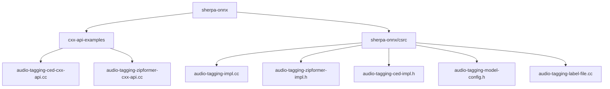
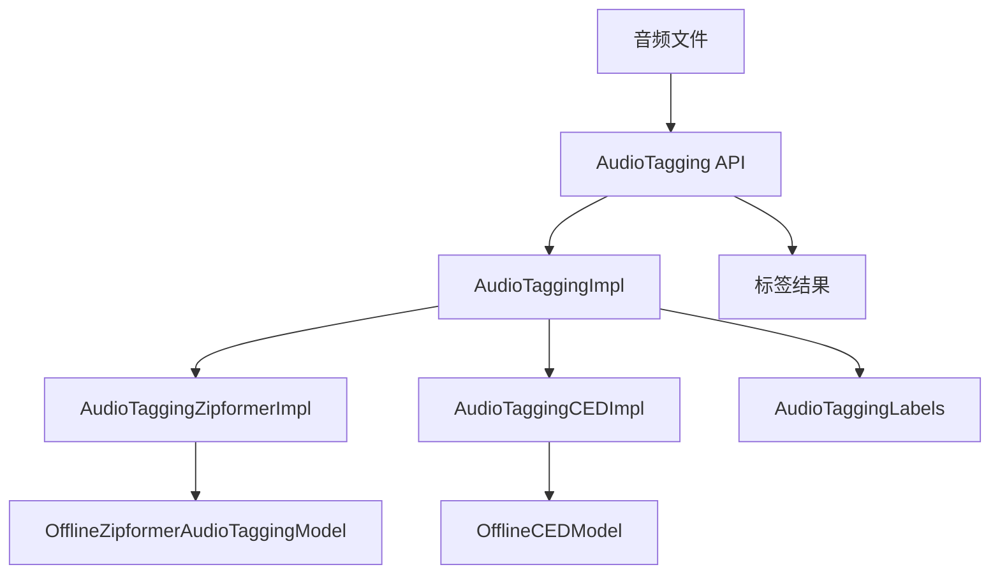
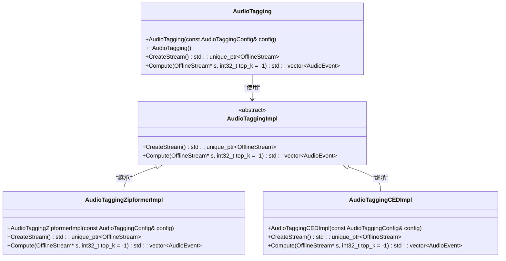
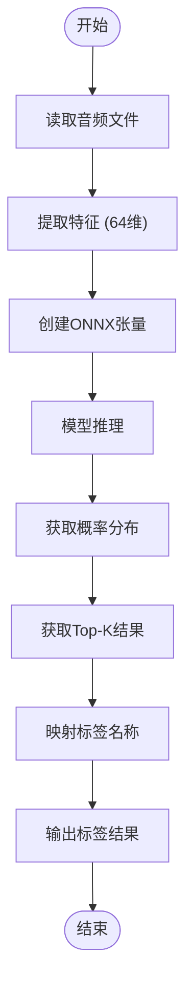
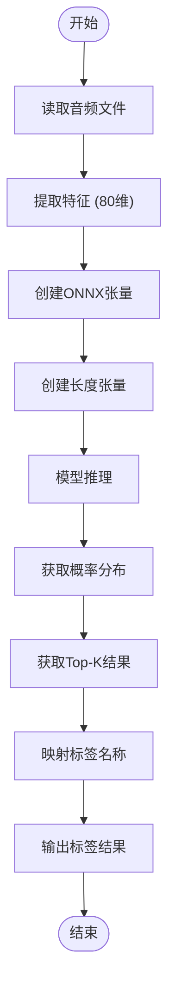
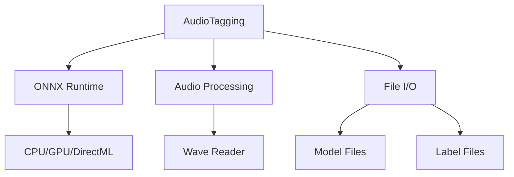

# 音频标签示例

<cite>
**本文档中引用的文件**   
- [audio-tagging-ced-cxx-api.cc](file://cxx-api-examples/audio-tagging-ced-cxx-api.cc)
- [audio-tagging-zipformer-cxx-api.cc](file://cxx-api-examples/audio-tagging-zipformer-cxx-api.cc)
- [audio-tagging-model-config.h](file://sherpa-onnx/csrc/audio-tagging-model-config.h)
- [audio-tagging-impl.cc](file://sherpa-onnx/csrc/audio-tagging-impl.cc)
- [audio-tagging-label-file.cc](file://sherpa-onnx/csrc/audio-tagging-label-file.cc)
- [audio-tagging-zipformer-impl.h](file://sherpa-onnx/csrc/audio-tagging-zipformer-impl.h)
- [audio-tagging-ced-impl.h](file://sherpa-onnx/csrc/audio-tagging-ced-impl.h)
- [audio-tagging.cc](file://sherpa-onnx/csrc/audio-tagging.cc)
- [offline-zipformer-audio-tagging-model.cc](file://sherpa-onnx/csrc/offline-zipformer-audio-tagging-model.cc)
- [offline-ced-model.cc](file://sherpa-onnx/csrc/offline-ced-model.cc)
</cite>

## 目录
1. [简介](#简介)
2. [项目结构](#项目结构)
3. [核心组件](#核心组件)
4. [架构概述](#架构概述)
5. [详细组件分析](#详细组件分析)
6. [依赖分析](#依赖分析)
7. [性能考虑](#性能考虑)
8. [故障排除指南](#故障排除指南)
9. [结论](#结论)

## 简介
本文档深入解析sherpa-onnx音频标签C++ API示例，重点关注CED和Zipformer两种音频标签模型的实现。文档详细说明了如何使用AudioTagging类，配置AudioTaggingModelConfig参数，加载音频标签模型，并对音频文件进行分类和标签预测。同时解释了如何读取和解析标签文件，以及如何处理模型输出的标签概率分布。提供了完整的代码流程解析，从音频文件读取、特征提取、模型推理到标签结果输出的全过程。文档还说明了不同音频标签模型的特点和适用场景，并提供了构建和运行这些示例的具体步骤。

## 项目结构
sherpa-onnx项目包含多个API示例，其中音频标签相关的C++示例位于`cxx-api-examples`目录下。项目结构清晰地分离了不同功能的示例代码，音频标签功能有专门的示例文件。



**Diagram sources**
- [audio-tagging-ced-cxx-api.cc](file://cxx-api-examples/audio-tagging-ced-cxx-api.cc)
- [audio-tagging-zipformer-cxx-api.cc](file://cxx-api-examples/audio-tagging-zipformer-cxx-api.cc)
- [audio-tagging-impl.cc](file://sherpa-onnx/csrc/audio-tagging-impl.cc)
- [audio-tagging-zipformer-impl.h](file://sherpa-onnx/csrc/audio-tagging-zipformer-impl.h)
- [audio-tagging-ced-impl.h](file://sherpa-onnx/csrc/audio-tagging-ced-impl.h)
- [audio-tagging-model-config.h](file://sherpa-onnx/csrc/audio-tagging-model-config.h)
- [audio-tagging-label-file.cc](file://sherpa-onnx/csrc/audio-tagging-label-file.cc)

**Section sources**
- [audio-tagging-ced-cxx-api.cc](file://cxx-api-examples/audio-tagging-ced-cxx-api.cc)
- [audio-tagging-zipformer-cxx-api.cc](file://cxx-api-examples/audio-tagging-zipformer-cxx-api.cc)

## 核心组件
音频标签功能的核心组件包括AudioTagging类、AudioTaggingModelConfig配置类、AudioTaggingImpl实现类以及相关的模型和标签文件处理类。这些组件共同协作，实现了从音频文件输入到标签预测输出的完整流程。

**Section sources**
- [audio-tagging.cc](file://sherpa-onnx/csrc/audio-tagging.cc)
- [audio-tagging-model-config.h](file://sherpa-onnx/csrc/audio-tagging-model-config.h)
- [audio-tagging-impl.cc](file://sherpa-onnx/csrc/audio-tagging-impl.cc)

## 架构概述
音频标签系统的架构采用分层设计，上层是API接口，中间是实现逻辑，底层是模型推理。系统通过AudioTagging类提供统一的接口，内部根据配置选择不同的模型实现（CED或Zipformer），并处理标签文件的解析和结果的生成。



**Diagram sources**
- [audio-tagging.cc](file://sherpa-onnx/csrc/audio-tagging.cc)
- [audio-tagging-impl.cc](file://sherpa-onnx/csrc/audio-tagging-impl.cc)
- [audio-tagging-zipformer-impl.h](file://sherpa-onnx/csrc/audio-tagging-zipformer-impl.h)
- [audio-tagging-ced-impl.h](file://sherpa-onnx/csrc/audio-tagging-ced-impl.h)
- [offline-zipformer-audio-tagging-model.cc](file://sherpa-onnx/csrc/offline-zipformer-audio-tagging-model.cc)
- [offline-ced-model.cc](file://sherpa-onnx/csrc/offline-ced-model.cc)

## 详细组件分析

### AudioTagging类分析
AudioTagging类是音频标签功能的主要接口，提供了创建流、接受音频波形和计算标签结果的方法。该类通过工厂模式创建相应的实现类，根据配置选择使用CED或Zipformer模型。

#### AudioTagging类结构


**Diagram sources**
- [audio-tagging.cc](file://sherpa-onnx/csrc/audio-tagging.cc)
- [audio-tagging-impl.cc](file://sherpa-onnx/csrc/audio-tagging-impl.cc)
- [audio-tagging-zipformer-impl.h](file://sherpa-onnx/csrc/audio-tagging-zipformer-impl.h)
- [audio-tagging-ced-impl.h](file://sherpa-onnx/csrc/audio-tagging-ced-impl.h)

**Section sources**
- [audio-tagging.cc](file://sherpa-onnx/csrc/audio-tagging.cc)
- [audio-tagging-impl.cc](file://sherpa-onnx/csrc/audio-tagging-impl.cc)

### AudioTaggingModelConfig配置分析
AudioTaggingModelConfig类用于配置音频标签模型的参数，包括模型路径、线程数、调试模式和提供程序等。该配置类是使用音频标签功能的第一步，正确配置是成功运行模型的前提。

#### 配置参数说明
| 参数 | 类型 | 描述 |
|------|------|------|
| zipformer | OfflineZipformerAudioTaggingModelConfig | Zipformer模型配置 |
| ced | std::string | CED模型路径 |
| num_threads | int32_t | 运行神经网络的线程数 |
| debug | bool | 加载模型时是否打印信息 |
| provider | std::string | 指定使用的提供程序：cpu, cuda, coreml |

**Section sources**
- [audio-tagging-model-config.h](file://sherpa-onnx/csrc/audio-tagging-model-config.h)
- [audio-tagging-model-config.cc](file://sherpa-onnx/csrc/audio-tagging-model-config.cc)

### CED模型实现分析
CED模型实现通过AudioTaggingCEDImpl类完成，该类继承自AudioTaggingImpl抽象基类。CED模型具有固定的64维特征维度，适用于特定的音频标签任务。

#### CED模型处理流程


**Diagram sources**
- [audio-tagging-ced-impl.h](file://sherpa-onnx/csrc/audio-tagging-ced-impl.h)
- [offline-ced-model.cc](file://sherpa-onnx/csrc/offline-ced-model.cc)

**Section sources**
- [audio-tagging-ced-impl.h](file://sherpa-onnx/csrc/audio-tagging-ced-impl.h)
- [offline-ced-model.cc](file://sherpa-onnx/csrc/offline-ced-model.cc)

### Zipformer模型实现分析
Zipformer模型实现通过AudioTaggingZipformerImpl类完成，该类同样继承自AudioTaggingImpl抽象基类。Zipformer模型具有固定的80维特征维度，适用于更广泛的音频标签任务。

#### Zipformer模型处理流程


**Diagram sources**
- [audio-tagging-zipformer-impl.h](file://sherpa-onnx/csrc/audio-tagging-zipformer-impl.h)
- [offline-zipformer-audio-tagging-model.cc](file://sherpa-onnx/csrc/offline-zipformer-audio-tagging-model.cc)

**Section sources**
- [audio-tagging-zipformer-impl.h](file://sherpa-onnx/csrc/audio-tagging-zipformer-impl.h)
- [offline-zipformer-audio-tagging-model.cc](file://sherpa-onnx/csrc/offline-zipformer-audio-tagging-model.cc)

### 标签文件处理分析
标签文件处理通过AudioTaggingLabels类完成，该类负责读取和解析CSV格式的标签文件。标签文件包含索引、MID和显示名称三列，系统使用索引和显示名称来映射模型输出的分类结果。

#### 标签文件格式
```csv
index,mid,display_name
0,/m/09x0r,"Speech"
1,/m/05zppz,"Male speech, man speaking"
2,/m/02zsn,"Female speech, woman speaking"
```

**Section sources**
- [audio-tagging-label-file.cc](file://sherpa-onnx/csrc/audio-tagging-label-file.cc)

## 依赖分析
音频标签系统依赖于多个外部库和内部组件，包括ONNX Runtime用于模型推理，以及各种音频处理和文件读取工具。



**Diagram sources**
- [audio-tagging.cc](file://sherpa-onnx/csrc/audio-tagging.cc)
- [audio-tagging-impl.cc](file://sherpa-onnx/csrc/audio-tagging-impl.cc)
- [offline-zipformer-audio-tagging-model.cc](file://sherpa-onnx/csrc/offline-zipformer-audio-tagging-model.cc)
- [offline-ced-model.cc](file://sherpa-onnx/csrc/offline-ced-model.cc)

**Section sources**
- [audio-tagging.cc](file://sherpa-onnx/csrc/audio-tagging.cc)
- [audio-tagging-impl.cc](file://sherpa-onnx/csrc/audio-tagging-impl.cc)

## 性能考虑
音频标签系统的性能受多个因素影响，包括模型复杂度、线程数配置、硬件加速和音频文件大小。系统通过多线程和硬件加速（如CUDA、DirectML）来提高推理速度。

- **实时因子(RTF)**: 系统计算并输出实时因子，用于评估处理速度
- **多线程支持**: 可通过num_threads参数配置线程数
- **硬件加速**: 支持CPU、CUDA和Core ML提供程序
- **模型优化**: 提供int8量化模型以减少内存占用和提高速度

## 故障排除指南
在使用音频标签功能时可能遇到的常见问题及解决方案：

1. **模型文件不存在**: 确保模型路径正确，文件已下载
2. **标签文件格式错误**: 检查CSV文件格式是否符合要求
3. **内存不足**: 减少线程数或使用量化模型
4. **推理速度慢**: 启用硬件加速或减少音频文件大小
5. **类数量不匹配**: 确保模型输出类数与标签文件行数一致

**Section sources**
- [audio-tagging-impl.cc](file://sherpa-onnx/csrc/audio-tagging-impl.cc)
- [audio-tagging-label-file.cc](file://sherpa-onnx/csrc/audio-tagging-label-file.cc)

## 结论
sherpa-onnx的音频标签C++ API提供了强大而灵活的音频分类功能，支持CED和Zipformer两种模型。通过清晰的类结构和配置系统，开发者可以轻松集成音频标签功能到自己的应用中。系统具有良好的性能和可扩展性，适用于各种音频处理场景。建议根据具体需求选择合适的模型和配置，以获得最佳的性能和准确性。