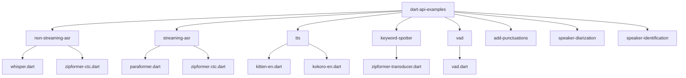
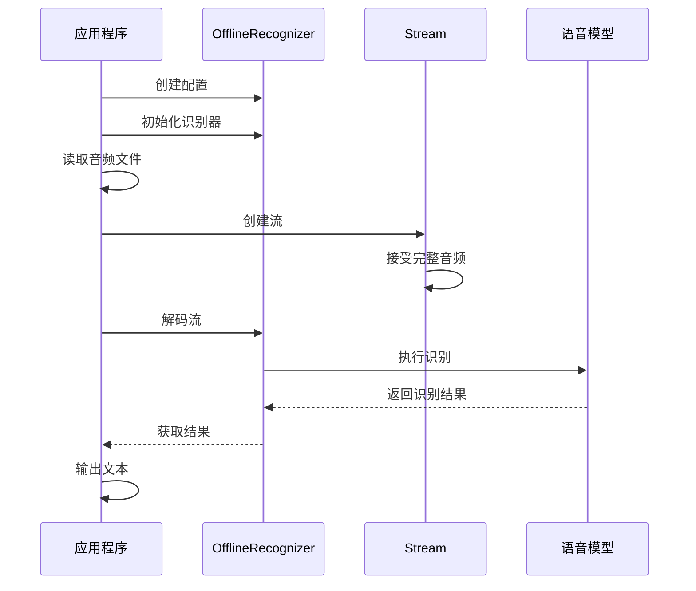
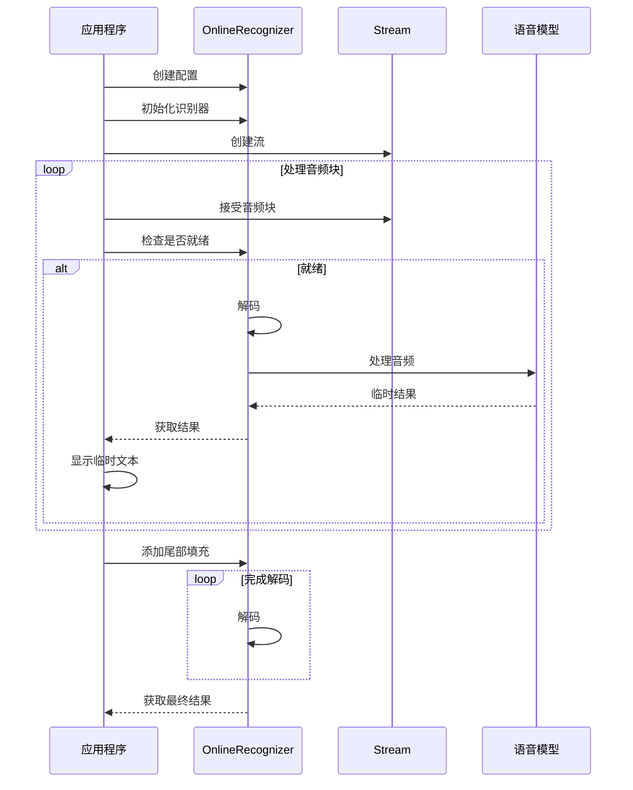
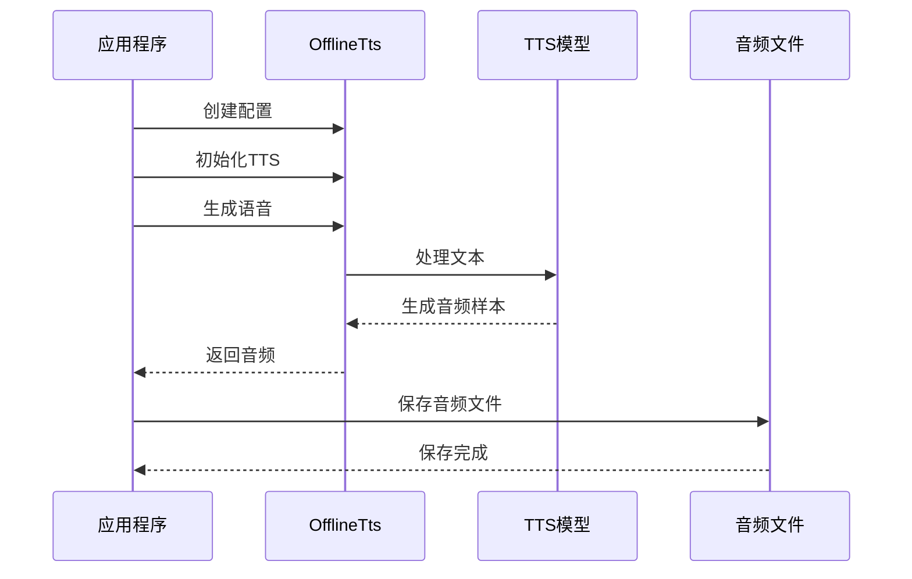
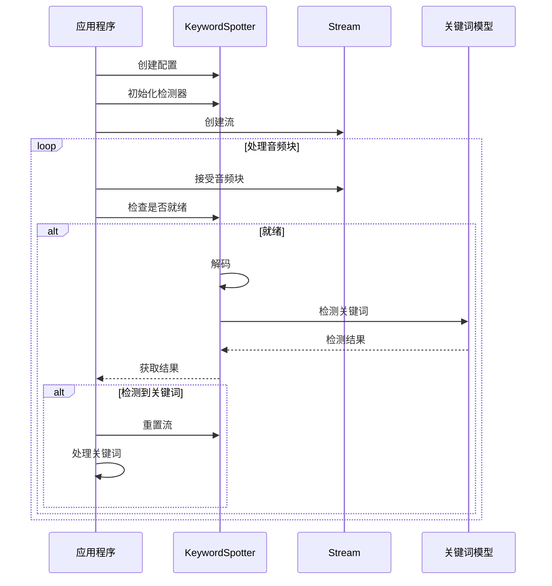
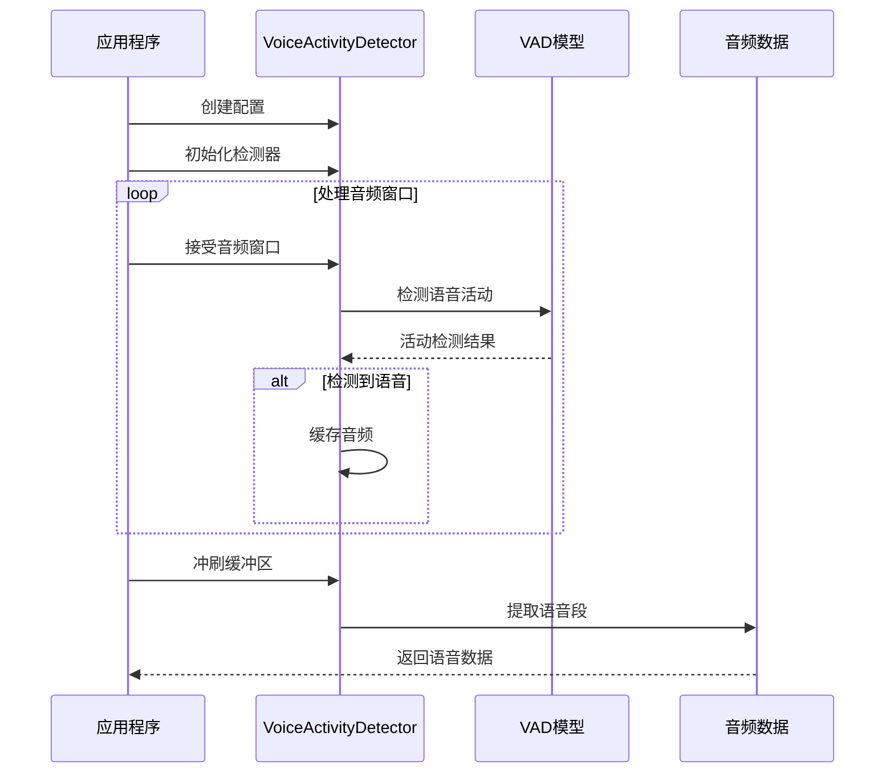
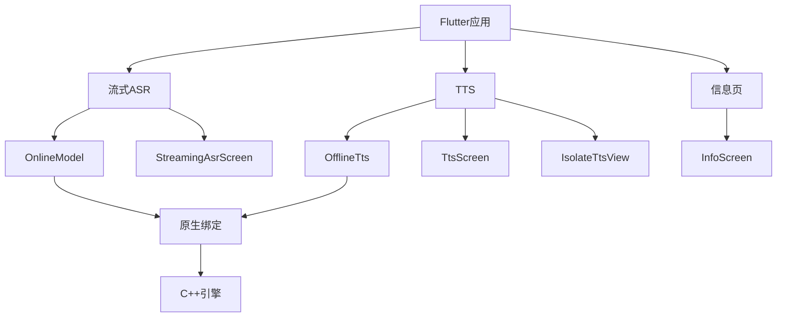
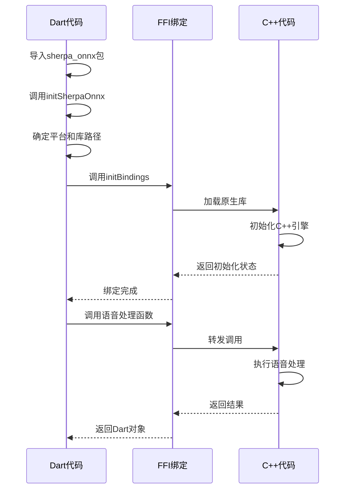

# Dart API 示例

<cite>
**本文档中引用的文件**  
- [whisper.dart](file://dart-api-examples/non-streaming-asr/bin/whisper.dart)
- [zipformer-ctc.dart](file://dart-api-examples/streaming-asr/bin/zipformer-ctc.dart)
- [kitten-en.dart](file://dart-api-examples/tts/bin/kitten-en.dart)
- [zipformer-transducer.dart](file://dart-api-examples/keyword-spotter/bin/zipformer-transducer.dart)
- [vad.dart](file://dart-api-examples/vad/bin/vad.dart)
- [init.dart](file://dart-api-examples/non-streaming-asr/bin/init.dart)
- [pubspec.yaml](file://dart-api-examples/non-streaming-asr/pubspec.yaml)
- [main.dart](file://flutter-examples/streaming_asr/lib/main.dart)
- [streaming_asr.dart](file://flutter-examples/streaming_asr/lib/streaming_asr.dart)
- [tts.dart](file://flutter-examples/tts/lib/tts.dart)
- [isolate_tts.dart](file://flutter-examples/tts/lib/isolate_tts.dart)
- [README.md](file://dart-api-examples/README.md)
- [flutter-examples/README.md](file://flutter-examples/README.md)
</cite>

## 目录
1. [简介](#简介)
2. [项目结构](#项目结构)
3. [核心组件](#核心组件)
4. [非流式语音识别](#非流式语音识别)
5. [流式语音识别](#流式语音识别)
6. [语音合成](#语音合成)
7. [关键词检测](#关键词检测)
8. [语音活动检测](#语音活动检测)
9. [Flutter集成](#flutter集成)
10. [Dart API与原生代码通信机制](#dart-api与原生代码通信机制)
11. [移动端性能优化与内存管理](#移动端性能优化与内存管理)
12. [结论](#结论)

## 简介
sherpa-onnx的Dart API示例提供了一套完整的语音处理功能实现，包括非流式和流式语音识别、语音合成、关键词检测、语音活动检测等多种功能。这些示例展示了如何在Dart和Flutter应用中使用sherpa-onnx库进行语音处理任务。API设计遵循了Dart语言的异步编程模式，提供了简洁的接口来访问底层的C++语音处理引擎。

**Section sources**
- [README.md](file://dart-api-examples/README.md)

## 项目结构
Dart API示例位于`dart-api-examples`目录下，每个功能都有独立的子目录。每个示例都是一个独立的Dart命令行应用，包含`bin`目录存放主程序文件，`pubspec.yaml`定义依赖关系。主要功能模块包括：非流式语音识别、流式语音识别、语音合成、关键词检测、语音活动检测等。每个示例都通过`init.dart`文件初始化sherpa-onnx绑定，确保原生库正确加载。



**Diagram sources**
- [README.md](file://dart-api-examples/README.md)

**Section sources**
- [README.md](file://dart-api-examples/README.md)

## 核心组件
Dart API的核心组件包括各种识别器、合成器和检测器类，它们通过FFI（Foreign Function Interface）与底层C++代码通信。主要组件包括`OfflineRecognizer`（非流式识别器）、`OnlineRecognizer`（流式识别器）、`OfflineTts`（离线语音合成器）、`KeywordSpotter`（关键词检测器）和`VoiceActivityDetector`（语音活动检测器）。这些组件通过配置对象进行初始化，配置对象包含了模型路径、线程数、调试模式等参数。

**Section sources**
- [whisper.dart](file://dart-api-examples/non-streaming-asr/bin/whisper.dart)
- [zipformer-ctc.dart](file://dart-api-examples/streaming-asr/bin/zipformer-ctc.dart)
- [kitten-en.dart](file://dart-api-examples/tts/bin/kitten-en.dart)

## 非流式语音识别
非流式语音识别适用于处理完整的音频文件，一次性将整个音频转录为文本。在`non-streaming-asr`目录中，提供了多种模型的示例，包括Whisper、Zipformer和Paraformer。使用流程包括：创建模型配置、创建识别器、读取音频文件、创建流、解码和获取结果。非流式识别器通过`OfflineRecognizer`类实现，支持多种ASR模型。



**Diagram sources**
- [whisper.dart](file://dart-api-examples/non-streaming-asr/bin/whisper.dart)

**Section sources**
- [whisper.dart](file://dart-api-examples/non-streaming-asr/bin/whisper.dart)

## 流式语音识别
流式语音识别适用于实时语音识别场景，可以处理连续的音频流。在`streaming-asr`目录中，提供了流式识别的示例。与非流式识别不同，流式识别需要将音频分割成小块，逐块处理。识别器会持续解码直到确定可以生成稳定结果。流式识别器通过`OnlineRecognizer`类实现，支持在线识别模式。



**Diagram sources**
- [zipformer-ctc.dart](file://dart-api-examples/streaming-asr/bin/zipformer-ctc.dart)

**Section sources**
- [zipformer-ctc.dart](file://dart-api-examples/streaming-asr/bin/zipformer-ctc.dart)

## 语音合成
语音合成功能通过`tts`目录中的示例展示，支持多种TTS模型，包括Kitten、Kokoro、Matcha等。使用流程包括：创建TTS模型配置、创建TTS实例、生成语音和保存音频文件。语音合成器通过`OfflineTts`类实现，支持多说话人、语速调节等功能。



**Diagram sources**
- [kitten-en.dart](file://dart-api-examples/tts/bin/kitten-en.dart)

**Section sources**
- [kitten-en.dart](file://dart-api-examples/tts/bin/kitten-en.dart)

## 关键词检测
关键词检测功能通过`keyword-spotter`目录中的示例展示，用于检测音频流中的特定关键词。使用流程包括：创建关键词检测器配置、初始化检测器、处理音频流和获取检测结果。当检测到关键词时，通常需要重置流以开始新的检测周期。关键词检测器通过`KeywordSpotter`类实现。



**Diagram sources**
- [zipformer-transducer.dart](file://dart-api-examples/keyword-spotter/bin/zipformer-transducer.dart)

**Section sources**
- [zipformer-transducer.dart](file://dart-api-examples/keyword-spotter/bin/zipformer-transducer.dart)

## 语音活动检测
语音活动检测（VAD）功能通过`vad`目录中的示例展示，用于检测音频中的语音活动。使用流程包括：创建VAD配置、初始化检测器、处理音频流和提取语音段。VAD检测器通过`VoiceActivityDetector`类实现，支持Silero VAD模型。



**Diagram sources**
- [vad.dart](file://dart-api-examples/vad/bin/vad.dart)

**Section sources**
- [vad.dart](file://dart-api-examples/vad/bin/vad.dart)

## Flutter集成
Flutter示例位于`flutter-examples`目录下，展示了如何在Flutter应用中集成sherpa-onnx功能。包括流式语音识别、语音合成等应用。集成时需要注意平台特定的配置，如Android的minSdkVersion和iOS的链接器设置。Flutter应用通过`BottomNavigationBar`提供多个功能页面的导航。



**Diagram sources**
- [main.dart](file://flutter-examples/streaming_asr/lib/main.dart)
- [streaming_asr.dart](file://flutter-examples/streaming_asr/lib/streaming_asr.dart)
- [tts.dart](file://flutter-examples/tts/lib/tts.dart)

**Section sources**
- [main.dart](file://flutter-examples/streaming_asr/lib/main.dart)
- [flutter-examples/README.md](file://flutter-examples/README.md)

## Dart API与原生代码通信机制
Dart API通过FFI（Foreign Function Interface）与底层C++代码通信。`init.dart`文件负责加载原生库并初始化绑定。根据平台（macOS、Linux、Windows）动态确定库路径，并调用`initBindings`函数初始化FFI绑定。这种机制允许Dart代码调用C++函数，实现高性能的语音处理。



**Diagram sources**
- [init.dart](file://dart-api-examples/non-streaming-asr/bin/init.dart)

**Section sources**
- [init.dart](file://dart-api-examples/non-streaming-asr/bin/init.dart)

## 移动端性能优化与内存管理
在移动端使用sherpa-onnx时，需要注意性能优化和内存管理。建议使用适当的线程数（通常为1-2），及时释放不再使用的识别器和流对象。在Flutter应用中，考虑使用Isolate处理耗时的语音处理任务，避免阻塞UI线程。对于TTS应用，可以使用`IsolateTtsView`来在后台线程生成语音。

```mermaid
flowchart TD
A[性能优化] --> B[线程管理]
A --> C[内存管理]
A --> D[异步处理]
B --> E[设置numThreads=1或2]
C --> F[及时调用free()]
C --> G[避免内存泄漏]
D --> H[使用Isolate]
D --> I[异步API]
H --> J[后台语音处理]
I --> K[非阻塞UI]
```

**Diagram sources**
- [isolate_tts.dart](file://flutter-examples/tts/lib/isolate_tts.dart)

**Section sources**
- [isolate_tts.dart](file://flutter-examples/tts/lib/isolate_tts.dart)

## 结论
sherpa-onnx的Dart API提供了完整的语音处理功能，适用于各种应用场景。通过清晰的API设计和良好的文档，开发者可以轻松集成语音识别、合成和检测功能到Dart和Flutter应用中。在移动端使用时，注意性能优化和内存管理，确保应用的流畅运行。通过FFI机制，Dart代码能够高效地与底层C++语音引擎通信，实现高性能的语音处理。