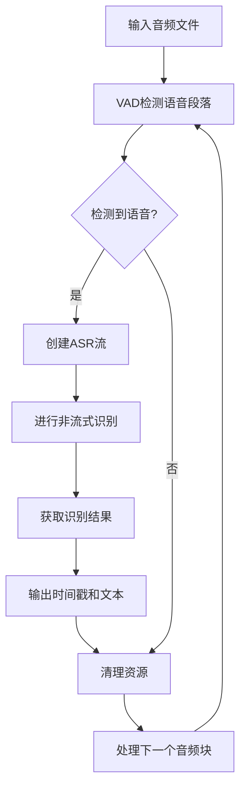
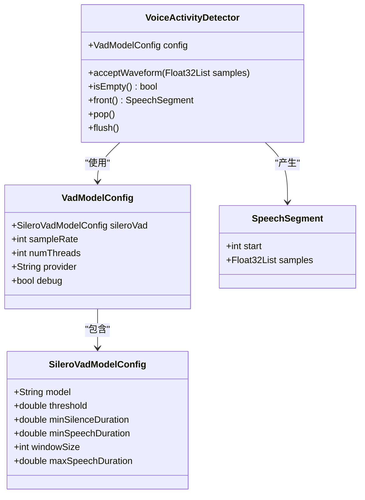
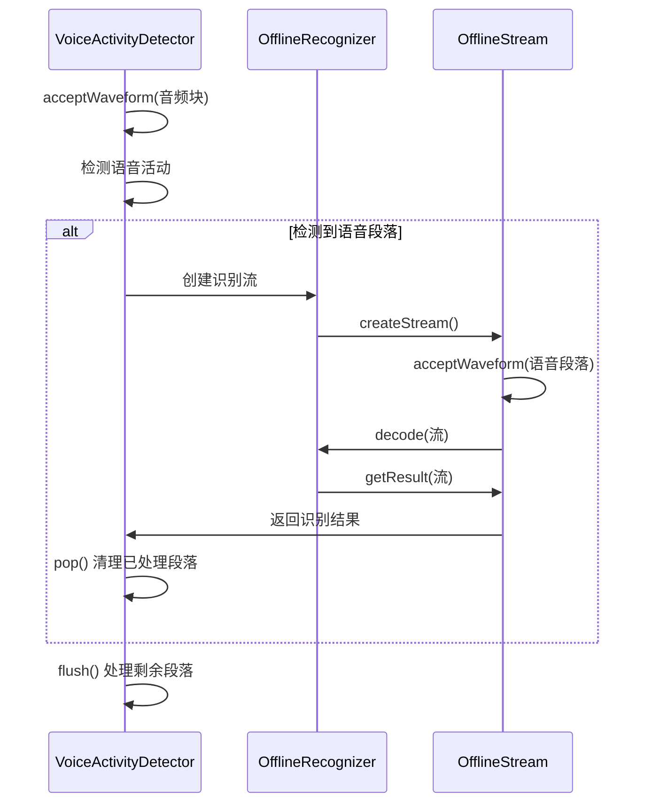
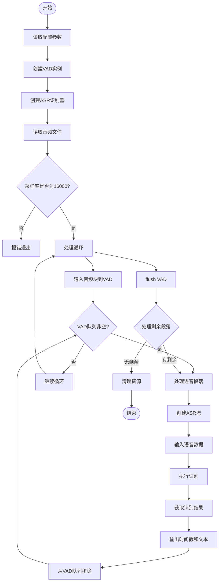
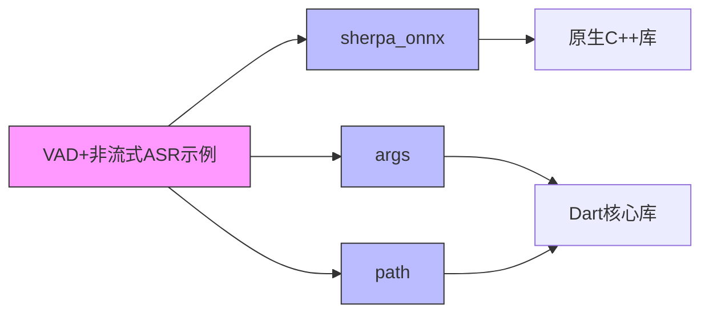

# VAD结合非流式ASR示例

<cite>
**本文档引用文件**  
- [paraformer.dart](file://dart-api-examples/vad-with-non-streaming-asr/bin/paraformer.dart)
- [whisper.dart](file://dart-api-examples/vad-with-non-streaming-asr/bin/whisper.dart)
- [sense-voice.dart](file://dart-api-examples/vad-with-non-streaming-asr/bin/sense-voice.dart)
- [init.dart](file://dart-api-examples/vad-with-non-streaming-asr/bin/init.dart)
- [vad.dart](file://flutter/sherpa_onnx/lib/src/vad.dart)
- [offline_recognizer.dart](file://flutter/sherpa_onnx/lib/src/offline_recognizer.dart)
- [voice-activity-detector.cc](file://sherpa-onnx/csrc/voice-activity-detector.cc)
- [voice-activity-detector.h](file://sherpa-onnx/csrc/voice-activity-detector.h)
</cite>

## 目录
1. [简介](#简介)
2. [项目结构](#项目结构)
3. [核心组件](#核心组件)
4. [架构概述](#架构概述)
5. [详细组件分析](#详细组件分析)
6. [依赖分析](#依赖分析)
7. [性能考虑](#性能考虑)
8. [故障排除指南](#故障排除指南)
9. [结论](#结论)

## 简介
本文档详细介绍了sherpa-onnx Dart API中语音活动检测（VAD）与非流式自动语音识别（ASR）结合使用的示例。该实现通过先使用VAD检测语音段落，然后对每个检测到的语音段落进行非流式ASR识别，从而提高识别效率和准确率。文档将全面解释这一流程的实现细节，包括语音段落分割、批量识别和结果合并等关键步骤。

## 项目结构
VAD结合非流式ASR的示例位于`dart-api-examples/vad-with-non-streaming-asr`目录下，该目录包含了多种不同ASR模型的实现，如Paraformer、Whisper、SenseVoice等。每个模型都有对应的Dart脚本文件，这些脚本实现了相同的VAD+非流式ASR处理流程。

**图表来源**  
- [paraformer.dart](file://dart-api-examples/vad-with-non-streaming-asr/bin/paraformer.dart#L1-L122)

**本节来源**  
- [paraformer.dart](file://dart-api-examples/vad-with-non-streaming-asr/bin/paraformer.dart#L1-L122)
- [whisper.dart](file://dart-api-examples/vad-with-non-streaming-asr/bin/whisper.dart#L1-L126)

## 核心组件
本示例的核心组件包括语音活动检测器（VoiceActivityDetector）和离线识别器（OfflineRecognizer）。VAD组件负责从连续音频流中检测出语音段落，而离线识别器则对每个语音段落进行完整的非流式ASR识别。这种组合方式能够有效过滤静音段，只对包含语音的部分进行识别，从而提高整体效率。

**本节来源**  
- [vad.dart](file://flutter/sherpa_onnx/lib/src/vad.dart#L8-L139)
- [offline_recognizer.dart](file://flutter/sherpa_onnx/lib/src/offline_recognizer.dart)

## 架构概述
该示例的架构采用分层处理模式，首先通过VAD对输入音频进行预处理，分割出语音段落，然后将每个语音段落传递给非流式ASR引擎进行识别。这种架构的优势在于能够充分利用非流式ASR模型的高精度特性，同时通过VAD避免了对静音段的无效计算。

**图表来源**  
- [paraformer.dart](file://dart-api-examples/vad-with-non-streaming-asr/bin/paraformer.dart#L28-L122)
- [voice-activity-detector.cc](file://sherpa-onnx/csrc/voice-activity-detector.cc#L28-L231)

## 详细组件分析

### VAD组件分析
VAD组件基于Silero VAD模型实现，负责检测音频中的语音活动。它通过滑动窗口的方式处理音频流，当检测到语音开始时记录起始位置，当检测到足够长的静音时认为语音结束，从而分割出完整的语音段落。

**图表来源**  
- [vad.dart](file://flutter/sherpa_onnx/lib/src/vad.dart#L8-L139)
- [voice-activity-detector.h](file://sherpa-onnx/csrc/voice-activity-detector.h#L14-L63)

**本节来源**  
- [vad.dart](file://flutter/sherpa_onnx/lib/src/vad.dart#L8-L343)
- [voice-activity-detector.cc](file://sherpa-onnx/csrc/voice-activity-detector.cc#L28-L231)

### 非流式ASR组件分析
非流式ASR组件负责对VAD分割出的每个语音段落进行完整的语音识别。与流式ASR不同，非流式ASR可以利用整个语音段落的上下文信息，通常能提供更高的识别准确率。

**图表来源**  
- [paraformer.dart](file://dart-api-examples/vad-with-non-streaming-asr/bin/paraformer.dart#L44-L122)
- [offline_recognizer.dart](file://flutter/sherpa_onnx/lib/src/offline_recognizer.dart)

**本节来源**  
- [paraformer.dart](file://dart-api-examples/vad-with-non-streaming-asr/bin/paraformer.dart#L44-L122)
- [offline_recognizer.dart](file://flutter/sherpa_onnx/lib/src/offline_recognizer.dart)

### 流程控制分析
整个处理流程采用循环方式处理音频数据，首先逐块输入音频到VAD，当VAD队列中有语音段落时，立即进行ASR识别，处理完所有段落后，通过flush方法确保所有剩余语音都被处理。

**图表来源**  
- [paraformer.dart](file://dart-api-examples/vad-with-non-streaming-asr/bin/paraformer.dart#L75-L122)
- [init.dart](file://dart-api-examples/vad-with-non-streaming-asr/bin/init.dart)

**本节来源**  
- [paraformer.dart](file://dart-api-examples/vad-with-non-streaming-asr/bin/paraformer.dart#L10-L122)
- [init.dart](file://dart-api-examples/vad-with-non-streaming-asr/bin/init.dart)

## 依赖分析
该示例主要依赖于sherpa_onnx Dart包，该包提供了VAD和ASR功能的封装。此外，还依赖args包用于命令行参数解析，path包用于路径处理。

**图表来源**  
- [pubspec.yaml](file://dart-api-examples/vad-with-non-streaming-asr/pubspec.yaml)
- [paraformer.dart](file://dart-api-examples/vad-with-non-streaming-asr/bin/paraformer.dart#L6)

**本节来源**  
- [pubspec.yaml](file://dart-api-examples/vad-with-non-streaming-asr/pubspec.yaml)

## 性能考虑
VAD与非流式ASR结合的性能优势主要体现在：
1. **计算效率**：避免了对静音段的无效计算，减少了总体计算量
2. **内存使用**：语音段落被分割处理，降低了内存峰值使用
3. **识别质量**：非流式ASR可以利用完整上下文，提高识别准确率
4. **延迟控制**：通过合理设置VAD参数，可以在准确率和实时性之间取得平衡

对于长音频和连续语音的处理，建议：
- 适当调整minSilenceDuration和minSpeechDuration参数以适应不同场景
- 使用bufferSizeInSeconds参数控制VAD缓冲区大小，避免内存溢出
- 对于非常长的音频，可以考虑分段处理

## 故障排除指南
常见问题及解决方案：
- **采样率不匹配**：确保输入音频为16000Hz，否则会报错
- **模型文件路径错误**：检查命令行参数中的模型路径是否正确
- **内存不足**：减少bufferSizeInSeconds或处理更短的音频片段
- **识别结果为空**：检查VAD参数设置，可能语音未被正确检测到

**本节来源**  
- [paraformer.dart](file://dart-api-examples/vad-with-non-streaming-asr/bin/paraformer.dart#L67-L70)
- [sense-voice.dart](file://dart-api-examples/vad-with-non-streaming-asr/bin/sense-voice.dart#L72-L74)

## 结论
VAD与非流式ASR的结合提供了一种高效且准确的语音识别解决方案。通过先使用VAD检测语音段落，再对每个段落进行非流式识别，既保证了识别质量，又提高了处理效率。这种模式特别适合处理包含大量静音的长音频文件，能够有效过滤无效数据，专注于语音内容的识别。示例代码展示了完整的实现流程，包括参数配置、资源管理、错误处理等关键环节，为开发者提供了清晰的参考。