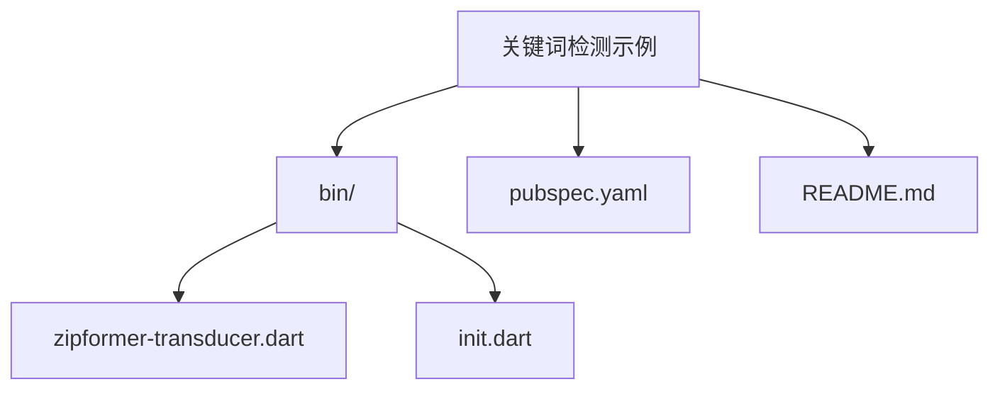
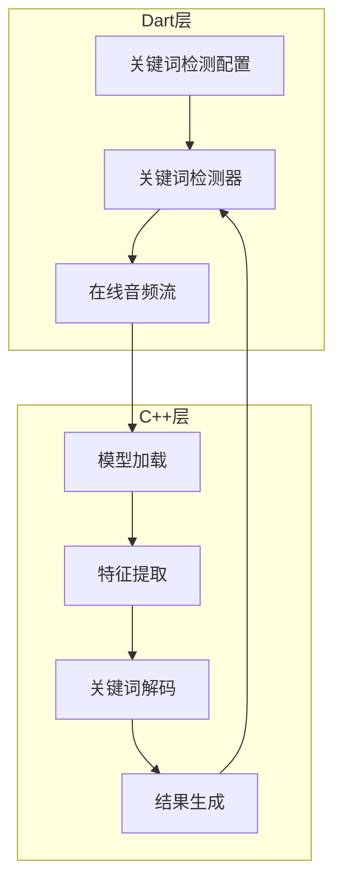
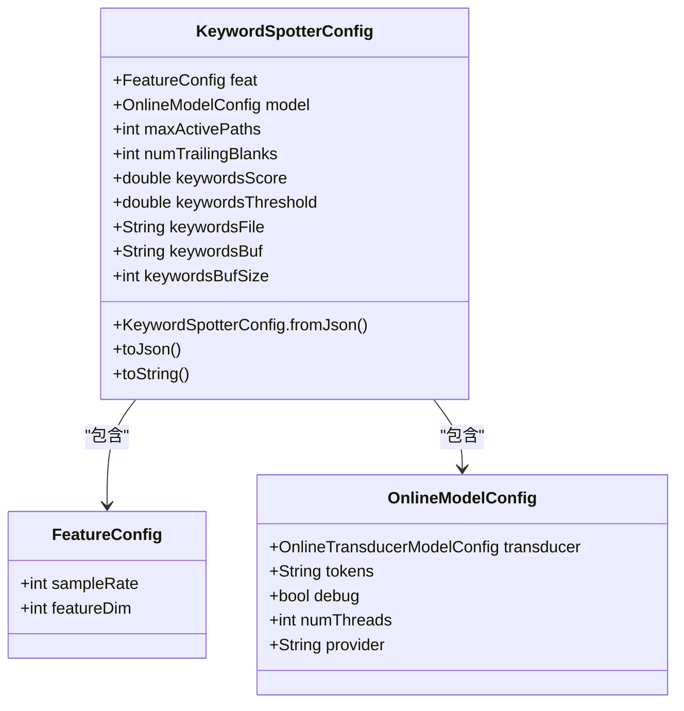
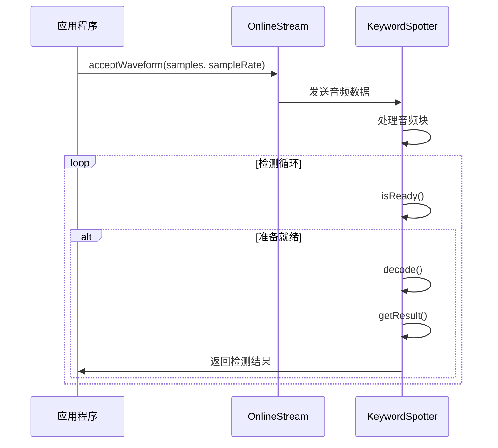
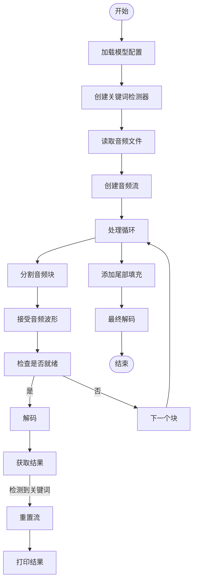
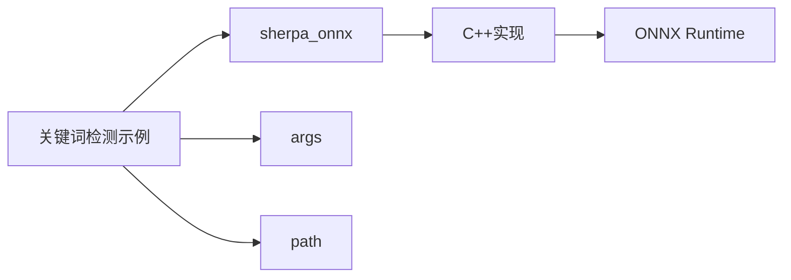

# 关键词检测示例

<cite>
**本文档引用的文件**  
- [zipformer-transducer.dart](file://dart-api-examples/keyword-spotter/bin/zipformer-transducer.dart)
- [init.dart](file://dart-api-examples/keyword-spotter/bin/init.dart)
- [keyword_spotter.dart](file://flutter/sherpa_onnx/lib/src/keyword_spotter.dart)
- [online_stream.dart](file://flutter/sherpa_onnx/lib/src/online_stream.dart)
- [keyword-spotter.cc](file://sherpa-onnx/csrc/keyword-spotter.cc)
- [keyword-spotter-impl.cc](file://sherpa-onnx/csrc/keyword-spotter-impl.cc)
- [pubspec.yaml](file://dart-api-examples/keyword-spotter/pubspec.yaml)
</cite>

## 目录
1. [简介](#简介)
2. [项目结构](#项目结构)
3. [核心组件](#核心组件)
4. [架构概述](#架构概述)
5. [详细组件分析](#详细组件分析)
6. [依赖分析](#依赖分析)
7. [性能考虑](#性能考虑)
8. [故障排除指南](#故障排除指南)
9. [结论](#结论)

## 简介
本文档全面解释了sherpa-onnx Dart API中zipformer-transducer关键词检测示例的实现。文档详细说明了如何在Dart语言中配置关键词列表、启动关键词检测会话、处理实时音频流并识别预设关键词。通过代码解析，展示了关键词检测的敏感度调节、结果回调处理和多关键词匹配机制。同时，解释了该功能在语音唤醒和命令识别场景中的应用，并提供了准确率优化和误报率控制建议。

## 项目结构
关键词检测示例位于`dart-api-examples/keyword-spotter`目录下，包含Dart API的关键词检测实现。该示例使用zipformer-transducer模型进行关键词检测，通过命令行参数配置模型路径、关键词文件和输入音频文件。

**图示来源**  
- [zipformer-transducer.dart](file://dart-api-examples/keyword-spotter/bin/zipformer-transducer.dart)
- [init.dart](file://dart-api-examples/keyword-spotter/bin/init.dart)
- [pubspec.yaml](file://dart-api-examples/keyword-spotter/pubspec.yaml)

**本节来源**  
- [zipformer-transducer.dart](file://dart-api-examples/keyword-spotter/bin/zipformer-transducer.dart)
- [pubspec.yaml](file://dart-api-examples/keyword-spotter/pubspec.yaml)

## 核心组件
关键词检测示例的核心组件包括关键词检测器配置、在线流处理和结果获取机制。通过`KeywordSpotterConfig`配置关键词检测参数，使用`KeywordSpotter`创建检测器实例，并通过`OnlineStream`处理音频流。

**本节来源**  
- [keyword_spotter.dart](file://flutter/sherpa_onnx/lib/src/keyword_spotter.dart)
- [online_stream.dart](file://flutter/sherpa_onnx/lib/src/online_stream.dart)

## 架构概述
关键词检测示例的架构基于zipformer-transducer模型，通过Dart API与底层C++实现进行交互。架构包括模型加载、音频流处理、关键词检测和结果输出四个主要部分。

**图示来源**  
- [keyword-spotter.cc](file://sherpa-onnx/csrc/keyword-spotter.cc)
- [keyword-spotter-impl.cc](file://sherpa-onnx/csrc/keyword-spotter-impl.cc)
- [keyword_spotter.dart](file://flutter/sherpa_onnx/lib/src/keyword_spotter.dart)

## 详细组件分析
### 关键词检测器配置分析
关键词检测器配置通过`KeywordSpotterConfig`类实现，包含特征配置、模型配置和关键词检测参数。配置参数包括最大活跃路径数、尾部空白数量、关键词分数和阈值等。

**图示来源**  
- [keyword_spotter.dart](file://flutter/sherpa_onnx/lib/src/keyword_spotter.dart#L13-L71)

### 在线音频流处理分析
在线音频流处理通过`OnlineStream`类实现，负责接收和处理音频数据。音频流以块为单位进行处理，支持实时音频流的模拟和处理。

**图示来源**  
- [online_stream.dart](file://flutter/sherpa_onnx/lib/src/online_stream.dart#L8-L41)
- [keyword_spotter.dart](file://flutter/sherpa_onnx/lib/src/keyword_spotter.dart#L178-L224)

### 关键词检测流程分析
关键词检测流程从模型加载开始，经过音频流创建、数据分块处理、实时检测到结果输出的完整过程。

**图示来源**  
- [zipformer-transducer.dart](file://dart-api-examples/keyword-spotter/bin/zipformer-transducer.dart#L39-L100)

**本节来源**  
- [zipformer-transducer.dart](file://dart-api-examples/keyword-spotter/bin/zipformer-transducer.dart)
- [keyword_spotter.dart](file://flutter/sherpa_onnx/lib/src/keyword_spotter.dart)

## 依赖分析
关键词检测示例依赖于sherpa_onnx Dart包，该包提供了与底层C++实现的绑定。示例还依赖于args包用于命令行参数解析，以及path包用于路径处理。

**图示来源**  
- [pubspec.yaml](file://dart-api-examples/keyword-spotter/pubspec.yaml)
- [keyword_spotter.dart](file://flutter/sherpa_onnx/lib/src/keyword_spotter.dart)

**本节来源**  
- [pubspec.yaml](file://dart-api-examples/keyword-spotter/pubspec.yaml)
- [init.dart](file://dart-api-examples/keyword-spotter/bin/init.dart)

## 性能考虑
在实现关键词检测时，需要考虑以下性能因素：
- 音频块大小的选择会影响实时性和内存使用
- 模型加载时间可能影响应用启动速度
- 多线程配置可以提高处理效率
- 内存管理需要确保流和检测器的正确释放

## 故障排除指南
### 常见问题及解决方案
- **模型加载失败**：检查模型文件路径是否正确，确保所有必需的模型文件都存在
- **关键词检测不准确**：调整`keywordsScore`和`keywordsThreshold`参数优化检测效果
- **内存泄漏**：确保调用`free()`方法释放流和检测器资源
- **平台兼容性问题**：确保在不同平台上正确初始化绑定

**本节来源**  
- [keyword_spotter.dart](file://flutter/sherpa_onnx/lib/src/keyword_spotter.dart#L173-L176)
- [zipformer-transducer.dart](file://dart-api-examples/keyword-spotter/bin/zipformer-transducer.dart#L98-L99)

## 结论
sherpa-onnx Dart API的关键词检测示例提供了一个完整的解决方案，用于在Dart应用中实现关键词检测功能。通过zipformer-transducer模型，示例展示了如何配置关键词列表、处理实时音频流并识别预设关键词。该实现适用于语音唤醒和命令识别等场景，通过参数调节可以优化准确率和控制误报率。开发者可以根据具体需求调整配置参数，实现高效的关键词检测功能。