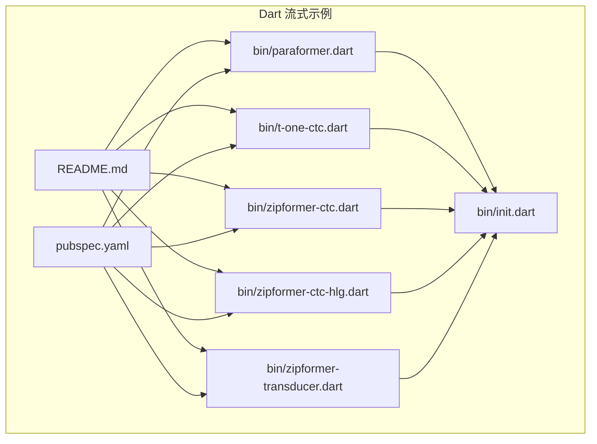
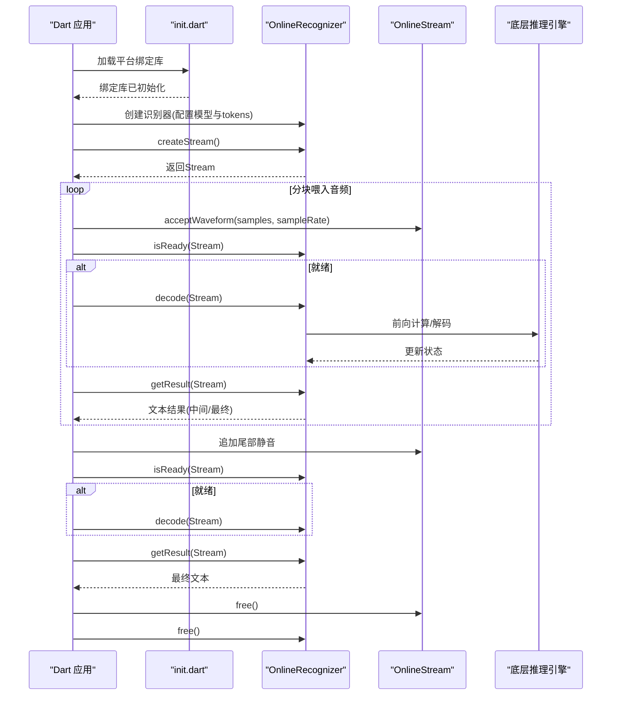
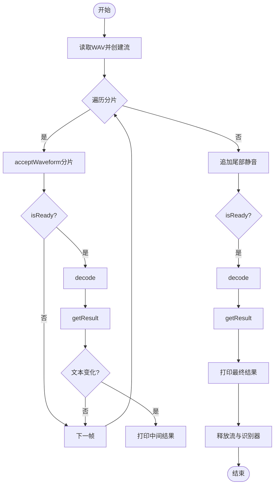
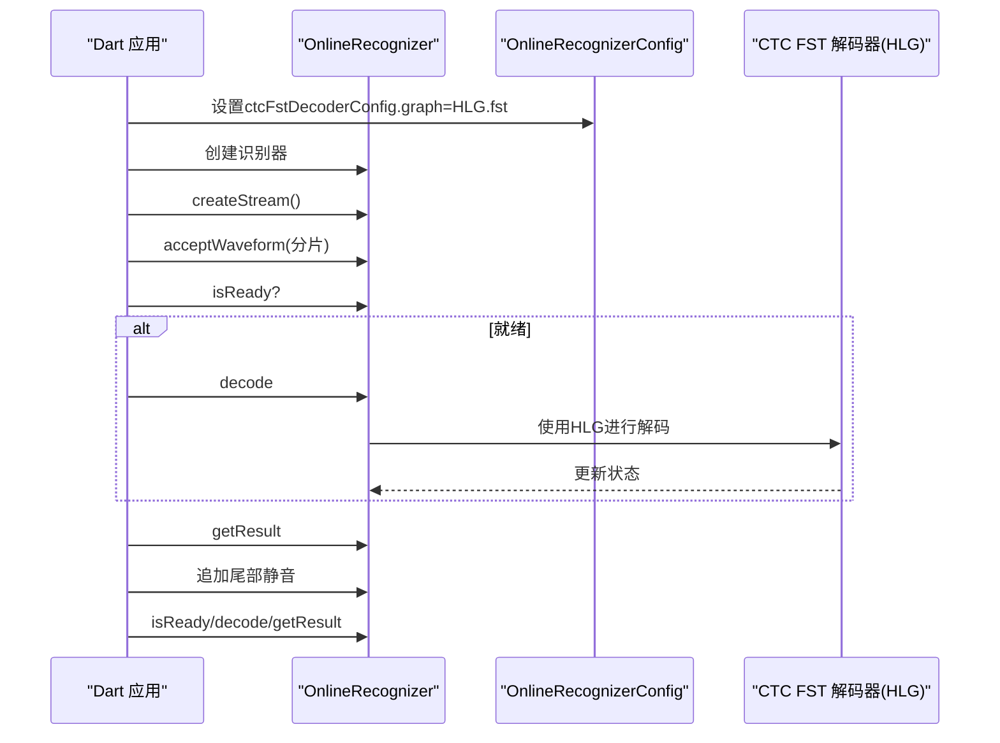
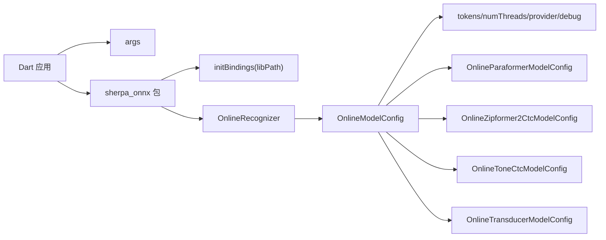

# 流式语音识别示例

<cite>
**本文引用的文件**
- [dart-api-examples/streaming-asr/README.md](file://dart-api-examples/streaming-asr/README.md)
- [dart-api-examples/streaming-asr/pubspec.yaml](file://dart-api-examples/streaming-asr/pubspec.yaml)
- [dart-api-examples/streaming-asr/bin/paraformer.dart](file://dart-api-examples/streaming-asr/bin/paraformer.dart)
- [dart-api-examples/streaming-asr/bin/t-one-ctc.dart](file://dart-api-examples/streaming-asr/bin/t-one-ctc.dart)
- [dart-api-examples/streaming-asr/bin/zipformer-ctc.dart](file://dart-api-examples/streaming-asr/bin/zipformer-ctc.dart)
- [dart-api-examples/streaming-asr/bin/zipformer-ctc-hlg.dart](file://dart-api-examples/streaming-asr/bin/zipformer-ctc-hlg.dart)
- [dart-api-examples/streaming-asr/bin/zipformer-transducer.dart](file://dart-api-examples/streaming-asr/bin/zipformer-transducer.dart)
- [dart-api-examples/streaming-asr/bin/init.dart](file://dart-api-examples/streaming-asr/bin/init.dart)
- [flutter/sherpa_onnx/lib/src/online_recognizer.dart](file://flutter/sherpa_onnx/lib/src/online_recognizer.dart)
- [nodejs-examples/test-online-zipformer2-ctc.js](file://nodejs-examples/test-online-zipformer2-ctc.js)
- [nodejs-addon-examples/test_asr_streaming_transducer.js](file://nodejs-addon-examples/test_asr_streaming_transducer.js)
- [python-api-examples/simulate-streaming-paraformer-microphone.py](file://python-api-examples/simulate-streaming-paraformer-microphone.py)
</cite>

## 目录
1. [简介](#简介)
2. [项目结构](#项目结构)
3. [核心组件](#核心组件)
4. [架构总览](#架构总览)
5. [详细组件分析](#详细组件分析)
6. [依赖关系分析](#依赖关系分析)
7. [性能与延迟优化](#性能与延迟优化)
8. [故障排查指南](#故障排查指南)
9. [结论](#结论)
10. [附录](#附录)

## 简介
本文件面向使用 Dart 语言进行流式语音识别（Streaming ASR）的开发者，系统性解读 sherpa-onnx 提供的 Dart API 示例，覆盖以下模型族：
- Paraformer（基于自回归解码器的端到端模型）
- T-One CTC（单通道 CTC 模型）
- Zipformer 系列（CTC 与 Transducer 两种路径）

重点说明：
- 如何在 Dart 中建立流式识别会话
- 如何处理音频流输入与实时文本输出
- 流式识别生命周期管理：创建流、喂入音频、判断就绪、解码、获取中间与最终结果
- HLG 解码图在 Zipformer CTC 流式识别中的作用与配置方式
- 延迟优化与内存管理建议

## 项目结构
Dart 流式 ASR 示例位于 dart-api-examples/streaming-asr 目录，包含多个模型示例脚本与初始化工具：
- README.md：列出各示例用途
- pubspec.yaml：声明依赖 sherpa_onnx 包及命令行参数解析
- bin/ 下的示例脚本：
  - paraformer.dart：Paraformer 端到端模型
  - t-one-ctc.dart：T-One CTC 单通道模型
  - zipformer-ctc.dart：Zipformer CTC 模型
  - zipformer-ctc-hlg.dart：Zipformer CTC + HLG 图
  - zipformer-transducer.dart：Zipformer Transducer 模型
  - init.dart：按平台加载本地绑定库

图表来源
- [dart-api-examples/streaming-asr/README.md](file://dart-api-examples/streaming-asr/README.md#L1-L13)
- [dart-api-examples/streaming-asr/pubspec.yaml](file://dart-api-examples/streaming-asr/pubspec.yaml#L1-L21)
- [dart-api-examples/streaming-asr/bin/init.dart](file://dart-api-examples/streaming-asr/bin/init.dart#L1-L39)
- [dart-api-examples/streaming-asr/bin/paraformer.dart](file://dart-api-examples/streaming-asr/bin/paraformer.dart#L1-L93)
- [dart-api-examples/streaming-asr/bin/t-one-ctc.dart](file://dart-api-examples/streaming-asr/bin/t-one-ctc.dart#L1-L96)
- [dart-api-examples/streaming-asr/bin/zipformer-ctc.dart](file://dart-api-examples/streaming-asr/bin/zipformer-ctc.dart#L1-L89)
- [dart-api-examples/streaming-asr/bin/zipformer-ctc-hlg.dart](file://dart-api-examples/streaming-asr/bin/zipformer-ctc-hlg.dart#L1-L95)
- [dart-api-examples/streaming-asr/bin/zipformer-transducer.dart](file://dart-api-examples/streaming-asr/bin/zipformer-transducer.dart#L1-L102)

章节来源
- [dart-api-examples/streaming-asr/README.md](file://dart-api-examples/streaming-asr/README.md#L1-L13)
- [dart-api-examples/streaming-asr/pubspec.yaml](file://dart-api-examples/streaming-asr/pubspec.yaml#L1-L21)

## 核心组件
- 初始化绑定库：init.dart 负责根据操作系统选择正确的 sherpa_onnx 绑定库路径并调用初始化函数，确保 Dart 可以调用底层 C++ 实现。
- 在线识别器与模型配置：
  - OnlineRecognizer：封装流式识别流程，提供创建流、判断就绪、解码、获取结果等接口
  - OnlineModelConfig：统一承载不同模型族的配置项（tokens、numThreads、provider、debug 等），以及各模型子配置（如 OnlineParaformerModelConfig、OnlineZipformer2CtcModelConfig、OnlineToneCtcModelConfig、OnlineTransducerModelConfig）
- 流对象：通过 recognizer.createStream() 创建，用于接收音频片段并逐步产生中间或最终结果
- 音频输入：通过 stream.acceptWaveform(samples, sampleRate) 接收浮点样本；通常以固定时长分片喂入，例如 0.1 秒
- 尾部填充：在音频结束时追加静音（tail paddings）以触发最终解码与收尾逻辑

章节来源
- [dart-api-examples/streaming-asr/bin/init.dart](file://dart-api-examples/streaming-asr/bin/init.dart#L1-L39)
- [flutter/sherpa_onnx/lib/src/online_recognizer.dart](file://flutter/sherpa_onnx/lib/src/online_recognizer.dart#L147-L172)

## 架构总览
下图展示了 Dart 层到底层推理引擎的调用链路，以及流式识别的关键步骤。

图表来源
- [dart-api-examples/streaming-asr/bin/init.dart](file://dart-api-examples/streaming-asr/bin/init.dart#L1-L39)
- [dart-api-examples/streaming-asr/bin/paraformer.dart](file://dart-api-examples/streaming-asr/bin/paraformer.dart#L1-L93)
- [dart-api-examples/streaming-asr/bin/t-one-ctc.dart](file://dart-api-examples/streaming-asr/bin/t-one-ctc.dart#L1-L96)
- [dart-api-examples/streaming-asr/bin/zipformer-ctc.dart](file://dart-api-examples/streaming-asr/bin/zipformer-ctc.dart#L1-L89)
- [dart-api-examples/streaming-asr/bin/zipformer-ctc-hlg.dart](file://dart-api-examples/streaming-asr/bin/zipformer-ctc-hlg.dart#L1-L95)
- [dart-api-examples/streaming-asr/bin/zipformer-transducer.dart](file://dart-api-examples/streaming-asr/bin/zipformer-transducer.dart#L1-L102)

## 详细组件分析

### 初始化与平台绑定（init.dart）
- 功能要点
  - 依据运行平台（macOS/Linux/Windows）定位对应 sherpa_onnx 平台包目录
  - Linux 架构区分 x64/aarch64
  - 调用 initBindings(libPath) 完成绑定库加载
- 使用建议
  - 确保 pubspec.yaml 中 sherpa_onnx 版本与目标平台二进制匹配
  - 在应用启动时尽早调用 initSherpaOnnx()

章节来源
- [dart-api-examples/streaming-asr/bin/init.dart](file://dart-api-examples/streaming-asr/bin/init.dart#L1-L39)
- [dart-api-examples/streaming-asr/pubspec.yaml](file://dart-api-examples/streaming-asr/pubspec.yaml#L1-L21)

### Paraformer 流式识别（paraformer.dart）
- 关键流程
  - 构造 OnlineParaformerModelConfig 与 OnlineModelConfig
  - 创建 OnlineRecognizer
  - 读取 WAV 文件为浮点样本
  - 创建流并以固定分片大小（如 0.1 秒）循环喂入
  - 循环检查 isReady，就绪则 decode，随后 getResult 获取文本
  - 结束时追加尾部静音，再次解码并获取最终结果
  - 释放流与识别器资源
- 中间结果处理
  - 通过比较前后结果文本避免重复打印
- 适用场景
  - 端到端 Paraformer 模型，适合高准确度场景

图表来源
- [dart-api-examples/streaming-asr/bin/paraformer.dart](file://dart-api-examples/streaming-asr/bin/paraformer.dart#L1-L93)

章节来源
- [dart-api-examples/streaming-asr/bin/paraformer.dart](file://dart-api-examples/streaming-asr/bin/paraformer.dart#L1-L93)

### T-One CTC 流式识别（t-one-ctc.dart）
- 关键流程
  - 构造 OnlineToneCtcModelConfig 与 OnlineModelConfig
  - 创建流后先喂入左边界静音（padding），再以固定分片大小循环喂入
  - 同样通过 isReady/decode/getResult 处理中间与最终结果
  - 结束时追加尾部静音并获取最终文本
- 适用场景
  - 单通道 CTC 模型，常用于特定采样率与低资源环境

章节来源
- [dart-api-examples/streaming-asr/bin/t-one-ctc.dart](file://dart-api-examples/streaming-asr/bin/t-one-ctc.dart#L1-L96)

### Zipformer CTC 流式识别（zipformer-ctc.dart）
- 关键流程
  - 构造 OnlineZipformer2CtcModelConfig 与 OnlineModelConfig
  - 其余流程与 Paraformer 类似，分片喂入、isReady/decode/getResult、尾部静音
- 适用场景
  - Zipformer CTC 模型，兼顾速度与准确度

章节来源
- [dart-api-examples/streaming-asr/bin/zipformer-ctc.dart](file://dart-api-examples/streaming-asr/bin/zipformer-ctc.dart#L1-L89)

### Zipformer CTC + HLG 解码（zipformer-ctc-hlg.dart）
- 关键差异
  - 在 OnlineRecognizerConfig 中设置 ctcFstDecoderConfig.graph = HLG.fst 路径
  - HLG（Huge Lexicon Graph）解码图可显著提升词典外词汇与复杂语言建模的识别质量
- 适用场景
  - 对词法与拼写鲁棒性要求更高的场景，如开放域口语识别

图表来源
- [dart-api-examples/streaming-asr/bin/zipformer-ctc-hlg.dart](file://dart-api-examples/streaming-asr/bin/zipformer-ctc-hlg.dart#L1-L95)

章节来源
- [dart-api-examples/streaming-asr/bin/zipformer-ctc-hlg.dart](file://dart-api-examples/streaming-asr/bin/zipformer-ctc-hlg.dart#L1-L95)

### Zipformer Transducer 流式识别（zipformer-transducer.dart）
- 关键流程
  - 构造 OnlineTransducerModelConfig（encoder/decoder/joiner）
  - OnlineModelConfig 中启用 transducer
  - 其余流程同上：分片喂入、isReady/decode/getResult、尾部静音
- 适用场景
  - 基于连接时序约束（CTC/Lexicon）+ 自回归解码的混合模型，适合长文本与复杂语言建模

章节来源
- [dart-api-examples/streaming-asr/bin/zipformer-transducer.dart](file://dart-api-examples/streaming-asr/bin/zipformer-transducer.dart#L1-L102)

### 流式识别生命周期管理
- 生命周期阶段
  - 初始化：加载绑定库、构建模型配置、创建识别器
  - 会话：创建流、分片喂入、轮询就绪、解码、获取结果
  - 收尾：追加尾部静音、确保最终解码完成、释放资源
- 资源释放
  - 明确调用 stream.free() 与 recognizer.free()，避免内存泄漏
- 中间结果处理
  - 通过比较前后文本避免重复输出
  - 可结合规则 FST（ruleFsts）对输出进行规范化（Transducer 示例支持）

章节来源
- [dart-api-examples/streaming-asr/bin/paraformer.dart](file://dart-api-examples/streaming-asr/bin/paraformer.dart#L1-L93)
- [dart-api-examples/streaming-asr/bin/t-one-ctc.dart](file://dart-api-examples/streaming-asr/bin/t-one-ctc.dart#L1-L96)
- [dart-api-examples/streaming-asr/bin/zipformer-ctc.dart](file://dart-api-examples/streaming-asr/bin/zipformer-ctc.dart#L1-L89)
- [dart-api-examples/streaming-asr/bin/zipformer-ctc-hlg.dart](file://dart-api-examples/streaming-asr/bin/zipformer-ctc-hlg.dart#L1-L95)
- [dart-api-examples/streaming-asr/bin/zipformer-transducer.dart](file://dart-api-examples/streaming-asr/bin/zipformer-transducer.dart#L1-L102)

## 依赖关系分析
- Dart 侧依赖
  - sherpa_onnx：Dart 包，提供在线识别器与模型配置类
  - args：命令行参数解析
  - path：文件路径操作
- 平台绑定
  - init.dart 根据平台选择对应 sherpa_onnx 平台包目录并加载本地库
- 模型配置
  - OnlineModelConfig 统一承载各模型族配置，包含 tokens、numThreads、provider、debug 等通用项，以及各模型子配置

图表来源
- [dart-api-examples/streaming-asr/pubspec.yaml](file://dart-api-examples/streaming-asr/pubspec.yaml#L1-L21)
- [dart-api-examples/streaming-asr/bin/init.dart](file://dart-api-examples/streaming-asr/bin/init.dart#L1-L39)
- [flutter/sherpa_onnx/lib/src/online_recognizer.dart](file://flutter/sherpa_onnx/lib/src/online_recognizer.dart#L147-L172)

章节来源
- [dart-api-examples/streaming-asr/pubspec.yaml](file://dart-api-examples/streaming-asr/pubspec.yaml#L1-L21)
- [flutter/sherpa_onnx/lib/src/online_recognizer.dart](file://flutter/sherpa_onnx/lib/src/online_recognizer.dart#L147-L172)

## 性能与延迟优化
- 分片大小与延迟
  - 更小分片可降低端到端延迟，但增加解码次数；更大分片减少开销但提高延迟
  - 示例中普遍采用 0.1 秒分片（16kHz 时约 1600 样本），可按需求调整
- 尾部静音策略
  - 在音频末尾追加一定长度的静音（如 0.4~0.6 秒）以触发最终解码，避免提前终止
- 线程与算力
  - numThreads 控制推理并发度；debug 开关影响日志输出与性能
- 实时因子（RTF）
  - 可参考其他语言示例的 RTF 计算方式，评估整体吞吐与延迟表现
- 内存管理
  - 使用 Float32List 的子视图（sublistView）减少拷贝
  - 及时释放流与识别器资源，避免长时间驻留

章节来源
- [dart-api-examples/streaming-asr/bin/paraformer.dart](file://dart-api-examples/streaming-asr/bin/paraformer.dart#L50-L71)
- [dart-api-examples/streaming-asr/bin/t-one-ctc.dart](file://dart-api-examples/streaming-asr/bin/t-one-ctc.dart#L46-L81)
- [dart-api-examples/streaming-asr/bin/zipformer-ctc.dart](file://dart-api-examples/streaming-asr/bin/zipformer-ctc.dart#L46-L74)
- [nodejs-examples/test-online-zipformer2-ctc.js](file://nodejs-examples/test-online-zipformer2-ctc.js#L52-L107)
- [nodejs-addon-examples/test_asr_streaming_transducer.js](file://nodejs-addon-examples/test_asr_streaming_transducer.js#L38-L56)

## 故障排查指南
- 平台绑定失败
  - 症状：initBindings 无法找到库或加载失败
  - 排查：确认 pubspec.yaml 中版本与目标平台一致；检查 init.dart 的平台分支与路径拼接
- 参数缺失
  - 症状：命令行缺少必要参数导致退出
  - 排查：对照各示例的 --help 输出，补齐模型路径、tokens、输入音频等参数
- 采样率不匹配
  - 症状：解码异常或报错
  - 排查：确保 acceptWaveform 的 sampleRate 与模型期望一致
- 未追加尾部静音
  - 症状：最终结果为空或提前结束
  - 排查：在音频末尾追加静音并再次解码
- 资源未释放
  - 症状：内存占用持续增长
  - 排查：确保在会话结束后调用 stream.free() 与 recognizer.free()

章节来源
- [dart-api-examples/streaming-asr/bin/init.dart](file://dart-api-examples/streaming-asr/bin/init.dart#L1-L39)
- [dart-api-examples/streaming-asr/bin/paraformer.dart](file://dart-api-examples/streaming-asr/bin/paraformer.dart#L13-L26)
- [dart-api-examples/streaming-asr/bin/t-one-ctc.dart](file://dart-api-examples/streaming-asr/bin/t-one-ctc.dart#L13-L24)
- [dart-api-examples/streaming-asr/bin/zipformer-ctc.dart](file://dart-api-examples/streaming-asr/bin/zipformer-ctc.dart#L13-L24)
- [dart-api-examples/streaming-asr/bin/zipformer-ctc-hlg.dart](file://dart-api-examples/streaming-asr/bin/zipformer-ctc-hlg.dart#L13-L26)
- [dart-api-examples/streaming-asr/bin/zipformer-transducer.dart](file://dart-api-examples/streaming-asr/bin/zipformer-transducer.dart#L13-L21)

## 结论
Dart 流式 ASR 示例提供了清晰的流水线：初始化绑定库 → 构建模型配置 → 创建识别器与流 → 分片喂入音频 → 判断就绪并解码 → 获取中间与最终结果 → 释放资源。通过 HLG 解码图（Zipformer CTC HLG 示例）可进一步提升识别质量。实践中应根据场景权衡分片大小、尾部静音策略与线程配置，以获得更优的延迟与吞吐表现。

## 附录
- 相关参考（Python/NodeJS 示例）
  - Python：simulate-streaming-paraformer-microphone.py 展示了从麦克风模拟流式输入的思路
  - NodeJS：test-online-zipformer2-ctc.js 与 test_asr_streaming_transducer.js 提供了 RTF 计算与流式解码的参考实现

章节来源
- [python-api-examples/simulate-streaming-paraformer-microphone.py](file://python-api-examples/simulate-streaming-paraformer-microphone.py)
- [nodejs-examples/test-online-zipformer2-ctc.js](file://nodejs-examples/test-online-zipformer2-ctc.js#L52-L107)
- [nodejs-addon-examples/test_asr_streaming_transducer.js](file://nodejs-addon-examples/test_asr_streaming_transducer.js#L38-L56)