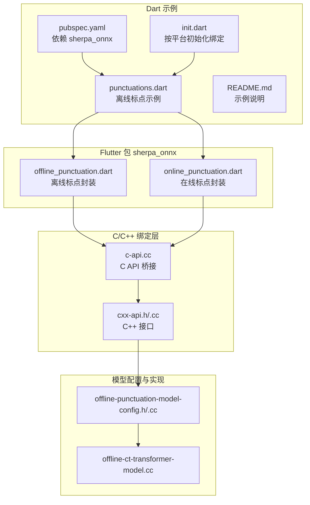
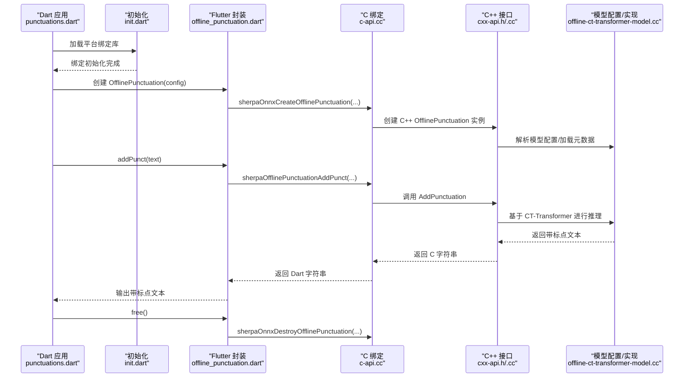
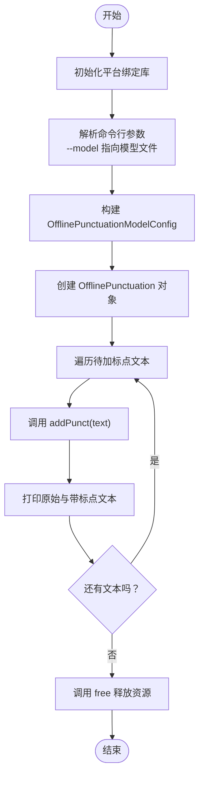
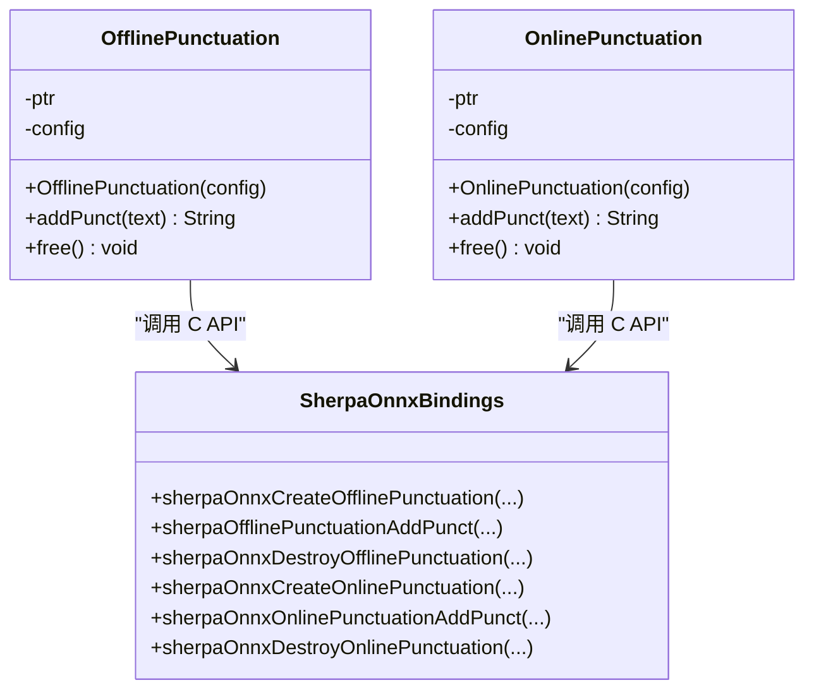
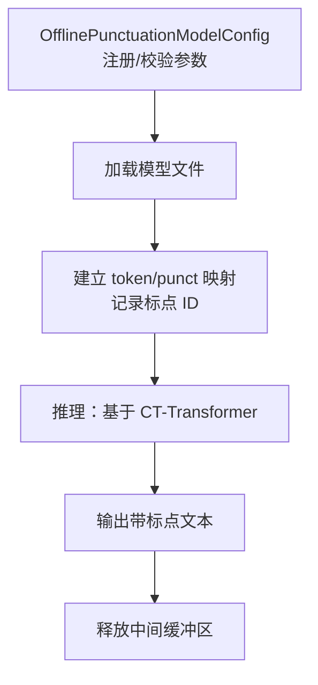
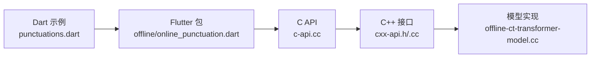

# 添加标点符号示例

<cite>
**本文引用的文件列表**
- [dart-api-examples/add-punctuations/pubspec.yaml](file://dart-api-examples/add-punctuations/pubspec.yaml)
- [dart-api-examples/add-punctuations/bin/punctuations.dart](file://dart-api-examples/add-punctuations/bin/punctuations.dart)
- [dart-api-examples/add-punctuations/bin/init.dart](file://dart-api-examples/add-punctuations/bin/init.dart)
- [dart-api-examples/add-punctuations/README.md](file://dart-api-examples/add-punctuations/README.md)
- [flutter/sherpa_onnx/pubspec.yaml](file://flutter/sherpa_onnx/pubspec.yaml)
- [flutter/sherpa_onnx/lib/src/offline_punctuation.dart](file://flutter/sherpa_onnx/lib/src/offline_punctuation.dart)
- [flutter/sherpa_onnx/lib/src/online_punctuation.dart](file://flutter/sherpa_onnx/lib/src/online_punctuation.dart)
- [sherpa-onnx/c-api/c-api.cc](file://sherpa-onnx/c-api/c-api.cc)
- [sherpa-onnx/c-api/cxx-api.h](file://sherpa-onnx/c-api/cxx-api.h)
- [sherpa-onnx/c-api/cxx-api.cc](file://sherpa-onnx/c-api/cxx-api.cc)
- [sherpa-onnx/csrc/offline-punctuation-model-config.h](file://sherpa-onnx/csrc/offline-punctuation-model-config.h)
- [sherpa-onnx/csrc/offline-punctuation-model-config.cc](file://sherpa-onnx/csrc/offline-punctuation-model-config.cc)
- [sherpa-onnx/csrc/offline-ct-transformer-model.cc](file://sherpa-onnx/csrc/offline-ct-transformer-model.cc)
- [python-api-examples/add-punctuation.py](file://python-api-examples/add-punctuation.py)
- [python-api-examples/add-punctuation-online.py](file://python-api-examples/add-punctuation-online.py)
- [java-api-examples/OnlineAddPunctuation.java](file://java-api-examples/OnlineAddPunctuation.java)
- [kotlin-api-examples/test_offline_punctuation.kt](file://kotlin-api-examples/test_offline_punctuation.kt)
- [kotlin-api-examples/test_online_punctuation.kt](file://kotlin-api-examples/test_online_punctuation.kt)
- [c-api-examples/add-punctuation-c-api.c](file://c-api-examples/add-punctuation-c-api.c)
</cite>

## 目录
1. [简介](#简介)
2. [项目结构](#项目结构)
3. [核心组件](#核心组件)
4. [架构总览](#架构总览)
5. [组件详解](#组件详解)
6. [依赖关系分析](#依赖关系分析)
7. [性能与资源特性](#性能与资源特性)
8. [故障排查指南](#故障排查指南)
9. [结论](#结论)
10. [附录：标点规则与最佳实践](#附录标点规则与最佳实践)

## 简介
本文件围绕 sherpa-onnx 的 Dart API 添加标点符号示例进行系统化说明，重点覆盖：
- 如何在 Dart 中使用离线与在线标点添加能力
- 标点模型的加载、文本分析与标点插入流程
- 不同语言与场景下的标点规则配置建议
- 与其他语言（Python、Java、Kotlin、C/C++）示例的对照与迁移路径
- 错误处理、内存释放与平台初始化要点

## 项目结构
Dart 示例位于 dart-api-examples/add-punctuations，核心文件包括：
- 配置与依赖：pubspec.yaml
- 初始化绑定：bin/init.dart
- 示例入口：bin/punctuations.dart
- 文档说明：README.md

图表来源
- [dart-api-examples/add-punctuations/pubspec.yaml](file://dart-api-examples/add-punctuations/pubspec.yaml#L1-L18)
- [dart-api-examples/add-punctuations/bin/init.dart](file://dart-api-examples/add-punctuations/bin/init.dart#L1-L39)
- [dart-api-examples/add-punctuations/bin/punctuations.dart](file://dart-api-examples/add-punctuations/bin/punctuations.dart#L1-L46)
- [flutter/sherpa_onnx/lib/src/offline_punctuation.dart](file://flutter/sherpa_onnx/lib/src/offline_punctuation.dart#L53-L100)
- [flutter/sherpa_onnx/lib/src/online_punctuation.dart](file://flutter/sherpa_onnx/lib/src/online_punctuation.dart#L99-L139)
- [sherpa-onnx/c-api/c-api.cc](file://sherpa-onnx/c-api/c-api.cc#L2020-L2060)
- [sherpa-onnx/c-api/cxx-api.h](file://sherpa-onnx/c-api/cxx-api.h#L715-L756)
- [sherpa-onnx/c-api/cxx-api.cc](file://sherpa-onnx/c-api/cxx-api.cc#L830-L867)
- [sherpa-onnx/csrc/offline-punctuation-model-config.h](file://sherpa-onnx/csrc/offline-punctuation-model-config.h#L1-L38)
- [sherpa-onnx/csrc/offline-punctuation-model-config.cc](file://sherpa-onnx/csrc/offline-punctuation-model-config.cc#L1-L55)
- [sherpa-onnx/csrc/offline-ct-transformer-model.cc](file://sherpa-onnx/csrc/offline-ct-transformer-model.cc#L91-L139)

章节来源
- [dart-api-examples/add-punctuations/pubspec.yaml](file://dart-api-examples/add-punctuations/pubspec.yaml#L1-L18)
- [dart-api-examples/add-punctuations/bin/init.dart](file://dart-api-examples/add-punctuations/bin/init.dart#L1-L39)
- [dart-api-examples/add-punctuations/bin/punctuations.dart](file://dart-api-examples/add-punctuations/bin/punctuations.dart#L1-L46)
- [dart-api-examples/add-punctuations/README.md](file://dart-api-examples/add-punctuations/README.md#L1-L9)

## 核心组件
- Dart 示例入口：负责初始化 sherpa-onnx 绑定、解析命令行参数、构造离线标点配置并调用 addPunct 进行标点插入。
- Flutter 包封装：提供 OfflinePunctuation 与 OnlinePunctuation 类，完成模型配置到 C/C++ 绑定层的转换与调用。
- C/C++ 绑定层：提供创建、销毁与推理接口；C++ 层进一步封装为 C++ API。
- 模型配置与实现：定义离线 CT-Transformer 模型的元数据、词汇表映射与标点 ID，确保标点插入的准确性。

章节来源
- [dart-api-examples/add-punctuations/bin/punctuations.dart](file://dart-api-examples/add-punctuations/bin/punctuations.dart#L1-L46)
- [flutter/sherpa_onnx/lib/src/offline_punctuation.dart](file://flutter/sherpa_onnx/lib/src/offline_punctuation.dart#L53-L100)
- [flutter/sherpa_onnx/lib/src/online_punctuation.dart](file://flutter/sherpa_onnx/lib/src/online_punctuation.dart#L99-L139)
- [sherpa-onnx/c-api/c-api.cc](file://sherpa-onnx/c-api/c-api.cc#L2020-L2060)
- [sherpa-onnx/c-api/cxx-api.h](file://sherpa-onnx/c-api/cxx-api.h#L715-L756)
- [sherpa-onnx/c-api/cxx-api.cc](file://sherpa-onnx/c-api/cxx-api.cc#L830-L867)
- [sherpa-onnx/csrc/offline-punctuation-model-config.h](file://sherpa-onnx/csrc/offline-punctuation-model-config.h#L1-L38)
- [sherpa-onnx/csrc/offline-punctuation-model-config.cc](file://sherpa-onnx/csrc/offline-punctuation-model-config.cc#L1-L55)
- [sherpa-onnx/csrc/offline-ct-transformer-model.cc](file://sherpa-onnx/csrc/offline-ct-transformer-model.cc#L91-L139)

## 架构总览
下图展示了 Dart 调用链路从应用层到底层推理的完整流程。

图表来源
- [dart-api-examples/add-punctuations/bin/punctuations.dart](file://dart-api-examples/add-punctuations/bin/punctuations.dart#L1-L46)
- [dart-api-examples/add-punctuations/bin/init.dart](file://dart-api-examples/add-punctuations/bin/init.dart#L1-L39)
- [flutter/sherpa_onnx/lib/src/offline_punctuation.dart](file://flutter/sherpa_onnx/lib/src/offline_punctuation.dart#L53-L100)
- [sherpa-onnx/c-api/c-api.cc](file://sherpa-onnx/c-api/c-api.cc#L2020-L2060)
- [sherpa-onnx/c-api/cxx-api.h](file://sherpa-onnx/c-api/cxx-api.h#L715-L756)
- [sherpa-onnx/c-api/cxx-api.cc](file://sherpa-onnx/c-api/cxx-api.cc#L830-L867)
- [sherpa-onnx/csrc/offline-ct-transformer-model.cc](file://sherpa-onnx/csrc/offline-ct-transformer-model.cc#L91-L139)

## 组件详解

### Dart 示例入口：离线标点添加
- 初始化：通过 init.dart 根据操作系统选择对应平台绑定库并调用 initBindings 完成绑定初始化。
- 配置：构建 OfflinePunctuationModelConfig，指定模型文件路径、线程数、执行提供者与调试开关。
- 调用：创建 OfflinePunctuation 实例后，对一组测试文本逐条调用 addPunct 并打印结果。
- 清理：调用 free 释放底层资源。

图表来源
- [dart-api-examples/add-punctuations/bin/punctuations.dart](file://dart-api-examples/add-punctuations/bin/punctuations.dart#L1-L46)
- [dart-api-examples/add-punctuations/bin/init.dart](file://dart-api-examples/add-punctuations/bin/init.dart#L1-L39)

章节来源
- [dart-api-examples/add-punctuations/bin/punctuations.dart](file://dart-api-examples/add-punctuations/bin/punctuations.dart#L1-L46)
- [dart-api-examples/add-punctuations/bin/init.dart](file://dart-api-examples/add-punctuations/bin/init.dart#L1-L39)

### Flutter 封装：OfflinePunctuation 与 OnlinePunctuation
- OfflinePunctuation
  - 工厂构造：将 Dart 配置转换为 C 结构体，调用 C API 创建实例。
  - addPunct：将输入文本转为 UTF-8 指针，调用 C API 执行推理，再将返回的 C 字符串转回 Dart 字符串并释放。
  - free：调用 C API 销毁底层对象。
- OnlinePunctuation
  - 工厂构造：支持 CNN-BiLSTM 与 BPE 词表配置，创建在线标点实例。
  - addPunct：与离线类似，但面向在线推理流程。
  - free：销毁在线实例。

图表来源
- [flutter/sherpa_onnx/lib/src/offline_punctuation.dart](file://flutter/sherpa_onnx/lib/src/offline_punctuation.dart#L53-L100)
- [flutter/sherpa_onnx/lib/src/offline_punctuation.dart](file://flutter/sherpa_onnx/lib/src/offline_punctuation.dart#L107-L125)
- [flutter/sherpa_onnx/lib/src/online_punctuation.dart](file://flutter/sherpa_onnx/lib/src/online_punctuation.dart#L99-L139)
- [sherpa-onnx/c-api/c-api.cc](file://sherpa-onnx/c-api/c-api.cc#L2020-L2060)

章节来源
- [flutter/sherpa_onnx/lib/src/offline_punctuation.dart](file://flutter/sherpa_onnx/lib/src/offline_punctuation.dart#L53-L100)
- [flutter/sherpa_onnx/lib/src/offline_punctuation.dart](file://flutter/sherpa_onnx/lib/src/offline_punctuation.dart#L107-L125)
- [flutter/sherpa_onnx/lib/src/online_punctuation.dart](file://flutter/sherpa_onnx/lib/src/online_punctuation.dart#L99-L139)

### C/C++ 绑定与模型实现
- C API：提供创建/销毁与推理函数，负责将 Dart/Flutter 传入的指针与字符串安全地传递到底层推理引擎。
- C++ 接口：封装离线与在线标点类，负责模型配置校验、会话创建、推理与输出释放。
- 模型配置：离线 CT-Transformer 支持注册参数（如模型路径、线程数、提供者、调试开关），并在加载时校验文件存在性。
- 模型实现：维护 token 到 id、标点到 id 的映射，以及特殊符号（句号、逗号、问号、停顿、下划线等）的 ID，用于推理阶段的标点插入。

图表来源
- [sherpa-onnx/c-api/cxx-api.h](file://sherpa-onnx/c-api/cxx-api.h#L715-L756)
- [sherpa-onnx/c-api/cxx-api.cc](file://sherpa-onnx/c-api/cxx-api.cc#L830-L867)
- [sherpa-onnx/csrc/offline-punctuation-model-config.h](file://sherpa-onnx/csrc/offline-punctuation-model-config.h#L1-L38)
- [sherpa-onnx/csrc/offline-punctuation-model-config.cc](file://sherpa-onnx/csrc/offline-punctuation-model-config.cc#L1-L55)
- [sherpa-onnx/csrc/offline-ct-transformer-model.cc](file://sherpa-onnx/csrc/offline-ct-transformer-model.cc#L91-L139)

章节来源
- [sherpa-onnx/c-api/c-api.cc](file://sherpa-onnx/c-api/c-api.cc#L2020-L2060)
- [sherpa-onnx/c-api/cxx-api.h](file://sherpa-onnx/c-api/cxx-api.h#L715-L756)
- [sherpa-onnx/c-api/cxx-api.cc](file://sherpa-onnx/c-api/cxx-api.cc#L830-L867)
- [sherpa-onnx/csrc/offline-punctuation-model-config.h](file://sherpa-onnx/csrc/offline-punctuation-model-config.h#L1-L38)
- [sherpa-onnx/csrc/offline-punctuation-model-config.cc](file://sherpa-onnx/csrc/offline-punctuation-model-config.cc#L1-L55)
- [sherpa-onnx/csrc/offline-ct-transformer-model.cc](file://sherpa-onnx/csrc/offline-ct-transformer-model.cc#L91-L139)

### 其他语言示例对照
- Python：提供离线与在线标点示例脚本，展示模型路径与文本输入输出格式。
- Java/Kotlin：分别演示在线与离线标点的配置与调用方式，便于迁移至 Dart。
- C API：直接展示离线标点推理的最小调用序列。

章节来源
- [python-api-examples/add-punctuation.py](file://python-api-examples/add-punctuation.py#L1-L46)
- [python-api-examples/add-punctuation-online.py](file://python-api-examples/add-punctuation-online.py#L1-L48)
- [java-api-examples/OnlineAddPunctuation.java](file://java-api-examples/OnlineAddPunctuation.java#L1-L41)
- [kotlin-api-examples/test_offline_punctuation.kt](file://kotlin-api-examples/test_offline_punctuation.kt#L1-L31)
- [kotlin-api-examples/test_online_punctuation.kt](file://kotlin-api-examples/test_online_punctuation.kt#L1-L30)
- [c-api-examples/add-punctuation-c-api.c](file://c-api-examples/add-punctuation-c-api.c#L43-L67)

## 依赖关系分析
- Dart 示例依赖 flutter/sherpa_onnx 包，后者在各平台提供原生绑定库并通过 initBindings 注入。
- Flutter 封装通过 FFI 调用 C API，C API 再委托 C++ 接口完成推理。
- 模型配置与实现位于 C++ 层，负责模型加载、参数校验与推理逻辑。

图表来源
- [dart-api-examples/add-punctuations/bin/punctuations.dart](file://dart-api-examples/add-punctuations/bin/punctuations.dart#L1-L46)
- [flutter/sherpa_onnx/lib/src/offline_punctuation.dart](file://flutter/sherpa_onnx/lib/src/offline_punctuation.dart#L53-L100)
- [flutter/sherpa_onnx/lib/src/online_punctuation.dart](file://flutter/sherpa_onnx/lib/src/online_punctuation.dart#L99-L139)
- [sherpa-onnx/c-api/c-api.cc](file://sherpa-onnx/c-api/c-api.cc#L2020-L2060)
- [sherpa-onnx/c-api/cxx-api.h](file://sherpa-onnx/c-api/cxx-api.h#L715-L756)
- [sherpa-onnx/c-api/cxx-api.cc](file://sherpa-onnx/c-api/cxx-api.cc#L830-L867)
- [sherpa-onnx/csrc/offline-ct-transformer-model.cc](file://sherpa-onnx/csrc/offline-ct-transformer-model.cc#L91-L139)

章节来源
- [flutter/sherpa_onnx/pubspec.yaml](file://flutter/sherpa_onnx/pubspec.yaml#L1-L73)
- [dart-api-examples/add-punctuations/pubspec.yaml](file://dart-api-examples/add-punctuations/pubspec.yaml#L1-L18)

## 性能与资源特性
- 线程数与提供者：可通过配置调整 num_threads 与 provider，以平衡吞吐与延迟。
- 资源释放：务必在使用完毕后调用 free，避免内存泄漏。
- 模型大小与加载时间：离线 CT-Transformer 模型较大，首次加载耗时较长；建议在应用启动阶段预热或异步加载。
- 平台差异：不同平台绑定库的初始化路径不同，需遵循 init.dart 的平台分支逻辑。

章节来源
- [flutter/sherpa_onnx/lib/src/offline_punctuation.dart](file://flutter/sherpa_onnx/lib/src/offline_punctuation.dart#L107-L125)
- [flutter/sherpa_onnx/lib/src/online_punctuation.dart](file://flutter/sherpa_onnx/lib/src/online_punctuation.dart#L117-L135)
- [dart-api-examples/add-punctuations/bin/init.dart](file://dart-api-examples/add-punctuations/bin/init.dart#L1-L39)
- [sherpa-onnx/csrc/offline-punctuation-model-config.cc](file://sherpa-onnx/csrc/offline-punctuation-model-config.cc#L1-L55)

## 故障排查指南
- 绑定未初始化：若未调用 initBindings 或平台路径不正确，将导致无法创建标点对象。请检查 init.dart 的平台判断与库路径。
- 模型文件缺失：离线配置要求提供有效的模型文件路径，否则创建失败。请确认 --model 参数指向的文件存在且可读。
- 空指针与内存释放：addPunct 返回空字符串通常表示推理失败或返回为空；务必在使用后调用 free 释放底层资源。
- 在线模型配置：在线标点需要 CNN-BiLSTM 与 BPE 词表，若缺少任一文件将导致创建失败。
- 跨语言迁移：参考 Python/Java/Kotlin 示例，核对模型路径、参数名称与调用顺序。

章节来源
- [dart-api-examples/add-punctuations/bin/init.dart](file://dart-api-examples/add-punctuations/bin/init.dart#L1-L39)
- [flutter/sherpa_onnx/lib/src/offline_punctuation.dart](file://flutter/sherpa_onnx/lib/src/offline_punctuation.dart#L70-L100)
- [flutter/sherpa_onnx/lib/src/online_punctuation.dart](file://flutter/sherpa_onnx/lib/src/online_punctuation.dart#L99-L111)
- [sherpa-onnx/csrc/offline-punctuation-model-config.cc](file://sherpa-onnx/csrc/offline-punctuation-model-config.cc#L28-L41)
- [python-api-examples/add-punctuation-online.py](file://python-api-examples/add-punctuation-online.py#L1-L48)
- [java-api-examples/OnlineAddPunctuation.java](file://java-api-examples/OnlineAddPunctuation.java#L1-L41)
- [kotlin-api-examples/test_offline_punctuation.kt](file://kotlin-api-examples/test_offline_punctuation.kt#L1-L31)
- [kotlin-api-examples/test_online_punctuation.kt](file://kotlin-api-examples/test_online_punctuation.kt#L1-L30)

## 结论
Dart 示例通过 Flutter 包与 C/C++ 绑定层，实现了离线标点添加的完整调用链。开发者只需关注配置与调用，即可在多平台上获得稳定的标点插入能力。配合其他语言示例，可快速完成跨语言迁移与集成。

## 附录：标点规则与最佳实践
- 适用场景
  - 语音识别后处理：为无标点的识别文本自动添加标点，提升可读性与后续处理质量。
  - 字幕生成：结合 VAD+ASR 流程，实时或离线生成带标点的字幕文本。
  - 文本编辑与摘要：为后续 NLP 任务提供更规范的输入文本。
- 不同语言与标点规则
  - 中文：常用标点包括句号“。”、逗号“，”、问号“？”、顿号“、”。CT-Transformer 支持中英混合文本，标点插入需考虑中英文边界。
  - 英文：常见标点包括句号“.”、逗号“,”、问号“?”、感叹号“!”。在线模型通常仅支持英文。
  - 混合文本：优先依据语言边界与上下文语义插入标点；对于连续的中英混杂片段，建议先做分词或语言检测再插入标点。
- 配置建议
  - 离线模型：优先使用 CT-Transformer，支持中英混合；根据设备性能调整 num_threads 与 provider。
  - 在线模型：适合流式场景，需提供 CNN-BiLSTM 与 BPE 词表；英文为主时可选用在线模型以降低延迟。
  - 调试与验证：开启 debug 查看模型元数据与标点集合，便于验证标点插入是否符合预期。
- 后续处理
  - 标点规范化：可结合 ITN（逆文本正则化）与大小写恢复，进一步提升文本质量。
  - 多模态应用：与 TTS、字幕渲染等模块联动，形成端到端的语音到文本到呈现流水线。

章节来源
- [sherpa-onnx/csrc/offline-ct-transformer-model.cc](file://sherpa-onnx/csrc/offline-ct-transformer-model.cc#L91-L139)
- [python-api-examples/add-punctuation.py](file://python-api-examples/add-punctuation.py#L1-L46)
- [python-api-examples/add-punctuation-online.py](file://python-api-examples/add-punctuation-online.py#L1-L48)