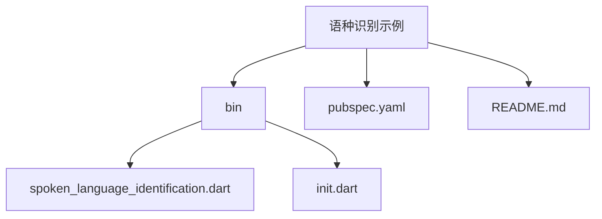
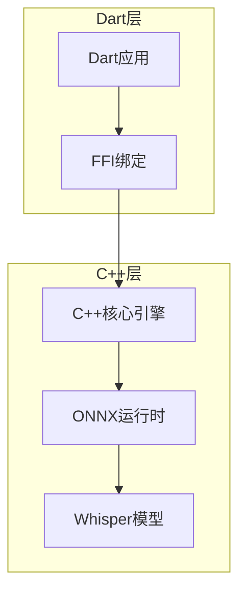
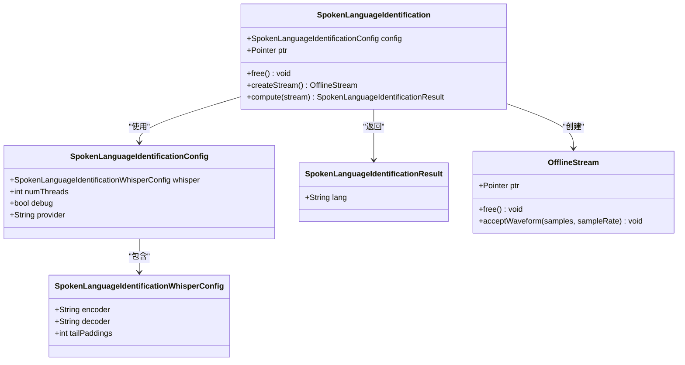
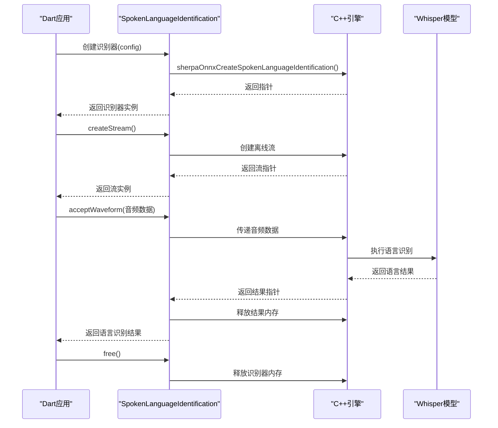
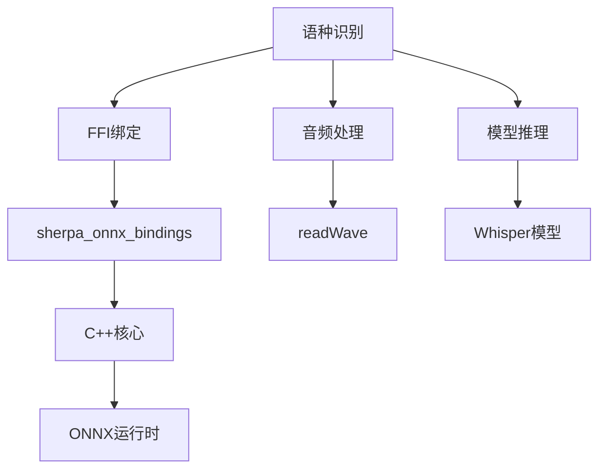

# 语种识别示例

<cite>
**本文档引用的文件**
- [spoken_language_identification.dart](file://dart-api-examples/spoken-language-identification/bin/spoken_language_identification.dart)
- [spoken_language_identification.dart](file://flutter/sherpa_onnx/lib/src/spoken_language_identification.dart)
- [init.dart](file://dart-api-examples/spoken-language-identification/bin/init.dart)
- [sherpa_onnx_bindings.dart](file://flutter/sherpa_onnx/lib/src/sherpa_onnx_bindings.dart)
- [offline_stream.dart](file://flutter/sherpa_onnx/lib/src/offline_stream.dart)
- [spoken-language-identification.cc](file://sherpa-onnx/csrc/spoken-language-identification.cc)
- [spoken-language-identification-impl.h](file://sherpa-onnx/csrc/spoken-language-identification-impl.h)
- [spoken-language-identification.cc](file://sherpa-onnx/jni/spoken-language-identification.cc)
</cite>

## 目录
1. [简介](#简介)
2. [项目结构](#项目结构)
3. [核心组件](#核心组件)
4. [架构概述](#架构概述)
5. [详细组件分析](#详细组件分析)
6. [依赖分析](#依赖分析)
7. [性能考虑](#性能考虑)
8. [故障排除指南](#故障排除指南)
9. [结论](#结论)

## 简介
本示例展示了如何使用sherpa-onnx的Dart API进行口语语种识别。该功能利用Whisper模型来识别音频文件中的语言种类，适用于多语言环境和自动翻译场景。通过Dart API，开发者可以在Flutter应用中轻松集成语种识别功能，实现跨平台的语音处理能力。

## 项目结构
语种识别示例位于`dart-api-examples/spoken-language-identification/`目录下，包含Dart命令行应用所需的核心文件。该结构遵循Dart项目标准，包含配置文件、源代码和初始化脚本。

**图示来源**
- [spoken_language_identification.dart](file://dart-api-examples/spoken-language-identification/bin/spoken_language_identification.dart)
- [init.dart](file://dart-api-examples/spoken-language-identification/bin/init.dart)
- [pubspec.yaml](file://dart-api-examples/spoken-language-identification/pubspec.yaml)

**本节来源**
- [pubspec.yaml](file://dart-api-examples/spoken-language-identification/pubspec.yaml)
- [README.md](file://dart-api-examples/spoken-language-identification/README.md)

## 核心组件
语种识别功能的核心组件包括配置类、识别器类和结果类。这些组件协同工作，完成从音频输入到语言识别的完整流程。Dart API通过FFI（外部函数接口）与底层C++实现进行交互，确保了高性能的语音处理能力。

**本节来源**
- [spoken_language_identification.dart](file://flutter/sherpa_onnx/lib/src/spoken_language_identification.dart)
- [spoken_language_identification.dart](file://dart-api-examples/spoken-language-identification/bin/spoken_language_identification.dart)

## 架构概述
语种识别系统采用分层架构，从Dart应用层到C++核心引擎层，通过FFI进行高效通信。系统利用Whisper模型进行语言识别，支持多线程处理和CPU/GPU加速。整体架构设计注重内存管理和性能优化，确保在移动设备上的流畅运行。

**图示来源**
- [sherpa_onnx_bindings.dart](file://flutter/sherpa_onnx/lib/src/sherpa_onnx_bindings.dart)
- [spoken-language-identification.cc](file://sherpa-onnx/csrc/spoken-language-identification.cc)
- [spoken-language-identification-impl.h](file://sherpa-onnx/csrc/spoken-language-identification-impl.h)

## 详细组件分析
### 语种识别器分析
语种识别器是系统的核心组件，负责加载模型、处理音频流和执行语言识别。识别器通过工厂模式创建，确保了内存的正确管理和资源的及时释放。

#### 对象导向组件

**图示来源**
- [spoken_language_identification.dart](file://flutter/sherpa_onnx/lib/src/spoken_language_identification.dart)
- [offline_stream.dart](file://flutter/sherpa_onnx/lib/src/offline_stream.dart)

#### API服务组件

**图示来源**
- [spoken_language_identification.dart](file://dart-api-examples/spoken-language-identification/bin/spoken_language_identification.dart)
- [spoken-language-identification.cc](file://sherpa-onnx/jni/spoken-language-identification.cc)
- [spoken-language-identification.cc](file://sherpa-onnx/csrc/spoken-language-identification.cc)

**本节来源**
- [spoken_language_identification.dart](file://flutter/sherpa_onnx/lib/src/spoken_language_identification.dart)
- [spoken_language_identification.dart](file://dart-api-examples/spoken-language-identification/bin/spoken_language_identification.dart)
- [init.dart](file://dart-api-examples/spoken-language-identification/bin/init.dart)

## 依赖分析
语种识别功能依赖于多个核心组件，包括FFI绑定、音频处理和模型推理引擎。这些依赖关系确保了系统的稳定性和性能。

**图示来源**
- [sherpa_onnx_bindings.dart](file://flutter/sherpa_onnx/lib/src/sherpa_onnx_bindings.dart)
- [spoken_language_identification.dart](file://flutter/sherpa_onnx/lib/src/spoken_language_identification.dart)

**本节来源**
- [pubspec.yaml](file://dart-api-examples/spoken-language-identification/pubspec.yaml)
- [sherpa_onnx_bindings.dart](file://flutter/sherpa_onnx/lib/src/sherpa_onnx_bindings.dart)

## 性能考虑
语种识别功能在设计时充分考虑了性能因素。通过多线程处理和内存池优化，系统能够在移动设备上高效运行。建议在实际应用中根据设备性能调整线程数和内存使用策略，以获得最佳的识别速度和准确率。

## 故障排除指南
在使用语种识别功能时，可能会遇到模型加载失败、内存泄漏或识别准确率低等问题。确保正确初始化sherpa-onnx库，及时释放识别器和流的内存，并使用合适的Whisper模型版本。对于多语种混合场景，建议使用支持多语言识别的模型变体，并适当调整尾部填充参数以提高识别准确率。

**本节来源**
- [init.dart](file://dart-api-examples/spoken-language-identification/bin/init.dart)
- [spoken_language_identification.dart](file://flutter/sherpa_onnx/lib/src/spoken_language_identification.dart)

## 结论
sherpa-onnx的Dart API为语种识别提供了强大而灵活的解决方案。通过Whisper模型的支持，开发者可以轻松实现高准确率的语言识别功能。该功能在多语言环境、自动翻译和语音助手等场景中具有广泛的应用前景。通过合理的配置和优化，可以在各种设备上实现高效的语种识别。