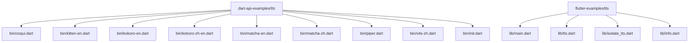
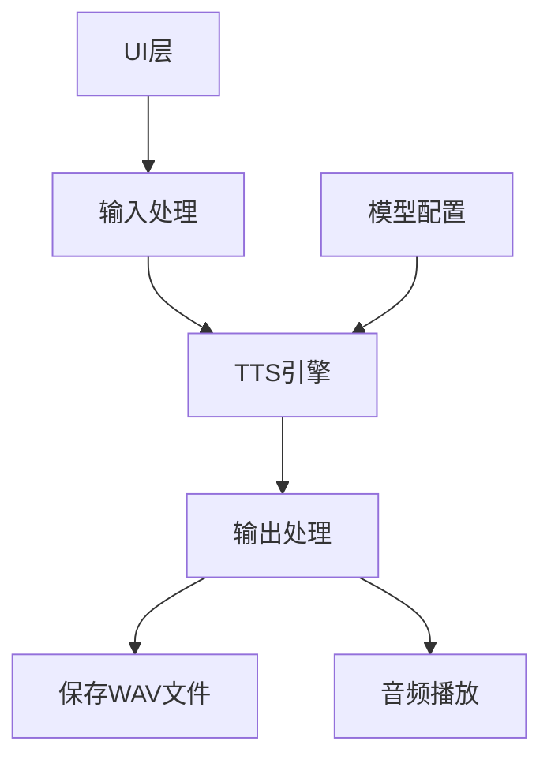
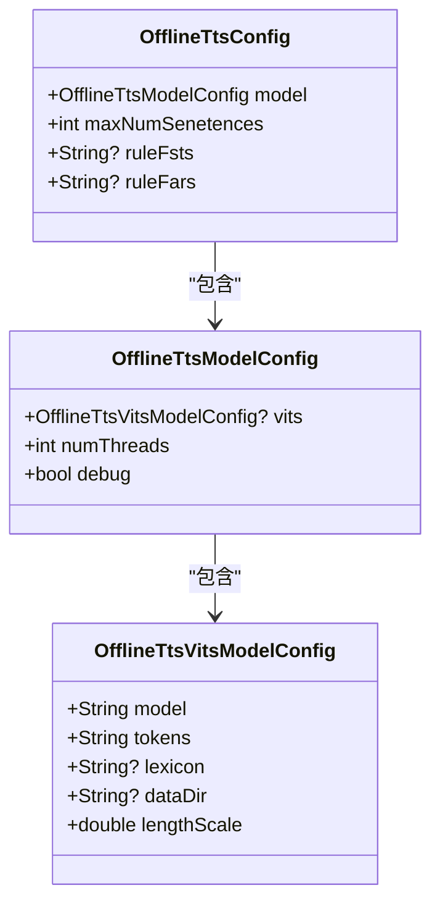
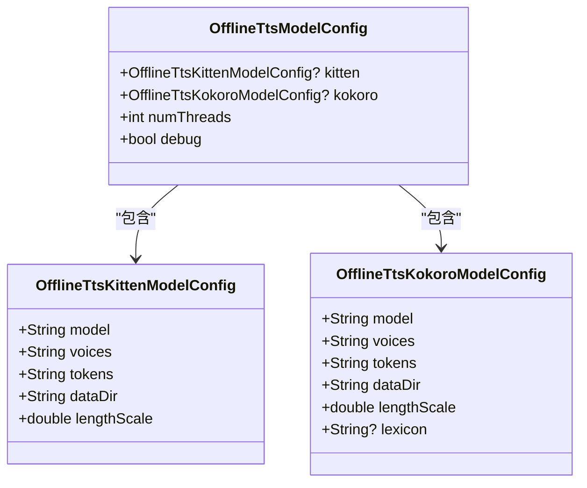
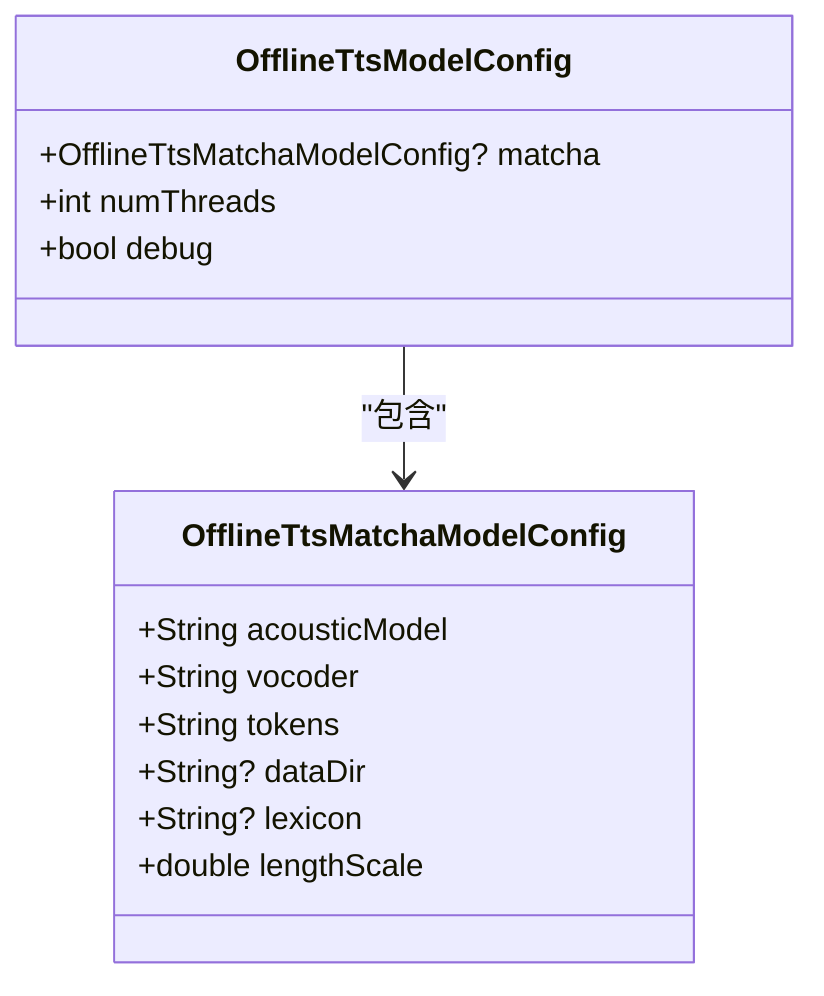
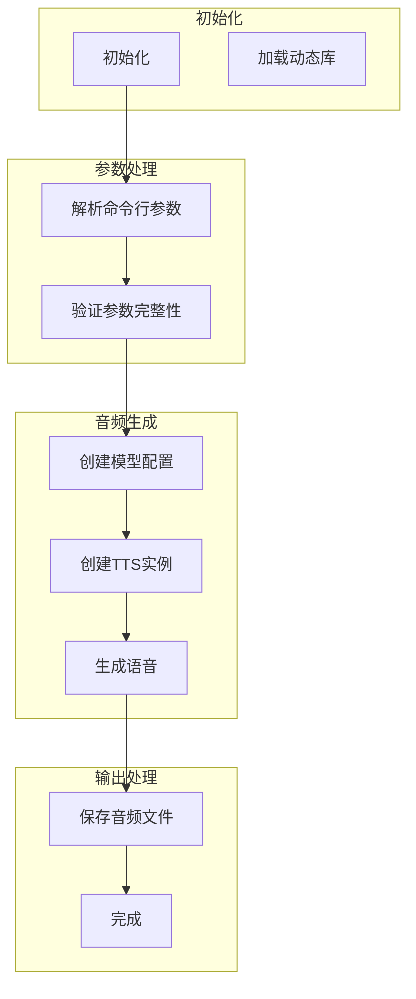
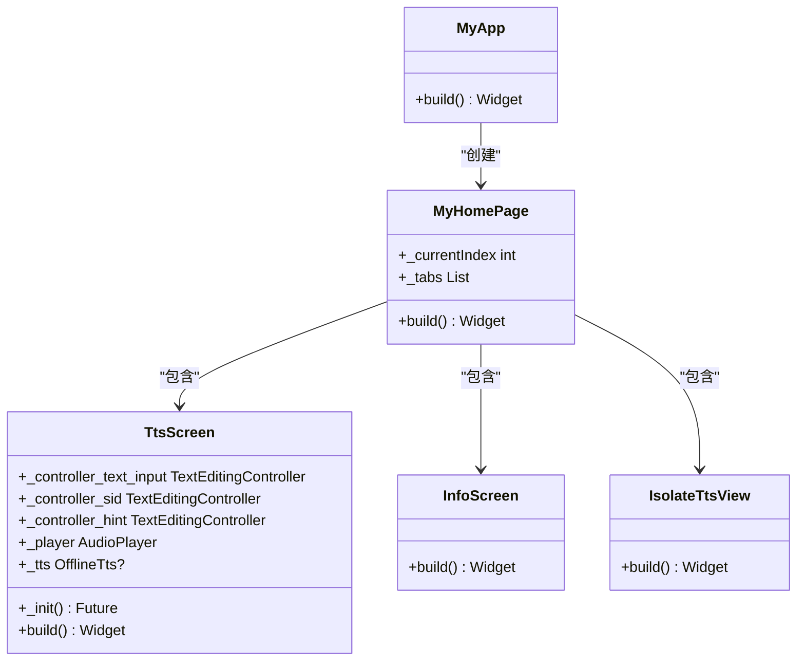
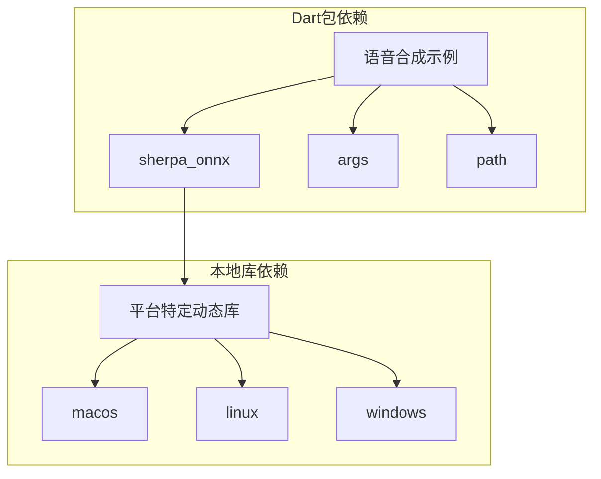

# 语音合成示例

<cite>
**本文档引用的文件**
- [coqui.dart](file://dart-api-examples/tts/bin/coqui.dart)
- [kitten-en.dart](file://dart-api-examples/tts/bin/kitten-en.dart)
- [kokoro-en.dart](file://dart-api-examples/tts/bin/kokoro-en.dart)
- [kokoro-zh-en.dart](file://dart-api-examples/tts/bin/kokoro-zh-en.dart)
- [matcha-en.dart](file://dart-api-examples/tts/bin/matcha-en.dart)
- [matcha-zh.dart](file://dart-api-examples/tts/bin/matcha-zh.dart)
- [piper.dart](file://dart-api-examples/tts/bin/piper.dart)
- [vits-zh.dart](file://dart-api-examples/tts/bin/vits-zh.dart)
- [init.dart](file://dart-api-examples/tts/bin/init.dart)
- [tts.dart](file://flutter-examples/tts/lib/tts.dart)
- [isolate_tts.dart](file://flutter-examples/tts/lib/isolate_tts.dart)
- [pubspec.yaml](file://dart-api-examples/tts/pubspec.yaml)
- [main.dart](file://flutter-examples/tts/lib/main.dart)
</cite>

## 目录
1. [简介](#简介)
2. [项目结构](#项目结构)
3. [核心组件](#核心组件)
4. [架构概述](#架构概述)
5. [详细组件分析](#详细组件分析)
6. [依赖分析](#依赖分析)
7. [性能考虑](#性能考虑)
8. [故障排除指南](#故障排除指南)
9. [结论](#结论)

## 简介
本文档全面解释了sherpa-onnx Dart API中的语音合成（TTS）示例代码。文档涵盖了coqui、kitten、kokoro、matcha、piper、vits等多种语音合成模型的使用方法，详细说明了如何在Dart语言中调用TTS接口生成语音，处理文本输入和音频输出。通过代码解析，展示了不同TTS模型的参数配置、音色选择和语音生成过程，解释了多语言支持（如zh-en）的实现方式，并提供了音频播放集成和性能优化建议。

## 项目结构
Dart API的语音合成示例位于`dart-api-examples/tts`目录下，包含多个针对不同TTS模型的实现文件。每个文件都实现了特定语音合成模型的调用逻辑，通过命令行参数接收输入文本、模型路径、输出文件等配置。Flutter示例位于`flutter-examples/tts`目录下，提供了图形用户界面，支持语音生成、播放和参数调整功能。

**图示来源**
- [coqui.dart](file://dart-api-examples/tts/bin/coqui.dart)
- [kitten-en.dart](file://dart-api-examples/tts/bin/kitten-en.dart)
- [kokoro-en.dart](file://dart-api-examples/tts/bin/kokoro-en.dart)
- [kokoro-zh-en.dart](file://dart-api-examples/tts/bin/kokoro-zh-en.dart)
- [matcha-en.dart](file://dart-api-examples/tts/bin/matcha-en.dart)
- [matcha-zh.dart](file://dart-api-examples/tts/bin/matcha-zh.dart)
- [piper.dart](file://dart-api-examples/tts/bin/piper.dart)
- [vits-zh.dart](file://dart-api-examples/tts/bin/vits-zh.dart)
- [main.dart](file://flutter-examples/tts/lib/main.dart)
- [tts.dart](file://flutter-examples/tts/lib/tts.dart)

**章节来源**
- [pubspec.yaml](file://dart-api-examples/tts/pubspec.yaml)
- [main.dart](file://flutter-examples/tts/lib/main.dart)

## 核心组件
语音合成示例的核心组件包括TTS模型配置、语音生成引擎和音频输出处理。所有示例都基于`sherpa_onnx`包提供的Dart API，通过`OfflineTts`类实现离线语音合成功能。不同模型通过特定的配置类（如`OfflineTtsVitsModelConfig`、`OfflineTtsKittenModelConfig`等）进行参数设置，支持多语言、多音色和语速调整。

**章节来源**
- [coqui.dart](file://dart-api-examples/tts/bin/coqui.dart#L42-L58)
- [kitten-en.dart](file://dart-api-examples/tts/bin/kitten-en.dart#L56-L68)
- [kokoro-en.dart](file://dart-api-examples/tts/bin/kokoro-en.dart#L56-L68)
- [matcha-en.dart](file://dart-api-examples/tts/bin/matcha-en.dart#L56-L68)
- [piper.dart](file://dart-api-examples/tts/bin/piper.dart#L46-L58)
- [vits-zh.dart](file://dart-api-examples/tts/bin/vits-zh.dart#L49-L59)

## 架构概述
语音合成系统的架构分为三层：输入处理层、TTS引擎层和输出处理层。输入处理层负责接收文本输入和参数配置；TTS引擎层调用相应的语音合成模型生成音频数据；输出处理层将生成的音频保存为WAV文件或直接播放。Flutter示例还包含UI层，提供用户交互界面。

**图示来源**
- [tts.dart](file://flutter-examples/tts/lib/tts.dart#L113-L178)
- [isolate_tts.dart](file://flutter-examples/tts/lib/isolate_tts.dart#L207-L217)
- [init.dart](file://dart-api-examples/tts/bin/init.dart#L7-L38)

**章节来源**
- [tts.dart](file://flutter-examples/tts/lib/tts.dart#L1-L244)
- [isolate_tts.dart](file://flutter-examples/tts/lib/isolate_tts.dart#L1-L249)

## 详细组件分析

### TTS模型配置分析
不同TTS模型的配置方式略有差异，但都遵循相同的配置模式：创建模型特定的配置对象，然后将其嵌入到通用的`OfflineTtsModelConfig`中。

#### VITS模型配置
VITS模型（如coqui和vits-zh）需要指定模型文件、tokens文件和词典文件。中文VITS模型还需要lexicon文件来处理中文文本的发音。

**图示来源**
- [coqui.dart](file://dart-api-examples/tts/bin/coqui.dart#L42-L46)
- [vits-zh.dart](file://dart-api-examples/tts/bin/vits-zh.dart#L49-L54)
- [piper.dart](file://dart-api-examples/tts/bin/piper.dart#L46-L51)

**章节来源**
- [coqui.dart](file://dart-api-examples/tts/bin/coqui.dart#L1-L69)
- [vits-zh.dart](file://dart-api-examples/tts/bin/vits-zh.dart#L1-L79)
- [piper.dart](file://dart-api-examples/tts/bin/piper.dart#L1-L85)

#### Kitten和Kokoro模型配置
Kitten和Kokoro模型需要额外的voices.bin文件和espeak-ng数据目录，用于语音合成的音素处理。

**图示来源**
- [kitten-en.dart](file://dart-api-examples/tts/bin/kitten-en.dart#L56-L62)
- [kokoro-en.dart](file://dart-api-examples/tts/bin/kokoro-en.dart#L56-L62)
- [kokoro-zh-en.dart](file://dart-api-examples/tts/bin/kokoro-zh-en.dart#L63-L70)

**章节来源**
- [kitten-en.dart](file://dart-api-examples/tts/bin/kitten-en.dart#L1-L87)
- [kokoro-en.dart](file://dart-api-examples/tts/bin/kokoro-en.dart#L1-L87)
- [kokoro-zh-en.dart](file://dart-api-examples/tts/bin/kokoro-zh-en.dart#L1-L95)

#### Matcha模型配置
Matcha模型采用分离式架构，需要分别指定声学模型和声码器模型。

**图示来源**
- [matcha-en.dart](file://dart-api-examples/tts/bin/matcha-en.dart#L56-L62)
- [matcha-zh.dart](file://dart-api-examples/tts/bin/matcha-zh.dart#L52-L58)

**章节来源**
- [matcha-en.dart](file://dart-api-examples/tts/bin/matcha-en.dart#L1-L87)
- [matcha-zh.dart](file://dart-api-examples/tts/bin/matcha-zh.dart#L1-L83)

### 语音生成流程
语音生成流程包括初始化、文本处理、音频生成和输出保存四个阶段。

**图示来源**
- [coqui.dart](file://dart-api-examples/tts/bin/coqui.dart#L9-L68)
- [kitten-en.dart](file://dart-api-examples/tts/bin/kitten-en.dart#L9-L86)
- [init.dart](file://dart-api-examples/tts/bin/init.dart#L7-L38)

**章节来源**
- [coqui.dart](file://dart-api-examples/tts/bin/coqui.dart#L1-L69)
- [kitten-en.dart](file://dart-api-examples/tts/bin/kitten-en.dart#L1-L87)

### Flutter应用架构
Flutter示例应用采用标准的Material Design架构，包含三个主要页面：TTS主界面、信息页面和隔离体TTS页面。

**图示来源**
- [main.dart](file://flutter-examples/tts/lib/main.dart#L8-L75)
- [tts.dart](file://flutter-examples/tts/lib/tts.dart#L15-L244)
- [info.dart](file://flutter-examples/tts/lib/info.dart#L5-L40)
- [isolate_tts.dart](file://flutter-examples/tts/lib/isolate_tts.dart#L220-L249)

**章节来源**
- [main.dart](file://flutter-examples/tts/lib/main.dart#L1-L76)
- [tts.dart](file://flutter-examples/tts/lib/tts.dart#L1-L244)

## 依赖分析
语音合成示例依赖于多个Dart包和本地动态库。Dart包依赖通过`pubspec.yaml`文件管理，包括`sherpa_onnx`核心库、`args`命令行参数处理库和`path`路径处理库。本地动态库的加载通过`initBindings`函数实现，根据操作系统平台加载相应的动态链接库。

**图示来源**
- [pubspec.yaml](file://dart-api-examples/tts/pubspec.yaml#L1-L17)
- [init.dart](file://dart-api-examples/tts/bin/init.dart#L7-L38)
- [main.dart](file://flutter-examples/tts/pubspec.yaml#L1-L35)

**章节来源**
- [pubspec.yaml](file://dart-api-examples/tts/pubspec.yaml#L1-L17)
- [init.dart](file://dart-api-examples/tts/bin/init.dart#L1-L39)

## 性能考虑
语音合成的性能受多个因素影响，包括模型复杂度、线程数配置和音频处理效率。建议在生产环境中根据设备性能调整`numThreads`参数，平衡生成速度和资源消耗。对于实时应用，可以使用`generateWithCallback`方法实现流式音频生成，减少内存占用。

**章节来源**
- [piper.dart](file://dart-api-examples/tts/bin/piper.dart#L64-L75)
- [isolate_tts.dart](file://flutter-examples/tts/lib/isolate_tts.dart#L148-L150)

## 故障排除指南
常见问题包括模型文件路径错误、动态库加载失败和音频格式不兼容。确保所有模型文件路径正确，特别是相对路径和绝对路径的使用。在Flutter应用中，确保模型文件已正确添加到assets中，并在`pubspec.yaml`中声明。

**章节来源**
- [init.dart](file://dart-api-examples/tts/bin/init.dart#L7-L38)
- [main.dart](file://flutter-examples/tts/pubspec.yaml#L33-L35)
- [isolate_tts.dart](file://flutter-examples/tts/lib/isolate_tts.dart#L108-L138)

## 结论
sherpa-onnx的Dart API提供了完整的语音合成解决方案，支持多种先进的TTS模型。通过统一的API接口，开发者可以轻松集成高质量的语音合成功能到Dart和Flutter应用中。示例代码展示了从命令行工具到图形界面应用的完整实现，为开发者提供了丰富的参考和实践指导。