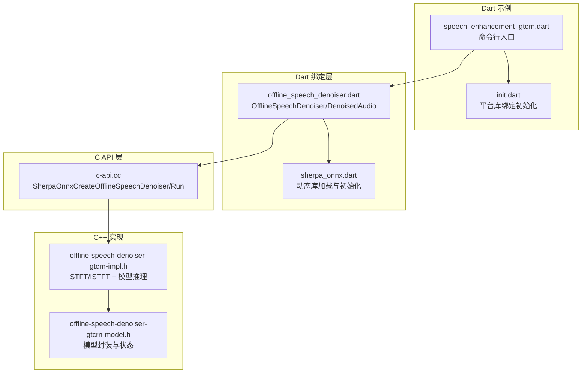
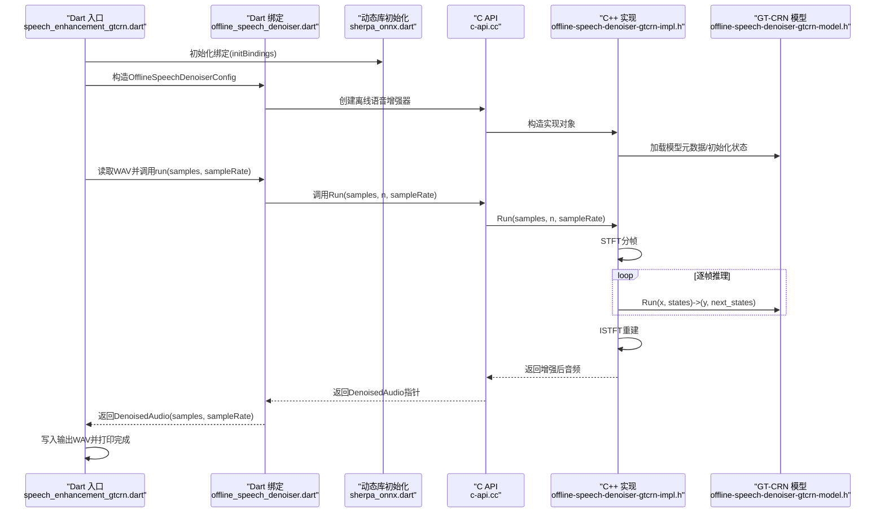
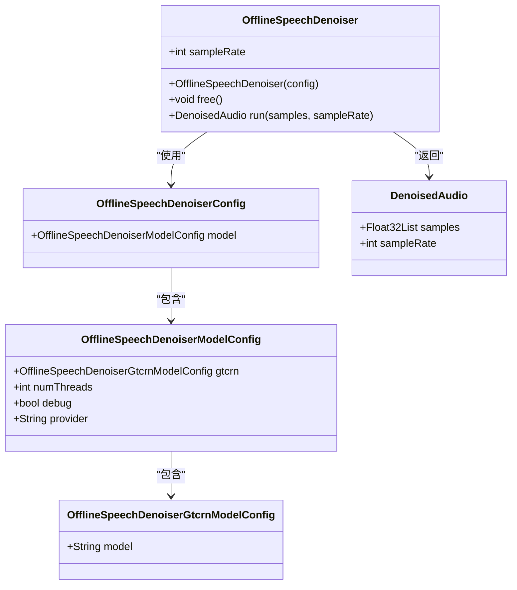
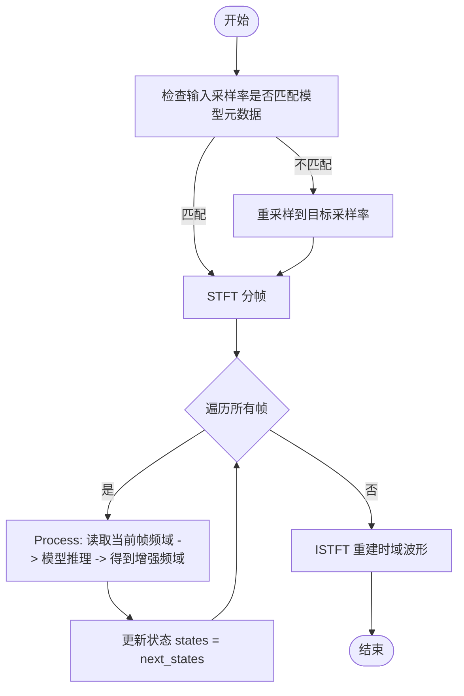
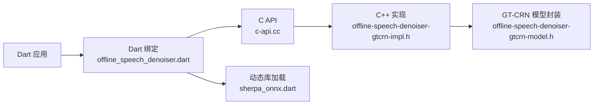

# 语音增强示例

<cite>
**本文引用的文件列表**
- [speech_enhancement_gtcrn.dart](file://dart-api-examples/speech-enhancement-gtcrn/bin/speech_enhancement_gtcrn.dart)
- [init.dart](file://dart-api-examples/speech-enhancement-gtcrn/bin/init.dart)
- [pubspec.yaml](file://dart-api-examples/speech-enhancement-gtcrn/pubspec.yaml)
- [offline_speech_denoiser.dart](file://flutter/sherpa_onnx/lib/src/offline_speech_denoiser.dart)
- [sherpa_onnx.dart](file://flutter/sherpa_onnx/lib/sherpa_onnx.dart)
- [c-api.cc](file://sherpa-onnx/c-api/c-api.cc)
- [offline-speech-denoiser-gtcrn-impl.h](file://sherpa-onnx/csrc/offline-speech-denoiser-gtcrn-impl.h)
- [offline-speech-denoiser-gtcrn-model.h](file://sherpa-onnx/csrc/offline-speech-denoiser-gtcrn-model.h)
- [java NonStreamingSpeechEnhancementGtcrn.java](file://java-api-examples/NonStreamingSpeechEnhancementGtcrn.java)
- [python offline-speech-enhancement-gtcrn.py](file://python-api-examples/offline-speech-enhancement-gtcrn.py)
- [pascal gtcrn.pas](file://pascal-api-examples/speech-enhancement-gtcrn/gtcrn.pas)
</cite>

## 目录
1. [简介](#简介)
2. [项目结构](#项目结构)
3. [核心组件](#核心组件)
4. [架构总览](#架构总览)
5. [详细组件分析](#详细组件分析)
6. [依赖关系分析](#依赖关系分析)
7. [性能与实时性考虑](#性能与实时性考虑)
8. [故障排查指南](#故障排查指南)
9. [结论](#结论)
10. [附录](#附录)

## 简介
本文件面向希望在Dart环境中使用sherpa-onnx进行语音增强（降噪）的开发者，围绕speech_enhancement_gtcrn示例展开，系统讲解如何在Dart中加载GT-CRN模型、调用离线语音增强接口、处理音频输入输出，并给出在电话会议与语音录制场景中的应用建议以及实时增强的性能优化策略。文档同时提供从Dart到C API再到C++实现的完整链路分析，帮助读者理解数据流、状态管理与资源释放。

## 项目结构
speech_enhancement_gtcrn示例位于dart-api-examples目录下，包含Dart入口脚本、初始化逻辑与依赖配置；核心能力通过flutter/sherpa_onnx提供的Dart绑定访问底层C/C++实现，后者再通过ONNX Runtime执行GT-CRN模型推理。

图表来源
- [speech_enhancement_gtcrn.dart](file://dart-api-examples/speech-enhancement-gtcrn/bin/speech_enhancement_gtcrn.dart#L1-L51)
- [init.dart](file://dart-api-examples/speech-enhancement-gtcrn/bin/init.dart#L1-L39)
- [offline_speech_denoiser.dart](file://flutter/sherpa_onnx/lib/src/offline_speech_denoiser.dart#L106-L179)
- [sherpa_onnx.dart](file://flutter/sherpa_onnx/lib/sherpa_onnx.dart#L31-L71)
- [c-api.cc](file://sherpa-onnx/c-api/c-api.cc#L2153-L2204)
- [offline-speech-denoiser-gtcrn-impl.h](file://sherpa-onnx/csrc/offline-speech-denoiser-gtcrn-impl.h#L35-L145)
- [offline-speech-denoiser-gtcrn-model.h](file://sherpa-onnx/csrc/offline-speech-denoiser-gtcrn-model.h#L17-L41)

章节来源
- [speech_enhancement_gtcrn.dart](file://dart-api-examples/speech-enhancement-gtcrn/bin/speech_enhancement_gtcrn.dart#L1-L51)
- [init.dart](file://dart-api-examples/speech-enhancement-gtcrn/bin/init.dart#L1-L39)
- [pubspec.yaml](file://dart-api-examples/speech-enhancement-gtcrn/pubspec.yaml#L1-L21)

## 核心组件
- Dart命令行入口：负责解析参数、构建配置、读取/写入WAV、调用离线语音增强并释放资源。
- Dart绑定类：OfflineSpeechDenoiserConfig/ModelConfig/GtcrnModelConfig、DenoisedAudio、OfflineSpeechDenoiser工厂构造与run/free。
- 平台初始化：根据操作系统选择对应动态库并初始化绑定。
- C API桥接：创建/销毁离线语音增强器、运行推理、释放结果。
- C++实现：STFT分帧、逐帧模型推理、ISTFT重建、采样率对齐与窗函数处理。
- GT-CRN模型：ONNX模型封装、初始状态管理、每帧输出增强后的复数频谱。

章节来源
- [offline_speech_denoiser.dart](file://flutter/sherpa_onnx/lib/src/offline_speech_denoiser.dart#L1-L180)
- [sherpa_onnx.dart](file://flutter/sherpa_onnx/lib/sherpa_onnx.dart#L31-L71)
- [c-api.cc](file://sherpa-onnx/c-api/c-api.cc#L2153-L2204)
- [offline-speech-denoiser-gtcrn-impl.h](file://sherpa-onnx/csrc/offline-speech-denoiser-gtcrn-impl.h#L35-L145)
- [offline-speech-denoiser-gtcrn-model.h](file://sherpa-onnx/csrc/offline-speech-denoiser-gtcrn-model.h#L17-L41)

## 架构总览
Dart侧通过FFI绑定调用C API，C API再委托给C++实现。C++实现以STFT将时域信号切分为短时帧，逐帧送入GT-CRN模型得到增强后的频域表示，最后通过ISTFT合成时域语音。模型内部维护状态向量，确保相邻帧之间的连续性。

图表来源
- [speech_enhancement_gtcrn.dart](file://dart-api-examples/speech-enhancement-gtcrn/bin/speech_enhancement_gtcrn.dart#L28-L51)
- [offline_speech_denoiser.dart](file://flutter/sherpa_onnx/lib/src/offline_speech_denoiser.dart#L106-L179)
- [sherpa_onnx.dart](file://flutter/sherpa_onnx/lib/sherpa_onnx.dart#L31-L71)
- [c-api.cc](file://sherpa-onnx/c-api/c-api.cc#L2153-L2204)
- [offline-speech-denoiser-gtcrn-impl.h](file://sherpa-onnx/csrc/offline-speech-denoiser-gtcrn-impl.h#L35-L145)
- [offline-speech-denoiser-gtcrn-model.h](file://sherpa-onnx/csrc/offline-speech-denoiser-gtcrn-model.h#L17-L41)

## 详细组件分析

### Dart命令行入口与参数解析
- 功能要点
  - 使用args解析命令行参数：模型路径、输入WAV、输出WAV。
  - 构建OfflineSpeechDenoiserConfig，设置provider为CPU、numThreads为1、debug为true。
  - 读取WAV，调用OfflineSpeechDenoiser.run，写回增强后的WAV。
  - 调用free释放资源，避免内存泄漏。
- 关键路径
  - 配置构建与实例化：[speech_enhancement_gtcrn.dart](file://dart-api-examples/speech-enhancement-gtcrn/bin/speech_enhancement_gtcrn.dart#L28-L34)
  - 运行与写入：[speech_enhancement_gtcrn.dart](file://dart-api-examples/speech-enhancement-gtcrn/bin/speech_enhancement_gtcrn.dart#L38-L49)

章节来源
- [speech_enhancement_gtcrn.dart](file://dart-api-examples/speech-enhancement-gtcrn/bin/speech_enhancement_gtcrn.dart#L1-L51)

### Dart绑定类与资源管理
- OfflineSpeechDenoiserConfig/ModelConfig/GtcrnModelConfig
  - 支持从JSON反序列化与序列化，便于配置灵活化。
  - provider支持“cpu”，numThreads控制线程数，debug用于日志开关。
- OfflineSpeechDenoiser
  - 工厂构造：将Dart配置转换为C结构体，调用C API创建实例。
  - run：将Float32List拷贝至原生内存，调用C API执行推理，返回DenoisedAudio。
  - free：释放底层资源，防止泄漏。
- DenoisedAudio：封装增强后的采样数组与采样率。

图表来源
- [offline_speech_denoiser.dart](file://flutter/sherpa_onnx/lib/src/offline_speech_denoiser.dart#L1-L180)

章节来源
- [offline_speech_denoiser.dart](file://flutter/sherpa_onnx/lib/src/offline_speech_denoiser.dart#L1-L180)

### 平台初始化与动态库加载
- init.dart
  - 根据平台选择库路径，解析包URI定位平台库目录，最终调用initBindings。
- sherpa_onnx.dart
  - 根据操作系统打开对应动态库（macOS dylib、iOS framework、Android/Linux so、Windows dll），随后初始化绑定。

章节来源
- [init.dart](file://dart-api-examples/speech-enhancement-gtcrn/bin/init.dart#L1-L39)
- [sherpa_onnx.dart](file://flutter/sherpa_onnx/lib/sherpa_onnx.dart#L31-L71)

### C API桥接与错误处理
- c-api.cc
  - 创建/销毁离线语音增强器、查询采样率、执行推理、释放结果。
  - run会将DenoisedAudio复制到堆内存并返回指针，供Dart侧读取后释放。

章节来源
- [c-api.cc](file://sherpa-onnx/c-api/c-api.cc#L2153-L2204)

### C++实现：STFT/ISTFT与逐帧推理
- offline-speech-denoiser-gtcrn-impl.h
  - 输入采样率与模型元数据不一致时进行重采样。
  - 设置STFT参数（n_fft、hop_length、window等），计算STFT得到复数频谱。
  - 逐帧调用Process，传入当前帧与上一帧状态，得到增强后的实部/虚部，拼接为增强后的STFT结果。
  - 使用ISTFT重建时域波形，输出增强后的音频。
- offline-speech-denoiser-gtcrn-model.h
  - 封装GT-CRN ONNX模型，提供GetInitStates、Run(x, states)与GetMetaData。
  - Run返回增强后的频域张量与下一帧状态，供下一次推理使用。

图表来源
- [offline-speech-denoiser-gtcrn-impl.h](file://sherpa-onnx/csrc/offline-speech-denoiser-gtcrn-impl.h#L35-L145)
- [offline-speech-denoiser-gtcrn-model.h](file://sherpa-onnx/csrc/offline-speech-denoiser-gtcrn-model.h#L17-L41)

章节来源
- [offline-speech-denoiser-gtcrn-impl.h](file://sherpa-onnx/csrc/offline-speech-denoiser-gtcrn-impl.h#L35-L145)
- [offline-speech-denoiser-gtcrn-model.h](file://sherpa-onnx/csrc/offline-speech-denoiser-gtcrn-model.h#L17-L41)

### 多语言对比参考
- Java示例：展示了同样的配置与调用流程，便于对照理解。
- Python示例：包含RTF（实时因子）统计，可作为性能评估参考。
- Pascal示例：同样演示了离线语音增强的基本用法。

章节来源
- [java NonStreamingSpeechEnhancementGtcrn.java](file://java-api-examples/NonStreamingSpeechEnhancementGtcrn.java#L1-L38)
- [python offline-speech-enhancement-gtcrn.py](file://python-api-examples/offline-speech-enhancement-gtcrn.py#L1-L87)
- [pascal gtcrn.pas](file://pascal-api-examples/speech-enhancement-gtcrn/gtcrn.pas#L1-L42)

## 依赖关系分析
- Dart层依赖flutter/sherpa_onnx包，通过FFI加载平台动态库。
- Dart绑定类依赖C API导出的符号，调用创建/销毁/推理接口。
- C API层委托C++实现，C++实现依赖kaldi-native-fbank（STFT/ISTFT）、ONNX Runtime（模型推理）与sherpa-onnx内部配置与元数据。

图表来源
- [offline_speech_denoiser.dart](file://flutter/sherpa_onnx/lib/src/offline_speech_denoiser.dart#L106-L179)
- [sherpa_onnx.dart](file://flutter/sherpa_onnx/lib/sherpa_onnx.dart#L31-L71)
- [c-api.cc](file://sherpa-onnx/c-api/c-api.cc#L2153-L2204)
- [offline-speech-denoiser-gtcrn-impl.h](file://sherpa-onnx/csrc/offline-speech-denoiser-gtcrn-impl.h#L35-L145)
- [offline-speech-denoiser-gtcrn-model.h](file://sherpa-onnx/csrc/offline-speech-denoiser-gtcrn-model.h#L17-L41)

章节来源
- [offline_speech_denoiser.dart](file://flutter/sherpa_onnx/lib/src/offline_speech_denoiser.dart#L106-L179)
- [sherpa_onnx.dart](file://flutter/sherpa_onnx/lib/sherpa_onnx.dart#L31-L71)
- [c-api.cc](file://sherpa-onnx/c-api/c-api.cc#L2153-L2204)
- [offline-speech-denoiser-gtcrn-impl.h](file://sherpa-onnx/csrc/offline-speech-denoiser-gtcrn-impl.h#L35-L145)
- [offline-speech-denoiser-gtcrn-model.h](file://sherpa-onnx/csrc/offline-speech-denoiser-gtcrn-model.h#L17-L41)

## 性能与实时性考虑
- 线程与算力
  - numThreads影响CPU并行度，可根据设备核数适当调整。
  - provider固定为CPU，适合无GPU或隐私要求高的场景。
- 采样率与窗函数
  - 若输入采样率与模型不一致，实现会自动重采样，避免额外处理开销。
  - 窗函数类型与FFT长度由模型元数据决定，保持与训练一致可减少失真。
- 推理效率
  - 逐帧推理在Dart侧需要将Float32List拷贝到原生内存，建议批量处理较长音频以降低拷贝次数。
  - 可通过减少numThreads、关闭debug、使用更高效的模型权重（如量化版）进一步优化。
- 实时增强建议
  - 当前示例为离线处理。若需实时流式增强，可参考在线识别的流式框架，将STFT窗口滑动与模型推理结合，但需自行实现缓冲与状态传递。
  - 在移动端或嵌入式设备上，优先使用CPU provider并限制numThreads，避免主线程阻塞。
- 性能评估
  - 可参考Python示例中的RTF统计方式，记录推理耗时与音频时长，评估实时性。

章节来源
- [offline-speech-denoiser-gtcrn-impl.h](file://sherpa-onnx/csrc/offline-speech-denoiser-gtcrn-impl.h#L35-L145)
- [python offline-speech-enhancement-gtcrn.py](file://python-api-examples/offline-speech-enhancement-gtcrn.py#L48-L87)

## 故障排查指南
- 初始化失败
  - 确认已调用initBindings且平台库路径正确。
  - 检查平台是否受支持（macOS、Linux、Windows、iOS、Android）。
- 创建离线语音增强器失败
  - 检查配置项：model路径、provider、numThreads、debug。
  - 确保模型文件存在且可读。
- 运行异常
  - 确认输入WAV采样率与模型元数据一致，或允许自动重采样。
  - 检查samples长度与sampleRate是否正确传入。
- 资源泄漏
  - 确保调用free释放底层资源，避免内存泄漏。
- 输出为空
  - 检查C API返回指针是否为空，必要时在Dart侧进行判空处理。

章节来源
- [init.dart](file://dart-api-examples/speech-enhancement-gtcrn/bin/init.dart#L1-L39)
- [offline_speech_denoiser.dart](file://flutter/sherpa_onnx/lib/src/offline_speech_denoiser.dart#L106-L179)
- [c-api.cc](file://sherpa-onnx/c-api/c-api.cc#L2153-L2204)

## 结论
speech_enhancement_gtcrn示例展示了在Dart中使用sherpa-onnx进行离线语音增强的完整流程：从参数解析、配置构建、平台初始化、FFI调用到推理与结果写回。其核心在于C++实现的STFT/ISTFT与GT-CRN模型的逐帧推理，配合Dart绑定的资源管理与错误处理。对于电话会议与语音录制等场景，该方案可在本地CPU上稳定运行，满足隐私与低延迟需求。若需实时流式增强，可在现有框架基础上扩展滑动窗口与状态传递机制。

## 附录
- 快速开始
  - 安装依赖：在dart-api-examples/speech-enhancement-gtcrn目录下执行依赖安装。
  - 下载模型与测试音频：参考各语言示例的下载链接。
  - 运行示例：传入模型路径、输入WAV与输出WAV参数，查看增强结果。
- 参考实现
  - Java/Python/Pascal示例提供了相同的配置与调用模式，便于跨语言迁移。

章节来源
- [pubspec.yaml](file://dart-api-examples/speech-enhancement-gtcrn/pubspec.yaml#L1-L21)
- [java NonStreamingSpeechEnhancementGtcrn.java](file://java-api-examples/NonStreamingSpeechEnhancementGtcrn.java#L1-L38)
- [python offline-speech-enhancement-gtcrn.py](file://python-api-examples/offline-speech-enhancement-gtcrn.py#L1-L87)
- [pascal gtcrn.pas](file://pascal-api-examples/speech-enhancement-gtcrn/gtcrn.pas#L1-L42)