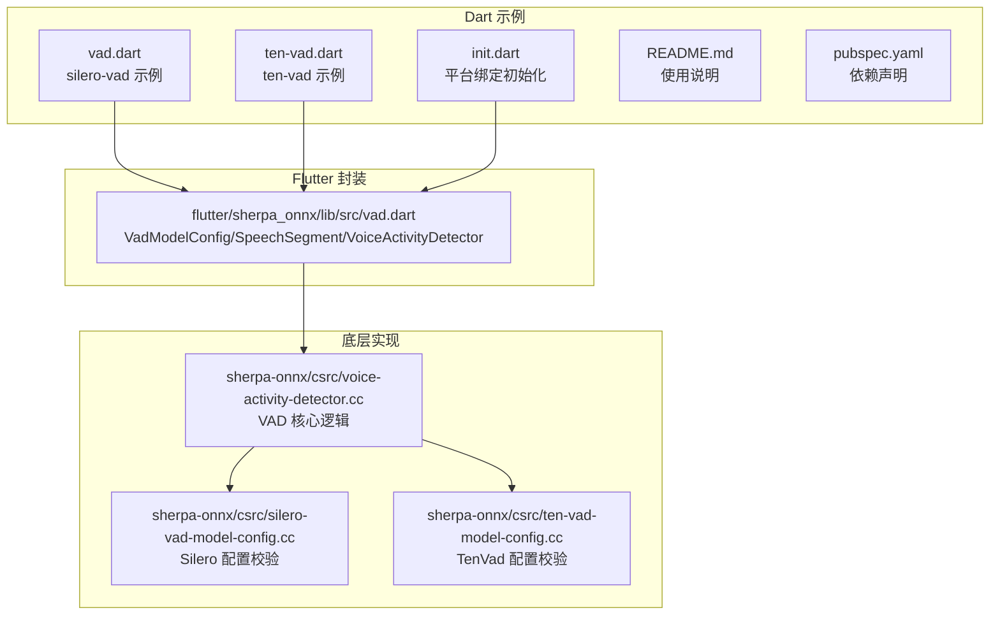
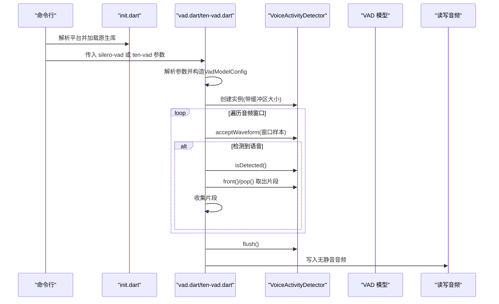
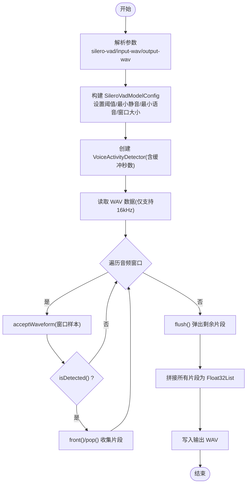
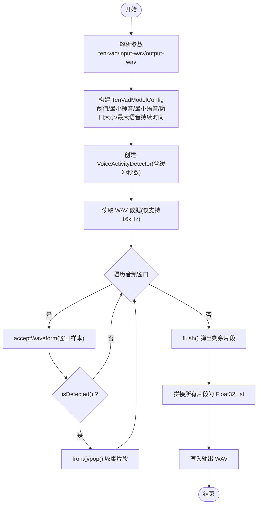
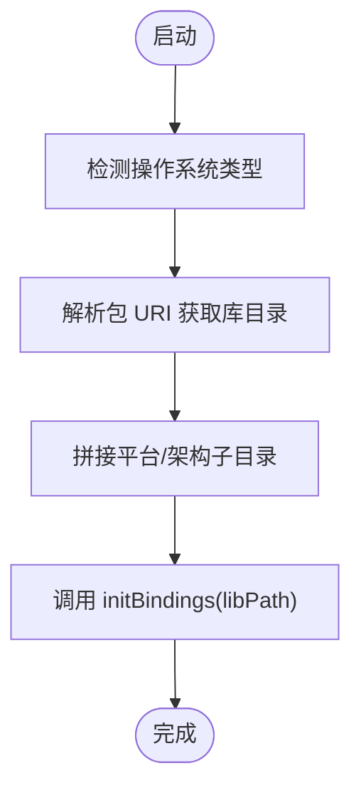
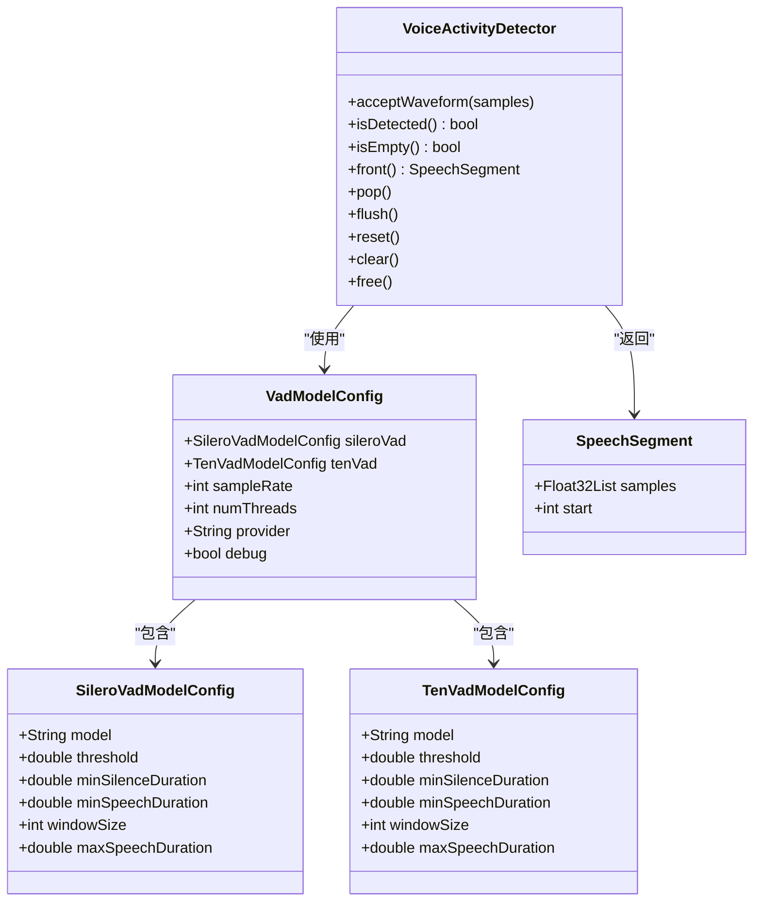
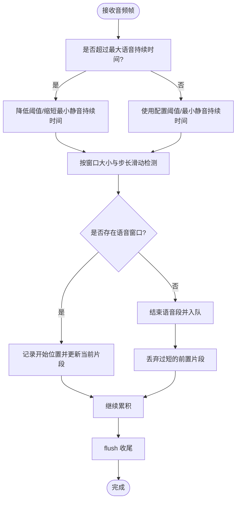
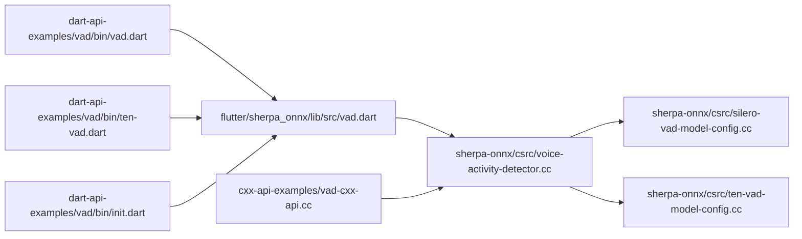

# 语音活动检测示例

<cite>
**本文引用的文件**
- [dart-api-examples/vad/bin/vad.dart](file://dart-api-examples/vad/bin/vad.dart)
- [dart-api-examples/vad/bin/ten-vad.dart](file://dart-api-examples/vad/bin/ten-vad.dart)
- [dart-api-examples/vad/bin/init.dart](file://dart-api-examples/vad/bin/init.dart)
- [dart-api-examples/vad/README.md](file://dart-api-examples/vad/README.md)
- [dart-api-examples/vad/pubspec.yaml](file://dart-api-examples/vad/pubspec.yaml)
- [flutter/sherpa_onnx/lib/src/vad.dart](file://flutter/sherpa_onnx/lib/src/vad.dart)
- [sherpa-onnx/csrc/voice-activity-detector.cc](file://sherpa-onnx/csrc/voice-activity-detector.cc)
- [sherpa-onnx/csrc/silero-vad-model-config.cc](file://sherpa-onnx/csrc/silero-vad-model-config.cc)
- [sherpa-onnx/csrc/ten-vad-model-config.cc](file://sherpa-onnx/csrc/ten-vad-model-config.cc)
- [cxx-api-examples/vad-cxx-api.cc](file://cxx-api-examples/vad-cxx-api.cc)
- [android/SherpaOnnxVad/app/src/main/java/com/k2fsa/sherpa/onnx/MainActivity.kt](file://android/SherpaOnnxVad/app/src/main/java/com/k2fsa/sherpa/onnx/MainActivity.kt)
- [nodejs-addon-examples/test_vad_microphone.js](file://nodejs-addon-examples/test_vad_microphone.js)
- [wasm/vad/app-vad.js](file://wasm/vad/app-vad.js)
</cite>

## 目录
1. [简介](#简介)
2. [项目结构](#项目结构)
3. [核心组件](#核心组件)
4. [架构总览](#架构总览)
5. [详细组件分析](#详细组件分析)
6. [依赖关系分析](#依赖关系分析)
7. [性能与移动端优化](#性能与移动端优化)
8. [故障排查指南](#故障排查指南)
9. [结论](#结论)

## 简介
本文件面向使用 Dart 语言的开发者，系统性讲解 sherpa-onnx 的语音活动检测（VAD）示例，包括：
- 使用 silero-vad 和 ten-vad 模型进行静音移除与语音段落提取
- 在 Dart 中初始化 VAD 绑定、加载模型、处理音频流并输出无静音音频
- 对比两种 VAD 算法的配置差异与适用场景
- 提供移动端低延迟与电池优化建议

## 项目结构
Dart 示例位于 dart-api-examples/vad，包含三个可执行脚本：vad.dart（silero-vad）、ten-vad.dart（ten-vad）以及 init.dart（平台绑定初始化）。同时 Flutter 包中提供了 VAD 的 Dart 封装类，便于跨平台复用。

图表来源
- [dart-api-examples/vad/bin/vad.dart](file://dart-api-examples/vad/bin/vad.dart#L1-L82)
- [dart-api-examples/vad/bin/ten-vad.dart](file://dart-api-examples/vad/bin/ten-vad.dart#L1-L84)
- [dart-api-examples/vad/bin/init.dart](file://dart-api-examples/vad/bin/init.dart#L1-L39)
- [flutter/sherpa_onnx/lib/src/vad.dart](file://flutter/sherpa_onnx/lib/src/vad.dart#L1-L343)
- [sherpa-onnx/csrc/voice-activity-detector.cc](file://sherpa-onnx/csrc/voice-activity-detector.cc#L1-L200)
- [sherpa-onnx/csrc/silero-vad-model-config.cc](file://sherpa-onnx/csrc/silero-vad-model-config.cc#L1-L126)
- [sherpa-onnx/csrc/ten-vad-model-config.cc](file://sherpa-onnx/csrc/ten-vad-model-config.cc#L32-L76)

章节来源
- [dart-api-examples/vad/README.md](file://dart-api-examples/vad/README.md#L1-L22)
- [dart-api-examples/vad/pubspec.yaml](file://dart-api-examples/vad/pubspec.yaml#L1-L18)

## 核心组件
- 平台绑定初始化：通过 init.dart 动态定位并加载 sherpa-onnx 的原生库，支持 macOS/Linux/Windows。
- VAD 配置：VadModelConfig 同时支持 SileroVadModelConfig 与 TenVadModelConfig；二者二选一。
- VAD 实例：VoiceActivityDetector 负责接受音频帧、检测语音段落、弹出已检测到的片段。
- 音频处理：示例将整段音频按窗口大小切片喂入 VAD，当检测到语音时从缓冲队列取出片段拼接为新音频。

章节来源
- [dart-api-examples/vad/bin/init.dart](file://dart-api-examples/vad/bin/init.dart#L1-L39)
- [flutter/sherpa_onnx/lib/src/vad.dart](file://flutter/sherpa_onnx/lib/src/vad.dart#L96-L139)
- [flutter/sherpa_onnx/lib/src/vad.dart](file://flutter/sherpa_onnx/lib/src/vad.dart#L220-L343)
- [dart-api-examples/vad/bin/vad.dart](file://dart-api-examples/vad/bin/vad.dart#L29-L81)
- [dart-api-examples/vad/bin/ten-vad.dart](file://dart-api-examples/vad/bin/ten-vad.dart#L29-L83)

## 架构总览
下图展示了 Dart 层调用流程：命令行解析参数 -> 初始化绑定 -> 创建 VAD 配置 -> 接受音频帧 -> 检测语音段落 -> 输出无静音音频。

图表来源
- [dart-api-examples/vad/bin/init.dart](file://dart-api-examples/vad/bin/init.dart#L1-L39)
- [dart-api-examples/vad/bin/vad.dart](file://dart-api-examples/vad/bin/vad.dart#L12-L81)
- [dart-api-examples/vad/bin/ten-vad.dart](file://dart-api-examples/vad/bin/ten-vad.dart#L12-L83)
- [flutter/sherpa_onnx/lib/src/vad.dart](file://flutter/sherpa_onnx/lib/src/vad.dart#L220-L343)

## 详细组件分析

### silero-vad 示例（vad.dart）
- 功能：使用 silero-vad 模型对 WAV 文件进行静音移除，输出新的 WAV 文件。
- 关键点：
  - 仅支持 16kHz 采样率。
  - 使用 SileroVadModelConfig 设置阈值、最小静音/语音持续时间、最大语音持续时间与窗口大小。
  - 通过循环按窗口大小切分输入音频并喂给 VAD；当检测到语音时从队列取出片段并拼接。
  - 最后 flush 队列中剩余片段并写回音频。

图表来源
- [dart-api-examples/vad/bin/vad.dart](file://dart-api-examples/vad/bin/vad.dart#L12-L81)
- [flutter/sherpa_onnx/lib/src/vad.dart](file://flutter/sherpa_onnx/lib/src/vad.dart#L220-L343)

章节来源
- [dart-api-examples/vad/bin/vad.dart](file://dart-api-examples/vad/bin/vad.dart#L12-L81)

### ten-vad 示例（ten-vad.dart）
- 功能：与 silero-vad 类似，但使用 ten-vad 模型，适合移动端与资源受限环境。
- 关键点：
  - TenVadModelConfig 同样包含阈值、最小静音/语音持续时间、窗口大小与最大语音持续时间。
  - 处理流程与 silero-vad 完全一致，差异在于模型配置与窗口大小。

图表来源
- [dart-api-examples/vad/bin/ten-vad.dart](file://dart-api-examples/vad/bin/ten-vad.dart#L12-L83)
- [flutter/sherpa_onnx/lib/src/vad.dart](file://flutter/sherpa_onnx/lib/src/vad.dart#L220-L343)

章节来源
- [dart-api-examples/vad/bin/ten-vad.dart](file://dart-api-examples/vad/bin/ten-vad.dart#L12-L83)

### 平台绑定初始化（init.dart）
- 功能：根据运行平台动态定位原生库路径并调用初始化函数，确保后续 Dart 侧 VAD 调用可用。
- 注意：当前示例支持 macOS/Linux/Windows；其他平台需扩展。

图表来源
- [dart-api-examples/vad/bin/init.dart](file://dart-api-examples/vad/bin/init.dart#L1-L39)

章节来源
- [dart-api-examples/vad/bin/init.dart](file://dart-api-examples/vad/bin/init.dart#L1-L39)

### Dart 封装类（flutter/sherpa_onnx/lib/src/vad.dart）
- VadModelConfig：包含 sampleRate、numThreads、provider、debug 以及 sileroVad/tenVad 二选一配置。
- SileroVadModelConfig/TenVadModelConfig：定义模型路径、阈值、最小静音/语音持续时间、窗口大小、最大语音持续时间等。
- VoiceActivityDetector：提供 acceptWaveform、isDetected、isEmpty、front、pop、flush、reset、clear、free 等方法。
- SpeechSegment：表示一个语音片段，包含 samples 与起始样本索引 start。

图表来源
- [flutter/sherpa_onnx/lib/src/vad.dart](file://flutter/sherpa_onnx/lib/src/vad.dart#L1-L139)
- [flutter/sherpa_onnx/lib/src/vad.dart](file://flutter/sherpa_onnx/lib/src/vad.dart#L141-L343)

章节来源
- [flutter/sherpa_onnx/lib/src/vad.dart](file://flutter/sherpa_onnx/lib/src/vad.dart#L1-L139)
- [flutter/sherpa_onnx/lib/src/vad.dart](file://flutter/sherpa_onnx/lib/src/vad.dart#L141-L343)

### 底层实现（sherpa-onnx/csrc/voice-activity-detector.cc）
- 接收音频帧后，根据当前是否处于长语音状态动态调整阈值与最小静音持续时间，避免误判。
- 使用环形缓冲区保存最近的音频，按模型窗口大小与步长滑动检测，累计窗口内存在语音则认为进入语音段。
- 当检测到语音结束时，截取从开始到最小静音结束的片段入队；flush 用于收尾未结束的语音段。
- 提供 Reset/Clear 等接口清理状态。

图表来源
- [sherpa-onnx/csrc/voice-activity-detector.cc](file://sherpa-onnx/csrc/voice-activity-detector.cc#L46-L136)
- [sherpa-onnx/csrc/voice-activity-detector.cc](file://sherpa-onnx/csrc/voice-activity-detector.cc#L138-L200)

章节来源
- [sherpa-onnx/csrc/voice-activity-detector.cc](file://sherpa-onnx/csrc/voice-activity-detector.cc#L1-L200)

### 配置参数对比与验证
- SileroVadModelConfig
  - 关键参数：模型路径、阈值、最小静音/语音持续时间、最大语音持续时间、窗口大小、负阈值。
  - 窗口大小与采样率相关，常见值为 512/1024/1536（16kHz）或 256/512/768（8kHz）。
- TenVadModelConfig
  - 关键参数：模型路径、阈值、最小静音/语音持续时间、窗口大小、最大语音持续时间。
  - 窗口大小建议为 160 或 256。

章节来源
- [sherpa-onnx/csrc/silero-vad-model-config.cc](file://sherpa-onnx/csrc/silero-vad-model-config.cc#L14-L52)
- [sherpa-onnx/csrc/ten-vad-model-config.cc](file://sherpa-onnx/csrc/ten-vad-model-config.cc#L32-L76)

## 依赖关系分析
- Dart 示例依赖 flutter/sherpa_onnx 的封装类，后者再绑定到底层 C++ 实现。
- 平台绑定初始化负责加载原生库，确保后续调用可用。
- 示例与 C++ 示例保持一致的参数命名与行为，便于跨语言迁移。

图表来源
- [dart-api-examples/vad/bin/vad.dart](file://dart-api-examples/vad/bin/vad.dart#L1-L82)
- [dart-api-examples/vad/bin/ten-vad.dart](file://dart-api-examples/vad/bin/ten-vad.dart#L1-L84)
- [dart-api-examples/vad/bin/init.dart](file://dart-api-examples/vad/bin/init.dart#L1-L39)
- [flutter/sherpa_onnx/lib/src/vad.dart](file://flutter/sherpa_onnx/lib/src/vad.dart#L1-L343)
- [sherpa-onnx/csrc/voice-activity-detector.cc](file://sherpa-onnx/csrc/voice-activity-detector.cc#L1-L200)
- [sherpa-onnx/csrc/silero-vad-model-config.cc](file://sherpa-onnx/csrc/silero-vad-model-config.cc#L1-L126)
- [sherpa-onnx/csrc/ten-vad-model-config.cc](file://sherpa-onnx/csrc/ten-vad-model-config.cc#L32-L76)
- [cxx-api-examples/vad-cxx-api.cc](file://cxx-api-examples/vad-cxx-api.cc#L1-L123)

章节来源
- [dart-api-examples/vad/bin/vad.dart](file://dart-api-examples/vad/bin/vad.dart#L1-L82)
- [dart-api-examples/vad/bin/ten-vad.dart](file://dart-api-examples/vad/bin/ten-vad.dart#L1-L84)
- [flutter/sherpa_onnx/lib/src/vad.dart](file://flutter/sherpa_onnx/lib/src/vad.dart#L1-L343)
- [cxx-api-examples/vad-cxx-api.cc](file://cxx-api-examples/vad-cxx-api.cc#L1-L123)

## 性能与移动端优化
- 窗口大小选择
  - silero-vad 建议使用 512/1024/1536（16kHz）或 256/512/768（8kHz），与训练一致可提升稳定性。
  - ten-vad 建议使用 160 或 256，更利于移动端低延迟。
- 线程与算力
  - numThreads 可根据设备性能调整；移动端建议较小线程数以节省电量。
- 缓冲区大小
  - bufferSizeInSeconds 控制内部环形缓冲区长度，影响检测延迟与内存占用；示例默认较大以便完整收集语音段。
- 采样率限制
  - 示例仅支持 16kHz；若输入非 16kHz，需先重采样。
- 实时场景建议
  - 移动端麦克风采集时，建议使用环形缓冲与固定窗口大小滑动，减少抖动与延迟。
  - 可参考 Android/Node/WASM 示例的窗口推进策略。

章节来源
- [dart-api-examples/vad/bin/vad.dart](file://dart-api-examples/vad/bin/vad.dart#L29-L43)
- [dart-api-examples/vad/bin/ten-vad.dart](file://dart-api-examples/vad/bin/ten-vad.dart#L29-L43)
- [android/SherpaOnnxVad/app/src/main/java/com/k2fsa/sherpa/onnx/MainActivity.kt](file://android/SherpaOnnxVad/app/src/main/java/com/k2fsa/sherpa/onnx/MainActivity.kt#L155-L177)
- [nodejs-addon-examples/test_vad_microphone.js](file://nodejs-addon-examples/test_vad_microphone.js#L45-L80)
- [wasm/vad/app-vad.js](file://wasm/vad/app-vad.js#L183-L224)

## 故障排查指南
- 无法加载原生库
  - 确认 init.dart 已正确解析平台并加载对应库目录。
- 不支持的采样率
  - 示例要求 16kHz；若输入非 16kHz，会直接退出。
- VAD 配置错误
  - 阈值范围、最小静音/语音持续时间、窗口大小等参数需满足模型要求。
- 无语音输出
  - 检查 isDetected() 是否被触发；确认窗口大小与阈值设置合理。
- 内存与性能问题
  - 减小 bufferSizeInSeconds、降低 numThreads、选择合适的窗口大小。

章节来源
- [dart-api-examples/vad/bin/init.dart](file://dart-api-examples/vad/bin/init.dart#L1-L39)
- [dart-api-examples/vad/bin/vad.dart](file://dart-api-examples/vad/bin/vad.dart#L44-L48)
- [dart-api-examples/vad/bin/ten-vad.dart](file://dart-api-examples/vad/bin/ten-vad.dart#L46-L50)
- [sherpa-onnx/csrc/silero-vad-model-config.cc](file://sherpa-onnx/csrc/silero-vad-model-config.cc#L54-L108)
- [sherpa-onnx/csrc/ten-vad-model-config.cc](file://sherpa-onnx/csrc/ten-vad-model-config.cc#L44-L76)

## 结论
- Dart VAD 示例提供了清晰的 silero-vad 与 ten-vad 使用范式，便于快速集成静音移除与语音段落提取。
- 通过 Flutter 封装类，Dart 开发者可以以面向对象的方式管理 VAD 配置与生命周期。
- 底层实现具备良好的实时性与可配置性，结合移动端参数建议可实现低延迟与低功耗。
- 若需进一步扩展，可参考 C++ 与多语言示例，统一参数与流程，提升一致性与可维护性。