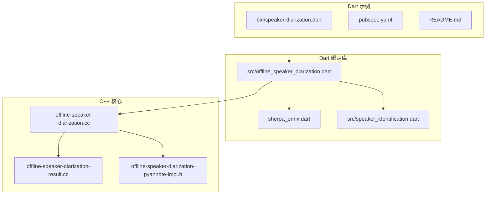
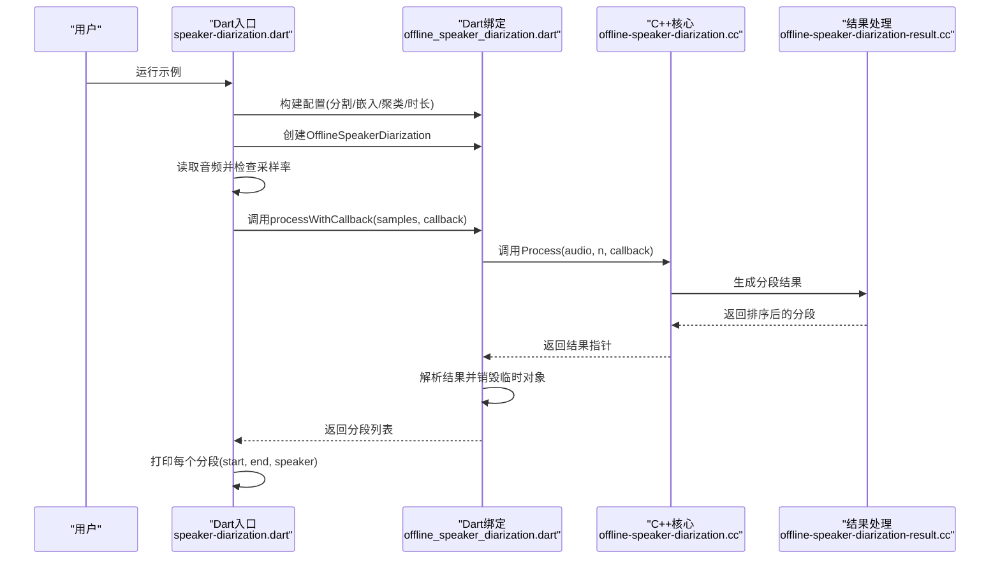
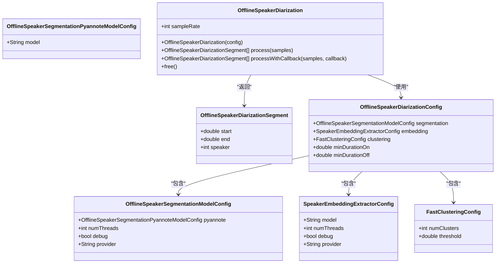
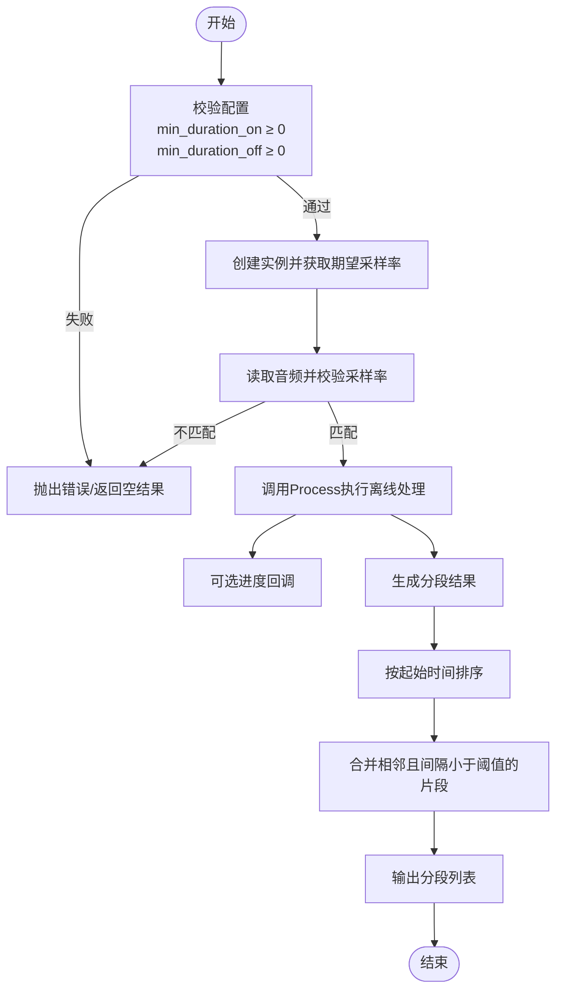
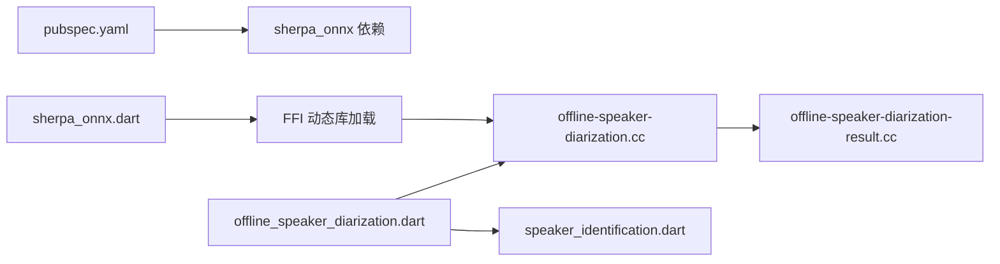

# 说话人分离示例

<cite>
**本文引用的文件列表**
- [dart-api-examples/speaker-diarization/bin/speaker-diarization.dart](file://dart-api-examples/speaker-diarization/bin/speaker-diarization.dart)
- [dart-api-examples/speaker-diarization/pubspec.yaml](file://dart-api-examples/speaker-diarization/pubspec.yaml)
- [dart-api-examples/speaker-diarization/README.md](file://dart-api-examples/speaker-diarization/README.md)
- [flutter/sherpa_onnx/lib/sherpa_onnx.dart](file://flutter/sherpa_onnx/lib/sherpa_onnx.dart)
- [flutter/sherpa_onnx/lib/src/offline_speaker_diarization.dart](file://flutter/sherpa_onnx/lib/src/offline_speaker_diarization.dart)
- [flutter/sherpa_onnx/lib/src/speaker_identification.dart](file://flutter/sherpa_onnx/lib/src/speaker_identification.dart)
- [sherpa-onnx/csrc/offline-speaker-diarization.cc](file://sherpa-onnx/csrc/offline-speaker-diarization.cc)
- [sherpa-onnx/csrc/offline-speaker-diarization-result.cc](file://sherpa-onnx/csrc/offline-speaker-diarization-result.cc)
- [sherpa-onnx/csrc/offline-speaker-diarization-pyannote-impl.h](file://sherpa-onnx/csrc/offline-speaker-diarization-pyannote-impl.h)
- [python-api-examples/offline-speaker-diarization.py](file://python-api-examples/offline-speaker-diarization.py)
- [java-api-examples/OfflineSpeakerDiarizationDemo.java](file://java-api-examples/OfflineSpeakerDiarizationDemo.java)
- [nodejs-examples/test-offline-speaker-diarization.js](file://nodejs-examples/test-offline-speaker-diarization.js)
</cite>

## 目录
1. [简介](#简介)
2. [项目结构](#项目结构)
3. [核心组件](#核心组件)
4. [架构总览](#架构总览)
5. [详细组件分析](#详细组件分析)
6. [依赖关系分析](#依赖关系分析)
7. [性能与准确性建议](#性能与准确性建议)
8. [故障排查指南](#故障排查指南)
9. [结论](#结论)
10. [附录](#附录)

## 简介
本文件面向希望在Dart环境中使用sherpa-onnx进行“说话人分离（Speaker Diarization）”的开发者，系统性解读dart-api-examples中的speaker-diarization示例，涵盖：
- 如何在Dart中加载模型、读取音频、调用离线说话人分离接口
- 配置项（分割模型、嵌入提取器、聚类参数、最小持续时长等）
- 音频预处理与采样率匹配
- 进度回调与结果排序输出
- 在会议记录、多人访谈等场景的应用建议与准确率优化策略

## 项目结构
Dart示例位于dart-api-examples/speaker-diarization目录，核心入口为bin/speaker-diarization.dart；Dart绑定库位于flutter/sherpa_onnx，其中offline_speaker_diarization.dart定义了Dart侧的配置与调用接口；底层C++实现在sherpa-onnx/csrc中。

图表来源
- [dart-api-examples/speaker-diarization/bin/speaker-diarization.dart](file://dart-api-examples/speaker-diarization/bin/speaker-diarization.dart#L1-L101)
- [flutter/sherpa_onnx/lib/sherpa_onnx.dart](file://flutter/sherpa_onnx/lib/sherpa_onnx.dart#L1-L72)
- [flutter/sherpa_onnx/lib/src/offline_speaker_diarization.dart](file://flutter/sherpa_onnx/lib/src/offline_speaker_diarization.dart#L1-L338)
- [flutter/sherpa_onnx/lib/src/speaker_identification.dart](file://flutter/sherpa_onnx/lib/src/speaker_identification.dart#L1-L298)
- [sherpa-onnx/csrc/offline-speaker-diarization.cc](file://sherpa-onnx/csrc/offline-speaker-diarization.cc#L1-L120)
- [sherpa-onnx/csrc/offline-speaker-diarization-result.cc](file://sherpa-onnx/csrc/offline-speaker-diarization-result.cc#L1-L116)
- [sherpa-onnx/csrc/offline-speaker-diarization-pyannote-impl.h](file://sherpa-onnx/csrc/offline-speaker-diarization-pyannote-impl.h#L647-L679)

章节来源
- [dart-api-examples/speaker-diarization/bin/speaker-diarization.dart](file://dart-api-examples/speaker-diarization/bin/speaker-diarization.dart#L1-L101)
- [dart-api-examples/speaker-diarization/pubspec.yaml](file://dart-api-examples/speaker-diarization/pubspec.yaml#L1-L18)
- [dart-api-examples/speaker-diarization/README.md](file://dart-api-examples/speaker-diarization/README.md#L1-L8)

## 核心组件
- Dart入口：负责下载/准备模型与音频，构建配置，调用离线说话人分离，并打印结果。
- Dart绑定层：封装C API，提供OfflineSpeakerDiarizationConfig、OfflineSpeakerSegmentationModelConfig、SpeakerEmbeddingExtractorConfig、FastClusteringConfig以及OfflineSpeakerDiarization类。
- C++核心：实现配置注册与校验、采样率查询、处理流程（含进度回调）、结果排序与合并逻辑。
- 其他语言对比：Python/Java/Node.js示例展示了相同的配置与调用模式，便于跨语言迁移。

章节来源
- [flutter/sherpa_onnx/lib/src/offline_speaker_diarization.dart](file://flutter/sherpa_onnx/lib/src/offline_speaker_diarization.dart#L1-L338)
- [sherpa-onnx/csrc/offline-speaker-diarization.cc](file://sherpa-onnx/csrc/offline-speaker-diarization.cc#L1-L120)
- [sherpa-onnx/csrc/offline-speaker-diarization-result.cc](file://sherpa-onnx/csrc/offline-speaker-diarization-result.cc#L1-L116)
- [python-api-examples/offline-speaker-diarization.py](file://python-api-examples/offline-speaker-diarization.py#L1-L137)
- [java-api-examples/OfflineSpeakerDiarizationDemo.java](file://java-api-examples/OfflineSpeakerDiarizationDemo.java#L63-L99)
- [nodejs-examples/test-offline-speaker-diarization.js](file://nodejs-examples/test-offline-speaker-diarization.js#L36-L64)

## 架构总览
Dart示例通过sherpa_onnx.dart初始化C API绑定，随后构造OfflineSpeakerDiarizationConfig，创建OfflineSpeakerDiarization实例，读取音频并调用process或processWithCallback，最终对结果按起始时间排序输出。

图表来源
- [dart-api-examples/speaker-diarization/bin/speaker-diarization.dart](file://dart-api-examples/speaker-diarization/bin/speaker-diarization.dart#L69-L100)
- [flutter/sherpa_onnx/lib/src/offline_speaker_diarization.dart](file://flutter/sherpa_onnx/lib/src/offline_speaker_diarization.dart#L241-L332)
- [sherpa-onnx/csrc/offline-speaker-diarization.cc](file://sherpa-onnx/csrc/offline-speaker-diarization.cc#L93-L107)
- [sherpa-onnx/csrc/offline-speaker-diarization-result.cc](file://sherpa-onnx/csrc/offline-speaker-diarization-result.cc#L86-L113)

## 详细组件分析

### Dart入口与调用流程
- 初始化：示例通过注释说明需要下载分割模型、嵌入模型与测试音频，并给出下载步骤。
- 配置构建：分别设置分割模型（pyannote）、嵌入提取器（ONNX模型路径）、聚类参数（numClusters或threshold），以及minDurationOn/minDurationOff。
- 实例化与音频处理：创建OfflineSpeakerDiarization后，读取音频并校验采样率，然后调用processWithCallback以显示进度。
- 结果输出：遍历分段，打印起止时间与说话人编号。

章节来源
- [dart-api-examples/speaker-diarization/bin/speaker-diarization.dart](file://dart-api-examples/speaker-diarization/bin/speaker-diarization.dart#L12-L37)
- [dart-api-examples/speaker-diarization/bin/speaker-diarization.dart](file://dart-api-examples/speaker-diarization/bin/speaker-diarization.dart#L47-L68)
- [dart-api-examples/speaker-diarization/bin/speaker-diarization.dart](file://dart-api-examples/speaker-diarization/bin/speaker-diarization.dart#L74-L100)

### Dart绑定层：OfflineSpeakerDiarization与配置
- OfflineSpeakerDiarizationSegment：包含start、end、speaker字段，支持JSON序列化/反序列化。
- OfflineSpeakerSegmentationModelConfig：包含pyannote子配置、numThreads、debug、provider等。
- SpeakerEmbeddingExtractorConfig：包含嵌入模型路径、numThreads、debug、provider。
- FastClusteringConfig：包含numClusters与threshold。
- OfflineSpeakerDiarizationConfig：组合上述三者及minDurationOn/minDurationOff。
- OfflineSpeakerDiarization类：
  - 构造函数：将Dart配置映射到C结构体并通过FFI创建C实例。
  - process/processWithCallback：将Float32List样本拷贝至C内存，调用C API执行处理，解析返回结果并排序。
  - 销毁：释放C结果与实例，避免内存泄漏。

图表来源
- [flutter/sherpa_onnx/lib/src/offline_speaker_diarization.dart](file://flutter/sherpa_onnx/lib/src/offline_speaker_diarization.dart#L1-L178)
- [flutter/sherpa_onnx/lib/src/offline_speaker_diarization.dart](file://flutter/sherpa_onnx/lib/src/offline_speaker_diarization.dart#L180-L338)

章节来源
- [flutter/sherpa_onnx/lib/src/offline_speaker_diarization.dart](file://flutter/sherpa_onnx/lib/src/offline_speaker_diarization.dart#L1-L338)

### C++核心：配置、处理与结果
- 配置注册与校验：注册segmentation/embedding/clustering子配置，并校验min_duration_on与min_duration_off非负。
- SampleRate：返回期望采样率。
- Process：执行离线处理，支持可选进度回调。
- 结果排序与合并：按起始时间排序；按说话人分组；支持合并相邻且间隔小于阈值的片段。

图表来源
- [sherpa-onnx/csrc/offline-speaker-diarization.cc](file://sherpa-onnx/csrc/offline-speaker-diarization.cc#L23-L67)
- [sherpa-onnx/csrc/offline-speaker-diarization.cc](file://sherpa-onnx/csrc/offline-speaker-diarization.cc#L93-L107)
- [sherpa-onnx/csrc/offline-speaker-diarization-result.cc](file://sherpa-onnx/csrc/offline-speaker-diarization-result.cc#L86-L113)

章节来源
- [sherpa-onnx/csrc/offline-speaker-diarization.cc](file://sherpa-onnx/csrc/offline-speaker-diarization.cc#L1-L120)
- [sherpa-onnx/csrc/offline-speaker-diarization-result.cc](file://sherpa-onnx/csrc/offline-speaker-diarization-result.cc#L1-L116)

### 分割模型与聚类逻辑（Pyannote）
- Pyannote实现会根据模型输出的标签序列，将连续相同说话人的帧合并为段，并计算起止时间。
- 最终得到若干段，每段包含start、end、speaker。

章节来源
- [sherpa-onnx/csrc/offline-speaker-diarization-pyannote-impl.h](file://sherpa-onnx/csrc/offline-speaker-diarization-pyannote-impl.h#L647-L679)

### 多语言对比：Python/Java/Node.js
- Python示例展示了明确的num_speakers与阈值配置、重采样与进度回调。
- Java示例展示了builder模式构建配置与回调进度。
- Node.js示例展示了阈值与最小持续时长的注释说明。

章节来源
- [python-api-examples/offline-speaker-diarization.py](file://python-api-examples/offline-speaker-diarization.py#L56-L94)
- [python-api-examples/offline-speaker-diarization.py](file://python-api-examples/offline-speaker-diarization.py#L107-L136)
- [java-api-examples/OfflineSpeakerDiarizationDemo.java](file://java-api-examples/OfflineSpeakerDiarizationDemo.java#L63-L99)
- [nodejs-examples/test-offline-speaker-diarization.js](file://nodejs-examples/test-offline-speaker-diarization.js#L36-L64)

## 依赖关系分析
- Dart示例依赖sherpa_onnx包（pubspec.yaml声明）。
- Dart绑定库通过FFI加载本地动态库（sherpa_onnx.dart）。
- Dart绑定层调用C++核心实现（offline_speaker_diarization）。
- 嵌入提取器配置与说话人识别相关组件在同一库中提供。

图表来源
- [dart-api-examples/speaker-diarization/pubspec.yaml](file://dart-api-examples/speaker-diarization/pubspec.yaml#L1-L18)
- [flutter/sherpa_onnx/lib/sherpa_onnx.dart](file://flutter/sherpa_onnx/lib/sherpa_onnx.dart#L1-L72)
- [flutter/sherpa_onnx/lib/src/offline_speaker_diarization.dart](file://flutter/sherpa_onnx/lib/src/offline_speaker_diarization.dart#L1-L338)
- [flutter/sherpa_onnx/lib/src/speaker_identification.dart](file://flutter/sherpa_onnx/lib/src/speaker_identification.dart#L1-L298)
- [sherpa-onnx/csrc/offline-speaker-diarization.cc](file://sherpa-onnx/csrc/offline-speaker-diarization.cc#L1-L120)
- [sherpa-onnx/csrc/offline-speaker-diarization-result.cc](file://sherpa-onnx/csrc/offline-speaker-diarization-result.cc#L1-L116)

章节来源
- [dart-api-examples/speaker-diarization/pubspec.yaml](file://dart-api-examples/speaker-diarization/pubspec.yaml#L1-L18)
- [flutter/sherpa_onnx/lib/sherpa_onnx.dart](file://flutter/sherpa_onnx/lib/sherpa_onnx.dart#L1-L72)

## 性能与准确性建议
- 模型选择与部署
  - 分割模型：pyannote分割模型用于检测说话人活动边界；确保模型版本与示例一致。
  - 嵌入提取器：选择与目标数据域匹配的嵌入模型（如3dspeaker等），保证跨说话人一致性。
- 配置调优
  - numClusters vs threshold：已知说话人数时优先设置numClusters；未知时使用threshold，较小阈值产生更多聚类（更多说话人），较大阈值减少聚类（更少说话人）。
  - minDurationOn：过滤过短片段，减少噪声影响；默认0.2秒可按场景调整。
  - minDurationOff：合并相邻且间隔小于阈值的片段，提升连贯性；默认0.5秒可按场景调整。
- 音频预处理
  - 严格匹配采样率：示例会在运行前检查采样率，不匹配则退出。请确保输入音频与模型期望采样率一致。
  - 单声道处理：示例仅使用第一通道，避免多通道干扰。
- 进度回调与大文件
  - 对于长音频，使用processWithCallback显示进度，有助于监控与调试。
- 应用场景优化
  - 会议记录：建议开启minDurationOff合并，降低静音/重叠片段对统计的影响；阈值可略上调以减少误聚类。
  - 访谈分析：若说话人数量固定，直接设置numClusters；否则使用阈值自适应聚类。
  - 多说话人场景：适当提高numClusters或降低阈值，结合minDurationOn过滤噪声片段。

章节来源
- [dart-api-examples/speaker-diarization/bin/speaker-diarization.dart](file://dart-api-examples/speaker-diarization/bin/speaker-diarization.dart#L55-L68)
- [python-api-examples/offline-speaker-diarization.py](file://python-api-examples/offline-speaker-diarization.py#L56-L94)
- [nodejs-examples/test-offline-speaker-diarization.js](file://nodejs-examples/test-offline-speaker-diarization.js#L36-L64)
- [java-api-examples/OfflineSpeakerDiarizationDemo.java](file://java-api-examples/OfflineSpeakerDiarizationDemo.java#L63-L99)

## 故障排查指南
- 初始化失败
  - 现象：创建OfflineSpeakerDiarization抛出异常或返回空指针。
  - 排查：确认已调用初始化函数（FFI绑定初始化），检查模型路径与文件存在性。
- 采样率不匹配
  - 现象：运行时报错提示期望采样率与实际采样率不符。
  - 排查：确保输入音频与模型期望采样率一致；必要时进行重采样。
- 进度回调未触发
  - 现象：processWithCallback未输出进度。
  - 排查：确认传入的回调函数有效；检查音频长度与分块大小。
- 结果为空或异常
  - 现象：返回空分段或异常。
  - 排查：检查配置是否合法（Validate），minDurationOn/Off是否非负；确认模型文件完整。

章节来源
- [flutter/sherpa_onnx/lib/src/offline_speaker_diarization.dart](file://flutter/sherpa_onnx/lib/src/offline_speaker_diarization.dart#L194-L239)
- [flutter/sherpa_onnx/lib/sherpa_onnx.dart](file://flutter/sherpa_onnx/lib/sherpa_onnx.dart#L68-L72)
- [sherpa-onnx/csrc/offline-speaker-diarization.cc](file://sherpa-onnx/csrc/offline-speaker-diarization.cc#L43-L67)

## 结论
Dart端的说话人分离示例通过清晰的配置与FFI绑定，实现了从模型加载、音频处理到结果输出的完整流程。结合C++核心的分割与聚类逻辑，能够在多说话人场景下稳定地生成带说话人标签的时间段。通过合理配置minDurationOn/Off、numClusters/threshold以及严格的采样率匹配，可在会议记录与访谈分析等实际应用中获得较好的准确率与性能表现。

## 附录
- 使用步骤要点
  - 下载分割模型、嵌入模型与测试音频。
  - 在Dart中构建配置并创建OfflineSpeakerDiarization实例。
  - 读取音频并校验采样率，调用processWithCallback处理。
  - 遍历结果并打印分段信息。

章节来源
- [dart-api-examples/speaker-diarization/bin/speaker-diarization.dart](file://dart-api-examples/speaker-diarization/bin/speaker-diarization.dart#L12-L37)
- [dart-api-examples/speaker-diarization/bin/speaker-diarization.dart](file://dart-api-examples/speaker-diarization/bin/speaker-diarization.dart#L74-L100)
- [dart-api-examples/speaker-diarization/README.md](file://dart-api-examples/speaker-diarization/README.md#L1-L8)