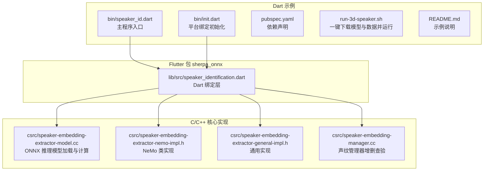
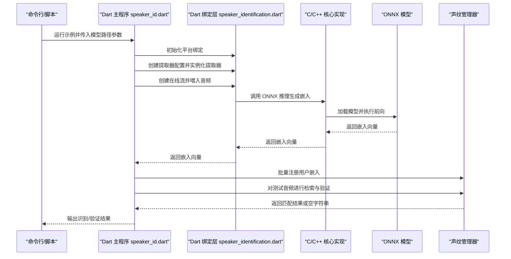
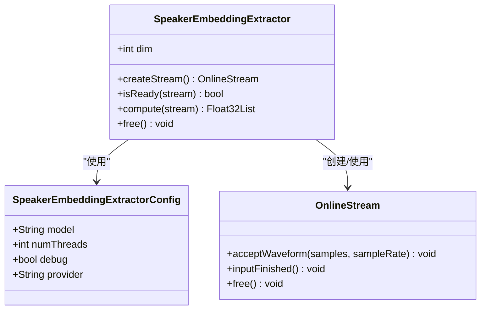
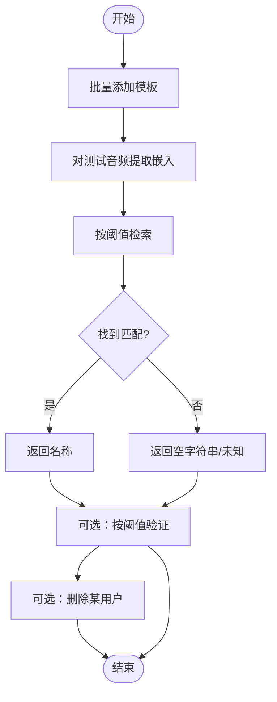
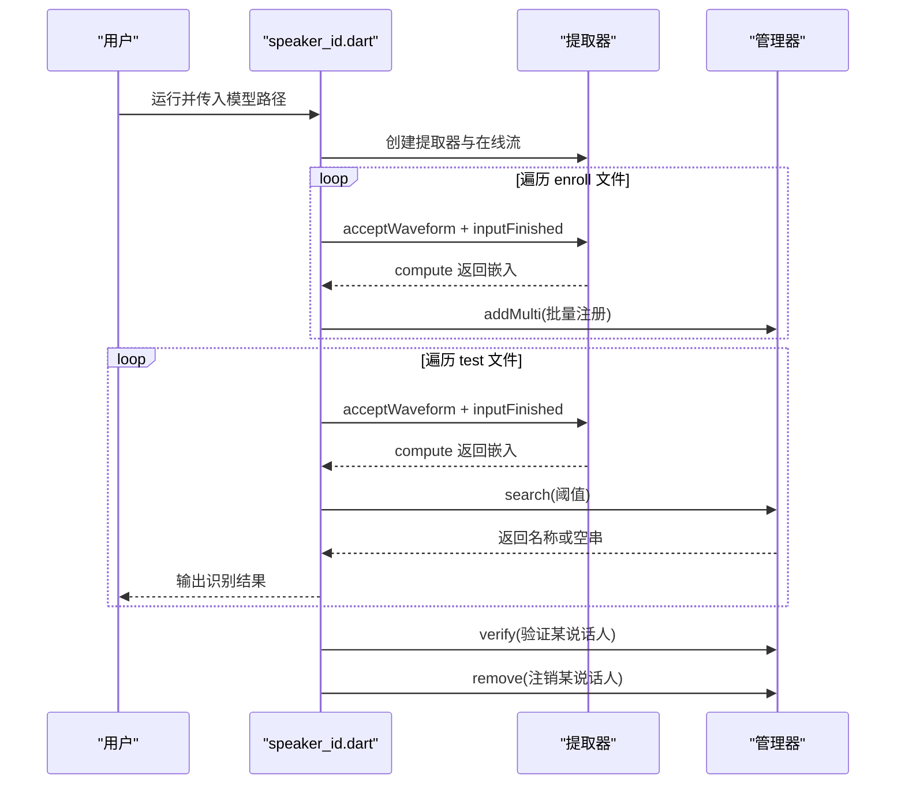
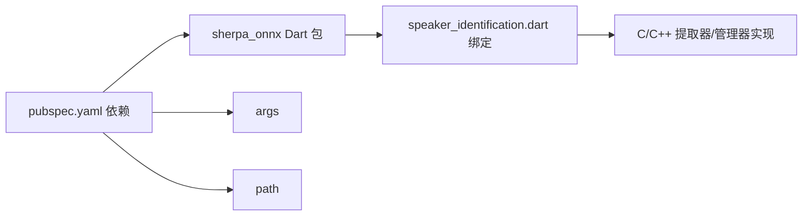

# 说话人识别示例

<cite>
**本文引用的文件**
- [dart-api-examples/speaker-identification/README.md](file://dart-api-examples/speaker-identification/README.md)
- [dart-api-examples/speaker-identification/pubspec.yaml](file://dart-api-examples/speaker-identification/pubspec.yaml)
- [dart-api-examples/speaker-identification/bin/speaker_id.dart](file://dart-api-examples/speaker-identification/bin/speaker_id.dart)
- [dart-api-examples/speaker-identification/bin/init.dart](file://dart-api-examples/speaker-identification/bin/init.dart)
- [dart-api-examples/speaker-identification/run-3d-speaker.sh](file://dart-api-examples/speaker-identification/run-3d-speaker.sh)
- [flutter/sherpa_onnx/lib/src/speaker_identification.dart](file://flutter/sherpa_onnx/lib/src/speaker_identification.dart)
- [sherpa-onnx/csrc/speaker-embedding-manager.cc](file://sherpa-onnx/csrc/speaker-embedding-manager.cc)
- [sherpa-onnx/csrc/speaker-embedding-extractor-model.cc](file://sherpa-onnx/csrc/speaker-embedding-extractor-model.cc)
- [sherpa-onnx/csrc/speaker-embedding-extractor-nemo-impl.h](file://sherpa-onnx/csrc/speaker-embedding-extractor-nemo-impl.h)
- [sherpa-onnx/csrc/speaker-embedding-extractor-general-impl.h](file://sherpa-onnx/csrc/speaker-embedding-extractor-general-impl.h)
- [nodejs-addon-examples/test_speaker_identification.js](file://nodejs-addon-examples/test_speaker_identification.js)
- [go-api-examples/speaker-identification/main.go](file://go-api-examples/speaker-identification/main.go)
- [dotnet-examples/speaker-identification/Program.cs](file://dotnet-examples/speaker-identification/Program.cs)
</cite>

## 目录
1. [简介](#简介)
2. [项目结构](#项目结构)
3. [核心组件](#核心组件)
4. [架构总览](#架构总览)
5. [详细组件分析](#详细组件分析)
6. [依赖关系分析](#依赖关系分析)
7. [性能与阈值建议](#性能与阈值建议)
8. [故障排查指南](#故障排查指南)
9. [结论](#结论)
10. [附录](#附录)

## 简介
本文件围绕 sherpa-onnx Dart API 的“说话人识别（Speaker Identification）”示例进行系统化解读，重点覆盖以下方面：
- 使用 Dart 调用说话人嵌入提取器（SpeakerEmbeddingExtractor），从音频中提取声纹特征向量；
- 将多个样本的嵌入向量聚合为注册用户的声纹模板，并通过管理器（SpeakerEmbeddingManager）完成检索与验证；
- 展示识别流程：注册、检索、验证、删除与统计；
- 解释在安全认证与个性化服务中的应用场景；
- 提供声纹数据库管理与识别阈值调节建议。

## 项目结构
Dart 示例位于 dart-api-examples/speaker-identification，包含运行脚本、依赖配置与主程序入口；底层能力由 Flutter 包 sherpa_onnx 提供，其内部封装了 C/C++ 实现并通过 FFI 暴露给 Dart。

图表来源
- [dart-api-examples/speaker-identification/bin/speaker_id.dart](file://dart-api-examples/speaker-identification/bin/speaker_id.dart#L1-L161)
- [dart-api-examples/speaker-identification/bin/init.dart](file://dart-api-examples/speaker-identification/bin/init.dart#L1-L39)
- [dart-api-examples/speaker-identification/pubspec.yaml](file://dart-api-examples/speaker-identification/pubspec.yaml#L1-L18)
- [dart-api-examples/speaker-identification/run-3d-speaker.sh](file://dart-api-examples/speaker-identification/run-3d-speaker.sh#L1-L20)
- [flutter/sherpa_onnx/lib/src/speaker_identification.dart](file://flutter/sherpa_onnx/lib/src/speaker_identification.dart#L1-L298)
- [sherpa-onnx/csrc/speaker-embedding-extractor-model.cc](file://sherpa-onnx/csrc/speaker-embedding-extractor-model.cc#L1-L120)
- [sherpa-onnx/csrc/speaker-embedding-extractor-nemo-impl.h](file://sherpa-onnx/csrc/speaker-embedding-extractor-nemo-impl.h#L105-L146)
- [sherpa-onnx/csrc/speaker-embedding-extractor-general-impl.h](file://sherpa-onnx/csrc/speaker-embedding-extractor-general-impl.h#L83-L117)
- [sherpa-onnx/csrc/speaker-embedding-manager.cc](file://sherpa-onnx/csrc/speaker-embedding-manager.cc#L250-L289)

章节来源
- [dart-api-examples/speaker-identification/README.md](file://dart-api-examples/speaker-identification/README.md#L1-L8)
- [dart-api-examples/speaker-identification/pubspec.yaml](file://dart-api-examples/speaker-identification/pubspec.yaml#L1-L18)
- [dart-api-examples/speaker-identification/run-3d-speaker.sh](file://dart-api-examples/speaker-identification/run-3d-speaker.sh#L1-L20)

## 核心组件
- 声纹嵌入提取器（SpeakerEmbeddingExtractor）
  - 负责加载 ONNX 模型并生成单段音频的固定维度浮点向量（嵌入）。
  - 支持创建在线流（OnlineStream）输入音频帧，完成后计算嵌入。
- 声纹管理器（SpeakerEmbeddingManager）
  - 维护注册用户与对应嵌入模板，支持添加、批量添加、查询、验证、删除、统计等操作。
  - 查询时使用阈值控制相似度门限，决定是否返回匹配名称。
- 平台绑定初始化（init.dart）
  - 根据操作系统动态定位本地 sherpa-onnx 库路径并初始化绑定，确保 Dart 能通过 FFI 调用底层实现。

章节来源
- [flutter/sherpa_onnx/lib/src/speaker_identification.dart](file://flutter/sherpa_onnx/lib/src/speaker_identification.dart#L1-L298)
- [dart-api-examples/speaker-identification/bin/init.dart](file://dart-api-examples/speaker-identification/bin/init.dart#L1-L39)

## 架构总览
下图展示了 Dart 示例到底层推理与管理的端到端调用链路。

图表来源
- [dart-api-examples/speaker-identification/bin/speaker_id.dart](file://dart-api-examples/speaker-identification/bin/speaker_id.dart#L1-L161)
- [flutter/sherpa_onnx/lib/src/speaker_identification.dart](file://flutter/sherpa_onnx/lib/src/speaker_identification.dart#L1-L298)
- [sherpa-onnx/csrc/speaker-embedding-extractor-model.cc](file://sherpa-onnx/csrc/speaker-embedding-extractor-model.cc#L1-L120)
- [sherpa-onnx/csrc/speaker-embedding-manager.cc](file://sherpa-onnx/csrc/speaker-embedding-manager.cc#L250-L289)

## 详细组件分析

### 1) 声纹嵌入提取器（SpeakerEmbeddingExtractor）
- 配置项
  - 模型路径、线程数、调试开关、执行提供者（如 CPU）。
- 关键方法
  - 创建在线流：用于接收音频帧。
  - 输入结束：标记音频流输入完成。
  - 计算嵌入：对已输入的音频流执行推理，输出固定维度浮点向量。
- 数据结构与复杂度
  - 嵌入维度由模型决定，通常为固定大小的一维浮点数组。
  - 单次推理时间取决于模型大小、音频长度与硬件性能。

图表来源
- [flutter/sherpa_onnx/lib/src/speaker_identification.dart](file://flutter/sherpa_onnx/lib/src/speaker_identification.dart#L1-L128)

章节来源
- [flutter/sherpa_onnx/lib/src/speaker_identification.dart](file://flutter/sherpa_onnx/lib/src/speaker_identification.dart#L1-L128)

### 2) 声纹管理器（SpeakerEmbeddingManager）
- 功能
  - 添加单个嵌入：将指定名称与一个嵌入向量关联。
  - 批量添加：将指定名称与多个嵌入向量合并为模板。
  - 查询：给定嵌入向量与阈值，返回最匹配的名称或空字符串。
  - 验证：判断某名称与给定嵌入向量的相似度是否超过阈值。
  - 删除：移除指定名称及其模板。
  - 统计与枚举：获取注册人数、列出所有名称。
- 内部存储
  - 以二维矩阵存储模板嵌入，映射名称到行索引，支持快速检索与相似度计算。

图表来源
- [flutter/sherpa_onnx/lib/src/speaker_identification.dart](file://flutter/sherpa_onnx/lib/src/speaker_identification.dart#L130-L298)
- [sherpa-onnx/csrc/speaker-embedding-manager.cc](file://sherpa-onnx/csrc/speaker-embedding-manager.cc#L250-L289)

章节来源
- [flutter/sherpa_onnx/lib/src/speaker_identification.dart](file://flutter/sherpa_onnx/lib/src/speaker_identification.dart#L130-L298)
- [sherpa-onnx/csrc/speaker-embedding-manager.cc](file://sherpa-onnx/csrc/speaker-embedding-manager.cc#L250-L289)

### 3) 示例主流程（Dart）
- 初始化
  - 通过 init.dart 根据平台选择库路径并初始化绑定。
- 参数解析
  - 从命令行读取模型路径参数。
- 注册阶段
  - 读取多个 enroll 音频，提取嵌入并批量注册为两个说话人。
- 测试阶段
  - 对测试集逐个提取嵌入，使用阈值检索并打印结果。
- 验证与清理
  - 验证某说话人与测试样本是否匹配；删除该说话人后再次验证确认失效。

图表来源
- [dart-api-examples/speaker-identification/bin/speaker_id.dart](file://dart-api-examples/speaker-identification/bin/speaker_id.dart#L1-L161)

章节来源
- [dart-api-examples/speaker-identification/bin/speaker_id.dart](file://dart-api-examples/speaker-identification/bin/speaker_id.dart#L1-L161)

### 4) 平台绑定初始化
- 作用
  - 在不同操作系统上解析包 URI 并定位本地 sherpa-onnx 动态库目录，随后调用初始化函数完成绑定。
- 注意事项
  - 若找不到库或平台不受支持，会抛出错误并退出。

章节来源
- [dart-api-examples/speaker-identification/bin/init.dart](file://dart-api-examples/speaker-identification/bin/init.dart#L1-L39)

### 5) 模型与推理实现要点
- ONNX 模型加载与会话
  - 通过文件路径加载模型字节，构建会话选项并初始化推理环境。
- 特征预处理与归一化
  - 不同实现可能包含减均值、标准化等步骤，确保嵌入向量具备良好的判别性。
- 嵌入维度
  - 嵌入向量维度由模型定义，管理器构造时需一致。

章节来源
- [sherpa-onnx/csrc/speaker-embedding-extractor-model.cc](file://sherpa-onnx/csrc/speaker-embedding-extractor-model.cc#L1-L120)
- [sherpa-onnx/csrc/speaker-embedding-extractor-nemo-impl.h](file://sherpa-onnx/csrc/speaker-embedding-extractor-nemo-impl.h#L105-L146)
- [sherpa-onnx/csrc/speaker-embedding-extractor-general-impl.h](file://sherpa-onnx/csrc/speaker-embedding-extractor-general-impl.h#L83-L117)

## 依赖关系分析
- Dart 示例依赖
  - sherpa_onnx Dart 包（版本在 pubspec.yaml 中声明）。
  - args 用于命令行参数解析。
  - path 用于路径处理。
- Dart 绑定层依赖
  - 通过 FFI 调用 C/C++ 核心实现，包括提取器、管理器与 ONNX 推理。
- 其他语言示例对比
  - Node.js、Go、C# 示例展示了相同的注册、检索、验证与删除流程，便于跨语言理解。

图表来源
- [dart-api-examples/speaker-identification/pubspec.yaml](file://dart-api-examples/speaker-identification/pubspec.yaml#L1-L18)
- [flutter/sherpa_onnx/lib/src/speaker_identification.dart](file://flutter/sherpa_onnx/lib/src/speaker_identification.dart#L1-L298)

章节来源
- [dart-api-examples/speaker-identification/pubspec.yaml](file://dart-api-examples/speaker-identification/pubspec.yaml#L1-L18)
- [nodejs-addon-examples/test_speaker_identification.js](file://nodejs-addon-examples/test_speaker_identification.js#L49-L102)
- [go-api-examples/speaker-identification/main.go](file://go-api-examples/speaker-identification/main.go#L108-L146)
- [dotnet-examples/speaker-identification/Program.cs](file://dotnet-examples/speaker-identification/Program.cs#L92-L153)

## 性能与阈值建议
- 性能优化
  - 合理设置线程数与执行提供者，优先使用 CPU 或可用 NPU（若平台支持）。
  - 批量注册时尽量复用同一提取器实例，避免重复加载模型。
  - 控制音频长度与采样率，减少不必要的预处理开销。
- 阈值调节
  - 初始阈值可参考示例中的 0.6，结合实际数据集的正负样本分布调整。
  - 建议在开发阶段收集若干正样本与负样本，绘制 ROC 曲线或计算准确率，确定最优阈值。
- 声纹数据库管理
  - 为每个用户保留多个高质量样本，提升模板稳定性。
  - 定期评估与更新模板，剔除质量差的样本。
  - 对于误识别较多的用户，可考虑增加样本数量或提高阈值。

[本节为通用指导，不直接分析具体文件]

## 故障排查指南
- 常见问题
  - 未传入模型路径：命令行缺少 --model 参数会导致程序打印帮助并退出。
  - 平台绑定失败：init.dart 会在无法解析包 URI 或平台不受支持时抛错并退出。
  - 注册失败：addMulti 返回 false 表示注册异常，检查嵌入维度与模型配置。
  - 无匹配：search 返回空字符串表示低于阈值，尝试提高阈值或增加样本。
  - 验证失败：verify 返回 false 表示不匹配，确认样本来自同一用户且阈值合理。
- 建议排查步骤
  - 确认模型文件与测试数据下载完整。
  - 检查嵌入维度一致性（提取器 dim 与管理器构造参数一致）。
  - 查看平台绑定初始化日志，确认库路径正确。
  - 使用更严格的阈值或更多样本进行交叉验证。

章节来源
- [dart-api-examples/speaker-identification/bin/speaker_id.dart](file://dart-api-examples/speaker-identification/bin/speaker_id.dart#L1-L161)
- [dart-api-examples/speaker-identification/bin/init.dart](file://dart-api-examples/speaker-identification/bin/init.dart#L1-L39)

## 结论
Dart 示例清晰地展示了如何在 Dart 环境中使用 sherpa-onnx 进行说话人识别：通过提取器生成嵌入，借助管理器完成模板注册、检索与验证，并支持删除与统计。该能力可用于安全认证（如语音解锁）、个性化服务（如根据说话人定制界面或偏好）等场景。实践中应重视阈值调节与数据库管理，以获得稳定可靠的识别效果。

[本节为总结性内容，不直接分析具体文件]

## 附录
- 快速运行
  - 使用 run-3d-speaker.sh 自动下载模型与测试数据并运行示例。
- 相关文件路径
  - 示例主程序：dart-api-examples/speaker-identification/bin/speaker_id.dart
  - 平台初始化：dart-api-examples/speaker-identification/bin/init.dart
  - 依赖配置：dart-api-examples/speaker-identification/pubspec.yaml
  - 运行脚本：dart-api-examples/speaker-identification/run-3d-speaker.sh
  - Dart 绑定层：flutter/sherpa_onnx/lib/src/speaker_identification.dart
  - C/C++ 核心实现：sherpa-onnx/csrc/speaker-embedding-extractor-model.cc、sherpa-onnx/csrc/speaker-embedding-manager.cc、sherpa-onnx/csrc/speaker-embedding-extractor-nemo-impl.h、sherpa-onnx/csrc/speaker-embedding-extractor-general-impl.h