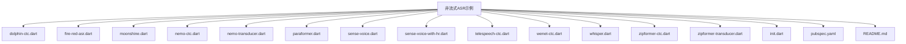
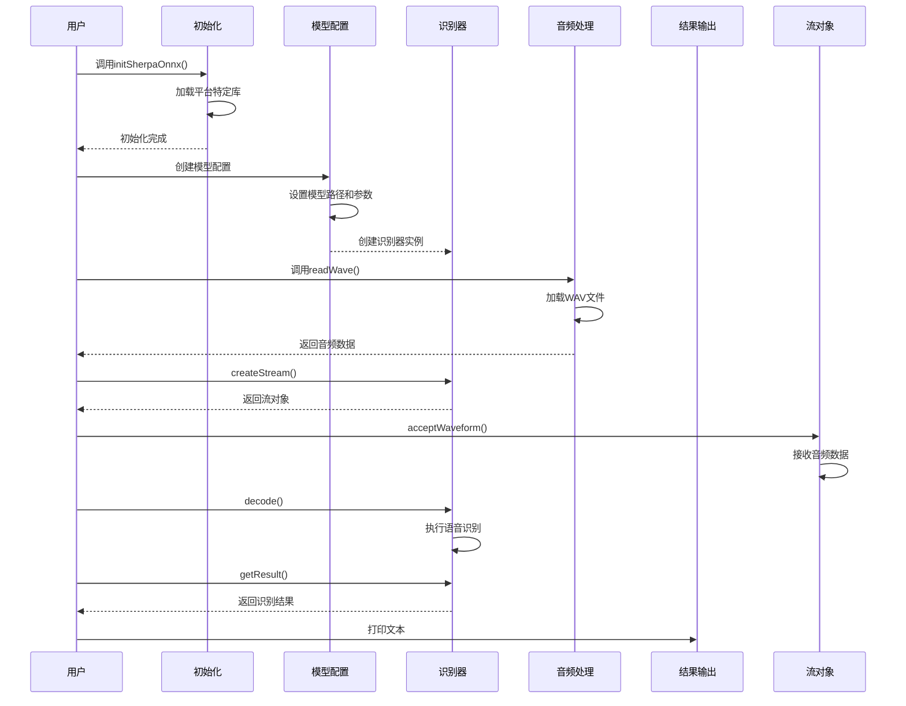
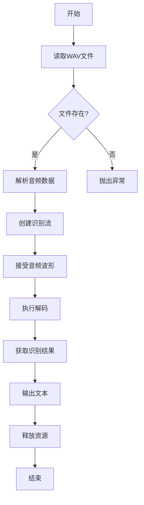

# 非流式语音识别示例

<cite>
**本文档引用的文件**  
- [dolphin-ctc.dart](file://dart-api-examples/non-streaming-asr/bin/dolphin-ctc.dart)
- [fire-red-asr.dart](file://dart-api-examples/non-streaming-asr/bin/fire-red-asr.dart)
- [moonshine.dart](file://dart-api-examples/non-streaming-asr/bin/moonshine.dart)
- [nemo-ctc.dart](file://dart-api-examples/non-streaming-asr/bin/nemo-ctc.dart)
- [nemo-transducer.dart](file://dart-api-examples/non-streaming-asr/bin/nemo-transducer.dart)
- [paraformer.dart](file://dart-api-examples/non-streaming-asr/bin/paraformer.dart)
- [sense-voice.dart](file://dart-api-examples/non-streaming-asr/bin/sense-voice.dart)
- [sense-voice-with-hr.dart](file://dart-api-examples/non-streaming-asr/bin/sense-voice-with-hr.dart)
- [telespeech-ctc.dart](file://dart-api-examples/non-streaming-asr/bin/telespeech-ctc.dart)
- [wenet-ctc.dart](file://dart-api-examples/non-streaming-asr/bin/wenet-ctc.dart)
- [whisper.dart](file://dart-api-examples/non-streaming-asr/bin/whisper.dart)
- [zipformer-ctc.dart](file://dart-api-examples/non-streaming-asr/bin/zipformer-ctc.dart)
- [zipformer-transducer.dart](file://dart-api-examples/non-streaming-asr/bin/zipformer-transducer.dart)
- [init.dart](file://dart-api-examples/non-streaming-asr/bin/init.dart)
- [pubspec.yaml](file://dart-api-examples/non-streaming-asr/pubspec.yaml)
- [README.md](file://dart-api-examples/non-streaming-asr/README.md)
</cite>

## 目录
1. [简介](#简介)
2. [项目结构](#项目结构)
3. [核心组件](#核心组件)
4. [非流式ASR实现原理](#非流式asr实现原理)
5. [各ASR模型使用方法](#各asr模型使用方法)
6. [参数配置与最佳实践](#参数配置与最佳实践)
7. [错误处理与性能优化](#错误处理与性能优化)
8. [总结](#总结)

## 简介

本项目展示了如何使用Dart API进行非流式语音识别（ASR），支持多种先进的语音识别模型，包括dolphin-ctc、fire-red-asr、moonshine、nemo系列、paraformer、sense-voice等。非流式ASR适用于完整的音频文件识别，能够提供更准确的转录结果。

## 项目结构

非流式语音识别示例位于`dart-api-examples/non-streaming-asr`目录下，包含多个针对不同ASR模型的Dart示例文件。



**图示来源**
- [README.md](file://dart-api-examples/non-streaming-asr/README.md)

## 核心组件

非流式ASR示例的核心组件包括初始化模块、模型配置、识别器和音频处理功能。

**组件来源**
- [init.dart](file://dart-api-examples/non-streaming-asr/bin/init.dart)
- [dolphin-ctc.dart](file://dart-api-examples/non-streaming-asr/bin/dolphin-ctc.dart)
- [pubspec.yaml](file://dart-api-examples/non-streaming-asr/pubspec.yaml)

## 非流式ASR实现原理

非流式ASR的工作流程包括模型初始化、音频加载、识别处理和结果获取四个主要步骤。



**图示来源**
- [init.dart](file://dart-api-examples/non-streaming-asr/bin/init.dart)
- [dolphin-ctc.dart](file://dart-api-examples/non-streaming-asr/bin/dolphin-ctc.dart)

## 各ASR模型使用方法

### Dolphin-CTC模型

Dolphin-CTC模型是一种基于CTC（Connectionist Temporal Classification）的语音识别模型，适用于中文语音识别。

```dart
final dolphin = sherpa_onnx.OfflineDolphinModelConfig(model: modelPath);
final modelConfig = sherpa_onnx.OfflineModelConfig(
  dolphin: dolphin,
  tokens: tokensPath,
  debug: true,
  numThreads: 1,
);
```

**代码来源**
- [dolphin-ctc.dart](file://dart-api-examples/non-streaming-asr/bin/dolphin-ctc.dart#L29-L36)

### Fire-Red-ASR模型

Fire-Red-ASR模型采用编码器-解码器架构，需要分别指定编码器和解码器模型文件。

```dart
final fireRedAsr = sherpa_onnx.OfflineFireRedAsrModelConfig(
  encoder: encoderPath,
  decoder: decoderPath,
);
final modelConfig = sherpa_onnx.OfflineModelConfig(
  fireRedAsr: fireRedAsr,
  tokens: tokensPath,
  debug: false,
  numThreads: 1,
);
```

**代码来源**
- [fire-red-asr.dart](file://dart-api-examples/non-streaming-asr/bin/fire-red-asr.dart#L32-L42)

### Moonshine模型

Moonshine模型具有复杂的多组件架构，包括预处理器、编码器和缓存/非缓存解码器。

```dart
final moonshine = sherpa_onnx.OfflineMoonshineModelConfig(
  preprocessor: preprocessorPath,
  encoder: encoderPath,
  uncachedDecoder: uncachedDecoderPath,
  cachedDecoder: cachedDecoderPath,
);
```

**代码来源**
- [moonshine.dart](file://dart-api-examples/non-streaming-asr/bin/moonshine.dart#L41-L46)

### NeMo系列模型

NeMo系列提供CTC和Transducer两种模型类型，分别适用于不同的识别场景。

```dart
// CTC模型
final nemo = sherpa_onnx.OfflineNemoEncDecCtcModelConfig(model: modelPath);
// Transducer模型
final nemo = sherpa_onnx.OfflineNemoEncDecTransducerModelConfig(model: modelPath);
```

**代码来源**
- [nemo-ctc.dart](file://dart-api-examples/non-streaming-asr/bin/nemo-ctc.dart#L29)
- [nemo-transducer.dart](file://dart-api-examples/non-streaming-asr/bin/nemo-transducer.dart#L29)

### Paraformer模型

Paraformer模型是一种高效的非自回归模型，适合快速语音识别。

```dart
final paraformer = sherpa_onnx.OfflineParaformerModelConfig(model: modelPath);
final modelConfig = sherpa_onnx.OfflineModelConfig(
  paraformer: paraformer,
  tokens: tokensPath,
  debug: true,
  numThreads: 1,
  modelType: 'paraformer',
);
```

**代码来源**
- [paraformer.dart](file://dart-api-examples/non-streaming-asr/bin/paraformer.dart#L29-L39)

### Sense-Voice模型

Sense-Voice模型支持多语言识别和逆文本归一化（ITN）功能。

```dart
final senseVoice = sherpa_onnx.OfflineSenseVoiceModelConfig(
  model: modelPath,
  language: language,
  useInverseTextNormalization: useItn,
);
```

**代码来源**
- [sense-voice.dart](file://dart-api-examples/non-streaming-asr/bin/sense-voice.dart#L36-L37)

### Whisper模型

Whisper模型采用编码器-解码器架构，需要分别提供编码器和解码器模型。

```dart
final whisper = sherpa_onnx.OfflineWhisperModelConfig(
  encoder: encoderPath,
  decoder: decoderPath,
);
final modelConfig = sherpa_onnx.OfflineModelConfig(
  whisper: whisper,
  tokens: tokensPath,
  modelType: 'whisper',
  debug: false,
  numThreads: 1,
);
```

**代码来源**
- [whisper.dart](file://dart-api-examples/non-streaming-asr/bin/whisper.dart#L32-L43)

### Zipformer系列模型

Zipformer系列提供CTC和Transducer两种变体，具有高效的识别性能。

```dart
// CTC模型
final zipformerCtc = sherpa_onnx.OfflineZipformerCtcModelConfig(model: modelPath);
// Transducer模型
final zipformerTransducer = sherpa_onnx.OfflineZipformerTransducerModelConfig(model: modelPath);
```

**代码来源**
- [zipformer-ctc.dart](file://dart-api-examples/non-streaming-asr/bin/zipformer-ctc.dart#L29)
- [zipformer-transducer.dart](file://dart-api-examples/non-streaming-asr/bin/zipformer-transducer.dart#L29)

## 参数配置与最佳实践

### 模型配置参数

| 参数 | 说明 | 最佳实践 |
|------|------|----------|
| `model` | 模型文件路径 | 确保路径正确，模型文件完整 |
| `tokens` | 词元文件路径 | 使用与模型匹配的tokens.txt文件 |
| `debug` | 调试模式 | 开发阶段设为true，生产环境设为false |
| `numThreads` | 线程数 | 根据CPU核心数设置，通常为1-4 |
| `language` | 语言设置 | 指定目标语言或使用auto自动检测 |

### 音频处理流程



**图示来源**
- [dolphin-ctc.dart](file://dart-api-examples/non-streaming-asr/bin/dolphin-ctc.dart)

## 错误处理与性能优化

### 错误处理策略

```dart
try {
  final res = parser.parse(arguments);
  if (res['model'] == null || res['tokens'] == null || res['input-wav'] == null) {
    print(parser.usage);
    exit(1);
  }
  // 主要处理逻辑
} on FileSystemException catch (e) {
  print('文件系统错误: $e');
  exit(1);
} on FormatException catch (e) {
  print('格式错误: $e');
  exit(1);
} catch (e) {
  print('未知错误: $e');
  exit(1);
}
```

**代码来源**
- [dolphin-ctc.dart](file://dart-api-examples/non-streaming-asr/bin/dolphin-ctc.dart#L17-L23)

### 性能优化建议

1. **线程优化**：根据设备CPU核心数合理设置`numThreads`参数
2. **内存管理**：及时释放识别器和流对象，避免内存泄漏
3. **模型选择**：根据应用场景选择合适的模型，平衡准确率和速度
4. **预加载**：对于频繁使用的模型，考虑预加载以减少启动时间
5. **批处理**：对于多个音频文件，考虑批量处理以提高效率

```dart
// 资源释放最佳实践
stream.free();
recognizer.free();
```

**代码来源**
- [dolphin-ctc.dart](file://dart-api-examples/non-streaming-asr/bin/dolphin-ctc.dart#L50-L51)

## 总结

sherpa-onnx的Dart API为非流式语音识别提供了统一且易用的接口，支持多种先进的ASR模型。通过标准化的初始化、配置和识别流程，开发者可以轻松集成各种语音识别功能到Dart应用中。不同模型具有各自的特点和适用场景，开发者应根据具体需求选择合适的模型，并遵循最佳实践进行参数配置和性能优化。