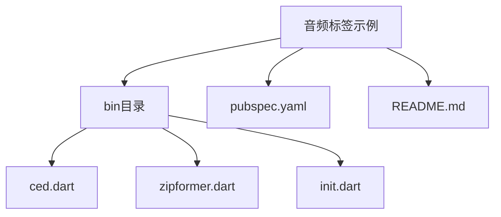
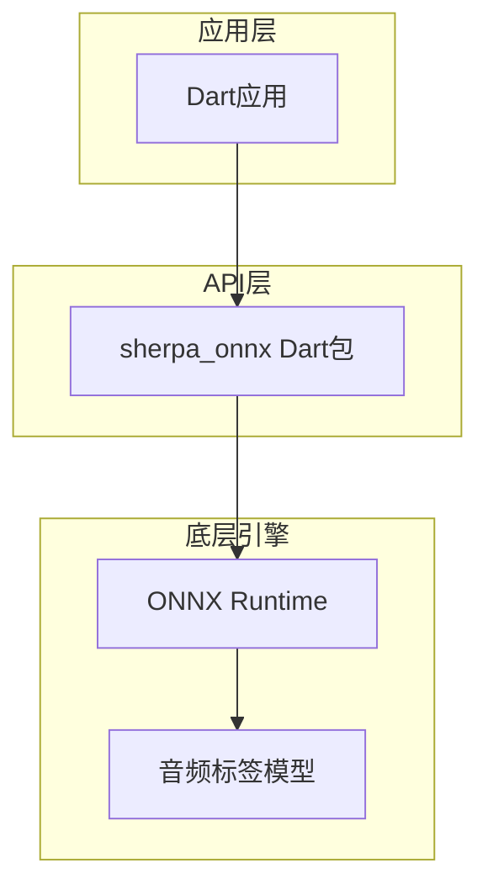
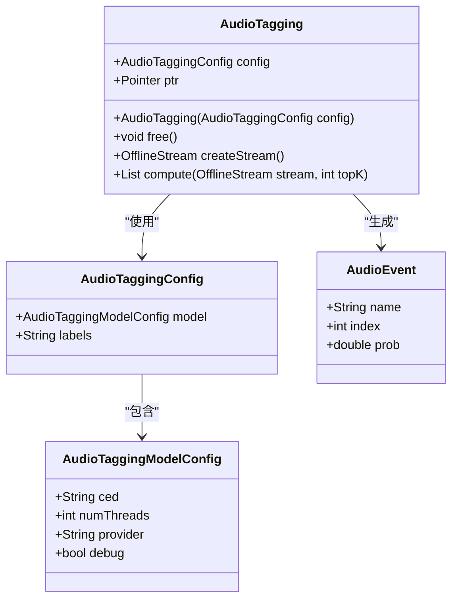
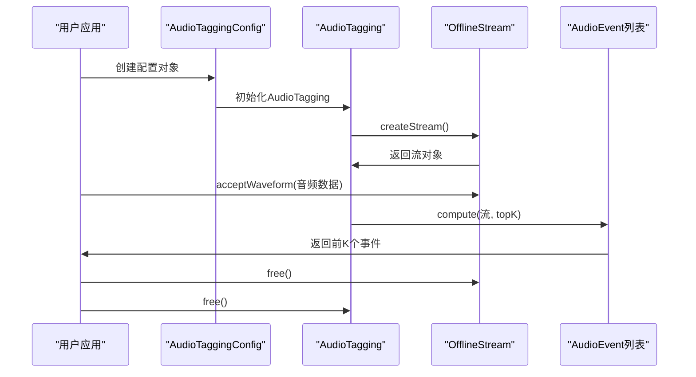
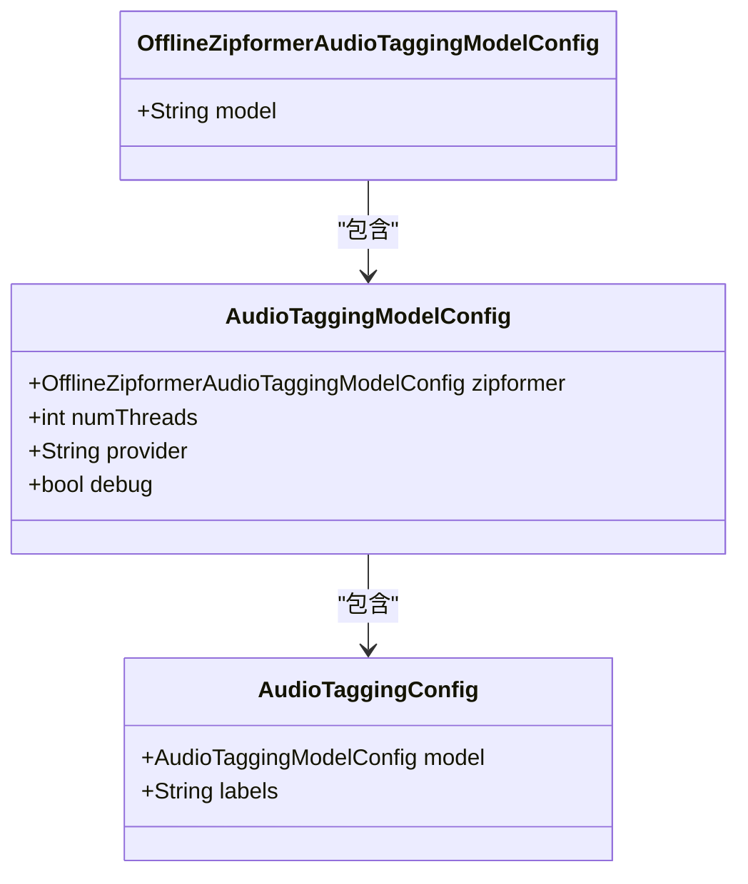
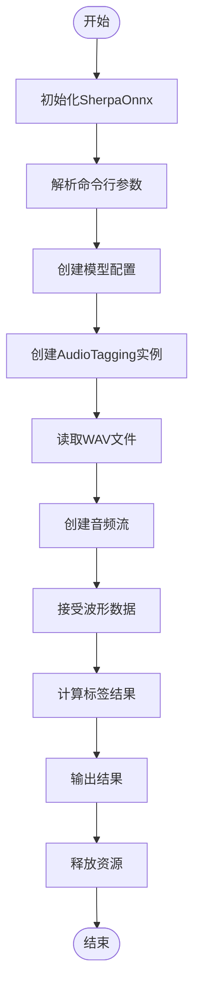
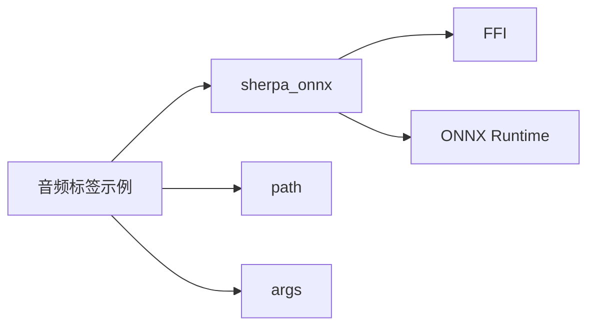

# 音频标签示例

<cite>
**本文档中引用的文件**  
- [ced.dart](file://dart-api-examples/audio-tagging/bin/ced.dart)
- [zipformer.dart](file://dart-api-examples/audio-tagging/bin/zipformer.dart)
- [init.dart](file://dart-api-examples/audio-tagging/bin/init.dart)
- [audio_tagging.dart](file://flutter/sherpa_onnx/lib/src/audio_tagging.dart)
- [pubspec.yaml](file://dart-api-examples/audio-tagging/pubspec.yaml)
- [README.md](file://dart-api-examples/audio-tagging/README.md)
</cite>

## 目录
1. [简介](#简介)
2. [项目结构](#项目结构)
3. [核心组件](#核心组件)
4. [架构概述](#架构概述)
5. [详细组件分析](#详细组件分析)
6. [依赖分析](#依赖分析)
7. [性能考虑](#性能考虑)
8. [故障排除指南](#故障排除指南)
9. [结论](#结论)

## 简介
本示例演示了如何使用sherpa-onnx的Dart API进行音频标签。音频标签是一种机器学习技术，用于识别和分类音频文件中的声学事件或声音类型，如狗吠、汽车喇叭、玻璃破碎等。该功能在环境声音识别、智能家居、安全监控和音频内容分析等领域有广泛应用。本文档详细解释了CED和Zipformer两种音频标签模型的使用方法，以及如何在Dart语言中调用相关功能。

## 项目结构
音频标签示例位于`dart-api-examples/audio-tagging`目录下，包含使用不同模型进行音频标签的Dart脚本。项目结构清晰，分为配置、模型加载和音频处理三个主要部分。

**图示来源**
- [ced.dart](file://dart-api-examples/audio-tagging/bin/ced.dart)
- [zipformer.dart](file://dart-api-examples/audio-tagging/bin/zipformer.dart)
- [init.dart](file://dart-api-examples/audio-tagging/bin/init.dart)

**章节来源**
- [README.md](file://dart-api-examples/audio-tagging/README.md)

## 核心组件
核心组件包括音频标签模型配置、音频流创建和标签结果计算。`AudioTagging`类是主要的接口，负责加载模型、处理音频数据并生成标签结果。`AudioTaggingConfig`用于配置模型参数，`OfflineStream`用于管理音频流，`AudioEvent`表示识别出的声学事件。

**章节来源**
- [audio_tagging.dart](file://flutter/sherpa_onnx/lib/src/audio_tagging.dart#L1-L220)
- [ced.dart](file://dart-api-examples/audio-tagging/bin/ced.dart#L1-L55)

## 架构概述
音频标签功能的架构分为三层：应用层、API层和底层引擎。应用层使用Dart编写，通过`sherpa_onnx`包调用API层。API层提供高级接口，封装了底层C API的复杂性。底层引擎使用ONNX Runtime执行模型推理。

**图示来源**
- [audio_tagging.dart](file://flutter/sherpa_onnx/lib/src/audio_tagging.dart#L128-L219)
- [ced.dart](file://dart-api-examples/audio-tagging/bin/ced.dart#L40-L41)

## 详细组件分析

### CED模型分析
CED（CNN-based Environmental Sound Detection）模型是一种基于卷积神经网络的环境声音检测模型，适用于实时音频标签任务。

#### 模型配置

**图示来源**
- [audio_tagging.dart](file://flutter/sherpa_onnx/lib/src/audio_tagging.dart#L32-L71)
- [ced.dart](file://dart-api-examples/audio-tagging/bin/ced.dart#L28-L33)

#### 调用流程

**图示来源**
- [ced.dart](file://dart-api-examples/audio-tagging/bin/ced.dart#L40-L54)
- [audio_tagging.dart](file://flutter/sherpa_onnx/lib/src/audio_tagging.dart#L188-L214)

**章节来源**
- [ced.dart](file://dart-api-examples/audio-tagging/bin/ced.dart#L1-L55)
- [audio_tagging.dart](file://flutter/sherpa_onnx/lib/src/audio_tagging.dart#L1-L220)

### Zipformer模型分析
Zipformer模型是一种基于Transformer架构的先进音频标签模型，具有更高的准确性和更广的声学事件覆盖范围。

#### 模型配置

**图示来源**
- [audio_tagging.dart](file://flutter/sherpa_onnx/lib/src/audio_tagging.dart#L8-L30)
- [zipformer.dart](file://dart-api-examples/audio-tagging/bin/zipformer.dart#L28-L31)

#### 调用流程

**图示来源**
- [zipformer.dart](file://dart-api-examples/audio-tagging/bin/zipformer.dart#L8-L59)
- [audio_tagging.dart](file://flutter/sherpa_onnx/lib/src/audio_tagging.dart#L181-L186)

**章节来源**
- [zipformer.dart](file://dart-api-examples/audio-tagging/bin/zipformer.dart#L1-L60)
- [audio_tagging.dart](file://flutter/sherpa_onnx/lib/src/audio_tagging.dart#L1-L220)

## 依赖分析
音频标签示例依赖于`sherpa_onnx`包和几个辅助Dart包，这些依赖关系在`pubspec.yaml`文件中定义。

**图示来源**
- [pubspec.yaml](file://dart-api-examples/audio-tagging/pubspec.yaml#L11-L14)
- [audio_tagging.dart](file://flutter/sherpa_onnx/lib/src/audio_tagging.dart#L2-L3)

**章节来源**
- [pubspec.yaml](file://dart-api-examples/audio-tagging/pubspec.yaml#L1-L18)

## 性能考虑
音频标签的性能受多个因素影响，包括模型大小、线程数和硬件平台。CED模型较小，适合移动设备和实时应用；Zipformer模型较大，但准确率更高，适合服务器端批处理任务。建议在CPU上运行时设置`numThreads`为1以避免资源竞争，在支持GPU的平台上可将`provider`设置为"cuda"以加速推理。

## 故障排除指南
常见问题包括模型文件路径错误、音频格式不支持和内存不足。确保模型文件路径正确，WAV文件为16位PCM格式，且系统有足够的内存加载模型。如果遇到初始化失败，检查`init.dart`中的平台检测逻辑是否正确。

**章节来源**
- [init.dart](file://dart-api-examples/audio-tagging/bin/init.dart#L7-L38)
- [ced.dart](file://dart-api-examples/audio-tagging/bin/ced.dart#L18-L21)
- [zipformer.dart](file://dart-api-examples/audio-tagging/bin/zipformer.dart#L18-L21)

## 结论
sherpa-onnx的Dart API为音频标签提供了强大而灵活的工具。通过本文档，开发者可以了解如何使用CED和Zipformer模型进行音频标签，掌握Dart语言中的调用方法，并根据具体应用场景选择合适的模型。音频标签技术在环境声音识别和音频内容分析中具有广阔的应用前景。