# Go API 示例

<cite>
**本文档中引用的文件**
- [go.mod](file://go-api-examples/add-punctuation/go.mod)
- [main.go](file://go-api-examples/add-punctuation/main.go)
- [go.mod](file://go-api-examples/audio-tagging/go.mod)
- [main.go](file://go-api-examples/audio-tagging/main.go)
- [go.mod](file://go-api-examples/keyword-spotting-from-file/go.mod)
- [main.go](file://go-api-examples/keyword-spotting-from-file/main.go)
- [go.mod](file://go-api-examples/non-streaming-canary-decode-files/go.mod)
- [main.go](file://go-api-examples/non-streaming-canary-decode-files/main.go)
- [go.mod](file://go-api-examples/non-streaming-decode-files/go.mod)
- [main.go](file://go-api-examples/non-streaming-decode-files/main.go)
- [go.mod](file://go-api-examples/non-streaming-omnilingual-asr-ctc-decode-files/go.mod)
- [main.go](file://go-api-examples/non-streaming-omnilingual-asr-ctc-decode-files/main.go)
- [go.mod](file://go-api-examples/non-streaming-speaker-diarization/go.mod)
- [main.go](file://go-api-examples/non-streaming-speaker-diarization/main.go)
- [go.mod](file://go-api-examples/non-streaming-tts/go.mod)
- [main.go](file://go-api-examples/non-streaming-tts/main.go)
- [go.mod](file://go-api-examples/offline-tts-play/go.mod)
- [main.go](file://go-api-examples/offline-tts-play/main.go)
- [go.mod](file://go-api-examples/real-time-speech-recognition-from-microphone/go.mod)
- [main.go](file://go-api-examples/real-time-speech-recognition-from-microphone/main.go)
- [go.mod](file://go-api-examples/speaker-identification/go.mod)
- [main.go](file://go-api-examples/speaker-identification/main.go)
- [go.mod](file://go-api-examples/speech-enhancement-gtcrn/go.mod)
- [main.go](file://go-api-examples/speech-enhancement-gtcrn/main.go)
- [go.mod](file://go-api-examples/streaming-decode-files/go.mod)
- [main.go](file://go-api-examples/streaming-decode-files/main.go)
- [go.mod](file://go-api-examples/streaming-hlg-decoding/go.mod)
- [main.go](file://go-api-examples/streaming-hlg-decoding/main.go)
- [go.mod](file://go-api-examples/vad/go.mod)
- [main.go](file://go-api-examples/vad/main.go)
- [go.mod](file://go-api-examples/vad-asr-paraformer/go.mod)
- [main.go](file://go-api-examples/vad-asr-paraformer/main.go)
- [go.mod](file://go-api-examples/vad-asr-whisper/go.mod)
- [main.go](file://go-api-examples/vad-asr-whisper/main.go)
- [go.mod](file://go-api-examples/vad-speaker-identification/go.mod)
- [main.go](file://go-api-examples/vad-speaker-identification/main.go)
- [go.mod](file://go-api-examples/vad-spoken-language-identification/go.mod)
- [main.go](file://go-api-examples/vad-spoken-language-identification/main.go)
- [README.md](file://go-api-examples/README.md)
</cite>

## 目录
1. [简介](#简介)
2. [项目结构](#项目结构)
3. [核心组件](#核心组件)
4. [非流式语音识别](#非流式语音识别)
5. [流式语音识别](#流式语音识别)
6. [语音合成](#语音合成)
7. [说话人识别](#说话人识别)
8. [语音活动检测](#语音活动检测)
9. [音频标签](#音频标签)
10. [关键词识别](#关键词识别)
11. [语音增强](#语音增强)
12. [说话人分离](#说话人分离)
13. [CGO环境配置与编译](#cgo环境配置与编译)
14. [并发模型与goroutine应用](#并发模型与goroutine应用)
15. [跨平台编译与部署](#跨平台编译与部署)

## 简介

sherpa-onnx的Go API示例代码提供了一套完整的语音处理功能实现，涵盖了非流式语音识别、流式语音识别、语音合成、说话人识别、语音活动检测等多种应用场景。这些示例展示了如何使用Go语言调用底层C++实现的语音处理功能，通过CGO技术桥接Go与C++代码。

Go API示例代码位于`go-api-examples`目录下，每个子目录对应一个特定功能的示例。这些示例不仅展示了基本的API使用方法，还包含了实际应用中的最佳实践，如错误处理、资源管理和性能优化。

**Section sources**
- [README.md](file://go-api-examples/README.md)

## 项目结构

Go API示例代码的项目结构清晰，每个功能都有独立的目录。主要目录包括：

- `add-punctuation`: 标点符号添加示例
- `audio-tagging`: 音频标签识别示例
- `keyword-spotting-from-file`: 关键词识别示例
- `non-streaming-*`: 非流式语音处理示例
- `real-time-speech-recognition-from-microphone`: 实时语音识别示例
- `speaker-identification`: 说话人识别示例
- `streaming-*`: 流式语音处理示例
- `vad-*`: 语音活动检测相关示例

每个示例目录都包含一个`go.mod`文件和一个`main.go`文件，遵循Go模块的标准结构。`go.mod`文件定义了模块依赖，`main.go`文件包含了示例的主要逻辑。


**Diagram sources**
- [README.md](file://go-api-examples/README.md)

**Section sources**
- [README.md](file://go-api-examples/README.md)

## 核心组件

Go API示例的核心组件包括语音识别、语音合成、说话人识别和语音活动检测等模块。这些组件通过统一的API接口提供服务，使得开发者可以方便地集成到自己的应用中。

语音识别组件支持多种模型，包括Transducer、Paraformer、Whisper等，可以处理不同场景下的语音识别需求。语音合成组件支持VITS、Matcha、Kokoro等多种TTS模型，能够生成高质量的语音输出。

说话人识别组件基于深度学习模型，可以提取说话人的声纹特征，并进行说话人验证和识别。语音活动检测组件使用Silero VAD或Ten VAD模型，能够准确检测语音信号中的语音活动。

```mermaid
classDiagram
class OfflineRecognizer {
+NewOfflineRecognizer(config *OfflineRecognizerConfig) *OfflineRecognizer
+DeleteOfflineRecognizer(recognizer *OfflineRecognizer)
+Decode(stream *OfflineStream)
+GetResult(stream *OfflineStream) *OfflineRecognizerResult
}
class OnlineRecognizer {
+NewOnlineRecognizer(config *OnlineRecognizerConfig) *OnlineRecognizer
+DeleteOnlineRecognizer(recognizer *OnlineRecognizer)
+IsReady(stream *OnlineStream) bool
+Decode(stream *OnlineStream)
+GetResult(stream *OnlineStream) *OnlineRecognizerResult
+IsEndpoint(stream *OnlineStream) bool
+Reset(stream *OnlineStream)
}
class OfflineTts {
+NewOfflineTts(config *OfflineTtsConfig) *OfflineTts
+DeleteOfflineTts(tts *OfflineTts)
+Generate(text string, sid int, speed float32) *GeneratedAudio
+GenerateWithZipvoice(text, promptText string, promptAudio []float32, sampleRate int, speed float32, numSteps int) *GeneratedAudio
}
class SpeakerEmbeddingExtractor {
+NewSpeakerEmbeddingExtractor(config *SpeakerEmbeddingExtractorConfig) *SpeakerEmbeddingExtractor
+DeleteSpeakerEmbeddingExtractor(extractor *SpeakerEmbeddingExtractor)
+Compute(stream *OnlineStream) []float32
+CreateStream() *OnlineStream
}
class VoiceActivityDetector {
+NewVoiceActivityDetector(config *VadModelConfig, bufferSizeInSeconds float32) *VoiceActivityDetector
+DeleteVoiceActivityDetector(vad *VoiceActivityDetector)
+AcceptWaveform(samples []float32)
+IsSpeech() bool
+IsEmpty() bool
+Front() *SpeechSegment
+Pop()
}
class AudioTagging {
+NewAudioTagging(config *AudioTaggingConfig) *AudioTagging
+DeleteAudioTagging(tagging *AudioTagging)
+Compute(stream *OfflineStream, duration float32) []AudioTaggingResult
}
class KeywordSpotter {
+NewKeywordSpotter(config *KeywordSpotterConfig) *KeywordSpotter
+DeleteKeywordSpotter(spotter *KeywordSpotter)
+IsReady(stream *OnlineStream) bool
+Decode(stream *OnlineStream)
+GetResult(stream *OnlineStream) *KeywordResult
+Reset(stream *OnlineStream)
}
class OfflineSpeechDenoiser {
+NewOfflineSpeechDenoiser(config *OfflineSpeechDenoiserConfig) *OfflineSpeechDenoiser
+DeleteOfflineSpeechDenoiser(denoiser *OfflineSpeechDenoiser)
+Run(samples []float32, sampleRate int) *GeneratedAudio
}
class OfflineSpeakerDiarization {
+NewOfflineSpeakerDiarization(config *OfflineSpeakerDiarizationConfig) *OfflineSpeakerDiarization
+DeleteOfflineSpeakerDiarization(diarization *OfflineSpeakerDiarization)
+Process(samples []float32) []SpeakerSegment
+SampleRate() int
}
OfflineRecognizer --> OfflineStream
OnlineRecognizer --> OnlineStream
OfflineTts --> GeneratedAudio
SpeakerEmbeddingExtractor --> OnlineStream
VoiceActivityDetector --> SpeechSegment
AudioTagging --> OfflineStream
KeywordSpotter --> OnlineStream
OfflineSpeechDenoiser --> GeneratedAudio
OfflineSpeakerDiarization --> SpeakerSegment
```



**Diagram sources**
- [main.go](file://go-api-examples/non-streaming-decode-files/main.go#L18-L60)
- [main.go](file://go-api-examples/real-time-speech-recognition-from-microphone/main.go#L13-L28)
- [main.go](file://go-api-examples/non-streaming-tts/main.go#L14-L78)
- [main.go](file://go-api-examples/speaker-identification/main.go#L9-L21)
- [main.go](file://go-api-examples/vad/main.go#L14-L46)
- [main.go](file://go-api-examples/audio-tagging/main.go#L10-L16)
- [main.go](file://go-api-examples/keyword-spotting-from-file/main.go#L11-L23)
- [main.go](file://go-api-examples/speech-enhancement-gtcrn/main.go#L11-L19)
- [main.go](file://go-api-examples/non-streaming-speaker-diarization/main.go#L38-L55)

**Section sources**
- [main.go](file://go-api-examples/non-streaming-decode-files/main.go#L18-L60)
- [main.go](file://go-api-examples/real-time-speech-recognition-from-microphone/main.go#L13-L28)
- [main.go](file://go-api-examples/non-streaming-tts/main.go#L14-L78)
- [main.go](file://go-api-examples/speaker-identification/main.go#L9-L21)
- [main.go](file://go-api-examples/vad/main.go#L14-L46)
- [main.go](file://go-api-examples/audio-tagging/main.go#L10-L16)
- [main.go](file://go-api-examples/keyword-spotting-from-file/main.go#L11-L23)
- [main.go](file://go-api-examples/speech-enhancement-gtcrn/main.go#L11-L19)
- [main.go](file://go-api-examples/non-streaming-speaker-diarization/main.go#L38-L55)

## 非流式语音识别

非流式语音识别示例展示了如何使用离线语音识别模型对完整的音频文件进行识别。该示例位于`non-streaming-decode-files`目录下，使用`OfflineRecognizer`类进行语音识别。

在非流式语音识别中，整个音频文件被一次性加载到内存中，然后通过`OfflineRecognizer`进行解码。这种方法适用于已知长度的音频文件，能够提供较高的识别准确率。

示例代码首先定义了`OfflineRecognizerConfig`配置对象，设置了采样率、特征维度、模型路径等参数。然后创建`OfflineRecognizer`实例，并使用`OfflineStream`接受音频数据。最后调用`Decode`方法进行解码，并获取识别结果。


**Diagram sources**
- [main.go](file://go-api-examples/non-streaming-decode-files/main.go#L18-L107)

**Section sources**
- [main.go](file://go-api-examples/non-streaming-decode-files/main.go#L18-L107)

## 流式语音识别

流式语音识别示例展示了如何使用在线语音识别模型对实时音频流进行识别。该示例位于`real-time-speech-recognition-from-microphone`目录下，使用`OnlineRecognizer`类进行语音识别。

在流式语音识别中，音频数据以流的形式逐段输入，模型可以实时输出识别结果。这种方法适用于实时语音识别场景，如语音助手、实时字幕等。

示例代码使用`malgo`库从麦克风获取音频数据，并通过`OnlineRecognizer`进行实时识别。代码中使用了goroutine来处理音频流和识别任务，实现了高效的并发处理。


**Diagram sources**
- [main.go](file://go-api-examples/real-time-speech-recognition-from-microphone/main.go#L12-L106)

**Section sources**
- [main.go](file://go-api-examples/real-time-speech-recognition-from-microphone/main.go#L12-L106)

## 语音合成

语音合成示例展示了如何使用离线TTS模型将文本转换为语音。该示例位于`non-streaming-tts`目录下，使用`OfflineTts`类进行语音合成。

语音合成支持多种模型，包括VITS、Matcha、Kokoro等。每种模型都有其特定的配置参数，如噪声缩放、长度缩放等，可以调整生成语音的音质和语速。

示例代码首先定义了`OfflineTtsConfig`配置对象，设置了模型路径、词典、标记等参数。然后创建`OfflineTts`实例，并调用`Generate`方法生成语音。生成的语音可以保存为WAV文件。


**Diagram sources**
- [main.go](file://go-api-examples/non-streaming-tts/main.go#L14-L122)

**Section sources**
- [main.go](file://go-api-examples/non-streaming-tts/main.go#L14-L122)

## 说话人识别

说话人识别示例展示了如何使用声纹识别模型进行说话人识别。该示例位于`speaker-identification`目录下，使用`SpeakerEmbeddingExtractor`类提取声纹特征。

说话人识别过程包括注册和识别两个阶段。在注册阶段，系统为每个说话人提取多个语音样本的声纹特征并存储。在识别阶段，系统提取待识别语音的声纹特征，并与已注册的声纹进行比对。

示例代码首先创建`SpeakerEmbeddingExtractor`实例，然后为每个说话人计算声纹特征并注册到`SpeakerEmbeddingManager`中。最后，使用`Search`方法进行说话人识别。


**Diagram sources**
- [main.go](file://go-api-examples/speaker-identification/main.go#L8-L147)

**Section sources**
- [main.go](file://go-api-examples/speaker-identification/main.go#L8-L147)

## 语音活动检测

语音活动检测示例展示了如何使用VAD模型检测语音信号中的语音活动。该示例位于`vad`目录下，使用`VoiceActivityDetector`类进行语音活动检测。

VAD模型可以实时检测音频流中的语音段，并将语音段保存为独立的音频文件。这对于语音识别、语音增强等应用非常有用，可以有效减少处理非语音部分的计算开销。

示例代码使用`malgo`库从麦克风获取音频数据，并通过`VoiceActivityDetector`进行语音活动检测。检测到的语音段会被保存为WAV文件。


**Diagram sources**
- [main.go](file://go-api-examples/vad/main.go#L14-L138)

**Section sources**
- [main.go](file://go-api-examples/vad/main.go#L14-L138)

## 音频标签

音频标签示例展示了如何使用音频分类模型对音频进行标签识别。该示例位于`audio-tagging`目录下，使用`AudioTagging`类进行音频标签识别。

音频标签识别可以识别音频中的各种声音事件，如音乐、人声、环境音等。这对于音频内容分析、智能音频处理等应用非常有用。

示例代码首先创建`AudioTagging`实例，然后加载音频文件并创建`AudioTaggingStream`。通过`Compute`方法获取音频标签识别结果。


**Diagram sources**
- [main.go](file://go-api-examples/audio-tagging/main.go#L10-L37)

**Section sources**
- [main.go](file://go-api-examples/audio-tagging/main.go#L10-L37)

## 关键词识别

关键词识别示例展示了如何使用关键词识别模型检测音频中的特定关键词。该示例位于`keyword-spotting-from-file`目录下，使用`KeywordSpotter`类进行关键词识别。

关键词识别可以实时检测音频流中的预定义关键词，对于语音唤醒、语音控制等应用非常有用。示例展示了如何使用预定义关键词文件，以及如何动态添加新的关键词。


**Diagram sources**
- [main.go](file://go-api-examples/keyword-spotting-from-file/main.go#L11-L82)

**Section sources**
- [main.go](file://go-api-examples/keyword-spotting-from-file/main.go#L11-L82)

## 语音增强

语音增强示例展示了如何使用语音去噪模型对音频进行增强。该示例位于`speech-enhancement-gtcrn`目录下，使用`OfflineSpeechDenoiser`类进行语音增强。

语音增强可以去除音频中的噪声，提高语音质量。这对于语音识别、语音通信等应用非常有用，可以显著提高语音处理的准确率。


**Diagram sources**
- [main.go](file://go-api-examples/speech-enhancement-gtcrn/main.go#L11-L44)

**Section sources**
- [main.go](file://go-api-examples/speech-enhancement-gtcrn/main.go#L11-L44)

## 说话人分离

说话人分离示例展示了如何使用说话人分离模型对多说话人音频进行分离。该示例位于`non-streaming-speaker-diarization`目录下，使用`OfflineSpeakerDiarization`类进行说话人分离。

说话人分离可以识别音频中不同说话人的语音段，并为每个说话人分配标签。这对于会议记录、电话录音分析等应用非常有用。


**Diagram sources**
- [main.go](file://go-api-examples/non-streaming-speaker-diarization/main.go#L37-L88)

**Section sources**
- [main.go](file://go-api-examples/non-streaming-speaker-diarization/main.go#L37-L88)

## CGO环境配置与编译

Go API示例的编译需要正确配置CGO环境，因为这些示例依赖于C++实现的sherpa-onnx库。编译过程需要确保CGO能够正确链接C++库。

首先，需要安装必要的依赖库，包括ONNX Runtime、PortAudio等。然后，需要设置CGO编译标志，指定头文件路径和库文件路径。

编译命令通常如下：
```bash
go build -o example main.go
```

在某些情况下，可能需要设置额外的环境变量，如`CGO_ENABLED=1`、`CC=gcc`、`CXX=g++`等，以确保CGO能够正确工作。

**Section sources**
- [go.mod](file://go-api-examples/non-streaming-decode-files/go.mod)
- [go.mod](file://go-api-examples/real-time-speech-recognition-from-microphone/go.mod)

## 并发模型与goroutine应用

Go API示例充分利用了Go语言的并发特性，通过goroutine实现高效的并发处理。在流式语音识别示例中，音频采集和语音识别被分配到不同的goroutine中，实现了并行处理。

在实时语音识别场景中，音频采集和语音识别需要同时进行。通过使用goroutine，可以将音频采集放在一个goroutine中，语音识别放在另一个goroutine中，通过channel进行数据传递，实现了高效的并发处理。

此外，Go的defer语句被广泛用于资源管理，确保在函数退出时正确释放资源，如删除识别器、关闭设备等。

**Section sources**
- [main.go](file://go-api-examples/real-time-speech-recognition-from-microphone/main.go#L70-L92)

## 跨平台编译与部署

Go API示例支持跨平台编译和部署，可以在Windows、Linux、macOS等不同平台上运行。通过设置GOOS和GOARCH环境变量，可以编译出不同平台的可执行文件。

例如，要编译Windows版本，可以使用以下命令：
```bash
GOOS=windows GOARCH=amd64 go build -o example.exe main.go
```

要编译macOS版本，可以使用以下命令：
```bash
GOOS=darwin GOARCH=amd64 go build -o example main.go
```

要编译Linux版本，可以使用以下命令：
```bash
GOOS=linux GOARCH=amd64 go build -o example main.go
```

跨平台编译需要确保目标平台的依赖库可用，并正确配置CGO链接参数。

**Section sources**
- [go.mod](file://go-api-examples/non-streaming-decode-files/go.mod)
- [go.mod](file://go-api-examples/real-time-speech-recognition-from-microphone/go.mod)