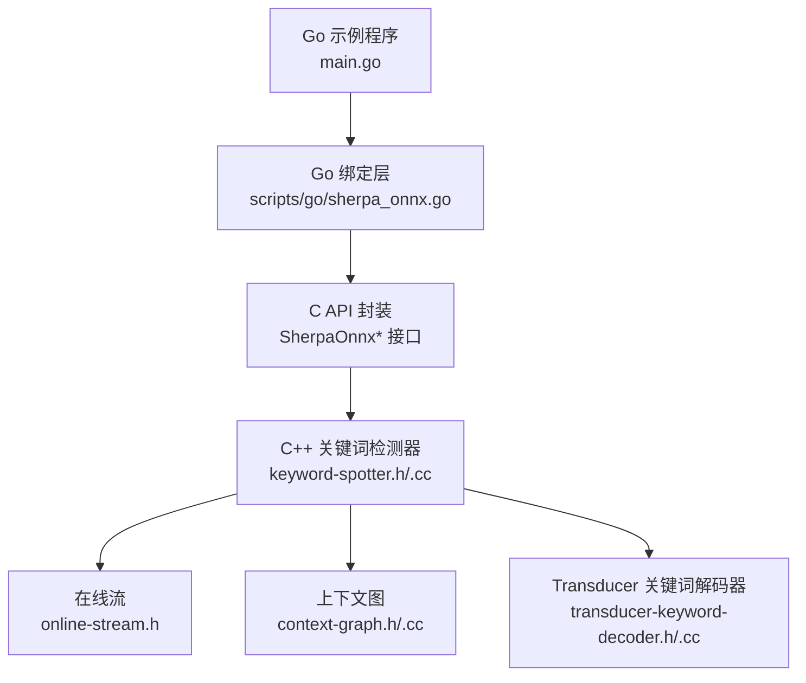
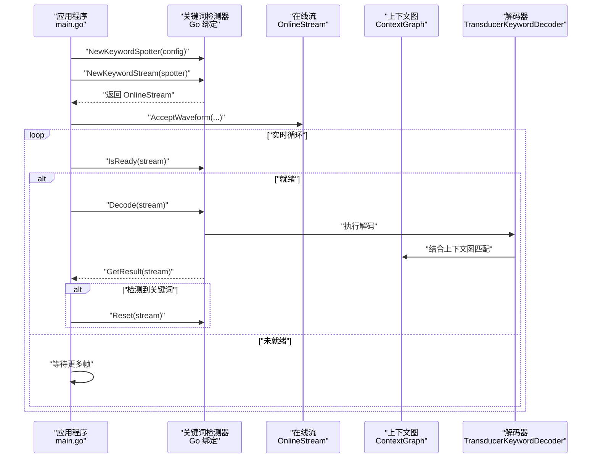
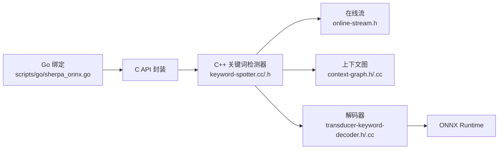

# 关键词检测示例

<cite>
**本文引用的文件**
- [go-api-examples/keyword-spotting-from-file/main.go](file://go-api-examples/keyword-spotting-from-file/main.go)
- [go-api-examples/keyword-spotting-from-file/go.mod](file://go-api-examples/keyword-spotting-from-file/go.mod)
- [scripts/go/sherpa_onnx.go](file://scripts/go/sherpa_onnx.go)
- [sherpa-onnx/csrc/keyword-spotter.h](file://sherpa-onnx/csrc/keyword-spotter.h)
- [sherpa-onnx/csrc/keyword-spotter.cc](file://sherpa-onnx/csrc/keyword-spotter.cc)
- [sherpa-onnx/csrc/keyword-spotter-transducer-impl.h](file://sherpa-onnx/csrc/keyword-spotter-transducer-impl.h)
- [sherpa-onnx/csrc/context-graph.h](file://sherpa-onnx/csrc/context-graph.h)
- [sherpa-onnx/csrc/context-graph.cc](file://sherpa-onnx/csrc/context-graph.cc)
- [sherpa-onnx/csrc/online-stream.h](file://sherpa-onnx/csrc/online-stream.h)
- [sherpa-onnx/csrc/transducer-keyword-decoder.h](file://sherpa-onnx/csrc/transducer-keyword-decoder.h)
- [sherpa-onnx/csrc/transducer-keyword-decoder.cc](file://sherpa-onnx/csrc/transducer-keyword-decoder.cc)
- [go-api-examples/README.md](file://go-api-examples/README.md)
</cite>

## 目录
1. [简介](#简介)
2. [项目结构](#项目结构)
3. [核心组件](#核心组件)
4. [架构总览](#架构总览)
5. [详细组件分析](#详细组件分析)
6. [依赖关系分析](#依赖关系分析)
7. [性能与实时性考虑](#性能与实时性考虑)
8. [故障排查指南](#故障排查指南)
9. [结论](#结论)
10. [附录：配置与使用要点](#附录配置与使用要点)

## 简介
本文件围绕 sherpa-onnx 的 Go API 关键词检测（Keyword Spotting）示例进行系统化说明，目标是帮助读者理解关键词检测的技术原理与工程实践，包括：
- 声学模型匹配与解码流程
- 语言模型/上下文图约束
- 实时检测算法与流式处理
- 如何配置关键词列表、灵敏度阈值与上下文参数
- 从音频文件中检测预定义关键词的完整流程
- 误报率优化与自定义词汇表的实现方法

示例以 Go 语言为主，同时映射到 C++ 核心实现，便于跨语言理解与迁移。

## 项目结构
与关键词检测相关的 Go 示例位于 go-api-examples/keyword-spotting-from-file，其核心调用链如下：
- 应用入口：读取音频并初始化关键词检测器
- 关键词检测器：封装 C++ 关键词检测实现
- 在线流：承载特征帧与解码状态，支持增量解码
- 上下文图：对关键词进行建模，提供匹配与触发判断
- 解码器：基于 Transducer 模型的关键词专用解码器

图表来源
- [go-api-examples/keyword-spotting-from-file/main.go](file://go-api-examples/keyword-spotting-from-file/main.go#L1-L82)
- [scripts/go/sherpa_onnx.go](file://scripts/go/sherpa_onnx.go#L1900-L2100)
- [sherpa-onnx/csrc/keyword-spotter.h](file://sherpa-onnx/csrc/keyword-spotter.h#L53-L102)
- [sherpa-onnx/csrc/online-stream.h](file://sherpa-onnx/csrc/online-stream.h#L1-L122)
- [sherpa-onnx/csrc/context-graph.h](file://sherpa-onnx/csrc/context-graph.h#L1-L93)
- [sherpa-onnx/csrc/transducer-keyword-decoder.h](file://sherpa-onnx/csrc/transducer-keyword-decoder.h#L1-L62)

章节来源
- [go-api-examples/keyword-spotting-from-file/main.go](file://go-api-examples/keyword-spotting-from-file/main.go#L1-L82)
- [go-api-examples/README.md](file://go-api-examples/README.md#L1-L47)

## 核心组件
- 关键词检测器（Go 层）
  - 关键词检测器配置：采样率、特征维度、模型路径、关键词文件、关键词得分、阈值、缓冲区等
  - 创建与释放：NewKeywordSpotter、DeleteKeywordSpotter
  - 流管理：NewKeywordStream、NewKeywordStreamWithKeywords、IsReady、Decode、Reset、GetResult
- 在线流（OnlineStream）
  - 接受波形、输入结束标记、帧就绪查询、帧提取、状态保存与恢复
  - 关键词结果设置与获取
- 上下文图（ContextGraph）
  - 以关键词序列构建 AC 自动机，支持严格/非严格模式匹配
  - 提供单步前进一步、最终化、是否命中等接口
- Transducer 关键词解码器（TransducerKeywordDecoder）
  - 基于 encoder 输出与上下文图进行增量解码
  - 维护候选路径、空白帧计数、时间戳等

章节来源
- [scripts/go/sherpa_onnx.go](file://scripts/go/sherpa_onnx.go#L1900-L2100)
- [sherpa-onnx/csrc/keyword-spotter.h](file://sherpa-onnx/csrc/keyword-spotter.h#L53-L102)
- [sherpa-onnx/csrc/online-stream.h](file://sherpa-onnx/csrc/online-stream.h#L1-L122)
- [sherpa-onnx/csrc/context-graph.h](file://sherpa-onnx/csrc/context-graph.h#L1-L93)
- [sherpa-onnx/csrc/transducer-keyword-decoder.h](file://sherpa-onnx/csrc/transducer-keyword-decoder.h#L1-L62)

## 架构总览
关键词检测的整体流程如下：
- 初始化：加载模型与关键词配置，构建关键词检测器
- 数据准备：读取音频，构造在线流并喂入波形
- 实时解码：循环检查 IsReady，满足条件后 Decode，获取结果
- 结果处理：若检测到关键词，必须 Reset 流以继续后续检测
- 可选：在运行时动态添加关键词（通过 NewKeywordStreamWithKeywords）

图表来源
- [go-api-examples/keyword-spotting-from-file/main.go](file://go-api-examples/keyword-spotting-from-file/main.go#L35-L81)
- [scripts/go/sherpa_onnx.go](file://scripts/go/sherpa_onnx.go#L2005-L2061)
- [sherpa-onnx/csrc/keyword-spotter-transducer-impl.h](file://sherpa-onnx/csrc/keyword-spotter-transducer-impl.h#L190-L210)
- [sherpa-onnx/csrc/context-graph.h](file://sherpa-onnx/csrc/context-graph.h#L63-L77)

## 详细组件分析

### Go API 关键词检测器
- 配置项
  - 特征配置：采样率、特征维度
  - 模型配置：Transducer/Paraformer/Zipformer2CTC/NemoCTC 等模型路径、tokens、provider、线程数、调试开关、建模单元、BPE 词表等
  - 关键词相关：关键词文件、关键词得分、关键词阈值、关键词缓冲区与大小
- 关键函数
  - NewKeywordSpotter：创建检测器实例
  - NewKeywordStream / NewKeywordStreamWithKeywords：创建在线流，后者允许在运行时追加关键词
  - IsReady / Decode / Reset：控制解码节奏与状态重置
  - GetResult：获取当前轮次的检测结果（包含关键词）

章节来源
- [scripts/go/sherpa_onnx.go](file://scripts/go/sherpa_onnx.go#L1900-L2100)
- [go-api-examples/keyword-spotting-from-file/main.go](file://go-api-examples/keyword-spotting-from-file/main.go#L11-L81)

### 在线流（OnlineStream）
- 能力
  - 接收波形、标记输入结束、查询帧就绪数量、按索引提取帧
  - 保存/恢复解码状态、保存/获取关键词结果
  - 获取上下文图指针，用于与关键词检测器协同工作
- 与关键词检测的关系
  - 在解码过程中，流会累积已处理帧数、空白帧数等，影响是否触发 Reset

章节来源
- [sherpa-onnx/csrc/online-stream.h](file://sherpa-onnx/csrc/online-stream.h#L1-L122)

### 上下文图（ContextGraph）
- 技术要点
  - 将关键词序列构造成 AC 自动机，节点包含 token、token_score、node_score、output_score、是否结尾、对应短语、失败转移与输出转移
  - 支持严格与非严格模式匹配；严格模式要求完整匹配，非严格模式可利用输出弧快速命中
  - 提供单步前进一步、最终化、是否命中等接口
- 与关键词检测的关系
  - 关键词检测器在初始化时根据关键词文件或缓冲区构建 ContextGraph，并在解码时结合该图进行匹配与触发判断

章节来源
- [sherpa-onnx/csrc/context-graph.h](file://sherpa-onnx/csrc/context-graph.h#L1-L93)
- [sherpa-onnx/csrc/context-graph.cc](file://sherpa-onnx/csrc/context-graph.cc#L1-L170)

### Transducer 关键词解码器（TransducerKeywordDecoder）
- 技术要点
  - 基于 encoder 输出与上下文图进行增量解码
  - 维护候选路径集合（最大活跃路径数）、空白帧计数、时间戳等
  - 返回包含触发关键词、解码 token、帧偏移、空白帧计数等结果
- 与在线流的关系
  - 解码器将结果写入在线流，供上层读取；Reset 时会重新初始化流状态

章节来源
- [sherpa-onnx/csrc/transducer-keyword-decoder.h](file://sherpa-onnx/csrc/transducer-keyword-decoder.h#L1-L62)
- [sherpa-onnx/csrc/transducer-keyword-decoder.cc](file://sherpa-onnx/csrc/transducer-keyword-decoder.cc#L1-L44)

### 关键词检测器配置与注册
- 关键词检测器配置项
  - 最大活跃路径、尾随空白帧数、关键词得分、关键词阈值、关键词文件、关键词缓冲区
- 注册与验证
  - 提供命令行参数注册与字符串化输出，便于调试与日志记录
- 默认值与建议
  - 默认最大活跃路径、尾随空白帧数、关键词得分、关键词阈值等均有默认值，可在不同场景下调优

章节来源
- [sherpa-onnx/csrc/keyword-spotter.h](file://sherpa-onnx/csrc/keyword-spotter.h#L53-L102)
- [sherpa-onnx/csrc/keyword-spotter.cc](file://sherpa-onnx/csrc/keyword-spotter.cc#L81-L99)

### 关键词检测实现细节（Transducer）
- 关键词编码与合并
  - 支持从文件或缓冲区加载关键词，支持为新增关键词指定独立得分与阈值
  - 合并默认关键词与新增关键词，形成统一的上下文图
- 解码与触发
  - 解码器在每批次上执行解码，结合上下文图判断是否命中关键词
  - 触发后根据尾随空白帧数决定是否自动 Reset

章节来源
- [sherpa-onnx/csrc/keyword-spotter-transducer-impl.h](file://sherpa-onnx/csrc/keyword-spotter-transducer-impl.h#L112-L178)
- [sherpa-onnx/csrc/keyword-spotter-transducer-impl.h](file://sherpa-onnx/csrc/keyword-spotter-transducer-impl.h#L180-L210)

## 依赖关系分析
- Go 层依赖 C++ 实现
  - Go 绑定层将 Go 结构体转换为 C 结构体，调用 C API 完成初始化、解码与结果获取
- C++ 实现内部依赖
  - 关键词检测器依赖在线流、上下文图与解码器
  - 解码器依赖 Transducer 模型与符号表
- 外部依赖
  - ONNX Runtime 作为推理后端
  - Kaldi 解码器（用于 CTC 流式解码，与关键词检测同属在线解码体系）

图表来源
- [scripts/go/sherpa_onnx.go](file://scripts/go/sherpa_onnx.go#L1900-L2100)
- [sherpa-onnx/csrc/keyword-spotter.cc](file://sherpa-onnx/csrc/keyword-spotter.cc#L128-L172)
- [sherpa-onnx/csrc/online-stream.h](file://sherpa-onnx/csrc/online-stream.h#L1-L122)
- [sherpa-onnx/csrc/context-graph.h](file://sherpa-onnx/csrc/context-graph.h#L1-L93)
- [sherpa-onnx/csrc/transducer-keyword-decoder.h](file://sherpa-onnx/csrc/transducer-keyword-decoder.h#L1-L62)

## 性能与实时性考虑
- 解码节奏控制
  - 使用 IsReady 判断是否具备足够帧进行解码，避免过早解码导致不稳定
- 批量解码
  - 解码器支持批量在线流解码，提高吞吐
- 状态重置策略
  - 检测到关键词后必须 Reset，在 Reset 之前应确保不再需要历史结果
- 尾随空白帧
  - 通过尾随空白帧数与阈值控制 Reset 时机，避免误触发或漏检

章节来源
- [scripts/go/sherpa_onnx.go](file://scripts/go/sherpa_onnx.go#L2025-L2061)
- [sherpa-onnx/csrc/keyword-spotter-transducer-impl.h](file://sherpa-onnx/csrc/keyword-spotter-transducer-impl.h#L190-L210)

## 故障排查指南
- 常见问题
  - 未调用 Reset 导致重复触发或无法继续检测
  - 关键词阈值设置不当导致误报或漏报
  - 新增关键词格式不正确（分隔符、别名标记等）
  - 模型路径或 tokens 文件错误
- 排查步骤
  - 检查 IsReady 循环是否正确执行 Decode
  - 在检测到关键词后立即调用 Reset
  - 调整关键词阈值与得分，观察误报率与召回率变化
  - 校验关键词文件与新增关键词的格式
  - 确认模型配置与音频采样率一致

章节来源
- [go-api-examples/keyword-spotting-from-file/main.go](file://go-api-examples/keyword-spotting-from-file/main.go#L35-L81)
- [scripts/go/sherpa_onnx.go](file://scripts/go/sherpa_onnx.go#L2025-L2061)

## 结论
关键词检测在 sherpa-onnx 中通过“在线流 + 上下文图 + Transducer 解码器”的组合实现，具备良好的实时性与可扩展性。Go API 对 C++ 核心进行了清晰封装，使得开发者可以快速集成关键词检测能力。通过合理配置关键词阈值、得分与尾随空白帧数，可以在误报率与召回率之间取得平衡，并支持在运行时动态扩展关键词集合。

## 附录：配置与使用要点
- 关键词配置项
  - 关键词文件：包含每行一个关键词，支持 BPE/CJK 字符
  - 关键词得分：提升关键词路径的相对分数
  - 关键词阈值：声学阈值，控制触发敏感度
  - 尾随空白帧数：控制触发后的静音容忍窗口
- 运行时新增关键词
  - 使用 NewKeywordStreamWithKeywords 动态注入关键词，支持多关键词以特定分隔符拼接
- 误报率优化建议
  - 提高关键词阈值或降低关键词得分，减少误触发
  - 适当增加尾随空白帧数，避免短促噪声触发
  - 仅保留高置信度关键词，避免模糊或歧义词进入关键词库
- 自定义词汇表
  - 通过关键词文件或缓冲区注入自定义词汇，必要时为不同关键词设置不同的阈值与得分

章节来源
- [sherpa-onnx/csrc/keyword-spotter.cc](file://sherpa-onnx/csrc/keyword-spotter.cc#L81-L99)
- [sherpa-onnx/csrc/keyword-spotter-transducer-impl.h](file://sherpa-onnx/csrc/keyword-spotter-transducer-impl.h#L112-L178)
- [go-api-examples/keyword-spotting-from-file/main.go](file://go-api-examples/keyword-spotting-from-file/main.go#L11-L81)