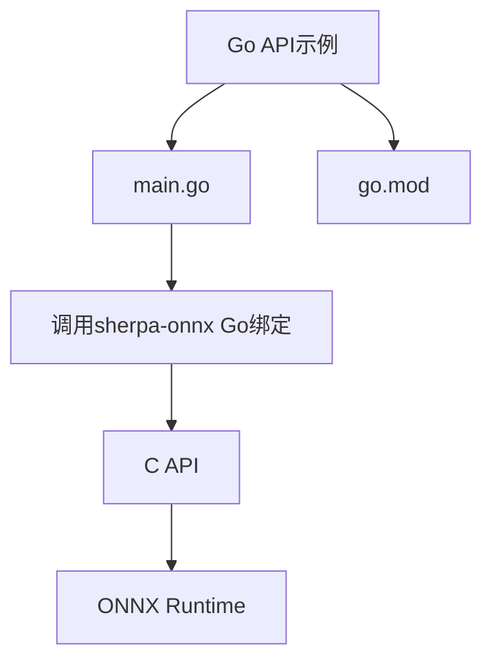
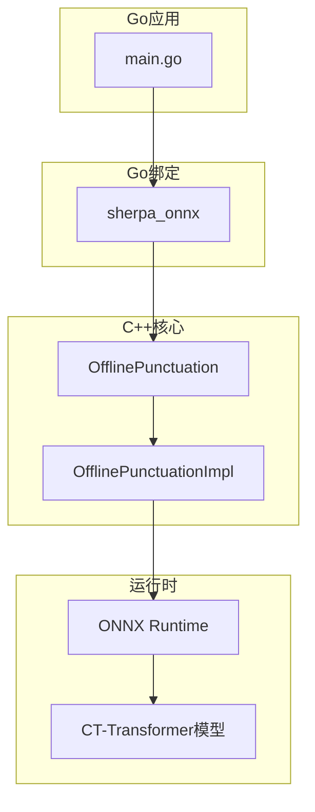
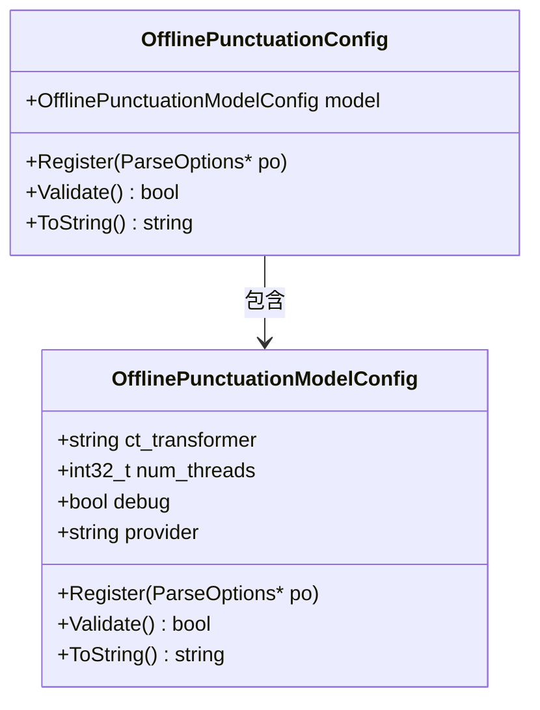
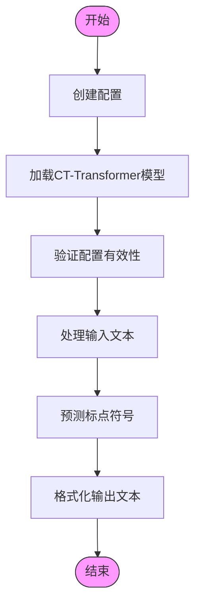
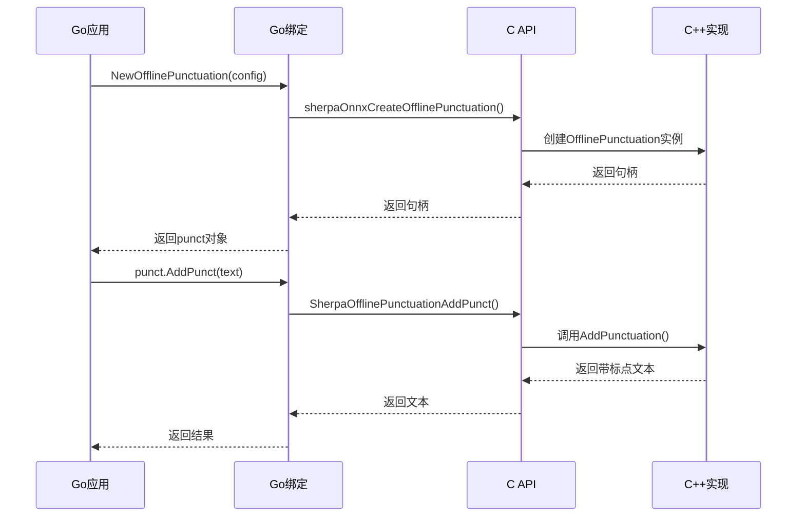
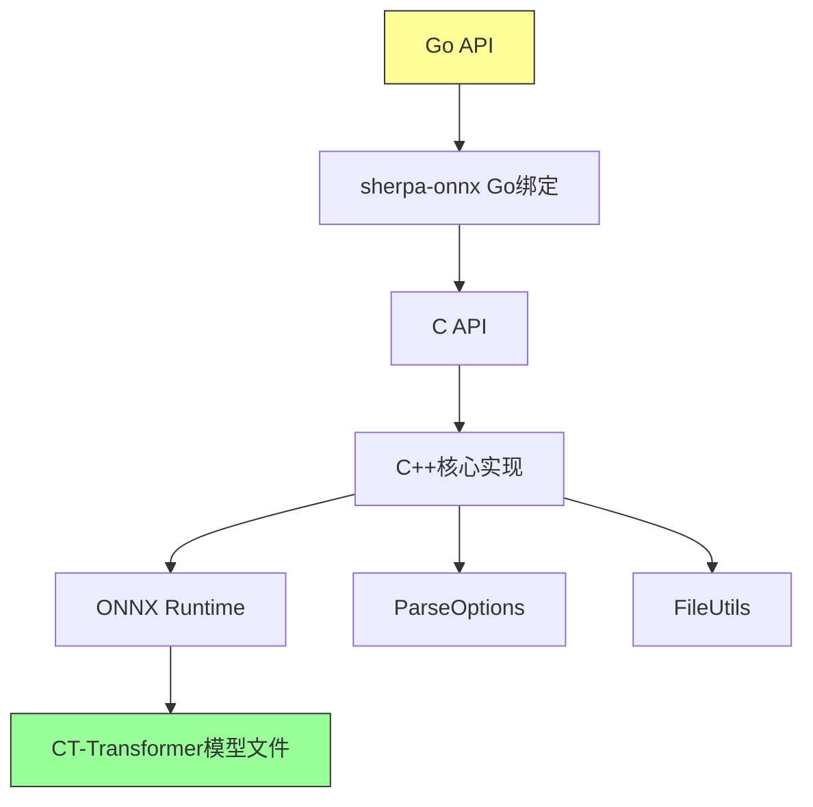

# 标点符号添加示例

<cite>
**本文档中引用的文件**  
- [main.go](file://go-api-examples/add-punctuation/main.go)
- [go.mod](file://go-api-examples/add-punctuation/go.mod)
- [offline-punctuation.h](file://sherpa-onnx/csrc/offline-punctuation.h)
- [offline-punctuation-model-config.h](file://sherpa-onnx/csrc/offline-punctuation-model-config.h)
- [offline-punctuation.cc](file://sherpa-onnx/csrc/offline-punctuation.cc)
- [offline-punctuation-model-config.cc](file://sherpa-onnx/csrc/offline-punctuation-model-config.cc)
- [punctuation.cc](file://harmony-os/SherpaOnnxHar/sherpa_onnx/src/main/cpp/punctuation.cc)
- [add-punctuation-c-api.c](file://c-api-examples/add-punctuation-c-api.c)
</cite>

## 目录
1. [简介](#简介)
2. [项目结构](#项目结构)
3. [核心组件](#核心组件)
4. [架构概述](#架构概述)
5. [详细组件分析](#详细组件分析)
6. [依赖分析](#依赖分析)
7. [性能考量](#性能考量)
8. [故障排除指南](#故障排除指南)
9. [结论](#结论)

## 简介
本文档详细介绍了sherpa-onnx项目中Go API的标点符号添加功能。该功能通过使用基于CT-Transformer的神经网络模型，为语音识别结果自动添加标点符号，从而提升文本的可读性和语义完整性。文档将系统性地解释自动标点生成的实现机制，包括语言模型推理、上下文分析和标点预测，并详细说明如何将标点添加功能集成到语音识别结果的后处理流程中。

## 项目结构
Go API示例位于`go-api-examples/add-punctuation/`目录下，包含一个简单的Go模块，用于演示如何使用sherpa-onnx的标点符号添加功能。该示例通过调用C API来实现对文本的标点预测。

**图示来源**
- [main.go](file://go-api-examples/add-punctuation/main.go#L1-L32)
- [go.mod](file://go-api-examples/add-punctuation/go.mod#L1-L4)

**章节来源**
- [main.go](file://go-api-examples/add-punctuation/main.go#L1-L32)
- [go.mod](file://go-api-examples/add-punctuation/go.mod#L1-L4)

## 核心组件
标点符号添加功能的核心组件包括配置结构体`OfflinePunctuationConfig`和处理类`OfflinePunctuation`。配置结构体用于指定模型路径、线程数和执行提供者等参数，而处理类则负责加载模型并执行标点预测。

**章节来源**
- [offline-punctuation.h](file://sherpa-onnx/csrc/offline-punctuation.h#L21-L57)
- [offline-punctuation-model-config.h](file://sherpa-onnx/csrc/offline-punctuation-model-config.h#L13-L38)

## 架构概述
标点符号添加功能的架构基于CT-Transformer模型，该模型能够理解文本的上下文语义并预测适当的标点符号。系统通过Go API调用底层C++实现，利用ONNX Runtime执行模型推理。

**图示来源**
- [offline-punctuation.h](file://sherpa-onnx/csrc/offline-punctuation.h#L37-L57)
- [offline-punctuation-impl.h](file://sherpa-onnx/csrc/offline-punctuation-impl.h#L19-L36)

## 详细组件分析

### 配置组件分析
标点符号添加功能的配置通过`OfflinePunctuationConfig`结构体实现，该结构体包含模型配置和运行时参数。

**图示来源**
- [offline-punctuation.h](file://sherpa-onnx/csrc/offline-punctuation.h#L21-L33)
- [offline-punctuation-model-config.h](file://sherpa-onnx/csrc/offline-punctuation-model-config.h#L13-L38)

### 处理流程分析
标点符号添加的处理流程从文本输入开始，经过模型推理，最终输出带标点的文本。

**图示来源**
- [offline-punctuation.cc](file://sherpa-onnx/csrc/offline-punctuation.cc#L40-L55)
- [offline-punctuation-model-config.cc](file://sherpa-onnx/csrc/offline-punctuation-model-config.cc#L28-L41)

### API调用流程分析
Go API的调用流程展示了从Go代码到C++实现的完整调用链。

**图示来源**
- [main.go](file://go-api-examples/add-punctuation/main.go#L16-L26)
- [punctuation.cc](file://harmony-os/SherpaOnnxHar/sherpa_onnx/src/main/cpp/punctuation.cc#L65-L82)
- [add-punctuation-c-api.c](file://c-api-examples/add-punctuation-c-api.c#L55-L60)

**章节来源**
- [main.go](file://go-api-examples/add-punctuation/main.go#L1-L32)
- [punctuation.cc](file://harmony-os/SherpaOnnxHar/sherpa_onnx/src/main/cpp/punctuation.cc#L47-L83)
- [add-punctuation-c-api.c](file://c-api-examples/add-punctuation-c-api.c#L43-L67)

## 依赖分析
标点符号添加功能依赖于多个核心组件和外部库，形成了一个完整的依赖链。

**图示来源**
- [go.mod](file://go-api-examples/add-punctuation/go.mod#L1-L4)
- [offline-punctuation.h](file://sherpa-onnx/csrc/offline-punctuation.h#L16-L18)
- [offline-punctuation-model-config.cc](file://sherpa-onnx/csrc/offline-punctuation-model-config.cc#L9-L10)

**章节来源**
- [go.mod](file://go-api-examples/add-punctuation/go.mod#L1-L4)
- [offline-punctuation.h](file://sherpa-onnx/csrc/offline-punctuation.h#L1-L58)
- [offline-punctuation-model-config.cc](file://sherpa-onnx/csrc/offline-punctuation-model-config.cc#L1-L56)

## 性能考量
标点符号添加功能的性能主要受以下因素影响：
- **模型大小**：CT-Transformer模型的大小直接影响加载时间和内存占用
- **线程数**：通过`num_threads`配置参数可以调整并行计算的线程数
- **执行提供者**：支持CPU、CUDA和CoreML等多种执行提供者，可根据硬件环境选择最优方案
- **文本长度**：长文本需要更多的推理时间，建议对长文本进行分段处理

在实际应用中，建议根据部署环境选择合适的模型和配置参数，以平衡性能和准确性。

## 故障排除指南
在使用标点符号添加功能时，可能会遇到以下常见问题：

1. **模型文件不存在**：确保`ct_transformer`配置的模型路径正确，且文件存在
2. **内存不足**：对于大型模型，确保系统有足够的内存资源
3. **性能低下**：检查是否选择了合适的执行提供者，并调整线程数配置
4. **标点预测不准确**：确保输入文本的语言与模型训练语言匹配

**章节来源**
- [offline-punctuation-model-config.cc](file://sherpa-onnx/csrc/offline-punctuation-model-config.cc#L29-L38)
- [main.go](file://go-api-examples/add-punctuation/main.go#L12-L14)

## 结论
sherpa-onnx的标点符号添加功能为语音识别结果的后处理提供了强大的支持。通过Go API，开发者可以轻松地将这一功能集成到自己的应用中，提升文本的可读性和用户体验。该功能在会议记录、字幕生成等场景中具有广泛的应用价值。通过合理配置和优化，可以在保证准确性的同时获得良好的性能表现。