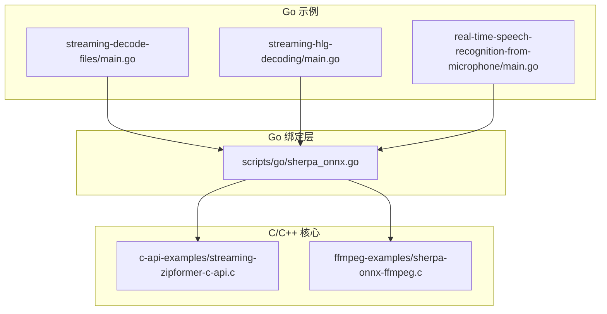
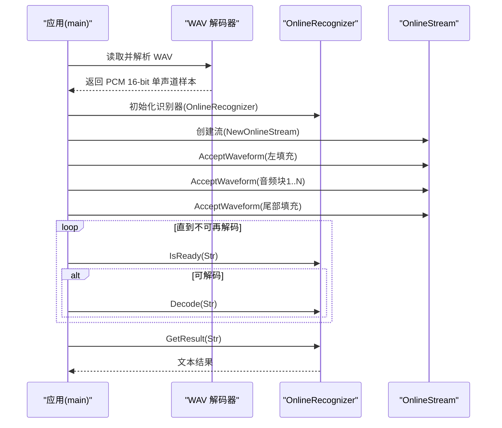
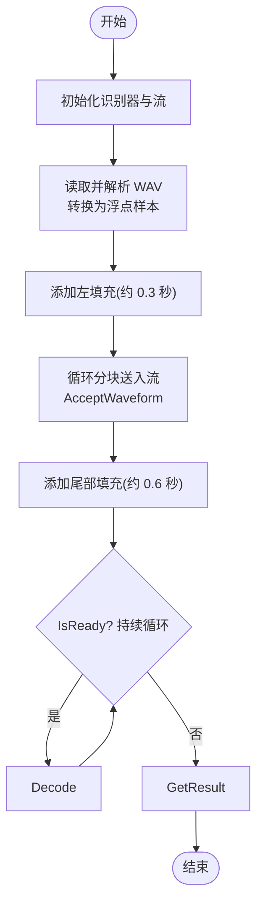
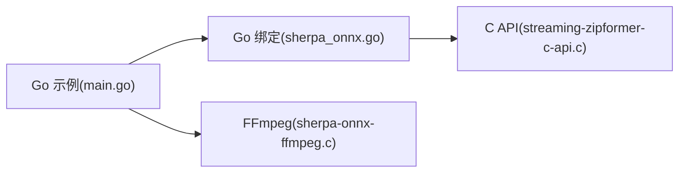

# 文件流式处理

<cite>
**本文引用的文件**
- [go-api-examples/streaming-decode-files/main.go](file://go-api-examples/streaming-decode-files/main.go)
- [go-api-examples/streaming-hlg-decoding/main.go](file://go-api-examples/streaming-hlg-decoding/main.go)
- [go-api-examples/real-time-speech-recognition-from-microphone/main.go](file://go-api-examples/real-time-speech-recognition-from-microphone/main.go)
- [scripts/go/sherpa_onnx.go](file://scripts/go/sherpa_onnx.go)
- [go-api-examples/non-streaming-decode-files/main.go](file://go-api-examples/non-streaming-decode-files/main.go)
- [c-api-examples/streaming-zipformer-c-api.c](file://c-api-examples/streaming-zipformer-c-api.c)
- [ffmpeg-examples/sherpa-onnx-ffmpeg.c](file://ffmpeg-examples/sherpa-onnx-ffmpeg.c)
- [go-api-examples/README.md](file://go-api-examples/README.md)
</cite>

## 目录
1. [简介](#简介)
2. [项目结构](#项目结构)
3. [核心组件](#核心组件)
4. [架构总览](#架构总览)
5. [详细组件分析](#详细组件分析)
6. [依赖关系分析](#依赖关系分析)
7. [性能考量](#性能考量)
8. [故障排查指南](#故障排查指南)
9. [结论](#结论)
10. [附录](#附录)

## 简介
本文件面向使用 sherpa-onnx Go API 进行“文件流式处理”的开发者，系统讲解如何从音频文件中分块读取数据并进行流式语音识别，涵盖：
- 音频解码与格式转换（WAV PCM 16-bit 单声道）
- 缓冲区管理与分块策略
- 流状态维护（准备就绪、端点检测、重置）
- 中间结果输出与最终合并
- 错误处理机制与性能优化策略
- 处理不同音频格式与采样率的实践建议

## 项目结构
围绕 Go API 的文件流式处理示例主要位于 go-api-examples 目录，其中 streaming-decode-files 展示了基于 WAV 文件的流式识别流程；streaming-hlg-decoding 展示了带 HLG 解码的流式模型；real-time-speech-recognition-from-microphone 展示了实时麦克风流式识别，可作为分块策略与端点检测的参考。

图表来源
- [go-api-examples/streaming-decode-files/main.go](file://go-api-examples/streaming-decode-files/main.go#L1-L133)
- [go-api-examples/streaming-hlg-decoding/main.go](file://go-api-examples/streaming-hlg-decoding/main.go#L1-L110)
- [go-api-examples/real-time-speech-recognition-from-microphone/main.go](file://go-api-examples/real-time-speech-recognition-from-microphone/main.go#L1-L126)
- [scripts/go/sherpa_onnx.go](file://scripts/go/sherpa_onnx.go#L285-L383)
- [c-api-examples/streaming-zipformer-c-api.c](file://c-api-examples/streaming-zipformer-c-api.c#L81-L123)
- [ffmpeg-examples/sherpa-onnx-ffmpeg.c](file://ffmpeg-examples/sherpa-onnx-ffmpeg.c#L85-L117)

章节来源
- [go-api-examples/README.md](file://go-api-examples/README.md#L1-L47)

## 核心组件
- 在线识别器（OnlineRecognizer）：封装 C 层在线识别器，负责初始化模型配置、判断是否可解码、执行解码、获取结果、端点检测与重置。
- 在线流（OnlineStream）：封装 C 层在线流，负责接收音频样本、标记输入结束、查询准备状态。
- WAV 解码与格式转换：将 WAV PCM 16-bit 单声道音频转换为 [-1, 1] 范围的浮点数组，供识别器使用。
- 分块策略：通过多次调用 AcceptWaveform 将音频按块送入流，结合尾部填充确保模型充分处理。
- 端点检测与重置：在合适时机检测端点并重置流，以便输出段落化结果。

章节来源
- [scripts/go/sherpa_onnx.go](file://scripts/go/sherpa_onnx.go#L285-L383)
- [go-api-examples/streaming-decode-files/main.go](file://go-api-examples/streaming-decode-files/main.go#L51-L77)
- [go-api-examples/streaming-hlg-decoding/main.go](file://go-api-examples/streaming-hlg-decoding/main.go#L31-L54)

## 架构总览
下图展示了从 WAV 文件到流式识别的整体流程，包括音频解码、分块、识别器状态推进与结果输出。

图表来源
- [go-api-examples/streaming-decode-files/main.go](file://go-api-examples/streaming-decode-files/main.go#L51-L77)
- [scripts/go/sherpa_onnx.go](file://scripts/go/sherpa_onnx.go#L285-L383)

## 详细组件分析

### 组件A：文件流式识别主流程（WAV → 流式识别）
- 初始化识别器与流
- 读取 WAV 并转换为浮点样本
- 左侧填充、主体音频分块、右侧填充
- 循环等待准备就绪并解码，最后获取结果

图表来源
- [go-api-examples/streaming-decode-files/main.go](file://go-api-examples/streaming-decode-files/main.go#L51-L77)
- [scripts/go/sherpa_onnx.go](file://scripts/go/sherpa_onnx.go#L319-L361)

章节来源
- [go-api-examples/streaming-decode-files/main.go](file://go-api-examples/streaming-decode-files/main.go#L51-L77)

### 组件B：HLD 流式识别（带 FST 图）
- 使用 HLG 解码配置，其余流程与常规流式一致
- 适合需要 FST 前处理的语言建模场景

章节来源
- [go-api-examples/streaming-hlg-decoding/main.go](file://go-api-examples/streaming-hlg-decoding/main.go#L16-L54)

### 组件C：实时麦克风流式识别（参考分块策略）
- 以固定帧大小回调方式持续送入音频
- 每次回调内循环解码直到不可再解码
- 端点检测后重置流，输出段落化文本

章节来源
- [go-api-examples/real-time-speech-recognition-from-microphone/main.go](file://go-api-examples/real-time-speech-recognition-from-microphone/main.go#L66-L92)

### 组件D：Go API 绑定层（关键方法）
- NewOnlineRecognizer / DeleteOnlineRecognizer：创建与释放识别器
- NewOnlineStream / DeleteOnlineStream：创建与释放流
- OnlineStream.AcceptWaveform / InputFinished：送入音频与标记结束
- OnlineRecognizer.IsReady / Decode / GetResult / IsEndpoint / Reset：状态控制与结果获取

章节来源
- [scripts/go/sherpa_onnx.go](file://scripts/go/sherpa_onnx.go#L285-L383)

### 组件E：C API 分块示例（对比参考）
- 以固定块大小 N 循环送入音频，每次送入后尝试解码并输出中间结果
- 末尾追加尾部填充，确保模型处理完剩余状态

章节来源
- [c-api-examples/streaming-zipformer-c-api.c](file://c-api-examples/streaming-zipformer-c-api.c#L81-L123)

### 组件F：FFmpeg 音频解码（多格式支持）
- 使用 FFmpeg 打开任意音频源，设置滤镜链将采样率统一到目标采样率
- 生成 PCM S16 数据，便于后续转换为浮点数组

章节来源
- [ffmpeg-examples/sherpa-onnx-ffmpeg.c](file://ffmpeg-examples/sherpa-onnx-ffmpeg.c#L85-L117)

## 依赖关系分析
- Go 示例依赖 Go 绑定层（scripts/go/sherpa_onnx.go），后者封装 C API。
- C API 示例与 FFmpeg 示例展示了底层实现与多格式解码路径。
- 实时示例提供了分块策略与端点检测的实践参考。

图表来源
- [go-api-examples/streaming-decode-files/main.go](file://go-api-examples/streaming-decode-files/main.go#L1-L133)
- [scripts/go/sherpa_onnx.go](file://scripts/go/sherpa_onnx.go#L285-L383)
- [c-api-examples/streaming-zipformer-c-api.c](file://c-api-examples/streaming-zipformer-c-api.c#L81-L123)
- [ffmpeg-examples/sherpa-onnx-ffmpeg.c](file://ffmpeg-examples/sherpa-onnx-ffmpeg.c#L85-L117)

## 性能考量
- 分块大小与延迟权衡：较大的块可减少解码次数但增加延迟；较小的块可降低延迟但增加解码开销。可参考 C API 示例中的固定块大小策略。
- 线程数与 Provider：合理设置 NumThreads 与 Provider（如 cpu/cuda/coreml）以平衡吞吐与延迟。
- 输入完成标记：在音频末尾调用 InputFinished 或添加尾部填充，确保模型处理完剩余状态。
- 端点检测：启用端点检测可在合适时机重置流，避免不必要的解码轮次。
- 内存管理：及时释放识别器与流，避免内存泄漏。

[本节为通用性能建议，不直接分析具体文件]

## 故障排查指南
- WAV 格式限制：当前示例仅支持 PCM 16-bit 单声道。若非该格式，需先转换或改用 FFmpeg 示例。
- 采样率不匹配：Go 绑定层内部会做重采样，但建议尽量使用模型期望的采样率（常见为 16kHz）以减少误差。
- 解码循环未退出：检查 IsReady 是否返回 false，或是否存在未标记 InputFinished 导致无法触发最终输出。
- 端点检测无效：确认 EnableEndpoint 与相关阈值参数已正确配置。
- 结果为空：确认已添加足够的左右填充，且循环中确实执行了 Decode。

章节来源
- [go-api-examples/streaming-decode-files/main.go](file://go-api-examples/streaming-decode-files/main.go#L89-L113)
- [scripts/go/sherpa_onnx.go](file://scripts/go/sherpa_onnx.go#L319-L361)

## 结论
通过 Go API 的在线识别器与在线流，可以高效地对 WAV 文件进行分块流式识别。关键在于：
- 正确的 WAV 解码与格式转换
- 合理的分块策略与左右填充
- 利用 IsReady/Decode/GetResult/IsEndpoint/Reset 等接口维护流状态
- 结合 FFmpeg 支持更多音频格式与采样率
- 在性能与延迟之间选择合适的参数

[本节为总结性内容，不直接分析具体文件]

## 附录

### 实践建议：处理不同音频格式与采样率
- 若 WAV 不满足要求，使用 FFmpeg 示例将音频解码为 PCM S16，再按 16kHz 重采样，最后转换为浮点数组。
- 对于非 WAV 格式，可参考 FFmpeg 示例的解码与滤镜链配置，统一输出到 Go 侧。

章节来源
- [ffmpeg-examples/sherpa-onnx-ffmpeg.c](file://ffmpeg-examples/sherpa-onnx-ffmpeg.c#L85-L117)
- [go-api-examples/non-streaming-decode-files/main.go](file://go-api-examples/non-streaming-decode-files/main.go#L139-L162)