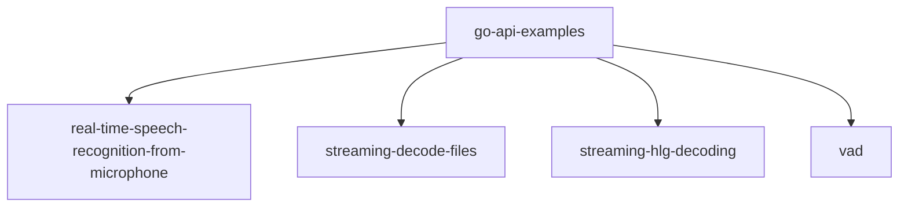
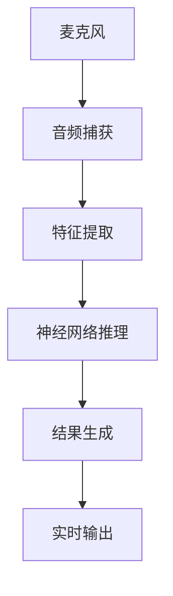
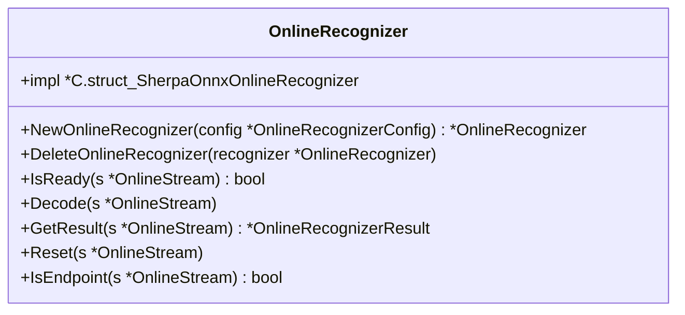
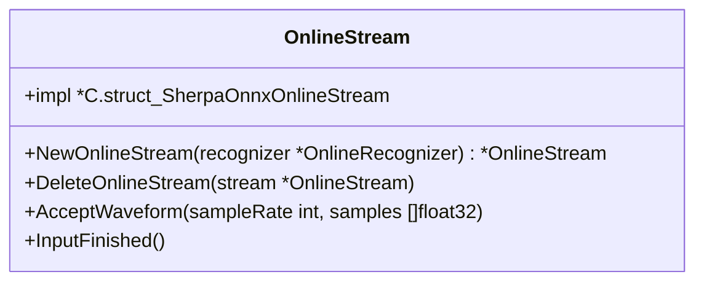
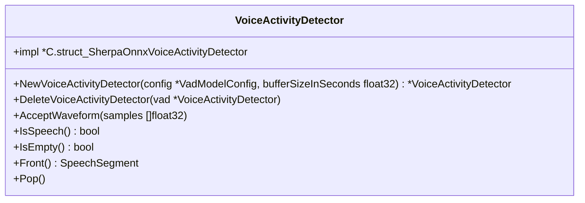
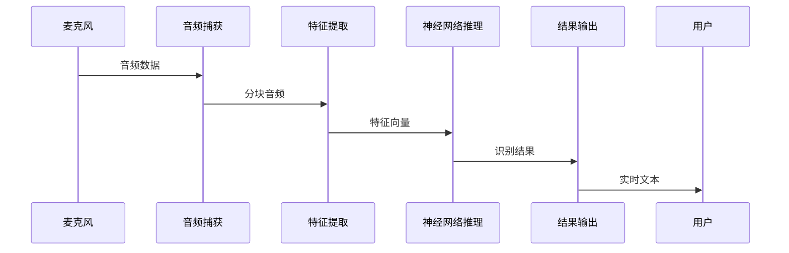
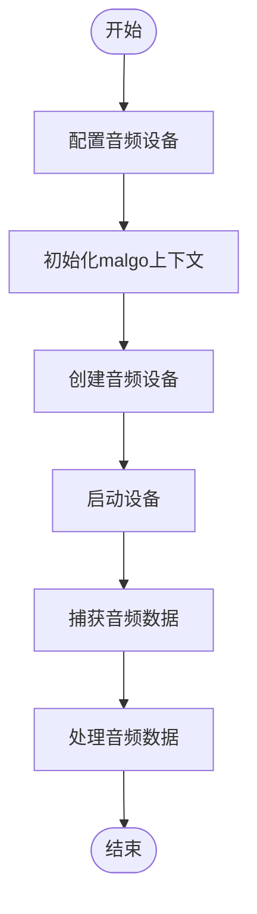

# 流式处理示例

<cite>
**本文档中引用的文件**   
- [main.go](file://go-api-examples/real-time-speech-recognition-from-microphone/main.go)
- [sherpa_onnx.go](file://scripts/go/sherpa_onnx.go)
- [streaming-decode-files/main.go](file://go-api-examples/streaming-decode-files/main.go)
- [streaming-hlg-decoding/main.go](file://go-api-examples/streaming-hlg-decoding/main.go)
- [vad/main.go](file://go-api-examples/vad/main.go)
</cite>

## 目录
1. [引言](#引言)
2. [项目结构](#项目结构)
3. [核心组件](#核心组件)
4. [流式语音识别架构](#流式语音识别架构)
5. [详细组件分析](#详细组件分析)
6. [并发模型与goroutine应用](#并发模型与goroutine应用)
7. [低延迟优化策略](#低延迟优化策略)
8. [麦克风实时音频捕获实现](#麦克风实时音频捕获实现)
9. [结论](#结论)

## 引言

sherpa-onnx是一个开源的语音识别框架，支持流式和非流式语音识别。本文档详细解释了Go API中流式语音识别的工作原理，包括音频流的分块处理、状态管理和实时推理。文档重点分析了`real-time-speech-recognition-from-microphone`示例，展示了如何在Go中实现流式API调用，处理音频缓冲区和实时结果返回。

## 项目结构

Go API示例位于`go-api-examples`目录下，包含多个子目录，每个子目录对应不同的功能示例。流式语音识别相关的示例包括`real-time-speech-recognition-from-microphone`、`streaming-decode-files`和`streaming-hlg-decoding`。

**图源**
- [real-time-speech-recognition-from-microphone](file://go-api-examples/real-time-speech-recognition-from-microphone)
- [streaming-decode-files](file://go-api-examples/streaming-decode-files)
- [streaming-hlg-decoding](file://go-api-examples/streaming-hlg-decoding)
- [vad](file://go-api-examples/vad)

**节源**
- [main.go](file://go-api-examples/real-time-speech-recognition-from-microphone/main.go)
- [streaming-decode-files/main.go](file://go-api-examples/streaming-decode-files/main.go)

## 核心组件

流式语音识别的核心组件包括`OnlineRecognizer`、`OnlineStream`和`VoiceActivityDetector`。`OnlineRecognizer`负责管理识别器的状态和配置，`OnlineStream`处理音频流的输入和特征提取，`VoiceActivityDetector`用于检测语音活动。

**节源**
- [sherpa_onnx.go](file://scripts/go/sherpa_onnx.go#L170-L177)
- [main.go](file://go-api-examples/real-time-speech-recognition-from-microphone/main.go#L12-L38)

## 流式语音识别架构

流式语音识别架构包括音频捕获、特征提取、神经网络推理和结果生成四个主要阶段。音频数据通过`malgo`库从麦克风捕获，经过特征提取后输入到神经网络模型进行实时推理，最终生成识别结果。

**图源**
- [main.go](file://go-api-examples/real-time-speech-recognition-from-microphone/main.go#L42-L106)
- [sherpa_onnx.go](file://scripts/go/sherpa_onnx.go#L306-L308)

## 详细组件分析

### OnlineRecognizer分析

`OnlineRecognizer`是流式语音识别的核心类，负责管理识别器的状态和配置。它通过`NewOnlineRecognizer`函数创建，并通过`DeleteOnlineRecognizer`函数释放资源。

**图源**
- [sherpa_onnx.go](file://scripts/go/sherpa_onnx.go#L170-L183)

**节源**
- [sherpa_onnx.go](file://scripts/go/sherpa_onnx.go#L170-L183)

### OnlineStream分析

`OnlineStream`类负责处理音频流的输入和特征提取。它通过`AcceptWaveform`方法接收音频数据，并通过`InputFinished`方法标记输入结束。

**图源**
- [sherpa_onnx.go](file://scripts/go/sherpa_onnx.go#L175-L177)

**节源**
- [sherpa_onnx.go](file://scripts/go/sherpa_onnx.go#L293-L317)

### VoiceActivityDetector分析

`VoiceActivityDetector`用于检测语音活动，通过`AcceptWaveform`方法接收音频数据，并通过`IsSpeech`方法判断是否有语音。

**图源**
- [sherpa_onnx.go](file://scripts/go/sherpa_onnx.go#L410-L412)

**节源**
- [vad/main.go](file://go-api-examples/vad/main.go#L54-L56)

## 并发模型与goroutine应用

流式处理中的并发模型主要通过goroutine实现。音频捕获和识别推理在不同的goroutine中并行执行，确保低延迟和高吞吐量。

**图源**
- [main.go](file://go-api-examples/real-time-speech-recognition-from-microphone/main.go#L70-L92)
- [sherpa_onnx.go](file://scripts/go/sherpa_onnx.go#L359-L361)

## 低延迟优化策略

低延迟优化策略包括分块处理、状态管理和端点检测。分块处理确保音频数据能够及时输入到模型中，状态管理保持识别器的连续性，端点检测准确判断语音结束。

**节源**
- [main.go](file://go-api-examples/real-time-speech-recognition-from-microphone/main.go#L85-L91)
- [sherpa_onnx.go](file://scripts/go/sherpa_onnx.go#L340-L342)

## 麦克风实时音频捕获实现

麦克风实时音频捕获通过`malgo`库实现，配置音频设备的采样率、通道数和格式，然后启动设备开始捕获音频数据。

**图源**
- [main.go](file://go-api-examples/real-time-speech-recognition-from-microphone/main.go#L42-L106)

**节源**
- [main.go](file://go-api-examples/real-time-speech-recognition-from-microphone/main.go#L42-L106)

## 结论

sherpa-onnx的Go API提供了强大的流式语音识别功能，通过合理的架构设计和并发模型，实现了低延迟的实时语音识别。通过分析核心组件和实现细节，开发者可以更好地理解和应用这些技术。