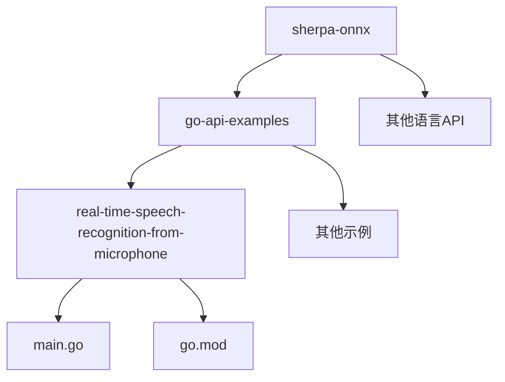
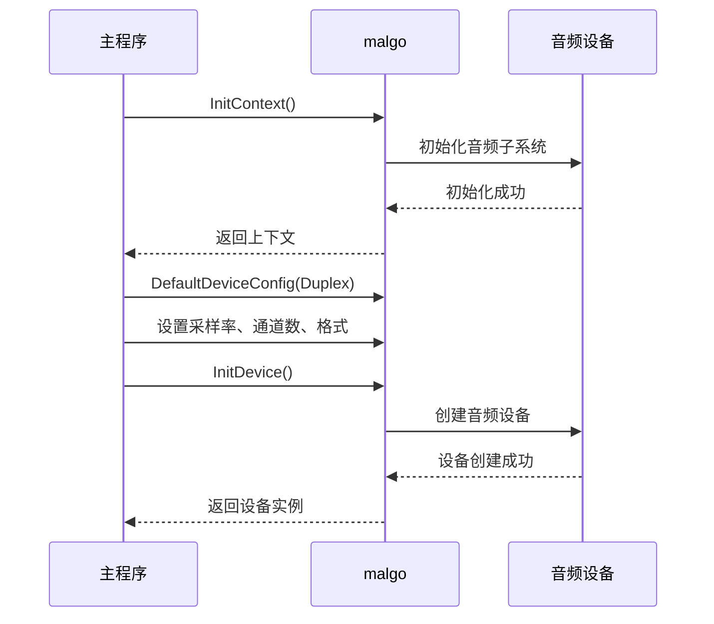
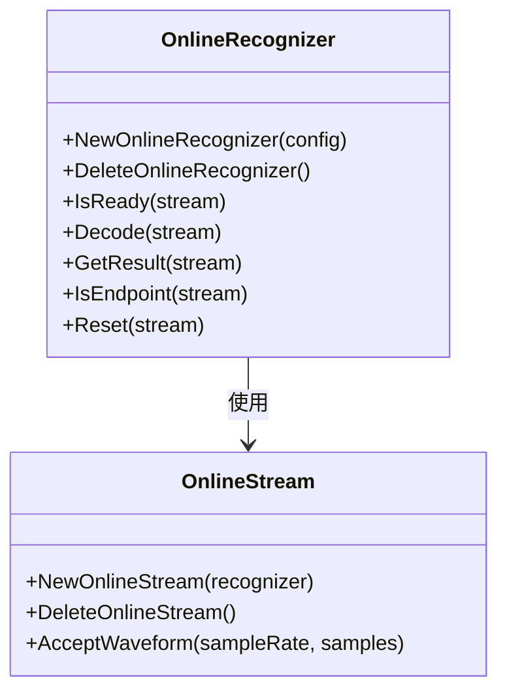
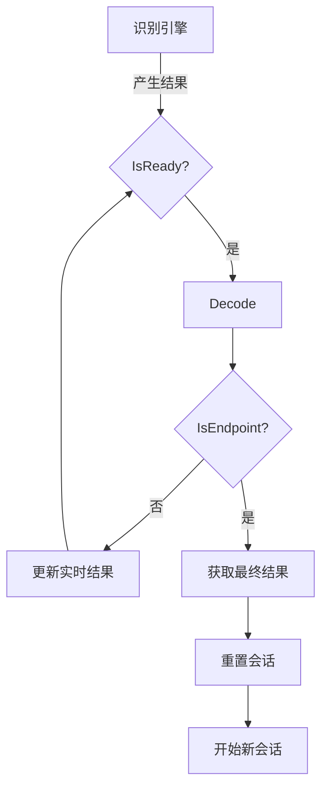
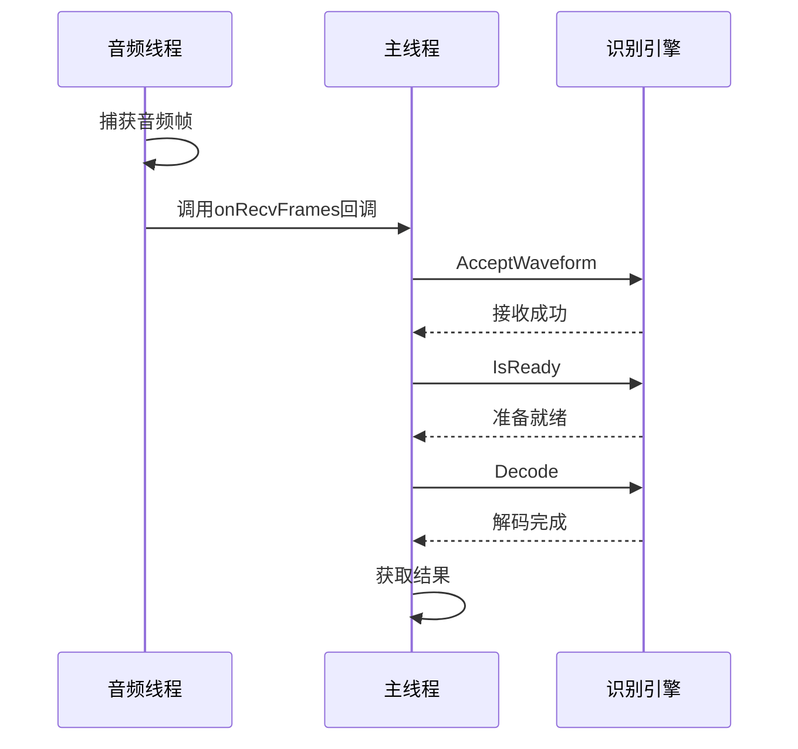
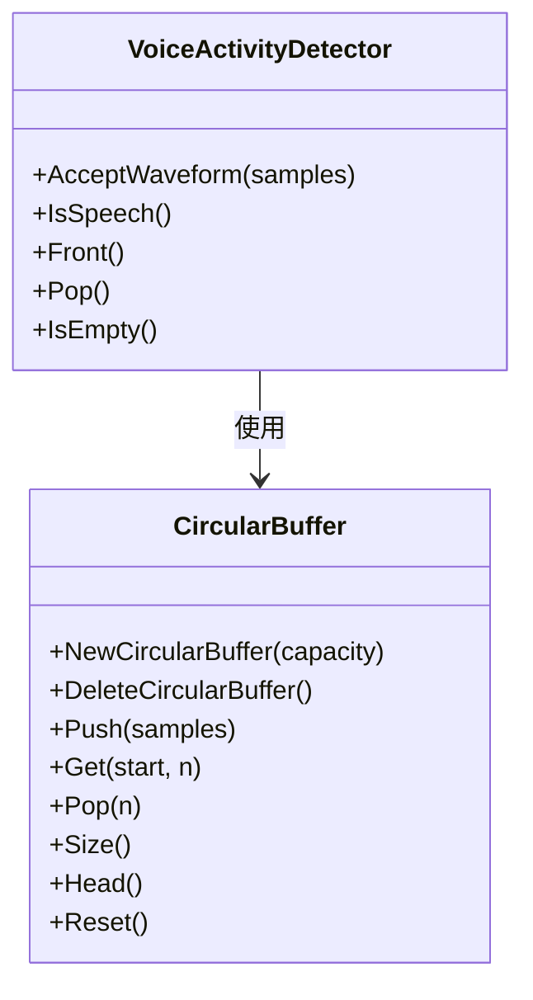
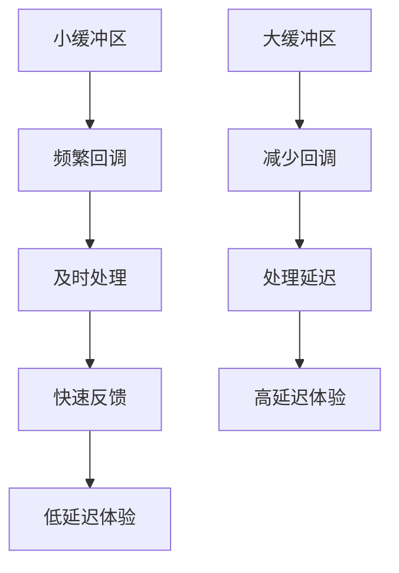
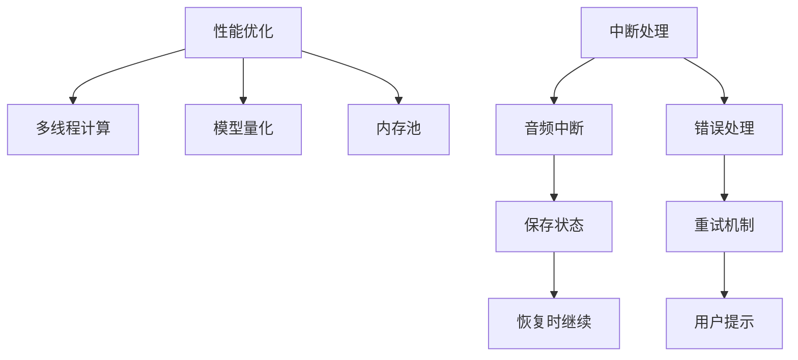

# 麦克风实时流处理

<cite>
**本文档引用的文件**   
- [main.go](file://go-api-examples/real-time-speech-recognition-from-microphone/main.go)
- [sherpa_onnx.go](file://scripts/go/sherpa_onnx.go)
- [go.mod](file://go-api-examples/real-time-speech-recognition-from-microphone/go.mod)
</cite>

## 目录
1. [简介](#简介)
2. [项目结构](#项目结构)
3. [核心组件](#核心组件)
4. [音频输入设备初始化](#音频输入设备初始化)
5. [实时音频采集与流式传输](#实时音频采集与流式传输)
6. [流式语音识别会话管理](#流式语音识别会话管理)
7. [实时识别结果处理](#实时识别结果处理)
8. [并发模型与Goroutine同步](#并发模型与goroutine同步)
9. [音频缓冲区管理](#音频缓冲区管理)
10. [低延迟交互体验优化](#低延迟交互体验优化)
11. [性能优化与中断处理策略](#性能优化与中断处理策略)
12. [结论](#结论)

## 简介
本文档详细阐述了sherpa-onnx Go API中麦克风实时流处理的实现机制。系统性地解释了如何从麦克风捕获实时音频流并进行流式语音识别，包括音频输入设备的初始化、实时音频采集、流式传输到识别引擎和实时结果返回。文档深入分析了Go代码中如何处理音频输入流、管理流式识别会话、处理实时识别结果以及实现低延迟的交互体验。同时，本文档探讨了并发模型、goroutine同步和音频缓冲区管理的最佳实践，并提供了优化实时性能和处理音频中断的策略。

## 项目结构
sherpa-onnx项目是一个功能丰富的语音识别框架，支持多种编程语言的API。Go API示例位于`go-api-examples`目录下，其中`real-time-speech-recognition-from-microphone`子目录包含了麦克风实时流处理的核心实现。



**Diagram sources**
- [main.go](file://go-api-examples/real-time-speech-recognition-from-microphone/main.go)
- [go.mod](file://go-api-examples/real-time-speech-recognition-from-microphone/go.mod)

**Section sources**
- [main.go](file://go-api-examples/real-time-speech-recognition-from-microphone/main.go)

## 核心组件
麦克风实时流处理的核心组件包括音频捕获设备、在线识别器、在线流和语音活动检测器。这些组件协同工作，实现了从音频采集到语音识别的完整流程。

**Section sources**
- [main.go](file://go-api-examples/real-time-speech-recognition-from-microphone/main.go)
- [sherpa_onnx.go](file://scripts/go/sherpa_onnx.go)

## 音频输入设备初始化
音频输入设备的初始化是实时流处理的第一步。在Go API中，使用`malgo`库来初始化音频上下文和设备配置。设备配置包括采样率、通道数和音频格式等参数。



**Diagram sources**
- [main.go](file://go-api-examples/real-time-speech-recognition-from-microphone/main.go)

**Section sources**
- [main.go](file://go-api-examples/real-time-speech-recognition-from-microphone/main.go)

## 实时音频采集与流式传输
实时音频采集通过回调函数实现，当音频设备捕获到新的音频帧时，会调用指定的回调函数。采集到的音频数据需要进行格式转换，然后流式传输到识别引擎。

```mermaid
flowchart TD
A[音频设备] --> |捕获音频帧| B[onRecvFrames回调]
B --> C[格式转换]
C --> D[AcceptWaveform]
D --> E[在线流]
E --> F[识别引擎]
subgraph 格式转换
C1[字节数据] --> C2[转换为float32]
C2 --> C3[归一化到[-1,1]]
end
```

**Diagram sources**
- [main.go](file://go-api-examples/real-time-speech-recognition-from-microphone/main.go)

**Section sources**
- [main.go](file://go-api-examples/real-time-speech-recognition-from-microphone/main.go)

## 流式语音识别会话管理
流式语音识别会话管理涉及在线识别器和在线流的创建与管理。识别器配置包括模型路径、解码方法和端点检测参数等。



**Diagram sources**
- [sherpa_onnx.go](file://scripts/go/sherpa_onnx.go)

**Section sources**
- [main.go](file://go-api-examples/real-time-speech-recognition-from-microphone/main.go)
- [sherpa_onnx.go](file://scripts/go/sherpa_onnx.go)

## 实时识别结果处理
实时识别结果处理包括获取识别结果、更新显示和处理端点事件。识别结果在端点检测到时进行重置，以便开始新的识别会话。



**Diagram sources**
- [main.go](file://go-api-examples/real-time-speech-recognition-from-microphone/main.go)

**Section sources**
- [main.go](file://go-api-examples/real-time-speech-recognition-from-microphone/main.go)

## 并发模型与Goroutine同步
并发模型采用回调驱动的方式，音频采集在单独的线程中进行，而识别处理在主线程中完成。通过共享状态和同步机制确保数据一致性。



**Diagram sources**
- [main.go](file://go-api-examples/real-time-speech-recognition-from-microphone/main.go)

**Section sources**
- [main.go](file://go-api-examples/real-time-speech-recognition-from-microphone/main.go)

## 音频缓冲区管理
音频缓冲区管理涉及音频数据的存储和处理。系统使用循环缓冲区来管理音频数据，确保高效的数据访问和处理。



**Diagram sources**
- [sherpa_onnx.go](file://scripts/go/sherpa_onnx.go)

**Section sources**
- [sherpa_onnx.go](file://scripts/go/sherpa_onnx.go)

## 低延迟交互体验优化
低延迟交互体验优化通过合理的缓冲区大小设置、高效的解码算法和及时的结果更新来实现。系统在保证识别准确率的同时，尽可能减少延迟。



**Diagram sources**
- [main.go](file://go-api-examples/real-time-speech-recognition-from-microphone/main.go)

**Section sources**
- [main.go](file://go-api-examples/real-time-speech-recognition-from-microphone/main.go)

## 性能优化与中断处理策略
性能优化包括多线程计算、模型优化和内存管理。中断处理策略涉及音频流的暂停、恢复和错误处理。



**Diagram sources**
- [sherpa_onnx.go](file://scripts/go/sherpa_onnx.go)

**Section sources**
- [sherpa_onnx.go](file://scripts/go/sherpa_onnx.go)

## 结论
sherpa-onnx Go API提供了完整的麦克风实时流处理解决方案。通过合理的架构设计和优化策略，实现了高效、低延迟的流式语音识别。系统采用回调驱动的并发模型，结合高效的音频缓冲区管理和流式识别会话管理，为用户提供流畅的交互体验。未来可以进一步优化端点检测算法和解码效率，以提升整体性能。