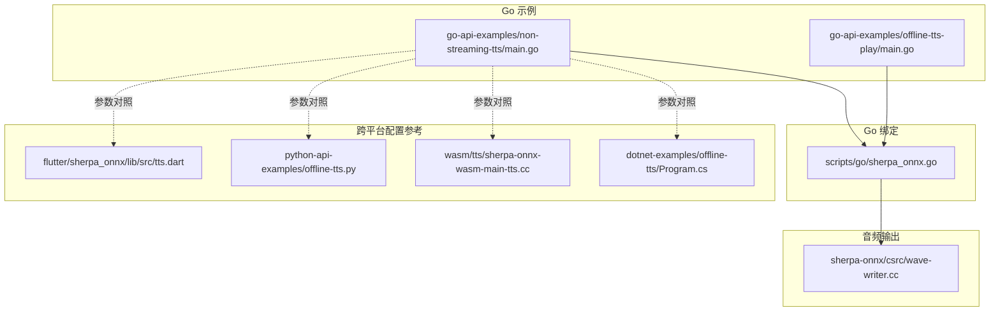
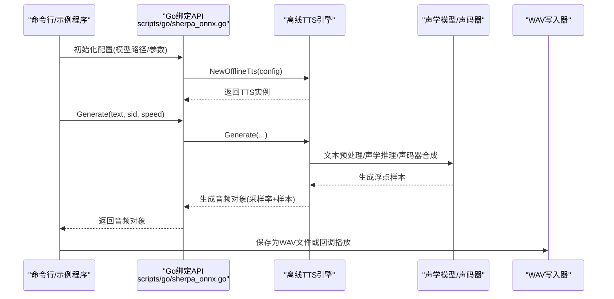
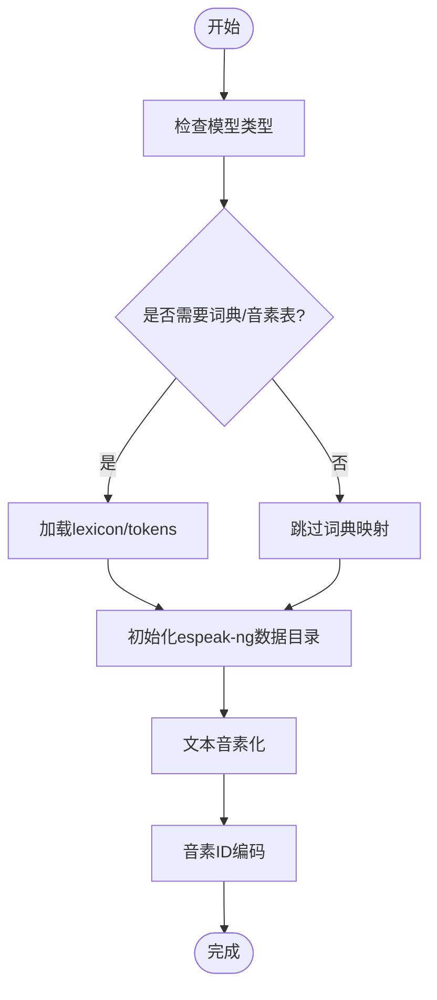
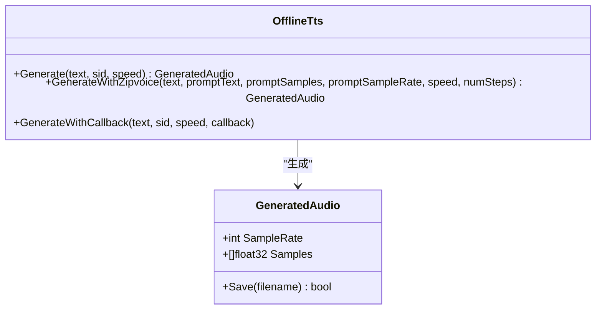
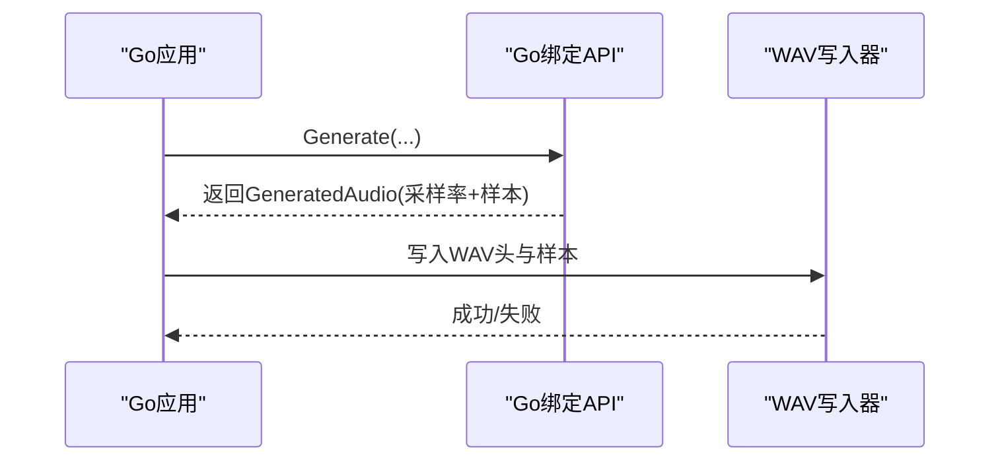
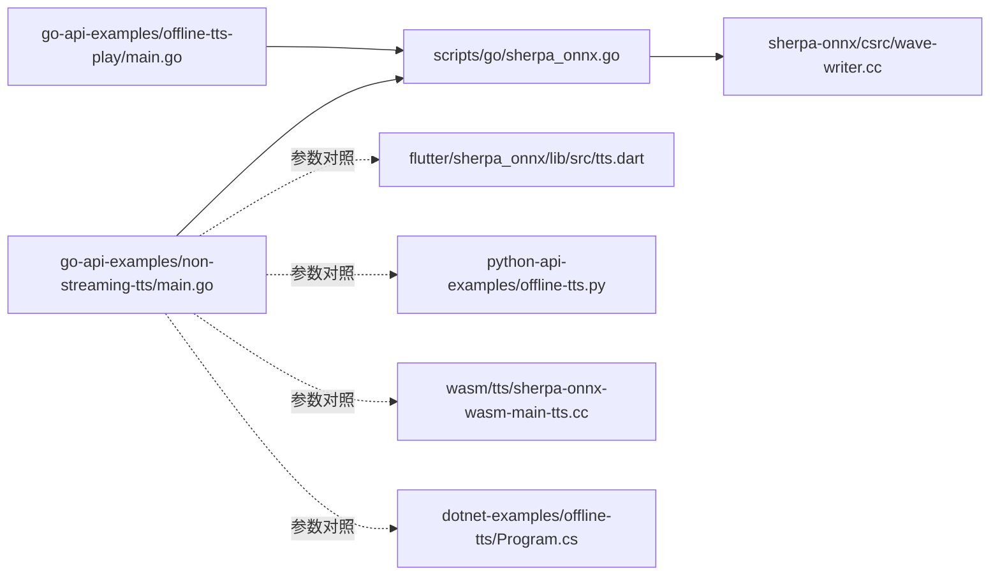

# 语音合成示例

<cite>
**本文引用的文件**
- [go-api-examples/non-streaming-tts/main.go](file://go-api-examples/non-streaming-tts/main.go)
- [go-api-examples/offline-tts-play/main.go](file://go-api-examples/offline-tts-play/main.go)
- [go-api-examples/README.md](file://go-api-examples/README.md)
- [scripts/go/sherpa_onnx.go](file://scripts/go/sherpa_onnx.go)
- [sherpa-onnx/csrc/wave-writer.cc](file://sherpa-onnx/csrc/wave-writer.cc)
- [flutter/sherpa_onnx/lib/src/tts.dart](file://flutter/sherpa_onnx/lib/src/tts.dart)
- [python-api-examples/offline-tts.py](file://python-api-examples/offline-tts.py)
- [wasm/tts/sherpa-onnx-wasm-main-tts.cc](file://wasm/tts/sherpa-onnx-wasm-main-tts.cc)
- [dotnet-examples/offline-tts/Program.cs](file://dotnet-examples/offline-tts/Program.cs)
</cite>

## 目录
1. [简介](#简介)
2. [项目结构](#项目结构)
3. [核心组件](#核心组件)
4. [架构总览](#架构总览)
5. [详细组件分析](#详细组件分析)
6. [依赖关系分析](#依赖关系分析)
7. [性能考量](#性能考量)
8. [故障排查指南](#故障排查指南)
9. [结论](#结论)
10. [附录](#附录)

## 简介
本文件围绕 sherpa-onnx 的 Go 语音合成（TTS）示例进行系统化说明，覆盖从文本到语音的完整流程：文本预处理（词典/音素映射）、声学模型推理与声码器合成、以及音频输出（文件保存与回调播放）。文档重点解释如何通过 Go API 配置 TTS 参数（语速、音调、发音人选择等），并结合仓库中的多语言模型配置与跨平台集成实践，帮助开发者在 Go 应用中快速集成高质量语音合成功能。

## 项目结构
与 Go TTS 示例直接相关的主要目录与文件：
- go-api-examples/non-streaming-tts：非流式 TTS 示例，支持多种模型与零样本 ZipVoice。
- go-api-examples/offline-tts-play：非流式 TTS 回调播放示例，演示边生成边播放。
- scripts/go/sherpa_onnx.go：Go 绑定的核心 API（创建/销毁、生成、回调等）。
- sherpa-onnx/csrc/wave-writer.cc：WAV 写入实现（采样率、声道、位深等）。
- flutter/sherpa_onnx/lib/src/tts.dart：多平台 TTS 配置模型定义参考。
- python-api-examples/offline-tts.py：其他语言示例，便于理解参数含义与默认值。
- wasm/tts/sherpa-onnx-wasm-main-tts.cc：WASM 平台的模型配置打印示例。
- dotnet-examples/offline-tts/Program.cs：.NET 示例，展示语速与保存流程。

图表来源
- [go-api-examples/non-streaming-tts/main.go](file://go-api-examples/non-streaming-tts/main.go#L1-L122)
- [go-api-examples/offline-tts-play/main.go](file://go-api-examples/offline-tts-play/main.go#L1-L83)
- [scripts/go/sherpa_onnx.go](file://scripts/go/sherpa_onnx.go#L1165-L1254)
- [sherpa-onnx/csrc/wave-writer.cc](file://sherpa-onnx/csrc/wave-writer.cc#L54-L94)
- [flutter/sherpa_onnx/lib/src/tts.dart](file://flutter/sherpa_onnx/lib/src/tts.dart#L224-L348)
- [python-api-examples/offline-tts.py](file://python-api-examples/offline-tts.py#L239-L306)
- [wasm/tts/sherpa-onnx-wasm-main-tts.cc](file://wasm/tts/sherpa-onnx-wasm-main-tts.cc#L49-L74)
- [dotnet-examples/offline-tts/Program.cs](file://dotnet-examples/offline-tts/Program.cs#L180-L199)

章节来源
- [go-api-examples/README.md](file://go-api-examples/README.md#L1-L47)

## 核心组件
- Go TTS 配置与参数
  - 支持多模型族：VITS、Matcha、Kokoro、Kitten、ZipVoice。
  - 关键参数：模型路径、词典/音素表、espeak-ng 数据目录、噪声缩放、长度缩放、音色/说话人 ID、推理线程数、执行提供者（CPU/CUDA/CoreML）、规则 FST/FAR、最大句子批大小、语速、零样本提示文本与音频等。
- Go API 绑定
  - 创建/销毁：NewOfflineTts/DeleteOfflineTts。
  - 生成：Generate、GenerateWithZipvoice、GenerateWithCallback。
  - 生成音频对象：包含采样率与浮点样本数组。
- 音频输出
  - 文件保存：GeneratedAudio.Save 或 SaveToWaveFile（不同语言示例）。
  - WAV 写入：统一的 WAV 头部与采样格式（PCM、16bit、单声道）。
- 文本预处理
  - 词典/音素映射、音素 ID 编码、匹配 espeak-ng 数据目录。
  - 多语言模型（如 Kokoro/Kitten）对 lexicon/tokens/data_dir 的要求。

章节来源
- [go-api-examples/non-streaming-tts/main.go](file://go-api-examples/non-streaming-tts/main.go#L14-L121)
- [go-api-examples/offline-tts-play/main.go](file://go-api-examples/offline-tts-play/main.go#L13-L82)
- [scripts/go/sherpa_onnx.go](file://scripts/go/sherpa_onnx.go#L1165-L1254)
- [sherpa-onnx/csrc/wave-writer.cc](file://sherpa-onnx/csrc/wave-writer.cc#L54-L94)
- [flutter/sherpa_onnx/lib/src/tts.dart](file://flutter/sherpa_onnx/lib/src/tts.dart#L224-L348)
- [python-api-examples/offline-tts.py](file://python-api-examples/offline-tts.py#L239-L306)
- [wasm/tts/sherpa-onnx-wasm-main-tts.cc](file://wasm/tts/sherpa-onnx-wasm-main-tts.cc#L49-L74)
- [dotnet-examples/offline-tts/Program.cs](file://dotnet-examples/offline-tts/Program.cs#L180-L199)

## 架构总览
下图展示了 Go 示例到底层推理再到音频输出的整体流程。

图表来源
- [go-api-examples/non-streaming-tts/main.go](file://go-api-examples/non-streaming-tts/main.go#L86-L121)
- [go-api-examples/offline-tts-play/main.go](file://go-api-examples/offline-tts-play/main.go#L64-L82)
- [scripts/go/sherpa_onnx.go](file://scripts/go/sherpa_onnx.go#L1165-L1254)
- [sherpa-onnx/csrc/wave-writer.cc](file://sherpa-onnx/csrc/wave-writer.cc#L54-L94)

## 详细组件分析

### 文本预处理与词典/音素映射
- 预处理流程
  - 依据模型类型选择不同的词典/音素映射策略（如 Matcha 使用 lexicon/tokens/data_dir；Kokoro/Kitten/VITS 可能需要 lexicon/tokens/data_dir）。
  - 通过 espeak-ng 数据目录初始化音素化工具，将文本转为音素序列，再编码为 token IDs。
- 关键点
  - 必须提供正确的 lexicon/tokens/data_dir，否则无法完成音素化。
  - 多语言模型可能需要指定 voice（如 en-us）以匹配音素库。
- 对比参考
  - Flutter Dart 定义了各模型配置字段，可作为参数对照参考。
  - WASM 示例会打印各模型配置项，便于核对参数是否正确传入。

图表来源
- [flutter/sherpa_onnx/lib/src/tts.dart](file://flutter/sherpa_onnx/lib/src/tts.dart#L224-L348)
- [wasm/tts/sherpa-onnx-wasm-main-tts.cc](file://wasm/tts/sherpa-onnx-wasm-main-tts.cc#L49-L74)

章节来源
- [flutter/sherpa_onnx/lib/src/tts.dart](file://flutter/sherpa_onnx/lib/src/tts.dart#L224-L348)
- [wasm/tts/sherpa-onnx-wasm-main-tts.cc](file://wasm/tts/sherpa-onnx-wasm-main-tts.cc#L49-L74)

### 声学模型推理与声码器合成
- 模型族与关键参数
  - VITS：噪声缩放、噪声缩放W、长度缩放、模型/词典/音素/数据目录。
  - Matcha：噪声缩放、长度缩放、声学模型/声码器、词典/音素/数据目录。
  - Kokoro/Kitten：长度缩放、模型/声音/词典/音素/数据目录。
  - ZipVoice：tokens/text/vocoder/flow-matching/data-dir/pinyin-dict、特征缩放、时间偏移、目标RMS、指导强度、步数、语速、提示文本与音频。
- 推理入口
  - Generate：通用生成接口，支持 sid 与 speed。
  - GenerateWithZipvoice：零样本生成，需提供提示音频与转录文本。
  - GenerateWithCallback：边生成边回调，适合实时播放。

图表来源
- [scripts/go/sherpa_onnx.go](file://scripts/go/sherpa_onnx.go#L1165-L1254)

章节来源
- [go-api-examples/non-streaming-tts/main.go](file://go-api-examples/non-streaming-tts/main.go#L14-L121)
- [go-api-examples/offline-tts-play/main.go](file://go-api-examples/offline-tts-play/main.go#L13-L82)
- [scripts/go/sherpa_onnx.go](file://scripts/go/sherpa_onnx.go#L1165-L1254)

### 音频播放与文件输出
- 文件输出
  - Go 示例通过 GeneratedAudio.Save 将浮点样本保存为 WAV 文件。
  - 其他语言示例展示了 SaveToWaveFile 的使用方式。
- WAV 写入细节
  - 统一采用 PCM、16bit、单声道、按采样率计算字节率与块对齐。
- 回调播放
  - GenerateWithCallback 提供分块回调，可在回调中进行播放或进一步处理。

图表来源
- [go-api-examples/non-streaming-tts/main.go](file://go-api-examples/non-streaming-tts/main.go#L112-L121)
- [scripts/go/sherpa_onnx.go](file://scripts/go/sherpa_onnx.go#L1165-L1254)
- [sherpa-onnx/csrc/wave-writer.cc](file://sherpa-onnx/csrc/wave-writer.cc#L54-L94)
- [dotnet-examples/offline-tts/Program.cs](file://dotnet-examples/offline-tts/Program.cs#L180-L199)

章节来源
- [go-api-examples/non-streaming-tts/main.go](file://go-api-examples/non-streaming-tts/main.go#L112-L121)
- [go-api-examples/offline-tts-play/main.go](file://go-api-examples/offline-tts-play/main.go#L72-L82)
- [scripts/go/sherpa_onnx.go](file://scripts/go/sherpa_onnx.go#L1165-L1254)
- [sherpa-onnx/csrc/wave-writer.cc](file://sherpa-onnx/csrc/wave-writer.cc#L54-L94)
- [dotnet-examples/offline-tts/Program.cs](file://dotnet-examples/offline-tts/Program.cs#L180-L199)

### 不同 TTS 模型的使用对比与参数要点
- VITS
  - 适合英文/多语言，强调稳定性与易用性。
  - 关键参数：噪声缩放、噪声缩放W、长度缩放、模型/词典/音素/数据目录。
- Matcha
  - 声学模型+声码器分离，适合追求音质与可控性的场景。
  - 关键参数：噪声缩放、长度缩放、声学模型/声码器、词典/音素/数据目录。
- Kokoro/Kitten
  - 多说话人/音色管理，适合角色化语音。
  - 关键参数：长度缩放、模型/声音/词典/音素/数据目录。
- ZipVoice（零样本）
  - 通过提示音频与转录文本实现风格迁移，适合个性化语音。
  - 关键参数：tokens/text/vocoder/flow-matching/data-dir/pinyin-dict、特征缩放、时间偏移、目标RMS、指导强度、步数、语速、提示文本与音频。

章节来源
- [go-api-examples/non-streaming-tts/main.go](file://go-api-examples/non-streaming-tts/main.go#L23-L68)
- [flutter/sherpa_onnx/lib/src/tts.dart](file://flutter/sherpa_onnx/lib/src/tts.dart#L224-L348)
- [python-api-examples/offline-tts.py](file://python-api-examples/offline-tts.py#L239-L306)
- [wasm/tts/sherpa-onnx-wasm-main-tts.cc](file://wasm/tts/sherpa-onnx-wasm-main-tts.cc#L49-L74)

## 依赖关系分析
- Go 示例依赖 Go 绑定 API，后者封装底层 C API。
- 生成的音频对象通过统一的 WAV 写入器保存为文件。
- 跨平台配置参考（Flutter/Dart、Python、WASM、.NET）有助于参数一致性校验。

图表来源
- [go-api-examples/non-streaming-tts/main.go](file://go-api-examples/non-streaming-tts/main.go#L1-L122)
- [go-api-examples/offline-tts-play/main.go](file://go-api-examples/offline-tts-play/main.go#L1-L83)
- [scripts/go/sherpa_onnx.go](file://scripts/go/sherpa_onnx.go#L1165-L1254)
- [sherpa-onnx/csrc/wave-writer.cc](file://sherpa-onnx/csrc/wave-writer.cc#L54-L94)
- [flutter/sherpa_onnx/lib/src/tts.dart](file://flutter/sherpa_onnx/lib/src/tts.dart#L224-L348)
- [python-api-examples/offline-tts.py](file://python-api-examples/offline-tts.py#L239-L306)
- [wasm/tts/sherpa-onnx-wasm-main-tts.cc](file://wasm/tts/sherpa-onnx-wasm-main-tts.cc#L49-L74)
- [dotnet-examples/offline-tts/Program.cs](file://dotnet-examples/offline-tts/Program.cs#L180-L199)

章节来源
- [go-api-examples/non-streaming-tts/main.go](file://go-api-examples/non-streaming-tts/main.go#L1-L122)
- [go-api-examples/offline-tts-play/main.go](file://go-api-examples/offline-tts-play/main.go#L1-L83)
- [scripts/go/sherpa_onnx.go](file://scripts/go/sherpa_onnx.go#L1165-L1254)
- [sherpa-onnx/csrc/wave-writer.cc](file://sherpa-onnx/csrc/wave-writer.cc#L54-L94)
- [flutter/sherpa_onnx/lib/src/tts.dart](file://flutter/sherpa_onnx/lib/src/tts.dart#L224-L348)
- [python-api-examples/offline-tts.py](file://python-api-examples/offline-tts.py#L239-L306)
- [wasm/tts/sherpa-onnx-wasm-main-tts.cc](file://wasm/tts/sherpa-onnx-wasm-main-tts.cc#L49-L74)
- [dotnet-examples/offline-tts/Program.cs](file://dotnet-examples/offline-tts/Program.cs#L180-L199)

## 性能考量
- 语速与长度缩放
  - 语速参数影响整体时长，长度缩放直接影响语音节奏与自然度，需根据模型特性调整。
- 线程数与执行提供者
  - NumThreads 与 Provider（CPU/CUDA/CoreML）会影响推理速度与资源占用，建议在多核 CPU 或 GPU 上启用 CUDA 以提升吞吐。
- 批大小与长文本
  - MaxNumSentences 控制批量大小，避免 OOM；长文本可拆分为多句处理。
- 零样本 ZipVoice
  - num-steps、guidance-scale、feat-scale、t-shift、target-RMS 等参数影响生成质量与时延，需权衡速度与音质。
- 实时播放
  - GenerateWithCallback 可边生成边播放，降低端到端延迟，但需注意回调线程与缓冲区管理。

章节来源
- [go-api-examples/non-streaming-tts/main.go](file://go-api-examples/non-streaming-tts/main.go#L64-L74)
- [go-api-examples/offline-tts-play/main.go](file://go-api-examples/offline-tts-play/main.go#L47-L52)
- [flutter/sherpa_onnx/lib/src/tts.dart](file://flutter/sherpa_onnx/lib/src/tts.dart#L224-L348)

## 故障排查指南
- 参数缺失或不匹配
  - 未提供 lexicon/tokens/data_dir 导致音素化失败；未提供模型路径导致初始化失败。
  - ZipVoice 需同时提供 --prompt-text 与 --prompt-audio。
- 输出失败
  - WAV 写入失败通常由文件权限或磁盘空间不足引起；检查返回值并查看日志。
- 采样率与格式
  - 生成音频的采样率与期望不符会导致播放异常；确保读取/写入一致。
- 多说话人模型
  - 未设置 sid 或 sid 不正确可能导致音色不符合预期；确认 voices.bin 中的可用音色列表。

章节来源
- [go-api-examples/non-streaming-tts/main.go](file://go-api-examples/non-streaming-tts/main.go#L98-L111)
- [go-api-examples/non-streaming-tts/main.go](file://go-api-examples/non-streaming-tts/main.go#L112-L121)
- [sherpa-onnx/csrc/wave-writer.cc](file://sherpa-onnx/csrc/wave-writer.cc#L54-L94)

## 结论
通过 Go API 示例，开发者可以快速集成 sherpa-onnx 的多模型 TTS 功能。文本预处理、声学推理与声码器合成的链路清晰，配合灵活的参数配置（语速、音调、发音人、零样本提示等），可在桌面、服务器与嵌入式平台上实现高质量语音合成。结合回调播放与文件输出能力，能够满足从离线生成到实时播放的多样化需求。

## 附录
- 常用参数对照与默认值参考
  - VITS：噪声缩放、噪声缩放W、长度缩放、模型/词典/音素/数据目录。
  - Matcha：噪声缩放、长度缩放、声学模型/声码器、词典/音素/数据目录。
  - Kokoro/Kitten：长度缩放、模型/声音/词典/音素/数据目录。
  - ZipVoice：tokens/text/vocoder/flow-matching/data-dir/pinyin-dict、特征缩放、时间偏移、目标RMS、指导强度、步数、语速、提示文本与音频。
- 运行与调试建议
  - 使用 --debug 查看内部配置打印。
  - 在 GPU 上启用 CUDA 提升性能。
  - 对长文本分句处理，避免内存溢出。

章节来源
- [go-api-examples/non-streaming-tts/main.go](file://go-api-examples/non-streaming-tts/main.go#L23-L68)
- [flutter/sherpa_onnx/lib/src/tts.dart](file://flutter/sherpa_onnx/lib/src/tts.dart#L224-L348)
- [python-api-examples/offline-tts.py](file://python-api-examples/offline-tts.py#L239-L306)
- [wasm/tts/sherpa-onnx-wasm-main-tts.cc](file://wasm/tts/sherpa-onnx-wasm-main-tts.cc#L49-L74)
- [dotnet-examples/offline-tts/Program.cs](file://dotnet-examples/offline-tts/Program.cs#L180-L199)