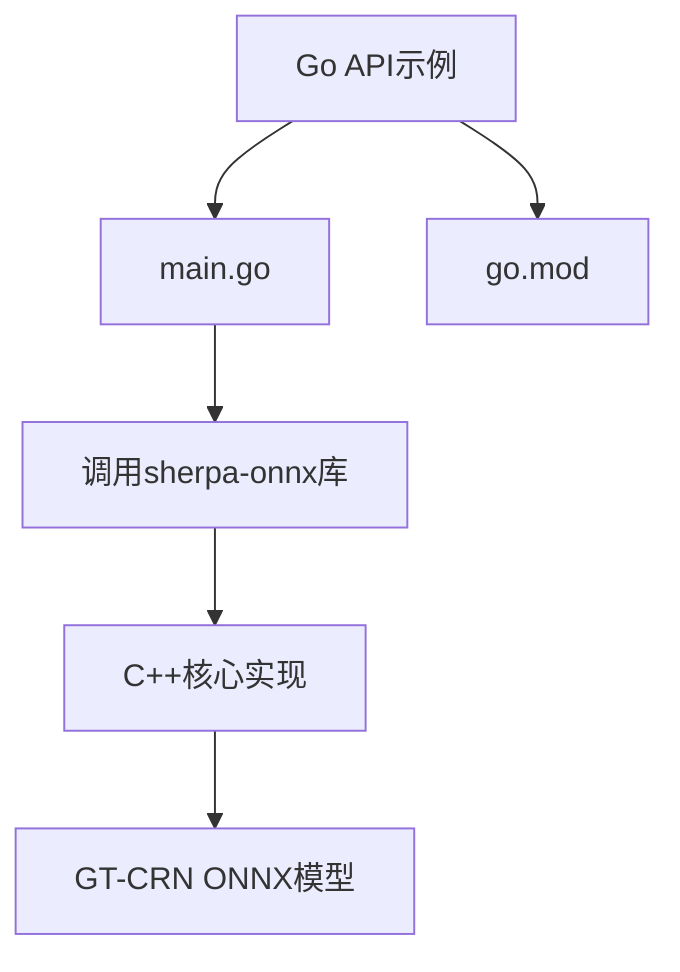
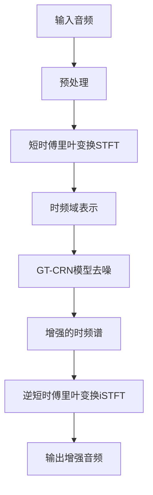
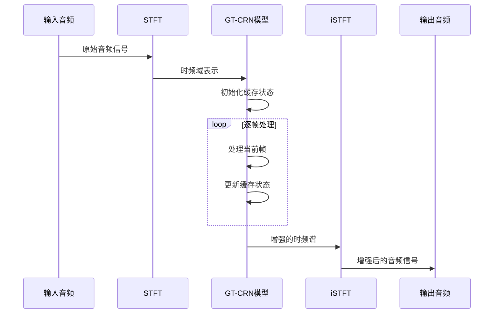

# 语音增强示例

<cite>
**本文档引用的文件**
- [main.go](file://go-api-examples/speech-enhancement-gtcrn/main.go)
- [offline-speech-denoiser-gtcrn-impl.h](file://sherpa-onnx/csrc/offline-speech-denoiser-gtcrn-impl.h)
- [offline-speech-denoiser.h](file://sherpa-onnx/csrc/offline-speech-denoiser.h)
- [offline-speech-denoiser-gtcrn-model.h](file://sherpa-onnx/csrc/offline-speech-denoiser-gtcrn-model.h)
- [offline-speech-denoiser-gtcrn-model.cc](file://sherpa-onnx/csrc/offline-speech-denoiser-gtcrn-model.cc)
- [offline-speech-denoiser-model-config.h](file://sherpa-onnx/csrc/offline-speech-denoiser-model-config.h)
- [offline-speech-denoiser-gtcrn-model-config.h](file://sherpa-onnx/csrc/offline-speech-denoiser-gtcrn-model-config.h)
- [offline-speech-denoiser-gtcrn-model-meta-data.h](file://sherpa-onnx/csrc/offline-speech-denoiser-gtcrn-model-meta-data.h)
- [add_meta_data.py](file://scripts/gtcrn/add_meta_data.py)
</cite>

## 目录
1. [项目结构](#项目结构)
2. [核心组件](#核心组件)
3. [语音增强算法原理](#语音增强算法原理)
4. [GT-CRN模型工作流程](#gt-crn模型工作流程)
5. [参数配置与优化](#参数配置与优化)
6. [应用场景与效果](#应用场景与效果)

## 项目结构

语音增强Go API示例位于`go-api-examples/speech-enhancement-gtcrn`目录下，包含Go模块定义和主程序文件。该示例通过调用sherpa-onnx的C++核心功能，实现了基于GT-CRN模型的语音去噪和增强功能。

**图示来源**
- [main.go](file://go-api-examples/speech-enhancement-gtcrn/main.go)
- [go.mod](file://go-api-examples/speech-enhancement-gtcrn/go.mod)

**节来源**
- [main.go](file://go-api-examples/speech-enhancement-gtcrn/main.go)
- [go.mod](file://go-api-examples/speech-enhancement-gtcrn/go.mod)

## 核心组件

语音增强功能的核心组件包括Go API接口、C++实现层和GT-CRN深度学习模型。Go API提供简洁的调用接口，C++层处理复杂的信号处理和模型推理，GT-CRN模型负责实际的语音去噪计算。

Go API通过`OfflineSpeechDenoiser`类提供语音增强功能，该类封装了模型加载、音频处理和去噪推理的完整流程。用户只需提供音频文件路径和模型配置，即可获得增强后的语音输出。

**节来源**
- [main.go](file://go-api-examples/speech-enhancement-gtcrn/main.go)
- [offline-speech-denoiser.h](file://sherpa-onnx/csrc/offline-speech-denoiser.h)
- [offline-speech-denoiser-gtcrn-impl.h](file://sherpa-onnx/csrc/offline-speech-denoiser-gtcrn-impl.h)

## 语音增强算法原理

语音增强算法基于时频域处理技术，将时域音频信号转换到频域进行噪声估计和语音恢复。算法首先通过短时傅里叶变换(STFT)将输入音频转换为时频表示，然后利用GT-CRN模型对时频谱进行去噪处理，最后通过逆短时傅里叶变换(iSTFT)将处理后的时频谱转换回时域音频信号。

该算法的核心优势在于能够有效分离语音信号和噪声信号，在保留语音清晰度的同时最大限度地抑制背景噪声。通过深度学习模型的训练，算法能够学习到复杂的噪声模式，并针对性地进行抑制。

**图示来源**
- [offline-speech-denoiser-gtcrn-impl.h](file://sherpa-onnx/csrc/offline-speech-denoiser-gtcrn-impl.h)
- [offline-speech-denoiser-gtcrn-model.cc](file://sherpa-onnx/csrc/offline-speech-denoiser-gtcrn-model.cc)

**节来源**
- [offline-speech-denoiser-gtcrn-impl.h](file://sherpa-onnx/csrc/offline-speech-denoiser-gtcrn-impl.h)
- [offline-speech-denoiser-gtcrn-model.cc](file://sherpa-onnx/csrc/offline-speech-denoiser-gtcrn-model.cc)

## GT-CRN模型工作流程

GT-CRN模型采用门控时域卷积循环网络架构，专门设计用于语音增强任务。模型工作流程包括状态初始化、逐帧处理和音频重建三个主要阶段。

在状态初始化阶段，模型创建并初始化卷积缓存、变换器缓存和交互缓存，这些缓存用于保存跨帧的上下文信息。逐帧处理阶段，模型对每个STFT帧进行处理，利用缓存状态和当前帧信息进行去噪计算，并更新缓存状态供下一帧使用。最后，通过iSTFT将处理后的时频谱转换为时域音频信号。

**图示来源**
- [offline-speech-denoiser-gtcrn-model.cc](file://sherpa-onnx/csrc/offline-speech-denoiser-gtcrn-model.cc)
- [offline-speech-denoiser-gtcrn-model.h](file://sherpa-onnx/csrc/offline-speech-denoiser-gtcrn-model.h)

**节来源**
- [offline-speech-denoiser-gtcrn-model.cc](file://sherpa-onnx/csrc/offline-speech-denoiser-gtcrn-model.cc)
- [offline-speech-denoiser-gtcrn-model.h](file://sherpa-onnx/csrc/offline-speech-denoiser-gtcrn-model.h)

## 参数配置与优化

语音增强系统的性能和效果受多个参数的影响，合理配置这些参数可以在降噪强度和语音失真之间取得最佳平衡。

关键配置参数包括：
- **模型路径**: 指定GT-CRN ONNX模型文件的路径
- **线程数**: 控制并行处理的线程数量，影响处理速度
- **调试模式**: 启用或禁用调试信息输出
- **采样率**: 模型期望的输入音频采样率
- **FFT长度**: STFT变换的窗口大小
- **跳跃长度**: 相邻窗口之间的样本数

通过调整这些参数，用户可以根据具体应用场景优化系统性能。例如，在实时通信场景中，可以适当降低FFT长度以减少处理延迟；在录音后处理场景中，可以使用更大的FFT长度以获得更好的频域分辨率。

**节来源**
- [offline-speech-denoiser-model-config.h](file://sherpa-onnx/csrc/offline-speech-denoiser-model-config.h)
- [offline-speech-denoiser-gtcrn-model-config.h](file://sherpa-onnx/csrc/offline-speech-denoiser-gtcrn-model-config.h)
- [add_meta_data.py](file://scripts/gtcrn/add_meta_data.py)

## 应用场景与效果

语音增强技术在多种实际场景中具有重要应用价值，能够显著提升语音通信质量和用户体验。

在嘈杂环境通信场景中，如电话会议、视频通话或语音助手交互，语音增强技术可以有效抑制背景噪声（如空调声、交通噪声、人声干扰等），提高语音的可懂度和清晰度。这对于远程办公、在线教育和智能设备交互等应用尤为重要。

在录音后处理场景中，语音增强技术可用于改善历史录音质量，恢复因设备限制或环境因素导致的低质量音频。这对于语音存档、采访记录和音频内容创作等领域具有重要价值。

通过GT-CRN模型的深度学习能力，系统能够在保持语音自然度的同时，有效去除各种类型的噪声，实现高质量的语音增强效果。

**节来源**
- [main.go](file://go-api-examples/speech-enhancement-gtcrn/main.go)
- [offline-speech-denoiser-gtcrn-impl.h](file://sherpa-onnx/csrc/offline-speech-denoiser-gtcrn-impl.h)
- [offline-speech-denoiser.h](file://sherpa-onnx/csrc/offline-speech-denoiser.h)