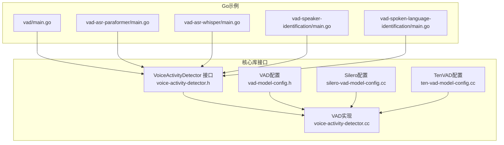
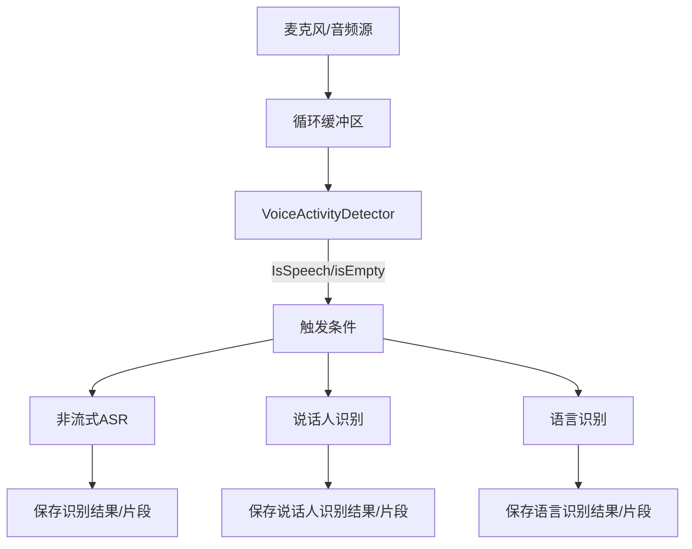
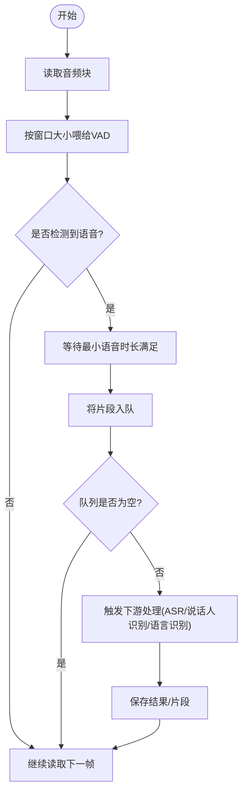
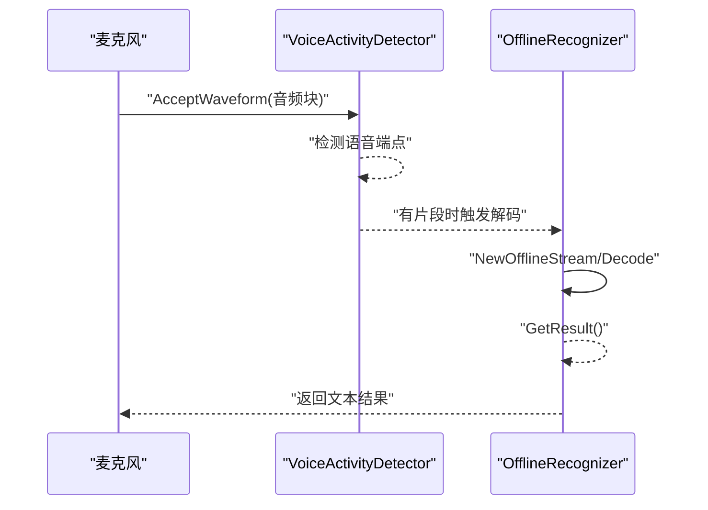
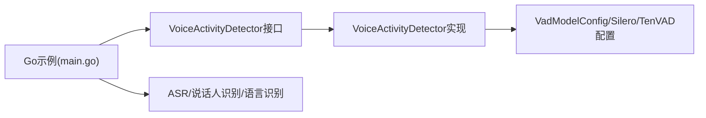

# VAD与其他功能集成

<cite>
**本文引用的文件**
- [go-api-examples/vad/main.go](file://go-api-examples/vad/main.go)
- [go-api-examples/vad-asr-paraformer/main.go](file://go-api-examples/vad-asr-paraformer/main.go)
- [go-api-examples/vad-asr-whisper/main.go](file://go-api-examples/vad-asr-whisper/main.go)
- [go-api-examples/vad-speaker-identification/main.go](file://go-api-examples/vad-speaker-identification/main.go)
- [go-api-examples/vad-spoken-language-identification/main.go](file://go-api-examples/vad-spoken-language-identification/main.go)
- [sherpa-onnx/csrc/voice-activity-detector.h](file://sherpa-onnx/csrc/voice-activity-detector.h)
- [sherpa-onnx/csrc/voice-activity-detector.cc](file://sherpa-onnx/csrc/voice-activity-detector.cc)
- [sherpa-onnx/csrc/vad-model-config.h](file://sherpa-onnx/csrc/vad-model-config.h)
- [sherpa-onnx/csrc/silero-vad-model-config.cc](file://sherpa-onnx/csrc/silero-vad-model-config.cc)
- [sherpa-onnx/csrc/ten-vad-model-config.cc](file://sherpa-onnx/csrc/ten-vad-model-config.cc)
- [go-api-examples/README.md](file://go-api-examples/README.md)
</cite>

## 目录
1. [简介](#简介)
2. [项目结构](#项目结构)
3. [核心组件](#核心组件)
4. [架构总览](#架构总览)
5. [详细组件分析](#详细组件分析)
6. [依赖关系分析](#依赖关系分析)
7. [性能考量](#性能考量)
8. [故障排查指南](#故障排查指南)
9. [结论](#结论)
10. [附录](#附录)

## 简介
本文件聚焦于sherpa-onnx的Go API示例中，VAD（Voice Activity Detection，语音活动检测）作为预处理模块与ASR、说话人识别、语言识别等下游任务的协同方式。文档基于Go示例代码，系统性解析VAD在“vad-asr-paraformer”、“vad-asr-whisper”等场景中的端点检测机制，并说明如何利用VAD结果触发和优化后续处理流程。同时给出复合应用场景的最佳实践建议，例如在语音识别前过滤静音段以提升准确性和效率，或在说话人识别中使用VAD精确定位语音片段。

## 项目结构
围绕VAD与多模态语音处理的Go示例位于go-api-examples目录下，包含独立VAD演示以及与ASR、说话人识别、语言识别的组合示例。核心Go入口文件如下：
- vad：实时麦克风采集并保存VAD检测到的语音片段
- vad-asr-paraformer：VAD + Paraformer非流式ASR
- vad-asr-whisper：VAD + Whisper非流式ASR
- vad-speaker-identification：VAD + 说话人识别
- vad-spoken-language-identification：VAD + 语言识别

图表来源
- [go-api-examples/vad/main.go](file://go-api-examples/vad/main.go#L1-L167)
- [go-api-examples/vad-asr-paraformer/main.go](file://go-api-examples/vad-asr-paraformer/main.go#L1-L149)
- [go-api-examples/vad-asr-whisper/main.go](file://go-api-examples/vad-asr-whisper/main.go#L1-L147)
- [go-api-examples/vad-speaker-identification/main.go](file://go-api-examples/vad-speaker-identification/main.go#L1-L222)
- [go-api-examples/vad-spoken-language-identification/main.go](file://go-api-examples/vad-spoken-language-identification/main.go#L1-L142)
- [sherpa-onnx/csrc/voice-activity-detector.h](file://sherpa-onnx/csrc/voice-activity-detector.h#L1-L64)
- [sherpa-onnx/csrc/voice-activity-detector.cc](file://sherpa-onnx/csrc/voice-activity-detector.cc#L120-L187)
- [sherpa-onnx/csrc/vad-model-config.h](file://sherpa-onnx/csrc/vad-model-config.h#L1-L47)
- [sherpa-onnx/csrc/silero-vad-model-config.cc](file://sherpa-onnx/csrc/silero-vad-model-config.cc#L33-L71)
- [sherpa-onnx/csrc/ten-vad-model-config.cc](file://sherpa-onnx/csrc/ten-vad-model-config.cc#L32-L76)

章节来源
- [go-api-examples/README.md](file://go-api-examples/README.md#L1-L47)

## 核心组件
- VAD模型配置
  - VadModelConfig：统一承载SileroVadModelConfig与TenVadModelConfig，以及采样率、线程数、执行提供者、调试开关等。
  - SileroVadModelConfig：阈值、最小静音时长、最小语音时长、窗口大小、最大语音时长等。
  - TenVadModelConfig：与Silero类似，但参数范围与默认值不同，需注意窗口大小限制。
- VAD接口与实现
  - VoiceActivityDetector接口：接受波形、查询是否检测到语音、弹出已就绪的语音片段队列、清空缓冲、刷新末尾等。
  - 实现要点：内部维护循环缓冲区、当前语音段、队列化的SpeechSegment；支持Flush以收尾最后一段。
- Go示例中的使用模式
  - 麦克风采集 -> 推入循环缓冲 -> 按窗口大小喂给VAD -> 基于IsSpeech与队列isEmpty判断触发 -> 将片段传给ASR/说话人识别/语言识别 -> 保存或打印结果。

章节来源
- [sherpa-onnx/csrc/vad-model-config.h](file://sherpa-onnx/csrc/vad-model-config.h#L1-L47)
- [sherpa-onnx/csrc/silero-vad-model-config.cc](file://sherpa-onnx/csrc/silero-vad-model-config.cc#L33-L71)
- [sherpa-onnx/csrc/ten-vad-model-config.cc](file://sherpa-onnx/csrc/ten-vad-model-config.cc#L32-L76)
- [sherpa-onnx/csrc/voice-activity-detector.h](file://sherpa-onnx/csrc/voice-activity-detector.h#L1-L64)
- [sherpa-onnx/csrc/voice-activity-detector.cc](file://sherpa-onnx/csrc/voice-activity-detector.cc#L120-L187)

## 架构总览
下图展示了Go示例中VAD与下游任务的协作关系：VAD负责从音频流中提取语音片段，下游任务（ASR/说话人识别/语言识别）对这些片段进行进一步处理。

图表来源
- [go-api-examples/vad-asr-paraformer/main.go](file://go-api-examples/vad-asr-paraformer/main.go#L1-L149)
- [go-api-examples/vad-asr-whisper/main.go](file://go-api-examples/vad-asr-whisper/main.go#L1-L147)
- [go-api-examples/vad-speaker-identification/main.go](file://go-api-examples/vad-speaker-identification/main.go#L1-L222)
- [go-api-examples/vad-spoken-language-identification/main.go](file://go-api-examples/vad-spoken-language-identification/main.go#L1-L142)
- [sherpa-onnx/csrc/voice-activity-detector.h](file://sherpa-onnx/csrc/voice-activity-detector.h#L1-L64)

## 详细组件分析

### VAD作为预处理模块：端点检测与触发机制
- 端点检测流程
  - 以固定窗口大小（window_size）向VAD输入音频块，VAD内部根据阈值与最小语音/静音时长判定是否开始/结束一段语音。
  - 当检测到语音开始且满足最小语音时长后，VAD将当前片段加入队列；当检测到语音结束且满足最小静音时长后，VAD输出该片段。
  - 在流式结束时调用Flush，确保最后一段被完整输出。
- 触发策略
  - Go示例通过IsSpeech与isEmpty联合判断，仅在出现新片段时触发后续处理，避免重复解码同一段音频。
  - 示例中通常以0.1秒为读取粒度，按窗口大小喂给VAD，保证低延迟与高吞吐。

图表来源
- [go-api-examples/vad/main.go](file://go-api-examples/vad/main.go#L60-L122)
- [sherpa-onnx/csrc/voice-activity-detector.cc](file://sherpa-onnx/csrc/voice-activity-detector.cc#L120-L187)

章节来源
- [go-api-examples/vad/main.go](file://go-api-examples/vad/main.go#L60-L122)
- [sherpa-onnx/csrc/voice-activity-detector.cc](file://sherpa-onnx/csrc/voice-activity-detector.cc#L120-L187)

### VAD + ASR（Paraformer）
- 流程要点
  - 创建VAD与Paraformer非流式识别器。
  - 从麦克风读取音频块，喂给VAD；当VAD输出片段时，创建离线识别流并解码，得到文本结果。
  - 可选地将识别结果写入文件名，便于后续分析。
- 最佳实践
  - 合理设置min_speech_duration与min_silence_duration，减少误触发与漏检。
  - 使用多线程解码提升吞吐，但需平衡CPU占用与延迟。
  - 对长语音可设置max_speech_duration并在超过阈值时提高阈值，减少误判。

图表来源
- [go-api-examples/vad-asr-paraformer/main.go](file://go-api-examples/vad-asr-paraformer/main.go#L1-L149)

章节来源
- [go-api-examples/vad-asr-paraformer/main.go](file://go-api-examples/vad-asr-paraformer/main.go#L1-L149)

### VAD + ASR（Whisper）
- 流程要点
  - 与Paraformer类似，但使用Whisper模型配置。
  - 适合多语言场景，可结合语言识别模块进行二次筛选。
- 注意事项
  - Whisper模型体积较大，需合理设置NumThreads与Provider以获得稳定性能。
  - 若目标语言明确，可先用语言识别模块过滤后再交给Whisper解码，降低计算开销。

章节来源
- [go-api-examples/vad-asr-whisper/main.go](file://go-api-examples/vad-asr-whisper/main.go#L1-L147)

### VAD + 说话人识别
- 流程要点
  - 先注册若干说话人的嵌入，建立SpeakerEmbeddingManager。
  - 采集音频块喂给VAD，VAD输出片段后，提取说话人嵌入并检索匹配说话人。
  - 结果可用于标注或统计说话人分布。
- 最佳实践
  - 使用较长的最小语音时长，确保嵌入质量。
  - 适当提高阈值以减少误匹配，结合多片段平均嵌入提升鲁棒性。

章节来源
- [go-api-examples/vad-speaker-identification/main.go](file://go-api-examples/vad-speaker-identification/main.go#L1-L222)

### VAD + 语言识别
- 流程要点
  - 创建VAD与SpokenLanguageIdentification实例。
  - VAD输出片段后，创建语言识别流并Compute，得到语言标签。
  - 可将语言标签映射为人类可读名称用于日志或界面显示。
- 最佳实践
  - 选择合适的语言模型（如tiny），兼顾速度与精度。
  - 对短片段可能识别不准，可合并多个片段再识别。

章节来源
- [go-api-examples/vad-spoken-language-identification/main.go](file://go-api-examples/vad-spoken-language-identification/main.go#L1-L142)

## 依赖关系分析
- Go示例依赖VAD接口与实现，以及VAD配置结构体。
- VAD实现依赖SileroVAD或TenVAD模型配置，内部维护循环缓冲与队列化片段。
- 下游任务（ASR/说话人识别/语言识别）通过VAD提供的片段进行处理。

图表来源
- [sherpa-onnx/csrc/voice-activity-detector.h](file://sherpa-onnx/csrc/voice-activity-detector.h#L1-L64)
- [sherpa-onnx/csrc/voice-activity-detector.cc](file://sherpa-onnx/csrc/voice-activity-detector.cc#L120-L187)
- [sherpa-onnx/csrc/vad-model-config.h](file://sherpa-onnx/csrc/vad-model-config.h#L1-L47)
- [sherpa-onnx/csrc/silero-vad-model-config.cc](file://sherpa-onnx/csrc/silero-vad-model-config.cc#L33-L71)
- [sherpa-onnx/csrc/ten-vad-model-config.cc](file://sherpa-onnx/csrc/ten-vad-model-config.cc#L32-L76)

章节来源
- [sherpa-onnx/csrc/voice-activity-detector.h](file://sherpa-onnx/csrc/voice-activity-detector.h#L1-L64)
- [sherpa-onnx/csrc/voice-activity-detector.cc](file://sherpa-onnx/csrc/voice-activity-detector.cc#L120-L187)
- [sherpa-onnx/csrc/vad-model-config.h](file://sherpa-onnx/csrc/vad-model-config.h#L1-L47)
- [sherpa-onnx/csrc/silero-vad-model-config.cc](file://sherpa-onnx/csrc/silero-vad-model-config.cc#L33-L71)
- [sherpa-onnx/csrc/ten-vad-model-config.cc](file://sherpa-onnx/csrc/ten-vad-model-config.cc#L32-L76)

## 性能考量
- 窗口大小与延迟
  - 窗口越小，端点检测越快，但更易受噪声影响；窗口越大，稳定性更好但延迟更高。示例中普遍采用512或256样本的窗口大小。
- 最小语音/静音时长
  - 合理设置min_speech_duration与min_silence_duration，可显著减少误触发与漏检，提升整体吞吐。
- 多线程与执行提供者
  - 适当增加NumThreads并选择合适的Provider（如cpu），可在资源允许范围内提升解码速度。
- 流式结束处理
  - 使用Flush确保最后一段被完整输出，避免丢帧。

章节来源
- [go-api-examples/vad/main.go](file://go-api-examples/vad/main.go#L20-L40)
- [go-api-examples/vad-asr-paraformer/main.go](file://go-api-examples/vad-asr-paraformer/main.go#L20-L30)
- [go-api-examples/vad-asr-whisper/main.go](file://go-api-examples/vad-asr-whisper/main.go#L20-L30)
- [go-api-examples/vad-speaker-identification/main.go](file://go-api-examples/vad-speaker-identification/main.go#L88-L108)
- [go-api-examples/vad-spoken-language-identification/main.go](file://go-api-examples/vad-spoken-language-identification/main.go#L14-L29)
- [sherpa-onnx/csrc/silero-vad-model-config.cc](file://sherpa-onnx/csrc/silero-vad-model-config.cc#L33-L71)
- [sherpa-onnx/csrc/ten-vad-model-config.cc](file://sherpa-onnx/csrc/ten-vad-model-config.cc#L32-L76)

## 故障排查指南
- 模型文件缺失
  - 若未找到silero_vad.onnx或ten-vad.onnx，示例会提示下载路径，请确认模型文件存在且路径正确。
- 参数范围错误
  - SileroVAD与TenVAD均对阈值、最小静音/语音时长、窗口大小等参数有限制，超出范围会导致初始化失败或性能异常。
- 端点检测不准确
  - 调整阈值、min_speech_duration与min_silence_duration；必要时提高max_speech_duration并在长语音时提高阈值。
- 解码性能不足
  - 提升NumThreads或切换Provider；对Whisper等大模型可考虑先做语言识别再解码，减少无效计算。

章节来源
- [go-api-examples/vad/main.go](file://go-api-examples/vad/main.go#L16-L40)
- [sherpa-onnx/csrc/silero-vad-model-config.cc](file://sherpa-onnx/csrc/silero-vad-model-config.cc#L54-L71)
- [sherpa-onnx/csrc/ten-vad-model-config.cc](file://sherpa-onnx/csrc/ten-vad-model-config.cc#L44-L76)

## 结论
VAD在sherpa-onnx的Go示例中扮演了关键的预处理角色：通过端点检测将连续音频切分为有意义的语音片段，从而驱动ASR、说话人识别与语言识别等下游任务。示例展示了如何在保持低延迟的同时，利用VAD的队列化片段触发后续处理，并通过合理的参数配置与多线程策略提升整体性能。对于复杂场景，建议结合语言识别与说话人识别模块，形成“VAD -> 语言/说话人过滤 -> 高级ASR”的流水线，以获得更高的准确性与效率。

## 附录
- 示例清单与用途
  - vad：展示VAD基本用法与实时录音保存。
  - vad-asr-paraformer：展示VAD + Paraformer非流式ASR。
  - vad-asr-whisper：展示VAD + Whisper非流式ASR。
  - vad-speaker-identification：展示VAD + 说话人识别。
  - vad-spoken-language-identification：展示VAD + 语言识别。

章节来源
- [go-api-examples/README.md](file://go-api-examples/README.md#L1-L47)