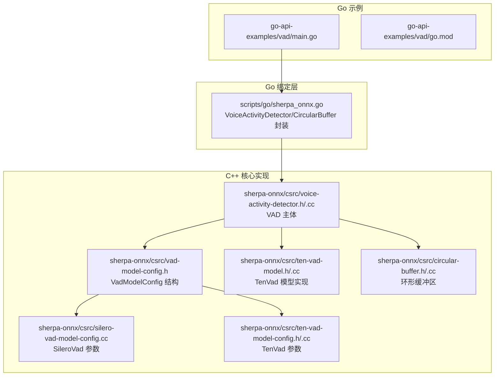
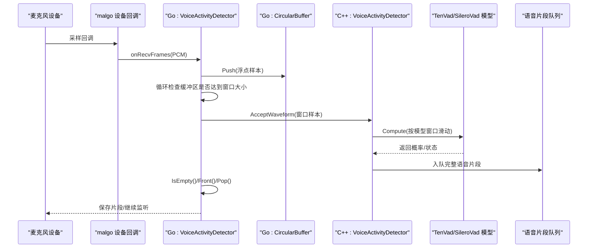
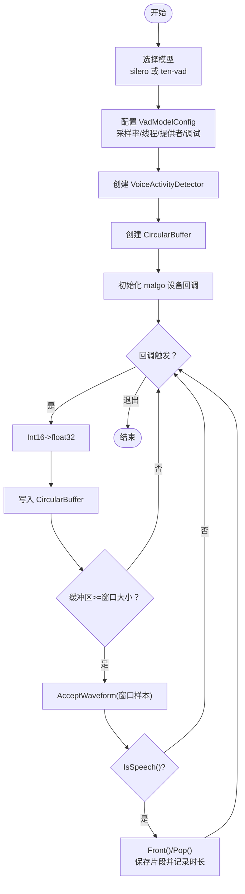
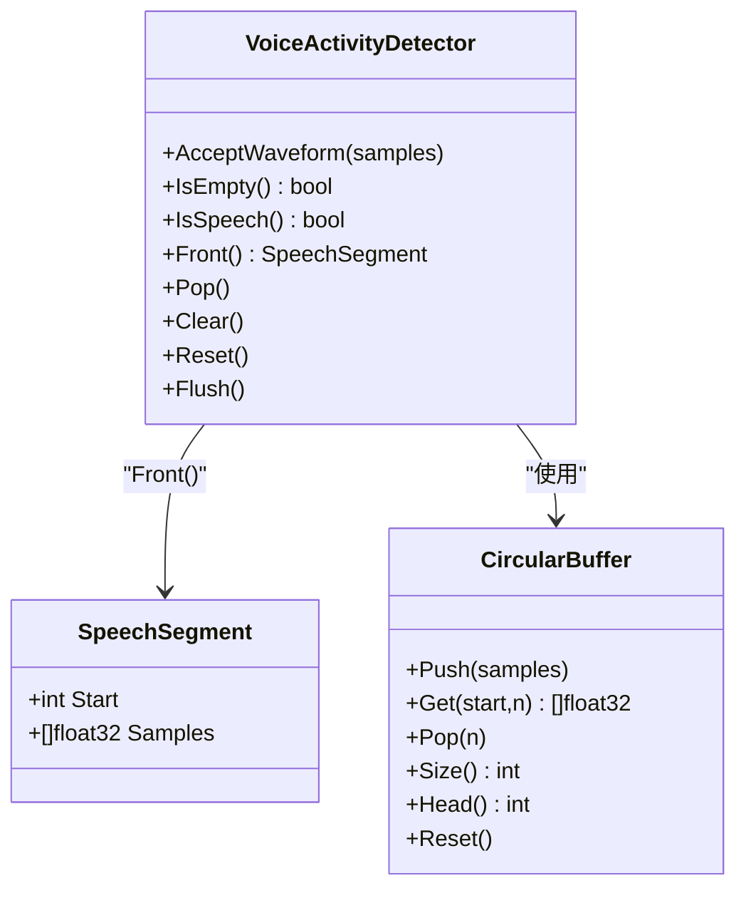
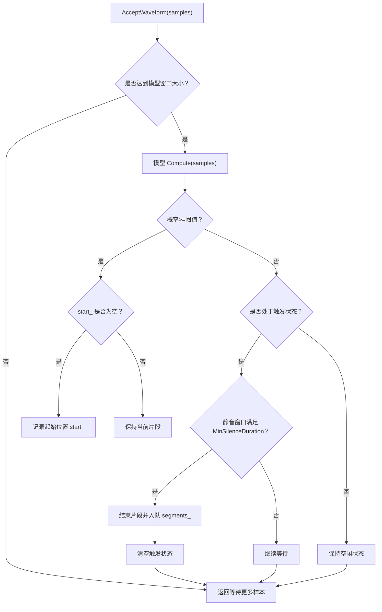
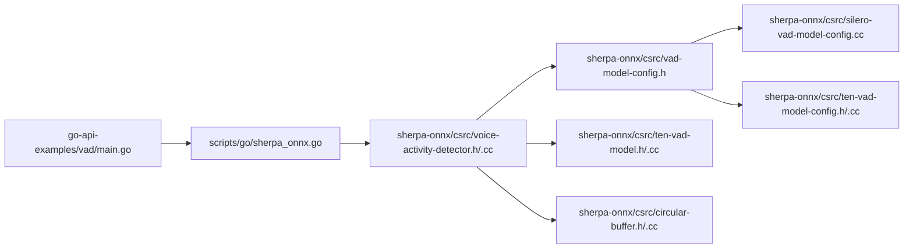

# 基础语音活动检测

<cite>
**本文引用的文件**
- [go-api-examples/vad/main.go](file://go-api-examples/vad/main.go)
- [go-api-examples/vad/go.mod](file://go-api-examples/vad/go.mod)
- [go-api-examples/README.md](file://go-api-examples/README.md)
- [scripts/go/sherpa_onnx.go](file://scripts/go/sherpa_onnx.go)
- [sherpa-onnx/csrc/voice-activity-detector.h](file://sherpa-onnx/csrc/voice-activity-detector.h)
- [sherpa-onnx/csrc/voice-activity-detector.cc](file://sherpa-onnx/csrc/voice-activity-detector.cc)
- [sherpa-onnx/csrc/vad-model-config.h](file://sherpa-onnx/csrc/vad-model-config.h)
- [sherpa-onnx/csrc/silero-vad-model-config.cc](file://sherpa-onnx/csrc/silero-vad-model-config.cc)
- [sherpa-onnx/csrc/ten-vad-model-config.h](file://sherpa-onnx/csrc/ten-vad-model-config.h)
- [sherpa-onnx/csrc/ten-vad-model-config.cc](file://sherpa-onnx/csrc/ten-vad-model-config.cc)
- [sherpa-onnx/csrc/ten-vad-model.h](file://sherpa-onnx/csrc/ten-vad-model.h)
- [sherpa-onnx/csrc/ten-vad-model.cc](file://sherpa-onnx/csrc/ten-vad-model.cc)
- [sherpa-onnx/csrc/circular-buffer.h](file://sherpa-onnx/csrc/circular-buffer.h)
- [sherpa-onnx/csrc/circular-buffer.cc](file://sherpa-onnx/csrc/circular-buffer.cc)
</cite>

## 目录
1. [简介](#简介)
2. [项目结构](#项目结构)
3. [核心组件](#核心组件)
4. [架构总览](#架构总览)
5. [详细组件分析](#详细组件分析)
6. [依赖关系分析](#依赖关系分析)
7. [性能与参数调优](#性能与参数调优)
8. [故障排查指南](#故障排查指南)
9. [结论](#结论)
10. [附录：配置参数速查](#附录配置参数速查)

## 简介
本文件围绕 sherpa-onnx 的 Go API 示例“基础语音活动检测（VAD）”展开，系统性讲解：
- VAD 算法在 sherpa-onnx 中的实现机制与数据流
- 音频流处理、特征提取与语音/非语音判断逻辑
- main.go 的代码结构与使用方式：如何初始化 VAD 模型、处理麦克风音频输入并获取检测结果
- 关键配置参数的含义与调优建议：检测灵敏度、静音/语音最小持续时间、窗口大小等
- 实战集成指南：如何将 VAD 集成到 Go 应用中并处理实时音频流

## 项目结构
该示例位于 go-api-examples/vad，核心由以下部分组成：
- 示例程序入口：go-api-examples/vad/main.go
- Go 模块声明：go-api-examples/vad/go.mod
- Go API 绑定：scripts/go/sherpa_onnx.go（封装 VoiceActivityDetector、CircularBuffer 等）
- 核心 C++ 实现：sherpa-onnx/csrc 下的 VAD、模型配置、环形缓冲区等

图表来源
- [go-api-examples/vad/main.go](file://go-api-examples/vad/main.go#L1-L167)
- [scripts/go/sherpa_onnx.go](file://scripts/go/sherpa_onnx.go#L1300-L1499)
- [sherpa-onnx/csrc/voice-activity-detector.h](file://sherpa-onnx/csrc/voice-activity-detector.h#L1-L63)
- [sherpa-onnx/csrc/voice-activity-detector.cc](file://sherpa-onnx/csrc/voice-activity-detector.cc#L1-L282)
- [sherpa-onnx/csrc/vad-model-config.h](file://sherpa-onnx/csrc/vad-model-config.h#L1-L46)
- [sherpa-onnx/csrc/silero-vad-model-config.cc](file://sherpa-onnx/csrc/silero-vad-model-config.cc#L33-L125)
- [sherpa-onnx/csrc/ten-vad-model-config.h](file://sherpa-onnx/csrc/ten-vad-model-config.h#L1-L45)
- [sherpa-onnx/csrc/ten-vad-model-config.cc](file://sherpa-onnx/csrc/ten-vad-model-config.cc#L1-L113)
- [sherpa-onnx/csrc/ten-vad-model.h](file://sherpa-onnx/csrc/ten-vad-model.h#L1-L55)
- [sherpa-onnx/csrc/ten-vad-model.cc](file://sherpa-onnx/csrc/ten-vad-model.cc#L1-L206)
- [sherpa-onnx/csrc/circular-buffer.h](file://sherpa-onnx/csrc/circular-buffer.h)
- [sherpa-onnx/csrc/circular-buffer.cc](file://sherpa-onnx/csrc/circular-buffer.cc#L114-L182)

章节来源
- [go-api-examples/vad/main.go](file://go-api-examples/vad/main.go#L1-L167)
- [go-api-examples/vad/go.mod](file://go-api-examples/vad/go.mod#L1-L4)
- [go-api-examples/README.md](file://go-api-examples/README.md#L1-L47)

## 核心组件
- VoiceActivityDetector（Go 封装）：负责接收音频帧、调用底层模型进行推理、维护内部队列并输出语音片段
- VadModelConfig（Go 封装）：承载 SileroVad 或 TenVad 的配置，以及采样率、线程数、执行提供者等通用参数
- CircularBuffer（Go 封装）：环形缓冲区，用于累积足够长度的音频以供 VAD 推理
- C++ VAD 主体：voice-activity-detector.h/.cc，封装模型、状态机与语音片段队列
- VAD 模型配置：silero-vad-model-config.cc 与 ten-vad-model-config.h/.cc，定义模型参数与校验规则
- TenVadModel：Ten-VAD 具体实现，包含特征计算、滑动窗口、阈值切换等逻辑

章节来源
- [scripts/go/sherpa_onnx.go](file://scripts/go/sherpa_onnx.go#L1300-L1499)
- [sherpa-onnx/csrc/voice-activity-detector.h](file://sherpa-onnx/csrc/voice-activity-detector.h#L1-L63)
- [sherpa-onnx/csrc/voice-activity-detector.cc](file://sherpa-onnx/csrc/voice-activity-detector.cc#L1-L282)
- [sherpa-onnx/csrc/vad-model-config.h](file://sherpa-onnx/csrc/vad-model-config.h#L1-L46)
- [sherpa-onnx/csrc/silero-vad-model-config.cc](file://sherpa-onnx/csrc/silero-vad-model-config.cc#L33-L125)
- [sherpa-onnx/csrc/ten-vad-model-config.h](file://sherpa-onnx/csrc/ten-vad-model-config.h#L1-L45)
- [sherpa-onnx/csrc/ten-vad-model-config.cc](file://sherpa-onnx/csrc/ten-vad-model-config.cc#L1-L113)
- [sherpa-onnx/csrc/ten-vad-model.h](file://sherpa-onnx/csrc/ten-vad-model.h#L1-L55)
- [sherpa-onnx/csrc/ten-vad-model.cc](file://sherpa-onnx/csrc/ten-vad-model.cc#L1-L206)

## 架构总览
下图展示了从麦克风采集到 VAD 检测再到语音片段输出的整体流程，以及 Go 层与 C++ 核心之间的交互。

图表来源
- [go-api-examples/vad/main.go](file://go-api-examples/vad/main.go#L60-L138)
- [scripts/go/sherpa_onnx.go](file://scripts/go/sherpa_onnx.go#L1300-L1499)
- [sherpa-onnx/csrc/voice-activity-detector.cc](file://sherpa-onnx/csrc/voice-activity-detector.cc#L100-L282)
- [sherpa-onnx/csrc/ten-vad-model.cc](file://sherpa-onnx/csrc/ten-vad-model.cc#L1-L206)

## 详细组件分析

### 1) main.go 代码结构与控制流
- 初始化日志、选择模型：优先使用本地 silero_vad.onnx，否则尝试 ten-vad.onnx；若均不存在则提示下载
- 配置 VadModelConfig：设置采样率、线程数、执行提供者、调试开关；同时为所选模型设置阈值、最小静音/语音时长、最大语音时长、窗口大小
- 创建 VoiceActivityDetector 与 CircularBuffer，并启动 malgo 设备回调
- 回调函数 onRecvFrames：
  - 将 Int16 PCM 转换为 float32
  - 写入 CircularBuffer
  - 当缓冲区样本数达到窗口大小时，调用 VAD 接口进行推理
  - 若检测到语音片段，循环弹出队列并保存为 WAV 文件，记录时长

图表来源
- [go-api-examples/vad/main.go](file://go-api-examples/vad/main.go#L1-L167)

章节来源
- [go-api-examples/vad/main.go](file://go-api-examples/vad/main.go#L1-L167)

### 2) Go API 封装（VoiceActivityDetector 与 CircularBuffer）
- VoiceActivityDetector
  - New/Delete 构造/析构
  - AcceptWaveform：向底层模型提交样本
  - IsEmpty/IsSpeech/Front/Pop/Clear/Reset/Flush：管理语音片段队列与当前状态
- CircularBuffer
  - Push/Get/Pop/Size/Head/Reset：环形缓冲区操作，支持跨边界读取

图表来源
- [scripts/go/sherpa_onnx.go](file://scripts/go/sherpa_onnx.go#L1300-L1499)

章节来源
- [scripts/go/sherpa_onnx.go](file://scripts/go/sherpa_onnx.go#L1300-L1499)

### 3) VAD 算法与数据流（C++ 核心）
- 状态机与片段队列
  - 维护当前起始位置 start_，在检测到语音时记录起始样本索引，在静音后截取完整片段入队
  - 使用队列 segments_ 存储已检测到的语音片段，Front()/Pop() 提供消费接口
- 环形缓冲区
  - buffer_ 记录累计样本，Tail()-Head() 表示有效长度；Get/Pop 支持跨边界读取
- 最大语音时长与阈值切换
  - 当检测到的语音片段超过 max_speech_duration 时，临时提高阈值以减少误检，结束后恢复原阈值
- TenVad 特性
  - 窗口大小 window_size 与窗口步长 window_shift 受限于模型训练规格
  - 通过最小静音/语音持续时间平滑边界，避免过早或过晚切分

图表来源
- [sherpa-onnx/csrc/voice-activity-detector.cc](file://sherpa-onnx/csrc/voice-activity-detector.cc#L100-L282)
- [sherpa-onnx/csrc/ten-vad-model.cc](file://sherpa-onnx/csrc/ten-vad-model.cc#L1-L206)

章节来源
- [sherpa-onnx/csrc/voice-activity-detector.cc](file://sherpa-onnx/csrc/voice-activity-detector.cc#L100-L282)
- [sherpa-onnx/csrc/ten-vad-model.cc](file://sherpa-onnx/csrc/ten-vad-model.cc#L1-L206)

### 4) 配置参数详解（Go/VadModelConfig）
- 通用参数
  - SampleRate：采样率（示例默认 16000）
  - NumThreads：推理线程数
  - Provider：执行提供者（如 cpu）
  - Debug：调试开关
- SileroVad
  - Threshold：语音阈值（概率阈值）
  - MinSilenceDuration：语音结束后的最小静音时长（秒）
  - MinSpeechDuration：静音后的最小语音时长（秒）
  - MaxSpeechDuration：最大语音时长（秒），超过后临时提高阈值
  - WindowSize：窗口大小（样本数），需符合模型训练规格
- TenVad
  - Threshold、MinSilenceDuration、MinSpeechDuration、MaxSpeechDuration 含义同上
  - WindowSize：模型要求 160 或 256（样本）

章节来源
- [go-api-examples/vad/main.go](file://go-api-examples/vad/main.go#L14-L50)
- [sherpa-onnx/csrc/vad-model-config.h](file://sherpa-onnx/csrc/vad-model-config.h#L1-L46)
- [sherpa-onnx/csrc/silero-vad-model-config.cc](file://sherpa-onnx/csrc/silero-vad-model-config.cc#L33-L125)
- [sherpa-onnx/csrc/ten-vad-model-config.h](file://sherpa-onnx/csrc/ten-vad-model-config.h#L1-L45)
- [sherpa-onnx/csrc/ten-vad-model-config.cc](file://sherpa-onnx/csrc/ten-vad-model-config.cc#L1-L113)

### 5) 集成到 Go 应用的实践步骤
- 步骤一：准备模型
  - 在示例目录放置 silero_vad.onnx 或 ten-vad.onnx
- 步骤二：初始化 VAD
  - 构造 VadModelConfig 并设置参数
  - 调用 NewVoiceActivityDetector 创建实例
- 步骤三：接入音频流
  - 使用 malgo 初始化设备，设置采样率、通道、格式
  - 在回调中将 Int16 PCM 转为 float32，写入 CircularBuffer
  - 达到窗口大小后调用 AcceptWaveform
- 步骤四：消费语音片段
  - 轮询 IsEmpty()/Front()/Pop() 获取完整片段
  - 保存为 WAV 或进一步处理（如转写）

章节来源
- [go-api-examples/vad/main.go](file://go-api-examples/vad/main.go#L60-L138)
- [scripts/go/sherpa_onnx.go](file://scripts/go/sherpa_onnx.go#L1300-L1499)

## 依赖关系分析
- Go 示例依赖 Go API 绑定（scripts/go/sherpa_onnx.go）
- Go API 绑定依赖 C++ 核心（voice-activity-detector、vad-model-config、circular-buffer、ten-vad-model）
- VAD 主体依赖模型配置与具体模型实现（SileroVad/TenVad）

图表来源
- [go-api-examples/vad/main.go](file://go-api-examples/vad/main.go#L1-L167)
- [scripts/go/sherpa_onnx.go](file://scripts/go/sherpa_onnx.go#L1300-L1499)
- [sherpa-onnx/csrc/voice-activity-detector.h](file://sherpa-onnx/csrc/voice-activity-detector.h#L1-L63)
- [sherpa-onnx/csrc/voice-activity-detector.cc](file://sherpa-onnx/csrc/voice-activity-detector.cc#L1-L282)
- [sherpa-onnx/csrc/vad-model-config.h](file://sherpa-onnx/csrc/vad-model-config.h#L1-L46)
- [sherpa-onnx/csrc/silero-vad-model-config.cc](file://sherpa-onnx/csrc/silero-vad-model-config.cc#L33-L125)
- [sherpa-onnx/csrc/ten-vad-model-config.h](file://sherpa-onnx/csrc/ten-vad-model-config.h#L1-L45)
- [sherpa-onnx/csrc/ten-vad-model-config.cc](file://sherpa-onnx/csrc/ten-vad-model-config.cc#L1-L113)
- [sherpa-onnx/csrc/ten-vad-model.h](file://sherpa-onnx/csrc/ten-vad-model.h#L1-L55)
- [sherpa-onnx/csrc/ten-vad-model.cc](file://sherpa-onnx/csrc/ten-vad-model.cc#L1-L206)
- [sherpa-onnx/csrc/circular-buffer.h](file://sherpa-onnx/csrc/circular-buffer.h)
- [sherpa-onnx/csrc/circular-buffer.cc](file://sherpa-onnx/csrc/circular-buffer.cc#L114-L182)

章节来源
- [go-api-examples/vad/main.go](file://go-api-examples/vad/main.go#L1-L167)
- [scripts/go/sherpa_onnx.go](file://scripts/go/sherpa_onnx.go#L1300-L1499)

## 性能与参数调优
- 窗口大小（WindowSize）
  - SileroVad：建议使用模型训练时的标准窗口大小（如 512、1024、1536 对应 16kHz）
  - TenVad：建议使用 160 或 256（样本）
- 阈值（Threshold）
  - 初始可设为 0.5；若误检较多可适当提高；若漏检较多可降低
- 最小静音/语音时长（MinSilenceDuration/MinSpeechDuration）
  - 增大静音阈值有助于避免短促停顿被误判为新语音起点
  - 增大语音阈值有助于避免噪声被误判为语音
- 最大语音时长（MaxSpeechDuration）
  - 超过阈值后自动提升阈值，减少长语音误检
- 缓冲区大小（bufferSizeInSeconds）
  - 影响片段截取的粒度与延迟；越大越平滑但延迟越高
- 线程数与提供者
  - NumThreads 增加可提升吞吐，但受硬件限制
  - Provider 选择 cpu/gpu（取决于部署环境）

章节来源
- [go-api-examples/vad/main.go](file://go-api-examples/vad/main.go#L14-L50)
- [sherpa-onnx/csrc/silero-vad-model-config.cc](file://sherpa-onnx/csrc/silero-vad-model-config.cc#L33-L125)
- [sherpa-onnx/csrc/ten-vad-model-config.cc](file://sherpa-onnx/csrc/ten-vad-model-config.cc#L1-L113)
- [sherpa-onnx/csrc/voice-activity-detector.cc](file://sherpa-onnx/csrc/voice-activity-detector.cc#L191-L203)

## 故障排查指南
- 无法找到模型文件
  - 确认 silero_vad.onnx 或 ten-vad.onnx 已放置在示例目录
  - 检查路径是否正确
- 阈值范围错误
  - Silero/TenVAD 都要求阈值在 (0.01, 1) 区间内
- 窗口大小不匹配
  - TenVad 窗口大小过大或不符合模型规格会导致初始化失败
- 静音/语音时长参数非法
  - 必须大于 0；过小可能导致频繁切分或无法切分
- 设备初始化失败
  - 检查 malgo 设备配置（采样率、通道、格式）与系统权限
- 无语音片段输出
  - 检查阈值、静音/语音时长设置；确认回调中确实写入了样本

章节来源
- [go-api-examples/vad/main.go](file://go-api-examples/vad/main.go#L14-L50)
- [sherpa-onnx/csrc/silero-vad-model-config.cc](file://sherpa-onnx/csrc/silero-vad-model-config.cc#L54-L108)
- [sherpa-onnx/csrc/ten-vad-model-config.cc](file://sherpa-onnx/csrc/ten-vad-model-config.cc#L44-L97)
- [sherpa-onnx/csrc/ten-vad-model.cc](file://sherpa-onnx/csrc/ten-vad-model.cc#L193-L206)

## 结论
本示例展示了如何在 Go 中使用 sherpa-onnx 的 VAD 能力，结合环形缓冲区与模型推理，实现对实时音频流的语音/非语音检测与片段输出。通过合理配置阈值、最小静音/语音时长与窗口大小，可在不同场景下取得稳定且低延迟的检测效果。建议在实际部署前根据目标数据集微调阈值与窗口大小，并评估延迟与资源占用的平衡。

## 附录：配置参数速查
- 通用
  - SampleRate：采样率（Hz）
  - NumThreads：线程数
  - Provider：执行提供者（cpu/gpu）
  - Debug：调试开关
- SileroVad
  - Threshold：语音阈值
  - MinSilenceDuration：最小静音时长（秒）
  - MinSpeechDuration：最小语音时长（秒）
  - MaxSpeechDuration：最大语音时长（秒）
  - WindowSize：窗口大小（样本）
- TenVad
  - Threshold、MinSilenceDuration、MinSpeechDuration、MaxSpeechDuration、WindowSize：含义同上

章节来源
- [go-api-examples/vad/main.go](file://go-api-examples/vad/main.go#L14-L50)
- [sherpa-onnx/csrc/vad-model-config.h](file://sherpa-onnx/csrc/vad-model-config.h#L1-L46)
- [sherpa-onnx/csrc/silero-vad-model-config.cc](file://sherpa-onnx/csrc/silero-vad-model-config.cc#L33-L125)
- [sherpa-onnx/csrc/ten-vad-model-config.h](file://sherpa-onnx/csrc/ten-vad-model-config.h#L1-L45)
- [sherpa-onnx/csrc/ten-vad-model-config.cc](file://sherpa-onnx/csrc/ten-vad-model-config.cc#L1-L113)