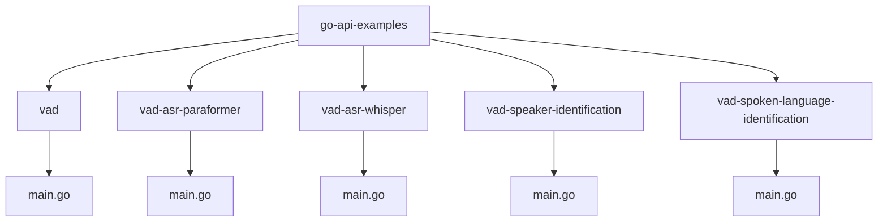
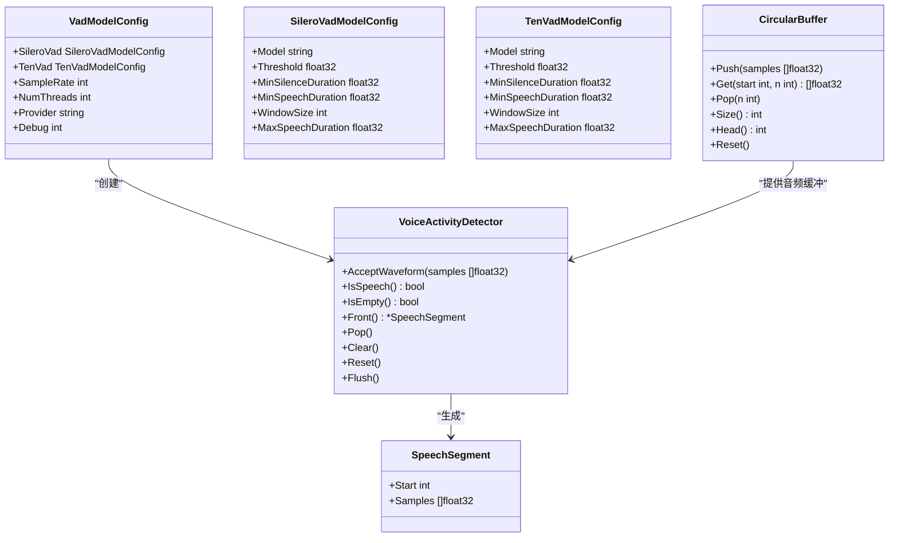
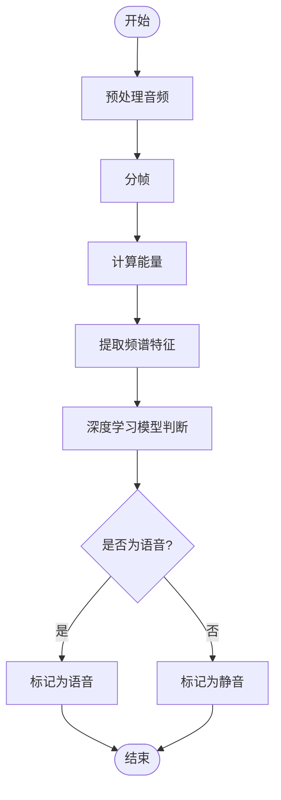
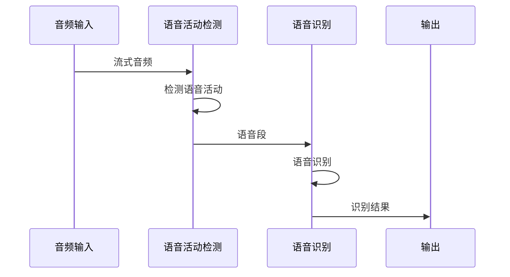
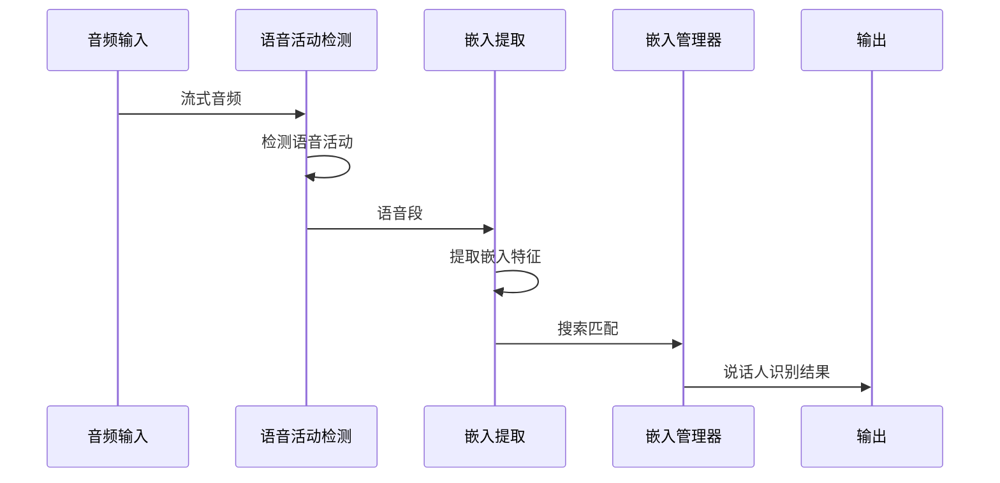
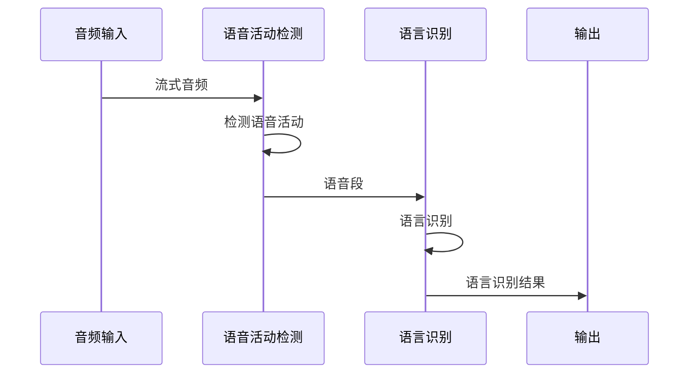

# 语音活动检测示例

<cite>
**本文档中引用的文件**   
- [main.go](file://go-api-examples/vad/main.go)
- [vad-asr-paraformer/main.go](file://go-api-examples/vad-asr-paraformer/main.go)
- [vad-asr-whisper/main.go](file://go-api-examples/vad-asr-whisper/main.go)
- [vad-speaker-identification/main.go](file://go-api-examples/vad-speaker-identification/main.go)
- [vad-spoken-language-identification/main.go](file://go-api-examples/vad-spoken-language-identification/main.go)
- [sherpa_onnx.go](file://scripts/go/sherpa_onnx.go)
- [sherpa_onnx.go](file://scripts/go/_internal/sherpa_onnx.go)
- [c-api.h](file://sherpa-onnx/c-api/c-api.h)
</cite>

## 目录
1. [项目结构](#项目结构)
2. [核心组件](#核心组件)
3. [VAD算法工作原理](#vad算法工作原理)
4. [与其他语音处理功能的集成](#与其他语音处理功能的集成)
5. [应用场景与配置建议](#应用场景与配置建议)
6. [性能考虑](#性能考虑)
7. [故障排除指南](#故障排除指南)

## 项目结构

sherpa-onnx项目的Go API示例提供了多个语音活动检测（VAD）相关的实现，主要位于`go-api-examples`目录下。这些示例展示了如何使用不同的VAD模型和与其他语音处理功能的集成。

**Diagram sources**
- [go-api-examples](file://go-api-examples)
- [go-api-examples/vad](file://go-api-examples/vad)
- [go-api-examples/vad-asr-paraformer](file://go-api-examples/vad-asr-paraformer)
- [go-api-examples/vad-asr-whisper](file://go-api-examples/vad-asr-whisper)
- [go-api-examples/vad-speaker-identification](file://go-api-examples/vad-speaker-identification)
- [go-api-examples/vad-spoken-language-identification](file://go-api-examples/vad-spoken-language-identification)

**Section sources**
- [go-api-examples](file://go-api-examples)

## 核心组件

sherpa-onnx的Go API提供了语音活动检测的核心组件，主要包括VAD模型配置、语音活动检测器和相关的音频处理工具。

**Diagram sources**
- [sherpa_onnx.go](file://scripts/go/_internal/sherpa_onnx.go#L1273-L1438)
- [c-api.h](file://sherpa-onnx/c-api/c-api.h)

**Section sources**
- [sherpa_onnx.go](file://scripts/go/_internal/sherpa_onnx.go#L1273-L1438)

## VAD算法工作原理

sherpa-onnx的语音活动检测（VAD）算法基于深度学习模型，主要使用Silero VAD和Ten VAD两种模型。这些模型通过分析音频信号的频谱特征来判断是否存在语音活动。

### 能量检测与频谱特征分析

VAD算法首先对输入的音频信号进行预处理，将其分割成固定大小的窗口（通常为25-30毫秒）。然后计算每个窗口的能量和频谱特征。能量检测通过比较窗口内的能量与预设阈值来初步判断是否存在语音。频谱特征分析则使用梅尔频率倒谱系数（MFCC）等特征来提取音频的频谱信息。

### 机器学习模型判断

在提取了音频的频谱特征后，VAD算法使用预训练的深度学习模型进行最终的判断。Silero VAD模型是一个基于卷积神经网络（CNN）的模型，它能够有效地识别语音和非语音段。Ten VAD模型则是一个基于Transformer的模型，具有更好的长时依赖建模能力。

**Diagram sources**
- [sherpa_onnx.go](file://scripts/go/_internal/sherpa_onnx.go#L1273-L1438)
- [c-api.h](file://sherpa-onnx/c-api/c-api.h)

**Section sources**
- [sherpa_onnx.go](file://scripts/go/_internal/sherpa_onnx.go#L1273-L1438)

## 与其他语音处理功能的集成

sherpa-onnx的VAD功能可以与其他语音处理功能（如ASR、说话人识别）结合使用，实现更复杂的语音处理管道。

### 与ASR的集成

VAD可以作为ASR系统的前端，用于检测语音的开始和结束，从而实现端点检测。在`vad-asr-paraformer`和`vad-asr-whisper`示例中，VAD检测到语音段后，将其传递给ASR模型进行语音识别。

**Diagram sources**
- [vad-asr-paraformer/main.go](file://go-api-examples/vad-asr-paraformer/main.go)
- [vad-asr-whisper/main.go](file://go-api-examples/vad-asr-whisper/main.go)

**Section sources**
- [vad-asr-paraformer/main.go](file://go-api-examples/vad-asr-paraformer/main.go)
- [vad-asr-whisper/main.go](file://go-api-examples/vad-asr-whisper/main.go)

### 与说话人识别的集成

VAD还可以与说话人识别系统结合使用。在`vad-speaker-identification`示例中，VAD检测到的语音段被用于提取说话人嵌入特征，然后与已注册的说话人进行比对。

**Diagram sources**
- [vad-speaker-identification/main.go](file://go-api-examples/vad-speaker-identification/main.go)

**Section sources**
- [vad-speaker-identification/main.go](file://go-api-examples/vad-speaker-identification/main.go)

### 与语言识别的集成

VAD也可以与语言识别系统结合使用。在`vad-spoken-language-identification`示例中，VAD检测到的语音段被用于识别说话的语言。

**Diagram sources**
- [vad-spoken-language-identification/main.go](file://go-api-examples/vad-spoken-language-identification/main.go)

**Section sources**
- [vad-spoken-language-identification/main.go](file://go-api-examples/vad-spoken-language-identification/main.go)

## 应用场景与配置建议

### 电话会议

在电话会议场景中，VAD可以用于检测每个参与者的语音活动，从而实现自动的发言者切换和静音过滤。建议配置较低的`Threshold`值（如0.3）以确保能够检测到较弱的语音信号，同时设置适当的`MinSilenceDuration`（如0.5秒）以避免频繁的误触发。

### 语音命令触发

在语音命令触发场景中，VAD需要快速准确地检测到用户的语音命令。建议使用较高的`Threshold`值（如0.7）以减少误触发，同时设置较短的`MinSpeechDuration`（如0.2秒）以确保能够检测到短促的语音命令。

### 音频预处理管道

在音频预处理管道中，VAD可以用于去除音频中的静音段，从而减少后续处理的计算量。建议使用中等的`Threshold`值（如0.5）和较长的`MinSilenceDuration`（如1.0秒）以确保只保留有意义的语音段。

## 性能考虑

VAD算法的性能主要受模型复杂度、采样率和处理延迟的影响。Silero VAD模型相对较小，适合在资源受限的设备上运行，而Ten VAD模型虽然更准确，但需要更多的计算资源。建议根据具体的应用场景选择合适的模型，并通过调整`NumThreads`参数来优化性能。

## 故障排除指南

### 模型文件缺失

如果VAD无法正常工作，请检查所需的模型文件（如`silero_vad.onnx`或`ten-vad.onnx`）是否已正确下载并放置在指定路径。可以通过`FileExists`函数检查文件是否存在。

### 音频输入问题

如果无法检测到语音活动，请检查音频输入设备是否正常工作，以及音频格式是否符合要求（如采样率为16kHz的单声道音频）。

### 参数配置不当

如果VAD的检测结果不理想，可以尝试调整`Threshold`、`MinSilenceDuration`和`MinSpeechDuration`等参数，以适应具体的音频环境和应用需求。