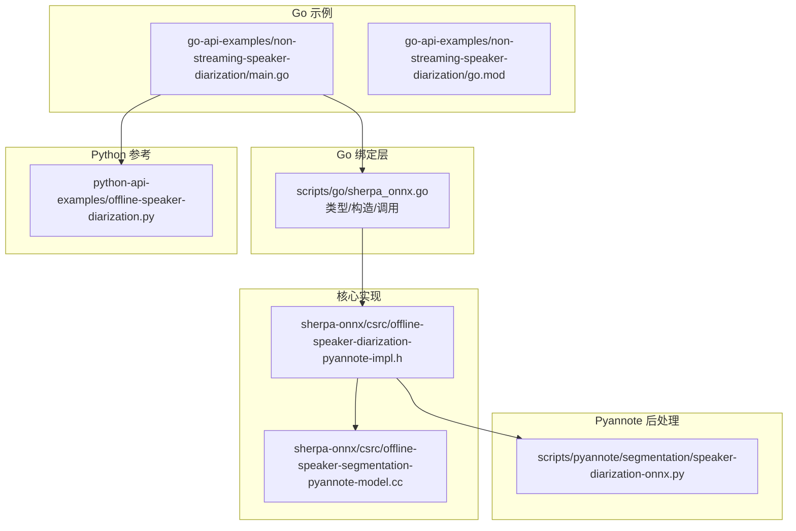
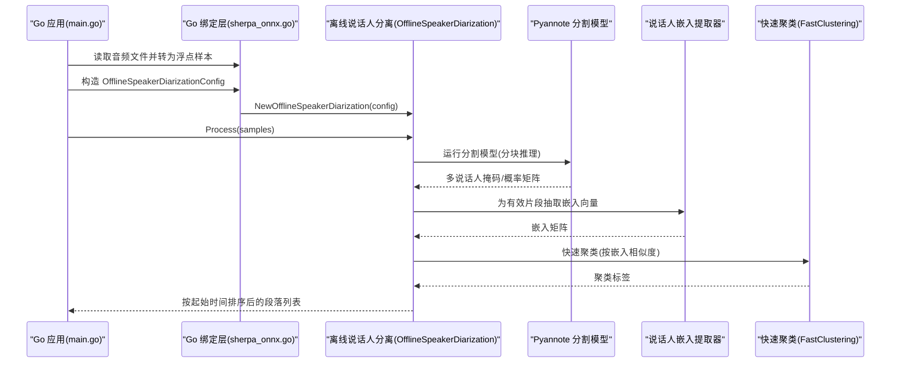
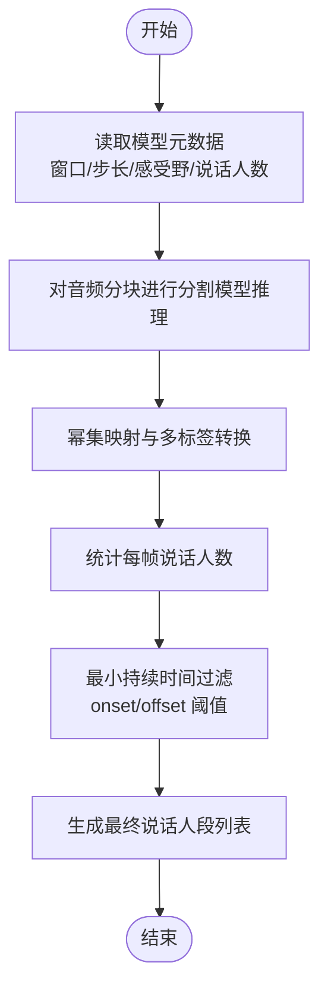
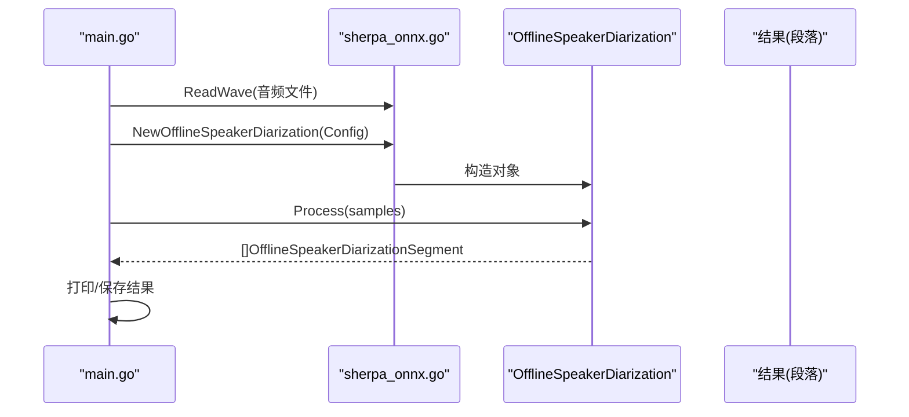
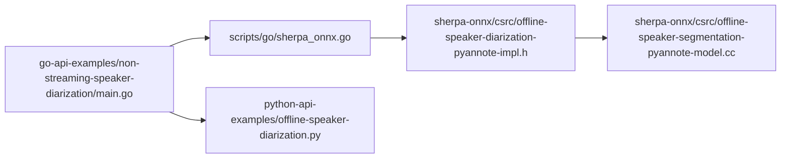

# 说话人分离示例

<cite>
**本文引用的文件**
- [go-api-examples/non-streaming-speaker-diarization/main.go](file://go-api-examples/non-streaming-speaker-diarization/main.go)
- [go-api-examples/non-streaming-speaker-diarization/go.mod](file://go-api-examples/non-streaming-speaker-diarization/go.mod)
- [scripts/go/sherpa_onnx.go](file://scripts/go/sherpa_onnx.go)
- [python-api-examples/offline-speaker-diarization.py](file://python-api-examples/offline-speaker-diarization.py)
- [sherpa-onnx/csrc/offline-speaker-diarization-pyannote-impl.h](file://sherpa-onnx/csrc/offline-speaker-diarization-pyannote-impl.h)
- [sherpa-onnx/csrc/offline-speaker-segmentation-pyannote-model.cc](file://sherpa-onnx/csrc/offline-speaker-segmentation-pyannote-model.cc)
- [scripts/pyannote/segmentation/speaker-diarization-onnx.py](file://scripts/pyannote/segmentation/speaker-diarization-onnx.py)
- [go-api-examples/speaker-identification/main.go](file://go-api-examples/speaker-identification/main.go)
</cite>

## 目录
1. [简介](#简介)
2. [项目结构](#项目结构)
3. [核心组件](#核心组件)
4. [架构总览](#架构总览)
5. [详细组件分析](#详细组件分析)
6. [依赖关系分析](#依赖关系分析)
7. [性能与参数调优](#性能与参数调优)
8. [故障排查指南](#故障排查指南)
9. [结论](#结论)
10. [附录：应用场景与实践建议](#附录应用场景与实践建议)

## 简介
本文件围绕 sherpa-onnx 的 Go API 示例，系统讲解非流式说话人分离（离线说话人分割与聚类）的实现原理与使用方法。重点覆盖：
- 时频掩码与语音分割技术在 Pyannote 分割模型中的作用与流程
- 使用 Go API 进行非流式说话人分离的完整步骤：音频输入处理、说话人聚类、结果输出
- 实际应用案例：多说话人会议记录、法庭录音分析等

该示例基于 Go 语言的非流式 API，结合 Pyannote 分割模型与说话人嵌入提取器，完成端到端的说话人分割与聚类。

## 项目结构
与“说话人分离示例”直接相关的文件组织如下：
- Go 示例入口与模块定义：go-api-examples/non-streaming-speaker-diarization
- Go 绑定层（类型、构造、调用）：scripts/go/sherpa_onnx.go
- Python 示例（参考实现）：python-api-examples/offline-speaker-diarization.py
- 核心 C++ 实现（分割、嵌入、聚类、后处理）：sherpa-onnx/csrc 下的对应头文件与模型实现
- Pyannote 分割脚本（ONNX 推理与后处理）：scripts/pyannote/segmentation/speaker-diarization-onnx.py

图表来源
- [go-api-examples/non-streaming-speaker-diarization/main.go](file://go-api-examples/non-streaming-speaker-diarization/main.go#L1-L88)
- [go-api-examples/non-streaming-speaker-diarization/go.mod](file://go-api-examples/non-streaming-speaker-diarization/go.mod#L1-L4)
- [scripts/go/sherpa_onnx.go](file://scripts/go/sherpa_onnx.go#L1735-L1851)
- [python-api-examples/offline-speaker-diarization.py](file://python-api-examples/offline-speaker-diarization.py#L1-L137)
- [sherpa-onnx/csrc/offline-speaker-diarization-pyannote-impl.h](file://sherpa-onnx/csrc/offline-speaker-diarization-pyannote-impl.h#L94-L185)
- [sherpa-onnx/csrc/offline-speaker-segmentation-pyannote-model.cc](file://sherpa-onnx/csrc/offline-speaker-segmentation-pyannote-model.cc#L85-L118)
- [scripts/pyannote/segmentation/speaker-diarization-onnx.py](file://scripts/pyannote/segmentation/speaker-diarization-onnx.py#L427-L469)

章节来源
- [go-api-examples/non-streaming-speaker-diarization/main.go](file://go-api-examples/non-streaming-speaker-diarization/main.go#L1-L88)
- [go-api-examples/non-streaming-speaker-diarization/go.mod](file://go-api-examples/non-streaming-speaker-diarization/go.mod#L1-L4)

## 核心组件
- 非流式说话人分离对象（Go API）
  - 类型与构造：OfflineSpeakerDiarizationConfig、OfflineSpeakerDiarization
  - 方法：NewOfflineSpeakerDiarization、SampleRate、SetConfig、Process
  - 结果结构：OfflineSpeakerDiarizationSegment（包含起始时间、结束时间、说话人编号）

- 说话人嵌入提取器（Go API）
  - 用于从分割出的说话人片段中抽取嵌入向量，供后续聚类使用
  - 类型：SpeakerEmbeddingExtractorConfig、SpeakerEmbeddingExtractor、SpeakerEmbeddingManager

- Pyannote 分割模型（C++ 实现）
  - 负责对输入音频进行时频建模与说话人活动检测，输出多说话人掩码或概率矩阵
  - 提供元数据：窗口大小、窗口步长、感受野步长、说话人数上限等

- 聚类与后处理（C++ 实现）
  - 基于嵌入向量进行快速聚类，生成最终说话人标签序列
  - 对分割标签进行重标定、计数、阈值化与最小持续时间过滤

章节来源
- [scripts/go/sherpa_onnx.go](file://scripts/go/sherpa_onnx.go#L1735-L1851)
- [scripts/go/sherpa_onnx.go](file://scripts/go/sherpa_onnx.go#L1528-L1624)
- [sherpa-onnx/csrc/offline-speaker-diarization-pyannote-impl.h](file://sherpa-onnx/csrc/offline-speaker-diarization-pyannote-impl.h#L94-L185)
- [sherpa-onnx/csrc/offline-speaker-segmentation-pyannote-model.cc](file://sherpa-onnx/csrc/offline-speaker-segmentation-pyannote-model.cc#L85-L118)

## 架构总览
下图展示了非流式说话人分离在 Go API 中的整体调用链路与关键模块交互。

图表来源
- [go-api-examples/non-streaming-speaker-diarization/main.go](file://go-api-examples/non-streaming-speaker-diarization/main.go#L37-L87)
- [scripts/go/sherpa_onnx.go](file://scripts/go/sherpa_onnx.go#L1768-L1851)
- [sherpa-onnx/csrc/offline-speaker-diarization-pyannote-impl.h](file://sherpa-onnx/csrc/offline-speaker-diarization-pyannote-impl.h#L94-L185)

## 详细组件分析

### 1) 时频掩码生成与语音分割（Pyannote）
- 模型元数据
  - 窗口大小、窗口步长、感受野步长、说话人数上限、类别数等由模型元数据提供，用于确定帧级推理粒度与标签映射。
- 多说话人掩码
  - 将每帧的预测映射到幂集空间，再还原到多说话人标签矩阵，得到每个说话人在每帧是否活跃的二值矩阵。
- 最小持续时间与阈值
  - 通过 min_duration_on/min_duration_off 与 onset/offset 阈值，将连续的活动片段合并为最终的说话人段，并去除短片段噪声。

图表来源
- [sherpa-onnx/csrc/offline-speaker-segmentation-pyannote-model.cc](file://sherpa-onnx/csrc/offline-speaker-segmentation-pyannote-model.cc#L85-L118)
- [sherpa-onnx/csrc/offline-speaker-diarization-pyannote-impl.h](file://sherpa-onnx/csrc/offline-speaker-diarization-pyannote-impl.h#L190-L332)
- [scripts/pyannote/segmentation/speaker-diarization-onnx.py](file://scripts/pyannote/segmentation/speaker-diarization-onnx.py#L427-L469)

章节来源
- [sherpa-onnx/csrc/offline-speaker-segmentation-pyannote-model.cc](file://sherpa-onnx/csrc/offline-speaker-segmentation-pyannote-model.cc#L85-L118)
- [sherpa-onnx/csrc/offline-speaker-diarization-pyannote-impl.h](file://sherpa-onnx/csrc/offline-speaker-diarization-pyannote-impl.h#L190-L332)
- [scripts/pyannote/segmentation/speaker-diarization-onnx.py](file://scripts/pyannote/segmentation/speaker-diarization-onnx.py#L427-L469)

### 2) 说话人聚类与结果输出（Go API）
- 配置项
  - 分割模型路径、嵌入模型路径、聚类方式（固定数量或阈值）、最小持续时间等。
- 输入处理
  - 读取 WAV 文件，确保采样率与模型一致；若不一致需重采样。
- 调用流程
  - 创建离线说话人分离对象
  - 调用 Process 获取段落列表
  - 输出每个段落的起止时间与说话人编号

图表来源
- [go-api-examples/non-streaming-speaker-diarization/main.go](file://go-api-examples/non-streaming-speaker-diarization/main.go#L37-L87)
- [scripts/go/sherpa_onnx.go](file://scripts/go/sherpa_onnx.go#L1768-L1851)

章节来源
- [go-api-examples/non-streaming-speaker-diarization/main.go](file://go-api-examples/non-streaming-speaker-diarization/main.go#L37-L87)
- [scripts/go/sherpa_onnx.go](file://scripts/go/sherpa_onnx.go#L1768-L1851)

### 3) 说话人嵌入与识别（可选）
- 当需要对说话人进行身份识别或注册时，可使用嵌入提取器与管理器：
  - 提取嵌入向量
  - 注册说话人模板
  - 搜索匹配说话人

章节来源
- [go-api-examples/speaker-identification/main.go](file://go-api-examples/speaker-identification/main.go#L1-L106)
- [scripts/go/sherpa_onnx.go](file://scripts/go/sherpa_onnx.go#L1528-L1624)

## 依赖关系分析
- Go 示例依赖 Go 绑定层提供的类型与函数
- Go 绑定层进一步封装底层 C++ 实现
- 核心实现依赖 Pyannote 分割模型与嵌入提取器
- Python 示例可作为行为与参数设置的参考

图表来源
- [go-api-examples/non-streaming-speaker-diarization/main.go](file://go-api-examples/non-streaming-speaker-diarization/main.go#L1-L88)
- [scripts/go/sherpa_onnx.go](file://scripts/go/sherpa_onnx.go#L1735-L1851)
- [sherpa-onnx/csrc/offline-speaker-diarization-pyannote-impl.h](file://sherpa-onnx/csrc/offline-speaker-diarization-pyannote-impl.h#L94-L185)
- [sherpa-onnx/csrc/offline-speaker-segmentation-pyannote-model.cc](file://sherpa-onnx/csrc/offline-speaker-segmentation-pyannote-model.cc#L85-L118)
- [python-api-examples/offline-speaker-diarization.py](file://python-api-examples/offline-speaker-diarization.py#L1-L137)

章节来源
- [go-api-examples/non-streaming-speaker-diarization/main.go](file://go-api-examples/non-streaming-speaker-diarization/main.go#L1-L88)
- [scripts/go/sherpa_onnx.go](file://scripts/go/sherpa_onnx.go#L1735-L1851)
- [sherpa-onnx/csrc/offline-speaker-diarization-pyannote-impl.h](file://sherpa-onnx/csrc/offline-speaker-diarization-pyannote-impl.h#L94-L185)
- [sherpa-onnx/csrc/offline-speaker-segmentation-pyannote-model.cc](file://sherpa-onnx/csrc/offline-speaker-segmentation-pyannote-model.cc#L85-L118)
- [python-api-examples/offline-speaker-diarization.py](file://python-api-examples/offline-speaker-diarization.py#L1-L137)

## 性能与参数调优
- 分割模型
  - 窗口大小与步长影响帧分辨率与计算开销；步长越小越精细但更慢。
  - Provider 与 NumThreads 影响推理速度；CPU/GPU 上可选择不同 Provider。
- 聚类参数
  - 固定聚类数 vs 阈值：已知说话人数时设 NumClusters；未知时使用阈值，较小阈值产生更多聚类。
  - MinDurationOn/MinDurationOff 控制段落最小持续时间，减少噪声片段。
- 嵌入提取
  - 嵌入维度与模型复杂度影响聚类质量；高维嵌入通常更稳定但计算成本更高。
- I/O 与重采样
  - 确保音频采样率与模型一致，避免额外重采样开销；批量处理可提升吞吐。

[本节为通用指导，无需具体文件分析]

## 故障排查指南
- 采样率不匹配
  - 现象：运行时报错或结果异常
  - 处理：检查模型期望采样率与输入音频采样率，必要时重采样
- 模型文件缺失或路径错误
  - 现象：初始化失败或空结果
  - 处理：确认分割模型与嵌入模型路径正确
- 无说话人或聚类为空
  - 现象：返回空段落列表
  - 处理：调整阈值、最小持续时间；检查音频信噪比与说话人数量
- 性能问题
  - 现象：处理缓慢
  - 处理：降低 NumThreads 或切换到 GPU Provider；减小窗口步长以提高精度但增加耗时

章节来源
- [go-api-examples/non-streaming-speaker-diarization/main.go](file://go-api-examples/non-streaming-speaker-diarization/main.go#L60-L87)
- [scripts/go/sherpa_onnx.go](file://scripts/go/sherpa_onnx.go#L1768-L1851)
- [sherpa-onnx/csrc/offline-speaker-diarization-pyannote-impl.h](file://sherpa-onnx/csrc/offline-speaker-diarization-pyannote-impl.h#L94-L185)

## 结论
本示例展示了如何使用 sherpa-onnx 的 Go API 完成非流式说话人分离：通过 Pyannote 分割模型生成时频掩码与多说话人标签，结合嵌入提取器与快速聚类，最终输出带说话人编号的时间段列表。Go API 提供了简洁的类型与方法，便于在生产环境中集成。对于未知说话人数的场景，推荐使用阈值聚类；对于已知人数的场景，固定聚类数更可控。配合合理的参数调优与重采样策略，可在会议记录与法庭录音等实际应用中取得良好效果。

[本节为总结，无需具体文件分析]

## 附录：应用场景与实践建议
- 多说话人会议记录
  - 建议：固定聚类数为参会人数；适当提高 MinDurationOff 以去除短暂停顿；必要时启用嵌入识别进行说话人身份标注。
- 法庭录音分析
  - 建议：先进行静音检测与降噪预处理；使用阈值聚类自动发现发言者；导出带时间戳的转写与说话人标签，便于后续检索与归档。
- 数据准备与模型下载
  - 可参考示例注释中的模型与测试音频下载链接，确保模型版本与示例一致。

章节来源
- [go-api-examples/non-streaming-speaker-diarization/main.go](file://go-api-examples/non-streaming-speaker-diarization/main.go#L8-L35)
- [python-api-examples/offline-speaker-diarization.py](file://python-api-examples/offline-speaker-diarization.py#L10-L33)