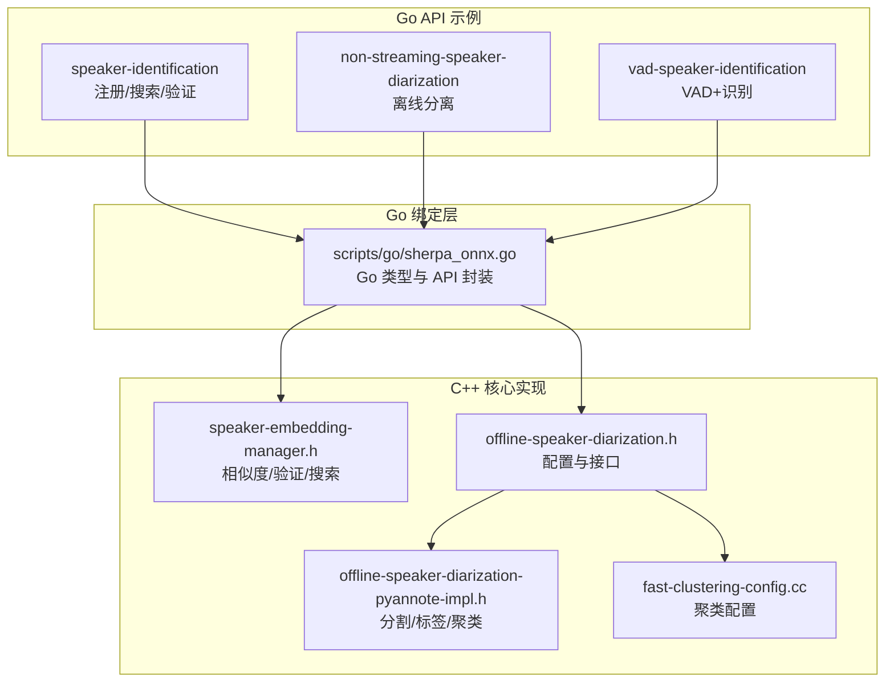
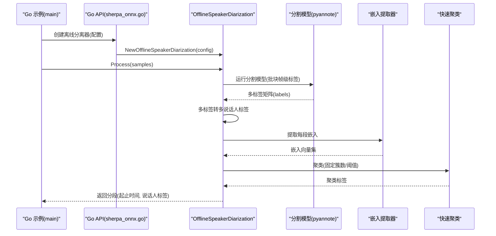
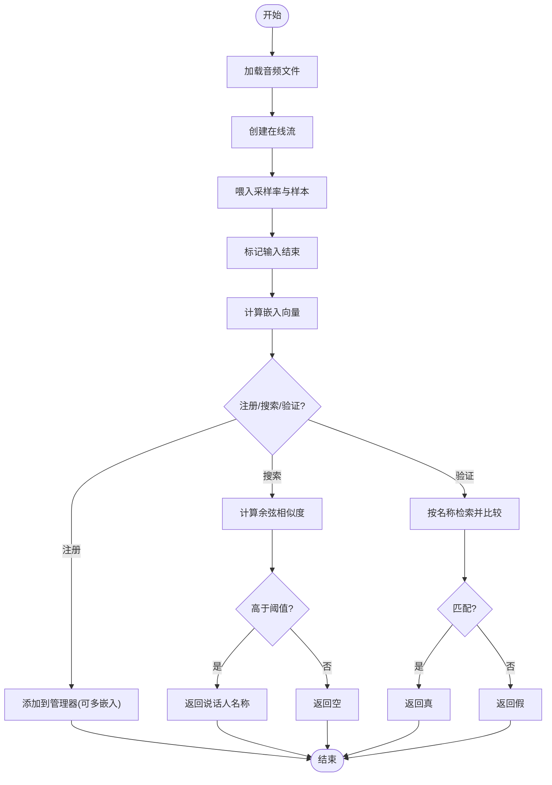
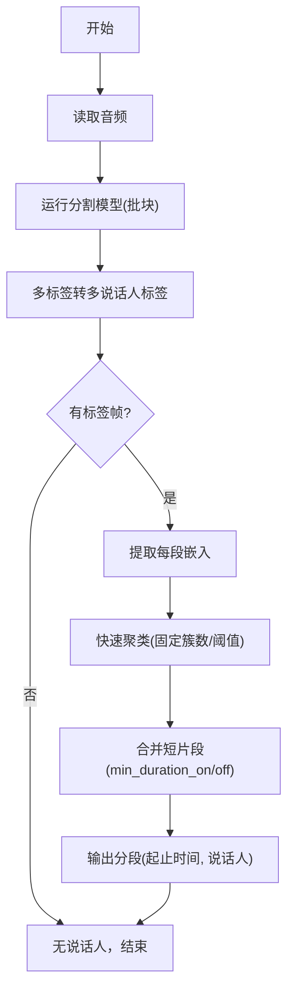
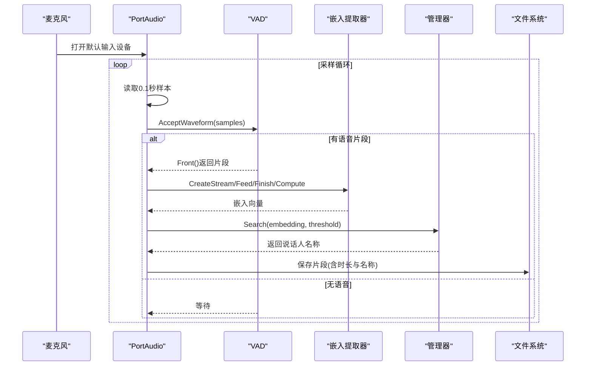
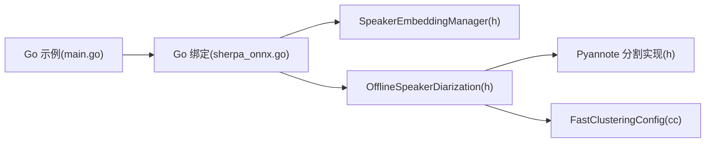

# 说话人相关功能示例

<cite>
**本文引用的文件**
- [go-api-examples/speaker-identification/main.go](file://go-api-examples/speaker-identification/main.go)
- [go-api-examples/non-streaming-speaker-diarization/main.go](file://go-api-examples/non-streaming-speaker-diarization/main.go)
- [go-api-examples/vad-speaker-identification/main.go](file://go-api-examples/vad-speaker-identification/main.go)
- [scripts/go/sherpa_onnx.go](file://scripts/go/sherpa_onnx.go)
- [sherpa-onnx/csrc/speaker-embedding-manager.h](file://sherpa-onnx/csrc/speaker-embedding-manager.h)
- [sherpa-onnx/csrc/offline-speaker-diarization.h](file://sherpa-onnx/csrc/offline-speaker-diarization.h)
- [sherpa-onnx/csrc/offline-speaker-diarization-pyannote-impl.h](file://sherpa-onnx/csrc/offline-speaker-diarization-pyannote-impl.h)
- [sherpa-onnx/csrc/fast-clustering-config.cc](file://sherpa-onnx/csrc/fast-clustering-config.cc)
- [go-api-examples/README.md](file://go-api-examples/README.md)
</cite>

## 目录
1. [简介](#简介)
2. [项目结构](#项目结构)
3. [核心组件](#核心组件)
4. [架构总览](#架构总览)
5. [详细组件分析](#详细组件分析)
6. [依赖关系分析](#依赖关系分析)
7. [性能与阈值建议](#性能与阈值建议)
8. [故障排查指南](#故障排查指南)
9. [结论](#结论)
10. [附录：应用场景示例](#附录应用场景示例)

## 简介
本文件围绕 sherpa-onnx 的 Go API 示例，系统讲解说话人嵌入提取、相似度计算与聚类、以及离线说话人分离（分段+聚类）的实现与使用方法。重点覆盖：
- 说话人嵌入提取与管理器的注册、搜索、验证与删除流程
- 基于余弦相似度的相似度计算与阈值策略
- 离线说话人分离的时频分割、嵌入提取与快速聚类
- 结合实时语音活动检测（VAD）的流式识别与保存片段
- 实际应用案例：多说话人会议记录与安全认证系统

## 项目结构
Go API 示例位于 go-api-examples 目录，包含三个与说话人相关的示例：
- 说话人识别（注册、比对、阈值）
- 离线说话人分离（分割模型 + 嵌入模型 + 聚类）
- VAD + 说话人识别（麦克风流式采集 + 分片 + 识别 + 保存）

图表来源
- [go-api-examples/speaker-identification/main.go](file://go-api-examples/speaker-identification/main.go#L1-L147)
- [go-api-examples/non-streaming-speaker-diarization/main.go](file://go-api-examples/non-streaming-speaker-diarization/main.go#L1-L88)
- [go-api-examples/vad-speaker-identification/main.go](file://go-api-examples/vad-speaker-identification/main.go#L1-L222)
- [scripts/go/sherpa_onnx.go](file://scripts/go/sherpa_onnx.go#L1518-L1819)
- [sherpa-onnx/csrc/speaker-embedding-manager.h](file://sherpa-onnx/csrc/speaker-embedding-manager.h#L60-L121)
- [sherpa-onnx/csrc/offline-speaker-diarization.h](file://sherpa-onnx/csrc/offline-speaker-diarization.h#L1-L32)
- [sherpa-onnx/csrc/offline-speaker-diarization-pyannote-impl.h](file://sherpa-onnx/csrc/offline-speaker-diarization-pyannote-impl.h#L79-L125)
- [sherpa-onnx/csrc/fast-clustering-config.cc](file://sherpa-onnx/csrc/fast-clustering-config.cc#L1-L45)

章节来源
- [go-api-examples/README.md](file://go-api-examples/README.md#L1-L47)

## 核心组件
- 说话人嵌入提取器（Go API 封装）
  - 配置项：模型路径、线程数、调试开关、执行提供者
  - 关键能力：创建在线流、接受波形、输入结束、计算嵌入向量
- 说话人嵌入管理器（Go API 封装）
  - 注册/注销说话人
  - 搜索匹配（基于余弦相似度，返回名称或空）
  - 验证（给定名称与嵌入，判断是否匹配）
  - 查询集合（数量、名称列表、是否包含某名称）
- 离线说话人分离器（Go API 封装）
  - 配置：分割模型、嵌入模型、聚类配置、最小持续时间等
  - 处理：读取音频，运行分割模型，转为多标签，提取嵌入，聚类，输出分段结果
- 快速聚类配置
  - 支持固定簇数或阈值两种模式；阈值越小簇越多，越大越少

章节来源
- [scripts/go/sherpa_onnx.go](file://scripts/go/sherpa_onnx.go#L1518-L1819)
- [sherpa-onnx/csrc/speaker-embedding-manager.h](file://sherpa-onnx/csrc/speaker-embedding-manager.h#L60-L121)
- [sherpa-onnx/csrc/offline-speaker-diarization.h](file://sherpa-onnx/csrc/offline-speaker-diarization.h#L1-L32)
- [sherpa-onnx/csrc/fast-clustering-config.cc](file://sherpa-onnx/csrc/fast-clustering-config.cc#L1-L45)

## 架构总览
下面以“离线说话人分离”为例，展示从 Go 层到 C++ 核心的调用链路与数据流。

图表来源
- [go-api-examples/non-streaming-speaker-diarization/main.go](file://go-api-examples/non-streaming-speaker-diarization/main.go#L37-L87)
- [scripts/go/sherpa_onnx.go](file://scripts/go/sherpa_onnx.go#L1732-L1819)
- [sherpa-onnx/csrc/offline-speaker-diarization-pyannote-impl.h](file://sherpa-onnx/csrc/offline-speaker-diarization-pyannote-impl.h#L79-L125)
- [sherpa-onnx/csrc/fast-clustering-config.cc](file://sherpa-onnx/csrc/fast-clustering-config.cc#L1-L45)

## 详细组件分析

### 说话人嵌入提取与管理（识别/验证）
- 嵌入提取流程
  - 通过配置创建提取器
  - 为每个音频文件创建在线流，喂入采样率与样本，标记输入结束
  - 计算嵌入向量，得到固定维度的浮点数组
- 管理器操作
  - 注册：将多个嵌入向量平均后存入管理器
  - 搜索：对输入嵌入计算与库中所有嵌入的余弦相似度，返回最高分且不低于阈值的说话人名称
  - 验证：对指定名称与输入嵌入计算相似度，判断是否匹配
  - 删除：移除指定说话人
  - 查询：统计人数、列出全部名称、是否包含某名称

图表来源
- [go-api-examples/speaker-identification/main.go](file://go-api-examples/speaker-identification/main.go#L1-L147)
- [scripts/go/sherpa_onnx.go](file://scripts/go/sherpa_onnx.go#L1518-L1700)
- [sherpa-onnx/csrc/speaker-embedding-manager.h](file://sherpa-onnx/csrc/speaker-embedding-manager.h#L60-L121)

章节来源
- [go-api-examples/speaker-identification/main.go](file://go-api-examples/speaker-identification/main.go#L1-L147)
- [scripts/go/sherpa_onnx.go](file://scripts/go/sherpa_onnx.go#L1518-L1700)
- [sherpa-onnx/csrc/speaker-embedding-manager.h](file://sherpa-onnx/csrc/speaker-embedding-manager.h#L60-L121)

### 离线说话人分离（分割 + 嵌入 + 聚类）
- 配置要点
  - 分割模型：pyannote 分割模型
  - 嵌入模型：说话人嵌入提取模型
  - 聚类：固定簇数或阈值二选一
  - 最小持续时间 on/off：合并短片段
- 处理流程
  - 读取音频，按批块运行分割模型，得到多标签
  - 将多标签转换为每帧多说话人标签
  - 对有效片段提取嵌入向量
  - 使用快速聚类对嵌入进行聚类，得到每帧的说话人标签
  - 合并相邻同说话人片段，输出最终分段

图表来源
- [go-api-examples/non-streaming-speaker-diarization/main.go](file://go-api-examples/non-streaming-speaker-diarization/main.go#L37-L87)
- [scripts/go/sherpa_onnx.go](file://scripts/go/sherpa_onnx.go#L1732-L1819)
- [sherpa-onnx/csrc/offline-speaker-diarization-pyannote-impl.h](file://sherpa-onnx/csrc/offline-speaker-diarization-pyannote-impl.h#L79-L125)
- [sherpa-onnx/csrc/fast-clustering-config.cc](file://sherpa-onnx/csrc/fast-clustering-config.cc#L1-L45)

章节来源
- [go-api-examples/non-streaming-speaker-diarization/main.go](file://go-api-examples/non-streaming-speaker-diarization/main.go#L1-L88)
- [scripts/go/sherpa_onnx.go](file://scripts/go/sherpa_onnx.go#L1732-L1819)
- [sherpa-onnx/csrc/offline-speaker-diarization.h](file://sherpa-onnx/csrc/offline-speaker-diarization.h#L1-L32)
- [sherpa-onnx/csrc/offline-speaker-diarization-pyannote-impl.h](file://sherpa-onnx/csrc/offline-speaker-diarization-pyannote-impl.h#L79-L125)
- [sherpa-onnx/csrc/fast-clustering-config.cc](file://sherpa-onnx/csrc/fast-clustering-config.cc#L1-L45)

### VAD + 说话人识别（实时麦克风流）
- 流程概览
  - 初始化 VAD（Silero VAD），设置阈值、静音/语音最小时长、窗口大小
  - 打开麦克风流，周期性读取样本，喂给 VAD
  - 当检测到语音片段时，取出片段并交给嵌入提取器计算嵌入
  - 使用管理器搜索匹配说话人，输出识别结果并保存片段
- 关键参数
  - VAD 阈值：控制触发灵敏度
  - 片段长度：由窗口大小与采样率决定
  - 保存命名：包含时长与识别名

图表来源
- [go-api-examples/vad-speaker-identification/main.go](file://go-api-examples/vad-speaker-identification/main.go#L88-L222)
- [scripts/go/sherpa_onnx.go](file://scripts/go/sherpa_onnx.go#L1518-L1700)

章节来源
- [go-api-examples/vad-speaker-identification/main.go](file://go-api-examples/vad-speaker-identification/main.go#L1-L222)
- [scripts/go/sherpa_onnx.go](file://scripts/go/sherpa_onnx.go#L1518-L1700)

## 依赖关系分析
- Go API 示例依赖 Go 绑定层（scripts/go/sherpa_onnx.go）提供的类型与函数
- Go 绑定层进一步封装 C++ 核心组件：
  - 说话人嵌入管理器（相似度/验证/搜索）
  - 离线说话人分离器（配置、处理、聚类）
  - 快速聚类配置（固定簇数或阈值）
- 示例程序与核心组件之间的耦合度低，便于替换模型与参数

图表来源
- [go-api-examples/speaker-identification/main.go](file://go-api-examples/speaker-identification/main.go#L1-L147)
- [go-api-examples/non-streaming-speaker-diarization/main.go](file://go-api-examples/non-streaming-speaker-diarization/main.go#L1-L88)
- [go-api-examples/vad-speaker-identification/main.go](file://go-api-examples/vad-speaker-identification/main.go#L1-L222)
- [scripts/go/sherpa_onnx.go](file://scripts/go/sherpa_onnx.go#L1518-L1819)
- [sherpa-onnx/csrc/speaker-embedding-manager.h](file://sherpa-onnx/csrc/speaker-embedding-manager.h#L60-L121)
- [sherpa-onnx/csrc/offline-speaker-diarization.h](file://sherpa-onnx/csrc/offline-speaker-diarization.h#L1-L32)
- [sherpa-onnx/csrc/offline-speaker-diarization-pyannote-impl.h](file://sherpa-onnx/csrc/offline-speaker-diarization-pyannote-impl.h#L79-L125)
- [sherpa-onnx/csrc/fast-clustering-config.cc](file://sherpa-onnx/csrc/fast-clustering-config.cc#L1-L45)

## 性能与阈值建议
- 嵌入维度与相似度
  - 管理器按固定维度存储嵌入，维度由所选嵌入模型决定
  - 相似度采用余弦相似度，阈值在 0~1 之间
- 阈值选择
  - 识别场景：建议 0.6~0.7，兼顾召回与精度
  - 验证场景：建议 0.7~0.8，降低误匹配概率
- 聚类配置
  - 已知说话人数：优先使用固定簇数
  - 不确定人数：使用阈值，阈值越小簇越多，越大越少
- VAD 参数
  - 阈值过高易漏检，过低易误检；结合静音/语音最小时长优化
- 并发与资源
  - 提高 NumThreads 可提升吞吐，但需平衡 CPU 占用
  - Provider 选择 CPU/GPU 影响推理速度与内存占用

[本节为通用指导，不直接分析具体文件]

## 故障排查指南
- 常见问题
  - 无法读取音频：检查文件路径与采样率
  - 分离结果为空：确认分割模型可用、标签转换逻辑正常
  - 聚类失败：检查聚类配置（固定簇数或阈值至少提供一个）
  - 识别无匹配：调整阈值或增加注册样本
  - VAD 未检测到语音：检查阈值、窗口大小与设备权限
- 定位方法
  - 查看 Go 示例日志输出
  - 在 Go 层打印中间变量（嵌入维度、片段时长、聚类标签数量）
  - 在 C++ 层增加日志（分割模型输出、标签统计、聚类输入）

章节来源
- [go-api-examples/speaker-identification/main.go](file://go-api-examples/speaker-identification/main.go#L1-L147)
- [go-api-examples/non-streaming-speaker-diarization/main.go](file://go-api-examples/non-streaming-speaker-diarization/main.go#L59-L87)
- [go-api-examples/vad-speaker-identification/main.go](file://go-api-examples/vad-speaker-identification/main.go#L110-L186)
- [sherpa-onnx/csrc/fast-clustering-config.cc](file://sherpa-onnx/csrc/fast-clustering-config.cc#L36-L45)

## 结论
- 该 Go API 示例清晰展示了从嵌入提取到相似度计算、从离线分离到实时识别的完整链路
- 通过管理器与快速聚类，用户可以灵活地在已知人数与未知人数场景下完成说话人识别与分离
- 结合 VAD 的实时方案适合会议记录与安全认证等场景

[本节为总结，不直接分析具体文件]

## 附录：应用场景示例
- 多说话人会议记录
  - 使用离线分离器对会议录音进行分段标注，再对每段进行识别与转写
  - 优点：无需实时流，准确度高
- 安全认证系统
  - 用户首次注册时采集多段音频，注册到管理器
  - 日常认证时使用 VAD 检测语音片段，实时提取嵌入并验证
  - 优点：实时性强，可与门禁/支付等系统联动

[本节为概念性示例，不直接分析具体文件]