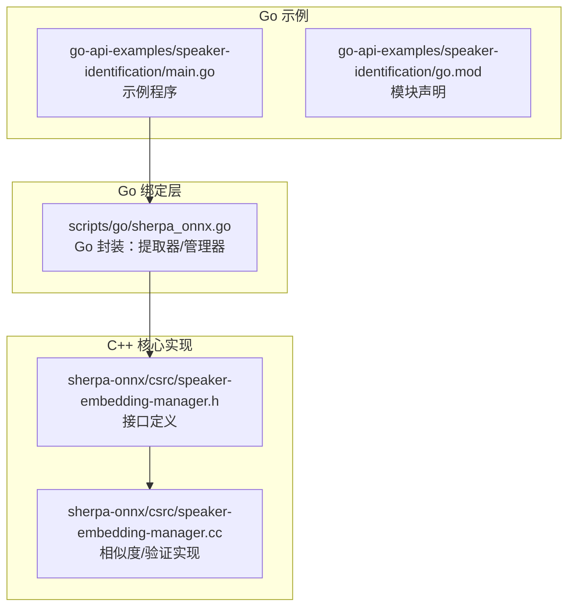
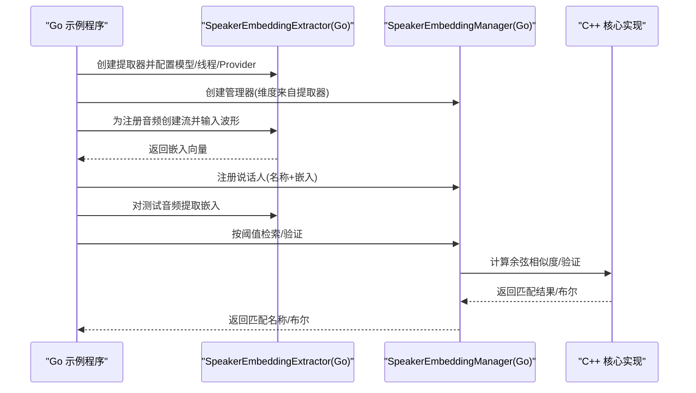
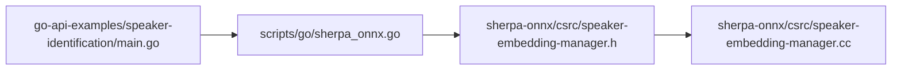

# 说话人识别示例

<cite>
**本文引用的文件**
- [go-api-examples/speaker-identification/main.go](file://go-api-examples/speaker-identification/main.go)
- [go-api-examples/speaker-identification/go.mod](file://go-api-examples/speaker-identification/go.mod)
- [go-api-examples/README.md](file://go-api-examples/README.md)
- [scripts/go/sherpa_onnx.go](file://scripts/go/sherpa_onnx.go)
- [sherpa-onnx/csrc/speaker-embedding-manager.h](file://sherpa-onnx/csrc/speaker-embedding-manager.h)
- [sherpa-onnx/csrc/speaker-embedding-manager.cc](file://sherpa-onnx/csrc/speaker-embedding-manager.cc)
- [java-api-examples/SpeakerIdentification.java](file://java-api-examples/SpeakerIdentification.java)
- [dart-api-examples/speaker-identification/bin/speaker_id.dart](file://dart-api-examples/speaker-identification/bin/speaker_id.dart)
- [dotnet-examples/speaker-identification/Program.cs](file://dotnet-examples/speaker-identification/Program.cs)
- [nodejs-addon-examples/test_speaker_identification.js](file://nodejs-addon-examples/test_speaker_identification.js)
</cite>

## 目录
1. [简介](#简介)
2. [项目结构](#项目结构)
3. [核心组件](#核心组件)
4. [架构总览](#架构总览)
5. [组件详解](#组件详解)
6. [依赖关系分析](#依赖关系分析)
7. [性能与阈值建议](#性能与阈值建议)
8. [故障排查指南](#故障排查指南)
9. [结论](#结论)
10. [附录](#附录)

## 简介
本文件围绕 sherpa-onnx 的 Go API 示例，系统讲解“说话人嵌入提取”和“相似度计算”的实现原理与使用方法，覆盖注册、比对、阈值设置等关键流程，并给出安全认证系统与个人语音助手两类典型应用场景的实践思路。读者可据此在 Go 中快速完成从音频到说话人嵌入的抽取、存储、检索与验证。

## 项目结构
- Go 示例入口位于 go-api-examples/speaker-identification/main.go，演示了完整的注册、识别与注销流程。
- Go 绑定层位于 scripts/go/sherpa_onnx.go，封装了 C 层接口，提供 Go 可用的 SpeakerEmbeddingExtractor 与 SpeakerEmbeddingManager。
- 核心算法实现位于 sherpa-onnx/csrc/speaker-embedding-manager.{h,cc}，包含相似度计算、验证与查询逻辑。
- 其他语言示例（Java/Dart/DotNet/Node）用于对比一致的 API 行为，便于迁移与对照。

图表来源
- [go-api-examples/speaker-identification/main.go](file://go-api-examples/speaker-identification/main.go#L1-L147)
- [scripts/go/sherpa_onnx.go](file://scripts/go/sherpa_onnx.go#L1520-L1696)
- [sherpa-onnx/csrc/speaker-embedding-manager.h](file://sherpa-onnx/csrc/speaker-embedding-manager.h#L70-L101)
- [sherpa-onnx/csrc/speaker-embedding-manager.cc](file://sherpa-onnx/csrc/speaker-embedding-manager.cc#L158-L214)

章节来源
- [go-api-examples/speaker-identification/main.go](file://go-api-examples/speaker-identification/main.go#L1-L147)
- [go-api-examples/speaker-identification/go.mod](file://go-api-examples/speaker-identification/go.mod#L1-L4)
- [go-api-examples/README.md](file://go-api-examples/README.md#L1-L47)

## 核心组件
- 说话人嵌入提取器（SpeakerEmbeddingExtractor）
  - 负责从音频流中提取固定维度的说话人嵌入向量。
  - Go 封装提供配置、创建流、接受波形、输入结束、计算嵌入等能力。
- 说话人嵌入管理器（SpeakerEmbeddingManager）
  - 负责注册说话人、按阈值检索、单人验证、查询全部说话人等。
  - Go 封装提供注册、批量注册、删除、查询、验证、存在性检查、统计等能力。
- 相似度计算与阈值
  - 基于余弦相似度，返回匹配分数；高于阈值视为匹配。
  - 验证流程针对特定说话人名进行精确匹配。

章节来源
- [scripts/go/sherpa_onnx.go](file://scripts/go/sherpa_onnx.go#L1520-L1696)
- [sherpa-onnx/csrc/speaker-embedding-manager.h](file://sherpa-onnx/csrc/speaker-embedding-manager.h#L70-L101)
- [sherpa-onnx/csrc/speaker-embedding-manager.cc](file://sherpa-onnx/csrc/speaker-embedding-manager.cc#L158-L214)

## 架构总览
下图展示 Go 示例调用链路：示例程序通过 Go 绑定层调用 C++ 提取器与管理器，后者基于余弦相似度完成识别与验证。

图表来源
- [go-api-examples/speaker-identification/main.go](file://go-api-examples/speaker-identification/main.go#L1-L147)
- [scripts/go/sherpa_onnx.go](file://scripts/go/sherpa_onnx.go#L1520-L1696)
- [sherpa-onnx/csrc/speaker-embedding-manager.cc](file://sherpa-onnx/csrc/speaker-embedding-manager.cc#L158-L214)

## 组件详解

### 1) 说话人嵌入提取（Go API）
- 关键步骤
  - 配置提取器：指定模型路径、线程数、调试开关、执行后端 Provider。
  - 创建在线流：为每条音频创建独立流。
  - 输入波形：将采样率与样本数组传入流。
  - 结束输入：标记输入完成以触发推理。
  - 计算嵌入：返回固定维度浮点向量。
- Go 封装要点
  - NewSpeakerEmbeddingExtractor/Dim/CreateStream/IsReady/Compute 等方法映射至 C++ 接口。
  - Compute 返回的嵌入需释放，Go 层已自动处理。
- 实战建议
  - 多段录音可拼接多次输入，最终统一提取一个嵌入或分别提取多个嵌入再聚合（见批量注册）。

章节来源
- [go-api-examples/speaker-identification/main.go](file://go-api-examples/speaker-identification/main.go#L1-L147)
- [scripts/go/sherpa_onnx.go](file://scripts/go/sherpa_onnx.go#L1520-L1592)

### 2) 说话人注册与管理（Go API）
- 注册
  - 单嵌入注册：Register(name, embedding)。
  - 批量注册：RegisterV(name, embeddings[])，内部将多段嵌入展平后注册。
- 查询与验证
  - Search(embedding, threshold)：返回最匹配的说话人名称，否则为空。
  - Verify(name, embedding, threshold)：对指定说话人进行二分类验证。
  - Contains(name)/Remove(name)/NumSpeakers()/AllSpeakers()：管理说话人集合。
- Go 封装要点
  - Search/Verify/Contains/AllSpeakers 等均通过 CGO 调用 C++ 实现，并注意字符串资源释放。

章节来源
- [go-api-examples/speaker-identification/main.go](file://go-api-examples/speaker-identification/main.go#L43-L140)
- [scripts/go/sherpa_onnx.go](file://scripts/go/sherpa_onnx.go#L1615-L1696)

### 3) 相似度计算与阈值（C++ 核心）
- 相似度
  - 使用余弦相似度比较输入嵌入与已注册嵌入，返回分数。
- 阈值
  - Search/Verify 均要求提供阈值，通常在 0~1 区间；越高越严格。
- 验证流程
  - Verify 针对特定说话人名，若该说话人不存在则直接失败。
  - Score 可用于获取具体分数以便调试与可视化。

章节来源
- [sherpa-onnx/csrc/speaker-embedding-manager.h](file://sherpa-onnx/csrc/speaker-embedding-manager.h#L70-L101)
- [sherpa-onnx/csrc/speaker-embedding-manager.cc](file://sherpa-onnx/csrc/speaker-embedding-manager.cc#L158-L214)

### 4) 其他语言示例对比（参考）
- Java/Dart/DotNet/Node 示例展示了相同的注册、检索、验证与阈值使用模式，便于跨语言迁移。

章节来源
- [java-api-examples/SpeakerIdentification.java](file://java-api-examples/SpeakerIdentification.java#L90-L132)
- [dart-api-examples/speaker-identification/bin/speaker_id.dart](file://dart-api-examples/speaker-identification/bin/speaker_id.dart#L115-L160)
- [dotnet-examples/speaker-identification/Program.cs](file://dotnet-examples/speaker-identification/Program.cs#L92-L153)
- [nodejs-addon-examples/test_speaker_identification.js](file://nodejs-addon-examples/test_speaker_identification.js#L49-L102)

## 依赖关系分析
- Go 示例依赖 Go 绑定层，Go 绑定层依赖 C++ 核心实现。
- Go 绑定层提供：
  - SpeakerEmbeddingExtractorConfig/Dim/CreateStream/Compute
  - SpeakerEmbeddingManager 的注册、查询、验证、统计等方法
- C++ 核心实现提供：
  - 余弦相似度计算、验证、分数查询、说话人矩阵维护等

图表来源
- [go-api-examples/speaker-identification/main.go](file://go-api-examples/speaker-identification/main.go#L1-L147)
- [scripts/go/sherpa_onnx.go](file://scripts/go/sherpa_onnx.go#L1520-L1696)
- [sherpa-onnx/csrc/speaker-embedding-manager.h](file://sherpa-onnx/csrc/speaker-embedding-manager.h#L70-L101)
- [sherpa-onnx/csrc/speaker-embedding-manager.cc](file://sherpa-onnx/csrc/speaker-embedding-manager.cc#L158-L214)

章节来源
- [go-api-examples/speaker-identification/main.go](file://go-api-examples/speaker-identification/main.go#L1-L147)
- [scripts/go/sherpa_onnx.go](file://scripts/go/sherpa_onnx.go#L1520-L1696)
- [sherpa-onnx/csrc/speaker-embedding-manager.h](file://sherpa-onnx/csrc/speaker-embedding-manager.h#L70-L101)
- [sherpa-onnx/csrc/speaker-embedding-manager.cc](file://sherpa-onnx/csrc/speaker-embedding-manager.cc#L158-L214)

## 性能与阈值建议
- 性能
  - 合理设置 NumThreads 与 Provider，CPU/GPU 不同后端在不同设备上表现差异较大。
  - 批量注册时优先使用 RegisterV，避免多次 CGO 调用开销。
- 阈值
  - 初始阈值可参考 0.6 左右，结合测试集评估误识与拒识率，逐步调整。
  - 验证场景建议更高阈值，识别场景可略低但需配合置信度输出。
- 数据质量
  - 注册阶段尽量使用干净、长一点的音频，减少噪声与静音影响。
  - 测试阶段建议先做 VAD 或端点检测，提升鲁棒性。

[本节为通用建议，不直接分析具体文件]

## 故障排查指南
- 常见问题
  - 无法加载模型：确认模型路径正确且可读。
  - 嵌入维度不匹配：确保提取器维度与管理器初始化维度一致。
  - 验证失败：检查阈值是否过高；确认注册说话人是否存在。
  - 内存泄漏：Go 层已负责释放资源，但请勿重复释放或跨语言共享裸指针。
- 定位方法
  - 使用日志输出中间结果（如注册数量、查询返回名称）。
  - 在 C++ 层打印分数或状态，辅助判断阈值与相似度是否异常。

章节来源
- [go-api-examples/speaker-identification/main.go](file://go-api-examples/speaker-identification/main.go#L1-L147)
- [scripts/go/sherpa_onnx.go](file://scripts/go/sherpa_onnx.go#L1615-L1696)

## 结论
通过 Go API，sherpa-onnx 提供了简洁而强大的说话人识别能力：从音频到嵌入、从嵌入到注册与检索/验证，均可在 Go 中高效完成。结合合理的阈值与数据预处理策略，可在安全认证与个人语音助手等场景中稳定落地。

[本节为总结，不直接分析具体文件]

## 附录

### A. Go 示例运行步骤
- 准备模型与数据
  - 下载说话人嵌入模型并在示例中配置路径。
  - 准备注册与测试音频目录（示例中使用 sr-data）。
- 运行
  - 在 go-api-examples/speaker-identification 目录执行 go run main.go。
- 输出
  - 控制台会打印注册成功、检索结果、注销后的再次检索等日志。

章节来源
- [go-api-examples/speaker-identification/main.go](file://go-api-examples/speaker-identification/main.go#L1-L147)
- [go-api-examples/README.md](file://go-api-examples/README.md#L1-L47)

### B. API 方法一览（Go）
- 提取器
  - NewSpeakerEmbeddingExtractor(config)
  - Dim()/CreateStream()/IsReady()/Compute()
- 管理器
  - NewSpeakerEmbeddingManager(dim)
  - Register(name, embedding)/RegisterV(name, embeddings[])
  - Search(embedding, threshold)/Verify(name, embedding, threshold)
  - Contains(name)/Remove(name)/NumSpeakers()/AllSpeakers()

章节来源
- [scripts/go/sherpa_onnx.go](file://scripts/go/sherpa_onnx.go#L1520-L1696)

### C. 应用场景示例

- 安全认证系统
  - 注册阶段：采集用户语音，提取嵌入并注册到管理器。
  - 登录阶段：实时采集语音，提取嵌入，使用 Verify 进行强校验；阈值偏高，误识风险低。
  - 管理阶段：支持注销、查询全部人员名单，便于审计与运维。
- 个人语音助手
  - 识别阶段：对测试音频进行 Search，返回匹配说话人名称，用于个性化唤醒或指令路由。
  - 自适应阶段：定期更新注册嵌入，提高鲁棒性；结合 VAD 去除静音段，提升稳定性。

[本小节为概念性说明，不直接分析具体文件]