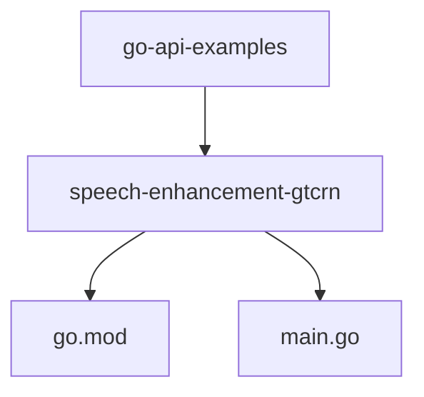
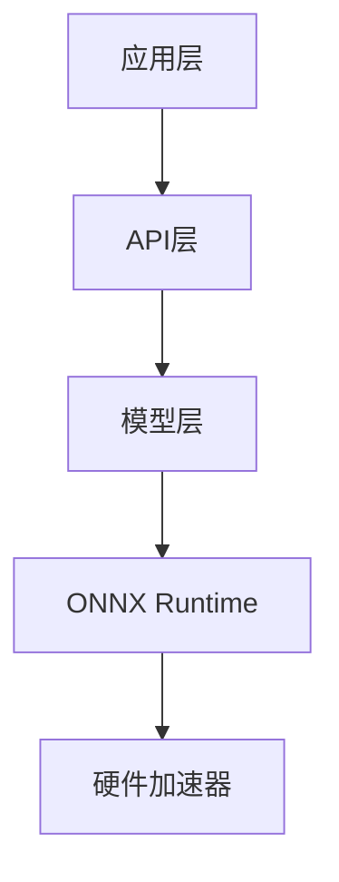
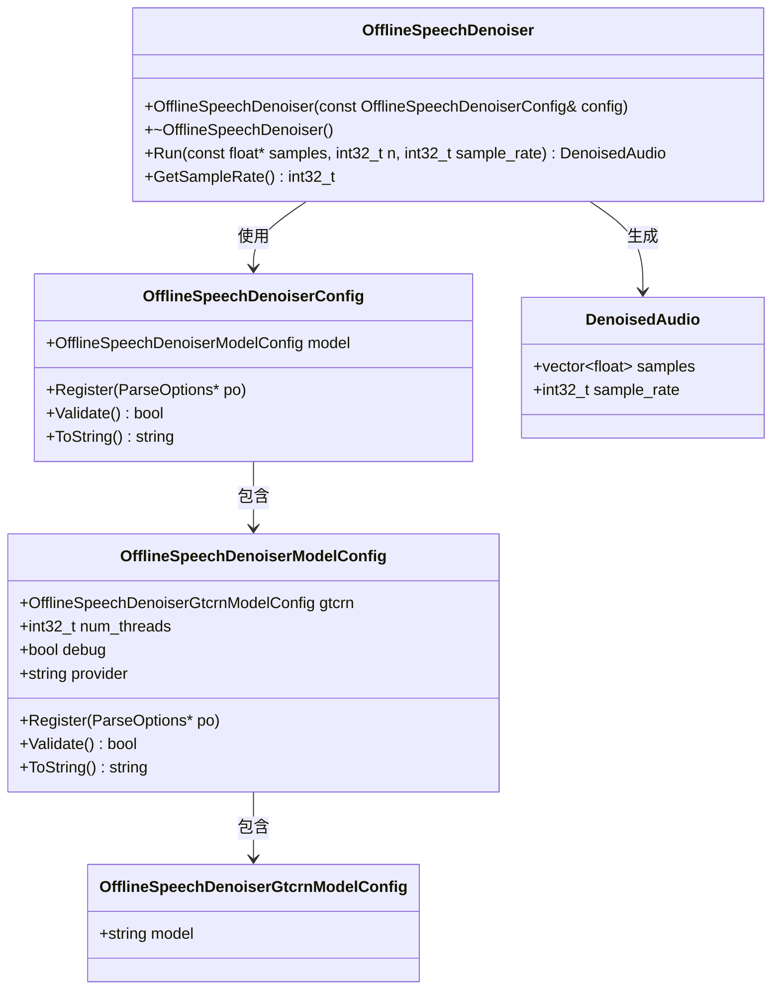
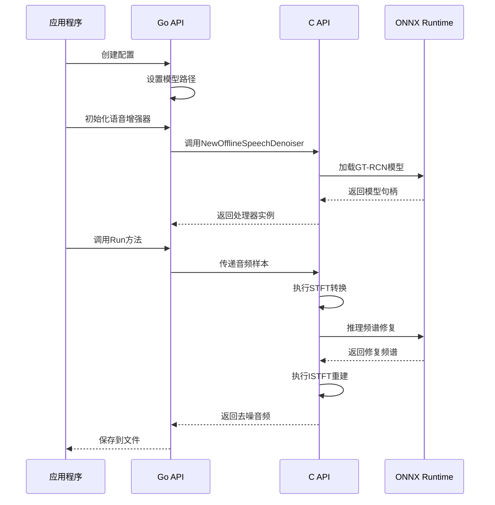
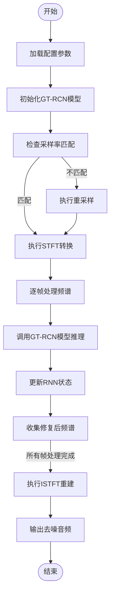
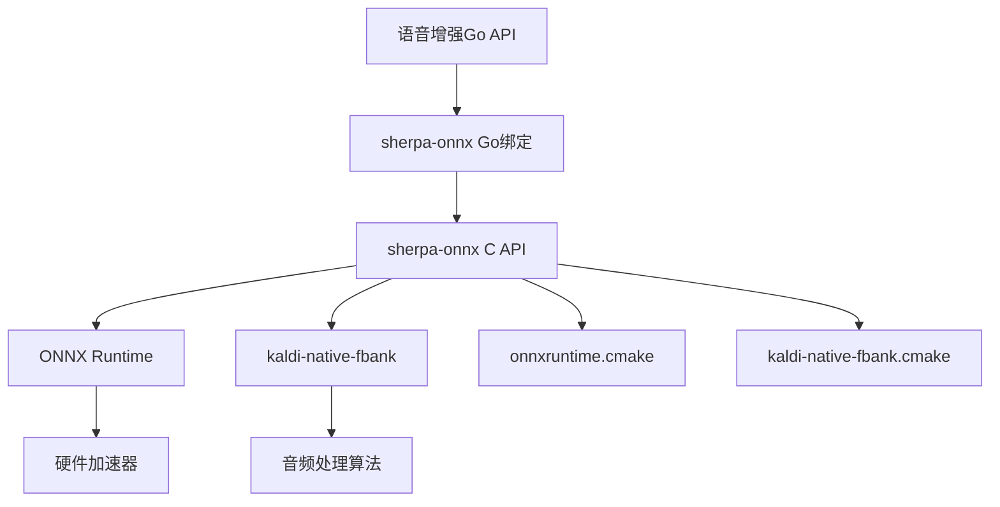

# 语音增强示例

<cite>
**本文档中引用的文件**  
- [main.go](file://go-api-examples/speech-enhancement-gtcrn/main.go)
- [go.mod](file://go-api-examples/speech-enhancement-gtcrn/go.mod)
- [offline-speech-denoiser-gtcrn-impl.h](file://sherpa-onnx/csrc/offline-speech-denoiser-gtcrn-impl.h)
- [offline-speech-denoiser.h](file://sherpa-onnx/csrc/offline-speech-denoiser.h)
- [offline-speech-denoiser-model-config.h](file://sherpa-onnx/csrc/offline-speech-denoiser-model-config.h)
- [offline-speech-denoiser-gtcrn-model-config.h](file://sherpa-onnx/csrc/offline-speech-denoiser-gtcrn-model-config.h)
</cite>

## 目录
1. [简介](#简介)
2. [项目结构](#项目结构)
3. [核心组件](#核心组件)
4. [架构概述](#架构概述)
5. [详细组件分析](#详细组件分析)
6. [依赖分析](#依赖分析)
7. [性能考虑](#性能考虑)
8. [故障排除指南](#故障排除指南)
9. [结论](#结论)

## 简介
本文档详细介绍了基于sherpa-onnx框架中GT-RCN模型的语音增强Go API示例。文档深入解析了噪声抑制和语音清晰度提升的技术原理，包括频谱修复和时域重建过程。同时说明了如何加载语音增强模型、配置处理参数并执行去噪操作。通过实际代码示例展示了音频输入输出流程，解析了关键接口调用顺序与数据格式要求，并提供了性能优化建议，如实时处理延迟控制和内存使用效率。

## 项目结构
Go API示例位于`go-api-examples`目录下，其中`speech-enhancement-gtcrn`子目录包含了基于GT-RCN模型的语音增强实现。该示例包含一个`go.mod`文件用于定义Go模块依赖，以及一个`main.go`文件作为程序入口点。项目结构清晰地分离了不同功能的示例代码，使得开发者可以轻松找到特定功能的实现。

**图表来源**  
- [go.mod](file://go-api-examples/speech-enhancement-gtcrn/go.mod)
- [main.go](file://go-api-examples/speech-enhancement-gtcrn/main.go)

**本节来源**  
- [go-api-examples/README.md](file://go-api-examples/README.md)

## 核心组件
语音增强功能的核心组件包括`OfflineSpeechDenoiserConfig`配置结构体、`OfflineSpeechDenoiser`处理器以及底层的GT-RCN模型实现。这些组件协同工作，实现了从噪声音频到清晰语音的转换过程。配置结构体定义了模型路径、线程数和调试模式等参数，处理器负责执行实际的去噪操作，而GT-RCN模型则提供了深度学习驱动的噪声抑制能力。

**本节来源**  
- [main.go](file://go-api-examples/speech-enhancement-gtcrn/main.go#L11-L19)
- [offline-speech-denoiser.h](file://sherpa-onnx/csrc/offline-speech-denoiser.h)
- [offline-speech-denoiser-model-config.h](file://sherpa-onnx/csrc/offline-speech-denoiser-model-config.h)

## 架构概述
语音增强系统的架构采用分层设计，从上到下包括应用层、API层和模型层。应用层通过Go API调用语音增强功能，API层处理配置解析和资源管理，模型层则执行具体的深度学习推理任务。这种分层架构确保了系统的可维护性和可扩展性，同时也便于不同组件的独立开发和测试。

**图表来源**  
- [offline-speech-denoiser.h](file://sherpa-onnx/csrc/offline-speech-denoiser.h)
- [offline-speech-denoiser-gtcrn-impl.h](file://sherpa-onnx/csrc/offline-speech-denoiser-gtcrn-impl.h)

## 详细组件分析

### GT-RCN语音增强分析
GT-RCN模型的语音增强过程分为三个主要阶段：短时傅里叶变换（STFT）、频谱修复和逆短时傅里叶变换（ISTFT）。首先，输入音频信号被转换到频域，然后通过深度学习模型对噪声频谱进行修复，最后将修复后的频谱转换回时域，生成去噪后的音频信号。

#### 对象导向组件

**图表来源**  
- [offline-speech-denoiser.h](file://sherpa-onnx/csrc/offline-speech-denoiser.h#L21-L61)
- [offline-speech-denoiser-model-config.h](file://sherpa-onnx/csrc/offline-speech-denoiser-model-config.h#L14-L40)
- [offline-speech-denoiser-gtcrn-model-config.h](file://sherpa-onnx/csrc/offline-speech-denoiser-gtcrn-model-config.h)

#### API服务组件

**图表来源**  
- [main.go](file://go-api-examples/speech-enhancement-gtcrn/main.go#L20-L36)
- [offline-speech-denoiser-gtcrn-impl.h](file://sherpa-onnx/csrc/offline-speech-denoiser-gtcrn-impl.h#L35-L97)

#### 复杂逻辑组件

**图表来源**  
- [offline-speech-denoiser-gtcrn-impl.h](file://sherpa-onnx/csrc/offline-speech-denoiser-gtcrn-impl.h#L35-L97)
- [kaldi-native-fbank/csrc/stft.h](file://sherpa-onnx/csrc/offline-speech-denoiser-gtcrn-impl.h#L15)
- [kaldi-native-fbank/csrc/istft.h](file://sherpa-onnx/csrc/offline-speech-denoiser-gtcrn-impl.h#L16)

**本节来源**  
- [main.go](file://go-api-examples/speech-enhancement-gtcrn/main.go)
- [offline-speech-denoiser-gtcrn-impl.h](file://sherpa-onnx/csrc/offline-speech-denoiser-gtcrn-impl.h)

## 依赖分析
语音增强功能依赖于多个关键组件，包括ONNX Runtime用于模型推理、kaldi-native-fbank用于音频特征提取、以及sherpa-onnx的核心API库。这些依赖关系通过CMake构建系统进行管理，确保了跨平台的兼容性和稳定性。

**图表来源**  
- [CMakeLists.txt](file://sherpa-onnx/CMakeLists.txt)
- [cmake/onnxruntime.cmake](file://cmake/onnxruntime.cmake)
- [cmake/kaldi-native-fbank.cmake](file://cmake/kaldi-native-fbank.cmake)

**本节来源**  
- [sherpa-onnx/csrc/offline-speech-denoiser.h](file://sherpa-onnx/csrc/offline-speech-denoiser.h)
- [cmake/onnxruntime.cmake](file://cmake/onnxruntime.cmake)

## 性能考虑
为了优化语音增强的性能，建议采取以下措施：首先，根据硬件能力合理设置`num_threads`参数，充分利用多核CPU的并行处理能力；其次，对于实时应用场景，考虑使用流式处理而非离线处理，以减少延迟；最后，通过调整模型的`debug`模式来平衡调试信息输出和运行效率。此外，内存使用效率可以通过重用音频缓冲区和及时释放不再需要的资源来提高。

## 故障排除指南
在使用语音增强功能时，可能遇到的常见问题包括模型加载失败、音频格式不兼容和处理结果不理想。对于模型加载失败，应检查模型文件路径是否正确以及文件是否完整下载；对于音频格式问题，确保输入音频的采样率与模型要求匹配，必要时使用重采样功能；对于处理结果不理想，可以尝试调整模型参数或使用不同的噪声抑制模型。日志输出可以帮助诊断这些问题，通过设置`debug`模式为true来获取更详细的运行信息。

**本节来源**  
- [main.go](file://go-api-examples/speech-enhancement-gtcrn/main.go#L18)
- [offline-speech-denoiser-gtcrn-impl.h](file://sherpa-onnx/csrc/offline-speech-denoiser-gtcrn-impl.h#L42-L58)

## 结论
基于GT-RCN模型的语音增强Go API提供了一个强大而灵活的工具，用于实现高质量的噪声抑制和语音清晰度提升。通过深入理解其技术原理和架构设计，开发者可以有效地集成这一功能到各种语音处理应用中。文档中提供的代码示例和性能优化建议为实际应用提供了有价值的指导，有助于实现最佳的处理效果和系统性能。