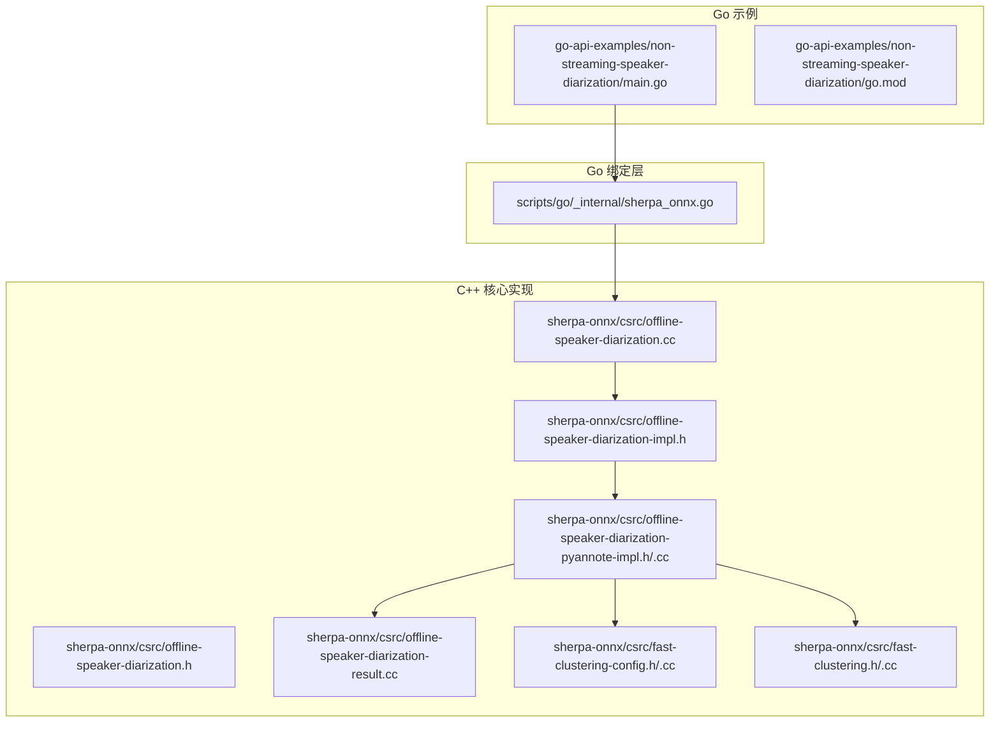
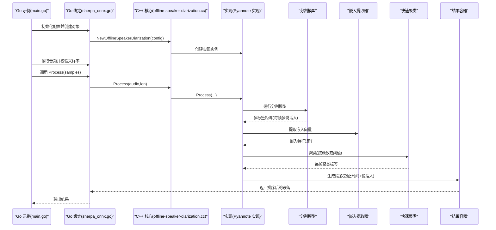
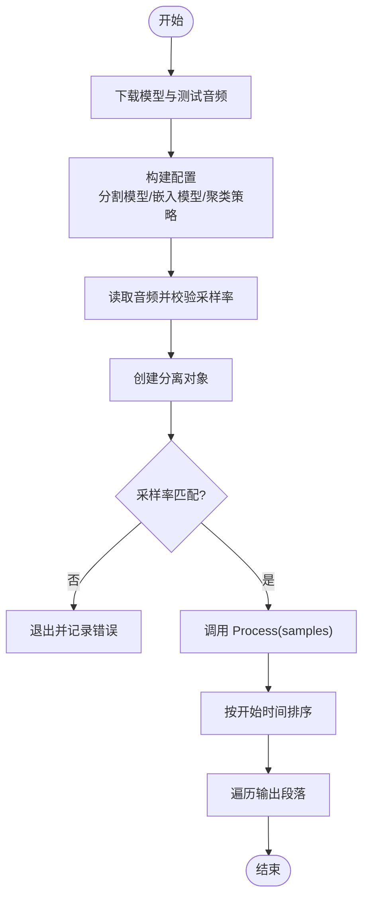
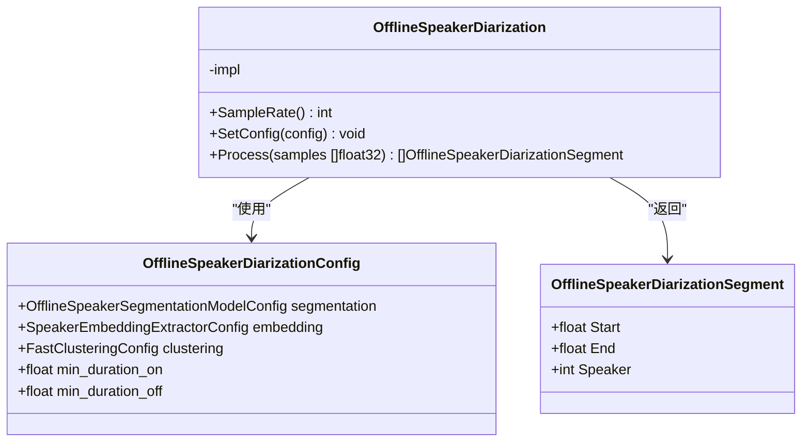
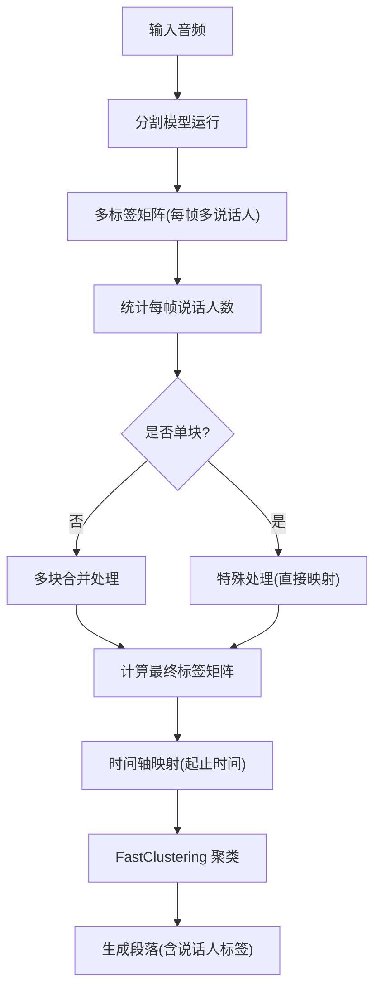
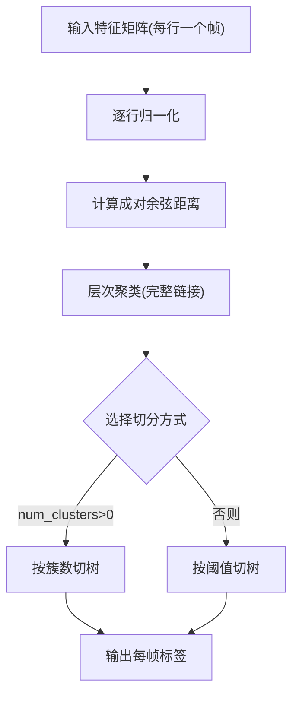
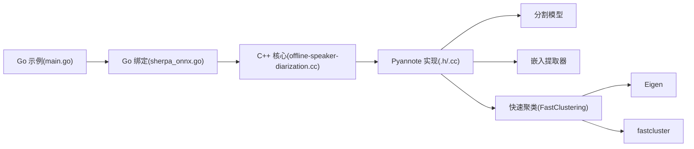

# 说话人分离示例

<cite>
**本文引用的文件**
- [go-api-examples/non-streaming-speaker-diarization/main.go](file://go-api-examples/non-streaming-speaker-diarization/main.go)
- [go-api-examples/non-streaming-speaker-diarization/go.mod](file://go-api-examples/non-streaming-speaker-diarization/go.mod)
- [scripts/go/_internal/sherpa_onnx.go](file://scripts/go/_internal/sherpa_onnx.go)
- [sherpa-onnx/csrc/offline-speaker-diarization.h](file://sherpa-onnx/csrc/offline-speaker-diarization.h)
- [sherpa-onnx/csrc/offline-speaker-diarization.cc](file://sherpa-onnx/csrc/offline-speaker-diarization.cc)
- [sherpa-onnx/csrc/offline-speaker-diarization-impl.h](file://sherpa-onnx/csrc/offline-speaker-diarization-impl.h)
- [sherpa-onnx/csrc/offline-speaker-diarization-pyannote-impl.h](file://sherpa-onnx/csrc/offline-speaker-diarization-pyannote-impl.h)
- [sherpa-onnx/csrc/offline-speaker-diarization-pyannote-impl.cc](file://sherpa-onnx/csrc/offline-speaker-diarization-pyannote-impl.cc)
- [sherpa-onnx/csrc/offline-speaker-diarization-result.cc](file://sherpa-onnx/csrc/offline-speaker-diarization-result.cc)
- [sherpa-onnx/csrc/fast-clustering.h](file://sherpa-onnx/csrc/fast-clustering.h)
- [sherpa-onnx/csrc/fast-clustering.cc](file://sherpa-onnx/csrc/fast-clustering.cc)
- [sherpa-onnx/csrc/fast-clustering-config.h](file://sherpa-onnx/csrc/fast-clustering-config.h)
- [sherpa-onnx/csrc/fast-clustering-config.cc](file://sherpa-onnx/csrc/fast-clustering-config.cc)
- [python-api-examples/offline-speaker-diarization.py](file://python-api-examples/offline-speaker-diarization.py)
- [dart-api-examples/speaker-diarization/bin/speaker-diarization.dart](file://dart-api-examples/speaker-diarization/bin/speaker-diarization.dart)
- [java-api-examples/OfflineSpeakerDiarizationDemo.java](file://java-api-examples/OfflineSpeakerDiarizationDemo.java)
</cite>

## 目录
1. [简介](#简介)
2. [项目结构](#项目结构)
3. [核心组件](#核心组件)
4. [架构总览](#架构总览)
5. [详细组件分析](#详细组件分析)
6. [依赖关系分析](#依赖关系分析)
7. [性能考量](#性能考量)
8. [故障排查指南](#故障排查指南)
9. [结论](#结论)
10. [附录](#附录)

## 简介
本文件围绕 sherpa-onnx 的非流式（离线）说话人分离 Go API 示例进行系统化说明，目标是帮助读者理解在多说话人语音中区分不同说话者的技术路径：包括声纹特征提取、聚类算法应用以及时间戳标注过程；同时给出如何配置分离模型参数、处理输入音频并解析输出结果的完整流程，并提供性能调优建议与常见问题解决方案（如重叠语音处理与准确率提升）。

## 项目结构
该示例位于 Go API 示例目录下，配合 Go 绑定层与 C/C++ 核心实现共同完成端到端的说话人分离任务。Go 层负责配置构建、音频读取与结果解析；底层通过 C 绑定调用 C++ 实现，包含分割模型、嵌入提取器与快速聚类模块。

图表来源
- [go-api-examples/non-streaming-speaker-diarization/main.go](file://go-api-examples/non-streaming-speaker-diarization/main.go#L1-L88)
- [scripts/go/_internal/sherpa_onnx.go](file://scripts/go/_internal/sherpa_onnx.go#L1750-L1851)
- [sherpa-onnx/csrc/offline-speaker-diarization.h](file://sherpa-onnx/csrc/offline-speaker-diarization.h#L1-L32)
- [sherpa-onnx/csrc/offline-speaker-diarization.cc](file://sherpa-onnx/csrc/offline-speaker-diarization.cc#L1-L120)
- [sherpa-onnx/csrc/offline-speaker-diarization-impl.h](file://sherpa-onnx/csrc/offline-speaker-diarization-impl.h#L1-L40)
- [sherpa-onnx/csrc/offline-speaker-diarization-pyannote-impl.h](file://sherpa-onnx/csrc/offline-speaker-diarization-pyannote-impl.h#L55-L120)
- [sherpa-onnx/csrc/offline-speaker-diarization-pyannote-impl.cc](file://sherpa-onnx/csrc/offline-speaker-diarization-pyannote-impl.cc#L94-L170)
- [sherpa-onnx/csrc/offline-speaker-diarization-result.cc](file://sherpa-onnx/csrc/offline-speaker-diarization-result.cc#L83-L115)
- [sherpa-onnx/csrc/fast-clustering-config.h](file://sherpa-onnx/csrc/fast-clustering-config.h#L1-L39)
- [sherpa-onnx/csrc/fast-clustering-config.cc](file://sherpa-onnx/csrc/fast-clustering-config.cc#L1-L45)
- [sherpa-onnx/csrc/fast-clustering.h](file://sherpa-onnx/csrc/fast-clustering.h#L1-L43)
- [sherpa-onnx/csrc/fast-clustering.cc](file://sherpa-onnx/csrc/fast-clustering.cc#L1-L83)

章节来源
- [go-api-examples/non-streaming-speaker-diarization/main.go](file://go-api-examples/non-streaming-speaker-diarization/main.go#L1-L88)
- [go-api-examples/non-streaming-speaker-diarization/go.mod](file://go-api-examples/non-streaming-speaker-diarization/go.mod#L1-L4)
- [scripts/go/_internal/sherpa_onnx.go](file://scripts/go/_internal/sherpa_onnx.go#L1750-L1851)

## 核心组件
- 配置结构
  - OfflineSpeakerDiarizationConfig：包含分割模型配置、嵌入提取器配置、聚类配置以及最小持续时长等参数。
  - FastClusteringConfig：控制聚类数量或阈值，二者二选一。
- Go API 封装
  - NewOfflineSpeakerDiarization / DeleteOfflineSpeakerDiarization：创建与销毁对象。
  - SampleRate / SetConfig / Process：查询采样率、动态更新聚类配置、执行离线分离。
  - OfflineSpeakerDiarizationSegment：输出段落结构体，包含起止时间与说话人编号。
- C++ 核心实现
  - OfflineSpeakerDiarization：对外接口封装，委托给具体实现类。
  - OfflineSpeakerDiarizationPyannoteImpl：基于 Pyannote 分割模型与嵌入提取器的实现，包含完整的分割、标签后处理、聚类与时间戳映射。
  - FastClustering：基于层次聚类的快速聚类实现，支持按簇数或距离阈值两种模式。
  - OfflineSpeakerDiarizationResult：结果容器，支持按开始时间排序与按说话人分组。

章节来源
- [scripts/go/_internal/sherpa_onnx.go](file://scripts/go/_internal/sherpa_onnx.go#L1750-L1851)
- [sherpa-onnx/csrc/offline-speaker-diarization.h](file://sherpa-onnx/csrc/offline-speaker-diarization.h#L1-L32)
- [sherpa-onnx/csrc/offline-speaker-diarization.cc](file://sherpa-onnx/csrc/offline-speaker-diarization.cc#L1-L120)
- [sherpa-onnx/csrc/offline-speaker-diarization-impl.h](file://sherpa-onnx/csrc/offline-speaker-diarization-impl.h#L1-L40)
- [sherpa-onnx/csrc/offline-speaker-diarization-pyannote-impl.h](file://sherpa-onnx/csrc/offline-speaker-diarization-pyannote-impl.h#L55-L120)
- [sherpa-onnx/csrc/offline-speaker-diarization-pyannote-impl.cc](file://sherpa-onnx/csrc/offline-speaker-diarization-pyannote-impl.cc#L94-L170)
- [sherpa-onnx/csrc/offline-speaker-diarization-result.cc](file://sherpa-onnx/csrc/offline-speaker-diarization-result.cc#L83-L115)
- [sherpa-onnx/csrc/fast-clustering-config.h](file://sherpa-onnx/csrc/fast-clustering-config.h#L1-L39)
- [sherpa-onnx/csrc/fast-clustering-config.cc](file://sherpa-onnx/csrc/fast-clustering-config.cc#L1-L45)
- [sherpa-onnx/csrc/fast-clustering.h](file://sherpa-onnx/csrc/fast-clustering.h#L1-L43)
- [sherpa-onnx/csrc/fast-clustering.cc](file://sherpa-onnx/csrc/fast-clustering.cc#L1-L83)

## 架构总览
下图展示了从 Go 示例到 C++ 核心的调用链路与数据流。

图表来源
- [go-api-examples/non-streaming-speaker-diarization/main.go](file://go-api-examples/non-streaming-speaker-diarization/main.go#L59-L87)
- [scripts/go/_internal/sherpa_onnx.go](file://scripts/go/_internal/sherpa_onnx.go#L1768-L1851)
- [sherpa-onnx/csrc/offline-speaker-diarization.cc](file://sherpa-onnx/csrc/offline-speaker-diarization.cc#L93-L107)
- [sherpa-onnx/csrc/offline-speaker-diarization-pyannote-impl.cc](file://sherpa-onnx/csrc/offline-speaker-diarization-pyannote-impl.cc#L94-L170)
- [sherpa-onnx/csrc/offline-speaker-diarization-result.cc](file://sherpa-onnx/csrc/offline-speaker-diarization-result.cc#L83-L115)

## 详细组件分析

### Go 示例：从加载模型到生成说话人标签
- 步骤概览
  - 下载分割模型与嵌入模型，并准备测试音频。
  - 构建 OfflineSpeakerDiarizationConfig，设置分割模型路径、嵌入模型路径与聚类策略（已知说话人数时使用簇数，未知时使用阈值）。
  - 读取音频并校验采样率，确保与模型元数据一致。
  - 调用 Process 执行离线分离，得到按开始时间排序的段落列表。
  - 遍历输出每个片段的起止时间与对应说话人编号。

图表来源
- [go-api-examples/non-streaming-speaker-diarization/main.go](file://go-api-examples/non-streaming-speaker-diarization/main.go#L36-L87)

章节来源
- [go-api-examples/non-streaming-speaker-diarization/main.go](file://go-api-examples/non-streaming-speaker-diarization/main.go#L36-L87)
- [go-api-examples/non-streaming-speaker-diarization/go.mod](file://go-api-examples/non-streaming-speaker-diarization/go.mod#L1-L4)

### Go 绑定层：类型与方法
- 结构体
  - OfflineSpeakerDiarizationConfig：包含分割、嵌入、聚类与最小持续时长字段。
  - OfflineSpeakerDiarizationSegment：包含 Start、End、Speaker 字段。
- 方法
  - NewOfflineSpeakerDiarization / DeleteOfflineSpeakerDiarization：生命周期管理。
  - SampleRate：返回模型期望采样率。
  - SetConfig：仅更新聚类相关配置。
  - Process：执行离线分离，返回排序后的段落数组。

图表来源
- [scripts/go/_internal/sherpa_onnx.go](file://scripts/go/_internal/sherpa_onnx.go#L1750-L1851)

章节来源
- [scripts/go/_internal/sherpa_onnx.go](file://scripts/go/_internal/sherpa_onnx.go#L1750-L1851)

### C++ 核心：离线说话人分离实现
- 接口与实现
  - OfflineSpeakerDiarization：对外接口，委托给 OfflineSpeakerDiarizationImpl。
  - OfflineSpeakerDiarizationPyannoteImpl：基于 Pyannote 分割模型与嵌入提取器的实现，包含以下关键步骤：
    - 运行分割模型，得到每帧多说话人概率矩阵。
    - 转换为多标签矩阵（0-1），统计每帧说话人数。
    - 对单块特殊处理与多块合并处理。
    - 计算最终标签矩阵，映射到时间轴，生成段落。
    - 使用 FastClustering 进行聚类（按簇数或阈值）。
- 结果容器
  - OfflineSpeakerDiarizationResult：支持按开始时间排序与按说话人分组，便于后续分析。

图表来源
- [sherpa-onnx/csrc/offline-speaker-diarization-pyannote-impl.cc](file://sherpa-onnx/csrc/offline-speaker-diarization-pyannote-impl.cc#L94-L170)
- [sherpa-onnx/csrc/offline-speaker-diarization-pyannote-impl.cc](file://sherpa-onnx/csrc/offline-speaker-diarization-pyannote-impl.cc#L634-L679)
- [sherpa-onnx/csrc/offline-speaker-diarization-result.cc](file://sherpa-onnx/csrc/offline-speaker-diarization-result.cc#L83-L115)

章节来源
- [sherpa-onnx/csrc/offline-speaker-diarization.cc](file://sherpa-onnx/csrc/offline-speaker-diarization.cc#L93-L107)
- [sherpa-onnx/csrc/offline-speaker-diarization-impl.h](file://sherpa-onnx/csrc/offline-speaker-diarization-impl.h#L23-L35)
- [sherpa-onnx/csrc/offline-speaker-diarization-pyannote-impl.h](file://sherpa-onnx/csrc/offline-speaker-diarization-pyannote-impl.h#L55-L120)
- [sherpa-onnx/csrc/offline-speaker-diarization-pyannote-impl.cc](file://sherpa-onnx/csrc/offline-speaker-diarization-pyannote-impl.cc#L94-L170)
- [sherpa-onnx/csrc/offline-speaker-diarization-result.cc](file://sherpa-onnx/csrc/offline-speaker-diarization-result.cc#L83-L115)

### 聚类算法：快速层次聚类
- FastClusteringConfig
  - num_clusters：若大于 0，则忽略阈值，直接按簇数切分。
  - threshold：若未指定簇数，则按距离阈值进行切分；越小产生越多簇，越大产生越少簇。
- FastClustering
  - 对每行特征进行 L2 归一化，使用余弦距离作为相似度度量。
  - 采用层次聚类（完整链接法），随后根据 num_clusters 或 threshold 切树得到标签。

图表来源
- [sherpa-onnx/csrc/fast-clustering-config.h](file://sherpa-onnx/csrc/fast-clustering-config.h#L1-L39)
- [sherpa-onnx/csrc/fast-clustering-config.cc](file://sherpa-onnx/csrc/fast-clustering-config.cc#L1-L45)
- [sherpa-onnx/csrc/fast-clustering.h](file://sherpa-onnx/csrc/fast-clustering.h#L1-L43)
- [sherpa-onnx/csrc/fast-clustering.cc](file://sherpa-onnx/csrc/fast-clustering.cc#L1-L83)

章节来源
- [sherpa-onnx/csrc/fast-clustering-config.h](file://sherpa-onnx/csrc/fast-clustering-config.h#L1-L39)
- [sherpa-onnx/csrc/fast-clustering-config.cc](file://sherpa-onnx/csrc/fast-clustering-config.cc#L1-L45)
- [sherpa-onnx/csrc/fast-clustering.h](file://sherpa-onnx/csrc/fast-clustering.h#L1-L43)
- [sherpa-onnx/csrc/fast-clustering.cc](file://sherpa-onnx/csrc/fast-clustering.cc#L1-L83)

### 时间戳标注与后处理
- 时间轴映射
  - 利用分割模型元数据中的窗口大小、窗口步长、感受野步长与采样率，将帧索引转换为秒级时间戳。
- 最小持续时长与间隙合并
  - min_duration_on：小于该时长的片段会被丢弃。
  - min_duration_off：同一说话人的相邻片段间隔小于该阈值则合并。
- 排序与分组
  - 按开始时间排序，或按说话人分组，便于后续可视化与统计。

章节来源
- [sherpa-onnx/csrc/offline-speaker-diarization.h](file://sherpa-onnx/csrc/offline-speaker-diarization.h#L19-L32)
- [sherpa-onnx/csrc/offline-speaker-diarization.cc](file://sherpa-onnx/csrc/offline-speaker-diarization.cc#L23-L41)
- [sherpa-onnx/csrc/offline-speaker-diarization-pyannote-impl.cc](file://sherpa-onnx/csrc/offline-speaker-diarization-pyannote-impl.cc#L634-L679)
- [sherpa-onnx/csrc/offline-speaker-diarization-result.cc](file://sherpa-onnx/csrc/offline-speaker-diarization-result.cc#L83-L115)

## 依赖关系分析
- Go 示例依赖 Go 绑定层提供的类型与方法。
- Go 绑定层通过 C 绑定调用 C++ 核心实现。
- C++ 核心依赖分割模型、嵌入提取器与快速聚类模块。
- 快速聚类依赖 Eigen 与 fastcluster 库。

图表来源
- [go-api-examples/non-streaming-speaker-diarization/main.go](file://go-api-examples/non-streaming-speaker-diarization/main.go#L59-L87)
- [scripts/go/_internal/sherpa_onnx.go](file://scripts/go/_internal/sherpa_onnx.go#L1768-L1851)
- [sherpa-onnx/csrc/offline-speaker-diarization.cc](file://sherpa-onnx/csrc/offline-speaker-diarization.cc#L93-L107)
- [sherpa-onnx/csrc/fast-clustering.cc](file://sherpa-onnx/csrc/fast-clustering.cc#L1-L83)

章节来源
- [scripts/go/_internal/sherpa_onnx.go](file://scripts/go/_internal/sherpa_onnx.go#L1768-L1851)
- [sherpa-onnx/csrc/fast-clustering.cc](file://sherpa-onnx/csrc/fast-clustering.cc#L1-L83)

## 性能考量
- 模型与硬件
  - 合理选择 ONNX Runtime Provider（如 CPU、CUDA、CoreML 等），以获得最佳推理速度。
  - 分割模型与嵌入模型的 num_threads 可根据设备核数调整。
- 输入预处理
  - 确保输入音频采样率与模型元数据一致，避免额外重采样开销。
- 聚类参数
  - 已知说话人数时优先使用 num_clusters，可减少聚类搜索空间。
  - 未知人数时，先尝试较小阈值以生成更多候选簇，再结合业务需求裁剪。
- 后处理
  - 合理设置 min_duration_on 与 min_duration_off，平衡召回与稳定性。
- 并发与回调
  - 在其他语言绑定中提供了进度回调能力，可在长音频处理时进行进度反馈与资源调度。

[本节为通用指导，不直接分析具体文件]

## 故障排查指南
- 采样率不匹配
  - 现象：运行时报错或结果异常。
  - 处理：检查音频采样率与模型 SampleRate 是否一致，必要时重采样。
- 配置无效
  - 现象：聚类配置非法导致跳过更新。
  - 处理：确保 num_clusters 与 threshold 至少设置其一，且满足验证规则。
- 输出为空
  - 现象：Process 返回空列表。
  - 处理：确认分割模型输出非空，检查 min_duration_on 是否过大导致全部丢弃。
- 重叠语音与准确率
  - 建议：适当降低阈值以提升召回；或在已知说话人数场景使用 num_clusters；对短片段使用更小的 min_duration_on；必要时引入更高质量的嵌入模型。

章节来源
- [sherpa-onnx/csrc/offline-speaker-diarization.cc](file://sherpa-onnx/csrc/offline-speaker-diarization.cc#L43-L67)
- [sherpa-onnx/csrc/fast-clustering-config.cc](file://sherpa-onnx/csrc/fast-clustering-config.cc#L36-L45)
- [go-api-examples/non-streaming-speaker-diarization/main.go](file://go-api-examples/non-streaming-speaker-diarization/main.go#L75-L87)

## 结论
本示例展示了从 Go 层到 C++ 核心的完整非流式说话人分离流程：通过分割模型识别每帧说话人活动，借助嵌入提取器获得表征，再以快速聚类将时间片段分配到不同说话人。Go API 提供了简洁易用的接口，配合合理的参数配置与后处理策略，可在多说话人场景中稳定地生成带时间戳的说话人标签。对于复杂场景，建议结合阈值与簇数策略、最小持续时长与间隙合并参数进行调优，并在需要时引入更高精度的模型与硬件加速。

[本节为总结性内容，不直接分析具体文件]

## 附录

### 参数配置要点（来自各语言示例）
- Go 示例
  - 设置分割模型路径、嵌入模型路径与聚类策略（已知人数用 num_clusters，未知用 threshold）。
- Python 示例
  - 显式传入 num_speakers 并在处理前进行重采样校验。
- Dart 示例
  - 支持回调进度显示，便于长音频处理时的可观测性。
- Java 示例
  - 与 Go 类似，提供 Builder 模式构建配置。

章节来源
- [go-api-examples/non-streaming-speaker-diarization/main.go](file://go-api-examples/non-streaming-speaker-diarization/main.go#L36-L57)
- [python-api-examples/offline-speaker-diarization.py](file://python-api-examples/offline-speaker-diarization.py#L107-L136)
- [dart-api-examples/speaker-diarization/bin/speaker-diarization.dart](file://dart-api-examples/speaker-diarization/bin/speaker-diarization.dart#L69-L100)
- [java-api-examples/OfflineSpeakerDiarizationDemo.java](file://java-api-examples/OfflineSpeakerDiarizationDemo.java#L35-L61)