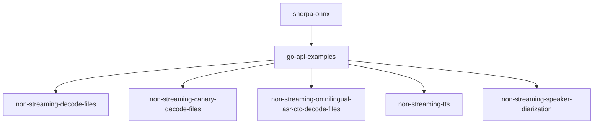
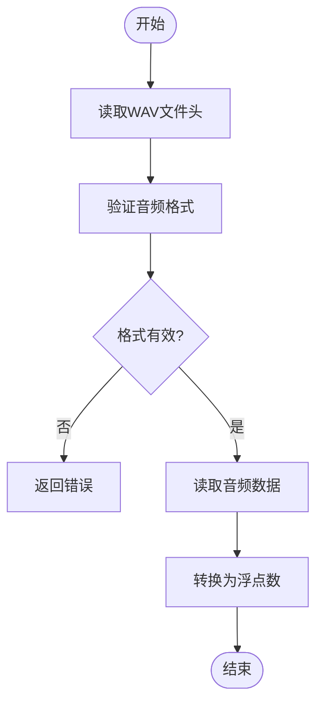
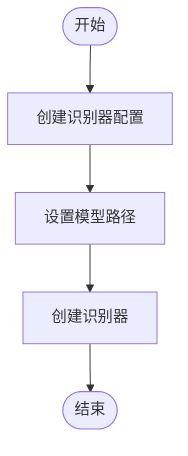
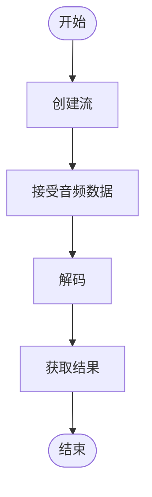
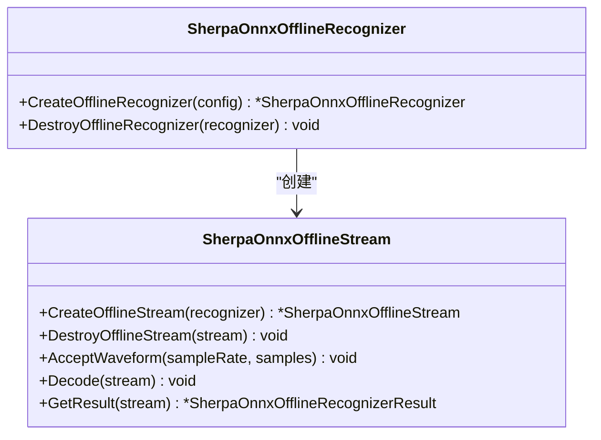
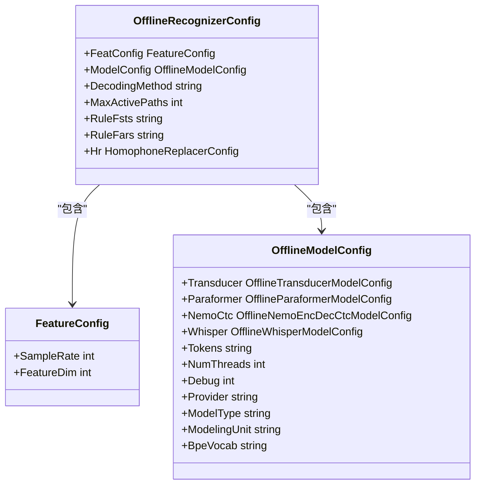
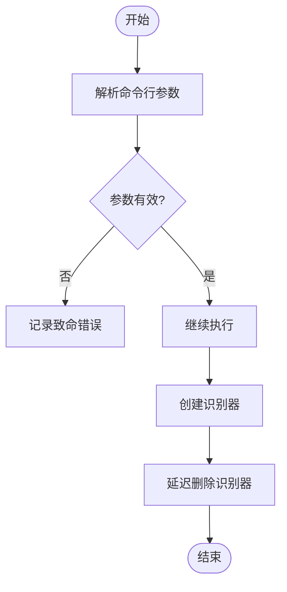
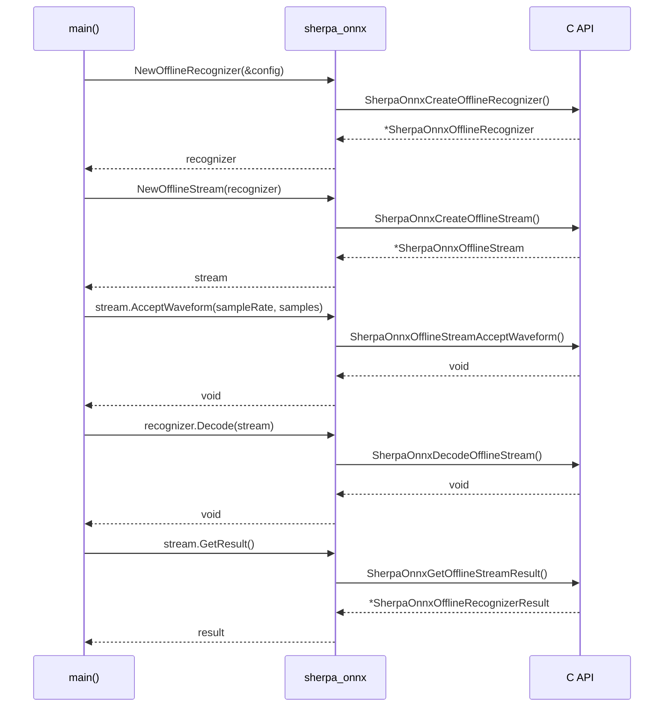

# 非流式处理示例

<cite>
**本文档中引用的文件**   
- [main.go](file://go-api-examples/non-streaming-decode-files/main.go)
- [sherpa_onnx.go](file://scripts/go/_internal/sherpa_onnx.go)
- [c-api.h](file://sherpa-onnx/c-api/c-api.h)
- [non-streaming-canary-decode-files/main.go](file://go-api-examples/non-streaming-canary-decode-files/main.go)
- [non-streaming-omnilingual-asr-ctc-decode-files/main.go](file://go-api-examples/non-streaming-omnilingual-asr-ctc-decode-files/main.go)
</cite>

## 目录
1. [简介](#简介)
2. [项目结构](#项目结构)
3. [核心组件](#核心组件)
4. [非流式语音识别实现机制](#非流式语音识别实现机制)
5. [Go语言调用C API进行离线语音处理](#go语言调用c-api进行离线语音处理)
6. [参数配置和错误处理模式](#参数配置和错误处理模式)
7. [性能优化建议](#性能优化建议)
8. [实际代码示例](#实际代码示例)
9. [关键函数调用流程](#关键函数调用流程)
10. [结论](#结论)

## 简介
sherpa-onnx是一个开源的语音识别框架，支持流式和非流式语音识别。本文档将深入解析非流式Go API示例，详细说明如何使用Go语言调用C API进行离线语音处理，包括音频文件解码、模型加载和推理过程。文档还将解释参数配置和错误处理模式，并提供性能优化建议。

## 项目结构
sherpa-onnx项目包含多个API示例，其中Go API示例位于`go-api-examples`目录下。非流式处理示例主要位于`non-streaming-decode-files`、`non-streaming-canary-decode-files`和`non-streaming-omnilingual-asr-ctc-decode-files`等子目录中。



**Diagram sources**
- [main.go](file://go-api-examples/non-streaming-decode-files/main.go)

**Section sources**
- [main.go](file://go-api-examples/non-streaming-decode-files/main.go)

## 核心组件
非流式Go API示例的核心组件包括音频文件解码、模型加载、推理过程和结果获取。这些组件通过Go语言调用C API实现，提供了高效的离线语音处理能力。

**Section sources**
- [main.go](file://go-api-examples/non-streaming-decode-files/main.go)
- [sherpa_onnx.go](file://scripts/go/_internal/sherpa_onnx.go)

## 非流式语音识别实现机制
非流式语音识别的实现机制主要包括音频文件解码、模型加载和推理过程。音频文件解码将WAV格式的音频文件转换为浮点数数组，模型加载将预训练的ONNX模型加载到内存中，推理过程则使用加载的模型对音频数据进行识别。

### 音频文件解码
音频文件解码是将WAV格式的音频文件转换为浮点数数组的过程。解码过程包括读取WAV文件头信息、验证音频格式和读取音频数据。



**Diagram sources**
- [main.go](file://go-api-examples/non-streaming-decode-files/main.go#L109-L162)

### 模型加载
模型加载是将预训练的ONNX模型加载到内存中的过程。加载过程包括创建识别器配置、设置模型路径和创建识别器。



**Diagram sources**
- [main.go](file://go-api-examples/non-streaming-decode-files/main.go#L18-L86)

### 推理过程
推理过程是使用加载的模型对音频数据进行识别的过程。推理过程包括创建流、接受音频数据、解码和获取结果。



**Diagram sources**
- [main.go](file://go-api-examples/non-streaming-decode-files/main.go#L91-L98)

## Go语言调用C API进行离线语音处理
Go语言通过CGO调用C API进行离线语音处理。C API提供了创建识别器、创建流、接受音频数据、解码和获取结果等函数。

### C API函数
C API提供了以下主要函数：
- `SherpaOnnxCreateOfflineRecognizer`: 创建离线识别器
- `SherpaOnnxCreateOfflineStream`: 创建离线流
- `SherpaOnnxOfflineStreamAcceptWaveform`: 接受音频数据
- `SherpaOnnxDecodeOfflineStream`: 解码
- `SherpaOnnxGetOfflineStreamResult`: 获取结果



**Diagram sources**
- [c-api.h](file://sherpa-onnx/c-api/c-api.h#L407-L700)

## 参数配置和错误处理模式
参数配置包括识别器配置、模型配置和特征配置。错误处理模式包括参数验证和异常处理。

### 参数配置
参数配置通过`OfflineRecognizerConfig`结构体实现，包括特征配置、模型配置、解码方法等。



**Diagram sources**
- [sherpa_onnx.go](file://scripts/go/_internal/sherpa_onnx.go#L301-L420)

### 错误处理模式
错误处理模式包括参数验证和异常处理。参数验证在`main`函数中通过`flag.Parse()`和`log.Fatalf()`实现，异常处理通过Go的`defer`机制实现。



**Diagram sources**
- [main.go](file://go-api-examples/non-streaming-decode-files/main.go#L75-L88)

## 性能优化建议
性能优化建议包括内存管理和并发处理。内存管理通过Go的`defer`机制实现，并发处理通过多线程实现。

### 内存管理
内存管理通过Go的`defer`机制实现，确保在函数退出时释放资源。

```go
recognizer := sherpa.NewOfflineRecognizer(&config)
defer sherpa.DeleteOfflineRecognizer(recognizer)
```

### 并发处理
并发处理通过多线程实现，提高处理效率。

```go
config.ModelConfig.NumThreads = 4
```

**Section sources**
- [main.go](file://go-api-examples/non-streaming-decode-files/main.go#L57)
- [sherpa_onnx.go](file://scripts/go/_internal/sherpa_onnx.go#L102)

## 实际代码示例
以下是`non-streaming-decode-files`示例的完整代码结构：

```go
package main

import (
	"bytes"
	"encoding/binary"
	"log"
	"os"
	"strings"

	sherpa "github.com/k2-fsa/sherpa-onnx-go/sherpa_onnx"
	flag "github.com/spf13/pflag"
	"github.com/youpy/go-wav"
)

func main() {
	log.SetFlags(log.LstdFlags | log.Lmicroseconds)

	config := sherpa.OfflineRecognizerConfig{}

	// 参数配置
	flag.IntVar(&config.FeatConfig.SampleRate, "sample-rate", 16000, "Sample rate of the data used to train the model")
	flag.IntVar(&config.FeatConfig.FeatureDim, "feat-dim", 80, "Dimension of the features used to train the model")
	// ... 其他参数配置

	flag.Parse()

	if len(flag.Args()) != 1 {
		log.Fatalf("Please provide one wave file")
	}

	log.Println("Reading", flag.Arg(0))

	samples, sampleRate := readWave(flag.Arg(0))

	log.Println("Initializing recognizer (may take several seconds)")
	recognizer := sherpa.NewOfflineRecognizer(&config)
	log.Println("Recognizer created!")
	defer sherpa.DeleteOfflineRecognizer(recognizer)

	log.Println("Start decoding!")
	stream := sherpa.NewOfflineStream(recognizer)
	defer sherpa.DeleteOfflineStream(stream)

	stream.AcceptWaveform(sampleRate, samples)

	recognizer.Decode(stream)
	log.Println("Decoding done!")
	result := stream.GetResult()

	log.Println("Text: " + strings.ToLower(result.Text))
	log.Println("Emotion: " + result.Emotion)
	log.Println("Lang: " + result.Lang)
	log.Println("Event: " + result.Event)
	log.Printf("Timestamp: %v\n", result.Timestamps)
	log.Printf("Tokens: %v\n", result.Tokens)
	log.Printf("Wave duration: %v seconds", float32(len(samples))/float32(sampleRate))
}

func readWave(filename string) (samples []float32, sampleRate int) {
	// 音频文件解码
}

func samplesInt16ToFloat(inSamples []byte) []float32 {
	// 16位整数转换为浮点数
}
```

**Section sources**
- [main.go](file://go-api-examples/non-streaming-decode-files/main.go)

## 关键函数调用流程
关键函数调用流程包括创建识别器、创建流、接受音频数据、解码和获取结果。



**Diagram sources**
- [main.go](file://go-api-examples/non-streaming-decode-files/main.go#L86-L98)
- [sherpa_onnx.go](file://scripts/go/_internal/sherpa_onnx.go#L501-L550)
- [c-api.h](file://sherpa-onnx/c-api/c-api.h#L601-L650)

## 结论
本文档详细解析了sherpa-onnx非流式Go API示例的实现机制，包括音频文件解码、模型加载和推理过程。文档还说明了如何使用Go语言调用C API进行离线语音处理，解释了参数配置和错误处理模式，并提供了性能优化建议。通过实际代码示例和关键函数调用流程，展示了非流式语音识别的完整实现过程。