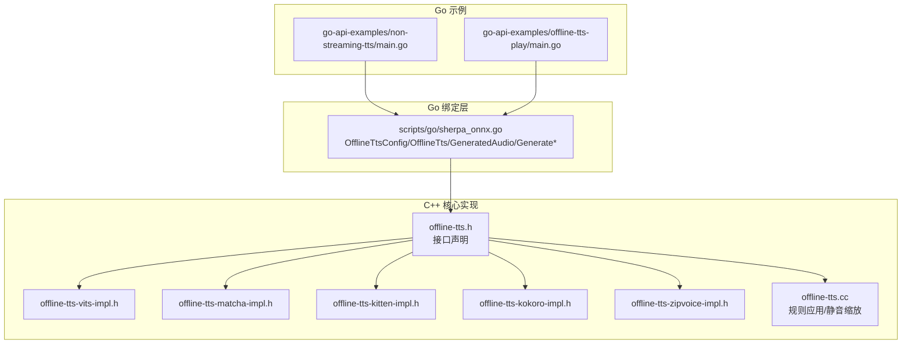
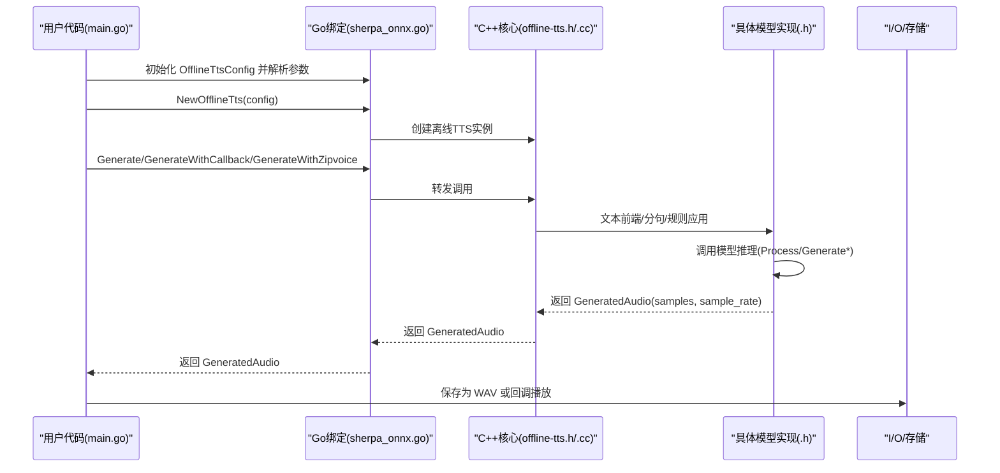
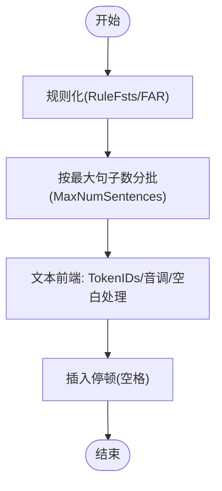
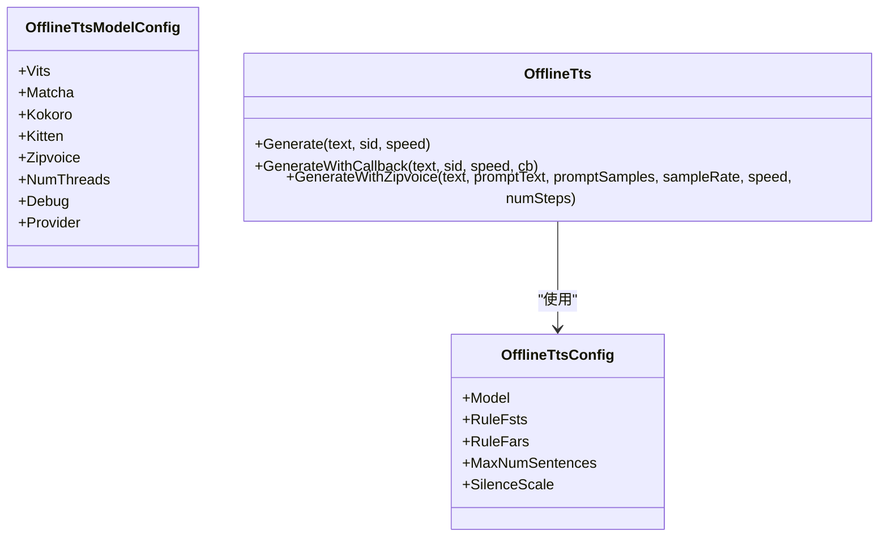
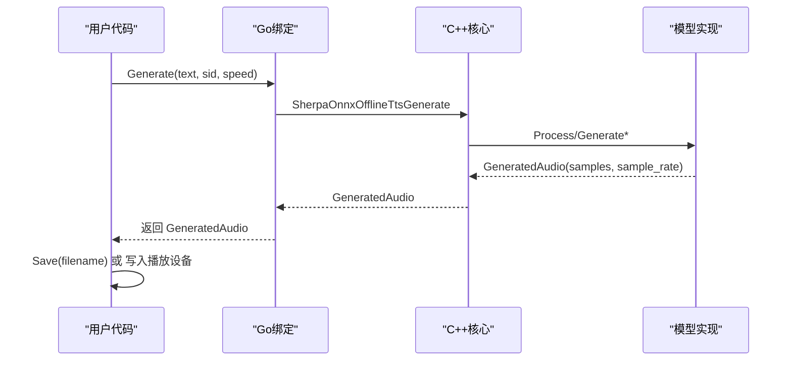
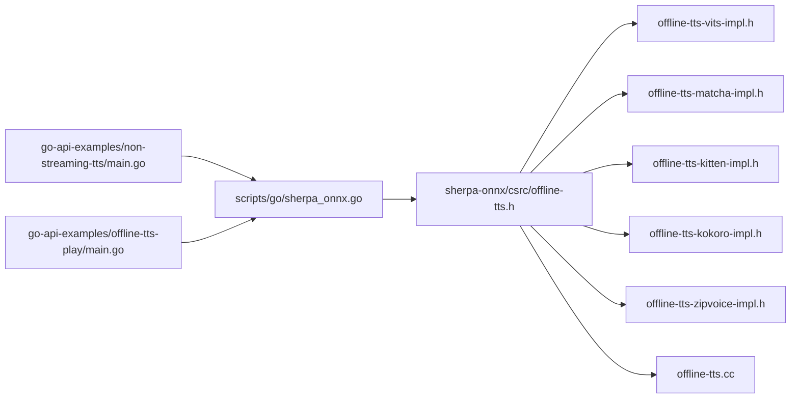

# 非流式语音合成示例

<cite>
**本文引用的文件列表**
- [go-api-examples/non-streaming-tts/main.go](file://go-api-examples/non-streaming-tts/main.go)
- [go-api-examples/offline-tts-play/main.go](file://go-api-examples/offline-tts-play/main.go)
- [scripts/go/sherpa_onnx.go](file://scripts/go/sherpa_onnx.go)
- [sherpa-onnx/csrc/offline-tts.h](file://sherpa-onnx/csrc/offline-tts.h)
- [sherpa-onnx/csrc/offline-tts-vits-impl.h](file://sherpa-onnx/csrc/offline-tts-vits-impl.h)
- [sherpa-onnx/csrc/offline-tts-matcha-impl.h](file://sherpa-onnx/csrc/offline-tts-matcha-impl.h)
- [sherpa-onnx/csrc/offline-tts-kitten-impl.h](file://sherpa-onnx/csrc/offline-tts-kitten-impl.h)
- [sherpa-onnx/csrc/offline-tts-kokoro-impl.h](file://sherpa-onnx/csrc/offline-tts-kokoro-impl.h)
- [sherpa-onnx/csrc/offline-tts-zipvoice-impl.h](file://sherpa-onnx/csrc/offline-tts-zipvoice-impl.h)
- [sherpa-onnx/csrc/offline-tts.cc](file://sherpa-onnx/csrc/offline-tts.cc)
- [go-api-examples/README.md](file://go-api-examples/README.md)
</cite>

## 目录
1. [简介](#简介)
2. [项目结构](#项目结构)
3. [核心组件](#核心组件)
4. [架构总览](#架构总览)
5. [详细组件分析](#详细组件分析)
6. [依赖关系分析](#依赖关系分析)
7. [性能考量](#性能考量)
8. [故障排查指南](#故障排查指南)
9. [结论](#结论)
10. [附录](#附录)

## 简介
本文件面向使用 Go API 的开发者，系统性讲解 sherpa-onnx 非流式 TTS（文本转语音）的完整流程与最佳实践。内容覆盖：
- 文本预处理：规则化、分句、音素/字符映射、停顿插入等
- 声学模型调用：多模型族（VITS、Matcha、Kokoro、Kitten、ZipVoice）的参数配置与推理路径
- 音频生成与输出：采样率、样本数组、保存为 WAV 文件或回调实时播放
- 关键接口调用顺序与数据传递方式
- 常见问题：语音质量优化、延迟控制、资源释放与多线程配置

## 项目结构
围绕 Go 示例与核心实现的关键位置如下：
- Go 示例入口：非流式 TTS 合成与播放示例
- Go 绑定层：定义 OfflineTtsConfig、OfflineTts、GeneratedAudio 及回调机制
- 核心 C++ 实现：各模型族的 Generate/Process 流程、文本前端、批量处理与回调触发
- 辅助工具：规则 FST/FAR 应用、静音缩放、RTF 计算

图表来源
- [go-api-examples/non-streaming-tts/main.go](file://go-api-examples/non-streaming-tts/main.go#L1-L122)
- [go-api-examples/offline-tts-play/main.go](file://go-api-examples/offline-tts-play/main.go#L1-L83)
- [scripts/go/sherpa_onnx.go](file://scripts/go/sherpa_onnx.go#L970-L1214)
- [sherpa-onnx/csrc/offline-tts.h](file://sherpa-onnx/csrc/offline-tts.h#L93-L115)
- [sherpa-onnx/csrc/offline-tts-vits-impl.h](file://sherpa-onnx/csrc/offline-tts-vits-impl.h#L151-L334)
- [sherpa-onnx/csrc/offline-tts-matcha-impl.h](file://sherpa-onnx/csrc/offline-tts-matcha-impl.h#L212-L375)
- [sherpa-onnx/csrc/offline-tts-kitten-impl.h](file://sherpa-onnx/csrc/offline-tts-kitten-impl.h#L150-L326)
- [sherpa-onnx/csrc/offline-tts-kokoro-impl.h](file://sherpa-onnx/csrc/offline-tts-kokoro-impl.h#L151-L328)
- [sherpa-onnx/csrc/offline-tts-zipvoice-impl.h](file://sherpa-onnx/csrc/offline-tts-zipvoice-impl.h#L49-L90)
- [sherpa-onnx/csrc/offline-tts.cc](file://sherpa-onnx/csrc/offline-tts.cc#L68-L108)

章节来源
- [go-api-examples/README.md](file://go-api-examples/README.md#L1-L47)

## 核心组件
- OfflineTtsConfig：封装模型族参数、Provider、线程数、规则 FST/FAR、最大句子数、静音缩放等
- OfflineTts：Go 层对底层 C++ 对象的封装，提供 Generate/GenerateWithCallback/GenerateWithZipvoice 等方法
- GeneratedAudio：包含采样率与归一化样本数组，支持保存为 WAV
- 模型族实现：
  - VITS：噪声尺度、长度尺度、音色 ID、音素词典、espeak 数据目录
  - Matcha：噪声尺度、长度尺度、声学/声码器模型、词典、espeak 数据目录
  - Kokoro/Kitten：长度尺度、模型/voices/tokens/dataDir/lexicon
  - ZipVoice：tokens/text/flow/vocoder/dataDir/pinyin、特征缩放、t-shift、目标RMS、引导尺度、步数
- 文本前端与规则：可选 RuleFsts/RuleFars 应用，支持停顿插入与分句批处理

章节来源
- [scripts/go/sherpa_onnx.go](file://scripts/go/sherpa_onnx.go#L970-L1214)
- [sherpa-onnx/csrc/offline-tts.h](file://sherpa-onnx/csrc/offline-tts.h#L93-L115)

## 架构总览
下图展示了从 Go 示例到核心推理的端到端调用链路与数据流向。

图表来源
- [go-api-examples/non-streaming-tts/main.go](file://go-api-examples/non-streaming-tts/main.go#L86-L121)
- [go-api-examples/offline-tts-play/main.go](file://go-api-examples/offline-tts-play/main.go#L62-L82)
- [scripts/go/sherpa_onnx.go](file://scripts/go/sherpa_onnx.go#L1174-L1214)
- [sherpa-onnx/csrc/offline-tts.h](file://sherpa-onnx/csrc/offline-tts.h#L93-L115)
- [sherpa-onnx/csrc/offline-tts.cc](file://sherpa-onnx/csrc/offline-tts.cc#L68-L108)

## 详细组件分析

### 文本预处理与规则应用
- 规则化与分句：当输入文本过长时，按 MaxNumSentences 分批处理以避免显存溢出；同时可应用 RuleFsts/RuleFars 进行替换与规范化
- 停顿插入：在句子末尾插入空格以产生自然停顿
- 文本前端：将文本转换为 TokenIDs，部分模型会自动添加空白或音调信息

图表来源
- [sherpa-onnx/csrc/offline-tts-vits-impl.h](file://sherpa-onnx/csrc/offline-tts-vits-impl.h#L151-L334)
- [sherpa-onnx/csrc/offline-tts-matcha-impl.h](file://sherpa-onnx/csrc/offline-tts-matcha-impl.h#L212-L375)
- [sherpa-onnx/csrc/offline-tts-kitten-impl.h](file://sherpa-onnx/csrc/offline-tts-kitten-impl.h#L150-L326)
- [sherpa-onnx/csrc/offline-tts-kokoro-impl.h](file://sherpa-onnx/csrc/offline-tts-kokoro-impl.h#L151-L328)
- [sherpa-onnx/csrc/offline-tts.cc](file://sherpa-onnx/csrc/offline-tts.cc#L68-L108)

章节来源
- [sherpa-onnx/csrc/offline-tts-vits-impl.h](file://sherpa-onnx/csrc/offline-tts-vits-impl.h#L151-L334)
- [sherpa-onnx/csrc/offline-tts-matcha-impl.h](file://sherpa-onnx/csrc/offline-tts-matcha-impl.h#L212-L375)
- [sherpa-onnx/csrc/offline-tts-kitten-impl.h](file://sherpa-onnx/csrc/offline-tts-kitten-impl.h#L150-L326)
- [sherpa-onnx/csrc/offline-tts-kokoro-impl.h](file://sherpa-onnx/csrc/offline-tts-kokoro-impl.h#L151-L328)
- [sherpa-onnx/csrc/offline-tts.cc](file://sherpa-onnx/csrc/offline-tts.cc#L68-L108)

### 声学模型调用与参数配置
- Provider 与线程数：可通过 Provider 选择 CPU/CUDA/CoreML，NumThreads 控制神经网络计算线程数
- VITS：NoiseScale/NoiseScaleW/LengthScale；支持 sid 多说话人
- Matcha：NoiseScale/LengthScale；声学/声码器模型
- Kokoro/Kitten：LengthScale；模型/voices/tokens/dataDir/lexicon
- ZipVoice：tokens/text/flow/vocoder/dataDir/pinyin；FeatScale/TShift/TargetRMS/GuidanceScale/NumSteps
- 规则与静音：RuleFsts/RuleFars/SilenceScale

图表来源
- [scripts/go/sherpa_onnx.go](file://scripts/go/sherpa_onnx.go#L970-L1214)

章节来源
- [scripts/go/sherpa_onnx.go](file://scripts/go/sherpa_onnx.go#L970-L1214)

### 音频生成与输出
- 生成接口：
  - Generate：返回完整的 GeneratedAudio（含采样率与样本数组）
  - GenerateWithCallback：边生成边回调，适合实时播放
  - GenerateWithZipvoice：零样本/提示音生成（需要 prompt 文本与音频）
- 输出：
  - 保存为 WAV 文件
  - 回调中进行 PCM16 播放（示例中以字节数组写入音频设备）

图表来源
- [go-api-examples/non-streaming-tts/main.go](file://go-api-examples/non-streaming-tts/main.go#L96-L121)
- [scripts/go/sherpa_onnx.go](file://scripts/go/sherpa_onnx.go#L1174-L1214)

章节来源
- [go-api-examples/non-streaming-tts/main.go](file://go-api-examples/non-streaming-tts/main.go#L96-L121)
- [go-api-examples/offline-tts-play/main.go](file://go-api-examples/offline-tts-play/main.go#L62-L82)
- [scripts/go/sherpa_onnx.go](file://scripts/go/sherpa_onnx.go#L1174-L1214)

### 关键接口调用顺序与数据传递
- 初始化：解析命令行参数 → 构造 OfflineTtsConfig → NewOfflineTts → defer DeleteOfflineTts
- 合成：Generate/GenerateWithCallback/GenerateWithZipvoice → 获取 GeneratedAudio → 保存或播放
- 回调播放：在回调中将浮点样本转换为 PCM16 字节并写入音频设备

章节来源
- [go-api-examples/non-streaming-tts/main.go](file://go-api-examples/non-streaming-tts/main.go#L86-L121)
- [go-api-examples/offline-tts-play/main.go](file://go-api-examples/offline-tts-play/main.go#L62-L82)
- [scripts/go/sherpa_onnx.go](file://scripts/go/sherpa_onnx.go#L1174-L1214)

## 依赖关系分析
- Go 示例依赖 Go 绑定层（scripts/go/sherpa_onnx.go），后者封装 C++ 接口
- Go 绑定层依赖 C++ 核心头文件（offline-tts.h）与各模型实现头文件
- 核心实现依赖文本前端、规则应用与模型推理逻辑

图表来源
- [go-api-examples/non-streaming-tts/main.go](file://go-api-examples/non-streaming-tts/main.go#L1-L122)
- [go-api-examples/offline-tts-play/main.go](file://go-api-examples/offline-tts-play/main.go#L1-L83)
- [scripts/go/sherpa_onnx.go](file://scripts/go/sherpa_onnx.go#L970-L1214)
- [sherpa-onnx/csrc/offline-tts.h](file://sherpa-onnx/csrc/offline-tts.h#L93-L115)
- [sherpa-onnx/csrc/offline-tts-vits-impl.h](file://sherpa-onnx/csrc/offline-tts-vits-impl.h#L151-L334)
- [sherpa-onnx/csrc/offline-tts-matcha-impl.h](file://sherpa-onnx/csrc/offline-tts-matcha-impl.h#L212-L375)
- [sherpa-onnx/csrc/offline-tts-kitten-impl.h](file://sherpa-onnx/csrc/offline-tts-kitten-impl.h#L150-L326)
- [sherpa-onnx/csrc/offline-tts-kokoro-impl.h](file://sherpa-onnx/csrc/offline-tts-kokoro-impl.h#L151-L328)
- [sherpa-onnx/csrc/offline-tts-zipvoice-impl.h](file://sherpa-onnx/csrc/offline-tts-zipvoice-impl.h#L49-L90)
- [sherpa-onnx/csrc/offline-tts.cc](file://sherpa-onnx/csrc/offline-tts.cc#L68-L108)

## 性能考量
- 线程数与 Provider：合理设置 NumThreads 与 Provider 可显著影响吞吐与延迟
- 速度控制：通过 LengthScale（VITS/Matcha/Kokoro/Kitten）或内部 speed→length_scale 映射控制语速
- 批量分句：MaxNumSentences 控制分批大小，避免 OOM；同时减少单次推理时间
- 零样本/提示音：ZipVoice 的 numSteps、guidanceScale、t-shift、feat-scale 等参数影响生成质量与速度
- 实时播放：GenerateWithCallback 可边生成边播放，降低感知延迟；注意回调中复制数据以避免释放后访问

章节来源
- [scripts/go/sherpa_onnx.go](file://scripts/go/sherpa_onnx.go#L970-L1214)
- [sherpa-onnx/csrc/offline-tts-vits-impl.h](file://sherpa-onnx/csrc/offline-tts-vits-impl.h#L297-L339)
- [sherpa-onnx/csrc/offline-tts-zipvoice-impl.h](file://sherpa-onnx/csrc/offline-tts-zipvoice-impl.h#L49-L90)

## 故障排查指南
- 输入文本为空：示例会在缺少输入文本时直接失败，请确保传入有效文本
- 提示音参数缺失：使用 ZipVoice 零样本合成时必须同时提供 prompt 文本与 prompt 音频
- 采样率不匹配：确保 prompt 音频采样率与模型期望一致
- 多说话人 sid 越界：sid 必须在模型支持范围内，否则会被重置为默认值
- OOM：增大 MaxNumSentences 或减小输入文本长度；或切换到更小模型
- 回调数据释放：回调返回后 GeneratedAudio 即被释放，若需后续使用请在回调内复制数据

章节来源
- [go-api-examples/non-streaming-tts/main.go](file://go-api-examples/non-streaming-tts/main.go#L86-L121)
- [sherpa-onnx/csrc/offline-tts-vits-impl.h](file://sherpa-onnx/csrc/offline-tts-vits-impl.h#L151-L334)
- [sherpa-onnx/csrc/offline-tts-matcha-impl.h](file://sherpa-onnx/csrc/offline-tts-matcha-impl.h#L212-L375)
- [sherpa-onnx/csrc/offline-tts-kitten-impl.h](file://sherpa-onnx/csrc/offline-tts-kitten-impl.h#L150-L326)
- [sherpa-onnx/csrc/offline-tts-kokoro-impl.h](file://sherpa-onnx/csrc/offline-tts-kokoro-impl.h#L151-L328)
- [sherpa-onnx/csrc/offline-tts-zipvoice-impl.h](file://sherpa-onnx/csrc/offline-tts-zipvoice-impl.h#L49-L90)

## 结论
通过 Go API 使用 sherpa-onnx 非流式 TTS 的关键在于：
- 正确配置模型族参数与 Provider/线程数
- 合理设置速度与分句策略，平衡质量与延迟
- 利用回调实现实时播放，或直接保存为 WAV
- 在 ZipVoice 场景下提供必要的提示文本与音频
- 注意资源释放与回调数据生命周期管理

## 附录
- 完整示例路径参考：
  - 非流式 TTS 合成示例：[go-api-examples/non-streaming-tts/main.go](file://go-api-examples/non-streaming-tts/main.go#L1-L122)
  - 实时播放示例：[go-api-examples/offline-tts-play/main.go](file://go-api-examples/offline-tts-play/main.go#L1-L83)
- Go 绑定类型与接口：
  - [scripts/go/sherpa_onnx.go](file://scripts/go/sherpa_onnx.go#L970-L1214)
- 核心接口与实现：
  - [sherpa-onnx/csrc/offline-tts.h](file://sherpa-onnx/csrc/offline-tts.h#L93-L115)
  - [sherpa-onnx/csrc/offline-tts-vits-impl.h](file://sherpa-onnx/csrc/offline-tts-vits-impl.h#L151-L334)
  - [sherpa-onnx/csrc/offline-tts-matcha-impl.h](file://sherpa-onnx/csrc/offline-tts-matcha-impl.h#L212-L375)
  - [sherpa-onnx/csrc/offline-tts-kitten-impl.h](file://sherpa-onnx/csrc/offline-tts-kitten-impl.h#L150-L326)
  - [sherpa-onnx/csrc/offline-tts-kokoro-impl.h](file://sherpa-onnx/csrc/offline-tts-kokoro-impl.h#L151-L328)
  - [sherpa-onnx/csrc/offline-tts-zipvoice-impl.h](file://sherpa-onnx/csrc/offline-tts-zipvoice-impl.h#L49-L90)
  - [sherpa-onnx/csrc/offline-tts.cc](file://sherpa-onnx/csrc/offline-tts.cc#L68-L108)