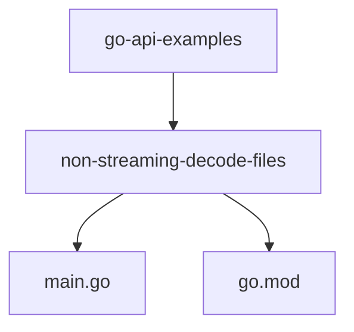
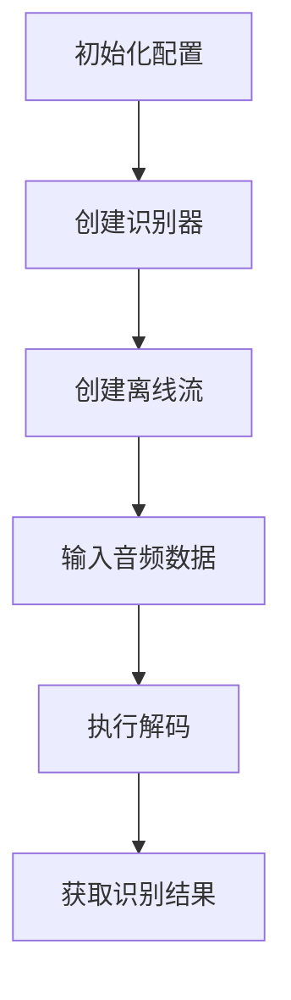
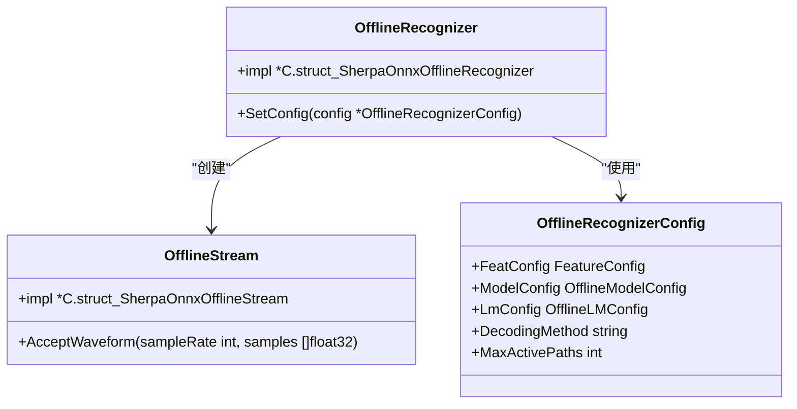
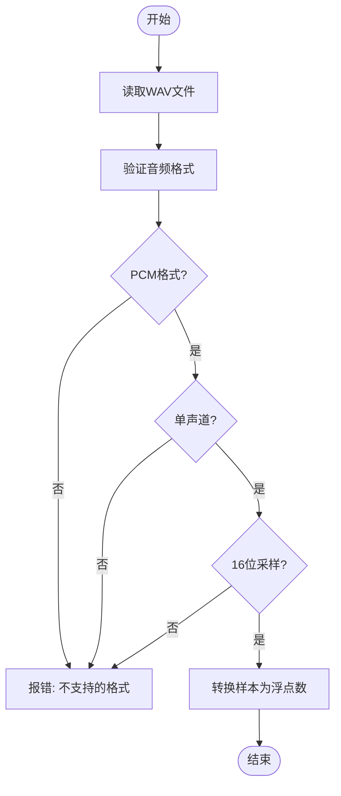
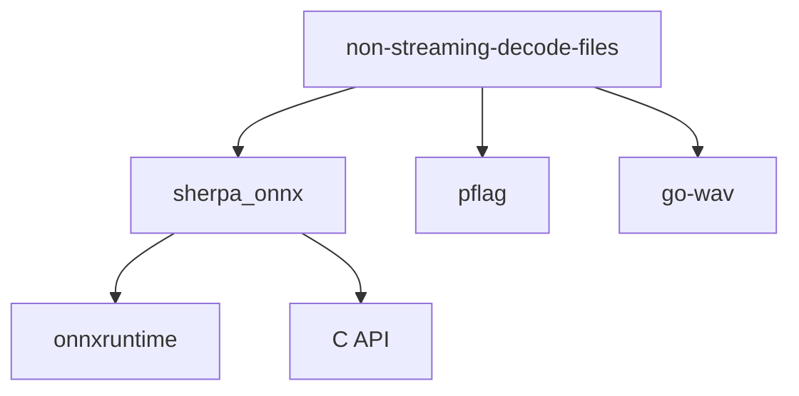

# 非流式语音识别示例

<cite>
**本文档中引用的文件**  
- [main.go](file://go-api-examples/non-streaming-decode-files/main.go)
- [sherpa_onnx.go](file://scripts/go/sherpa_onnx.go)
- [go.mod](file://go-api-examples/non-streaming-decode-files/go.mod)
</cite>

## 目录
1. [简介](#简介)
2. [项目结构](#项目结构)
3. [核心组件](#核心组件)
4. [架构概述](#架构概述)
5. [详细组件分析](#详细组件分析)
6. [依赖分析](#依赖分析)
7. [性能考虑](#性能考虑)
8. [故障排除指南](#故障排除指南)
9. [结论](#结论)

## 简介
本文档详细介绍了sherpa-onnx的非流式语音识别Go API示例。文档深入解析了音频文件解码流程、模型加载机制和离线推理过程，重点说明了如何配置解码参数、处理音频输入和获取识别结果。通过实际代码示例，展示了从初始化到清理的完整调用流程，并解释了关键函数如模型加载、音频读取和结果解析的实现细节。同时提供了错误处理策略和性能优化建议，如内存管理与并发处理模式。

## 项目结构
非流式语音识别的Go API示例位于`go-api-examples`目录下，主要包含`non-streaming-decode-files`子目录。该目录包含实现非流式语音识别的核心代码文件和模块定义。

**图源**  
- [main.go](file://go-api-examples/non-streaming-decode-files/main.go)
- [go.mod](file://go-api-examples/non-streaming-decode-files/go.mod)

**节源**  
- [main.go](file://go-api-examples/non-streaming-decode-files/main.go)
- [go.mod](file://go-api-examples/non-streaming-decode-files/go.mod)

## 核心组件
非流式语音识别的核心组件包括`OfflineRecognizer`（离线识别器）、`OfflineStream`（离线流）和`OfflineRecognizerConfig`（离线识别器配置）。这些组件共同协作完成从音频文件读取到最终文本识别的完整流程。

**节源**  
- [main.go](file://go-api-examples/non-streaming-decode-files/main.go)
- [sherpa_onnx.go](file://scripts/go/sherpa_onnx.go)

## 架构概述
非流式语音识别的架构主要包括三个主要阶段：模型初始化、音频处理和推理识别。首先通过配置参数初始化识别器，然后读取并处理音频文件，最后通过离线流进行推理并获取识别结果。

**图源**  
- [main.go](file://go-api-examples/non-streaming-decode-files/main.go)
- [sherpa_onnx.go](file://scripts/go/sherpa_onnx.go)

## 详细组件分析
### 离线识别器分析
离线识别器是整个非流式语音识别系统的核心，负责管理模型加载、配置设置和推理执行。通过`NewOfflineRecognizer`函数创建识别器实例，并通过`DeleteOfflineRecognizer`函数进行资源清理。

#### 类图

**图源**  
- [sherpa_onnx.go](file://scripts/go/sherpa_onnx.go#L819-L839)
- [main.go](file://go-api-examples/non-streaming-decode-files/main.go#L18-L74)

### 音频处理流程
音频处理流程包括读取WAV文件、验证音频格式和将16位整数样本转换为浮点数。该流程确保输入音频符合模型要求的格式。

#### 流程图

**图源**  
- [main.go](file://go-api-examples/non-streaming-decode-files/main.go#L109-L162)

**节源**  
- [main.go](file://go-api-examples/non-streaming-decode-files/main.go#L109-L162)

## 依赖分析
非流式语音识别示例依赖于多个外部库和内部组件。主要依赖包括`github.com/k2-fsa/sherpa-onnx-go/sherpa_onnx`核心库、`github.com/spf13/pflag`用于命令行参数解析，以及`github.com/youpy/go-wav`用于WAV文件读取。

**图源**  
- [main.go](file://go-api-examples/non-streaming-decode-files/main.go#L10-L12)
- [go.mod](file://go-api-examples/non-streaming-decode-files/go.mod)

**节源**  
- [main.go](file://go-api-examples/non-streaming-decode-files/main.go)
- [go.mod](file://go-api-examples/non-streaming-decode-files/go.mod)

## 性能考虑
在使用非流式语音识别时，需要考虑以下几个性能优化方面：

1. **线程配置**：通过`num-threads`参数配置神经网络计算使用的线程数，可以根据CPU核心数进行优化
2. **执行提供程序**：通过`provider`参数选择执行提供程序（cpu、cuda、coreml），GPU加速可以显著提升性能
3. **内存管理**：及时调用`DeleteOfflineRecognizer`和`DeleteOfflineStream`释放资源，避免内存泄漏
4. **批量处理**：使用`DecodeStreams`方法可以并行处理多个音频流，提高吞吐量

## 故障排除指南
### 常见错误及解决方案
1. **音频格式错误**：确保输入的WAV文件是PCM格式、单声道、16位采样
2. **模型文件缺失**：检查模型路径是否正确，确保所有必需的模型文件都存在
3. **内存不足**：对于大型模型，确保系统有足够的内存，或减少线程数
4. **解码失败**：检查模型配置是否与训练时的参数匹配（如sample-rate、feat-dim）

**节源**  
- [main.go](file://go-api-examples/non-streaming-decode-files/main.go#L115-L137)

## 结论
sherpa-onnx的非流式语音识别Go API提供了一个完整、高效的离线语音识别解决方案。通过合理的配置和使用，可以实现高质量的语音到文本转换。关键要点包括正确配置识别器参数、处理音频输入格式、管理内存资源以及利用并发处理提高性能。该API适用于需要离线语音识别的各种应用场景，具有良好的可扩展性和性能表现。