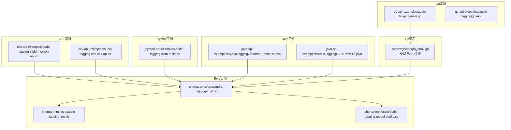
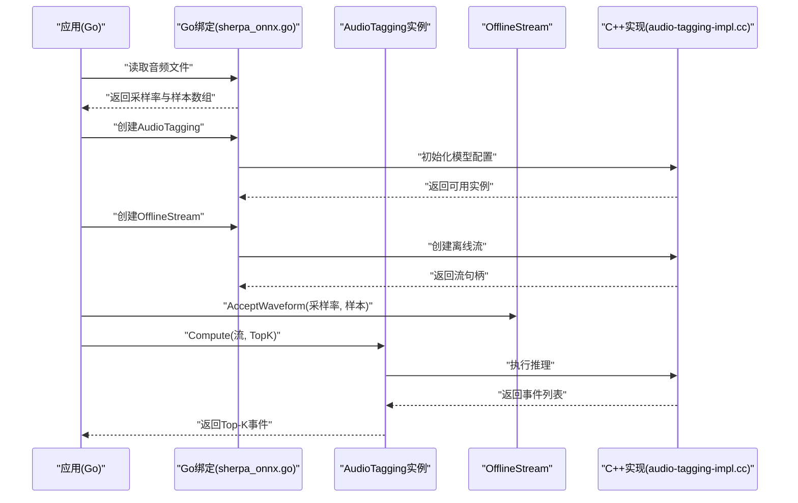
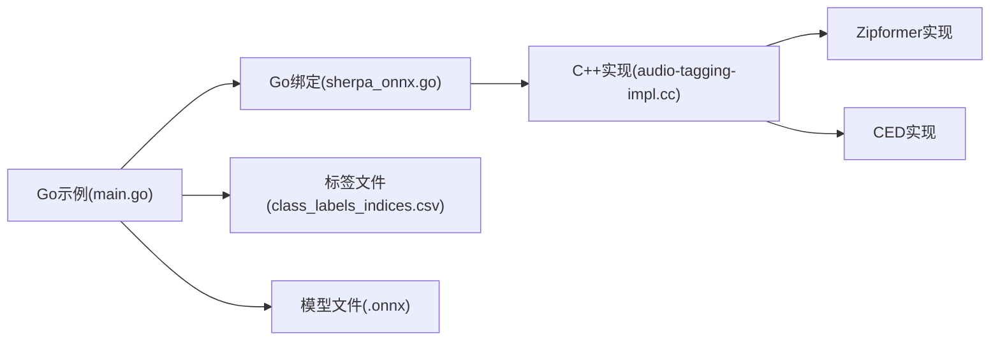

# 音频标签识别示例

<cite>
**本文引用的文件列表**
- [go-api-examples/audio-tagging/main.go](file://go-api-examples/audio-tagging/main.go)
- [go-api-examples/audio-tagging/go.mod](file://go-api-examples/audio-tagging/go.mod)
- [scripts/go/sherpa_onnx.go](file://scripts/go/sherpa_onnx.go)
- [cxx-api-examples/audio-tagging-zipformer-cxx-api.cc](file://cxx-api-examples/audio-tagging-zipformer-cxx-api.cc)
- [cxx-api-examples/audio-tagging-ced-cxx-api.cc](file://cxx-api-examples/audio-tagging-ced-cxx-api.cc)
- [python-api-examples/audio-tagging-from-a-file.py](file://python-api-examples/audio-tagging-from-a-file.py)
- [java-api-examples/AudioTaggingZipformerFromFile.java](file://java-api-examples/AudioTaggingZipformerFromFile.java)
- [java-api-examples/AudioTaggingCEDFromFile.java](file://java-api-examples/AudioTaggingCEDFromFile.java)
- [sherpa-onnx/csrc/audio-tagging-impl.h](file://sherpa-onnx/csrc/audio-tagging-impl.h)
- [sherpa-onnx/csrc/audio-tagging-impl.cc](file://sherpa-onnx/csrc/audio-tagging-impl.cc)
- [sherpa-onnx/csrc/audio-tagging-model-config.cc](file://sherpa-onnx/csrc/audio-tagging-model-config.cc)
- [go-api-examples/README.md](file://go-api-examples/README.md)
</cite>

## 目录
1. [简介](#简介)
2. [项目结构](#项目结构)
3. [核心组件](#核心组件)
4. [架构总览](#架构总览)
5. [组件详解](#组件详解)
6. [依赖关系分析](#依赖关系分析)
7. [性能与实时性](#性能与实时性)
8. [故障排查指南](#故障排查指南)
9. [结论](#结论)
10. [附录：应用场景与最佳实践](#附录应用场景与最佳实践)

## 简介
本文件围绕sherpa-onnx的Go API音频标签识别示例，系统讲解音频事件检测与分类的实现机制，涵盖声学特征提取、模型推理与标签映射流程；详细说明如何配置音频标签模型参数（Zipformer/CED）、处理不同环境声音识别；展示结果解析与置信度分析方法，并给出在智能家居、安防监控等场景的应用建议。示例以Go语言为主，同时参考了C++、Python、Java等多语言实现，帮助读者建立跨平台理解。

## 项目结构
与音频标签识别直接相关的目录与文件：
- Go示例：go-api-examples/audio-tagging
- Go绑定实现：scripts/go/sherpa_onnx.go
- C++示例：cxx-api-examples/audio-tagging-*.cc
- Python示例：python-api-examples/audio-tagging-from-a-file.py
- Java示例：java-api-examples/AudioTaggingZipformerFromFile.java、AudioTaggingCEDFromFile.java
- 核心C++实现：sherpa-onnx/csrc/audio-tagging-*.cc / *.h

图表来源
- [go-api-examples/audio-tagging/main.go](file://go-api-examples/audio-tagging/main.go#L1-L37)
- [scripts/go/sherpa_onnx.go](file://scripts/go/sherpa_onnx.go#L2060-L2254)
- [cxx-api-examples/audio-tagging-zipformer-cxx-api.cc](file://cxx-api-examples/audio-tagging-zipformer-cxx-api.cc#L1-L84)
- [cxx-api-examples/audio-tagging-ced-cxx-api.cc](file://cxx-api-examples/audio-tagging-ced-cxx-api.cc#L1-L83)
- [python-api-examples/audio-tagging-from-a-file.py](file://python-api-examples/audio-tagging-from-a-file.py#L1-L122)
- [java-api-examples/AudioTaggingZipformerFromFile.java](file://java-api-examples/AudioTaggingZipformerFromFile.java#L43-L68)
- [java-api-examples/AudioTaggingCEDFromFile.java](file://java-api-examples/AudioTaggingCEDFromFile.java#L35-L60)
- [sherpa-onnx/csrc/audio-tagging-impl.h](file://sherpa-onnx/csrc/audio-tagging-impl.h#L1-L40)
- [sherpa-onnx/csrc/audio-tagging-impl.cc](file://sherpa-onnx/csrc/audio-tagging-impl.cc#L1-L49)
- [sherpa-onnx/csrc/audio-tagging-model-config.cc](file://sherpa-onnx/csrc/audio-tagging-model-config.cc#L1-L63)

章节来源
- [go-api-examples/README.md](file://go-api-examples/README.md#L1-L47)

## 核心组件
- 配置结构
  - Go: AudioTaggingConfig、AudioTaggingModelConfig、OfflineZipformerAudioTaggingModelConfig、AudioEvent
  - C++: AudioTaggingConfig、AudioEvent、AudioTaggingImpl接口
- 运行时对象
  - AudioTagging（Go中为结构体包装，底层由C++实现）
  - OfflineStream（离线流，用于接收波形并触发推理）
- 关键API
  - NewAudioTagging / NewOfflineStream / Compute
  - ReadWave（读取音频文件）

章节来源
- [scripts/go/sherpa_onnx.go](file://scripts/go/sherpa_onnx.go#L2060-L2254)
- [sherpa-onnx/csrc/audio-tagging-impl.h](file://sherpa-onnx/csrc/audio-tagging-impl.h#L1-L40)
- [sherpa-onnx/csrc/audio-tagging-impl.cc](file://sherpa-onnx/csrc/audio-tagging-impl.cc#L1-L49)

## 架构总览
音频标签识别的端到端流程如下：
- 输入音频文件通过ReadWave读取为采样数组与采样率
- 创建离线流OfflineStream并调用AcceptWaveform注入音频
- 调用Compute执行模型推理，返回Top-K候选事件（包含名称、索引、概率）
- 结果按置信度排序，供上层业务使用

图表来源
- [go-api-examples/audio-tagging/main.go](file://go-api-examples/audio-tagging/main.go#L1-L37)
- [scripts/go/sherpa_onnx.go](file://scripts/go/sherpa_onnx.go#L2060-L2254)
- [sherpa-onnx/csrc/audio-tagging-impl.cc](file://sherpa-onnx/csrc/audio-tagging-impl.cc#L1-L49)

## 组件详解

### Go示例入口与配置
- 示例程序展示了如何设置模型路径、线程数、调试开关、设备提供者、标签文件与TopK数量
- 使用NewAudioTagging创建推理器，NewAudioTaggingStream创建离线流，Compute执行推理
- 读取音频后通过AcceptWaveform注入，最终打印Top-K结果

章节来源
- [go-api-examples/audio-tagging/main.go](file://go-api-examples/audio-tagging/main.go#L1-L37)
- [go-api-examples/audio-tagging/go.mod](file://go-api-examples/audio-tagging/go.mod#L1-L5)

### Go绑定与类型定义
- Go侧定义了AudioTaggingConfig、AudioTaggingModelConfig、OfflineZipformerAudioTaggingModelConfig、AudioEvent等结构体
- NewAudioTagging负责将Go配置转换为C结构并通过C接口创建实例
- Compute负责调用底层推理并释放结果指针，将C结构体转换为Go切片

章节来源
- [scripts/go/sherpa_onnx.go](file://scripts/go/sherpa_onnx.go#L2060-L2254)

### 模型选择与配置校验
- 支持两种模型路径：Zipformer或CED，二者二选一
- 配置项包含num_threads、debug、provider等
- 校验逻辑确保至少提供一个有效模型路径，且文件存在

章节来源
- [sherpa-onnx/csrc/audio-tagging-model-config.cc](file://sherpa-onnx/csrc/audio-tagging-model-config.cc#L1-L63)

### 推理实现与模型分发
- AudioTaggingImpl::Create根据配置选择具体实现：Zipformer或CED
- Compute返回AudioEvent向量，包含名称、索引与概率

章节来源
- [sherpa-onnx/csrc/audio-tagging-impl.cc](file://sherpa-onnx/csrc/audio-tagging-impl.cc#L1-L49)
- [sherpa-onnx/csrc/audio-tagging-impl.h](file://sherpa-onnx/csrc/audio-tagging-impl.h#L1-L40)

### 多语言对比与一致性
- C++示例分别演示Zipformer与CED两种模型的加载与推理流程
- Python示例展示了完整的下载与验证逻辑，以及RTF计算
- Java示例展示了流式接受波形与输出概率排序

章节来源
- [cxx-api-examples/audio-tagging-zipformer-cxx-api.cc](file://cxx-api-examples/audio-tagging-zipformer-cxx-api.cc#L1-L84)
- [cxx-api-examples/audio-tagging-ced-cxx-api.cc](file://cxx-api-examples/audio-tagging-ced-cxx-api.cc#L1-L83)
- [python-api-examples/audio-tagging-from-a-file.py](file://python-api-examples/audio-tagging-from-a-file.py#L1-L122)
- [java-api-examples/AudioTaggingZipformerFromFile.java](file://java-api-examples/AudioTaggingZipformerFromFile.java#L43-L68)
- [java-api-examples/AudioTaggingCEDFromFile.java](file://java-api-examples/AudioTaggingCEDFromFile.java#L35-L60)

### 结果解析与置信度分析
- 返回的AudioEvent包含名称、索引、概率三要素
- 上层可按概率降序排序，选取Top-K作为最终结果
- 可结合标签文件进行语义映射，将索引映射到人类可读类别

章节来源
- [scripts/go/sherpa_onnx.go](file://scripts/go/sherpa_onnx.go#L2060-L2254)
- [python-api-examples/audio-tagging-from-a-file.py](file://python-api-examples/audio-tagging-from-a-file.py#L1-L122)

## 依赖关系分析
- Go示例依赖Go绑定库，后者通过C接口调用C++实现
- C++实现根据配置选择Zipformer或CED实现类
- 所有语言示例共享同一套标签文件与模型文件命名约定

图表来源
- [go-api-examples/audio-tagging/main.go](file://go-api-examples/audio-tagging/main.go#L1-L37)
- [scripts/go/sherpa_onnx.go](file://scripts/go/sherpa_onnx.go#L2060-L2254)
- [sherpa-onnx/csrc/audio-tagging-impl.cc](file://sherpa-onnx/csrc/audio-tagging-impl.cc#L1-L49)

## 性能与实时性
- 示例中提供了RTF（实时因子）计算方式，便于评估推理速度
- 可通过调整num_threads、provider等配置优化性能
- 对于低延迟需求，可考虑使用流式模型或硬件加速提供者

章节来源
- [python-api-examples/audio-tagging-from-a-file.py](file://python-api-examples/audio-tagging-from-a-file.py#L1-L122)
- [cxx-api-examples/audio-tagging-zipformer-cxx-api.cc](file://cxx-api-examples/audio-tagging-zipformer-cxx-api.cc#L1-L84)
- [cxx-api-examples/audio-tagging-ced-cxx-api.cc](file://cxx-api-examples/audio-tagging-ced-cxx-api.cc#L1-L83)

## 故障排查指南
- 模型路径错误
  - 症状：初始化失败或空指针
  - 处理：确认模型文件存在且路径正确，检查配置中的ced或zipformer字段
- 标签文件缺失
  - 症状：推理成功但无法进行语义映射
  - 处理：提供正确的标签文件路径
- 采样率不匹配
  - 症状：推理异常或结果异常
  - 处理：确保输入音频采样率与模型期望一致
- 线程与提供者配置不当
  - 症状：性能不佳或运行失败
  - 处理：根据硬件选择合适的provider与num_threads

章节来源
- [sherpa-onnx/csrc/audio-tagging-model-config.cc](file://sherpa-onnx/csrc/audio-tagging-model-config.cc#L1-L63)
- [python-api-examples/audio-tagging-from-a-file.py](file://python-api-examples/audio-tagging-from-a-file.py#L1-L122)

## 结论
该Go示例完整展示了sherpa-onnx音频标签识别的端到端流程：从配置模型与标签文件，到离线流注入音频，再到推理与结果解析。通过多语言示例的对照，可以快速迁移至其他平台。在实际工程中，建议结合标签文件进行语义映射，利用TopK与置信度阈值控制误报，并根据部署环境选择合适的provider与线程数以平衡性能与资源占用。

## 附录：应用场景与最佳实践
- 智能家居
  - 识别门铃、水龙头、宠物叫声等，触发自动化动作
  - 建议：设置合理置信度阈值，避免误触发；对高频事件可降低TopK以减少冗余
- 安防监控
  - 识别警报声、玻璃破碎、脚步声等，联动告警系统
  - 建议：结合时间窗聚合与多通道融合，提高鲁棒性；对历史事件做统计分析
- 工业监测
  - 识别设备异常噪声，辅助预测性维护
  - 建议：针对特定设备训练定制模型；结合传感器数据进行多模态融合

[本节为概念性内容，无需列出章节来源]