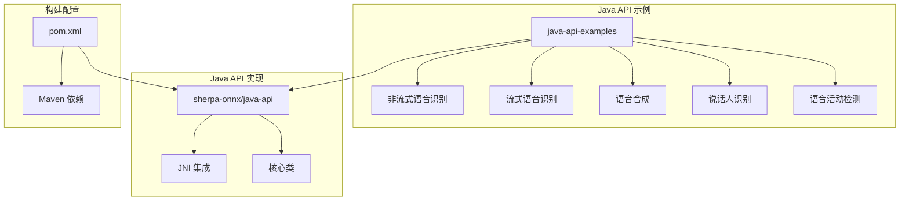
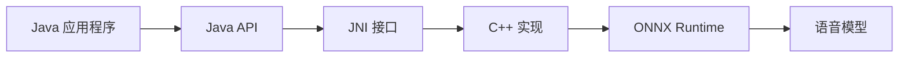
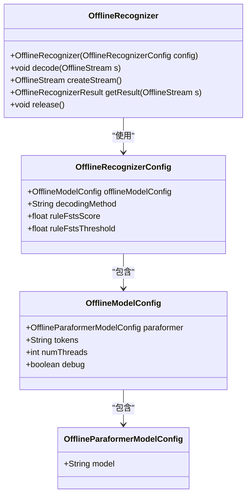
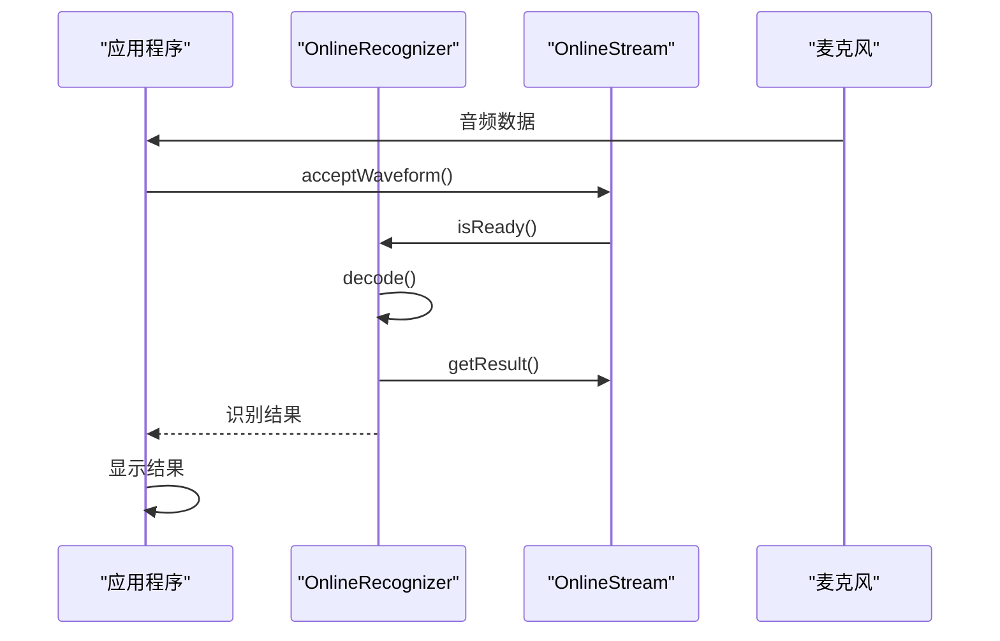
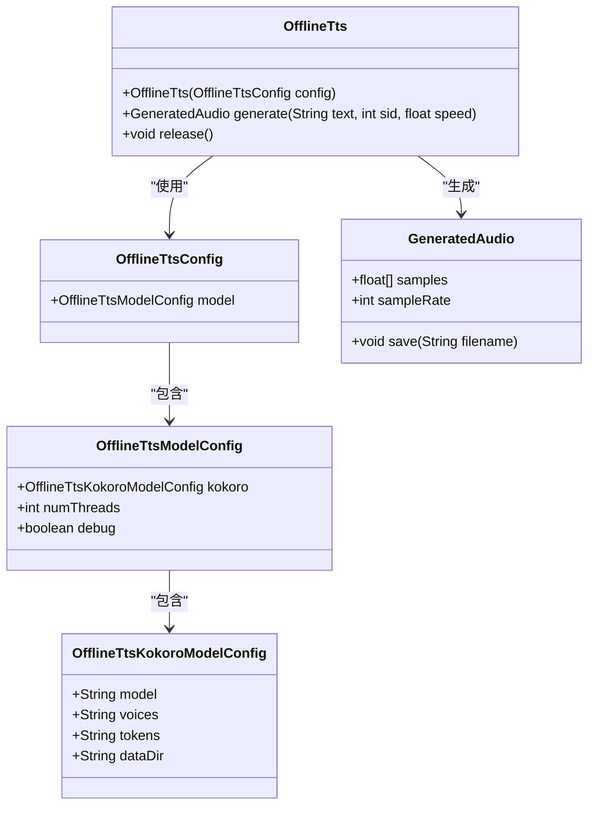
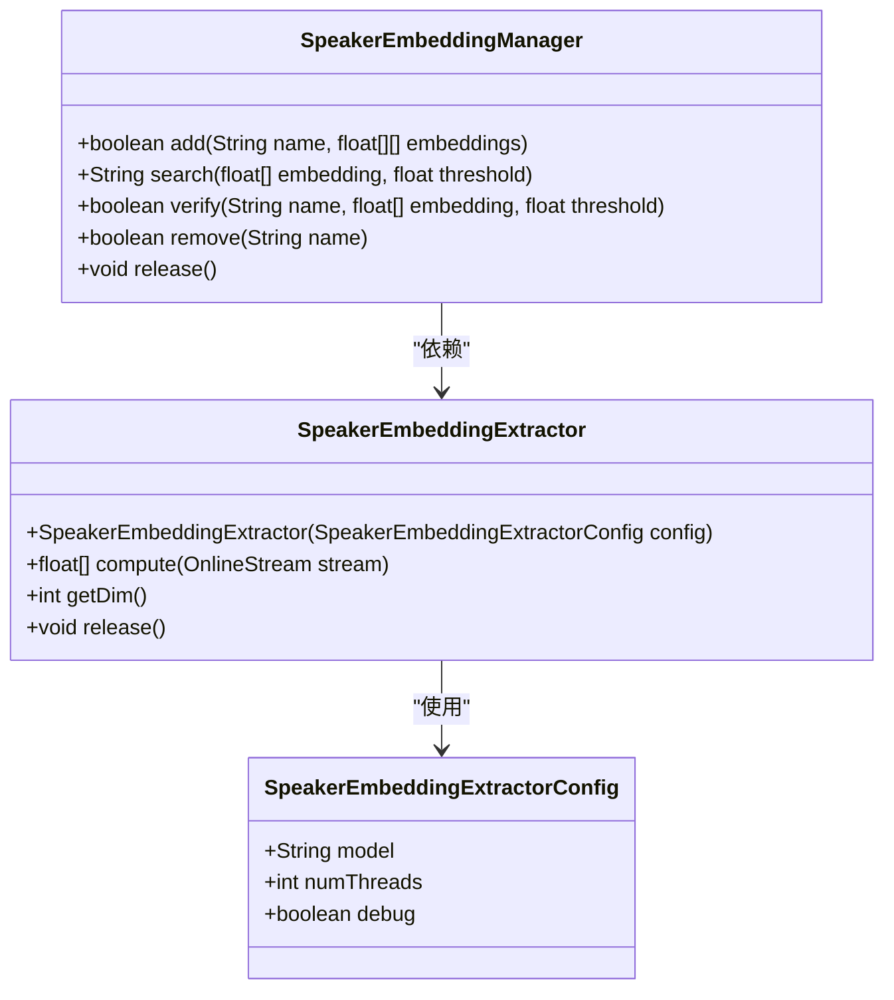
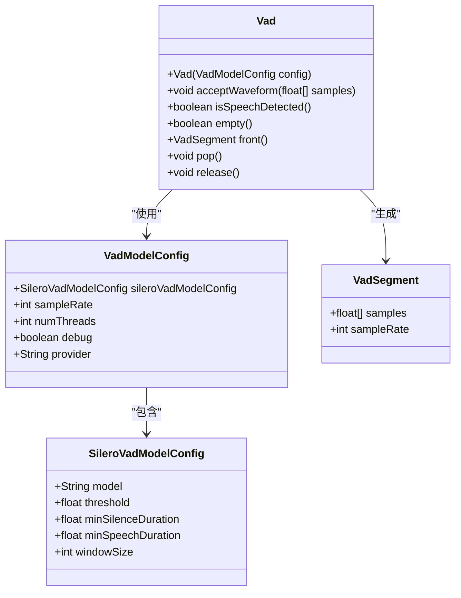
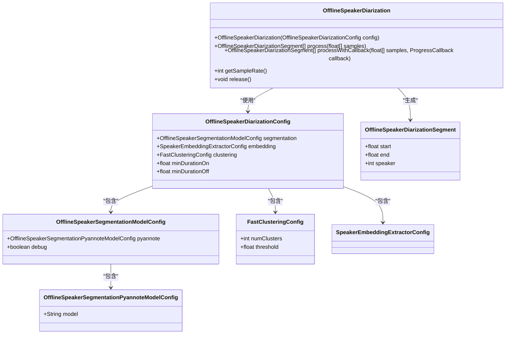
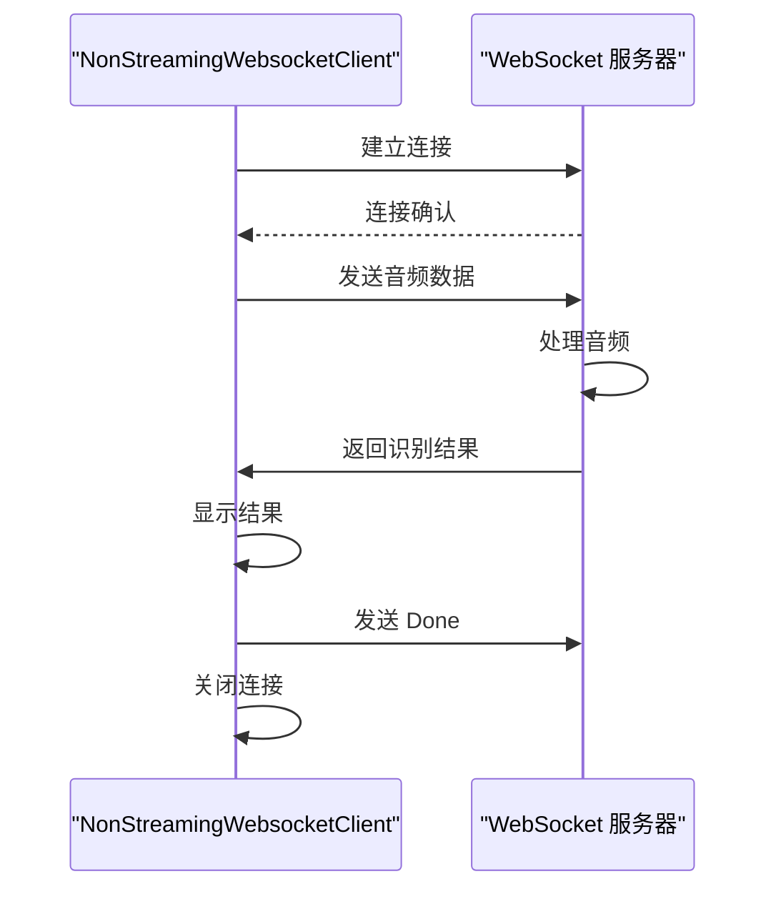
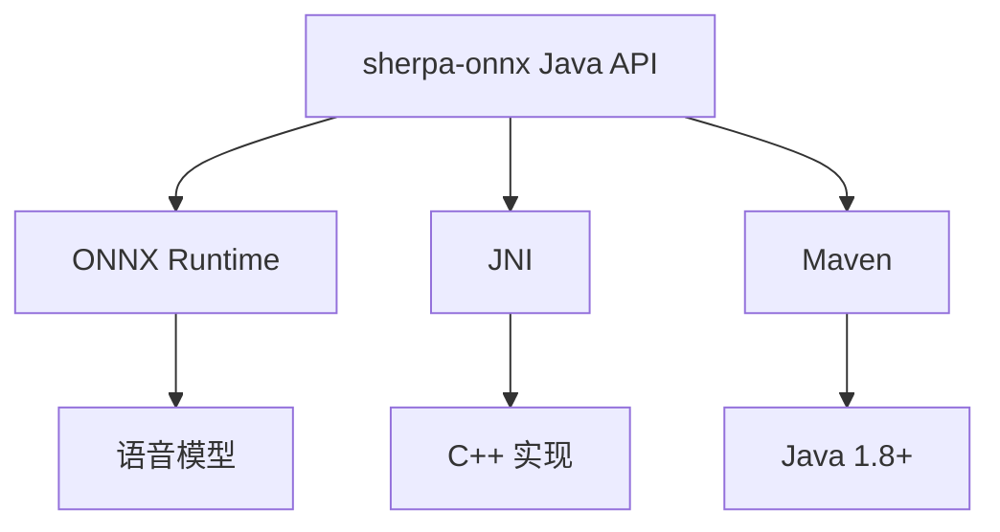

# Java API 示例

<cite>
**本文档中引用的文件**
- [java-api-examples/README.md](file://java-api-examples/README.md)
- [sherpa-onnx/java-api/README.md](file://sherpa-onnx/java-api/README.md)
- [pom.xml](file://pom.xml)
- [java-api-examples/NonStreamingDecodeFileParaformer.java](file://java-api-examples/NonStreamingDecodeFileParaformer.java)
- [java-api-examples/StreamingAsrFromMicTransducer.java](file://java-api-examples/StreamingAsrFromMicTransducer.java)
- [java-api-examples/NonStreamingTtsKokoroEn.java](file://java-api-examples/NonStreamingTtsKokoroEn.java)
- [java-api-examples/SpeakerIdentification.java](file://java-api-examples/SpeakerIdentification.java)
- [java-api-examples/VadFromMic.java](file://java-api-examples/VadFromMic.java)
- [java-api-examples/OfflineSpeakerDiarizationDemo.java](file://java-api-examples/OfflineSpeakerDiarizationDemo.java)
- [java-api-examples/NonStreamingWebsocketClient.java](file://java-api-examples/NonStreamingWebsocketClient.java)
- [sherpa-onnx/java-api/src/main/java/com/k2fsa/sherpa/onnx/OfflineTts.java](file://sherpa-onnx/java-api/src/main/java/com/k2fsa/sherpa/onnx/OfflineTts.java)
- [sherpa-onnx/java-api/src/main/java/com/k2fsa/sherpa/onnx/OnlineRecognizer.java](file://sherpa-onnx/java-api/src/main/java/com/k2fsa/sherpa/onnx/OnlineRecognizer.java)
- [sherpa-onnx/java-api/src/main/java/com/k2fsa/sherpa/onnx/OfflineRecognizer.java](file://sherpa-onnx/java-api/src/main/java/com/k2fsa/sherpa/onnx/OfflineRecognizer.java)
</cite>

## 目录
1. [简介](#简介)
2. [项目结构](#项目结构)
3. [核心组件](#核心组件)
4. [架构概述](#架构概述)
5. [详细组件分析](#详细组件分析)
6. [依赖分析](#依赖分析)
7. [性能考虑](#性能考虑)
8. [故障排除指南](#故障排除指南)
9. [结论](#结论)

## 简介

sherpa-onnx 是一个功能强大的语音处理库，提供了丰富的 Java API 示例，涵盖了非流式语音识别、流式语音识别、语音合成、说话人识别、语音活动检测等多种语音处理功能。本文档将系统性地组织和解释这些 Java API 示例，提供详细的代码解析，说明类的结构和方法调用，解释 Java API 与 JNI 的集成方式和数据传递机制，并展示如何编译和运行这些示例。

## 项目结构

sherpa-onnx 项目的 Java API 示例主要位于 `java-api-examples` 目录中，该目录包含了各种语音处理功能的示例代码。每个示例文件都展示了特定功能的使用方法，如非流式语音识别、流式语音识别、语音合成等。此外，`sherpa-onnx/java-api` 目录包含了 Java API 的实现，而 `pom.xml` 文件定义了 Maven 项目的依赖关系。

**图示来源**
- [java-api-examples](file://java-api-examples)
- [sherpa-onnx/java-api](file://sherpa-onnx/java-api)
- [pom.xml](file://pom.xml)

**节来源**
- [java-api-examples](file://java-api-examples)
- [sherpa-onnx/java-api](file://sherpa-onnx/java-api)
- [pom.xml](file://pom.xml)

## 核心组件

sherpa-onnx 的 Java API 核心组件包括 `OfflineRecognizer`、`OnlineRecognizer`、`OfflineTts`、`SpeakerEmbeddingExtractor` 和 `Vad` 等类。这些类分别用于非流式语音识别、流式语音识别、语音合成、说话人识别和语音活动检测。每个类都提供了相应的配置类，如 `OfflineRecognizerConfig`、`OnlineRecognizerConfig`、`OfflineTtsConfig` 等，用于设置模型参数和运行时选项。

**节来源**
- [java-api-examples/NonStreamingDecodeFileParaformer.java](file://java-api-examples/NonStreamingDecodeFileParaformer.java)
- [java-api-examples/StreamingAsrFromMicTransducer.java](file://java-api-examples/StreamingAsrFromMicTransducer.java)
- [java-api-examples/NonStreamingTtsKokoroEn.java](file://java-api-examples/NonStreamingTtsKokoroEn.java)
- [java-api-examples/SpeakerIdentification.java](file://java-api-examples/SpeakerIdentification.java)
- [java-api-examples/VadFromMic.java](file://java-api-examples/VadFromMic.java)

## 架构概述

sherpa-onnx 的 Java API 架构基于 JNI（Java Native Interface）技术，通过 JNI 调用底层的 C++ 实现。Java 层提供了高级的 API 接口，而底层的 C++ 代码负责实际的语音处理任务。这种架构使得 Java 应用程序能够高效地利用本地代码的性能优势，同时保持了 Java 语言的易用性和跨平台特性。

**图示来源**
- [sherpa-onnx/java-api/src/main/java/com/k2fsa/sherpa/onnx/OfflineTts.java](file://sherpa-onnx/java-api/src/main/java/com/k2fsa/sherpa/onnx/OfflineTts.java)
- [sherpa-onnx/java-api/src/main/java/com/k2fsa/sherpa/onnx/OnlineRecognizer.java](file://sherpa-onnx/java-api/src/main/java/com/k2fsa/sherpa/onnx/OnlineRecognizer.java)
- [sherpa-onnx/java-api/src/main/java/com/k2fsa/sherpa/onnx/OfflineRecognizer.java](file://sherpa-onnx/java-api/src/main/java/com/k2fsa/sherpa/onnx/OfflineRecognizer.java)

**节来源**
- [sherpa-onnx/java-api/README.md](file://sherpa-onnx/java-api/README.md)

## 详细组件分析

### 非流式语音识别分析

非流式语音识别通过 `OfflineRecognizer` 类实现，该类使用 `OfflineRecognizerConfig` 配置模型参数。示例代码展示了如何加载模型文件、创建识别器、处理音频文件并获取识别结果。

**图示来源**
- [java-api-examples/NonStreamingDecodeFileParaformer.java](file://java-api-examples/NonStreamingDecodeFileParaformer.java)
- [sherpa-onnx/java-api/src/main/java/com/k2fsa/sherpa/onnx/OfflineRecognizer.java](file://sherpa-onnx/java-api/src/main/java/com/k2fsa/sherpa/onnx/OfflineRecognizer.java)

**节来源**
- [java-api-examples/NonStreamingDecodeFileParaformer.java](file://java-api-examples/NonStreamingDecodeFileParaformer.java)

### 流式语音识别分析

流式语音识别通过 `OnlineRecognizer` 类实现，该类支持实时语音识别。示例代码展示了如何从麦克风获取音频流、实时处理音频数据并输出识别结果。

**图示来源**
- [java-api-examples/StreamingAsrFromMicTransducer.java](file://java-api-examples/StreamingAsrFromMicTransducer.java)
- [sherpa-onnx/java-api/src/main/java/com/k2fsa/sherpa/onnx/OnlineRecognizer.java](file://sherpa-onnx/java-api/src/main/java/com/k2fsa/sherpa/onnx/OnlineRecognizer.java)

**节来源**
- [java-api-examples/StreamingAsrFromMicTransducer.java](file://java-api-examples/StreamingAsrFromMicTransducer.java)

### 语音合成分析

语音合成通过 `OfflineTts` 类实现，该类使用 `OfflineTtsConfig` 配置模型参数。示例代码展示了如何加载 TTS 模型、生成语音并保存为 WAV 文件。

**图示来源**
- [java-api-examples/NonStreamingTtsKokoroEn.java](file://java-api-examples/NonStreamingTtsKokoroEn.java)
- [sherpa-onnx/java-api/src/main/java/com/k2fsa/sherpa/onnx/OfflineTts.java](file://sherpa-onnx/java-api/src/main/java/com/k2fsa/sherpa/onnx/OfflineTts.java)

**节来源**
- [java-api-examples/NonStreamingTtsKokoroEn.java](file://java-api-examples/NonStreamingTtsKokoroEn.java)

### 说话人识别分析

说话人识别通过 `SpeakerEmbeddingExtractor` 和 `SpeakerEmbeddingManager` 类实现。示例代码展示了如何提取说话人嵌入、注册说话人并进行说话人识别。

**图示来源**
- [java-api-examples/SpeakerIdentification.java](file://java-api-examples/SpeakerIdentification.java)
- [sherpa-onnx/java-api/src/main/java/com/k2fsa/sherpa/onnx/SpeakerEmbeddingExtractor.java](file://sherpa-onnx/java-api/src/main/java/com/k2fsa/sherpa/onnx/SpeakerEmbeddingExtractor.java)
- [sherpa-onnx/java-api/src/main/java/com/k2fsa/sherpa/onnx/SpeakerEmbeddingManager.java](file://sherpa-onnx/java-api/src/main/java/com/k2fsa/sherpa/onnx/SpeakerEmbeddingManager.java)

**节来源**
- [java-api-examples/SpeakerIdentification.java](file://java-api-examples/SpeakerIdentification.java)

### 语音活动检测分析

语音活动检测通过 `Vad` 类实现，该类使用 `VadModelConfig` 配置模型参数。示例代码展示了如何从麦克风获取音频流、检测语音活动并保存检测到的语音段。

**图示来源**
- [java-api-examples/VadFromMic.java](file://java-api-examples/VadFromMic.java)
- [sherpa-onnx/java-api/src/main/java/com/k2fsa/sherpa/onnx/Vad.java](file://sherpa-onnx/java-api/src/main/java/com/k2fsa/sherpa/onnx/Vad.java)

**节来源**
- [java-api-examples/VadFromMic.java](file://java-api-examples/VadFromMic.java)

### 说话人分离分析

说话人分离通过 `OfflineSpeakerDiarization` 类实现，该类结合了说话人分割和聚类算法。示例代码展示了如何处理包含多个说话人的音频文件，并输出每个说话人的语音段。

**图示来源**
- [java-api-examples/OfflineSpeakerDiarizationDemo.java](file://java-api-examples/OfflineSpeakerDiarizationDemo.java)
- [sherpa-onnx/java-api/src/main/java/com/k2fsa/sherpa/onnx/OfflineSpeakerDiarization.java](file://sherpa-onnx/java-api/src/main/java/com/k2fsa/sherpa/onnx/OfflineSpeakerDiarization.java)

**节来源**
- [java-api-examples/OfflineSpeakerDiarizationDemo.java](file://java-api-examples/OfflineSpeakerDiarizationDemo.java)

### WebSocket 客户端分析

WebSocket 客户端通过 Java 11 的 `HttpClient` 和 `WebSocket` API 实现，用于与 Python 服务器进行通信。示例代码展示了如何建立 WebSocket 连接、发送音频数据并接收识别结果。

**图示来源**
- [java-api-examples/NonStreamingWebsocketClient.java](file://java-api-examples/NonStreamingWebsocketClient.java)
- [python-api-examples/non_streaming_server.py](file://python-api-examples/non_streaming_server.py)

**节来源**
- [java-api-examples/NonStreamingWebsocketClient.java](file://java-api-examples/NonStreamingWebsocketClient.java)

## 依赖分析

sherpa-onnx 的 Java API 依赖于多个外部库和工具，包括 ONNX Runtime、JNI、Maven 等。Maven 通过 `pom.xml` 文件管理项目依赖，确保所有必要的库都能正确加载。JNI 用于连接 Java 代码和底层的 C++ 实现，而 ONNX Runtime 提供了运行 ONNX 模型的能力。

**图示来源**
- [pom.xml](file://pom.xml)
- [sherpa-onnx/java-api/README.md](file://sherpa-onnx/java-api/README.md)

**节来源**
- [pom.xml](file://pom.xml)
- [sherpa-onnx/java-api/README.md](file://sherpa-onnx/java-api/README.md)

## 性能考虑

在使用 sherpa-onnx 的 Java API 时，需要注意以下性能优化建议：
- 使用多线程处理可以提高识别速度，但会增加内存消耗。
- 选择合适的模型可以平衡识别精度和计算资源。
- 对于实时应用，应优化音频采集和处理的延迟。
- 使用回调函数可以实时监控处理进度，避免长时间等待。

## 故障排除指南

在使用 sherpa-onnx 的 Java API 时，可能会遇到以下常见问题：
- **找不到 JNI 库**：确保 `java.library.path` 包含 JNI 库的路径。
- **模型文件路径错误**：检查模型文件路径是否正确，文件是否存在。
- **音频格式不匹配**：确保音频文件的采样率和格式与模型要求一致。
- **内存不足**：增加 JVM 的堆内存大小，或使用更小的模型。

**节来源**
- [sherpa-onnx/java-api/README.md](file://sherpa-onnx/java-api/README.md)

## 结论

sherpa-onnx 的 Java API 提供了丰富的语音处理功能，通过详细的示例代码和清晰的 API 设计，使得开发者能够轻松地集成语音识别、语音合成、说话人识别等功能到自己的应用程序中。通过合理配置和优化，可以实现高性能的语音处理应用。