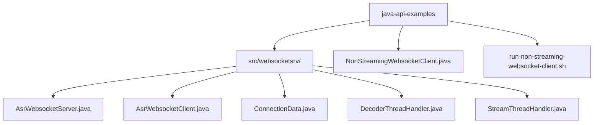
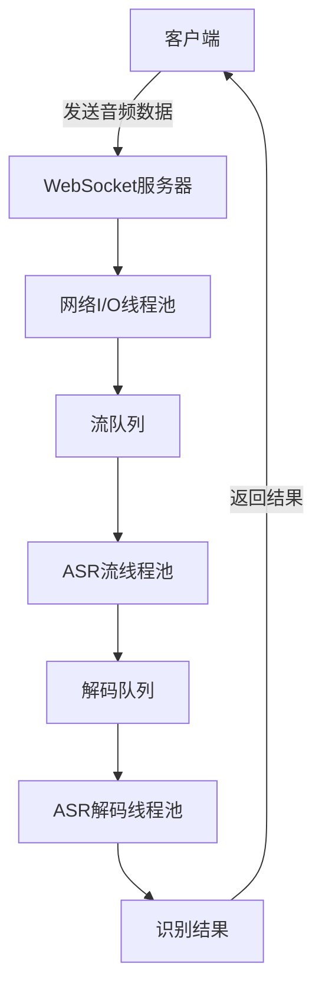
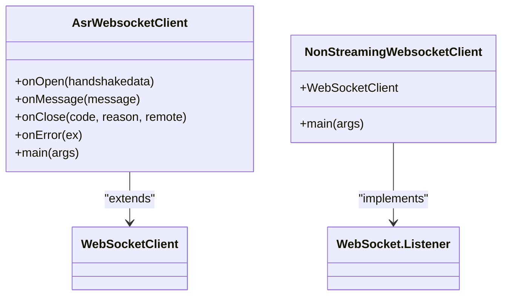
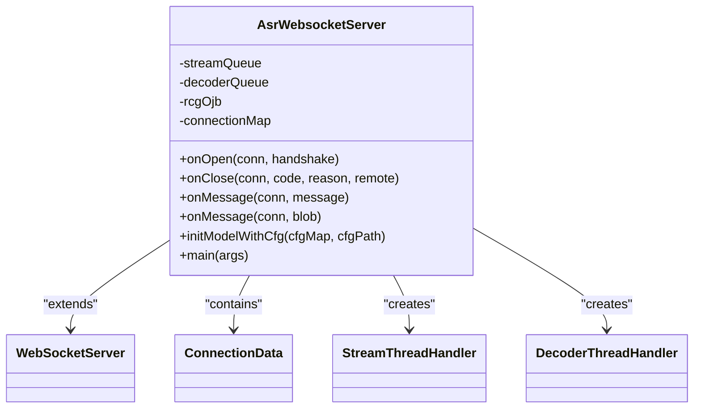
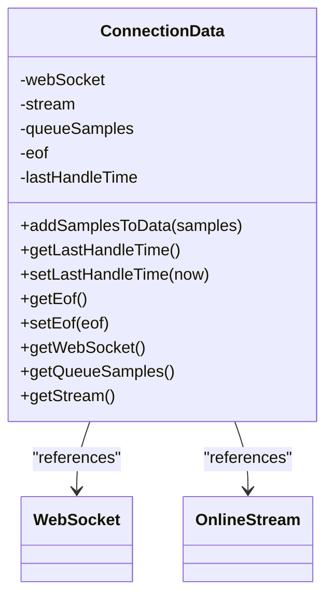
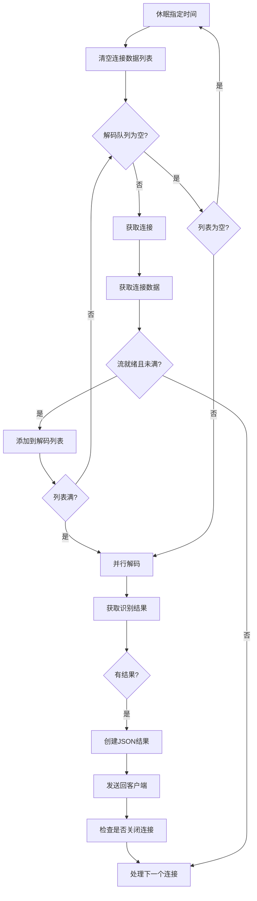
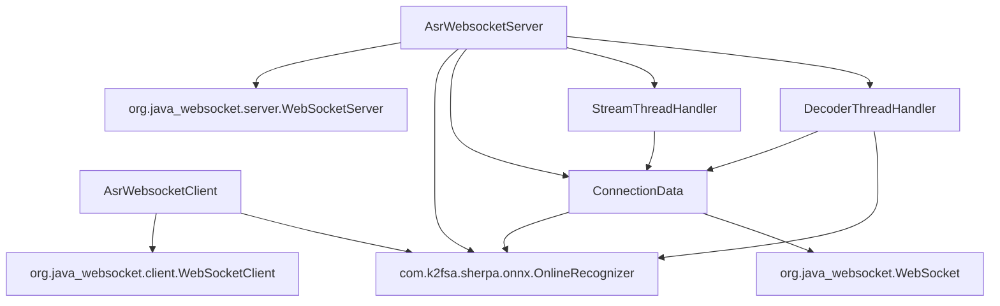

# WebSocket通信示例

<cite>
**本文档中引用的文件**  
- [NonStreamingWebsocketClient.java](file://java-api-examples/NonStreamingWebsocketClient.java)
- [AsrWebsocketClient.java](file://java-api-examples/src/websocketsrv/AsrWebsocketClient.java)
- [AsrWebsocketServer.java](file://java-api-examples/src/websocketsrv/AsrWebsocketServer.java)
- [ConnectionData.java](file://java-api-examples/src/websocketsrv/ConnectionData.java)
- [DecoderThreadHandler.java](file://java-api-examples/src/websocketsrv/DecoderThreadHandler.java)
- [StreamThreadHandler.java](file://java-api-examples/src/websocketsrv/StreamThreadHandler.java)
- [run-non-streaming-websocket-client.sh](file://java-api-examples/run-non-streaming-websocket-client.sh)
</cite>

## 目录
1. [项目结构](#项目结构)
2. [核心组件](#核心组件)
3. [架构概述](#架构概述)
4. [详细组件分析](#详细组件分析)
5. [依赖分析](#依赖分析)
6. [性能考虑](#性能考虑)
7. [故障排除指南](#故障排除指南)
8. [结论](#结论)

## 项目结构

sherpa-onnx项目的Java API WebSocket通信功能主要位于`java-api-examples`目录下，特别是`src/websocketsrv/`子目录中。该实现提供了一个完整的WebSocket通信框架，用于语音数据的实时传输和处理。



**图示来源**  
- [AsrWebsocketServer.java](file://java-api-examples/src/websocketsrv/AsrWebsocketServer.java)
- [AsrWebsocketClient.java](file://java-api-examples/src/websocketsrv/AsrWebsocketClient.java)
- [NonStreamingWebsocketClient.java](file://java-api-examples/NonStreamingWebsocketClient.java)

**本节来源**  
- [AsrWebsocketServer.java](file://java-api-examples/src/websocketsrv/AsrWebsocketServer.java)
- [AsrWebsocketClient.java](file://java-api-examples/src/websocketsrv/AsrWebsocketClient.java)

## 核心组件

sherpa-onnx的Java API WebSocket通信功能由多个核心组件构成，包括客户端、服务器、连接数据管理器、流处理线程处理器和解码线程处理器。这些组件协同工作，实现了高效的语音数据传输和处理。

**本节来源**  
- [AsrWebsocketServer.java](file://java-api-examples/src/websocketsrv/AsrWebsocketServer.java#L33-L248)
- [AsrWebsocketClient.java](file://java-api-examples/src/websocketsrv/AsrWebsocketClient.java#L20-L132)

## 架构概述

sherpa-onnx的WebSocket通信架构采用多线程设计，包含三个主要的线程池：网络I/O线程池、ASR流线程池和ASR解码线程池。这种设计能够有效处理多个并发连接，并实现语音数据的实时传输。



**图示来源**  
- [AsrWebsocketServer.java](file://java-api-examples/src/websocketsrv/AsrWebsocketServer.java#L33-L248)
- [StreamThreadHandler.java](file://java-api-examples/src/websocketsrv/StreamThreadHandler.java#L15-L68)
- [DecoderThreadHandler.java](file://java-api-examples/src/websocketsrv/DecoderThreadHandler.java#L22-L174)

## 详细组件分析

### 客户端分析

sherpa-onnx提供了两种WebSocket客户端实现：`AsrWebsocketClient`和`NonStreamingWebsocketClient`。`AsrWebsocketClient`使用第三方WebSocket库，而`NonStreamingWebsocketClient`使用Java 11内置的WebSocket客户端。



**图示来源**  
- [AsrWebsocketClient.java](file://java-api-examples/src/websocketsrv/AsrWebsocketClient.java#L20-L132)
- [NonStreamingWebsocketClient.java](file://java-api-examples/NonStreamingWebsocketClient.java#L16-L72)

**本节来源**  
- [AsrWebsocketClient.java](file://java-api-examples/src/websocketsrv/AsrWebsocketClient.java#L20-L132)
- [NonStreamingWebsocketClient.java](file://java-api-examples/NonStreamingWebsocketClient.java#L16-L72)

### 服务器分析

`AsrWebsocketServer`是WebSocket服务器的核心实现，它继承自`WebSocketServer`类，并实现了WebSocket通信的各个回调方法。



**图示来源**  
- [AsrWebsocketServer.java](file://java-api-examples/src/websocketsrv/AsrWebsocketServer.java#L33-L248)
- [ConnectionData.java](file://java-api-examples/src/websocketsrv/ConnectionData.java#L15-L66)
- [StreamThreadHandler.java](file://java-api-examples/src/websocketsrv/StreamThreadHandler.java#L15-L68)
- [DecoderThreadHandler.java](file://java-api-examples/src/websocketsrv/DecoderThreadHandler.java#L22-L174)

**本节来源**  
- [AsrWebsocketServer.java](file://java-api-examples/src/websocketsrv/AsrWebsocketServer.java#L33-L248)

### 连接数据管理

`ConnectionData`类作为不同线程池之间的桥梁，存储了每个WebSocket连接的相关数据，包括WebSocket对象、ASR流、接收到的样本数据和连接状态。



**图示来源**  
- [ConnectionData.java](file://java-api-examples/src/websocketsrv/ConnectionData.java#L15-L66)
- [AsrWebsocketServer.java](file://java-api-examples/src/websocketsrv/AsrWebsocketServer.java#L44-L45)

**本节来源**  
- [ConnectionData.java](file://java-api-examples/src/websocketsrv/ConnectionData.java#L15-L66)

### 流处理线程分析

`StreamThreadHandler`负责处理音频流数据，将接收到的样本数据添加到ASR流中，并在数据结束时调用`inputFinished()`方法。

```mermaid
flowchart TD
A[从流队列获取连接] --> B{连接数据为空?}
B --> |否| C[获取连接数据]
C --> D{有样本数据?}
D --> |是| E[循环处理样本数据]
E --> F[调用acceptWaveform()]
F --> G{数据结束?}
G --> |是| H[调用inputFinished()]
H --> I[添加到解码队列]
I --> J[处理下一个连接]
D --> |否| J
G --> |否| I
B --> |是| J
```

**图示来源**  
- [StreamThreadHandler.java](file://java-api-examples/src/websocketsrv/StreamThreadHandler.java#L32-L66)
- [AsrWebsocketServer.java](file://java-api-examples/src/websocketsrv/AsrWebsocketServer.java#L36-L38)

**本节来源**  
- [StreamThreadHandler.java](file://java-api-examples/src/websocketsrv/StreamThreadHandler.java#L15-L68)

### 解码线程分析

`DecoderThreadHandler`负责解码ASR流，获取识别结果，并将结果通过WebSocket发送回客户端。



**图示来源**  
- [DecoderThreadHandler.java](file://java-api-examples/src/websocketsrv/DecoderThreadHandler.java#L53-L172)
- [AsrWebsocketServer.java](file://java-api-examples/src/websocketsrv/AsrWebsocketServer.java#L37-L38)

**本节来源**  
- [DecoderThreadHandler.java](file://java-api-examples/src/websocketsrv/DecoderThreadHandler.java#L22-L174)

## 依赖分析

sherpa-onnx的WebSocket通信功能依赖于多个外部库和内部组件，形成了一个复杂的依赖网络。



**图示来源**  
- [AsrWebsocketClient.java](file://java-api-examples/src/websocketsrv/AsrWebsocketClient.java)
- [AsrWebsocketServer.java](file://java-api-examples/src/websocketsrv/AsrWebsocketServer.java)
- [ConnectionData.java](file://java-api-examples/src/websocketsrv/ConnectionData.java)
- [StreamThreadHandler.java](file://java-api-examples/src/websocketsrv/StreamThreadHandler.java)
- [DecoderThreadHandler.java](file://java-api-examples/src/websocketsrv/DecoderThreadHandler.java)

**本节来源**  
- [AsrWebsocketClient.java](file://java-api-examples/src/websocketsrv/AsrWebsocketClient.java)
- [AsrWebsocketServer.java](file://java-api-examples/src/websocketsrv/AsrWebsocketServer.java)

## 性能考虑

sherpa-onnx的WebSocket通信实现考虑了多个性能因素，包括多线程处理、并行解码和连接超时管理。服务器配置允许调整各种参数以优化性能，如流线程数、解码线程数、并行解码数和连接超时时间。

**本节来源**  
- [AsrWebsocketServer.java](file://java-api-examples/src/websocketsrv/AsrWebsocketServer.java#L148-L162)
- [DecoderThreadHandler.java](file://java-api-examples/src/websocketsrv/DecoderThreadHandler.java#L38-L51)

## 故障排除指南

在使用sherpa-onnx的WebSocket通信功能时，可能会遇到一些常见问题。以下是一些故障排除建议：

1. 确保WebSocket服务器已正确启动并监听指定端口
2. 检查客户端和服务器之间的网络连接
3. 确认音频文件格式符合要求（单声道、16位、任意采样率）
4. 检查服务器日志以获取错误信息
5. 确保so文件路径正确设置

**本节来源**  
- [AsrWebsocketServer.java](file://java-api-examples/src/websocketsrv/AsrWebsocketServer.java)
- [AsrWebsocketClient.java](file://java-api-examples/src/websocketsrv/AsrWebsocketClient.java)
- [NonStreamingWebsocketClient.java](file://java-api-examples/NonStreamingWebsocketClient.java)

## 结论

sherpa-onnx的Java API WebSocket通信功能提供了一个完整、高效的语音数据传输解决方案。通过多线程设计和并行处理，该实现能够处理多个并发连接，并实现实时语音识别。客户端和服务器之间的通信协议清晰，消息格式标准化，使得系统易于集成和扩展。这种架构在构建分布式语音处理系统中具有关键作用，为实时语音应用提供了坚实的基础。