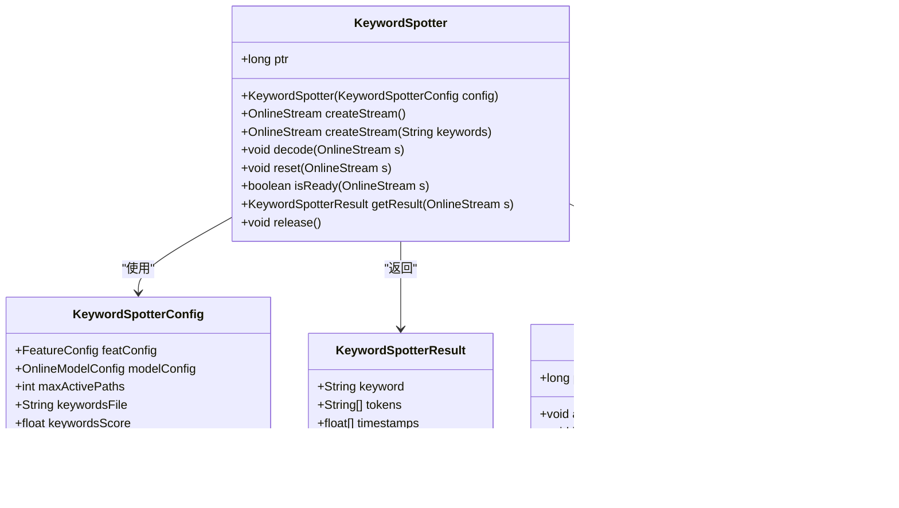

# 关键词检测示例

<cite>
**本文档中引用的文件**
- [KeywordSpotterFromFile.java](file://java-api-examples/KeywordSpotterFromFile.java)
- [KeywordSpotter.java](file://sherpa-onnx/java-api/src/main/java/com/k2fsa/sherpa/onnx/KeywordSpotter.java)
- [KeywordSpotterConfig.java](file://sherpa-onnx/java-api/src/main/java/com/k2fsa/sherpa/onnx/KeywordSpotterConfig.java)
- [KeywordSpotterResult.java](file://sherpa-onnx/java-api/src/main/java/com/k2fsa/sherpa/onnx/KeywordSpotterResult.java)
- [OnlineStream.java](file://sherpa-onnx/java-api/src/main/java/com/k2fsa/sherpa/onnx/OnlineStream.java)
- [WaveReader.java](file://sherpa-onnx/java-api/src/main/java/com/k2fsa/sherpa/onnx/WaveReader.java)
- [FeatureConfig.java](file://sherpa-onnx/java-api/src/main/java/com/k2fsa/sherpa/onnx/FeatureConfig.java)
- [OnlineModelConfig.java](file://sherpa-onnx/java-api/src/main/java/com/k2fsa/sherpa/onnx/OnlineModelConfig.java)
</cite>

## 目录
1. [简介](#简介)
2. [项目结构](#项目结构)
3. [核心组件](#核心组件)
4. [架构概述](#架构概述)
5. [详细组件分析](#详细组件分析)
6. [依赖分析](#依赖分析)
7. [性能考虑](#性能考虑)
8. [故障排除指南](#故障排除指南)
9. [结论](#结论)

## 简介
本文档详细介绍了sherpa-onnx Java API中的关键词检测功能，重点分析了KeywordSpotterFromFile.java示例的实现机制。文档将解释如何配置关键词列表、设置检测灵敏度和处理检测结果，展示如何加载关键词模型、初始化关键词检测器以及处理音频流中的关键词触发事件。同时提供完整的代码示例和运行说明，并探讨关键词检测在语音交互应用中的使用场景和最佳实践。

## 项目结构
sherpa-onnx项目是一个跨平台的语音处理框架，提供了多种编程语言的API接口。Java API示例位于java-api-examples目录中，包含了关键词检测、语音识别、文本转语音等多种功能的实现。关键词检测功能主要通过KeywordSpotter类实现，该类封装了底层的C++实现，提供了简洁的Java接口。

**图表来源**
- [KeywordSpotterFromFile.java](file://java-api-examples/KeywordSpotterFromFile.java)
- [KeywordSpotter.java](file://sherpa-onnx/java-api/src/main/java/com/k2fsa/sherpa/onnx/KeywordSpotter.java)
- [KeywordSpotterConfig.java](file://sherpa-onnx/java-api/src/main/java/com/k2fsa/sherpa/onnx/KeywordSpotterConfig.java)
- [KeywordSpotterResult.java](file://sherpa-onnx/java-api/src/main/java/com/k2fsa/sherpa/onnx/KeywordSpotterResult.java)
- [OnlineStream.java](file://sherpa-onnx/java-api/src/main/java/com/k2fsa/sherpa/onnx/OnlineStream.java)
- [WaveReader.java](file://sherpa-onnx/java-api/src/main/java/com/k2fsa/sherpa/onnx/WaveReader.java)
- [FeatureConfig.java](file://sherpa-onnx/java-api/src/main/java/com/k2fsa/sherpa/onnx/FeatureConfig.java)
- [OnlineModelConfig.java](file://sherpa-onnx/java-api/src/main/java/com/k2fsa/sherpa/onnx/OnlineModelConfig.java)

**章节来源**
- [KeywordSpotterFromFile.java](file://java-api-examples/KeywordSpotterFromFile.java)
- [README.md](file://java-api-examples/README.md)

## 核心组件
关键词检测功能的核心组件包括KeywordSpotter类、KeywordSpotterConfig配置类、KeywordSpotterResult结果类以及相关的音频处理类。KeywordSpotter类是主要的接口类，负责管理关键词检测的整个流程，包括模型加载、音频流处理和结果获取。KeywordSpotterConfig类用于配置关键词检测器的各种参数，如模型路径、关键词文件、检测灵敏度等。KeywordSpotterResult类封装了检测结果，包括检测到的关键词、相关的时间戳等信息。

**章节来源**
- [KeywordSpotter.java](file://sherpa-onnx/java-api/src/main/java/com/k2fsa/sherpa/onnx/KeywordSpotter.java)
- [KeywordSpotterConfig.java](file://sherpa-onnx/java-api/src/main/java/com/k2fsa/sherpa/onnx/KeywordSpotterConfig.java)
- [KeywordSpotterResult.java](file://sherpa-onnx/java-api/src/main/java/com/k2fsa/sherpa/onnx/KeywordSpotterResult.java)

## 架构概述
关键词检测功能的架构基于分层设计，上层是Java API接口，下层是C++实现。Java层通过JNI调用C++层的实现，C++层负责实际的模型推理和音频处理。这种设计既保证了接口的简洁性，又充分利用了C++的高性能。

**图表来源**
- [KeywordSpotter.java](file://sherpa-onnx/java-api/src/main/java/com/k2fsa/sherpa/onnx/KeywordSpotter.java)
- [KeywordSpotterConfig.java](file://sherpa-onnx/java-api/src/main/java/com/k2fsa/sherpa/onnx/KeywordSpotterConfig.java)
- [KeywordSpotterResult.java](file://sherpa-onnx/java-api/src/main/java/com/k2fsa/sherpa/onnx/KeywordSpotterResult.java)
- [KeywordSpotter.cc](file://sherpa-onnx/csrc/keyword-spotter.cc)
- [keyword-spotter.h](file://sherpa-onnx/csrc/keyword-spotter.h)

## 详细组件分析

### KeywordSpotterFromFile 示例分析
KeywordSpotterFromFile.java示例展示了如何使用关键词检测器从音频文件中检测关键词。该示例首先配置关键词检测器，然后加载音频文件，最后进行关键词检测。

**图表来源**
- [KeywordSpotterFromFile.java](file://java-api-examples/KeywordSpotterFromFile.java)
- [KeywordSpotter.java](file://sherpa-onnx/java-api/src/main/java/com/k2fsa/sherpa/onnx/KeywordSpotter.java)
- [OnlineStream.java](file://sherpa-onnx/java-api/src/main/java/com/k2fsa/sherpa/onnx/OnlineStream.java)
- [WaveReader.java](file://sherpa-onnx/java-api/src/main/java/com/k2fsa/sherpa/onnx/WaveReader.java)
- [KeywordSpotterResult.java](file://sherpa-onnx/java-api/src/main/java/com/k2fsa/sherpa/onnx/KeywordSpotterResult.java)

**章节来源**
- [KeywordSpotterFromFile.java](file://java-api-examples/KeywordSpotterFromFile.java)

### KeywordSpotter 类分析
KeywordSpotter类是关键词检测功能的核心，提供了创建流、解码、重置和获取结果等方法。该类通过JNI调用底层的C++实现，封装了复杂的模型推理过程。

**图表来源**
- [KeywordSpotter.java](file://sherpa-onnx/java-api/src/main/java/com/k2fsa/sherpa/onnx/KeywordSpotter.java)
- [KeywordSpotterConfig.java](file://sherpa-onnx/java-api/src/main/java/com/k2fsa/sherpa/onnx/KeywordSpotterConfig.java)
- [KeywordSpotterResult.java](file://sherpa-onnx/java-api/src/main/java/com/k2fsa/sherpa/onnx/KeywordSpotterResult.java)
- [OnlineStream.java](file://sherpa-onnx/java-api/src/main/java/com/k2fsa/sherpa/onnx/OnlineStream.java)

**章节来源**
- [KeywordSpotter.java](file://sherpa-onnx/java-api/src/main/java/com/k2fsa/sherpa/onnx/KeywordSpotter.java)

### 配置机制分析
关键词检测器的配置通过KeywordSpotterConfig类的Builder模式实现。这种设计模式提供了灵活的配置方式，允许用户只设置需要的参数，其他参数使用默认值。

**图表来源**
- [KeywordSpotterConfig.java](file://sherpa-onnx/java-api/src/main/java/com/k2fsa/sherpa/onnx/KeywordSpotterConfig.java)
- [OnlineModelConfig.java](file://sherpa-onnx/java-api/src/main/java/com/k2fsa/sherpa/onnx/OnlineModelConfig.java)
- [FeatureConfig.java](file://sherpa-onnx/java-api/src/main/java/com/k2fsa/sherpa/onnx/FeatureConfig.java)

**章节来源**
- [KeywordSpotterConfig.java](file://sherpa-onnx/java-api/src/main/java/com/k2fsa/sherpa/onnx/KeywordSpotterConfig.java)

## 依赖分析
关键词检测功能依赖于多个组件，包括音频处理、模型推理和JNI接口。这些组件通过清晰的接口进行交互，保证了系统的模块化和可维护性。

**图表来源**
- [KeywordSpotter.java](file://sherpa-onnx/java-api/src/main/java/com/k2fsa/sherpa/onnx/KeywordSpotter.java)
- [KeywordSpotterConfig.java](file://sherpa-onnx/java-api/src/main/java/com/k2fsa/sherpa/onnx/KeywordSpotterConfig.java)
- [OnlineModelConfig.java](file://sherpa-onnx/java-api/src/main/java/com/k2fsa/sherpa/onnx/OnlineModelConfig.java)
- [FeatureConfig.java](file://sherpa-onnx/java-api/src/main/java/com/k2fsa/sherpa/onnx/FeatureConfig.java)
- [LibraryLoader.java](file://sherpa-onnx/java-api/src/main/java/com/k2fsa/sherpa/onnx/LibraryLoader.java)

**章节来源**
- [KeywordSpotter.java](file://sherpa-onnx/java-api/src/main/java/com/k2fsa/sherpa/onnx/KeywordSpotter.java)
- [KeywordSpotterConfig.java](file://sherpa-onnx/java-api/src/main/java/com/k2fsa/sherpa/onnx/KeywordSpotterConfig.java)

## 性能考虑
关键词检测功能在设计时考虑了性能优化，包括使用高效的C++实现、合理的内存管理和多线程支持。用户可以通过配置参数来平衡检测精度和性能。

**章节来源**
- [KeywordSpotterConfig.java](file://sherpa-onnx/java-api/src/main/java/com/k2fsa/sherpa/onnx/KeywordSpotterConfig.java)
- [OnlineModelConfig.java](file://sherpa-onnx/java-api/src/main/java/com/k2fsa/sherpa/onnx/OnlineModelConfig.java)

## 故障排除指南
在使用关键词检测功能时，可能会遇到模型加载失败、音频格式不支持等问题。建议检查模型文件路径、音频文件格式和配置参数是否正确。

**章节来源**
- [KeywordSpotterFromFile.java](file://java-api-examples/KeywordSpotterFromFile.java)
- [WaveReader.java](file://sherpa-onnx/java-api/src/main/java/com/k2fsa/sherpa/onnx/WaveReader.java)

## 结论
sherpa-onnx的Java API提供了强大而灵活的关键词检测功能，通过简洁的接口封装了复杂的底层实现。KeywordSpotterFromFile示例展示了如何使用该功能从音频文件中检测关键词，为开发者提供了清晰的使用指南。通过合理配置参数，可以在不同应用场景中实现高效的关键词检测。