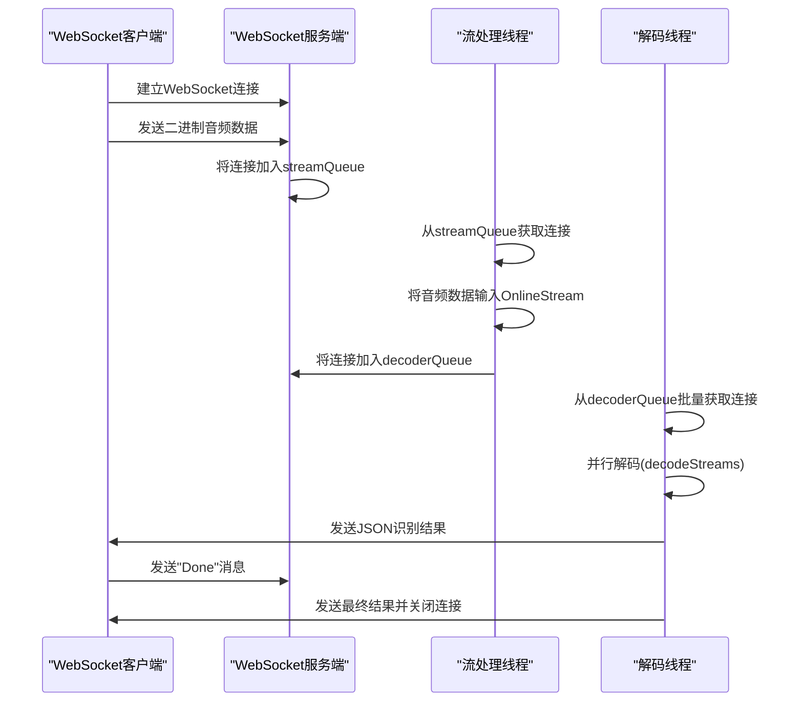

# 其他功能示例

<cite>
**本文档中引用的文件**  
- [KeywordSpotterFromFile.java](file://java-api-examples/KeywordSpotterFromFile.java)
- [NonStreamingSpeechEnhancementGtcrn.java](file://java-api-examples/NonStreamingSpeechEnhancementGtcrn.java)
- [SpokenLanguageIdentificationWhisper.java](file://java-api-examples/SpokenLanguageIdentificationWhisper.java)
- [InverseTextNormalizationNonStreamingParaformer.java](file://java-api-examples/InverseTextNormalizationNonStreamingParaformer.java)
- [InverseTextNormalizationStreamingTransducer.java](file://java-api-examples/InverseTextNormalizationStreamingTransducer.java)
- [AsrWebsocketServer.java](file://java-api-examples/src/websocketsrv/AsrWebsocketServer.java)
- [AsrWebsocketClient.java](file://java-api-examples/src/websocketsrv/AsrWebsocketClient.java)
- [ConnectionData.java](file://java-api-examples/src/websocketsrv/ConnectionData.java)
- [StreamThreadHandler.java](file://java-api-examples/src/websocketsrv/StreamThreadHandler.java)
- [DecoderThreadHandler.java](file://java-api-examples/src/websocketsrv/DecoderThreadHandler.java)
</cite>

## 目录
1. [关键词检测](#关键词检测)
2. [语音增强](#语音增强)
3. [语种识别](#语种识别)
4. [逆文本正则化](#逆文本正则化)
5. [WebSocket通信](#websocket通信)

## 关键词检测

关键词检测（Keyword Spotting, KWS）功能允许从音频流中实时检测预定义的关键词。`KeywordSpotterFromFile.java` 示例展示了如何使用基于Zipformer架构的关键词检测模型从文件中检测关键词。

实现机制基于 `KeywordSpotter` 类，该类通过 `KeywordSpotterConfig` 配置，包含在线模型配置（`OnlineModelConfig`）和关键词文件路径。关键词文件包含要检测的关键词及其对应的权重。系统创建 `OnlineStream` 流来处理音频数据，通过 `acceptWaveform` 方法输入音频波形，然后在循环中调用 `isReady` 和 `decode` 方法进行解码。当 `getResult` 返回非空关键词时，表示检测到关键词，此时应调用 `reset` 方法重置流以准备下一次检测。

配置方法需要指定编码器、解码器、连接器和词元文件的路径，以及包含关键词的文本文件。该功能适用于语音唤醒、命令识别等场景，能够高效地在连续语音中定位特定关键词。

**Section sources**
- [KeywordSpotterFromFile.java](file://java-api-examples/KeywordSpotterFromFile.java)

## 语音增强

语音增强功能通过 `NonStreamingSpeechEnhancementGtcrn.java` 示例展示，使用GT-CRN（Gated Temporal Convolutional Recurrent Network）模型对带噪语音进行去噪处理，提升语音质量。

实现机制基于 `OfflineSpeechDenoiser` 类，该类通过 `OfflineSpeechDenoiserConfig` 配置，包含去噪模型配置（`OfflineSpeechDenoiserGtcrnModelConfig`）。系统首先创建 `WaveReader` 读取输入的带噪音频文件，获取采样率和样本数据。然后调用 `run` 方法对音频数据进行去噪处理，返回 `DenoisedAudio` 对象。最后，使用 `WaveWriter.write` 方法将去噪后的音频保存到输出文件。

该功能的处理流程是离线的，适用于批量处理音频文件。用户需要提供训练好的GT-CRN模型文件（.onnx格式）和待处理的音频文件。处理后的音频在信噪比和可懂度上均有显著提升，对于后续的语音识别任务具有重要价值。

**Section sources**
- [NonStreamingSpeechEnhancementGtcrn.java](file://java-api-examples/NonStreamingSpeechEnhancementGtcrn.java)

## 语种识别

语种识别功能通过 `SpokenLanguageIdentificationWhisper.java` 示例展示，利用多语言Whisper模型自动识别语音片段的语种。

实现机制基于 `SpokenLanguageIdentification` 类，该类通过 `SpokenLanguageIdentificationConfig` 配置，包含Whisper模型配置（`SpokenLanguageIdentificationWhisperConfig`）。系统为每个测试音频文件创建一个 `OfflineStream`，通过 `acceptWaveform` 方法输入音频数据。然后调用 `compute` 方法进行语种识别，返回识别出的语言代码（如 "en" 表示英语，"zh" 表示中文）。

使用场景包括多语言语音处理系统、自动翻译服务和内容分类。该功能要求使用多语言版本的Whisper模型（如 `tiny`），而不能使用单语言版本（如 `tiny.en`）。示例中测试了包括英语、德语、中文、西班牙语等在内的多种语言，展示了其广泛的语种覆盖能力。

**Section sources**
- [SpokenLanguageIdentificationWhisper.java](file://java-api-examples/SpokenLanguageIdentificationWhisper.java)

## 逆文本正则化

逆文本正则化（Inverse Text Normalization, ITN）功能将语音识别结果中的数字、符号等非标准文本转换为自然语言表达。该功能通过 `InverseTextNormalizationNonStreamingParaformer.java` 和 `InverseTextNormalizationStreamingTransducer.java` 两个示例展示，分别对应非流式和流式识别模型。

实现方式是在 `OfflineRecognizerConfig` 或 `OnlineRecognizerConfig` 中通过 `setRuleFsts` 方法指定规则FST（Finite State Transducer）文件。该FST文件包含了从书面形式到口语形式的转换规则。在识别过程中，解码器会自动应用这些规则，将如 "2023" 转换为 "二零二三年"。

对于非流式模型（如Paraformer），音频数据一次性输入，然后进行解码。对于流式模型（如Transducer），需要在音频末尾添加尾部填充（tail paddings），以确保模型能够处理完所有上下文信息。两个示例都使用了相同的中文数字ITN规则文件（`itn_zh_number.fst`），展示了ITN在不同模型架构下的应用。

**Section sources**
- [InverseTextNormalizationNonStreamingParaformer.java](file://java-api-examples/InverseTextNormalizationNonStreamingParaformer.java)
- [InverseTextNormalizationStreamingTransducer.java](file://java-api-examples/InverseTextNormalizationStreamingTransducer.java)

## WebSocket通信

WebSocket通信功能通过 `AsrWebsocketServer.java` 和 `AsrWebsocketClient.java` 示例展示了如何构建一个高性能的语音识别WebSocket服务端和客户端。

### 服务端实现

`AsrWebsocketServer` 类继承自 `WebSocketServer`，实现了基于WebSocket的语音识别服务。其核心是三个线程池：网络I/O线程池、流处理线程池和解码线程池。服务端使用 `LinkedBlockingQueue` 作为队列，在不同线程池间传递WebSocket连接。

- **网络I/O线程池**：处理WebSocket连接的建立、关闭和消息接收。接收到二进制音频数据时，将其存入 `ConnectionData` 的样本队列，并将连接放入 `streamQueue`。
- **流处理线程池**：由 `StreamThreadHandler` 实现，从 `streamQueue` 中取出连接，将 `ConnectionData` 中的音频样本通过 `acceptWaveform` 输入到 `OnlineStream`，然后将连接放入 `decoderQueue`。
- **解码线程池**：由 `DecoderThreadHandler` 实现，从 `decoderQueue` 中批量取出连接，调用 `decodeStreams` 进行并行解码，然后将识别结果通过WebSocket发送回客户端。

`ConnectionData` 类作为桥梁，存储了WebSocket连接、`OnlineStream`、音频样本队列和状态信息。服务端通过配置文件（.properties）灵活配置端口、线程数等参数。

### 客户端实现

`AsrWebsocketClient` 类继承自 `WebSocketClient`，实现了WebSocket客户端。在 `onOpen` 回调中，客户端读取本地WAV文件，将其转换为字节缓冲区，并通过 `send` 方法发送二进制音频数据。发送完所有数据后，发送文本消息 "Done" 通知服务端结束。识别结果通过 `onMessage` 回调接收并打印。

### 通信机制

通信机制采用二进制帧传输音频数据，文本帧传输控制消息和识别结果。服务端返回的识别结果是JSON格式，包含文本内容和结束标志（eof）。这种设计实现了低延迟、高吞吐量的语音识别服务，适用于Web应用、移动应用等需要实时语音交互的场景。

**Diagram sources**
- [AsrWebsocketServer.java](file://java-api-examples/src/websocketsrv/AsrWebsocketServer.java)
- [AsrWebsocketClient.java](file://java-api-examples/src/websocketsrv/AsrWebsocketClient.java)
- [StreamThreadHandler.java](file://java-api-examples/src/websocketsrv/StreamThreadHandler.java)
- [DecoderThreadHandler.java](file://java-api-examples/src/websocketsrv/DecoderThreadHandler.java)

**Section sources**
- [AsrWebsocketServer.java](file://java-api-examples/src/websocketsrv/AsrWebsocketServer.java)
- [AsrWebsocketClient.java](file://java-api-examples/src/websocketsrv/AsrWebsocketClient.java)
- [ConnectionData.java](file://java-api-examples/src/websocketsrv/ConnectionData.java)
- [StreamThreadHandler.java](file://java-api-examples/src/websocketsrv/StreamThreadHandler.java)
- [DecoderThreadHandler.java](file://java-api-examples/src/websocketsrv/DecoderThreadHandler.java)