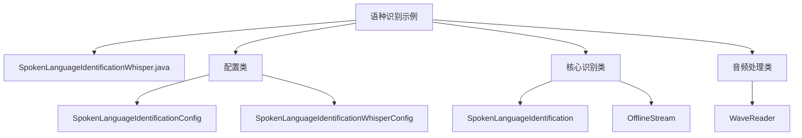
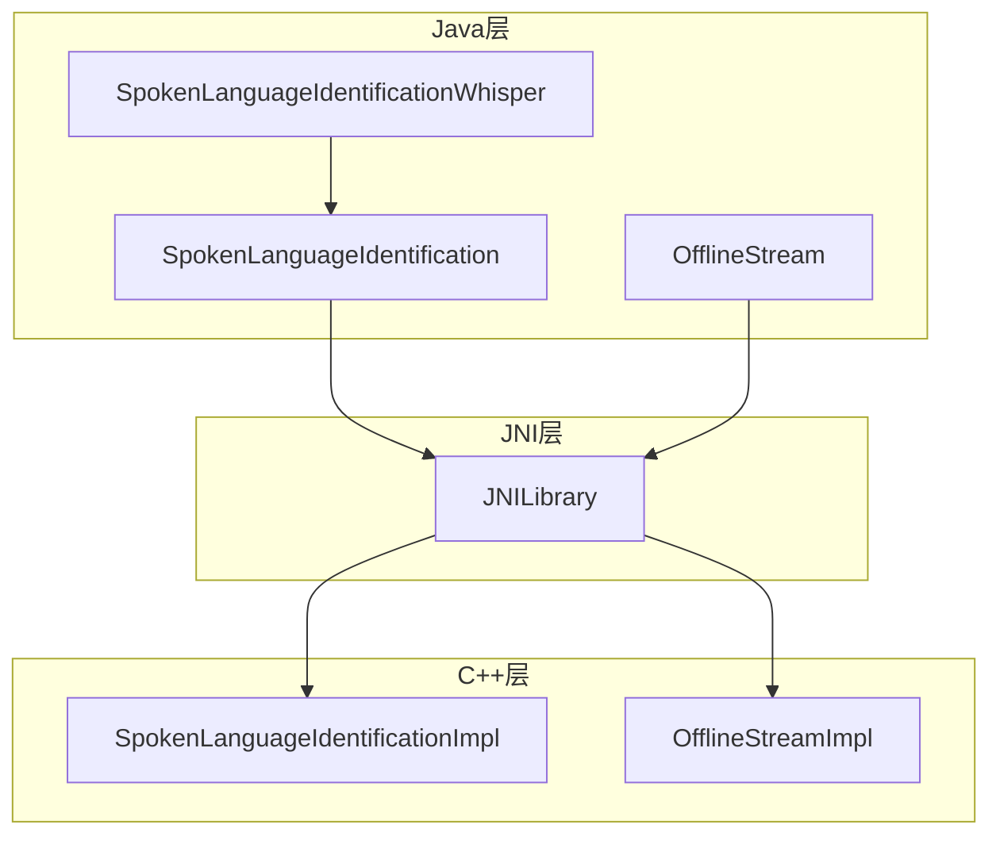
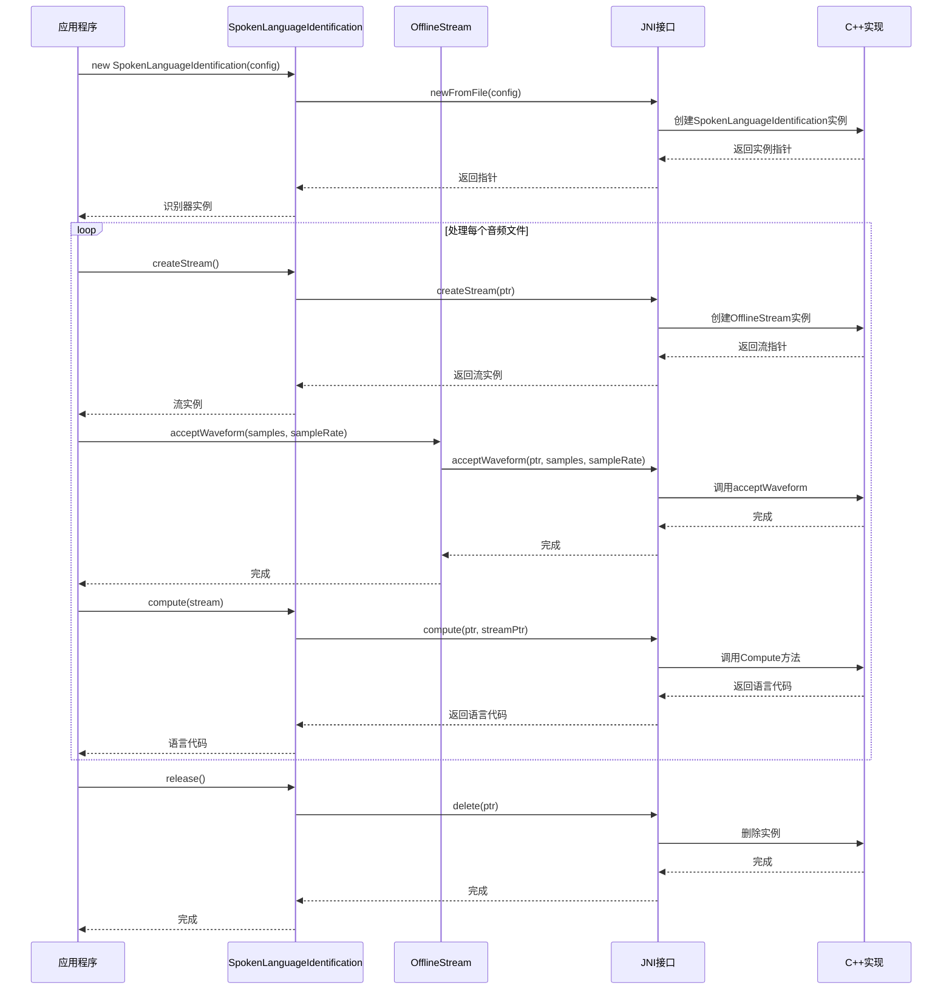
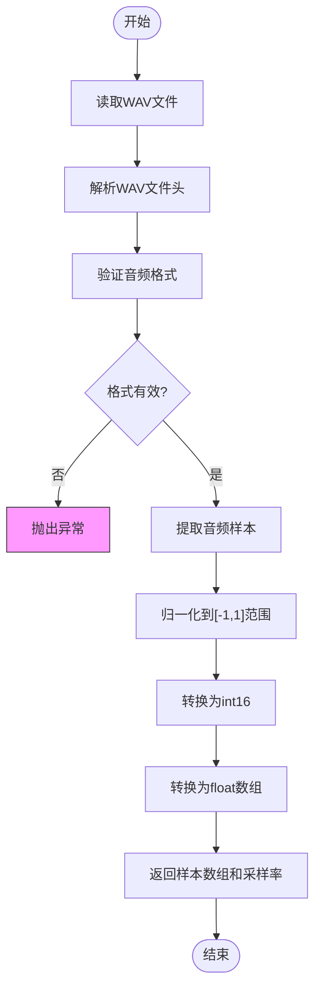
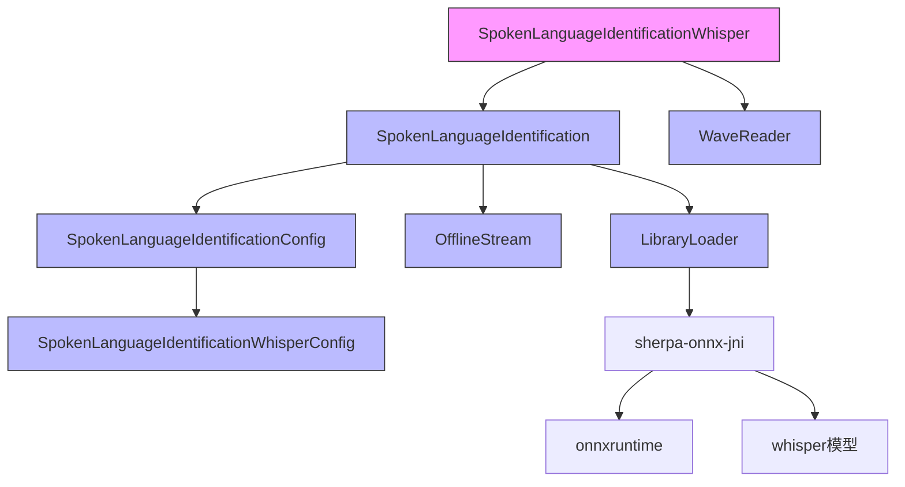

# 语种识别示例

<cite>
**本文档引用的文件**   
- [SpokenLanguageIdentificationWhisper.java](file://java-api-examples/SpokenLanguageIdentificationWhisper.java)
- [SpokenLanguageIdentificationConfig.java](file://sherpa-onnx/java-api/src/main/java/com/k2fsa/sherpa/onnx/SpokenLanguageIdentificationConfig.java)
- [SpokenLanguageIdentificationWhisperConfig.java](file://sherpa-onnx/java-api/src/main/java/com/k2fsa/sherpa/onnx/SpokenLanguageIdentificationWhisperConfig.java)
- [SpokenLanguageIdentification.java](file://sherpa-onnx/java-api/src/main/java/com/k2fsa/sherpa/onnx/SpokenLanguageIdentification.java)
- [OfflineStream.java](file://sherpa-onnx/java-api/src/main/java/com/k2fsa/sherpa/onnx/OfflineStream.java)
- [WaveReader.java](file://sherpa-onnx/java-api/src/main/java/com/k2fsa/sherpa/onnx/WaveReader.java)
- [run-spoken-language-identification-whisper.sh](file://java-api-examples/run-spoken-language-identification-whisper.sh)
</cite>

## 目录
1. [简介](#简介)
2. [项目结构](#项目结构)
3. [核心组件](#核心组件)
4. [架构概述](#架构概述)
5. [详细组件分析](#详细组件分析)
6. [依赖分析](#依赖分析)
7. [性能考虑](#性能考虑)
8. [故障排除指南](#故障排除指南)
9. [结论](#结论)

## 简介
本示例展示了如何使用sherpa-onnx Java API中的Whisper多语种模型进行语音语种识别。该功能能够自动检测音频文件中的语言类型，支持多种语言的识别，包括英语、中文、德语、西班牙语等。通过本示例，开发者可以了解如何加载语种识别模型、处理音频输入以及解析识别结果。语种识别在多语言语音处理系统中扮演着关键角色，可用于自动语言选择、多语言语音助手、跨语言通信等应用场景。

## 项目结构
语种识别功能位于java-api-examples目录下，主要由配置类、识别器类和音频处理类组成。项目结构清晰，各组件职责分明。



**图示来源**
- [SpokenLanguageIdentificationWhisper.java](file://java-api-examples/SpokenLanguageIdentificationWhisper.java)
- [SpokenLanguageIdentificationConfig.java](file://sherpa-onnx/java-api/src/main/java/com/k2fsa/sherpa/onnx/SpokenLanguageIdentificationConfig.java)
- [SpokenLanguageIdentificationWhisperConfig.java](file://sherpa-onnx/java-api/src/main/java/com/k2fsa/sherpa/onnx/SpokenLanguageIdentificationWhisperConfig.java)

**本节来源**
- [SpokenLanguageIdentificationWhisper.java](file://java-api-examples/SpokenLanguageIdentificationWhisper.java)
- [java-api-examples/README.md](file://java-api-examples/README.md)

## 核心组件
语种识别功能的核心组件包括配置类、识别器类和音频处理类。`SpokenLanguageIdentificationWhisperConfig`用于配置Whisper模型的编码器和解码器路径；`SpokenLanguageIdentificationConfig`用于配置语种识别的整体参数，包括线程数、调试模式等；`SpokenLanguageIdentification`是主要的识别器类，负责创建识别流和执行语种识别；`OfflineStream`表示离线识别流，用于承载音频数据；`WaveReader`用于读取WAV格式的音频文件。

**本节来源**
- [SpokenLanguageIdentificationWhisper.java](file://java-api-examples/SpokenLanguageIdentificationWhisper.java)
- [SpokenLanguageIdentificationConfig.java](file://sherpa-onnx/java-api/src/main/java/com/k2fsa/sherpa/onnx/SpokenLanguageIdentificationConfig.java)
- [SpokenLanguageIdentification.java](file://sherpa-onnx/java-api/src/main/java/com/k2fsa/sherpa/onnx/SpokenLanguageIdentification.java)

## 架构概述
语种识别功能采用分层架构设计，上层为Java API，中层为JNI接口，底层为C++实现。Java层通过JNI调用C++实现的语种识别功能，实现了跨平台的语音处理能力。



**图示来源**
- [SpokenLanguageIdentification.java](file://sherpa-onnx/java-api/src/main/java/com/k2fsa/sherpa/onnx/SpokenLanguageIdentification.java)
- [spoken-language-identification.cc](file://sherpa-onnx/jni/spoken-language-identification.cc)
- [spoken-language-identification-impl.h](file://sherpa-onnx/csrc/spoken-language-identification-impl.h)

## 详细组件分析

### 语种识别配置分析
语种识别配置采用构建者模式，提供了灵活的配置方式。配置分为两层：顶层配置`SpokenLanguageIdentificationConfig`和Whisper专用配置`SpokenLanguageIdentificationWhisperConfig`。

```mermaid
classDiagram
class SpokenLanguageIdentificationConfig {
+Builder builder()
+SpokenLanguageIdentificationWhisperConfig getWhisper()
+int getNumThreads()
+boolean getDebug()
+String getProvider()
}
class SpokenLanguageIdentificationWhisperConfig {
+Builder builder()
+String getEncoder()
+String getDecoder()
+int getTailPaddings()
}
class SpokenLanguageIdentificationConfig$Builder {
+SpokenLanguageIdentificationConfig build()
+Builder setWhisper(SpokenLanguageIdentificationWhisperConfig)
+Builder setNumThreads(int)
+Builder setDebug(boolean)
+Builder setProvider(String)
}
class SpokenLanguageIdentificationWhisperConfig$Builder {
+SpokenLanguageIdentificationWhisperConfig build()
+Builder setEncoder(String)
+Builder setDecoder(String)
+Builder setTailPaddings(int)
}
SpokenLanguageIdentificationConfig "1" -- "1" SpokenLanguageIdentificationConfig$Builder : 创建
SpokenLanguageIdentificationWhisperConfig "1" -- "1" SpokenLanguageIdentificationWhisperConfig$Builder : 创建
SpokenLanguageIdentificationConfig --> SpokenLanguageIdentificationWhisperConfig : 包含
```

**图示来源**
- [SpokenLanguageIdentificationConfig.java](file://sherpa-onnx/java-api/src/main/java/com/k2fsa/sherpa/onnx/SpokenLanguageIdentificationConfig.java)
- [SpokenLanguageIdentificationWhisperConfig.java](file://sherpa-onnx/java-api/src/main/java/com/k2fsa/sherpa/onnx/SpokenLanguageIdentificationWhisperConfig.java)

### 语种识别流程分析
语种识别流程遵循典型的语音处理模式：创建配置 → 初始化识别器 → 创建识别流 → 输入音频数据 → 执行识别 → 获取结果。



**图示来源**
- [SpokenLanguageIdentificationWhisper.java](file://java-api-examples/SpokenLanguageIdentificationWhisper.java)
- [SpokenLanguageIdentification.java](file://sherpa-onnx/java-api/src/main/java/com/k2fsa/sherpa/onnx/SpokenLanguageIdentification.java)
- [spoken-language-identification.cc](file://sherpa-onnx/jni/spoken-language-identification.cc)

### 音频处理流程分析
音频处理流程从文件读取开始，经过格式转换，最终输入到识别器中进行处理。



**图示来源**
- [WaveReader.java](file://sherpa-onnx/java-api/src/main/java/com/k2fsa/sherpa/onnx/WaveReader.java)
- [WaveHeader.cs](file://dotnet-examples/Common/WaveHeader.cs)

**本节来源**
- [SpokenLanguageIdentificationWhisper.java](file://java-api-examples/SpokenLanguageIdentificationWhisper.java)
- [WaveReader.java](file://sherpa-onnx/java-api/src/main/java/com/k2fsa/sherpa/onnx/WaveReader.java)

## 依赖分析
语种识别功能依赖于多个组件和库，形成了完整的依赖链。



**图示来源**
- [SpokenLanguageIdentificationWhisper.java](file://java-api-examples/SpokenLanguageIdentificationWhisper.java)
- [SpokenLanguageIdentification.java](file://sherpa-onnx/java-api/src/main/java/com/k2fsa/sherpa/onnx/SpokenLanguageIdentification.java)
- [LibraryLoader.java](file://sherpa-onnx/java-api/src/main/java/com/k2fsa/sherpa/onnx/LibraryLoader.java)

**本节来源**
- [SpokenLanguageIdentificationWhisper.java](file://java-api-examples/SpokenLanguageIdentificationWhisper.java)
- [pom.xml](file://pom.xml)
- [go.mod](file://go.mod)

## 性能考虑
语种识别功能在设计时考虑了性能优化，主要体现在以下几个方面：使用JNI直接调用C++实现，避免了Java层的性能瓶颈；采用int8量化的Whisper模型，减少了模型大小和计算量；支持多线程处理，可以通过配置numThreads参数来优化性能。在实际应用中，建议根据目标设备的计算能力选择合适的模型大小和线程数。对于移动设备，建议使用tiny或base模型，并将线程数设置为1-2；对于服务器端应用，可以使用larger模型，并根据CPU核心数设置线程数。

## 故障排除指南
在使用语种识别功能时，可能会遇到以下常见问题：

1. **模型文件找不到**：确保模型文件路径正确，且文件存在。可以从[sherpa-onnx releases](https://github.com/k2-fsa/sherpa-onnx/releases/tag/asr-models)下载所需的模型文件。

2. **音频格式不支持**：当前实现仅支持单声道、16位的WAV文件。如果音频文件格式不正确，程序会退出。可以使用音频编辑软件将文件转换为正确的格式。

3. **JNI库加载失败**：确保sherpa-onnx-jni库已正确加载。可以通过设置debug为true来查看详细的加载日志。

4. **内存不足**：对于较大的模型（如large），可能需要较多的内存。建议在内存充足的设备上运行。

5. **语言识别不准确**：确保使用的是多语种Whisper模型，而不是单语种模型（如tiny.en）。单语种模型只能识别一种语言。

**本节来源**
- [SpokenLanguageIdentificationWhisper.java](file://java-api-examples/SpokenLanguageIdentificationWhisper.java)
- [spoken-language-identification.cc](file://sherpa-onnx/jni/spoken-language-identification.cc)
- [README.md](file://README.md)

## 结论
sherpa-onnx的语种识别功能提供了一个强大而灵活的工具，用于检测音频中的语言类型。通过Java API，开发者可以轻松地将语种识别功能集成到自己的应用中。该功能基于Whisper多语种模型，支持多种语言的识别，具有较高的准确率。架构设计合理，采用分层模式，便于维护和扩展。在实际应用中，可以根据具体需求调整配置参数，以达到最佳的性能和准确率平衡。语种识别在多语言语音处理系统中具有重要价值，可以作为语音识别、语音合成等后续处理的前置步骤，实现智能化的语言选择和处理。