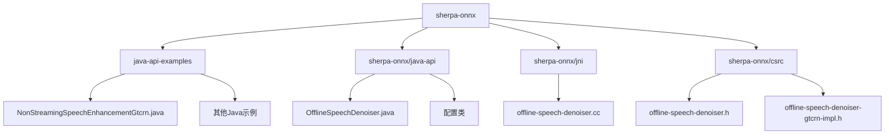
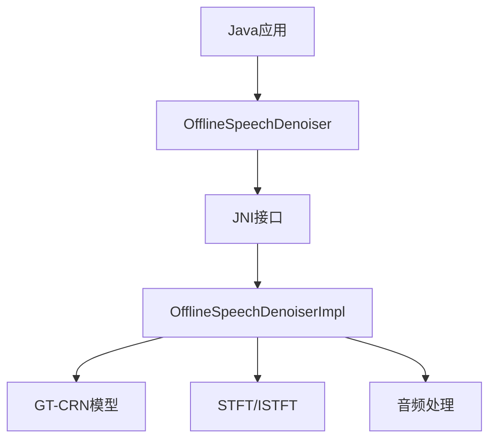
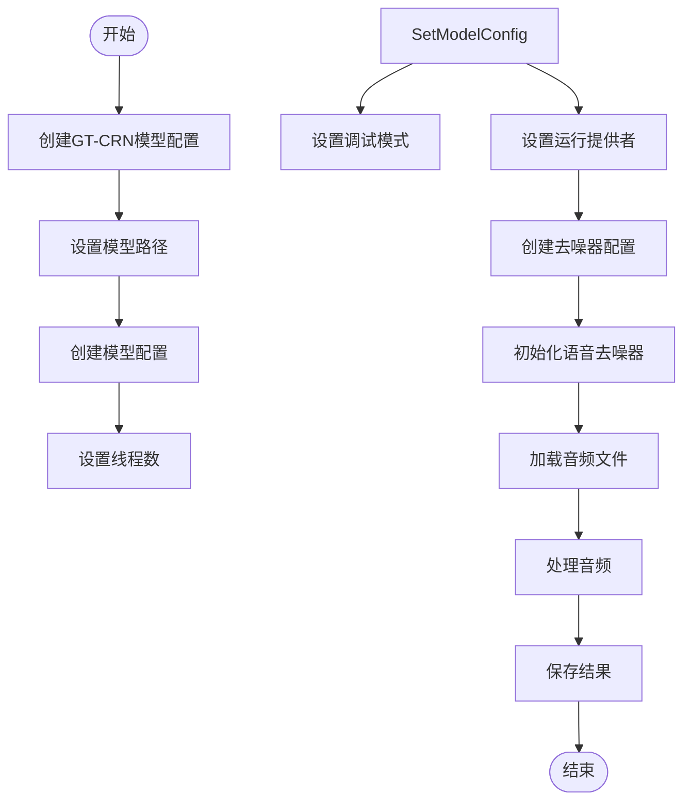
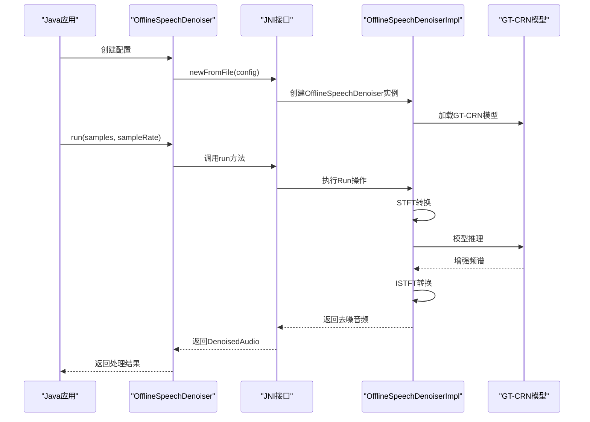
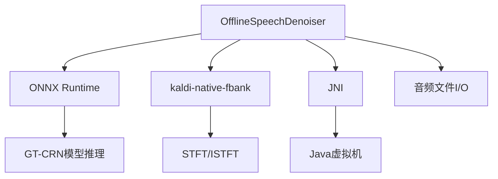

# 语音增强示例

<cite>
**本文档引用的文件**  
- [NonStreamingSpeechEnhancementGtcrn.java](file://java-api-examples/NonStreamingSpeechEnhancementGtcrn.java)
- [OfflineSpeechDenoiser.java](file://sherpa-onnx/java-api/src/main/java/com/k2fsa/sherpa/onnx/OfflineSpeechDenoiser.java)
- [OfflineSpeechDenoiserConfig.java](file://sherpa-onnx/java-api/src/main/java/com/k2fsa/sherpa/onnx/OfflineSpeechDenoiserConfig.java)
- [OfflineSpeechDenoiserModelConfig.java](file://sherpa-onnx/java-api/src/main/java/com/k2fsa/sherpa/onnx/OfflineSpeechDenoiserModelConfig.java)
- [OfflineSpeechDenoiserGtcrnModelConfig.java](file://sherpa-onnx/java-api/src/main/java/com/k2fsa/sherpa/onnx/OfflineSpeechDenoiserGtcrnModelConfig.java)
- [offline-speech-denoiser.cc](file://sherpa-onnx/jni/offline-speech-denoiser.cc)
- [offline-speech-denoiser.h](file://sherpa-onnx/csrc/offline-speech-denoiser.h)
- [offline-speech-denoiser-gtcrn-impl.h](file://sherpa-onnx/csrc/offline-speech-denoiser-gtcrn-impl.h)
- [offline-speech-denoiser-gtcrn-model.h](file://sherpa-onnx/csrc/offline-speech-denoiser-gtcrn-model.h)
</cite>

## 目录
1. [简介](#简介)
2. [项目结构](#项目结构)
3. [核心组件](#核心组件)
4. [架构概述](#架构概述)
5. [详细组件分析](#详细组件分析)
6. [依赖分析](#依赖分析)
7. [性能考虑](#性能考虑)
8. [故障排除指南](#故障排除指南)
9. [结论](#结论)

## 简介
本文档详细解析了sherpa-onnx Java API中语音增强功能的实现机制，重点关注`NonStreamingSpeechEnhancementGtcrn.java`示例。文档将说明如何使用GT-CRN模型进行语音去噪和增强，展示加载语音增强模型、配置处理参数以及处理音频文件的完整流程。同时，文档将解释语音增强技术在改善语音识别准确率方面的重要作用和应用场景。

## 项目结构
sherpa-onnx项目是一个多语言支持的语音处理框架，包含多种语音处理功能的实现。Java API示例位于`java-api-examples`目录下，提供了各种语音处理功能的使用示例。

**图示来源**  
- [NonStreamingSpeechEnhancementGtcrn.java](file://java-api-examples/NonStreamingSpeechEnhancementGtcrn.java)
- [OfflineSpeechDenoiser.java](file://sherpa-onnx/java-api/src/main/java/com/k2fsa/sherpa/onnx/OfflineSpeechDenoiser.java)
- [offline-speech-denoiser.cc](file://sherpa-onnx/jni/offline-speech-denoiser.cc)

**本节来源**  
- [java-api-examples](file://java-api-examples)
- [sherpa-onnx/java-api](file://sherpa-onnx/java-api)
- [sherpa-onnx/jni](file://sherpa-onnx/jni)

## 核心组件
语音增强功能的核心组件包括`OfflineSpeechDenoiser`类、配置类和JNI接口。`OfflineSpeechDenoiser`是Java层的主要接口类，负责与底层C++实现进行交互。配置类用于设置模型参数和处理选项，而JNI接口则实现了Java与C++之间的桥梁。

**本节来源**  
- [OfflineSpeechDenoiser.java](file://sherpa-onnx/java-api/src/main/java/com/k2fsa/sherpa/onnx/OfflineSpeechDenoiser.java)
- [OfflineSpeechDenoiserConfig.java](file://sherpa-onnx/java-api/src/main/java/com/k2fsa/sherpa/onnx/OfflineSpeechDenoiserConfig.java)
- [offline-speech-denoiser.cc](file://sherpa-onnx/jni/offline-speech-denoiser.cc)

## 架构概述
语音增强功能的架构分为三层：Java API层、JNI接口层和C++实现层。Java API层提供易于使用的接口，JNI接口层负责Java与C++之间的数据转换和调用，C++实现层则包含实际的语音处理算法。

**图示来源**  
- [OfflineSpeechDenoiser.java](file://sherpa-onnx/java-api/src/main/java/com/k2fsa/sherpa/onnx/OfflineSpeechDenoiser.java)
- [offline-speech-denoiser.cc](file://sherpa-onnx/jni/offline-speech-denoiser.cc)
- [offline-speech-denoiser-gtcrn-impl.h](file://sherpa-onnx/csrc/offline-speech-denoiser-gtcrn-impl.h)

## 详细组件分析
### NonStreamingSpeechEnhancementGtcrn示例分析
`NonStreamingSpeechEnhancementGtcrn.java`示例展示了如何使用GT-CRN模型进行语音增强的完整流程。该示例首先配置模型参数，然后加载音频文件，执行去噪处理，最后保存处理后的音频。

#### 配置构建流程

**图示来源**  
- [NonStreamingSpeechEnhancementGtcrn.java](file://java-api-examples/NonStreamingSpeechEnhancementGtcrn.java)
- [OfflineSpeechDenoiserConfig.java](file://sherpa-onnx/java-api/src/main/java/com/k2fsa/sherpa/onnx/OfflineSpeechDenoiserConfig.java)

#### 语音增强处理流程

**图示来源**  
- [NonStreamingSpeechEnhancementGtcrn.java](file://java-api-examples/NonStreamingSpeechEnhancementGtcrn.java)
- [offline-speech-denoiser.cc](file://sherpa-onnx/jni/offline-speech-denoiser.cc)
- [offline-speech-denoiser-gtcrn-impl.h](file://sherpa-onnx/csrc/offline-speech-denoiser-gtcrn-impl.h)

**本节来源**  
- [NonStreamingSpeechEnhancementGtcrn.java](file://java-api-examples/NonStreamingSpeechEnhancementGtcrn.java)
- [OfflineSpeechDenoiser.java](file://sherpa-onnx/java-api/src/main/java/com/k2fsa/sherpa/onnx/OfflineSpeechDenoiser.java)
- [offline-speech-denoiser.cc](file://sherpa-onnx/jni/offline-speech-denoiser.cc)

## 依赖分析
语音增强功能依赖于多个组件和库，包括ONNX Runtime、kaldi-native-fbank和JNI。

**图示来源**  
- [offline-speech-denoiser-gtcrn-impl.h](file://sherpa-onnx/csrc/offline-speech-denoiser-gtcrn-impl.h)
- [offline-speech-denoiser-gtcrn-model.h](file://sherpa-onnx/csrc/offline-speech-denoiser-gtcrn-model.h)

**本节来源**  
- [offline-speech-denoiser-gtcrn-impl.h](file://sherpa-onnx/csrc/offline-speech-denoiser-gtcrn-impl.h)
- [offline-speech-denoiser-gtcrn-model.h](file://sherpa-onnx/csrc/offline-speech-denoiser-gtcrn-model.h)

## 性能考虑
语音增强功能的性能受多个因素影响，包括模型复杂度、线程数和硬件加速。

- **模型复杂度**: GT-CRN模型的复杂度直接影响处理速度
- **线程数**: 可通过`numThreads`参数配置并行处理线程数
- **硬件加速**: 支持CPU和GPU等多种运行提供者
- **内存使用**: 处理长音频文件时需要考虑内存占用

**本节来源**  
- [OfflineSpeechDenoiserModelConfig.java](file://sherpa-onnx/java-api/src/main/java/com/k2fsa/sherpa/onnx/OfflineSpeechDenoiserModelConfig.java)
- [offline-speech-denoiser-gtcrn-impl.h](file://sherpa-onnx/csrc/offline-speech-denoiser-gtcrn-impl.h)

## 故障排除指南
### 常见问题及解决方案
- **模型加载失败**: 确保模型文件路径正确且文件存在
- **音频格式不支持**: 确保输入音频为16kHz采样率的单声道音频
- **内存不足**: 减少处理的音频长度或降低线程数
- **JNI加载失败**: 确保sherpa-onnx-jni库已正确加载

**本节来源**  
- [OfflineSpeechDenoiser.java](file://sherpa-onnx/java-api/src/main/java/com/k2fsa/sherpa/onnx/OfflineSpeechDenoiser.java)
- [offline-speech-denoiser.cc](file://sherpa-onnx/jni/offline-speech-denoiser.cc)

## 结论
GT-CRN语音增强技术通过深度学习模型有效去除语音中的噪声，显著提高语音质量。在语音识别系统中，使用语音增强作为预处理步骤可以显著提高识别准确率，特别是在嘈杂环境中。`NonStreamingSpeechEnhancementGtcrn.java`示例提供了一个完整的实现框架，开发者可以基于此示例构建自己的语音增强应用。