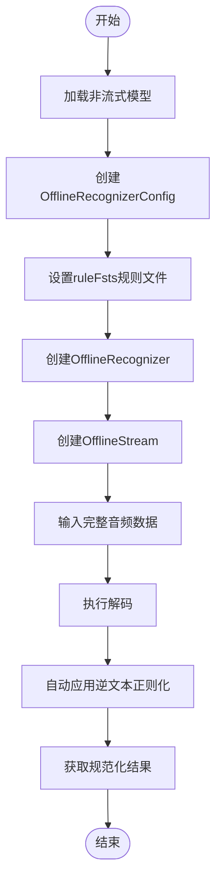
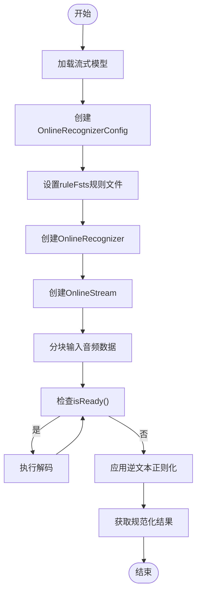

# 逆文本正则化示例

<cite>
**本文档引用的文件**   
- [InverseTextNormalizationNonStreamingParaformer.java](file://java-api-examples/InverseTextNormalizationNonStreamingParaformer.java)
- [InverseTextNormalizationStreamingTransducer.java](file://java-api-examples/InverseTextNormalizationStreamingTransducer.java)
- [OfflineRecognizerConfig.java](file://sherpa-onnx/java-api/src/main/java/com/k2fsa/sherpa/onnx/OfflineRecognizerConfig.java)
- [OnlineRecognizerConfig.java](file://sherpa-onnx/java-api/src/main/java/com/k2fsa/sherpa/onnx/OnlineRecognizerConfig.java)
- [offline-recognizer-impl.cc](file://sherpa-onnx/csrc/offline-recognizer-impl.cc)
- [online-recognizer-impl.cc](file://sherpa-onnx/csrc/online-recognizer-impl.cc)
- [inverse-text-normalization-offline-asr.py](file://python-api-examples/inverse-text-normalization-offline-asr.py)
- [inverse-text-normalization-online-asr.py](file://python-api-examples/inverse-text-normalization-online-asr.py)
</cite>

## 目录
1. [简介](#简介)
2. [逆文本正则化概述](#逆文本正则化概述)
3. [非流式逆文本正则化](#非流式逆文本正则化)
4. [流式逆文本正则化](#流式逆文本正则化)
5. [模型配置与规则加载](#模型配置与规则加载)
6. [处理流程对比](#处理流程对比)
7. [运行说明与示例](#运行说明与示例)
8. [结论](#结论)

## 简介

逆文本正则化（Inverse Text Normalization, ITN）是语音识别系统中的重要后处理步骤，用于将语音识别结果中的数字、符号、缩写等转换为自然语言表达形式。在sherpa-onnx的Java API中，提供了对非流式和流式语音识别的逆文本正则化支持，通过FST（有限状态转换器）规则实现中文和英文数字、符号的规范化转换。

本文档详细分析`InverseTextNormalizationNonStreamingParaformer.java`和`InverseTextNormalizationStreamingTransducer.java`两个示例的实现机制，展示如何在语音识别管道中集成逆文本正则化功能，提升语音识别输出的可读性和自然性。

**Section sources**
- [InverseTextNormalizationNonStreamingParaformer.java](file://java-api-examples/InverseTextNormalizationNonStreamingParaformer.java)
- [InverseTextNormalizationStreamingTransducer.java](file://java-api-examples/InverseTextNormalizationStreamingTransducer.java)

## 逆文本正则化概述

逆文本正则化是将语音识别系统输出的"规范化"文本（如数字、符号序列）转换为"口语化"表达的过程。例如，将"2024年3月15日"转换为"二零二四年三月十五日"，或将"138-1234-5678"转换为"一三八一二三四五六七八"。

在sherpa-onnx中，逆文本正则化通过FST（有限状态转换器）规则实现，这些规则以`.fst`文件形式提供，包含了从数字、符号序列到自然语言表达的转换映射。系统在语音识别完成后，自动应用这些规则对识别结果进行后处理。

ITN功能在以下场景中尤为重要：
- 电话号码、日期、时间的自然表达
- 数学表达式的口语化转换
- 货币金额的读法转换
- 缩写词的完整表达

**Section sources**
- [offline-recognizer-impl.cc](file://sherpa-onnx/csrc/offline-recognizer-impl.cc#L759-L797)
- [online-recognizer-impl.cc](file://sherpa-onnx/csrc/online-recognizer-impl.cc#L153-L198)

## 非流式逆文本正则化

非流式逆文本正则化适用于对完整音频文件进行处理的场景。`InverseTextNormalizationNonStreamingParaformer.java`示例展示了如何使用非流式Paraformer模型进行语音识别并应用逆文本正则化。

### 实现机制

非流式处理的流程如下：
1. 加载非流式Paraformer模型和相关配置
2. 创建`OfflineRecognizerConfig`并指定逆文本正则化规则文件
3. 创建识别器和音频流
4. 将完整音频数据输入流中
5. 执行解码并获取结果
6. 系统自动应用逆文本正则化规则



**Diagram sources **
- [InverseTextNormalizationNonStreamingParaformer.java](file://java-api-examples/InverseTextNormalizationNonStreamingParaformer.java#L7-L55)
- [offline-recognizer-impl.cc](file://sherpa-onnx/csrc/offline-recognizer-impl.cc#L759-L797)

### 关键代码分析

在`OfflineRecognizerConfig`中，通过`setRuleFsts()`方法指定逆文本正则化规则文件：

```java
OfflineRecognizerConfig config =
    OfflineRecognizerConfig.builder()
        .setOfflineModelConfig(modelConfig)
        .setDecodingMethod("greedy_search")
        .setRuleFsts(ruleFsts)  // 设置ITN规则文件
        .build();
```

当`getResult()`方法被调用时，系统会自动应用配置的逆文本正则化规则，将识别结果中的数字、符号等转换为自然语言表达。

**Section sources**
- [InverseTextNormalizationNonStreamingParaformer.java](file://java-api-examples/InverseTextNormalizationNonStreamingParaformer.java#L34-L39)
- [OfflineRecognizerConfig.java](file://sherpa-onnx/java-api/src/main/java/com/k2fsa/sherpa/onnx/OfflineRecognizerConfig.java)

## 流式逆文本正则化

流式逆文本正则化适用于实时语音识别场景，如语音助手、实时字幕等。`InverseTextNormalizationStreamingTransducer.java`示例展示了如何使用流式Transducer模型进行语音识别并应用逆文本正则化。

### 实现机制

流式处理的流程如下：
1. 加载流式Transducer模型和相关配置
2. 创建`OnlineRecognizerConfig`并指定逆文本正则化规则文件
3. 创建识别器和音频流
4. 分块输入音频数据
5. 循环检查是否准备就绪并执行解码
6. 系统自动应用逆文本正则化规则
7. 获取最终结果



**Diagram sources **
- [InverseTextNormalizationStreamingTransducer.java](file://java-api-examples/InverseTextNormalizationStreamingTransducer.java#L7-L69)
- [online-recognizer-impl.cc](file://sherpa-onnx/csrc/online-recognizer-impl.cc#L153-L198)

### 关键代码分析

在`OnlineRecognizerConfig`中，同样通过`setRuleFsts()`方法指定逆文本正则化规则文件：

```java
OnlineRecognizerConfig config =
    OnlineRecognizerConfig.builder()
        .setOnlineModelConfig(modelConfig)
        .setDecodingMethod("greedy_search")
        .setRuleFsts(ruleFsts)  // 设置ITN规则文件
        .build();
```

流式处理需要在音频数据输入完成后，通过循环调用`isReady()`和`decode()`方法，直到所有数据处理完毕。最终调用`getResult()`时，系统会自动应用逆文本正则化规则。

**Section sources**
- [InverseTextNormalizationStreamingTransducer.java](file://java-api-examples/InverseTextNormalizationStreamingTransducer.java#L43-L48)
- [OnlineRecognizerConfig.java](file://sherpa-onnx/java-api/src/main/java/com/k2fsa/sherpa/onnx/OnlineRecognizerConfig.java)

## 模型配置与规则加载

逆文本正则化的实现依赖于正确的模型配置和规则文件加载。在sherpa-onnx中，通过配置类中的`ruleFsts`参数指定规则文件。

### 配置参数

| 参数 | 说明 | 示例值 |
|------|------|--------|
| ruleFsts | 逆文本正则化规则文件路径 | "./itn_zh_number.fst" |
| ruleFars | FST归档文件路径（可选） | "" |
| debug | 调试模式，显示加载过程 | true |

### 规则文件加载机制

系统在初始化识别器时，会自动加载指定的规则文件：

1. 检查规则文件是否存在
2. 读取FST文件内容
3. 创建`TextNormalizer`实例
4. 将规则添加到处理链中

在C++实现中，相关代码逻辑如下：
```cpp
if (!config.rule_fsts.empty()) {
  std::vector<std::string> files;
  SplitStringToVector(config.rule_fsts, ",", false, &files);
  for (const auto &f : files) {
    itn_list_.push_back(std::make_unique<kaldifst::TextNormalizer>(f));
  }
}
```

**Section sources**
- [offline-recognizer-impl.cc](file://sherpa-onnx/csrc/offline-recognizer-impl.cc#L763-L775)
- [online-recognizer-impl.cc](file://sherpa-onnx/csrc/online-recognizer-impl.cc#L159-L168)
- [OfflineRecognizerConfig.java](file://sherpa-onnx/java-api/src/main/java/com/k2fsa/sherpa/onnx/OfflineRecognizerConfig.java)
- [OnlineRecognizerConfig.java](file://sherpa-onnx/java-api/src/main/java/com/k2fsa/sherpa/onnx/OnlineRecognizerConfig.java)

## 处理流程对比

非流式和流式逆文本正则化在处理流程上有显著差异，主要体现在数据输入方式和解码时机上。

```mermaid
graph LR
subgraph "非流式处理"
A[加载完整音频] --> B[一次性输入]
B --> C[执行解码]
C --> D[获取结果]
end
subgraph "流式处理"
E[分块接收音频] --> F[逐块输入]
F --> G[检查就绪状态]
G --> H[执行解码]
H --> G
G --> I[获取最终结果]
end
J[相同点] --> K[都使用ruleFsts配置]
J --> L[都自动应用ITN规则]
J --> M[都通过getResult()获取结果]
```

**Diagram sources **
- [InverseTextNormalizationNonStreamingParaformer.java](file://java-api-examples/InverseTextNormalizationNonStreamingParaformer.java)
- [InverseTextNormalizationStreamingTransducer.java](file://java-api-examples/InverseTextNormalizationStreamingTransducer.java)

### 主要差异

| 特性 | 非流式处理 | 流式处理 |
|------|------------|----------|
| 数据输入 | 一次性输入完整音频 | 分块输入音频流 |
| 解码时机 | 音频输入后立即解码 | 需要循环检查就绪状态 |
| 延迟 | 较高，需等待完整音频 | 较低，可实时处理 |
| 内存使用 | 较高，需存储完整音频 | 较低，仅存储当前块 |
| 适用场景 | 音频文件识别 | 实时语音识别 |

**Section sources**
- [InverseTextNormalizationNonStreamingParaformer.java](file://java-api-examples/InverseTextNormalizationNonStreamingParaformer.java)
- [InverseTextNormalizationStreamingTransducer.java](file://java-api-examples/InverseTextNormalizationStreamingTransducer.java)

## 运行说明与示例

要运行逆文本正则化示例，需要准备相应的模型文件和测试音频。

### 准备工作

1. 下载非流式Paraformer模型：
```bash
wget https://github.com/k2-fsa/sherpa-onnx/releases/download/asr-models/sherpa-onnx-paraformer-zh-2023-09-14.tar.bz2
tar xvf sherpa-onnx-paraformer-zh-2023-09-14.tar.bz2
```

2. 下载流式Transducer模型：
```bash
wget https://github.com/k2-fsa/sherpa-onnx/releases/download/asr-models/sherpa-onnx-streaming-zipformer-bilingual-zh-en-2023-02-20.tar.bz2
tar xvf sherpa-onnx-streaming-zipformer-bilingual-zh-en-2023-02-20.tar.bz2
```

3. 下载逆文本正则化规则文件：
```bash
wget https://github.com/k2-fsa/sherpa-onnx/releases/download/asr-models/itn_zh_number.fst
```

4. 下载测试音频：
```bash
wget https://github.com/k2-fsa/sherpa-onnx/releases/download/asr-models/itn-zh-number.wav
```

### 运行示例

编译并运行非流式示例：
```bash
javac -cp ".:./sherpa-onnx.jar" InverseTextNormalizationNonStreamingParaformer.java
java -cp ".:./sherpa-onnx.jar" InverseTextNormalizationNonStreamingParaformer
```

编译并运行流式示例：
```bash
javac -cp ".:./sherpa-onnx.jar" InverseTextNormalizationStreamingTransducer.java
java -cp ".:./sherpa-onnx.jar" InverseTextNormalizationStreamingTransducer
```

### 预期输出

对于包含"2024年3月15日"的音频，系统将输出：
```
filename:./itn-zh-number.wav
result:二零二四年三月十五日
```

而不是原始的数字序列。

**Section sources**
- [inverse-text-normalization-offline-asr.py](file://python-api-examples/inverse-text-normalization-offline-asr.py)
- [inverse-text-normalization-online-asr.py](file://python-api-examples/inverse-text-normalization-online-asr.py)

## 结论

逆文本正则化是提升语音识别系统输出质量的关键技术。通过分析sherpa-onnx的Java API示例，我们可以看到：

1. 非流式和流式处理都支持逆文本正则化，通过相同的`ruleFsts`参数配置
2. 系统在获取结果时自动应用规则，无需额外的处理步骤
3. FST规则文件提供了灵活的文本转换能力，可支持多种语言和格式
4. 非流式处理适合文件识别，流式处理适合实时应用

逆文本正则化显著提升了语音识别结果的可读性和自然性，使系统输出更符合人类的表达习惯。在实际应用中，可以根据具体需求选择合适的处理模式，并通过自定义FST规则扩展支持更多的转换场景。

**Section sources**
- [InverseTextNormalizationNonStreamingParaformer.java](file://java-api-examples/InverseTextNormalizationNonStreamingParaformer.java)
- [InverseTextNormalizationStreamingTransducer.java](file://java-api-examples/InverseTextNormalizationStreamingTransducer.java)
- [offline-recognizer-impl.cc](file://sherpa-onnx/csrc/offline-recognizer-impl.cc)
- [online-recognizer-impl.cc](file://sherpa-onnx/csrc/online-recognizer-impl.cc)