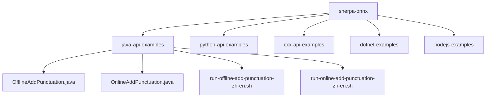
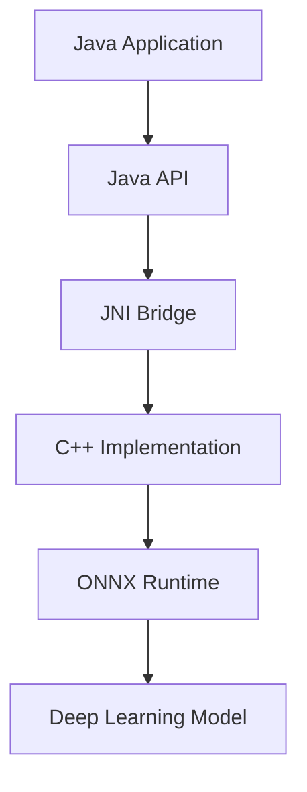
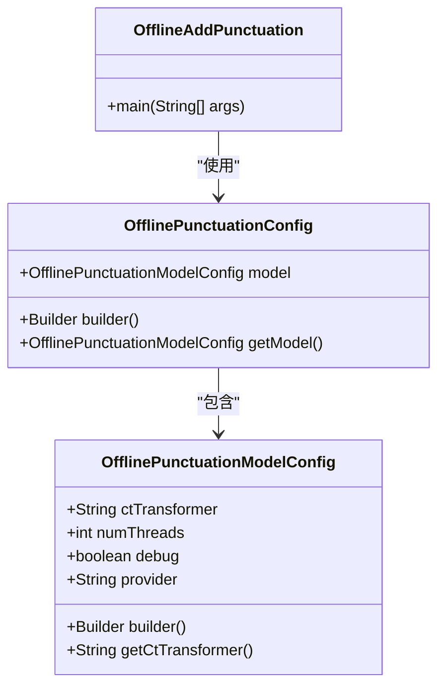
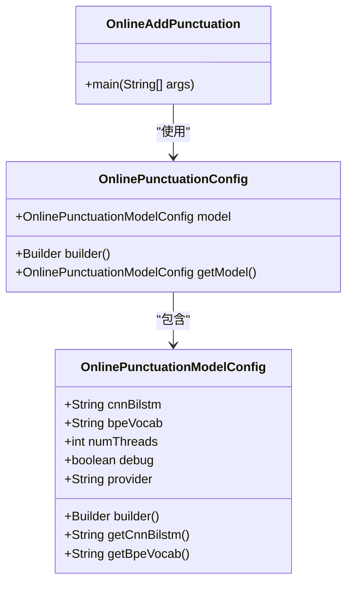
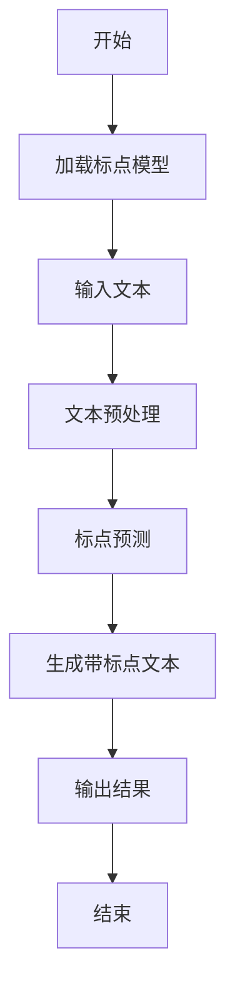
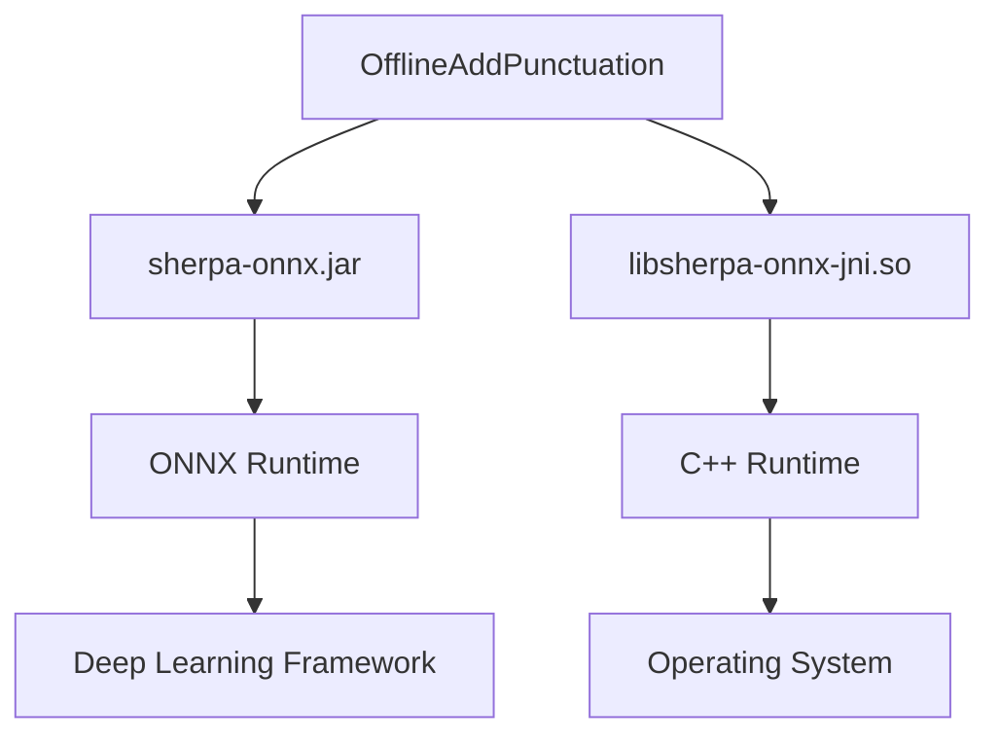

# 标点符号添加示例

<cite>
**本文档中引用的文件**  
- [OfflineAddPunctuation.java](file://java-api-examples/OfflineAddPunctuation.java)
- [OnlineAddPunctuation.java](file://java-api-examples/OnlineAddPunctuation.java)
- [run-offline-add-punctuation-zh-en.sh](file://java-api-examples/run-offline-add-punctuation-zh-en.sh)
- [run-online-add-punctuation-zh-en.sh](file://java-api-examples/run-online-add-punctuation-zh-en.sh)
- [OfflinePunctuationConfig.java](file://sherpa-onnx/java-api/src/main/java/com/k2fsa/sherpa/onnx/OfflinePunctuationConfig.java)
- [OnlinePunctuationConfig.java](file://sherpa-onnx/java-api/src/main/java/com/k2fsa/sherpa/onnx/OnlinePunctuationConfig.java)
- [OfflinePunctuationModelConfig.java](file://sherpa-onnx/java-api/src/main/java/com/k2fsa/sherpa/onnx/OfflinePunctuationModelConfig.java)
- [OnlinePunctuationModelConfig.java](file://sherpa-onnx/java-api/src/main/java/com/k2fsa/sherpa/onnx/OnlinePunctuationModelConfig.java)
- [add-punctuation.py](file://python-api-examples/add-punctuation.py)
- [add-punctuation-online.py](file://python-api-examples/add-punctuation-online.py)
</cite>

## 目录
1. [简介](#简介)
2. [项目结构](#项目结构)
3. [核心组件](#核心组件)
4. [架构概述](#架构概述)
5. [详细组件分析](#详细组件分析)
6. [依赖分析](#依赖分析)
7. [性能考虑](#性能考虑)
8. [故障排除指南](#故障排除指南)
9. [结论](#结论)

## 简介

sherpa-onnx 是一个用于语音识别和自然语言处理的开源工具包，提供了多种编程语言的API接口。本文档重点介绍其Java API中的标点符号添加功能，详细解析离线和在线标点符号添加的实现机制。标点符号添加功能能够为无标点的语音识别文本自动添加合适的标点，显著提升文本的可读性和语义清晰度。该功能支持中英文混合文本处理，适用于多种语音识别应用场景。

**标点符号添加示例**展示了如何使用sherpa-onnx的Java API来配置标点模型、处理文本输入以及获取带标点的输出结果。文档系统性地组织和解释了`OfflineAddPunctuation`和`OnlineAddPunctuation`类的实现机制，为开发者提供了完整的代码示例和运行说明。

## 项目结构

sherpa-onnx项目采用模块化设计，将不同功能和API接口分离到独立的目录中。Java API示例位于`java-api-examples`目录下，包含了各种功能的使用示例，包括标点符号添加、语音识别、文本转语音等。标点符号添加功能的示例代码分为离线和在线两种模式，分别对应不同的使用场景和性能需求。

**图示来源**  
- [java-api-examples](file://java-api-examples)
- [OfflineAddPunctuation.java](file://java-api-examples/OfflineAddPunctuation.java)
- [OnlineAddPunctuation.java](file://java-api-examples/OnlineAddPunctuation.java)

## 核心组件

标点符号添加功能的核心组件包括`OfflineAddPunctuation`和`OnlineAddPunctuation`两个Java类，分别对应离线和在线两种处理模式。这两个类封装了底层的C++实现，通过JNI接口与原生代码交互，提供了简洁易用的Java API。`OfflinePunctuationConfig`和`OnlinePunctuationConfig`类用于配置标点模型的参数，包括模型路径、线程数、调试模式等。

**标点符号添加示例**中的核心组件还包括相应的Shell脚本，用于自动化下载模型文件、编译代码和运行示例程序。这些脚本简化了开发者的使用流程，确保了示例代码的可重复性和可移植性。

**组件来源**  
- [OfflineAddPunctuation.java](file://java-api-examples/OfflineAddPunctuation.java#L8-L40)
- [OnlineAddPunctuation.java](file://java-api-examples/OnlineAddPunctuation.java#L8-L41)
- [OfflinePunctuationConfig.java](file://sherpa-onnx/java-api/src/main/java/com/k2fsa/sherpa/onnx/OfflinePunctuationConfig.java#L5-L33)
- [OnlinePunctuationConfig.java](file://sherpa-onnx/java-api/src/main/java/com/k2fsa/sherpa/onnx/OnlinePunctuationConfig.java#L5-L34)

## 架构概述

sherpa-onnx的标点符号添加功能采用分层架构设计，上层为Java API，中层为JNI桥接层，底层为C++实现。Java API提供面向对象的接口，隐藏了底层实现的复杂性。JNI桥接层负责Java与C++之间的数据类型转换和函数调用。C++实现层利用ONNX Runtime执行深度学习模型推理，完成标点符号的预测和添加。

**图示来源**  
- [OfflineAddPunctuation.java](file://java-api-examples/OfflineAddPunctuation.java)
- [OnlineAddPunctuation.java](file://java-api-examples/OnlineAddPunctuation.java)
- [sherpa-onnx/csrc](file://sherpa-onnx/csrc)

## 详细组件分析

### OfflineAddPunctuation类分析

`OfflineAddPunctuation`类实现了离线标点符号添加功能，适用于批量处理文本或对延迟不敏感的场景。该类使用CT-Transformer模型进行标点预测，支持中英文混合文本。模型在处理完整个输入文本后，一次性输出带标点的结果。

**图示来源**  
- [OfflineAddPunctuation.java](file://java-api-examples/OfflineAddPunctuation.java#L8-L40)
- [OfflinePunctuationConfig.java](file://sherpa-onnx/java-api/src/main/java/com/k2fsa/sherpa/onnx/OfflinePunctuationConfig.java#L5-L33)
- [OfflinePunctuationModelConfig.java](file://sherpa-onnx/java-api/src/main/java/com/k2fsa/sherpa/onnx/OfflinePunctuationModelConfig.java#L5-L57)

### OnlineAddPunctuation类分析

`OnlineAddPunctuation`类实现了在线标点符号添加功能，适用于实时处理或流式文本的场景。该类使用CNN-BiLSTM模型进行标点预测，目前仅支持英文文本。模型可以逐步处理输入文本，实时输出带标点的结果，适用于对话系统等需要低延迟的应用。

**图示来源**  
- [OnlineAddPunctuation.java](file://java-api-examples/OnlineAddPunctuation.java#L8-L41)
- [OnlinePunctuationConfig.java](file://sherpa-onnx/java-api/src/main/java/com/k2fsa/sherpa/onnx/OnlinePunctuationConfig.java#L5-L34)
- [OnlinePunctuationModelConfig.java](file://sherpa-onnx/java-api/src/main/java/com/k2fsa/sherpa/onnx/OnlinePunctuationModelConfig.java#L5-L51)

### 标点符号添加流程

标点符号添加的处理流程包括模型加载、文本预处理、标点预测和结果输出四个主要步骤。首先，根据配置加载相应的标点模型；然后，对输入文本进行预处理，如分词和编码；接着，通过深度学习模型预测标点位置；最后，将预测的标点插入到原始文本中，生成最终结果。

**图示来源**  
- [OfflineAddPunctuation.java](file://java-api-examples/OfflineAddPunctuation.java)
- [OnlineAddPunctuation.java](file://java-api-examples/OnlineAddPunctuation.java)

## 依赖分析

标点符号添加功能依赖于多个外部组件和库，包括ONNX Runtime、JNI接口、Java运行时环境等。这些依赖关系通过Maven或Gradle等构建工具进行管理，确保了项目的可维护性和可扩展性。此外，标点模型本身作为外部资源，需要从指定的URL下载并解压到本地目录。

**图示来源**  
- [run-offline-add-punctuation-zh-en.sh](file://java-api-examples/run-offline-add-punctuation-zh-en.sh#L34-L38)
- [run-online-add-punctuation-zh-en.sh](file://java-api-examples/run-online-add-punctuation-zh-en.sh#L34-L38)

## 性能考虑

离线和在线标点符号添加在性能特性上有显著差异。离线模式通常具有更高的准确率，但需要等待整个文本处理完成才能输出结果，适合批处理场景。在线模式具有较低的延迟，可以实时输出结果，但可能牺牲一定的准确率，适合实时交互场景。开发者应根据具体应用需求选择合适的模式。

模型的性能还受到线程数、硬件平台和模型大小等因素的影响。通过调整`numThreads`参数，可以在多核处理器上实现并行计算，提高处理速度。选择合适的`provider`（如CPU、CUDA、CoreML）可以充分利用硬件加速能力，进一步提升性能。

## 故障排除指南

在使用标点符号添加功能时，可能会遇到模型文件不存在、JNI库加载失败、输入文本格式错误等问题。常见的解决方案包括：确保模型文件已正确下载并放置在指定路径；检查Java库路径设置是否正确；验证输入文本是否符合模型要求的格式。详细的错误信息通常会在控制台输出，帮助开发者快速定位问题。

**故障排除来源**  
- [OfflineAddPunctuation.java](file://java-api-examples/OfflineAddPunctuation.java#L34-L38)
- [OnlineAddPunctuation.java](file://java-api-examples/OnlineAddPunctuation.java#L35-L38)
- [run-offline-add-punctuation-zh-en.sh](file://java-api-examples/run-offline-add-punctuation-zh-en.sh#L28-L32)
- [run-online-add-punctuation-zh-en.sh](file://java-api-examples/run-online-add-punctuation-zh-en.sh#L28-L32)

## 结论

sherpa-onnx的Java API提供了强大而灵活的标点符号添加功能，支持离线和在线两种处理模式，适用于多种语音识别应用场景。通过`OfflineAddPunctuation`和`OnlineAddPunctuation`类，开发者可以轻松地为无标点的识别文本添加合适的标点，显著提升文本的可读性和语义清晰度。详细的示例代码和运行脚本使得集成和使用变得简单高效，为开发者提供了完整的解决方案。