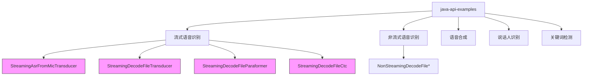
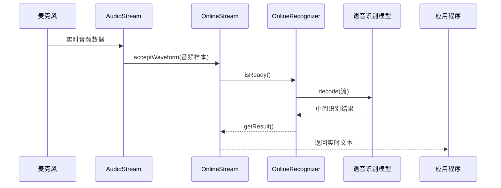
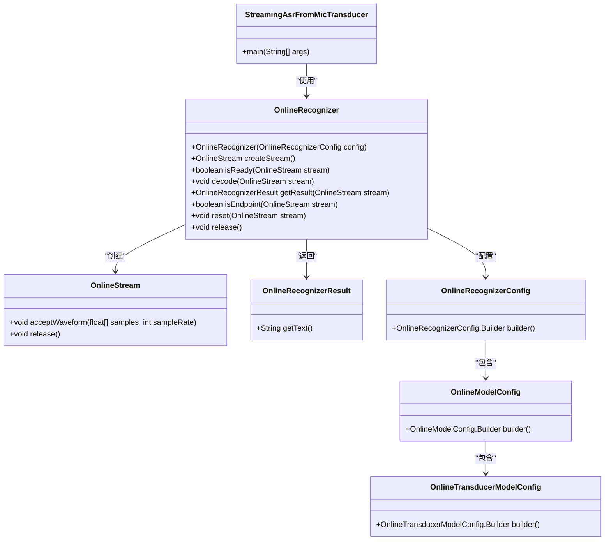
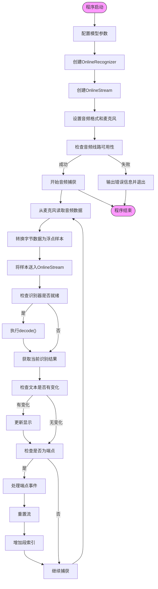
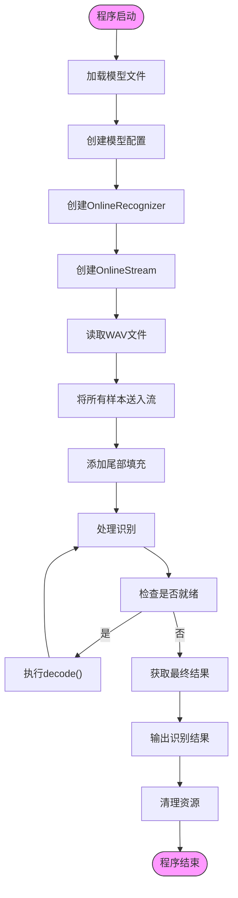
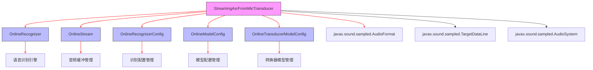

# 流式语音识别示例

<cite>
**本文档中引用的文件**  
- [StreamingAsrFromMicTransducer.java](file://java-api-examples/StreamingAsrFromMicTransducer.java)
- [StreamingDecodeFileTransducer.java](file://java-api-examples/StreamingDecodeFileTransducer.java)
- [StreamingDecodeFileParaformer.java](file://java-api-examples/StreamingDecodeFileParaformer.java)
- [StreamingDecodeFileCtc.java](file://java-api-examples/StreamingDecodeFileCtc.java)
- [run-streaming-asr-from-mic-transducer.sh](file://java-api-examples/run-streaming-asr-from-mic-transducer.sh)
- [README.md](file://java-api-examples/README.md)
</cite>

## 目录
1. [简介](#简介)
2. [项目结构](#项目结构)
3. [核心组件](#核心组件)
4. [架构概述](#架构概述)
5. [详细组件分析](#详细组件分析)
6. [依赖分析](#依赖分析)
7. [性能考虑](#性能考虑)
8. [故障排除指南](#故障排除指南)
9. [结论](#结论)

## 简介
本文档详细介绍了sherpa-onnx Java API中的流式语音识别示例，重点分析了从麦克风实时识别和从文件模拟流式识别两种场景。文档系统性地解释了StreamingAsrFromMicTransducer等类的实现机制，说明了音频流的处理流程、实时识别的实现方式以及结果的逐步输出。同时提供了完整的代码示例和运行说明，帮助开发者理解如何配置流式识别参数、管理音频流和处理实时识别结果。

## 项目结构
sherpa-onnx项目的Java API示例位于`java-api-examples`目录下，包含了多种语音处理功能的实现。流式语音识别示例主要集中在实时语音识别和文件流式解码两个方面。

**图示来源**  
- [StreamingAsrFromMicTransducer.java](file://java-api-examples/StreamingAsrFromMicTransducer.java)
- [StreamingDecodeFileTransducer.java](file://java-api-examples/StreamingDecodeFileTransducer.java)
- [StreamingDecodeFileParaformer.java](file://java-api-examples/StreamingDecodeFileParaformer.java)
- [StreamingDecodeFileCtc.java](file://java-api-examples/StreamingDecodeFileCtc.java)

**本节来源**  
- [java-api-examples](file://java-api-examples)

## 核心组件
流式语音识别的核心组件包括OnlineRecognizer、OnlineStream和各种模型配置类。这些组件共同实现了实时语音识别功能，支持从麦克风输入和文件输入两种数据源。

**本节来源**  
- [StreamingAsrFromMicTransducer.java](file://java-api-examples/StreamingAsrFromMicTransducer.java#L8-L117)
- [StreamingDecodeFileTransducer.java](file://java-api-examples/StreamingDecodeFileTransducer.java#L8-L65)

## 架构概述
sherpa-onnx的流式语音识别架构基于在线识别器(OnlineRecognizer)和在线流(OnlineStream)的设计模式。识别器负责管理识别过程和模型，而流对象则代表一个独立的音频流处理实例。

**图示来源**  
- [StreamingAsrFromMicTransducer.java](file://java-api-examples/StreamingAsrFromMicTransducer.java#L50-L116)
- [StreamingDecodeFileTransducer.java](file://java-api-examples/StreamingDecodeFileTransducer.java#L47-L63)

## 详细组件分析

### StreamingAsrFromMicTransducer分析
StreamingAsrFromMicTransducer类展示了如何使用在线转换器模型进行实时语音识别。该实现从麦克风捕获音频数据，并实时进行语音识别。

#### 类结构分析

**图示来源**  
- [StreamingAsrFromMicTransducer.java](file://java-api-examples/StreamingAsrFromMicTransducer.java#L9-L117)

#### 实时识别流程

**图示来源**  
- [StreamingAsrFromMicTransducer.java](file://java-api-examples/StreamingAsrFromMicTransducer.java#L79-L116)

**本节来源**  
- [StreamingAsrFromMicTransducer.java](file://java-api-examples/StreamingAsrFromMicTransducer.java#L9-L117)

### 流式文件识别分析
除了实时麦克风识别，sherpa-onnx还提供了从文件进行流式识别的功能，支持多种模型类型。

#### 文件流式识别类对比
| 特性 | StreamingDecodeFileTransducer | StreamingDecodeFileParaformer | StreamingDecodeFileCtc |
|------|-------------------------------|--------------------------------|------------------------|
| 模型类型 | 在线转换器模型 | 在线Paraformer模型 | 在线CTC模型 |
| 主要类 | OnlineTransducerModelConfig | OnlineParaformerModelConfig | OnlineZipformer2CtcModelConfig |
| 配置方法 | setTransducer() | setParaformer() | setZipformer2Ctc() |
| 尾部填充 | 0.8秒 | 0.8秒 | 0.3秒 |
| 解码方法 | greedy_search | greedy_search | greedy_search |

**本节来源**  
- [StreamingDecodeFileTransducer.java](file://java-api-examples/StreamingDecodeFileTransducer.java#L8-L65)
- [StreamingDecodeFileParaformer.java](file://java-api-examples/StreamingDecodeFileParaformer.java#L7-L54)
- [StreamingDecodeFileCtc.java](file://java-api-examples/StreamingDecodeFileCtc.java#L7-L54)

#### 文件流式识别流程

**图示来源**  
- [StreamingDecodeFileTransducer.java](file://java-api-examples/StreamingDecodeFileTransducer.java#L47-L63)
- [StreamingDecodeFileParaformer.java](file://java-api-examples/StreamingDecodeFileParaformer.java#L36-L53)
- [StreamingDecodeFileCtc.java](file://java-api-examples/StreamingDecodeFileCtc.java#L36-L53)

## 依赖分析
流式语音识别功能依赖于多个核心组件和外部库，形成了一个完整的识别系统。

**图示来源**  
- [StreamingAsrFromMicTransducer.java](file://java-api-examples/StreamingAsrFromMicTransducer.java#L6-L117)

**本节来源**  
- [StreamingAsrFromMicTransducer.java](file://java-api-examples/StreamingAsrFromMicTransducer.java#L6-L117)
- [StreamingDecodeFileTransducer.java](file://java-api-examples/StreamingDecodeFileTransducer.java#L6-L65)

## 性能考虑
在实现流式语音识别时，需要考虑多个性能因素以确保实时性和准确性。

1. **缓冲区大小**: 示例中使用1600个样本(0.1秒)的缓冲区，这是一个平衡延迟和性能的合理选择。
2. **线程数**: 通过setNumThreads(1)配置，可以根据硬件能力调整并行处理能力。
3. **模型优化**: 使用int8量化模型(如encoder-epoch-99-avg-1.int8.onnx)可以减少内存占用和计算开销。
4. **实时性**: 通过循环检查isReady()状态并及时调用decode()，确保了识别的实时性。
5. **资源管理**: 在程序结束时正确调用release()方法释放识别器和流资源。

**本节来源**  
- [StreamingAsrFromMicTransducer.java](file://java-api-examples/StreamingAsrFromMicTransducer.java#L38-L40)
- [StreamingAsrFromMicTransducer.java](file://java-api-examples/StreamingAsrFromMicTransducer.java#L74-L76)

## 故障排除指南
在使用流式语音识别示例时，可能会遇到一些常见问题：

1. **麦克风无法打开**: 检查音频线路是否可用，确保没有其他程序占用麦克风。
2. **模型文件路径错误**: 确保模型文件路径正确，并且文件存在。
3. **音频格式不匹配**: 确保音频格式(采样率、位深度、通道数)与模型要求匹配。
4. **识别结果不准确**: 检查环境噪音，尝试在安静环境中使用，或调整模型参数。
5. **性能问题**: 如果识别延迟较高，可以尝试减少缓冲区大小或优化模型配置。

**本节来源**  
- [StreamingAsrFromMicTransducer.java](file://java-api-examples/StreamingAsrFromMicTransducer.java#L63-L67)
- [StreamingAsrFromMicTransducer.java](file://java-api-examples/StreamingAsrFromMicTransducer.java#L81-L83)

## 结论
sherpa-onnx的Java API提供了强大而灵活的流式语音识别功能，支持从麦克风实时识别和从文件模拟流式识别两种主要场景。通过OnlineRecognizer和OnlineStream的设计模式，开发者可以轻松实现低延迟的实时语音识别应用。与非流式识别相比，流式识别能够在音频输入的同时逐步输出识别结果，更适合需要实时反馈的应用场景。开发者可以根据具体需求选择合适的模型类型(转换器、Paraformer或CTC)和配置参数，以达到最佳的识别效果和性能平衡。