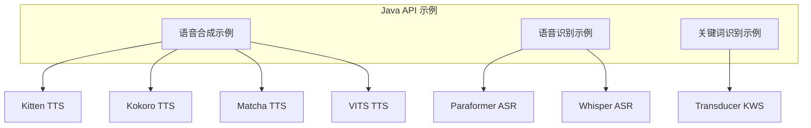
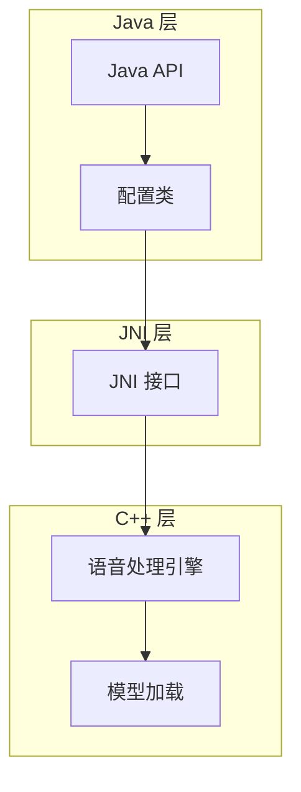
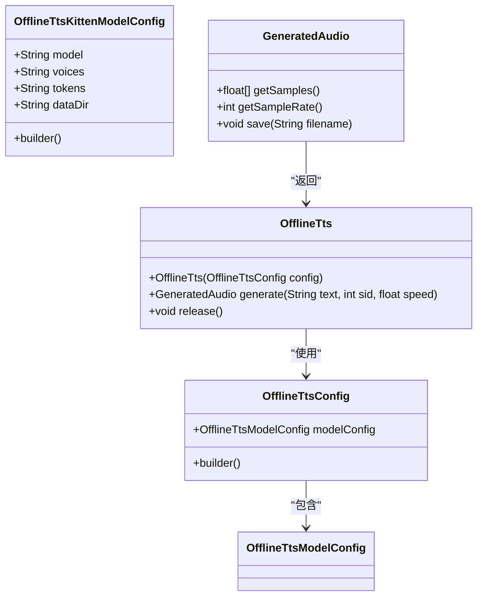
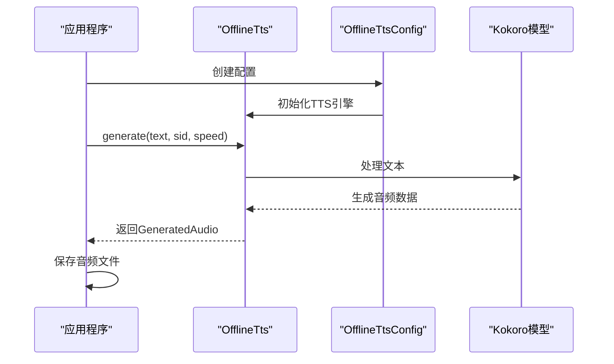
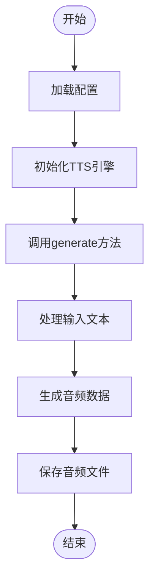
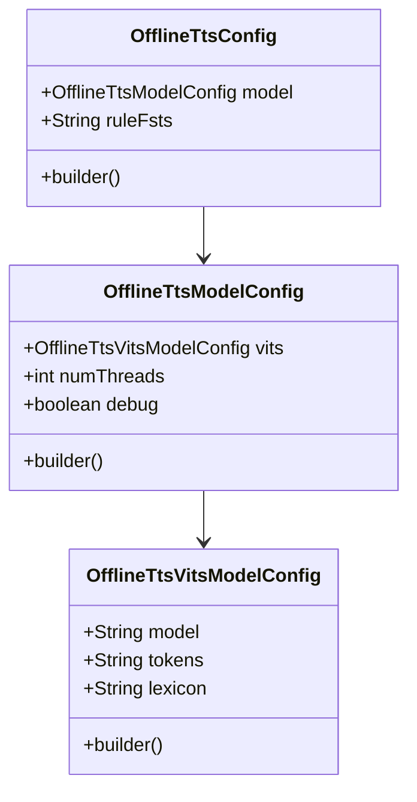
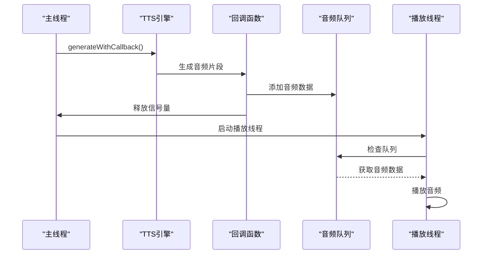
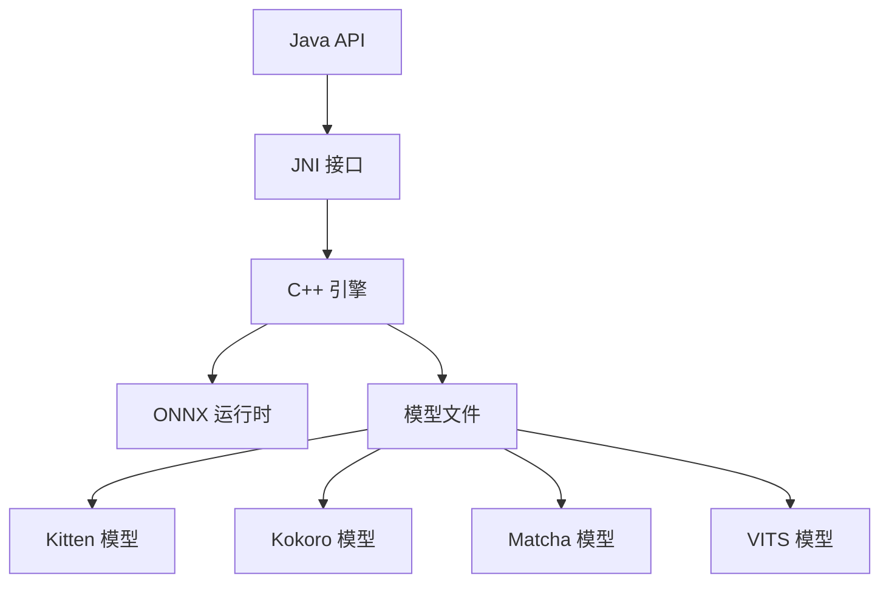

# 语音合成示例

<cite>
**本文档中引用的文件**  
- [NonStreamingTtsKittenEn.java](file://java-api-examples/NonStreamingTtsKittenEn.java)
- [NonStreamingTtsKokoroEn.java](file://java-api-examples/NonStreamingTtsKokoroEn.java)
- [NonStreamingTtsKokoroZhEn.java](file://java-api-examples/NonStreamingTtsKokoroZhEn.java)
- [NonStreamingTtsMatchaEn.java](file://java-api-examples/NonStreamingTtsMatchaEn.java)
- [NonStreamingTtsMatchaZh.java](file://java-api-examples/NonStreamingTtsMatchaZh.java)
- [NonStreamingTtsVitsZh.java](file://java-api-examples/NonStreamingTtsVitsZh.java)
- [NonStreamingTtsCoquiDe.java](file://java-api-examples/NonStreamingTtsCoquiDe.java)
- [NonStreamingTtsPiperEn.java](file://java-api-examples/NonStreamingTtsPiperEn.java)
- [NonStreamingTtsPiperEnWithCallback.java](file://java-api-examples/NonStreamingTtsPiperEnWithCallback.java)
- [README.md](file://java-api-examples/README.md)
</cite>

## 目录
1. [简介](#简介)
2. [项目结构](#项目结构)
3. [核心组件](#核心组件)
4. [架构概述](#架构概述)
5. [详细组件分析](#详细组件分析)
6. [依赖分析](#依赖分析)
7. [性能考虑](#性能考虑)
8. [故障排除指南](#故障排除指南)
9. [结论](#结论)

## 简介
sherpa-onnx 是一个开源的语音处理工具包，提供多种语音合成（TTS）模型的Java API实现。本文档详细介绍了Kitten、Kokoro、Matcha和VITS等多种语音合成模型的使用方法，包括文本到语音的转换流程、音频参数配置、输出文件生成以及语音风格、语速、音调等参数的设置。文档还涵盖了回调函数的处理机制，提供了完整的代码示例和运行说明，并对不同TTS模型的特点和适用场景进行了分析。

## 项目结构
sherpa-onnx项目的Java API示例位于`java-api-examples`目录下，包含了多种语音处理功能的实现，其中语音合成（TTS）相关的示例文件主要集中在非流式TTS实现中。这些示例展示了如何使用不同的TTS模型进行文本到语音的转换。

**图示来源**
- [java-api-examples](file://java-api-examples)

**节来源**
- [README.md](file://java-api-examples/README.md)

## 核心组件
sherpa-onnx的Java API语音合成功能主要由`OfflineTts`类和相关的配置类组成。核心组件包括`OfflineTtsConfig`、`OfflineTtsModelConfig`以及针对不同模型的具体配置类如`OfflineTtsKittenModelConfig`、`OfflineTtsKokoroModelConfig`等。这些组件共同协作，实现了从文本输入到音频输出的完整语音合成流程。

**节来源**
- [NonStreamingTtsKittenEn.java](file://java-api-examples/NonStreamingTtsKittenEn.java#L7-L62)
- [NonStreamingTtsKokoroEn.java](file://java-api-examples/NonStreamingTtsKokoroEn.java#L7-L61)

## 架构概述
sherpa-onnx的语音合成架构采用分层设计，上层为Java API接口，底层为C++实现的语音处理引擎。Java层通过JNI调用底层C++代码，实现了高性能的语音合成功能。不同TTS模型通过统一的接口进行调用，但各自具有特定的配置参数和模型文件。

**图示来源**
- [NonStreamingTtsKittenEn.java](file://java-api-examples/NonStreamingTtsKittenEn.java#L7-L62)
- [NonStreamingTtsKokoroEn.java](file://java-api-examples/NonStreamingTtsKokoroEn.java#L7-L61)

## 详细组件分析

### Kitten TTS 模型分析
Kitten TTS模型是一种高效的英文语音合成模型，适用于需要快速响应的场景。该模型通过`OfflineTtsKittenModelConfig`进行配置，需要指定模型文件、语音文件、标记文件和espeak-ng数据目录。

**图示来源**
- [NonStreamingTtsKittenEn.java](file://java-api-examples/NonStreamingTtsKittenEn.java#L7-L62)

**节来源**
- [NonStreamingTtsKittenEn.java](file://java-api-examples/NonStreamingTtsKittenEn.java#L7-L62)

### Kokoro TTS 模型分析
Kokoro TTS模型支持多语言语音合成，包括英文和中英文混合文本。该模型通过`OfflineTtsKokoroModelConfig`进行配置，与Kitten模型类似，但支持更复杂的语言处理。

**图示来源**
- [NonStreamingTtsKokoroEn.java](file://java-api-examples/NonStreamingTtsKokoroEn.java#L7-L61)
- [NonStreamingTtsKokoroZhEn.java](file://java-api-examples/NonStreamingTtsKokoroZhEn.java#L7-L63)

**节来源**
- [NonStreamingTtsKokoroEn.java](file://java-api-examples/NonStreamingTtsKokoroEn.java#L7-L61)
- [NonStreamingTtsKokoroZhEn.java](file://java-api-examples/NonStreamingTtsKokoroZhEn.java#L7-L63)

### Matcha TTS 模型分析
Matcha TTS模型采用声学模型和声码器分离的架构，提供了高质量的语音合成效果。该模型需要分别指定声学模型和声码器文件，适用于对音质要求较高的场景。

**图示来源**
- [NonStreamingTtsMatchaEn.java](file://java-api-examples/NonStreamingTtsMatchaEn.java#L7-L61)
- [NonStreamingTtsMatchaZh.java](file://java-api-examples/NonStreamingTtsMatchaZh.java#L7-L65)

**节来源**
- [NonStreamingTtsMatchaEn.java](file://java-api-examples/NonStreamingTtsMatchaEn.java#L7-L61)
- [NonStreamingTtsMatchaZh.java](file://java-api-examples/NonStreamingTtsMatchaZh.java#L7-L65)

### VITS TTS 模型分析
VITS TTS模型基于变分推理的端到端语音合成技术，支持多种语言和方言。该模型通过`OfflineTtsVitsModelConfig`进行配置，需要指定模型文件、标记文件和词典文件。

**图示来源**
- [NonStreamingTtsVitsZh.java](file://java-api-examples/NonStreamingTtsVitsZh.java#L10-L63)
- [NonStreamingTtsCoquiDe.java](file://java-api-examples/NonStreamingTtsCoquiDe.java#L7-L51)

**节来源**
- [NonStreamingTtsVitsZh.java](file://java-api-examples/NonStreamingTtsVitsZh.java#L10-L63)
- [NonStreamingTtsCoquiDe.java](file://java-api-examples/NonStreamingTtsCoquiDe.java#L7-L51)

### 回调函数处理分析
对于需要实时播放音频的场景，sherpa-onnx提供了回调函数机制。通过`generateWithCallback`方法，可以在音频生成过程中实时获取音频数据并进行处理。

**图示来源**
- [NonStreamingTtsPiperEnWithCallback.java](file://java-api-examples/NonStreamingTtsPiperEnWithCallback.java#L22-L187)

**节来源**
- [NonStreamingTtsPiperEnWithCallback.java](file://java-api-examples/NonStreamingTtsPiperEnWithCallback.java#L22-L187)

## 依赖分析
sherpa-onnx的Java API依赖于底层的C++库和ONNX运行时。Java层通过JNI接口与C++层通信，C++层负责加载和执行ONNX格式的TTS模型。不同TTS模型之间共享核心的语音处理引擎，但各自具有独立的模型文件和配置参数。

**图示来源**
- [pom.xml](file://pom.xml)
- [java-api-examples](file://java-api-examples)

**节来源**
- [pom.xml](file://pom.xml)
- [java-api-examples](file://java-api-examples)

## 性能考虑
在使用sherpa-onnx的TTS功能时，需要注意以下性能因素：
- **线程数配置**：通过`setNumThreads`方法可以设置使用的线程数，影响CPU利用率和合成速度
- **实时因子（RTF）**：衡量合成速度的重要指标，值越小表示合成越快
- **内存使用**：大型模型可能需要较多内存，建议在资源充足的环境中运行
- **音频质量**：不同模型的音质和自然度有所差异，需要根据应用场景选择合适的模型

## 故障排除指南
在使用sherpa-onnx TTS示例时，可能遇到以下常见问题：
- **模型文件路径错误**：确保模型文件路径正确，文件存在
- **缺少依赖库**：确保ONNX运行时和相关依赖已正确安装
- **内存不足**：对于大型模型，可能需要增加JVM内存
- **音频播放问题**：检查音频设备是否正常工作

**节来源**
- [README.md](file://java-api-examples/README.md)
- [NonStreamingTtsPiperEnWithCallback.java](file://java-api-examples/NonStreamingTtsPiperEnWithCallback.java#L22-L187)

## 结论
sherpa-onnx提供了功能丰富且易于使用的Java API语音合成解决方案。通过本文档介绍的Kitten、Kokoro、Matcha和VITS等多种TTS模型，开发者可以根据具体需求选择合适的语音合成方案。这些模型在音质、速度和功能上各有特点，适用于不同的应用场景。通过合理的配置和优化，可以实现高质量的文本到语音转换效果。