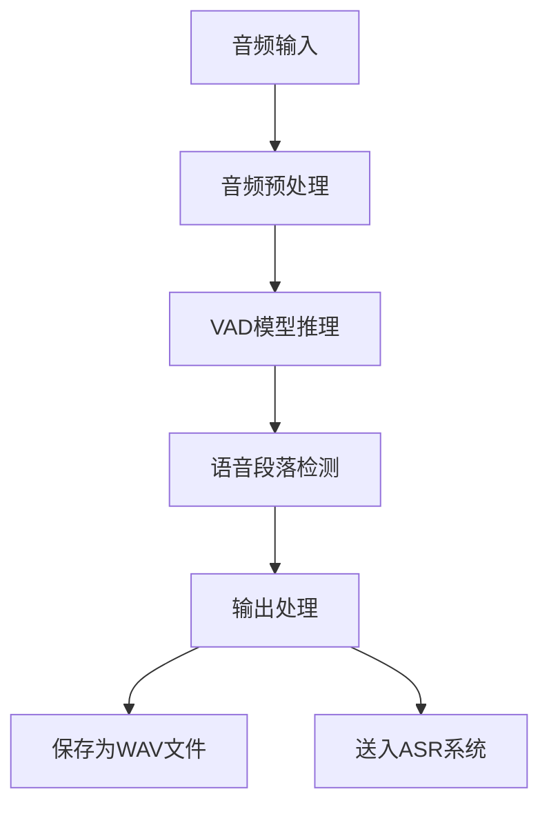
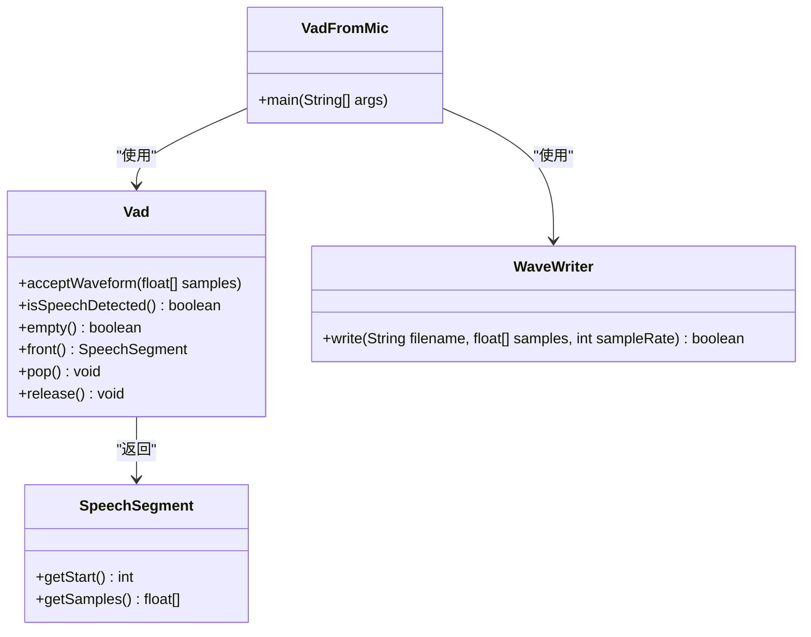
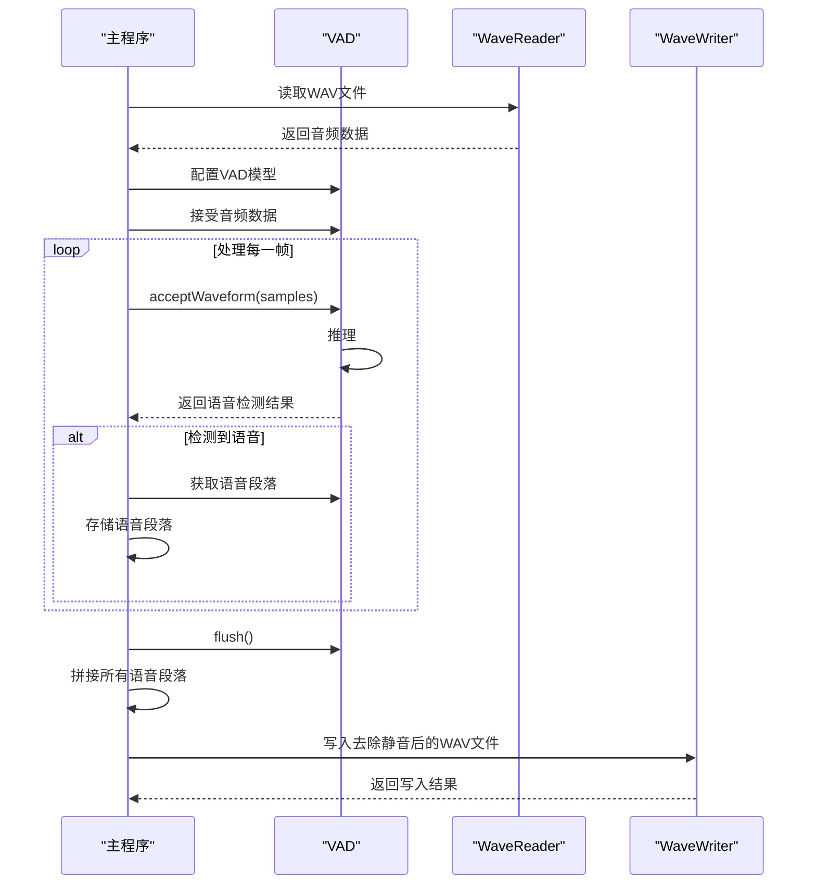
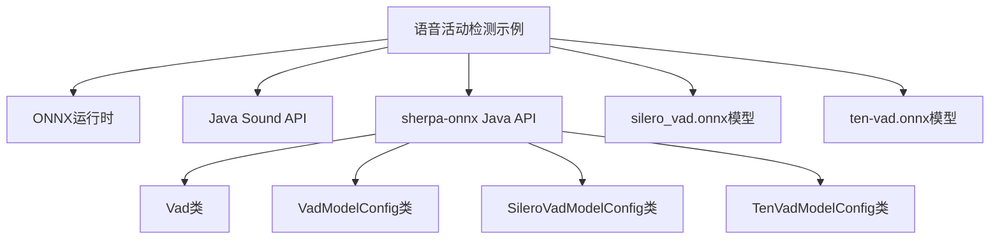

# 语音活动检测示例

<cite>
**本文档引用的文件**
- [VadFromMic.java](file://java-api-examples/VadFromMic.java)
- [VadRemoveSilence.java](file://java-api-examples/VadRemoveSilence.java)
- [TenVadRemoveSilence.java](file://java-api-examples/TenVadRemoveSilence.java)
- [VadFromMicWithNonStreamingParaformer.java](file://java-api-examples/VadFromMicWithNonStreamingParaformer.java)
- [Vad.java](file://sherpa-onnx/java-api/src/main/java/com/k2fsa/sherpa/onnx/Vad.java)
- [VadModelConfig.java](file://sherpa-onnx/java-api/src/main/java/com/k2fsa/sherpa/onnx/VadModelConfig.java)
- [SileroVadModelConfig.java](file://sherpa-onnx/java-api/src/main/java/com/k2fsa/sherpa/onnx/SileroVadModelConfig.java)
- [TenVadModelConfig.java](file://sherpa-onnx/java-api/src/main/java/com/k2fsa/sherpa/onnx/TenVadModelConfig.java)
- [SpeechSegment.java](file://sherpa-onnx/java-api/src/main/java/com/k2fsa/sherpa/onnx/SpeechSegment.java)
- [WaveReader.java](file://sherpa-onnx/java-api/src/main/java/com/k2fsa/sherpa/onnx/WaveReader.java)
- [WaveWriter.java](file://sherpa-onnx/java-api/src/main/java/com/k2fsa/sherpa/onnx/WaveWriter.java)
</cite>

## 目录
1. [简介](#简介)
2. [项目结构](#项目结构)
3. [核心组件](#核心组件)
4. [架构概述](#架构概述)
5. [详细组件分析](#详细组件分析)
6. [依赖分析](#依赖分析)
7. [性能考虑](#性能考虑)
8. [故障排除指南](#故障排除指南)
9. [结论](#结论)

## 简介
本文件详细介绍了如何使用sherpa-onnx的Java API进行语音活动检测（VAD）。文档系统性地组织和解释了所有VAD示例代码，包括单独使用VAD和VAD与ASR结合使用的场景。详细解析了VadFromMic等类的实现机制，说明了如何检测语音段落、去除静音部分以及将VAD与语音识别系统集成。展示了如何配置VAD参数、处理音频流以及利用VAD结果优化ASR性能。提供了完整的代码示例和运行说明，解释了VAD在语音处理流水线中的重要作用和最佳实践。

## 项目结构
sherpa-onnx项目的Java API示例位于`java-api-examples`目录下，其中包含多个与语音活动检测相关的示例文件。这些示例展示了如何使用不同的VAD模型（如silero_vad和ten-vad）进行语音检测和处理。核心的VAD功能实现在`sherpa-onnx/java-api/src/main/java/com/k2fsa/sherpa/onnx/`目录下的Java类中，包括Vad、VadModelConfig、SileroVadModelConfig等类。

**Section sources**
- [VadFromMic.java](file://java-api-examples/VadFromMic.java#L1-L99)
- [VadRemoveSilence.java](file://java-api-examples/VadRemoveSilence.java#L1-L93)

## 核心组件
语音活动检测的核心组件包括Vad类、VadModelConfig类以及相关的模型配置类（如SileroVadModelConfig和TenVadModelConfig）。Vad类是主要的语音活动检测器，负责处理音频流并检测语音段落。VadModelConfig类用于配置VAD模型的参数，包括采样率、线程数、调试模式等。SileroVadModelConfig和TenVadModelConfig类则分别用于配置silero_vad和ten-vad模型的具体参数。

**Section sources**
- [Vad.java](file://sherpa-onnx/java-api/src/main/java/com/k2fsa/sherpa/onnx/Vad.java#L1-L88)
- [VadModelConfig.java](file://sherpa-onnx/java-api/src/main/java/com/k2fsa/sherpa/onnx/VadModelConfig.java#L1-L93)
- [SileroVadModelConfig.java](file://sherpa-onnx/java-api/src/main/java/com/k2fsa/sherpa/onnx/SileroVadModelConfig.java#L1-L94)

## 架构概述
sherpa-onnx的Java API语音活动检测架构基于ONNX模型，使用silero_vad或ten-vad模型进行语音检测。架构主要包括音频输入处理、VAD模型推理、语音段落检测和输出处理四个部分。音频输入通过Java Sound API获取，经过预处理后送入VAD模型进行推理。VAD模型输出语音活动的概率，根据预设的阈值判断是否为语音段落。检测到的语音段落可以保存为WAV文件或送入ASR系统进行语音识别。



**Diagram sources**
- [VadFromMic.java](file://java-api-examples/VadFromMic.java#L1-L99)
- [VadFromMicWithNonStreamingParaformer.java](file://java-api-examples/VadFromMicWithNonStreamingParaformer.java#L1-L147)

## 详细组件分析
### VadFromMic分析
VadFromMic类展示了如何使用麦克风输入进行实时语音活动检测。该类通过Java Sound API获取麦克风输入的音频数据，经过预处理后送入VAD模型进行推理。当检测到语音活动时，将语音段落保存为WAV文件。

#### 类图


**Diagram sources**
- [VadFromMic.java](file://java-api-examples/VadFromMic.java#L1-L99)
- [Vad.java](file://sherpa-onnx/java-api/src/main/java/com/k2fsa/sherpa/onnx/Vad.java#L1-L88)
- [SpeechSegment.java](file://sherpa-onnx/java-api/src/main/java/com/k2fsa/sherpa/onnx/SpeechSegment.java#L1-L21)
- [WaveWriter.java](file://sherpa-onnx/java-api/src/main/java/com/k2fsa/sherpa/onnx/WaveWriter.java#L1-L16)

### VadRemoveSilence分析
VadRemoveSilence类展示了如何使用VAD模型从WAV文件中去除静音部分。该类读取WAV文件的音频数据，通过VAD模型检测语音段落，然后将所有语音段落拼接起来，生成去除静音后的音频文件。

#### 序列图


**Diagram sources**
- [VadRemoveSilence.java](file://java-api-examples/VadRemoveSilence.java#L1-L93)
- [Vad.java](file://sherpa-onnx/java-api/src/main/java/com/k2fsa/sherpa/onnx/Vad.java#L1-L88)
- [WaveReader.java](file://sherpa-onnx/java-api/src/main/java/com/k2fsa/sherpa/onnx/WaveReader.java#L1-L28)
- [WaveWriter.java](file://sherpa-onnx/java-api/src/main/java/com/k2fsa/sherpa/onnx/WaveWriter.java#L1-L16)

### Vad与ASR集成分析
VadFromMicWithNonStreamingParaformer类展示了如何将VAD与非流式ASR系统集成。该类在检测到语音段落后，立即将语音段落送入ASR系统进行语音识别，实现了语音活动检测与语音识别的无缝集成。

#### 流程图
```mermaid
flowchart TD
A[开始] --> B[初始化VAD和ASR]
B --> C[获取麦克风输入]
C --> D[预处理音频数据]
D --> E[VAD模型推理]
E --> F{检测到语音?}
F --> |是| G[获取语音段落]
G --> H[创建ASR流]
H --> I[送入ASR系统]
I --> J[解码语音]
J --> K[获取识别结果]
K --> L{包含"退出程序"?}
L --> |是| M[结束]
L --> |否| C
F --> |否| C
M --> N[释放资源]
```

**Diagram sources**
- [VadFromMicWithNonStreamingParaformer.java](file://java-api-examples/VadFromMicWithNonStreamingParaformer.java#L1-L147)
- [Vad.java](file://sherpa-onnx/java-api/src/main/java/com/k2fsa/sherpa/onnx/Vad.java#L1-L88)
- [OfflineRecognizer.java](file://java-api-examples/VadFromMicWithNonStreamingParaformer.java#L38-L67)

**Section sources**
- [VadFromMicWithNonStreamingParaformer.java](file://java-api-examples/VadFromMicWithNonStreamingParaformer.java#L1-L147)

## 依赖分析
语音活动检测示例依赖于多个组件和库。核心依赖包括ONNX运行时、Java Sound API、sherpa-onnx的Java API以及相关的VAD模型文件（如silero_vad.onnx和ten-vad.onnx）。这些依赖项共同构成了语音活动检测的基础架构。



**Diagram sources**
- [Vad.java](file://sherpa-onnx/java-api/src/main/java/com/k2fsa/sherpa/onnx/Vad.java#L1-L88)
- [VadModelConfig.java](file://sherpa-onnx/java-api/src/main/java/com/k2fsa/sherpa/onnx/VadModelConfig.java#L1-L93)
- [SileroVadModelConfig.java](file://sherpa-onnx/java-api/src/main/java/com/k2fsa/sherpa/onnx/SileroVadModelConfig.java#L1-L94)
- [TenVadModelConfig.java](file://sherpa-onnx/java-api/src/main/java/com/k2fsa/sherpa/onnx/TenVadModelConfig.java#L1-L94)

**Section sources**
- [Vad.java](file://sherpa-onnx/java-api/src/main/java/com/k2fsa/sherpa/onnx/Vad.java#L1-L88)
- [VadModelConfig.java](file://sherpa-onnx/java-api/src/main/java/com/k2fsa/sherpa/onnx/VadModelConfig.java#L1-L93)

## 性能考虑
在使用语音活动检测时，需要考虑多个性能因素。首先，VAD模型的推理速度直接影响实时性，建议使用CPU或GPU加速。其次，音频缓冲区的大小会影响延迟和内存使用，需要根据具体应用场景进行调整。最后，多线程处理可以提高整体性能，但需要考虑线程安全和资源竞争问题。

## 故障排除指南
在使用语音活动检测示例时，可能会遇到一些常见问题。例如，麦克风无法打开、模型文件找不到、音频格式不支持等。对于这些问题，建议检查设备权限、文件路径和音频格式是否符合要求。此外，开启调试模式可以帮助定位问题。

**Section sources**
- [VadFromMic.java](file://java-api-examples/VadFromMic.java#L47-L51)
- [VadRemoveSilence.java](file://java-api-examples/VadRemoveSilence.java#L38-L39)

## 结论
sherpa-onnx的Java API提供了强大而灵活的语音活动检测功能。通过合理配置VAD参数和集成ASR系统，可以构建高效的语音处理流水线。本文档详细介绍了VAD示例的实现机制和最佳实践，为开发者提供了全面的参考。