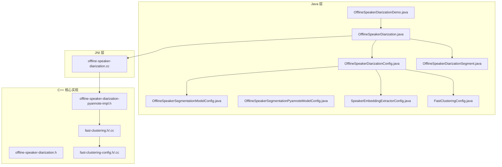
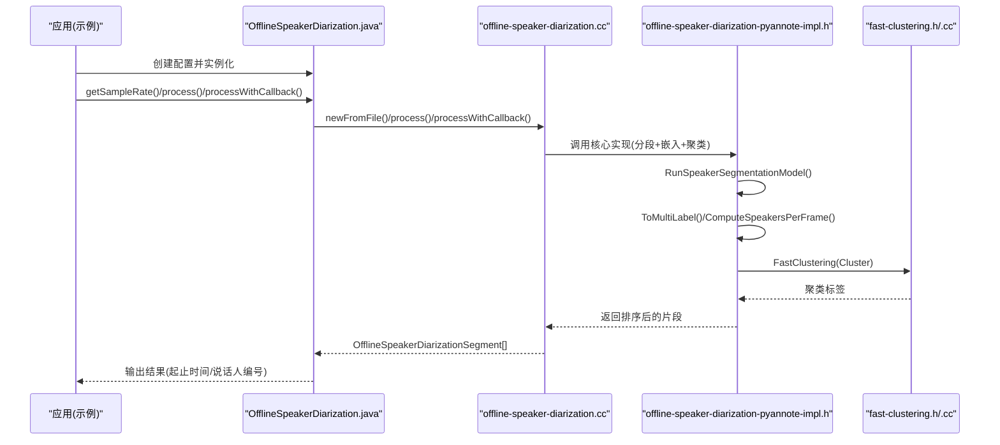
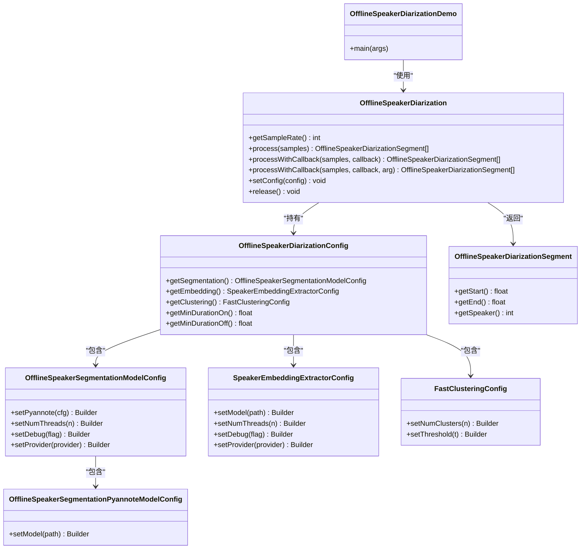
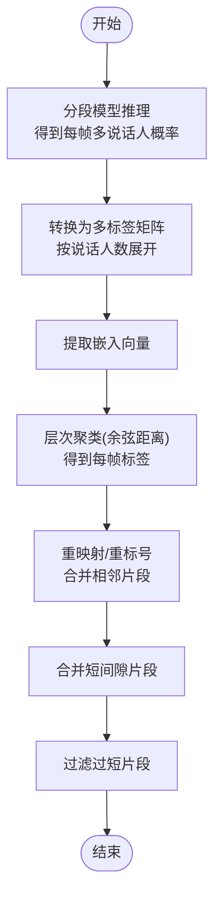
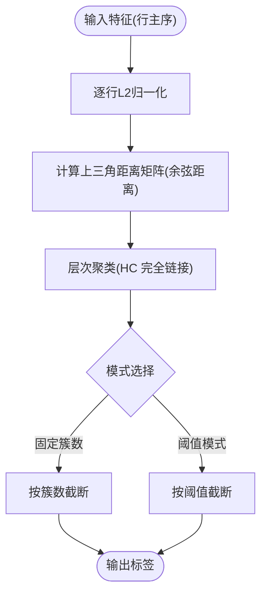
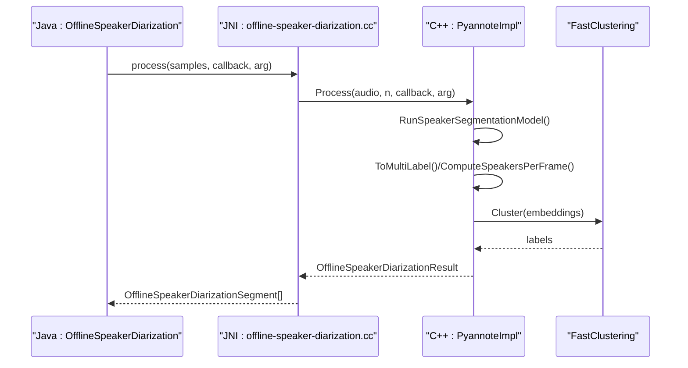
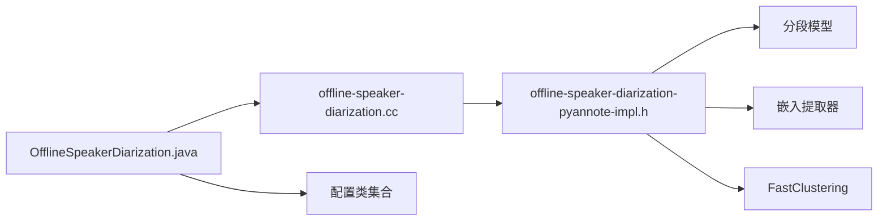

# 说话人分离示例

<cite>
**本文引用的文件列表**
- [OfflineSpeakerDiarizationDemo.java](file://java-api-examples/OfflineSpeakerDiarizationDemo.java)
- [OfflineSpeakerDiarization.java](file://sherpa-onnx/java-api/src/main/java/com/k2fsa/sherpa/onnx/OfflineSpeakerDiarization.java)
- [OfflineSpeakerDiarizationConfig.java](file://sherpa-onnx/java-api/src/main/java/com/k2fsa/sherpa/onnx/OfflineSpeakerDiarizationConfig.java)
- [OfflineSpeakerSegmentationModelConfig.java](file://sherpa-onnx/java-api/src/main/java/com/k2fsa/sherpa/onnx/OfflineSpeakerSegmentationModelConfig.java)
- [OfflineSpeakerSegmentationPyannoteModelConfig.java](file://sherpa-onnx/java-api/src/main/java/com/k2fsa/sherpa/onnx/OfflineSpeakerSegmentationPyannoteModelConfig.java)
- [SpeakerEmbeddingExtractorConfig.java](file://sherpa-onnx/java-api/src/main/java/com/k2fsa/sherpa/onnx/SpeakerEmbeddingExtractorConfig.java)
- [FastClusteringConfig.java](file://sherpa-onnx/java-api/src/main/java/com/k2fsa/sherpa/onnx/FastClusteringConfig.java)
- [OfflineSpeakerDiarizationSegment.java](file://sherpa-onnx/java-api/src/main/java/com/k2fsa/sherpa/onnx/OfflineSpeakerDiarizationSegment.java)
- [offline-speaker-diarization.cc（JNI）](file://sherpa-onnx/jni/offline-speaker-diarization.cc)
- [offline-speaker-diarization-pyannote-impl.h](file://sherpa-onnx/csrc/offline-speaker-diarization-pyannote-impl.h)
- [offline-speaker-diarization.h](file://sherpa-onnx/csrc/offline-speaker-diarization.h)
- [fast-clustering.h](file://sherpa-onnx/csrc/fast-clustering.h)
- [fast-clustering.cc](file://sherpa-onnx/csrc/fast-clustering.cc)
- [fast-clustering-config.h](file://sherpa-onnx/csrc/fast-clustering-config.h)
- [fast-clustering-config.cc](file://sherpa-onnx/csrc/fast-clustering-config.cc)
- [speaker-diarization-onnx.py](file://scripts/pyannote/segmentation/speaker-diarization-onnx.py)
</cite>

## 目录
1. [简介](#简介)
2. [项目结构](#项目结构)
3. [核心组件](#核心组件)
4. [架构总览](#架构总览)
5. [详细组件分析](#详细组件分析)
6. [依赖关系分析](#依赖关系分析)
7. [性能考量](#性能考量)
8. [故障排查指南](#故障排查指南)
9. [结论](#结论)
10. [附录](#附录)

## 简介
本文件围绕 sherpa-onnx 的 Java API 实现“离线说话人分离（Offline Speaker Diarization）”进行系统化说明，重点基于示例程序 OfflineSpeakerDiarizationDemo.java，讲解如何通过 Java API 对多说话人语音进行分离与标记。内容涵盖：
- 离线说话人分离算法工作原理：语音段分割、说话人嵌入提取、聚类与标签分配、后处理（时长裁剪与合并）
- 如何配置分离模型参数（分段模型、嵌入提取器、聚类器、最小持续时长等）
- 如何处理输入音频流与解析输出结果（起止时间、说话人标签）
- 在会议记录、语音转写等场景的应用方法与性能优化策略

## 项目结构
与 Java API 说话人分离相关的核心文件分布如下：
- 示例入口：java-api-examples/OfflineSpeakerDiarizationDemo.java
- Java 层 API 类：OfflineSpeakerDiarization.java 及其配置类
- JNI 层桥接：jni/offline-speaker-diarization.cc
- 核心算法实现：csrc/offline-speaker-diarization-pyannote-impl.h、csrc/offline-speaker-diarization.h
- 聚类实现：csrc/fast-clustering.h/.cc、csrc/fast-clustering-config.h/.cc
- Python/脚本参考：scripts/pyannote/segmentation/speaker-diarization-onnx.py

图表来源
- [OfflineSpeakerDiarizationDemo.java](file://java-api-examples/OfflineSpeakerDiarizationDemo.java#L1-L100)
- [OfflineSpeakerDiarization.java](file://sherpa-onnx/java-api/src/main/java/com/k2fsa/sherpa/onnx/OfflineSpeakerDiarization.java#L1-L58)
- [offline-speaker-diarization.cc](file://sherpa-onnx/jni/offline-speaker-diarization.cc#L229-L247)
- [offline-speaker-diarization-pyannote-impl.h](file://sherpa-onnx/csrc/offline-speaker-diarization-pyannote-impl.h#L44-L125)
- [offline-speaker-diarization.h](file://sherpa-onnx/csrc/offline-speaker-diarization.h#L1-L32)
- [fast-clustering.h](file://sherpa-onnx/csrc/fast-clustering.h#L1-L44)
- [fast-clustering-config.h](file://sherpa-onnx/csrc/fast-clustering-config.h#L1-L39)

章节来源
- [OfflineSpeakerDiarizationDemo.java](file://java-api-examples/OfflineSpeakerDiarizationDemo.java#L1-L100)
- [OfflineSpeakerDiarization.java](file://sherpa-onnx/java-api/src/main/java/com/k2fsa/sherpa/onnx/OfflineSpeakerDiarization.java#L1-L58)

## 核心组件
- OfflineSpeakerDiarization：Java 层对外暴露的主类，负责加载模型、执行推理、释放资源，并提供带回调的进度通知。
- OfflineSpeakerDiarizationConfig：整体配置对象，包含分段模型、嵌入提取器、聚类器及最小持续时长参数。
- OfflineSpeakerSegmentationModelConfig / OfflineSpeakerSegmentationPyannoteModelConfig：分段模型配置，支持 Pyannote 分割模型。
- SpeakerEmbeddingExtractorConfig：说话人嵌入提取器配置（模型路径、线程数、执行提供者等）。
- FastClusteringConfig：聚类配置（固定簇数或阈值）。
- OfflineSpeakerDiarizationSegment：单个说话人片段的结果对象（起始时间、结束时间、说话人编号）。

章节来源
- [OfflineSpeakerDiarization.java](file://sherpa-onnx/java-api/src/main/java/com/k2fsa/sherpa/onnx/OfflineSpeakerDiarization.java#L1-L58)
- [OfflineSpeakerDiarizationConfig.java](file://sherpa-onnx/java-api/src/main/java/com/k2fsa/sherpa/onnx/OfflineSpeakerDiarizationConfig.java#L1-L80)
- [OfflineSpeakerSegmentationModelConfig.java](file://sherpa-onnx/java-api/src/main/java/com/k2fsa/sherpa/onnx/OfflineSpeakerSegmentationModelConfig.java#L1-L52)
- [OfflineSpeakerSegmentationPyannoteModelConfig.java](file://sherpa-onnx/java-api/src/main/java/com/k2fsa/sherpa/onnx/OfflineSpeakerSegmentationPyannoteModelConfig.java#L1-L32)
- [SpeakerEmbeddingExtractorConfig.java](file://sherpa-onnx/java-api/src/main/java/com/k2fsa/sherpa/onnx/SpeakerEmbeddingExtractorConfig.java#L1-L54)
- [FastClusteringConfig.java](file://sherpa-onnx/java-api/src/main/java/com/k2fsa/sherpa/onnx/FastClusteringConfig.java#L1-L45)
- [OfflineSpeakerDiarizationSegment.java](file://sherpa-onnx/java-api/src/main/java/com/k2fsa/sherpa/onnx/OfflineSpeakerDiarizationSegment.java#L1-L28)

## 架构总览
下图展示了从 Java 调用到底层 C++ 实现的整体流程，以及各模块之间的依赖关系。

图表来源
- [OfflineSpeakerDiarization.java](file://sherpa-onnx/java-api/src/main/java/com/k2fsa/sherpa/onnx/OfflineSpeakerDiarization.java#L1-L58)
- [offline-speaker-diarization.cc](file://sherpa-onnx/jni/offline-speaker-diarization.cc#L229-L247)
- [offline-speaker-diarization-pyannote-impl.h](file://sherpa-onnx/csrc/offline-speaker-diarization-pyannote-impl.h#L94-L185)
- [fast-clustering.h](file://sherpa-onnx/csrc/fast-clustering.h#L1-L44)

## 详细组件分析

### 组件一：Java API 入口与调用链
- OfflineSpeakerDiarizationDemo.java 是完整示例，演示了如何下载模型、读取音频、构建配置、执行推理并打印结果。
- OfflineSpeakerDiarization.java 提供 getSampleRate、process、processWithCallback、setConfig、release 等方法；内部通过 JNI 调用底层实现。

图表来源
- [OfflineSpeakerDiarizationDemo.java](file://java-api-examples/OfflineSpeakerDiarizationDemo.java#L1-L100)
- [OfflineSpeakerDiarization.java](file://sherpa-onnx/java-api/src/main/java/com/k2fsa/sherpa/onnx/OfflineSpeakerDiarization.java#L1-L58)
- [OfflineSpeakerDiarizationConfig.java](file://sherpa-onnx/java-api/src/main/java/com/k2fsa/sherpa/onnx/OfflineSpeakerDiarizationConfig.java#L1-L80)
- [OfflineSpeakerSegmentationModelConfig.java](file://sherpa-onnx/java-api/src/main/java/com/k2fsa/sherpa/onnx/OfflineSpeakerSegmentationModelConfig.java#L1-L52)
- [OfflineSpeakerSegmentationPyannoteModelConfig.java](file://sherpa-onnx/java-api/src/main/java/com/k2fsa/sherpa/onnx/OfflineSpeakerSegmentationPyannoteModelConfig.java#L1-L32)
- [SpeakerEmbeddingExtractorConfig.java](file://sherpa-onnx/java-api/src/main/java/com/k2fsa/sherpa/onnx/SpeakerEmbeddingExtractorConfig.java#L1-L54)
- [FastClusteringConfig.java](file://sherpa-onnx/java-api/src/main/java/com/k2fsa/sherpa/onnx/FastClusteringConfig.java#L1-L45)
- [OfflineSpeakerDiarizationSegment.java](file://sherpa-onnx/java-api/src/main/java/com/k2fsa/sherpa/onnx/OfflineSpeakerDiarizationSegment.java#L1-L28)

章节来源
- [OfflineSpeakerDiarizationDemo.java](file://java-api-examples/OfflineSpeakerDiarizationDemo.java#L1-L100)
- [OfflineSpeakerDiarization.java](file://sherpa-onnx/java-api/src/main/java/com/k2fsa/sherpa/onnx/OfflineSpeakerDiarization.java#L1-L58)

### 组件二：算法工作原理与数据流
离线说话人分离由三个阶段组成：
1) 语音段分割（Segmentation）：对音频进行分帧预测，得到每帧属于不同说话人的概率矩阵。
2) 说话人嵌入提取（Embedding）：从有效语音段中抽取高维嵌入向量。
3) 聚类与标签分配（Clustering）：对嵌入向量进行层次聚类，生成每个帧的说话人标签，再映射回原始时间轴并做后处理。

图表来源
- [offline-speaker-diarization-pyannote-impl.h](file://sherpa-onnx/csrc/offline-speaker-diarization-pyannote-impl.h#L160-L185)
- [offline-speaker-diarization-pyannote-impl.h](file://sherpa-onnx/csrc/offline-speaker-diarization-pyannote-impl.h#L523-L605)
- [offline-speaker-diarization.h](file://sherpa-onnx/csrc/offline-speaker-diarization.h#L1-L32)

章节来源
- [offline-speaker-diarization-pyannote-impl.h](file://sherpa-onnx/csrc/offline-speaker-diarization-pyannote-impl.h#L94-L185)
- [offline-speaker-diarization.h](file://sherpa-onnx/csrc/offline-speaker-diarization.h#L1-L32)

### 组件三：聚类器 FastClustering
- 支持两种模式：固定簇数（num_clusters > 0）或阈值模式（自动确定簇数）。
- 使用余弦相似度计算帧间距离，采用层次聚类并在指定阈值处截断或直接按簇数截断。
- 输入特征会被 L2 归一化，以提升聚类稳定性。

图表来源
- [fast-clustering.cc](file://sherpa-onnx/csrc/fast-clustering.cc#L1-L83)
- [fast-clustering.h](file://sherpa-onnx/csrc/fast-clustering.h#L1-L44)
- [fast-clustering-config.h](file://sherpa-onnx/csrc/fast-clustering-config.h#L1-L39)
- [fast-clustering-config.cc](file://sherpa-onnx/csrc/fast-clustering-config.cc#L1-L45)

章节来源
- [fast-clustering.cc](file://sherpa-onnx/csrc/fast-clustering.cc#L1-L83)
- [fast-clustering-config.h](file://sherpa-onnx/csrc/fast-clustering-config.h#L1-L39)
- [fast-clustering-config.cc](file://sherpa-onnx/csrc/fast-clustering-config.cc#L1-L45)

### 组件四：JNI 桥接与调用序列
- Java 层通过 JNI 将浮点数组样本传递给 C++，并在回调中更新进度。
- C++ 层完成分段、嵌入、聚类与后处理，最终返回排序后的片段数组。

图表来源
- [offline-speaker-diarization.cc](file://sherpa-onnx/jni/offline-speaker-diarization.cc#L229-L247)
- [offline-speaker-diarization-pyannote-impl.h](file://sherpa-onnx/csrc/offline-speaker-diarization-pyannote-impl.h#L94-L185)
- [fast-clustering.h](file://sherpa-onnx/csrc/fast-clustering.h#L1-L44)

章节来源
- [offline-speaker-diarization.cc](file://sherpa-onnx/jni/offline-speaker-diarization.cc#L229-L247)

## 依赖关系分析
- Java API 与 C++ 核心通过 JNI 直接耦合，JNI 再调用 Pyannote 实现。
- Pyannote 实现依赖分段模型、嵌入提取器与 FastClustering。
- 配置对象在 Java 层构建后传入 JNI/C++，用于初始化模型与运行参数。

图表来源
- [OfflineSpeakerDiarization.java](file://sherpa-onnx/java-api/src/main/java/com/k2fsa/sherpa/onnx/OfflineSpeakerDiarization.java#L1-L58)
- [offline-speaker-diarization.cc](file://sherpa-onnx/jni/offline-speaker-diarization.cc#L229-L247)
- [offline-speaker-diarization-pyannote-impl.h](file://sherpa-onnx/csrc/offline-speaker-diarization-pyannote-impl.h#L44-L125)

章节来源
- [OfflineSpeakerDiarization.java](file://sherpa-onnx/java-api/src/main/java/com/k2fsa/sherpa/onnx/OfflineSpeakerDiarization.java#L1-L58)
- [offline-speaker-diarization-pyannote-impl.h](file://sherpa-onnx/csrc/offline-speaker-diarization-pyannote-impl.h#L44-L125)

## 性能考量
- 线程与执行提供者：配置类均支持设置 numThreads 与 provider，可按硬件能力调整推理并发与设备（CPU/GPU）。
- 分段模型与嵌入模型大小：较大的模型通常更准确但耗时更长，需在精度与速度之间权衡。
- 聚类阈值与簇数：阈值越小越易产生更多簇，增加聚类复杂度；已知簇数时建议直接设置 num_clusters，避免额外搜索。
- 最小持续时长与间隙合并：合理设置 min_duration_on/min_duration_off 可减少噪声片段与冗余间隙，提高输出质量。
- 回调与进度：使用 processWithCallback 可在长音频上显示进度，便于用户感知与中断控制。

章节来源
- [OfflineSpeakerSegmentationModelConfig.java](file://sherpa-onnx/java-api/src/main/java/com/k2fsa/sherpa/onnx/OfflineSpeakerSegmentationModelConfig.java#L1-L52)
- [SpeakerEmbeddingExtractorConfig.java](file://sherpa-onnx/java-api/src/main/java/com/k2fsa/sherpa/onnx/SpeakerEmbeddingExtractorConfig.java#L1-L54)
- [FastClusteringConfig.java](file://sherpa-onnx/java-api/src/main/java/com/k2fsa/sherpa/onnx/FastClusteringConfig.java#L1-L45)
- [offline-speaker-diarization.h](file://sherpa-onnx/csrc/offline-speaker-diarization.h#L1-L32)

## 故障排查指南
- 音频采样率不匹配：示例中会检查 sd.getSampleRate() 与输入音频采样率是否一致，不一致则提示错误。请确保输入音频与分段模型期望采样率一致。
- 配置校验失败：C++ 层会对分段模型、嵌入提取器与聚类配置进行校验，若无效会拒绝设置或跳过运行。请检查模型路径、provider、阈值/簇数等参数。
- 结果为空：当未检测到任何说话人片段时，实现层会返回空结果。可尝试降低阈值或检查输入音频质量。
- 进度回调：若使用回调，请确保回调函数返回 0 表示继续，非 0 可中断处理。

章节来源
- [OfflineSpeakerDiarizationDemo.java](file://java-api-examples/OfflineSpeakerDiarizationDemo.java#L70-L98)
- [offline-speaker-diarization.cc](file://sherpa-onnx/jni/offline-speaker-diarization.cc#L229-L247)
- [offline-speaker-diarization-pyannote-impl.h](file://sherpa-onnx/csrc/offline-speaker-diarization-pyannote-impl.h#L160-L185)

## 结论
通过 Java API 的 OfflineSpeakerDiarization，开发者可以便捷地在桌面/服务器环境中实现多说话人语音的离线分离与标记。其核心流程清晰、参数可控，配合合理的模型与阈值设置，可在会议记录、语音转写等场景中获得稳定的效果。建议优先明确说话人数量时使用固定簇数模式，未知数量时以阈值驱动聚类，并结合最小持续时长与间隙合并参数优化输出质量。

## 附录

### A. 配置参数说明与最佳实践
- 分段模型配置（OfflineSpeakerSegmentationModelConfig）
  - pyannote：Pyannote 分割模型路径
  - numThreads：推理线程数
  - debug：调试开关
  - provider：执行提供者（如 cpu）
- 嵌入提取器配置（SpeakerEmbeddingExtractorConfig）
  - model：嵌入模型路径
  - numThreads/provider/debug 同上
- 聚类配置（FastClusteringConfig）
  - numClusters：若已知说话人数量，建议直接设置该值
  - threshold：若未知数量，可通过阈值控制聚类数量
- 全局配置（OfflineSpeakerDiarizationConfig）
  - minDurationOn：丢弃短于该时长的片段
  - minDurationOff：合并短间隙片段
- 示例参考
  - Python/脚本参考：scripts/pyannote/segmentation/speaker-diarization-onnx.py 中展示了从分段到聚类再到重映射的完整流程，可作为理解算法步骤的补充材料。

章节来源
- [OfflineSpeakerSegmentationModelConfig.java](file://sherpa-onnx/java-api/src/main/java/com/k2fsa/sherpa/onnx/OfflineSpeakerSegmentationModelConfig.java#L1-L52)
- [SpeakerEmbeddingExtractorConfig.java](file://sherpa-onnx/java-api/src/main/java/com/k2fsa/sherpa/onnx/SpeakerEmbeddingExtractorConfig.java#L1-L54)
- [FastClusteringConfig.java](file://sherpa-onnx/java-api/src/main/java/com/k2fsa/sherpa/onnx/FastClusteringConfig.java#L1-L45)
- [OfflineSpeakerDiarizationConfig.java](file://sherpa-onnx/java-api/src/main/java/com/k2fsa/sherpa/onnx/OfflineSpeakerDiarizationConfig.java#L1-L80)
- [speaker-diarization-onnx.py](file://scripts/pyannote/segmentation/speaker-diarization-onnx.py#L146-L429)

### B. 实际应用场景与输出解析
- 会议记录：将输出片段按说话人编号分组，生成带时间戳的字幕或转写文本。
- 语音转写：先进行说话人分离，再对每个说话人片段单独进行 ASR，最后按时间顺序拼接结果。
- 输出字段解析：
  - start/end：片段起止时间（秒）
  - speaker：说话人编号（从 0 开始）

章节来源
- [OfflineSpeakerDiarizationSegment.java](file://sherpa-onnx/java-api/src/main/java/com/k2fsa/sherpa/onnx/OfflineSpeakerDiarizationSegment.java#L1-L28)
- [OfflineSpeakerDiarizationDemo.java](file://java-api-examples/OfflineSpeakerDiarizationDemo.java#L90-L98)