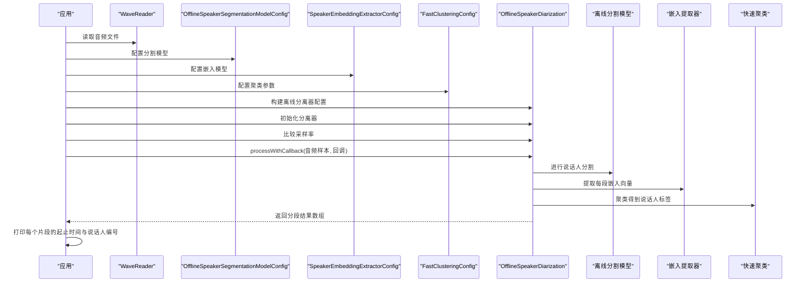
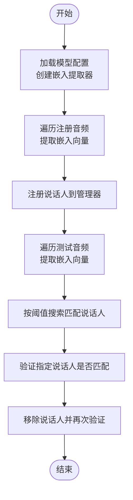
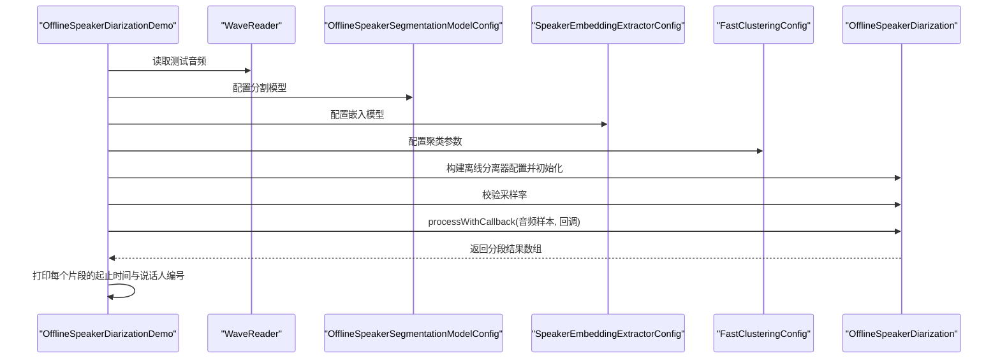
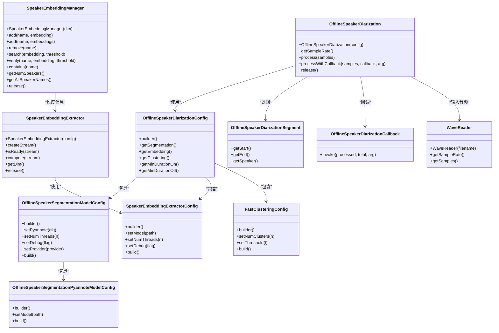

# 说话人相关功能示例

<cite>
**本文引用的文件列表**
- [SpeakerIdentification.java](file://java-api-examples/SpeakerIdentification.java)
- [OfflineSpeakerDiarizationDemo.java](file://java-api-examples/OfflineSpeakerDiarizationDemo.java)
- [SpeakerEmbeddingManager.java](file://sherpa-onnx/java-api/src/main/java/com/k2fsa/sherpa/onnx/SpeakerEmbeddingManager.java)
- [SpeakerEmbeddingExtractor.java](file://sherpa-onnx/java-api/src/main/java/com/k2fsa/sherpa/onnx/SpeakerEmbeddingExtractor.java)
- [OfflineSpeakerDiarization.java](file://sherpa-onnx/java-api/src/main/java/com/k2fsa/sherpa/onnx/OfflineSpeakerDiarization.java)
- [OfflineSpeakerDiarizationConfig.java](file://sherpa-onnx/java-api/src/main/java/com/k2fsa/sherpa/onnx/OfflineSpeakerDiarizationConfig.java)
- [OfflineSpeakerSegmentationModelConfig.java](file://sherpa-onnx/java-api/src/main/java/com/k2fsa/sherpa/onnx/OfflineSpeakerSegmentationModelConfig.java)
- [OfflineSpeakerSegmentationPyannoteModelConfig.java](file://sherpa-onnx/java-api/src/main/java/com/k2fsa/sherpa/onnx/OfflineSpeakerSegmentationPyannoteModelConfig.java)
- [SpeakerEmbeddingExtractorConfig.java](file://sherpa-onnx/java-api/src/main/java/com/k2fsa/sherpa/onnx/SpeakerEmbeddingExtractorConfig.java)
- [FastClusteringConfig.java](file://sherpa-onnx/java-api/src/main/java/com/k2fsa/sherpa/onnx/FastClusteringConfig.java)
- [OfflineSpeakerDiarizationSegment.java](file://sherpa-onnx/java-api/src/main/java/com/k2fsa/sherpa/onnx/OfflineSpeakerDiarizationSegment.java)
- [OfflineSpeakerDiarizationCallback.java](file://sherpa-onnx/java-api/src/main/java/com/k2fsa/sherpa/onnx/OfflineSpeakerDiarizationCallback.java)
- [WaveReader.java](file://sherpa-onnx/java-api/src/main/java/com/k2fsa/sherpa/onnx/WaveReader.java)
- [README.md（Java示例）](file://java-api-examples/README.md)
</cite>

## 目录
1. [简介](#简介)
2. [项目结构](#项目结构)
3. [核心组件](#核心组件)
4. [架构总览](#架构总览)
5. [组件详解](#组件详解)
6. [依赖关系分析](#依赖关系分析)
7. [性能与优化](#性能与优化)
8. [故障排查指南](#故障排查指南)
9. [结论](#结论)
10. [附录：运行与使用说明](#附录运行与使用说明)

## 简介
本文件面向Java开发者，系统化讲解sherpa-onnx的说话人相关功能示例，包括：
- 说话人识别（Speaker Identification）：基于声纹嵌入向量的注册、检索与验证。
- 多说话人分离（Offline Speaker Diarization）：离线语音分段与说话人聚类标注。

文档将深入解析SpeakerIdentification与OfflineSpeakerDiarizationDemo两个示例类的实现机制，说明如何提取声纹特征、进行说话人比对、实现多说话人分离，以及如何配置模型参数、管理说话人库、处理识别结果。同时提供完整的运行说明与性能优化建议。

## 项目结构
与Java API相关的说话人功能主要分布在以下位置：
- 示例代码：java-api-examples目录下的SpeakerIdentification.java与OfflineSpeakerDiarizationDemo.java
- Java API封装：sherpa-onnx/java-api/src/main/java/com/k2fsa/sherpa/onnx下的一系列类，如SpeakerEmbeddingExtractor、SpeakerEmbeddingManager、OfflineSpeakerDiarization等
- README：java-api-examples/README.md中包含Java示例的使用说明

```mermaid
graph TB
subgraph "示例代码"
A["SpeakerIdentification.java"]
B["OfflineSpeakerDiarizationDemo.java"]
end
subgraph "Java API封装"
C["SpeakerEmbeddingExtractor.java"]
D["SpeakerEmbeddingManager.java"]
E["OfflineSpeakerDiarization.java"]
F["OfflineSpeakerDiarizationConfig.java"]
G["OfflineSpeakerSegmentationModelConfig.java"]
H["OfflineSpeakerSegmentationPyannoteModelConfig.java"]
I["SpeakerEmbeddingExtractorConfig.java"]
J["FastClusteringConfig.java"]
K["OfflineSpeakerDiarizationSegment.java"]
L["OfflineSpeakerDiarizationCallback.java"]
M["WaveReader.java"]
end
A --> C
A --> D
A --> M
B --> E
B --> F
B --> G
B --> H
B --> I
B --> J
B --> K
B --> L
B --> M
```

图表来源
- [SpeakerIdentification.java](file://java-api-examples/SpeakerIdentification.java#L1-L133)
- [OfflineSpeakerDiarizationDemo.java](file://java-api-examples/OfflineSpeakerDiarizationDemo.java#L1-L100)
- [SpeakerEmbeddingExtractor.java](file://sherpa-onnx/java-api/src/main/java/com/k2fsa/sherpa/onnx/SpeakerEmbeddingExtractor.java#L1-L55)
- [SpeakerEmbeddingManager.java](file://sherpa-onnx/java-api/src/main/java/com/k2fsa/sherpa/onnx/SpeakerEmbeddingManager.java#L1-L78)
- [OfflineSpeakerDiarization.java](file://sherpa-onnx/java-api/src/main/java/com/k2fsa/sherpa/onnx/OfflineSpeakerDiarization.java#L47-L58)
- [OfflineSpeakerDiarizationConfig.java](file://sherpa-onnx/java-api/src/main/java/com/k2fsa/sherpa/onnx/OfflineSpeakerDiarizationConfig.java#L1-L40)
- [OfflineSpeakerSegmentationModelConfig.java](file://sherpa-onnx/java-api/src/main/java/com/k2fsa/sherpa/onnx/OfflineSpeakerSegmentationModelConfig.java#L1-L52)
- [OfflineSpeakerSegmentationPyannoteModelConfig.java](file://sherpa-onnx/java-api/src/main/java/com/k2fsa/sherpa/onnx/OfflineSpeakerSegmentationPyannoteModelConfig.java)
- [SpeakerEmbeddingExtractorConfig.java](file://sherpa-onnx/java-api/src/main/java/com/k2fsa/sherpa/onnx/SpeakerEmbeddingExtractorConfig.java)
- [FastClusteringConfig.java](file://sherpa-onnx/java-api/src/main/java/com/k2fsa/sherpa/onnx/FastClusteringConfig.java#L1-L45)
- [OfflineSpeakerDiarizationSegment.java](file://sherpa-onnx/java-api/src/main/java/com/k2fsa/sherpa/onnx/OfflineSpeakerDiarizationSegment.java#L1-L28)
- [OfflineSpeakerDiarizationCallback.java](file://sherpa-onnx/java-api/src/main/java/com/k2fsa/sherpa/onnx/OfflineSpeakerDiarizationCallback.java#L1-L8)
- [WaveReader.java](file://sherpa-onnx/java-api/src/main/java/com/k2fsa/sherpa/onnx/WaveReader.java#L1-L28)

章节来源
- [README.md（Java示例）](file://java-api-examples/README.md#L1-L142)

## 核心组件
- 声纹嵌入提取器：负责从音频中提取固定维度的声纹向量，用于后续的说话人识别与聚类。
- 声纹管理器：维护说话人库，支持添加、删除、查询、验证与统计。
- 离线说话人分离器：结合说话人分割模型与嵌入模型，对整段音频进行说话人分段与聚类标注。
- 配置类族：用于构建上述组件所需的参数，如模型路径、线程数、调试开关、聚类阈值等。
- 数据结构：离线分离结果段对象，包含起止时间与说话人标签。

章节来源
- [SpeakerEmbeddingExtractor.java](file://sherpa-onnx/java-api/src/main/java/com/k2fsa/sherpa/onnx/SpeakerEmbeddingExtractor.java#L1-L55)
- [SpeakerEmbeddingManager.java](file://sherpa-onnx/java-api/src/main/java/com/k2fsa/sherpa/onnx/SpeakerEmbeddingManager.java#L1-L78)
- [OfflineSpeakerDiarization.java](file://sherpa-onnx/java-api/src/main/java/com/k2fsa/sherpa/onnx/OfflineSpeakerDiarization.java#L47-L58)
- [OfflineSpeakerDiarizationConfig.java](file://sherpa-onnx/java-api/src/main/java/com/k2fsa/sherpa/onnx/OfflineSpeakerDiarizationConfig.java#L1-L40)
- [OfflineSpeakerSegmentationModelConfig.java](file://sherpa-onnx/java-api/src/main/java/com/k2fsa/sherpa/onnx/OfflineSpeakerSegmentationModelConfig.java#L1-L52)
- [FastClusteringConfig.java](file://sherpa-onnx/java-api/src/main/java/com/k2fsa/sherpa/onnx/FastClusteringConfig.java#L1-L45)
- [OfflineSpeakerDiarizationSegment.java](file://sherpa-onnx/java-api/src/main/java/com/k2fsa/sherpa/onnx/OfflineSpeakerDiarizationSegment.java#L1-L28)

## 架构总览
下面以序列图展示离线说话人分离的整体流程，从读取音频到输出分段结果。

图表来源
- [OfflineSpeakerDiarizationDemo.java](file://java-api-examples/OfflineSpeakerDiarizationDemo.java#L1-L100)
- [OfflineSpeakerDiarization.java](file://sherpa-onnx/java-api/src/main/java/com/k2fsa/sherpa/onnx/OfflineSpeakerDiarization.java#L47-L58)
- [OfflineSpeakerSegmentationModelConfig.java](file://sherpa-onnx/java-api/src/main/java/com/k2fsa/sherpa/onnx/OfflineSpeakerSegmentationModelConfig.java#L1-L52)
- [SpeakerEmbeddingExtractorConfig.java](file://sherpa-onnx/java-api/src/main/java/com/k2fsa/sherpa/onnx/SpeakerEmbeddingExtractorConfig.java)
- [FastClusteringConfig.java](file://sherpa-onnx/java-api/src/main/java/com/k2fsa/sherpa/onnx/FastClusteringConfig.java#L1-L45)
- [OfflineSpeakerDiarizationSegment.java](file://sherpa-onnx/java-api/src/main/java/com/k2fsa/sherpa/onnx/OfflineSpeakerDiarizationSegment.java#L1-L28)

## 组件详解

### 说话人识别（SpeakerIdentification）
该示例展示了如何使用声纹嵌入提取器为多个说话人建立注册库，并对测试音频进行检索与验证。

关键流程与要点：
- 使用WaveReader读取音频，创建OnlineStream并喂入音频数据。
- 调用SpeakerEmbeddingExtractor.compute提取固定维度的嵌入向量。
- 使用SpeakerEmbeddingManager管理说话人库：add、contains、getAllSpeakerNames、search、verify、remove、getNumSpeakers。
- 通过阈值控制识别的置信度，超过阈值返回匹配说话人名称，否则标记为未知。

图表来源
- [SpeakerIdentification.java](file://java-api-examples/SpeakerIdentification.java#L1-L133)
- [SpeakerEmbeddingExtractor.java](file://sherpa-onnx/java-api/src/main/java/com/k2fsa/sherpa/onnx/SpeakerEmbeddingExtractor.java#L1-L55)
- [SpeakerEmbeddingManager.java](file://sherpa-onnx/java-api/src/main/java/com/k2fsa/sherpa/onnx/SpeakerEmbeddingManager.java#L1-L78)
- [WaveReader.java](file://sherpa-onnx/java-api/src/main/java/com/k2fsa/sherpa/onnx/WaveReader.java#L1-L28)

章节来源
- [SpeakerIdentification.java](file://java-api-examples/SpeakerIdentification.java#L1-L133)
- [SpeakerEmbeddingExtractor.java](file://sherpa-onnx/java-api/src/main/java/com/k2fsa/sherpa/onnx/SpeakerEmbeddingExtractor.java#L1-L55)
- [SpeakerEmbeddingManager.java](file://sherpa-onnx/java-api/src/main/java/com/k2fsa/sherpa/onnx/SpeakerEmbeddingManager.java#L1-L78)
- [WaveReader.java](file://sherpa-onnx/java-api/src/main/java/com/k2fsa/sherpa/onnx/WaveReader.java#L1-L28)

### 离线说话人分离（OfflineSpeakerDiarizationDemo）
该示例展示了如何对整段音频进行说话人分离与聚类标注，输出每一段的起止时间与对应的说话人编号。

关键流程与要点：
- 配置离线分割模型（pyannote）、嵌入提取器与聚类参数（聚类数量或阈值）。
- 读取音频后初始化OfflineSpeakerDiarization，校验采样率。
- 可选择使用回调函数显示进度；最终输出OfflineSpeakerDiarizationSegment数组。

图表来源
- [OfflineSpeakerDiarizationDemo.java](file://java-api-examples/OfflineSpeakerDiarizationDemo.java#L1-L100)
- [OfflineSpeakerDiarization.java](file://sherpa-onnx/java-api/src/main/java/com/k2fsa/sherpa/onnx/OfflineSpeakerDiarization.java#L47-L58)
- [OfflineSpeakerSegmentationModelConfig.java](file://sherpa-onnx/java-api/src/main/java/com/k2fsa/sherpa/onnx/OfflineSpeakerSegmentationModelConfig.java#L1-L52)
- [SpeakerEmbeddingExtractorConfig.java](file://sherpa-onnx/java-api/src/main/java/com/k2fsa/sherpa/onnx/SpeakerEmbeddingExtractorConfig.java)
- [FastClusteringConfig.java](file://sherpa-onnx/java-api/src/main/java/com/k2fsa/sherpa/onnx/FastClusteringConfig.java#L1-L45)
- [OfflineSpeakerDiarizationSegment.java](file://sherpa-onnx/java-api/src/main/java/com/k2fsa/sherpa/onnx/OfflineSpeakerDiarizationSegment.java#L1-L28)

章节来源
- [OfflineSpeakerDiarizationDemo.java](file://java-api-examples/OfflineSpeakerDiarizationDemo.java#L1-L100)
- [OfflineSpeakerDiarization.java](file://sherpa-onnx/java-api/src/main/java/com/k2fsa/sherpa/onnx/OfflineSpeakerDiarization.java#L47-L58)

### 类关系图（Java API封装）

图表来源
- [SpeakerEmbeddingExtractor.java](file://sherpa-onnx/java-api/src/main/java/com/k2fsa/sherpa/onnx/SpeakerEmbeddingExtractor.java#L1-L55)
- [SpeakerEmbeddingManager.java](file://sherpa-onnx/java-api/src/main/java/com/k2fsa/sherpa/onnx/SpeakerEmbeddingManager.java#L1-L78)
- [OfflineSpeakerDiarization.java](file://sherpa-onnx/java-api/src/main/java/com/k2fsa/sherpa/onnx/OfflineSpeakerDiarization.java#L47-L58)
- [OfflineSpeakerDiarizationConfig.java](file://sherpa-onnx/java-api/src/main/java/com/k2fsa/sherpa/onnx/OfflineSpeakerDiarizationConfig.java#L1-L40)
- [OfflineSpeakerSegmentationModelConfig.java](file://sherpa-onnx/java-api/src/main/java/com/k2fsa/sherpa/onnx/OfflineSpeakerSegmentationModelConfig.java#L1-L52)
- [OfflineSpeakerSegmentationPyannoteModelConfig.java](file://sherpa-onnx/java-api/src/main/java/com/k2fsa/sherpa/onnx/OfflineSpeakerSegmentationPyannoteModelConfig.java)
- [SpeakerEmbeddingExtractorConfig.java](file://sherpa-onnx/java-api/src/main/java/com/k2fsa/sherpa/onnx/SpeakerEmbeddingExtractorConfig.java)
- [FastClusteringConfig.java](file://sherpa-onnx/java-api/src/main/java/com/k2fsa/sherpa/onnx/FastClusteringConfig.java#L1-L45)
- [OfflineSpeakerDiarizationSegment.java](file://sherpa-onnx/java-api/src/main/java/com/k2fsa/sherpa/onnx/OfflineSpeakerDiarizationSegment.java#L1-L28)
- [OfflineSpeakerDiarizationCallback.java](file://sherpa-onnx/java-api/src/main/java/com/k2fsa/sherpa/onnx/OfflineSpeakerDiarizationCallback.java#L1-L8)
- [WaveReader.java](file://sherpa-onnx/java-api/src/main/java/com/k2fsa/sherpa/onnx/WaveReader.java#L1-L28)

## 依赖关系分析
- 组件耦合
  - OfflineSpeakerDiarization依赖OfflineSpeakerDiarizationConfig、OfflineSpeakerSegmentationModelConfig、SpeakerEmbeddingExtractorConfig、FastClusteringConfig与WaveReader。
  - SpeakerEmbeddingManager依赖SpeakerEmbeddingExtractor的维度信息。
- 关键依赖链
  - 离线分离：WaveReader → OfflineSpeakerDiarization → 离线分割模型 → 嵌入提取器 → 快速聚类 → OfflineSpeakerDiarizationSegment。
  - 说话人识别：WaveReader → SpeakerEmbeddingExtractor → SpeakerEmbeddingManager。
- 外部依赖
  - 需要下载并放置分割模型、嵌入模型与测试音频文件，示例中有明确的下载与使用说明。

章节来源
- [OfflineSpeakerDiarizationDemo.java](file://java-api-examples/OfflineSpeakerDiarizationDemo.java#L1-L100)
- [SpeakerIdentification.java](file://java-api-examples/SpeakerIdentification.java#L1-L133)

## 性能与优化
- 线程与算力
  - 在配置类中可设置numThreads与provider，合理分配线程数与执行提供者有助于提升吞吐。
- 采样率一致性
  - 离线分离前务必校验采样率一致，避免重采样开销与结果偏差。
- 阈值与聚类策略
  - 对于已知说话人数的场景，优先设置numClusters；对于未知场景，使用阈值进行动态聚类。
- 输入流与内存
  - 使用OnlineStream逐块喂入音频，避免一次性加载大文件导致内存压力。
- 回调与进度
  - 使用processWithCallback在长音频上显示进度，便于监控与资源调度。

[本节为通用指导，不直接分析具体文件]

## 故障排查指南
- 常见问题
  - 模型路径错误：确认分割模型与嵌入模型路径正确且可访问。
  - 采样率不匹配：离线分离示例中会比较采样率，若不一致需调整输入或模型配置。
  - 阈值过严或过松：根据实际数据调整阈值，平衡误检与漏检。
  - 说话人库为空或未注册成功：检查add返回值与contains状态。
- 定位手段
  - 开启debug日志（配置类中提供），观察模型加载与推理过程。
  - 使用回调打印进度，定位耗时环节。
  - 校验输入音频格式与通道数（WaveReader仅支持单声道16-bit WAV）。

章节来源
- [OfflineSpeakerDiarizationDemo.java](file://java-api-examples/OfflineSpeakerDiarizationDemo.java#L1-L100)
- [SpeakerIdentification.java](file://java-api-examples/SpeakerIdentification.java#L1-L133)
- [WaveReader.java](file://sherpa-onnx/java-api/src/main/java/com/k2fsa/sherpa/onnx/WaveReader.java#L1-L28)

## 结论
本文围绕Java API的说话人识别与离线说话人分离两大功能，系统梳理了示例代码的实现思路、核心组件职责、配置参数与运行流程，并提供了架构图、流程图与依赖关系图帮助理解。通过合理配置模型参数、管理说话人库与采用合适的聚类策略，可在多种场景下获得稳定可靠的说话人识别与分离效果。

[本节为总结性内容，不直接分析具体文件]

## 附录：运行与使用说明
- 运行环境
  - 准备好Java开发环境与依赖库。
- 下载与准备模型与音频
  - 按示例注释中的链接下载分割模型、嵌入模型与测试音频文件，并放置到示例代码指定路径。
- 编译与运行
  - 使用示例README中提供的命令或IDE运行对应示例类。
- 参数说明（来自配置类）
  - 离线分离配置：包含分割模型配置、嵌入模型配置、聚类配置、最小持续时长等。
  - 分割模型配置：可设置pyannote子配置、线程数、调试开关、执行提供者。
  - 嵌入模型配置：设置模型路径、线程数、调试开关。
  - 聚类配置：设置聚类数量或阈值。
  - 回调接口：用于进度反馈。

章节来源
- [README.md（Java示例）](file://java-api-examples/README.md#L1-L142)
- [OfflineSpeakerDiarizationDemo.java](file://java-api-examples/OfflineSpeakerDiarizationDemo.java#L1-L100)
- [SpeakerIdentification.java](file://java-api-examples/SpeakerIdentification.java#L1-L133)
- [OfflineSpeakerDiarizationConfig.java](file://sherpa-onnx/java-api/src/main/java/com/k2fsa/sherpa/onnx/OfflineSpeakerDiarizationConfig.java#L1-L40)
- [OfflineSpeakerSegmentationModelConfig.java](file://sherpa-onnx/java-api/src/main/java/com/k2fsa/sherpa/onnx/OfflineSpeakerSegmentationModelConfig.java#L1-L52)
- [SpeakerEmbeddingExtractorConfig.java](file://sherpa-onnx/java-api/src/main/java/com/k2fsa/sherpa/onnx/SpeakerEmbeddingExtractorConfig.java)
- [FastClusteringConfig.java](file://sherpa-onnx/java-api/src/main/java/com/k2fsa/sherpa/onnx/FastClusteringConfig.java#L1-L45)
- [OfflineSpeakerDiarizationCallback.java](file://sherpa-onnx/java-api/src/main/java/com/k2fsa/sherpa/onnx/OfflineSpeakerDiarizationCallback.java#L1-L8)