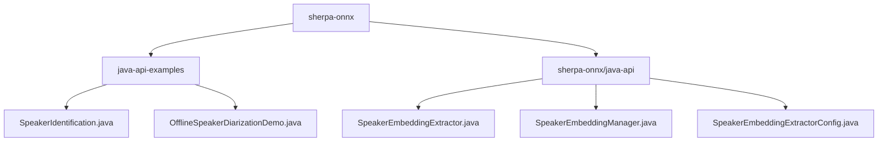
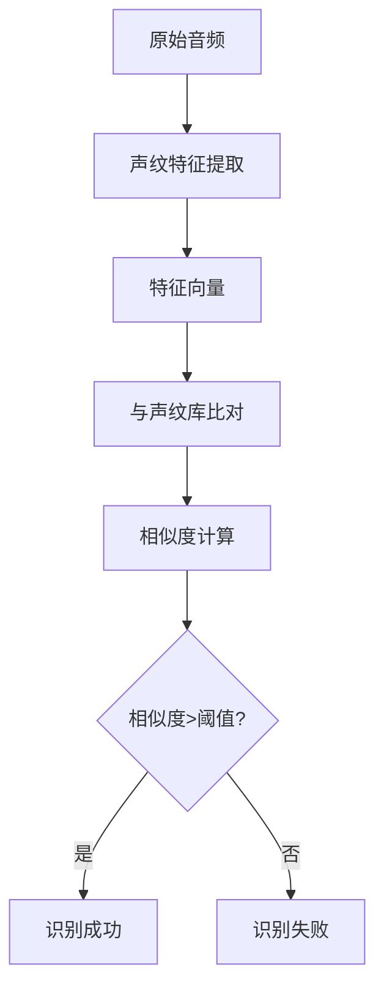
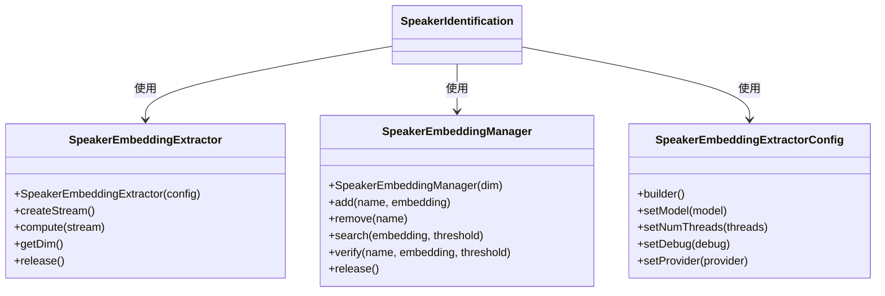
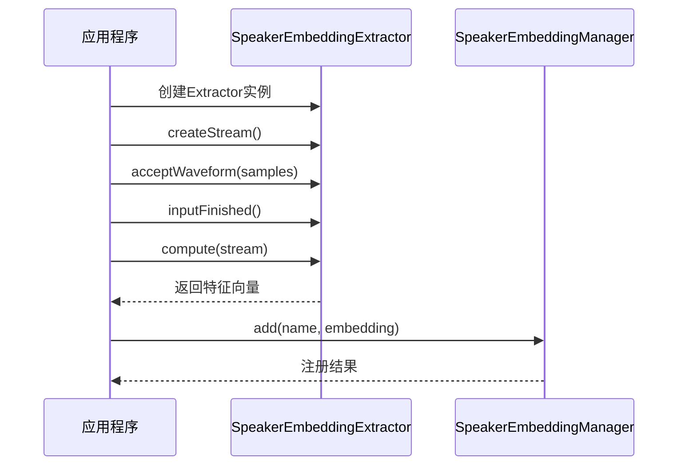
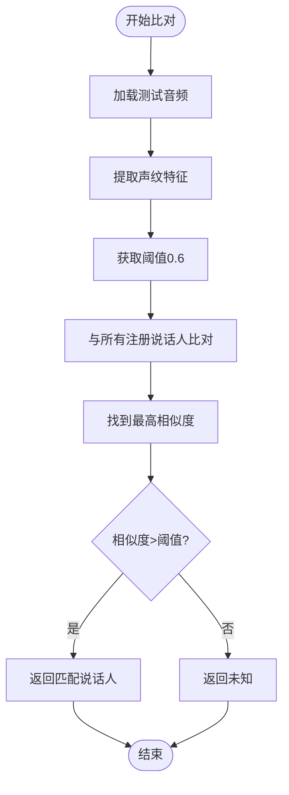

# 说话人识别示例

<cite>
**本文档中引用的文件**  
- [SpeakerIdentification.java](file://java-api-examples/SpeakerIdentification.java)
- [SpeakerEmbeddingExtractor.java](file://sherpa-onnx/java-api/src/main/java/com/k2fsa/sherpa/onnx/SpeakerEmbeddingExtractor.java)
- [SpeakerEmbeddingExtractorConfig.java](file://sherpa-onnx/java-api/src/main/java/com/k2fsa/sherpa/onnx/SpeakerEmbeddingExtractorConfig.java)
- [SpeakerEmbeddingManager.java](file://sherpa-onnx/java-api/src/main/java/com/k2fsa/sherpa/onnx/SpeakerEmbeddingManager.java)
- [OfflineSpeakerDiarizationDemo.java](file://java-api-examples/OfflineSpeakerDiarizationDemo.java)
- [OfflineSpeakerDiarizationConfig.java](file://sherpa-onnx/java-api/src/main/java/com/k2fsa/sherpa/onnx/OfflineSpeakerDiarizationConfig.java)
</cite>

## 目录
1. [项目结构](#项目结构)
2. [核心组件](#核心组件)
3. [说话人识别原理](#说话人识别原理)
4. [Java API使用详解](#java-api使用详解)
5. [声纹特征提取与注册](#声纹特征提取与注册)
6. [说话人比对与验证](#说话人比对与验证)
7. [模型配置与参数](#模型配置与参数)
8. [音频输入处理流程](#音频输入处理流程)
9. [性能优化与准确率提升](#性能优化与准确率提升)
10. [应用场景实践](#应用场景实践)

## 项目结构

**图示来源**  
- [SpeakerIdentification.java](file://java-api-examples/SpeakerIdentification.java)
- [SpeakerEmbeddingExtractor.java](file://sherpa-onnx/java-api/src/main/java/com/k2fsa/sherpa/onnx/SpeakerEmbeddingExtractor.java)
- [SpeakerEmbeddingManager.java](file://sherpa-onnx/java-api/src/main/java/com/k2fsa/sherpa/onnx/SpeakerEmbeddingManager.java)

**本节来源**  
- [SpeakerIdentification.java](file://java-api-examples/SpeakerIdentification.java)
- [OfflineSpeakerDiarizationDemo.java](file://java-api-examples/OfflineSpeakerDiarizationDemo.java)

## 核心组件

说话人识别功能主要由三个核心Java类构成：`SpeakerEmbeddingExtractor`用于提取声纹特征，`SpeakerEmbeddingManager`用于管理说话人库，`SpeakerEmbeddingExtractorConfig`用于配置提取器参数。这些组件协同工作，实现了从音频输入到说话人识别的完整流程。

**本节来源**  
- [SpeakerEmbeddingExtractor.java](file://sherpa-onnx/java-api/src/main/java/com/k2fsa/sherpa/onnx/SpeakerEmbeddingExtractor.java)
- [SpeakerEmbeddingManager.java](file://sherpa-onnx/java-api/src/main/java/com/k2fsa/sherpa/onnx/SpeakerEmbeddingManager.java)
- [SpeakerEmbeddingExtractorConfig.java](file://sherpa-onnx/java-api/src/main/java/com/k2fsa/sherpa/onnx/SpeakerEmbeddingExtractorConfig.java)

## 说话人识别原理

说话人识别基于深度学习模型提取音频的声纹特征向量，这些向量能够唯一标识说话人的声音特性。系统通过比较测试音频的特征向量与已注册说话人声纹库中的向量，计算相似度得分，从而实现说话人识别。相似度得分超过预设阈值时，系统判定为匹配。

**图示来源**  
- [SpeakerIdentification.java](file://java-api-examples/SpeakerIdentification.java)
- [SpeakerEmbeddingExtractor.java](file://sherpa-onnx/java-api/src/main/java/com/k2fsa/sherpa/onnx/SpeakerEmbeddingExtractor.java)

## Java API使用详解

### SpeakerEmbeddingExtractor
`SpeakerEmbeddingExtractor`类负责从音频文件中提取声纹特征。通过`createStream()`创建处理流，使用`acceptWaveform()`输入音频数据，调用`compute()`方法生成特征向量。

### SpeakerEmbeddingManager
`SpeakerEmbeddingManager`类管理说话人声纹库，提供注册、删除、搜索和验证等操作。通过`add()`方法注册说话人，`search()`方法进行说话人识别，`verify()`方法验证特定说话人身份。

### SpeakerEmbeddingExtractorConfig
`SpeakerEmbeddingExtractorConfig`类配置提取器参数，包括模型路径、线程数、调试模式和运行设备等。

**图示来源**  
- [SpeakerEmbeddingExtractor.java](file://sherpa-onnx/java-api/src/main/java/com/k2fsa/sherpa/onnx/SpeakerEmbeddingExtractor.java)
- [SpeakerEmbeddingManager.java](file://sherpa-onnx/java-api/src/main/java/com/k2fsa/sherpa/onnx/SpeakerEmbeddingManager.java)
- [SpeakerEmbeddingExtractorConfig.java](file://sherpa-onnx/java-api/src/main/java/com/k2fsa/sherpa/onnx/SpeakerEmbeddingExtractorConfig.java)

**本节来源**  
- [SpeakerEmbeddingExtractor.java](file://sherpa-onnx/java-api/src/main/java/com/k2fsa/sherpa/onnx/SpeakerEmbeddingExtractor.java)
- [SpeakerEmbeddingManager.java](file://sherpa-onnx/java-api/src/main/java/com/k2fsa/sherpa/onnx/SpeakerEmbeddingManager.java)
- [SpeakerEmbeddingExtractorConfig.java](file://sherpa-onnx/java-api/src/main/java/com/k2fsa/sherpa/onnx/SpeakerEmbeddingExtractorConfig.java)

## 声纹特征提取与注册

声纹特征提取过程包括：创建`SpeakerEmbeddingExtractor`实例，加载预训练模型；读取音频文件，创建处理流；输入音频数据并完成处理；调用`compute()`方法生成特征向量。注册过程通过`SpeakerEmbeddingManager`的`add()`方法将提取的特征向量与说话人名称关联存储。

**图示来源**  
- [SpeakerIdentification.java](file://java-api-examples/SpeakerIdentification.java)
- [SpeakerEmbeddingExtractor.java](file://sherpa-onnx/java-api/src/main/java/com/k2fsa/sherpa/onnx/SpeakerEmbeddingExtractor.java)
- [SpeakerEmbeddingManager.java](file://sherpa-onnx/java-api/src/main/java/com/k2fsa/sherpa/onnx/SpeakerEmbeddingManager.java)

**本节来源**  
- [SpeakerIdentification.java](file://java-api-examples/SpeakerIdentification.java)

## 说话人比对与验证

说话人比对使用`search()`方法，将测试音频的特征向量与声纹库中所有说话人进行相似度计算，返回相似度最高的匹配结果。说话人验证使用`verify()`方法，验证特定说话人身份，返回布尔值表示是否匹配。两种操作都使用阈值参数控制匹配的严格程度。

**图示来源**  
- [SpeakerIdentification.java](file://java-api-examples/SpeakerIdentification.java)
- [SpeakerEmbeddingManager.java](file://sherpa-onnx/java-api/src/main/java/com/k2fsa/sherpa/onnx/SpeakerEmbeddingManager.java)

**本节来源**  
- [SpeakerIdentification.java](file://java-api-examples/SpeakerIdentification.java)

## 模型配置与参数

`SpeakerEmbeddingExtractorConfig`提供了关键的配置参数：
- **模型路径**: 指定预训练的声纹识别模型文件
- **线程数**: 控制并行处理的线程数量
- **调试模式**: 启用或禁用调试信息输出
- **运行设备**: 指定CPU或GPU等计算设备

这些参数通过Builder模式进行配置，确保了配置的灵活性和类型安全。

**本节来源**  
- [SpeakerEmbeddingExtractorConfig.java](file://sherpa-onnx/java-api/src/main/java/com/k2fsa/sherpa/onnx/SpeakerEmbeddingExtractorConfig.java)

## 音频输入处理流程

音频输入处理流程包括：读取WAV格式音频文件，确保采样率匹配；将音频数据归一化到[-1,1]范围；通过`acceptWaveform()`方法输入到处理流；调用`inputFinished()`标记输入结束；最后提取特征向量。系统支持多种音频格式，但推荐使用16kHz采样率的单声道WAV文件以获得最佳效果。

**本节来源**  
- [SpeakerIdentification.java](file://java-api-examples/SpeakerIdentification.java)
- [SpeakerEmbeddingExtractor.java](file://sherpa-onnx/java-api/src/main/java/com/k2fsa/sherpa/onnx/SpeakerEmbeddingExtractor.java)

## 性能优化与准确率提升

为提高说话人识别的准确率和性能，建议：
1. 使用高质量、无噪声的注册音频
2. 多个不同时间段的音频样本进行注册
3. 调整相似度阈值以平衡误识率和拒识率
4. 优化模型推理性能，减少延迟
5. 定期更新和维护声纹库

**本节来源**  
- [SpeakerIdentification.java](file://java-api-examples/SpeakerIdentification.java)

## 应用场景实践

说话人识别技术可应用于：
- **安全认证**: 替代密码或PIN码的身份验证
- **个性化服务**: 根据识别的用户提供定制化服务
- **智能家居**: 不同家庭成员的个性化控制
- **客服系统**: 自动识别客户身份并调取历史记录
- **会议系统**: 自动标注会议录音中的发言者

这些应用需要结合具体业务场景进行定制开发，确保识别准确率和用户体验。

**本节来源**  
- [SpeakerIdentification.java](file://java-api-examples/SpeakerIdentification.java)
- [OfflineSpeakerDiarizationDemo.java](file://java-api-examples/OfflineSpeakerDiarizationDemo.java)