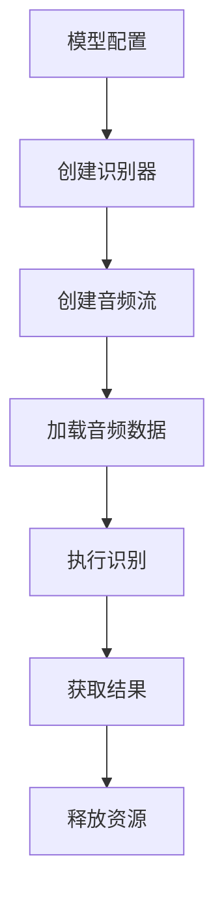
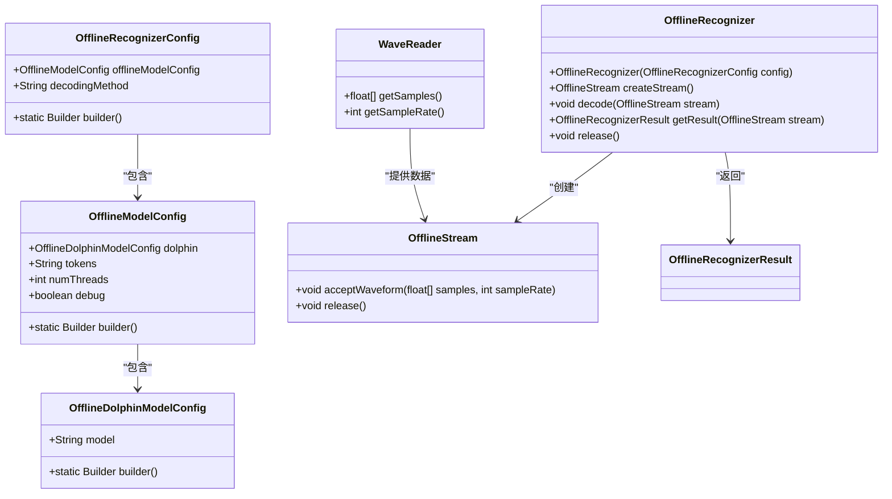
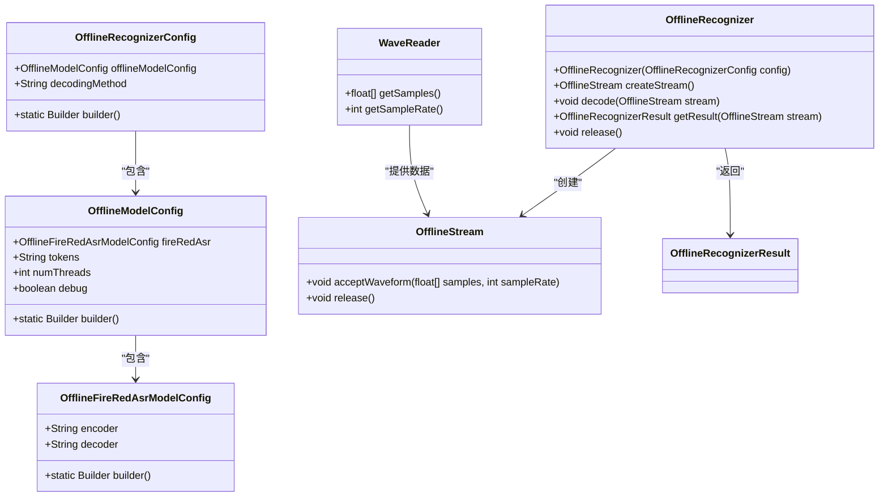
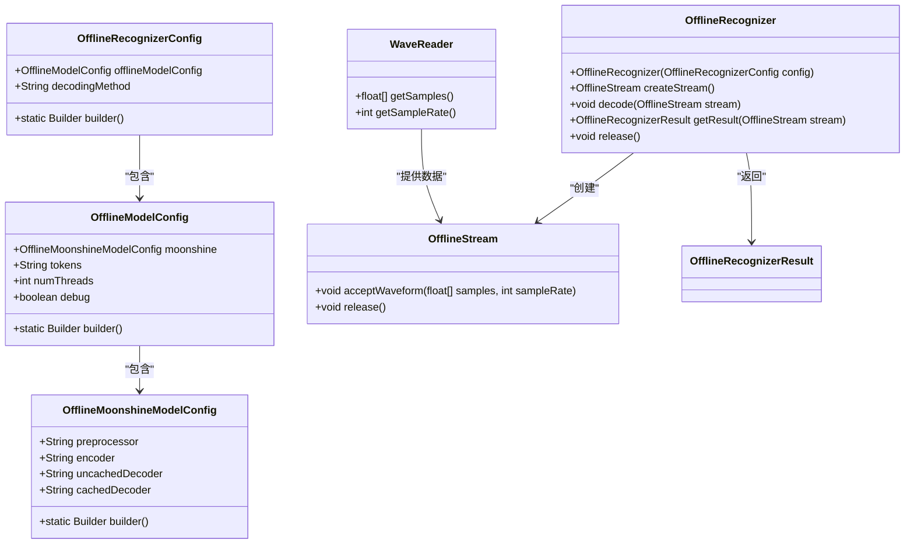
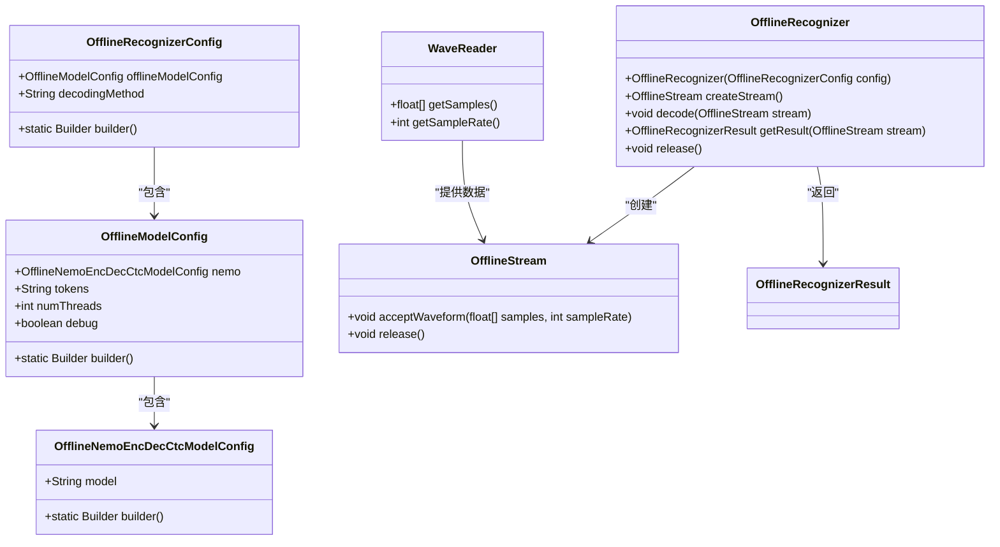
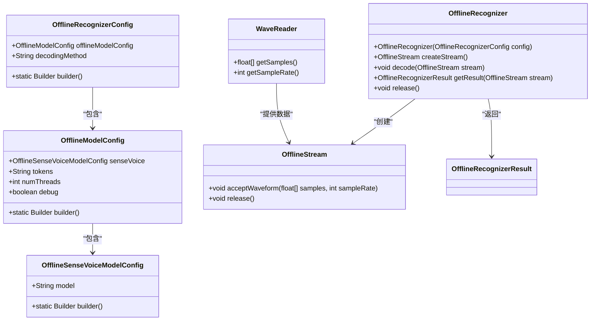
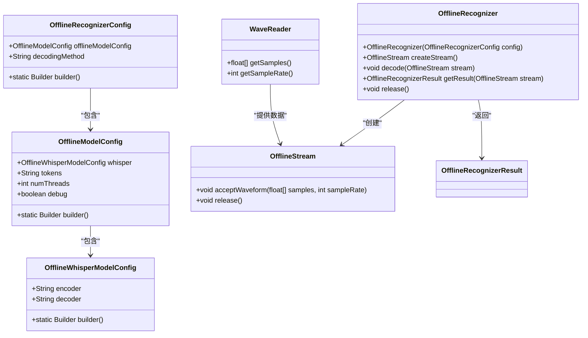
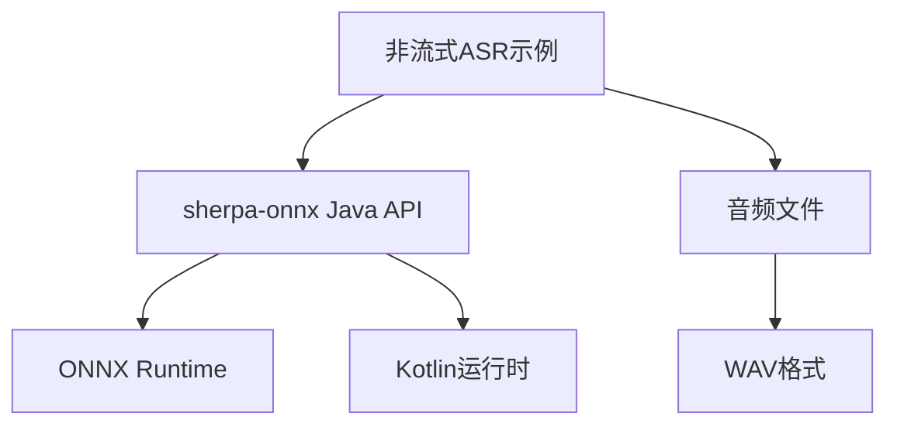

# 非流式语音识别示例

<cite>
**本文档中引用的文件**  
- [NonStreamingDecodeFileDolphinCtc.java](file://java-api-examples/NonStreamingDecodeFileDolphinCtc.java)
- [NonStreamingDecodeFileFireRedAsr.java](file://java-api-examples/NonStreamingDecodeFileFireRedAsr.java)
- [NonStreamingDecodeFileMoonshine.java](file://java-api-examples/NonStreamingDecodeFileMoonshine.java)
- [NonStreamingDecodeFileNemo.java](file://java-api-examples/NonStreamingDecodeFileNemo.java)
- [NonStreamingDecodeFileSenseVoice.java](file://java-api-examples/NonStreamingDecodeFileSenseVoice.java)
- [NonStreamingDecodeFileWhisper.java](file://java-api-examples/NonStreamingDecodeFileWhisper.java)
- [NonStreamingDecodeFileZipformerCtc.java](file://java-api-examples/NonStreamingDecodeFileZipformerCtc.java)
- [NonStreamingDecodeFileWenetCtc.java](file://java-api-examples/NonStreamingDecodeFileWenetCtc.java)
- [NonStreamingDecodeFileOmnilingualAsrCtc.java](file://java-api-examples/NonStreamingDecodeFileOmnilingualAsrCtc.java)
- [NonStreamingDecodeFileTransducer.java](file://java-api-examples/NonStreamingDecodeFileTransducer.java)
- [WaveReader.java](file://java-api-examples/WaveReader.java)
- [OfflineRecognizer.java](file://sherpa-onnx/java-api/src/main/java/com/k2fsa/sherpa/onnx/OfflineRecognizer.java)
- [OfflineStream.java](file://sherpa-onnx/java-api/src/main/java/com/k2fsa/sherpa/onnx/OfflineStream.java)
</cite>

## 目录
1. [简介](#简介)
2. [项目结构](#项目结构)
3. [核心组件](#核心组件)
4. [架构概述](#架构概述)
5. [详细组件分析](#详细组件分析)
6. [依赖分析](#依赖分析)
7. [性能考虑](#性能考虑)
8. [故障排除指南](#故障排除指南)
9. [结论](#结论)

## 简介
本文档详细介绍了sherpa-onnx Java API中非流式语音识别示例的实现。文档系统性地组织和解释了多种模型（包括Dolphin CTC、FireRed ASR、Moonshine、Nemo、SenseVoice、Whisper等）的使用方法。通过分析Java类的结构、方法调用流程和参数配置，展示了如何加载模型文件、配置识别参数以及处理识别结果。同时提供了完整的代码示例和运行说明，包括输入音频文件的格式要求和输出文本的处理方式。

## 项目结构
sherpa-onnx项目的Java API示例位于`java-api-examples`目录下，该目录包含了多个非流式语音识别示例文件，每个文件对应不同的语音识别模型。这些示例文件展示了如何使用离线模型进行语音识别。

```mermaid
graph TD
A[java-api-examples] --> B[NonStreamingDecodeFileDolphinCtc.java]
A --> C[NonStreamingDecodeFileFireRedAsr.java]
A --> D[NonStreamingDecodeFileMoonshine.java]
A --> E[NonStreamingDecodeFileNemo.java]
A --> F[NonStreamingDecodeFileSenseVoice.java]
A --> G[NonStreamingDecodeFileWhisper.java]
A --> H[NonStreamingDecodeFileZipformerCtc.java]
A --> I[NonStreamingDecodeFileWenetCtc.java]
A --> J[NonStreamingDecodeFileOmnilingualAsrCtc.java]
A --> K[NonStreamingDecodeFileTransducer.java]
A --> L[WaveReader.java]
```

**图示来源**
- [NonStreamingDecodeFileDolphinCtc.java](file://java-api-examples/NonStreamingDecodeFileDolphinCtc.java)
- [NonStreamingDecodeFileFireRedAsr.java](file://java-api-examples/NonStreamingDecodeFileFireRedAsr.java)
- [NonStreamingDecodeFileMoonshine.java](file://java-api-examples/NonStreamingDecodeFileMoonshine.java)

**节来源**
- [java-api-examples](file://java-api-examples)

## 核心组件
非流式语音识别示例的核心组件包括`OfflineRecognizer`、`OfflineStream`和`WaveReader`类。这些组件共同实现了从音频文件读取到语音识别的完整流程。

**节来源**
- [OfflineRecognizer.java](file://sherpa-onnx/java-api/src/main/java/com/k2fsa/sherpa/onnx/OfflineRecognizer.java)
- [OfflineStream.java](file://sherpa-onnx/java-api/src/main/java/com/k2fsa/sherpa/onnx/OfflineStream.java)
- [WaveReader.java](file://java-api-examples/WaveReader.java)

## 架构概述
非流式语音识别的架构主要包括模型配置、识别器创建、音频流处理和结果获取四个主要步骤。该架构设计简洁，易于理解和使用。

**图示来源**
- [NonStreamingDecodeFileDolphinCtc.java](file://java-api-examples/NonStreamingDecodeFileDolphinCtc.java#L20-L35)
- [NonStreamingDecodeFileFireRedAsr.java](file://java-api-examples/NonStreamingDecodeFileFireRedAsr.java#L20-L35)

## 详细组件分析

### Dolphin CTC 模型分析
Dolphin CTC模型示例展示了如何使用多语言CTC模型进行语音识别。该示例通过`OfflineDolphinModelConfig`配置模型参数，并使用`OfflineRecognizer`进行识别。

**图示来源**
- [NonStreamingDecodeFileDolphinCtc.java](file://java-api-examples/NonStreamingDecodeFileDolphinCtc.java)
- [OfflineDolphinModelConfig.java](file://sherpa-onnx/java-api/src/main/java/com/k2fsa/sherpa/onnx/OfflineDolphinModelConfig.java)

### FireRed ASR 模型分析
FireRed ASR模型示例展示了如何使用AED（Attention-Enhanced Decoder）模型进行语音识别。该模型需要分别配置编码器和解码器。

**图示来源**
- [NonStreamingDecodeFileFireRedAsr.java](file://java-api-examples/NonStreamingDecodeFileFireRedAsr.java)
- [OfflineFireRedAsrModelConfig.java](file://sherpa-onnx/java-api/src/main/java/com/k2fsa/sherpa/onnx/OfflineFireRedAsrModelConfig.java)

### Moonshine 模型分析
Moonshine模型示例展示了如何使用包含预处理器、编码器和解码器的复杂模型进行语音识别。该模型特别适用于英语语音识别。

**图示来源**
- [NonStreamingDecodeFileMoonshine.java](file://java-api-examples/NonStreamingDecodeFileMoonshine.java)
- [OfflineMoonshineModelConfig.java](file://sherpa-onnx/java-api/src/main/java/com/k2fsa/sherpa/onnx/OfflineMoonshineModelConfig.java)

### Nemo 模型分析
Nemo模型示例展示了如何使用NeMo CTC模型进行语音识别。该模型基于Citrinet架构，适用于英语语音识别。

**图示来源**
- [NonStreamingDecodeFileNemo.java](file://java-api-examples/NonStreamingDecodeFileNemo.java)
- [OfflineNemoEncDecCtcModelConfig.java](file://sherpa-onnx/java-api/src/main/java/com/k2fsa/sherpa/onnx/OfflineNemoEncDecCtcModelConfig.java)

### SenseVoice 模型分析
SenseVoice模型示例展示了如何使用多语言语音识别模型进行识别。该模型支持中文、英语、日语、韩语和粤语等多种语言。

**图示来源**
- [NonStreamingDecodeFileSenseVoice.java](file://java-api-examples/NonStreamingDecodeFileSenseVoice.java)
- [OfflineSenseVoiceModelConfig.java](file://sherpa-onnx/java-api/src/main/java/com/k2fsa/sherpa/onnx/OfflineSenseVoiceModelConfig.java)

### Whisper 模型分析
Whisper模型示例展示了如何使用流行的Whisper模型进行语音识别。该模型需要分别配置编码器和解码器ONNX文件。

**图示来源**
- [NonStreamingDecodeFileWhisper.java](file://java-api-examples/NonStreamingDecodeFileWhisper.java)
- [OfflineWhisperModelConfig.java](file://sherpa-onnx/java-api/src/main/java/com/k2fsa/sherpa/onnx/OfflineWhisperModelConfig.java)

## 依赖分析
非流式语音识别示例的依赖关系清晰，主要依赖于sherpa-onnx的Java API核心库。这些示例通过Maven或Gradle构建系统管理依赖。

**图示来源**
- [pom.xml](file://pom.xml)
- [build.gradle](file://java-api-examples/build.gradle)

**节来源**
- [pom.xml](file://pom.xml)
- [build.gradle](file://java-api-examples/build.gradle)

## 性能考虑
在使用非流式语音识别时，需要考虑以下几个性能因素：
- 模型大小：较大的模型通常提供更好的识别准确率，但需要更多的内存和计算资源
- 线程数：可以通过`numThreads`参数配置使用的线程数，以平衡性能和资源消耗
- 解码方法：不同的解码方法（如greedy_search）会影响识别速度和准确率
- 音频格式：WAV格式的音频文件可以直接使用，而其他格式可能需要转换

## 故障排除指南
在使用非流式语音识别示例时，可能会遇到以下常见问题：
- 模型文件路径错误：确保模型文件路径正确，并且文件存在
- 音频文件格式不支持：确保使用支持的音频格式（如WAV）
- 内存不足：对于大型模型，可能需要增加JVM的内存分配
- ONNX Runtime版本不兼容：确保使用的ONNX Runtime版本与模型兼容

**节来源**
- [README.md](file://java-api-examples/README.md)
- [NonStreamingDecodeFileDolphinCtc.java](file://java-api-examples/NonStreamingDecodeFileDolphinCtc.java)

## 结论
sherpa-onnx的Java API提供了强大而灵活的非流式语音识别功能。通过本文档介绍的示例，开发者可以轻松地将多种语音识别模型集成到自己的Java应用中。这些示例展示了如何配置不同类型的模型、加载音频数据、执行识别和处理结果。通过合理配置参数和优化性能，可以在各种应用场景中实现高效的语音识别。